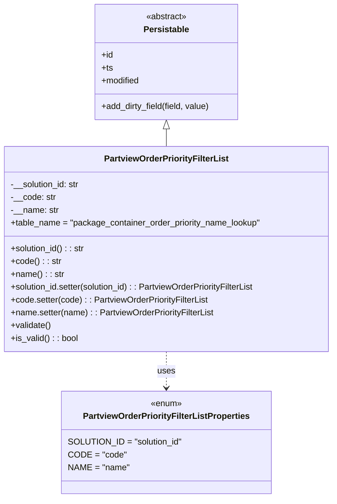

# Diagram: partview_core/partview_service/partview_service/core/datamodel/OrderPriorityFilterList.py

> Auto-generated by Obscura crawlers

## Mermaid

### SVG

<svg id="container" width="624.3359375" xmlns="http://www.w3.org/2000/svg" class="classDiagram" height="932" viewBox="0 0 624.3359375 932" role="graphics-document document" aria-roledescription="class"><g><defs><marker id="container_class-aggregationStart" class="marker aggregation class" refX="18" refY="7" markerWidth="190" markerHeight="240" orient="auto"><path d="M 18,7 L9,13 L1,7 L9,1 Z"></path></marker></defs><defs><marker id="container_class-aggregationEnd" class="marker aggregation class" refX="1" refY="7" markerWidth="20" markerHeight="28" orient="auto"><path d="M 18,7 L9,13 L1,7 L9,1 Z"></path></marker></defs><defs><marker id="container_class-extensionStart" class="marker extension class" refX="18" refY="7" markerWidth="190" markerHeight="240" orient="auto"><path d="M 1,7 L18,13 V 1 Z"></path></marker></defs><defs><marker id="container_class-extensionEnd" class="marker extension class" refX="1" refY="7" markerWidth="20" markerHeight="28" orient="auto"><path d="M 1,1 V 13 L18,7 Z"></path></marker></defs><defs><marker id="container_class-compositionStart" class="marker composition class" refX="18" refY="7" markerWidth="190" markerHeight="240" orient="auto"><path d="M 18,7 L9,13 L1,7 L9,1 Z"></path></marker></defs><defs><marker id="container_class-compositionEnd" class="marker composition class" refX="1" refY="7" markerWidth="20" markerHeight="28" orient="auto"><path d="M 18,7 L9,13 L1,7 L9,1 Z"></path></marker></defs><defs><marker id="container_class-dependencyStart" class="marker dependency class" refX="6" refY="7" markerWidth="190" markerHeight="240" orient="auto"><path d="M 5,7 L9,13 L1,7 L9,1 Z"></path></marker></defs><defs><marker id="container_class-dependencyEnd" class="marker dependency class" refX="13" refY="7" markerWidth="20" markerHeight="28" orient="auto"><path d="M 18,7 L9,13 L14,7 L9,1 Z"></path></marker></defs><defs><marker id="container_class-lollipopStart" class="marker lollipop class" refX="13" refY="7" markerWidth="190" markerHeight="240" orient="auto"><circle stroke="black" fill="transparent" cx="7" cy="7" r="6"></circle></marker></defs><defs><marker id="container_class-lollipopEnd" class="marker lollipop class" refX="1" refY="7" markerWidth="190" markerHeight="240" orient="auto"><circle stroke="black" fill="transparent" cx="7" cy="7" r="6"></circle></marker></defs><g class="root"><g class="clusters"></g><g class="edgePaths"><path d="M312.168,241.25L312.168,242.542C312.168,243.833,312.168,246.417,312.168,251.875C312.168,257.333,312.168,265.667,312.168,269.833L312.168,274" id="id_Persistable_PartviewOrderPriorityFilterList_1" class="edge-thickness-normal edge-pattern-solid relation" style=";;;" data-edge="true" data-et="edge" data-id="id_Persistable_PartviewOrderPriorityFilterList_1" data-points="W3sieCI6MzEyLjE2Nzk2ODc1LCJ5IjoyMjR9LHsieCI6MzEyLjE2Nzk2ODc1LCJ5IjoyNDl9LHsieCI6MzEyLjE2Nzk2ODc1LCJ5IjoyNzR9XQ==" marker-start="url(#container_class-extensionStart)"></path><path d="M312.168,658L312.168,664.167C312.168,670.333,312.168,682.667,312.168,694C312.168,705.333,312.168,715.667,312.168,720.833L312.168,726" id="id_PartviewOrderPriorityFilterList_PartviewOrderPriorityFilterListProperties_2" class="edge-thickness-normal edge-pattern-dashed relation" style=";;;" data-edge="true" data-et="edge" data-id="id_PartviewOrderPriorityFilterList_PartviewOrderPriorityFilterListProperties_2" data-points="W3sieCI6MzEyLjE2Nzk2ODc1LCJ5Ijo2NTh9LHsieCI6MzEyLjE2Nzk2ODc1LCJ5Ijo2OTV9LHsieCI6MzEyLjE2Nzk2ODc1LCJ5Ijo3MzJ9XQ==" marker-end="url(#container_class-dependencyEnd)"></path></g><g class="edgeLabels"><g class="edgeLabel"><g class="label" data-id="id_Persistable_PartviewOrderPriorityFilterList_1" transform="translate(0, 0)"><foreignObject width="0" height="0">

</foreignObject></g></g><g class="edgeLabel" transform="translate(312.16796875, 695)"><g class="label" data-id="id_PartviewOrderPriorityFilterList_PartviewOrderPriorityFilterListProperties_2" transform="translate(-16.4921875, -12)"><foreignObject width="32.984375" height="24">

uses

</foreignObject></g></g></g><g class="nodes"><g class="node default" id="classId-Persistable-0" transform="translate(312.16796875, 116)"><g class="basic label-container"><path d="M-135.71484375 -108 L135.71484375 -108 L135.71484375 108 L-135.71484375 108" stroke="none" stroke-width="0" fill="#ECECFF" style=""></path><path d="M-135.71484375 -108 C-29.22481361859758 -108, 77.26521651280484 -108, 135.71484375 -108 M-135.71484375 -108 C-55.9079921729452 -108, 23.8988594041096 -108, 135.71484375 -108 M135.71484375 -108 C135.71484375 -52.740430365012365, 135.71484375 2.5191392699752697, 135.71484375 108 M135.71484375 -108 C135.71484375 -50.802256299967546, 135.71484375 6.3954874000649085, 135.71484375 108 M135.71484375 108 C50.68454236914562 108, -34.345759011708765 108, -135.71484375 108 M135.71484375 108 C31.312825711719398 108, -73.0891923265612 108, -135.71484375 108 M-135.71484375 108 C-135.71484375 36.384107235646894, -135.71484375 -35.23178552870621, -135.71484375 -108 M-135.71484375 108 C-135.71484375 26.87606399799415, -135.71484375 -54.2478720040117, -135.71484375 -108" stroke="#9370DB" stroke-width="1.3" fill="none" stroke-dasharray="0 0" style=""></path></g><g class="annotation-group text" transform="translate(-38.609375, -84)"><g class="label" style="" transform="translate(0,-12)"><foreignObject width="77.21875" height="24">

«abstract»

</foreignObject></g></g><g class="label-group text" transform="translate(-40.9765625, -60)"><g class="label" style="font-weight: bolder" transform="translate(0,-12)"><foreignObject width="81.953125" height="24">

Persistable

</foreignObject></g></g><g class="members-group text" transform="translate(-123.71484375, -12)"><g class="label" style="" transform="translate(0,-12)"><foreignObject width="22.078125" height="24">

+id

</foreignObject></g><g class="label" style="" transform="translate(0,12)"><foreignObject width="21.15625" height="24">

+ts

</foreignObject></g><g class="label" style="" transform="translate(0,36)"><foreignObject width="72.609375" height="24">

+modified

</foreignObject></g></g><g class="methods-group text" transform="translate(-123.71484375, 84)"><g class="label" style="" transform="translate(0,-12)"><foreignObject width="206.453125" height="24">

+add_dirty_field(field, value)

</foreignObject></g></g><g class="divider" style=""><path d="M-135.71484375 -36 C-40.174122004030394 -36, 55.36659974193921 -36, 135.71484375 -36 M-135.71484375 -36 C-78.71002955238829 -36, -21.705215354776584 -36, 135.71484375 -36" stroke="#9370DB" stroke-width="1.3" fill="none" stroke-dasharray="0 0" style=""></path></g><g class="divider" style=""><path d="M-135.71484375 60 C-72.78594139841678 60, -9.857039046833577 60, 135.71484375 60 M-135.71484375 60 C-78.4397248214079 60, -21.164605892815814 60, 135.71484375 60" stroke="#9370DB" stroke-width="1.3" fill="none" stroke-dasharray="0 0" style=""></path></g></g><g class="node default" id="classId-PartviewOrderPriorityFilterListProperties-1" transform="translate(312.16796875, 828)"><g class="basic label-container"><path d="M-191.1171875 -96 L191.1171875 -96 L191.1171875 96 L-191.1171875 96" stroke="none" stroke-width="0" fill="#ECECFF" style=""></path><path d="M-191.1171875 -96 C-62.19215790375466 -96, 66.73287169249068 -96, 191.1171875 -96 M-191.1171875 -96 C-57.41091183834291 -96, 76.29536382331418 -96, 191.1171875 -96 M191.1171875 -96 C191.1171875 -27.404823289875367, 191.1171875 41.19035342024927, 191.1171875 96 M191.1171875 -96 C191.1171875 -23.154978186346156, 191.1171875 49.69004362730769, 191.1171875 96 M191.1171875 96 C43.392270499087715 96, -104.33264650182457 96, -191.1171875 96 M191.1171875 96 C66.37918500846838 96, -58.358817483063234 96, -191.1171875 96 M-191.1171875 96 C-191.1171875 21.717403502145487, -191.1171875 -52.565192995709026, -191.1171875 -96 M-191.1171875 96 C-191.1171875 53.539160958211426, -191.1171875 11.078321916422851, -191.1171875 -96" stroke="#9370DB" stroke-width="1.3" fill="none" stroke-dasharray="0 0" style=""></path></g><g class="annotation-group text" transform="translate(-29.53125, -72)"><g class="label" style="" transform="translate(0,-12)"><foreignObject width="59.0625" height="24">

«enum»

</foreignObject></g></g><g class="label-group text" transform="translate(-150.625, -48)"><g class="label" style="font-weight: bolder" transform="translate(0,-12)"><foreignObject width="301.25" height="24">

PartviewOrderPriorityFilterListProperties

</foreignObject></g></g><g class="members-group text" transform="translate(-179.1171875, 0)"><g class="label" style="" transform="translate(0,-12)"><foreignObject width="207.609375" height="24">

SOLUTION_ID = "solution_id"

</foreignObject></g><g class="label" style="" transform="translate(0,12)"><foreignObject width="102.46875" height="24">

CODE = "code"

</foreignObject></g><g class="label" style="" transform="translate(0,36)"><foreignObject width="110.71875" height="24">

NAME = "name"

</foreignObject></g></g><g class="methods-group text" transform="translate(-179.1171875, 96)"></g><g class="divider" style=""><path d="M-191.1171875 -24 C-84.0230549842801 -24, 23.071077531439812 -24, 191.1171875 -24 M-191.1171875 -24 C-94.24679330361842 -24, 2.6236008927631644 -24, 191.1171875 -24" stroke="#9370DB" stroke-width="1.3" fill="none" stroke-dasharray="0 0" style=""></path></g><g class="divider" style=""><path d="M-191.1171875 72 C-87.05156296962828 72, 17.014061560743443 72, 191.1171875 72 M-191.1171875 72 C-87.47730999364687 72, 16.16256751270626 72, 191.1171875 72" stroke="#9370DB" stroke-width="1.3" fill="none" stroke-dasharray="0 0" style=""></path></g></g><g class="node default" id="classId-PartviewOrderPriorityFilterList-2" transform="translate(312.16796875, 466)"><g class="basic label-container"><path d="M-304.16796875 -192 L304.16796875 -192 L304.16796875 192 L-304.16796875 192" stroke="none" stroke-width="0" fill="#ECECFF" style=""></path><path d="M-304.16796875 -192 C-84.47026647068486 -192, 135.22743580863028 -192, 304.16796875 -192 M-304.16796875 -192 C-121.303677965502 -192, 61.56061281899599 -192, 304.16796875 -192 M304.16796875 -192 C304.16796875 -107.46141868292577, 304.16796875 -22.922837365851535, 304.16796875 192 M304.16796875 -192 C304.16796875 -47.744350758634624, 304.16796875 96.51129848273075, 304.16796875 192 M304.16796875 192 C114.81240648362947 192, -74.54315578274105 192, -304.16796875 192 M304.16796875 192 C166.39950471206217 192, 28.631040674124336 192, -304.16796875 192 M-304.16796875 192 C-304.16796875 100.71845884978936, -304.16796875 9.436917699578714, -304.16796875 -192 M-304.16796875 192 C-304.16796875 50.581741382316466, -304.16796875 -90.83651723536707, -304.16796875 -192" stroke="#9370DB" stroke-width="1.3" fill="none" stroke-dasharray="0 0" style=""></path></g><g class="annotation-group text" transform="translate(0, -168)"></g><g class="label-group text" transform="translate(-112.3203125, -168)"><g class="label" style="font-weight: bolder" transform="translate(0,-12)"><foreignObject width="224.640625" height="24">

PartviewOrderPriorityFilterList

</foreignObject></g></g><g class="members-group text" transform="translate(-292.16796875, -120)"><g class="label" style="" transform="translate(0,-12)"><foreignObject width="131.390625" height="24">

-__solution_id: str

</foreignObject></g><g class="label" style="" transform="translate(0,12)"><foreignObject width="83.796875" height="24">

-__code: str

</foreignObject></g><g class="label" style="" transform="translate(0,36)"><foreignObject width="89.671875" height="24">

-__name: str

</foreignObject></g><g class="label" style="" transform="translate(0,60)"><foreignObject width="472.015625" height="24">

+table_name = "package_container_order_priority_name_lookup"

</foreignObject></g></g><g class="methods-group text" transform="translate(-292.16796875, 0)"><g class="label" style="" transform="translate(0,-12)"><foreignObject width="140.40625" height="24">

+solution_id() : : str

</foreignObject></g><g class="label" style="" transform="translate(0,12)"><foreignObject width="93.140625" height="24">

+code() : : str

</foreignObject></g><g class="label" style="" transform="translate(0,36)"><foreignObject width="98.703125" height="24">

+name() : : str

</foreignObject></g><g class="label" style="" transform="translate(0,60)"><foreignObject width="468.234375" height="24">

+solution_id.setter(solution_id) : : PartviewOrderPriorityFilterList

</foreignObject></g><g class="label" style="" transform="translate(0,84)"><foreignObject width="373.546875" height="24">

+code.setter(code) : : PartviewOrderPriorityFilterList

</foreignObject></g><g class="label" style="" transform="translate(0,108)"><foreignObject width="384.65625" height="24">

+name.setter(name) : : PartviewOrderPriorityFilterList

</foreignObject></g><g class="label" style="" transform="translate(0,132)"><foreignObject width="76.09375" height="24">

+validate()

</foreignObject></g><g class="label" style="" transform="translate(0,156)"><foreignObject width="126.078125" height="24">

+is_valid() : : bool

</foreignObject></g></g><g class="divider" style=""><path d="M-304.16796875 -144 C-152.95887976173645 -144, -1.7497907734729097 -144, 304.16796875 -144 M-304.16796875 -144 C-88.56067268771346 -144, 127.04662337457307 -144, 304.16796875 -144" stroke="#9370DB" stroke-width="1.3" fill="none" stroke-dasharray="0 0" style=""></path></g><g class="divider" style=""><path d="M-304.16796875 -24 C-79.44247213352006 -24, 145.2830244829599 -24, 304.16796875 -24 M-304.16796875 -24 C-147.5204468337582 -24, 9.1270750824836 -24, 304.16796875 -24" stroke="#9370DB" stroke-width="1.3" fill="none" stroke-dasharray="0 0" style=""></path></g></g></g></g></g></svg>
