# Diagram: partview_core/partview_service/partview_service/core/datamodel/PackageContainer.py

> Auto-generated by Obscura crawlers

## Mermaid

```mermaid
classDiagram
    class Persistable {
        <<abstract>>
        +id: str
        +ts: datetime
        +modified: datetime
        +is_valid(): bool
        +to_dict(): dict
    }
    class PackageContainer {
        +SOLUTION_ID: str
        +TRACKING_NUMBER: str
        +DESCRIPTION: str
        +LIFECYCLE_STATE: str
        +STATUS: str
        +LAST_REPORTED_TS: str
        -__solution_id: str
        -__tracking_number: str
        -__description: str
        -__lifecycle_state: str
        -__lifecycle_change_ts: datetime
        -__status: str
        -__last_reported_ts: datetime
        -__destination_eta: datetime
        -__eta_update_ts: datetime
        -__remaining_distance: str
        -__origin_location_code: str
        -__destination_location_code: str
        -__last_milestone_id: str
        -__last_event_id: str
        -__route_id: str
        -__rfid_tag_id: str
        -__classification_id: str
        -__container_type_id: str
        -__original_unit_of_measurement: str
        -__weight: float
        -__owner_org_fv_id: str
        -__manufacturer: str
        -__number_of_shipments: int
        -__order_csl: str
        -__freight_piece_number: str
        -__commodity_code: str
        -__pro_number: str
        -__container_identifier: str
        -__parts_per_container: int
        -__internal_doc_identifier: str
        -__actor_id: str
        -__organizational_unit: str
        -__trailer_equipment_number: str
        -__customer_number: str
        -__delayed_ts: datetime
        -__effective_destination_eta: datetime
        -__next_milestone_eta: datetime|str
        +PackageContainer(id=None, ts=None, modified=None)
        +solution_id: str
        +actor_id: str
        +description: str
        +lifecycle_state: str
        +lifecycle_change_ts: datetime
        +status: str
        +last_reported_ts: datetime
        +last_event_id: str
        +last_milestone_id: str
        +route_id: str
        +rfid_tag_id: str
        +classification_id: str
        +container_type_id: str
        +tracking_number: str
        +external_id: str
        +original_unit_of_measurement: str
        +weight: float
        +owner_org_fv_id: str
        +manufacturer: str
        +number_of_shipments: int
        +destination_departed_ts: datetime
        +destination_arrived_ts: datetime
        +origin_departed_ts: datetime
        +origin_arrived_ts: datetime
        +destination_eta: datetime
        +remaining_distance: str
        +entity_type_id: str
        +order_csl: str
        +freight_piece_number: str
        +commodity_code: str
        +pro_number: str
        +container_identifier: str
        +parts_per_container: int
        +internal_doc_identifier: str
        +origin_actual_trip_leg_id: str
        +origin_planned_trip_leg_id: str
        +destination_actual_trip_leg_id: str
        +destination_planned_trip_leg_id: str
        +origin_location_code: str
        +destination_location_code: str
        +organizational_unit: str
        +trailer_equipment_number: str
        +customer_number: str
        +delayed_ts: datetime
        +effective_destination_eta: datetime
        +next_milestone_eta: str|datetime
        +set_delayed_ts(delayed_ts: datetime): PackageContainer
        +set_effective_destination_eta(effective_destination_eta: datetime): PackageContainer
        +is_valid(): bool
        +to_dict(): dict
        +is_empty(): bool
    }
    Persistable <|-- PackageContainer
```

### SVG

<svg id="container" width="744.8125" xmlns="http://www.w3.org/2000/svg" class="classDiagram" height="2682" viewBox="0 0 744.8125 2682" role="graphics-document document" aria-roledescription="class"><g><defs><marker id="container_class-aggregationStart" class="marker aggregation class" refX="18" refY="7" markerWidth="190" markerHeight="240" orient="auto"><path d="M 18,7 L9,13 L1,7 L9,1 Z"></path></marker></defs><defs><marker id="container_class-aggregationEnd" class="marker aggregation class" refX="1" refY="7" markerWidth="20" markerHeight="28" orient="auto"><path d="M 18,7 L9,13 L1,7 L9,1 Z"></path></marker></defs><defs><marker id="container_class-extensionStart" class="marker extension class" refX="18" refY="7" markerWidth="190" markerHeight="240" orient="auto"><path d="M 1,7 L18,13 V 1 Z"></path></marker></defs><defs><marker id="container_class-extensionEnd" class="marker extension class" refX="1" refY="7" markerWidth="20" markerHeight="28" orient="auto"><path d="M 1,1 V 13 L18,7 Z"></path></marker></defs><defs><marker id="container_class-compositionStart" class="marker composition class" refX="18" refY="7" markerWidth="190" markerHeight="240" orient="auto"><path d="M 18,7 L9,13 L1,7 L9,1 Z"></path></marker></defs><defs><marker id="container_class-compositionEnd" class="marker composition class" refX="1" refY="7" markerWidth="20" markerHeight="28" orient="auto"><path d="M 18,7 L9,13 L1,7 L9,1 Z"></path></marker></defs><defs><marker id="container_class-dependencyStart" class="marker dependency class" refX="6" refY="7" markerWidth="190" markerHeight="240" orient="auto"><path d="M 5,7 L9,13 L1,7 L9,1 Z"></path></marker></defs><defs><marker id="container_class-dependencyEnd" class="marker dependency class" refX="13" refY="7" markerWidth="20" markerHeight="28" orient="auto"><path d="M 18,7 L9,13 L14,7 L9,1 Z"></path></marker></defs><defs><marker id="container_class-lollipopStart" class="marker lollipop class" refX="13" refY="7" markerWidth="190" markerHeight="240" orient="auto"><circle stroke="black" fill="transparent" cx="7" cy="7" r="6"></circle></marker></defs><defs><marker id="container_class-lollipopEnd" class="marker lollipop class" refX="1" refY="7" markerWidth="190" markerHeight="240" orient="auto"><circle stroke="black" fill="transparent" cx="7" cy="7" r="6"></circle></marker></defs><g class="root"><g class="clusters"></g><g class="edgePaths"><path d="M372.406,265.25L372.406,266.542C372.406,267.833,372.406,270.417,372.406,275.875C372.406,281.333,372.406,289.667,372.406,293.833L372.406,298" id="id_Persistable_PackageContainer_1" class="edge-thickness-normal edge-pattern-solid relation" style=";;;" data-edge="true" data-et="edge" data-id="id_Persistable_PackageContainer_1" data-points="W3sieCI6MzcyLjQwNjI1LCJ5IjoyNDh9LHsieCI6MzcyLjQwNjI1LCJ5IjoyNzN9LHsieCI6MzcyLjQwNjI1LCJ5IjoyOTh9XQ==" marker-start="url(#container_class-extensionStart)"></path></g><g class="edgeLabels"><g class="edgeLabel"><g class="label" data-id="id_Persistable_PackageContainer_1" transform="translate(0, 0)"><foreignObject width="0" height="0">

</foreignObject></g></g></g><g class="nodes"><g class="node default" id="classId-Persistable-0" transform="translate(372.40625, 128)"><g class="basic label-container"><path d="M-105.45703125 -120 L105.45703125 -120 L105.45703125 120 L-105.45703125 120" stroke="none" stroke-width="0" fill="#ECECFF" style=""></path><path d="M-105.45703125 -120 C-27.304902580653007 -120, 50.847226088693986 -120, 105.45703125 -120 M-105.45703125 -120 C-45.30078462656758 -120, 14.855461996864847 -120, 105.45703125 -120 M105.45703125 -120 C105.45703125 -29.40593781507772, 105.45703125 61.18812436984456, 105.45703125 120 M105.45703125 -120 C105.45703125 -32.12442494043793, 105.45703125 55.751150119124134, 105.45703125 120 M105.45703125 120 C23.245143223546975 120, -58.96674480290605 120, -105.45703125 120 M105.45703125 120 C25.83546373080209 120, -53.78610378839582 120, -105.45703125 120 M-105.45703125 120 C-105.45703125 33.261082651546914, -105.45703125 -53.47783469690617, -105.45703125 -120 M-105.45703125 120 C-105.45703125 59.338303630175425, -105.45703125 -1.323392739649151, -105.45703125 -120" stroke="#9370DB" stroke-width="1.3" fill="none" stroke-dasharray="0 0" style=""></path></g><g class="annotation-group text" transform="translate(-38.609375, -96)"><g class="label" style="" transform="translate(0,-12)"><foreignObject width="77.21875" height="24">

«abstract»

</foreignObject></g></g><g class="label-group text" transform="translate(-40.9765625, -72)"><g class="label" style="font-weight: bolder" transform="translate(0,-12)"><foreignObject width="81.953125" height="24">

Persistable

</foreignObject></g></g><g class="members-group text" transform="translate(-93.45703125, -24)"><g class="label" style="" transform="translate(0,-12)"><foreignObject width="49.578125" height="24">

+id: str

</foreignObject></g><g class="label" style="" transform="translate(0,12)"><foreignObject width="94.484375" height="24">

+ts: datetime

</foreignObject></g><g class="label" style="" transform="translate(0,36)"><foreignObject width="145.9375" height="24">

+modified: datetime

</foreignObject></g></g><g class="methods-group text" transform="translate(-93.45703125, 72)"><g class="label" style="" transform="translate(0,-12)"><foreignObject width="126.078125" height="24">

+is_valid() : : bool

</foreignObject></g><g class="label" style="" transform="translate(0,12)"><foreignObject width="116.25" height="24">

+to_dict() : : dict

</foreignObject></g></g><g class="divider" style=""><path d="M-105.45703125 -48 C-45.022770372426 -48, 15.411490505147995 -48, 105.45703125 -48 M-105.45703125 -48 C-30.057004392269107 -48, 45.343022465461786 -48, 105.45703125 -48" stroke="#9370DB" stroke-width="1.3" fill="none" stroke-dasharray="0 0" style=""></path></g><g class="divider" style=""><path d="M-105.45703125 48 C-44.19203494699199 48, 17.072961356016023 48, 105.45703125 48 M-105.45703125 48 C-39.568610006905374 48, 26.319811236189253 48, 105.45703125 48" stroke="#9370DB" stroke-width="1.3" fill="none" stroke-dasharray="0 0" style=""></path></g></g><g class="node default" id="classId-PackageContainer-1" transform="translate(372.40625, 1486)"><g class="basic label-container"><path d="M-364.40625 -1188 L364.40625 -1188 L364.40625 1188 L-364.40625 1188" stroke="none" stroke-width="0" fill="#ECECFF" style=""></path><path d="M-364.40625 -1188 C-99.3888342973384 -1188, 165.6285814053232 -1188, 364.40625 -1188 M-364.40625 -1188 C-216.07391843218136 -1188, -67.74158686436272 -1188, 364.40625 -1188 M364.40625 -1188 C364.40625 -639.85180094189, 364.40625 -91.70360188378004, 364.40625 1188 M364.40625 -1188 C364.40625 -474.99238812833005, 364.40625 238.0152237433399, 364.40625 1188 M364.40625 1188 C88.52641880813144 1188, -187.35341238373712 1188, -364.40625 1188 M364.40625 1188 C90.59453897042675 1188, -183.2171720591465 1188, -364.40625 1188 M-364.40625 1188 C-364.40625 703.3628759246826, -364.40625 218.7257518493651, -364.40625 -1188 M-364.40625 1188 C-364.40625 291.07775379470206, -364.40625 -605.8444924105959, -364.40625 -1188" stroke="#9370DB" stroke-width="1.3" fill="none" stroke-dasharray="0 0" style=""></path></g><g class="annotation-group text" transform="translate(0, -1164)"></g><g class="label-group text" transform="translate(-65.453125, -1164)"><g class="label" style="font-weight: bolder" transform="translate(0,-12)"><foreignObject width="130.90625" height="24">

PackageContainer

</foreignObject></g></g><g class="members-group text" transform="translate(-352.40625, -1116)"><g class="label" style="" transform="translate(0,-12)"><foreignObject width="131.140625" height="24">

+SOLUTION_ID: str

</foreignObject></g><g class="label" style="" transform="translate(0,12)"><foreignObject width="176.046875" height="24">

+TRACKING_NUMBER: str

</foreignObject></g><g class="label" style="" transform="translate(0,36)"><foreignObject width="130.171875" height="24">

+DESCRIPTION: str

</foreignObject></g><g class="label" style="" transform="translate(0,60)"><foreignObject width="155.921875" height="24">

+LIFECYCLE_STATE: str

</foreignObject></g><g class="label" style="" transform="translate(0,84)"><foreignObject width="86.53125" height="24">

+STATUS: str

</foreignObject></g><g class="label" style="" transform="translate(0,108)"><foreignObject width="175.453125" height="24">

+LAST_REPORTED_TS: str

</foreignObject></g><g class="label" style="" transform="translate(0,132)"><foreignObject width="131.390625" height="24">

-__solution_id: str

</foreignObject></g><g class="label" style="" transform="translate(0,156)"><foreignObject width="172.328125" height="24">

-__tracking_number: str

</foreignObject></g><g class="label" style="" transform="translate(0,180)"><foreignObject width="131.453125" height="24">

-__description: str

</foreignObject></g><g class="label" style="" transform="translate(0,204)"><foreignObject width="152.640625" height="24">

-__lifecycle_state: str

</foreignObject></g><g class="label" style="" transform="translate(0,228)"><foreignObject width="234.875" height="24">

-__lifecycle_change_ts: datetime

</foreignObject></g><g class="label" style="" transform="translate(0,252)"><foreignObject width="93.5625" height="24">

-__status: str

</foreignObject></g><g class="label" style="" transform="translate(0,276)"><foreignObject width="214.0625" height="24">

-__last_reported_ts: datetime

</foreignObject></g><g class="label" style="" transform="translate(0,300)"><foreignObject width="208.890625" height="24">

-__destination_eta: datetime

</foreignObject></g><g class="label" style="" transform="translate(0,324)"><foreignObject width="198.03125" height="24">

-__eta_update_ts: datetime

</foreignObject></g><g class="label" style="" transform="translate(0,348)"><foreignObject width="191.5" height="24">

-__remaining_distance: str

</foreignObject></g><g class="label" style="" transform="translate(0,372)"><foreignObject width="201.359375" height="24">

-__origin_location_code: str

</foreignObject></g><g class="label" style="" transform="translate(0,396)"><foreignObject width="242.25" height="24">

-__destination_location_code: str

</foreignObject></g><g class="label" style="" transform="translate(0,420)"><foreignObject width="177.796875" height="24">

-__last_milestone_id: str

</foreignObject></g><g class="label" style="" transform="translate(0,444)"><foreignObject width="146.140625" height="24">

-__last_event_id: str

</foreignObject></g><g class="label" style="" transform="translate(0,468)"><foreignObject width="109.84375" height="24">

-__route_id: str

</foreignObject></g><g class="label" style="" transform="translate(0,492)"><foreignObject width="127.09375" height="24">

-__rfid_tag_id: str

</foreignObject></g><g class="label" style="" transform="translate(0,516)"><foreignObject width="165.734375" height="24">

-__classification_id: str

</foreignObject></g><g class="label" style="" transform="translate(0,540)"><foreignObject width="178.625" height="24">

-__container_type_id: str

</foreignObject></g><g class="label" style="" transform="translate(0,564)"><foreignObject width="271.5" height="24">

-__original_unit_of_measurement: str

</foreignObject></g><g class="label" style="" transform="translate(0,588)"><foreignObject width="110.71875" height="24">

-__weight: float

</foreignObject></g><g class="label" style="" transform="translate(0,612)"><foreignObject width="167.46875" height="24">

-__owner_org_fv_id: str

</foreignObject></g><g class="label" style="" transform="translate(0,636)"><foreignObject width="147.46875" height="24">

-__manufacturer: str

</foreignObject></g><g class="label" style="" transform="translate(0,660)"><foreignObject width="211.390625" height="24">

-__number_of_shipments: int

</foreignObject></g><g class="label" style="" transform="translate(0,684)"><foreignObject width="115.03125" height="24">

-__order_csl: str

</foreignObject></g><g class="label" style="" transform="translate(0,708)"><foreignObject width="208.671875" height="24">

-__freight_piece_number: str

</foreignObject></g><g class="label" style="" transform="translate(0,732)"><foreignObject width="172.40625" height="24">

-__commodity_code: str

</foreignObject></g><g class="label" style="" transform="translate(0,756)"><foreignObject width="138.671875" height="24">

-__pro_number: str

</foreignObject></g><g class="label" style="" transform="translate(0,780)"><foreignObject width="191.796875" height="24">

-__container_identifier: str

</foreignObject></g><g class="label" style="" transform="translate(0,804)"><foreignObject width="195.359375" height="24">

-__parts_per_container: int

</foreignObject></g><g class="label" style="" transform="translate(0,828)"><foreignObject width="215.6875" height="24">

-__internal_doc_identifier: str

</foreignObject></g><g class="label" style="" transform="translate(0,852)"><foreignObject width="107.375" height="24">

-__actor_id: str

</foreignObject></g><g class="label" style="" transform="translate(0,876)"><foreignObject width="189.46875" height="24">

-__organizational_unit: str

</foreignObject></g><g class="label" style="" transform="translate(0,900)"><foreignObject width="244.15625" height="24">

-__trailer_equipment_number: str

</foreignObject></g><g class="label" style="" transform="translate(0,924)"><foreignObject width="180.59375" height="24">

-__customer_number: str

</foreignObject></g><g class="label" style="" transform="translate(0,948)"><foreignObject width="173.375" height="24">

-__delayed_ts: datetime

</foreignObject></g><g class="label" style="" transform="translate(0,972)"><foreignObject width="279.03125" height="24">

-__effective_destination_eta: datetime

</foreignObject></g><g class="label" style="" transform="translate(0,996)"><foreignObject width="263.4375" height="24">

-__next_milestone_eta: datetime|str

</foreignObject></g><g class="label" style="" transform="translate(0,1020)"><foreignObject width="117.71875" height="24">

+solution_id: str

</foreignObject></g><g class="label" style="" transform="translate(0,1044)"><foreignObject width="93.78125" height="24">

+actor_id: str

</foreignObject></g><g class="label" style="" transform="translate(0,1068)"><foreignObject width="118.109375" height="24">

+description: str

</foreignObject></g><g class="label" style="" transform="translate(0,1092)"><foreignObject width="139.140625" height="24">

+lifecycle_state: str

</foreignObject></g><g class="label" style="" transform="translate(0,1116)"><foreignObject width="221.375" height="24">

+lifecycle_change_ts: datetime

</foreignObject></g><g class="label" style="" transform="translate(0,1140)"><foreignObject width="79.890625" height="24">

+status: str

</foreignObject></g><g class="label" style="" transform="translate(0,1164)"><foreignObject width="200.546875" height="24">

+last_reported_ts: datetime

</foreignObject></g><g class="label" style="" transform="translate(0,1188)"><foreignObject width="132.625" height="24">

+last_event_id: str

</foreignObject></g><g class="label" style="" transform="translate(0,1212)"><foreignObject width="164.296875" height="24">

+last_milestone_id: str

</foreignObject></g><g class="label" style="" transform="translate(0,1236)"><foreignObject width="96.1875" height="24">

+route_id: str

</foreignObject></g><g class="label" style="" transform="translate(0,1260)"><foreignObject width="113.4375" height="24">

+rfid_tag_id: str

</foreignObject></g><g class="label" style="" transform="translate(0,1284)"><foreignObject width="152.390625" height="24">

+classification_id: str

</foreignObject></g><g class="label" style="" transform="translate(0,1308)"><foreignObject width="165.28125" height="24">

+container_type_id: str

</foreignObject></g><g class="label" style="" transform="translate(0,1332)"><foreignObject width="158.90625" height="24">

+tracking_number: str

</foreignObject></g><g class="label" style="" transform="translate(0,1356)"><foreignObject width="117.265625" height="24">

+external_id: str

</foreignObject></g><g class="label" style="" transform="translate(0,1380)"><foreignObject width="258.15625" height="24">

+original_unit_of_measurement: str

</foreignObject></g><g class="label" style="" transform="translate(0,1404)"><foreignObject width="97.375" height="24">

+weight: float

</foreignObject></g><g class="label" style="" transform="translate(0,1428)"><foreignObject width="154.125" height="24">

+owner_org_fv_id: str

</foreignObject></g><g class="label" style="" transform="translate(0,1452)"><foreignObject width="133.796875" height="24">

+manufacturer: str

</foreignObject></g><g class="label" style="" transform="translate(0,1476)"><foreignObject width="197.71875" height="24">

+number_of_shipments: int

</foreignObject></g><g class="label" style="" transform="translate(0,1500)"><foreignObject width="260.046875" height="24">

+destination_departed_ts: datetime

</foreignObject></g><g class="label" style="" transform="translate(0,1524)"><foreignObject width="245.375" height="24">

+destination_arrived_ts: datetime

</foreignObject></g><g class="label" style="" transform="translate(0,1548)"><foreignObject width="219.140625" height="24">

+origin_departed_ts: datetime

</foreignObject></g><g class="label" style="" transform="translate(0,1572)"><foreignObject width="204.46875" height="24">

+origin_arrived_ts: datetime

</foreignObject></g><g class="label" style="" transform="translate(0,1596)"><foreignObject width="195.546875" height="24">

+destination_eta: datetime

</foreignObject></g><g class="label" style="" transform="translate(0,1620)"><foreignObject width="177.828125" height="24">

+remaining_distance: str

</foreignObject></g><g class="label" style="" transform="translate(0,1644)"><foreignObject width="138.84375" height="24">

+entity_type_id: str

</foreignObject></g><g class="label" style="" transform="translate(0,1668)"><foreignObject width="101.6875" height="24">

+order_csl: str

</foreignObject></g><g class="label" style="" transform="translate(0,1692)"><foreignObject width="195.078125" height="24">

+freight_piece_number: str

</foreignObject></g><g class="label" style="" transform="translate(0,1716)"><foreignObject width="159.0625" height="24">

+commodity_code: str

</foreignObject></g><g class="label" style="" transform="translate(0,1740)"><foreignObject width="125" height="24">

+pro_number: str

</foreignObject></g><g class="label" style="" transform="translate(0,1764)"><foreignObject width="178.453125" height="24">

+container_identifier: str

</foreignObject></g><g class="label" style="" transform="translate(0,1788)"><foreignObject width="181.6875" height="24">

+parts_per_container: int

</foreignObject></g><g class="label" style="" transform="translate(0,1812)"><foreignObject width="202.03125" height="24">

+internal_doc_identifier: str

</foreignObject></g><g class="label" style="" transform="translate(0,1836)"><foreignObject width="216.328125" height="24">

+origin_actual_trip_leg_id: str

</foreignObject></g><g class="label" style="" transform="translate(0,1860)"><foreignObject width="231.828125" height="24">

+origin_planned_trip_leg_id: str

</foreignObject></g><g class="label" style="" transform="translate(0,1884)"><foreignObject width="257.21875" height="24">

+destination_actual_trip_leg_id: str

</foreignObject></g><g class="label" style="" transform="translate(0,1908)"><foreignObject width="272.734375" height="24">

+destination_planned_trip_leg_id: str

</foreignObject></g><g class="label" style="" transform="translate(0,1932)"><foreignObject width="188.015625" height="24">

+origin_location_code: str

</foreignObject></g><g class="label" style="" transform="translate(0,1956)"><foreignObject width="228.90625" height="24">

+destination_location_code: str

</foreignObject></g><g class="label" style="" transform="translate(0,1980)"><foreignObject width="176.125" height="24">

+organizational_unit: str

</foreignObject></g><g class="label" style="" transform="translate(0,2004)"><foreignObject width="230.734375" height="24">

+trailer_equipment_number: str

</foreignObject></g><g class="label" style="" transform="translate(0,2028)"><foreignObject width="167.25" height="24">

+customer_number: str

</foreignObject></g><g class="label" style="" transform="translate(0,2052)"><foreignObject width="160.03125" height="24">

+delayed_ts: datetime

</foreignObject></g><g class="label" style="" transform="translate(0,2076)"><foreignObject width="265.6875" height="24">

+effective_destination_eta: datetime

</foreignObject></g><g class="label" style="" transform="translate(0,2100)"><foreignObject width="249.765625" height="24">

+next_milestone_eta: str|datetime

</foreignObject></g></g><g class="methods-group text" transform="translate(-352.40625, 1044)"><g class="label" style="" transform="translate(0,-12)"><foreignObject width="393.8125" height="24">

+PackageContainer(id=None, ts=None, modified=None)

</foreignObject></g><g class="label" style="" transform="translate(0,12)"><foreignObject width="428.03125" height="24">

+set_delayed_ts(delayed_ts: datetime) : : PackageContainer

</foreignObject></g><g class="label" style="" transform="translate(0,36)"><foreignObject width="639.359375" height="24">

+set_effective_destination_eta(effective_destination_eta: datetime) : : PackageContainer

</foreignObject></g><g class="label" style="" transform="translate(0,60)"><foreignObject width="126.078125" height="24">

+is_valid() : : bool

</foreignObject></g><g class="label" style="" transform="translate(0,84)"><foreignObject width="116.25" height="24">

+to_dict() : : dict

</foreignObject></g><g class="label" style="" transform="translate(0,108)"><foreignObject width="136.8125" height="24">

+is_empty() : : bool

</foreignObject></g></g><g class="divider" style=""><path d="M-364.40625 -1140 C-121.09964261244096 -1140, 122.20696477511808 -1140, 364.40625 -1140 M-364.40625 -1140 C-158.54578747658667 -1140, 47.314675046826665 -1140, 364.40625 -1140" stroke="#9370DB" stroke-width="1.3" fill="none" stroke-dasharray="0 0" style=""></path></g><g class="divider" style=""><path d="M-364.40625 1020 C-102.26033153467529 1020, 159.88558693064942 1020, 364.40625 1020 M-364.40625 1020 C-172.1171095852494 1020, 20.172030829501182 1020, 364.40625 1020" stroke="#9370DB" stroke-width="1.3" fill="none" stroke-dasharray="0 0" style=""></path></g></g></g></g></g></svg>
