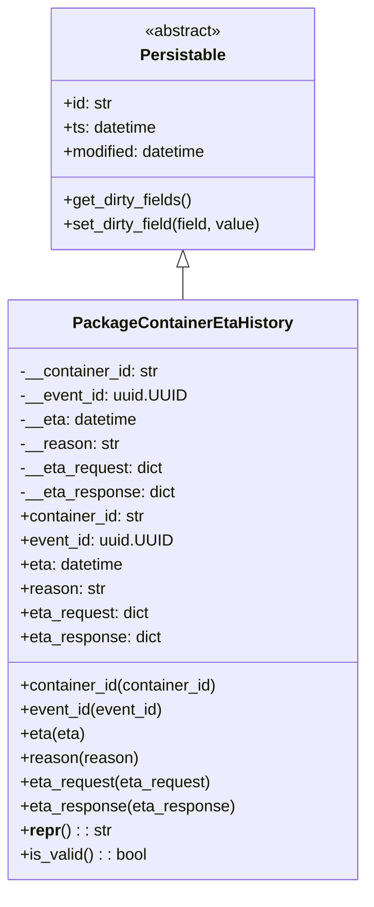

# Diagram: partview_core/partview_service/partview_service/core/datamodel/PackageContainerEtaHistory.py

> Auto-generated by Obscura crawlers

## Mermaid

### SVG

<svg id="container" width="357.0859375" xmlns="http://www.w3.org/2000/svg" class="classDiagram" height="882" viewBox="0 0 357.0859375 882" role="graphics-document document" aria-roledescription="class"><g><defs><marker id="container_class-aggregationStart" class="marker aggregation class" refX="18" refY="7" markerWidth="190" markerHeight="240" orient="auto"><path d="M 18,7 L9,13 L1,7 L9,1 Z"></path></marker></defs><defs><marker id="container_class-aggregationEnd" class="marker aggregation class" refX="1" refY="7" markerWidth="20" markerHeight="28" orient="auto"><path d="M 18,7 L9,13 L1,7 L9,1 Z"></path></marker></defs><defs><marker id="container_class-extensionStart" class="marker extension class" refX="18" refY="7" markerWidth="190" markerHeight="240" orient="auto"><path d="M 1,7 L18,13 V 1 Z"></path></marker></defs><defs><marker id="container_class-extensionEnd" class="marker extension class" refX="1" refY="7" markerWidth="20" markerHeight="28" orient="auto"><path d="M 1,1 V 13 L18,7 Z"></path></marker></defs><defs><marker id="container_class-compositionStart" class="marker composition class" refX="18" refY="7" markerWidth="190" markerHeight="240" orient="auto"><path d="M 18,7 L9,13 L1,7 L9,1 Z"></path></marker></defs><defs><marker id="container_class-compositionEnd" class="marker composition class" refX="1" refY="7" markerWidth="20" markerHeight="28" orient="auto"><path d="M 18,7 L9,13 L1,7 L9,1 Z"></path></marker></defs><defs><marker id="container_class-dependencyStart" class="marker dependency class" refX="6" refY="7" markerWidth="190" markerHeight="240" orient="auto"><path d="M 5,7 L9,13 L1,7 L9,1 Z"></path></marker></defs><defs><marker id="container_class-dependencyEnd" class="marker dependency class" refX="13" refY="7" markerWidth="20" markerHeight="28" orient="auto"><path d="M 18,7 L9,13 L14,7 L9,1 Z"></path></marker></defs><defs><marker id="container_class-lollipopStart" class="marker lollipop class" refX="13" refY="7" markerWidth="190" markerHeight="240" orient="auto"><circle stroke="black" fill="transparent" cx="7" cy="7" r="6"></circle></marker></defs><defs><marker id="container_class-lollipopEnd" class="marker lollipop class" refX="1" refY="7" markerWidth="190" markerHeight="240" orient="auto"><circle stroke="black" fill="transparent" cx="7" cy="7" r="6"></circle></marker></defs><g class="root"><g class="clusters"></g><g class="edgePaths"><path d="M178.543,265.25L178.543,266.542C178.543,267.833,178.543,270.417,178.543,275.875C178.543,281.333,178.543,289.667,178.543,293.833L178.543,298" id="id_Persistable_PackageContainerEtaHistory_1" class="edge-thickness-normal edge-pattern-solid relation" style=";;;" data-edge="true" data-et="edge" data-id="id_Persistable_PackageContainerEtaHistory_1" data-points="W3sieCI6MTc4LjU0Mjk2ODc1LCJ5IjoyNDh9LHsieCI6MTc4LjU0Mjk2ODc1LCJ5IjoyNzN9LHsieCI6MTc4LjU0Mjk2ODc1LCJ5IjoyOTh9XQ==" marker-start="url(#container_class-extensionStart)"></path></g><g class="edgeLabels"><g class="edgeLabel"><g class="label" data-id="id_Persistable_PackageContainerEtaHistory_1" transform="translate(0, 0)"><foreignObject width="0" height="0">

</foreignObject></g></g></g><g class="nodes"><g class="node default" id="classId-Persistable-0" transform="translate(178.54296875, 128)"><g class="basic label-container"><path d="M-132.90234375 -120 L132.90234375 -120 L132.90234375 120 L-132.90234375 120" stroke="none" stroke-width="0" fill="#ECECFF" style=""></path><path d="M-132.90234375 -120 C-62.35513014910005 -120, 8.192083451799903 -120, 132.90234375 -120 M-132.90234375 -120 C-30.30710610075704 -120, 72.28813154848592 -120, 132.90234375 -120 M132.90234375 -120 C132.90234375 -58.46056252553026, 132.90234375 3.078874948939486, 132.90234375 120 M132.90234375 -120 C132.90234375 -48.699248904258624, 132.90234375 22.60150219148275, 132.90234375 120 M132.90234375 120 C65.35141321513503 120, -2.1995173197299493 120, -132.90234375 120 M132.90234375 120 C61.7908590841393 120, -9.320625581721401 120, -132.90234375 120 M-132.90234375 120 C-132.90234375 28.456907702702992, -132.90234375 -63.086184594594016, -132.90234375 -120 M-132.90234375 120 C-132.90234375 66.64834873938901, -132.90234375 13.296697478778, -132.90234375 -120" stroke="#9370DB" stroke-width="1.3" fill="none" stroke-dasharray="0 0" style=""></path></g><g class="annotation-group text" transform="translate(-38.609375, -96)"><g class="label" style="" transform="translate(0,-12)"><foreignObject width="77.21875" height="24">

«abstract»

</foreignObject></g></g><g class="label-group text" transform="translate(-40.9765625, -72)"><g class="label" style="font-weight: bolder" transform="translate(0,-12)"><foreignObject width="81.953125" height="24">

Persistable

</foreignObject></g></g><g class="members-group text" transform="translate(-120.90234375, -24)"><g class="label" style="" transform="translate(0,-12)"><foreignObject width="49.578125" height="24">

+id: str

</foreignObject></g><g class="label" style="" transform="translate(0,12)"><foreignObject width="94.484375" height="24">

+ts: datetime

</foreignObject></g><g class="label" style="" transform="translate(0,36)"><foreignObject width="145.9375" height="24">

+modified: datetime

</foreignObject></g></g><g class="methods-group text" transform="translate(-120.90234375, 72)"><g class="label" style="" transform="translate(0,-12)"><foreignObject width="129.828125" height="24">

+get_dirty_fields()

</foreignObject></g><g class="label" style="" transform="translate(0,12)"><foreignObject width="200.828125" height="24">

+set_dirty_field(field, value)

</foreignObject></g></g><g class="divider" style=""><path d="M-132.90234375 -48 C-54.04818934482665 -48, 24.805965060346693 -48, 132.90234375 -48 M-132.90234375 -48 C-44.92304208008004 -48, 43.056259589839925 -48, 132.90234375 -48" stroke="#9370DB" stroke-width="1.3" fill="none" stroke-dasharray="0 0" style=""></path></g><g class="divider" style=""><path d="M-132.90234375 48 C-52.06407349460076 48, 28.774196760798475 48, 132.90234375 48 M-132.90234375 48 C-28.515478603949177 48, 75.87138654210165 48, 132.90234375 48" stroke="#9370DB" stroke-width="1.3" fill="none" stroke-dasharray="0 0" style=""></path></g></g><g class="node default" id="classId-PackageContainerEtaHistory-1" transform="translate(178.54296875, 586)"><g class="basic label-container"><path d="M-170.54296875 -288 L170.54296875 -288 L170.54296875 288 L-170.54296875 288" stroke="none" stroke-width="0" fill="#ECECFF" style=""></path><path d="M-170.54296875 -288 C-69.66146824319975 -288, 31.2200322636005 -288, 170.54296875 -288 M-170.54296875 -288 C-61.96126137158751 -288, 46.62044600682498 -288, 170.54296875 -288 M170.54296875 -288 C170.54296875 -162.93087217452842, 170.54296875 -37.861744349056835, 170.54296875 288 M170.54296875 -288 C170.54296875 -158.34245390152566, 170.54296875 -28.684907803051317, 170.54296875 288 M170.54296875 288 C40.090049347785 288, -90.36287005443 288, -170.54296875 288 M170.54296875 288 C82.67981989644863 288, -5.183328957102731 288, -170.54296875 288 M-170.54296875 288 C-170.54296875 130.06360120190183, -170.54296875 -27.872797596196335, -170.54296875 -288 M-170.54296875 288 C-170.54296875 58.42264893174871, -170.54296875 -171.15470213650258, -170.54296875 -288" stroke="#9370DB" stroke-width="1.3" fill="none" stroke-dasharray="0 0" style=""></path></g><g class="annotation-group text" transform="translate(0, -264)"></g><g class="label-group text" transform="translate(-103.3046875, -264)"><g class="label" style="font-weight: bolder" transform="translate(0,-12)"><foreignObject width="206.609375" height="24">

PackageContainerEtaHistory

</foreignObject></g></g><g class="members-group text" transform="translate(-158.54296875, -216)"><g class="label" style="" transform="translate(0,-12)"><foreignObject width="139.15625" height="24">

-__container_id: str

</foreignObject></g><g class="label" style="" transform="translate(0,12)"><foreignObject width="164.75" height="24">

-__event_id: uuid.UUID

</foreignObject></g><g class="label" style="" transform="translate(0,36)"><foreignObject width="117.75" height="24">

-__eta: datetime

</foreignObject></g><g class="label" style="" transform="translate(0,60)"><foreignObject width="98.15625" height="24">

-__reason: str

</foreignObject></g><g class="label" style="" transform="translate(0,84)"><foreignObject width="143.65625" height="24">

-__eta_request: dict

</foreignObject></g><g class="label" style="" transform="translate(0,108)"><foreignObject width="154.625" height="24">

-__eta_response: dict

</foreignObject></g><g class="label" style="" transform="translate(0,132)"><foreignObject width="125.8125" height="24">

+container_id: str

</foreignObject></g><g class="label" style="" transform="translate(0,156)"><foreignObject width="151.40625" height="24">

+event_id: uuid.UUID

</foreignObject></g><g class="label" style="" transform="translate(0,180)"><foreignObject width="104.40625" height="24">

+eta: datetime

</foreignObject></g><g class="label" style="" transform="translate(0,204)"><foreignObject width="84.484375" height="24">

+reason: str

</foreignObject></g><g class="label" style="" transform="translate(0,228)"><foreignObject width="130.3125" height="24">

+eta_request: dict

</foreignObject></g><g class="label" style="" transform="translate(0,252)"><foreignObject width="141.28125" height="24">

+eta_response: dict

</foreignObject></g></g><g class="methods-group text" transform="translate(-158.54296875, 96)"><g class="label" style="" transform="translate(0,-12)"><foreignObject width="199" height="24">

+container_id(container_id)

</foreignObject></g><g class="label" style="" transform="translate(0,12)"><foreignObject width="143.828125" height="24">

+event_id(event_id)

</foreignObject></g><g class="label" style="" transform="translate(0,36)"><foreignObject width="64.53125" height="24">

+eta(eta)

</foreignObject></g><g class="label" style="" transform="translate(0,60)"><foreignObject width="116.34375" height="24">

+reason(reason)

</foreignObject></g><g class="label" style="" transform="translate(0,84)"><foreignObject width="191.703125" height="24">

+eta_request(eta_request)

</foreignObject></g><g class="label" style="" transform="translate(0,108)"><foreignObject width="213.78125" height="24">

+eta_response(eta_response)

</foreignObject></g><g class="label" style="" transform="translate(0,132)"><foreignObject width="88.9375" height="24">

+<strong>repr</strong>() : : str

</foreignObject></g><g class="label" style="" transform="translate(0,156)"><foreignObject width="126.078125" height="24">

+is_valid() : : bool

</foreignObject></g></g><g class="divider" style=""><path d="M-170.54296875 -240 C-70.457953816899 -240, 29.627061116201986 -240, 170.54296875 -240 M-170.54296875 -240 C-52.17762894119909 -240, 66.18771086760182 -240, 170.54296875 -240" stroke="#9370DB" stroke-width="1.3" fill="none" stroke-dasharray="0 0" style=""></path></g><g class="divider" style=""><path d="M-170.54296875 72 C-39.30933909623124 72, 91.92429055753752 72, 170.54296875 72 M-170.54296875 72 C-44.0846396578132 72, 82.3736894343736 72, 170.54296875 72" stroke="#9370DB" stroke-width="1.3" fill="none" stroke-dasharray="0 0" style=""></path></g></g></g></g></g></svg>
