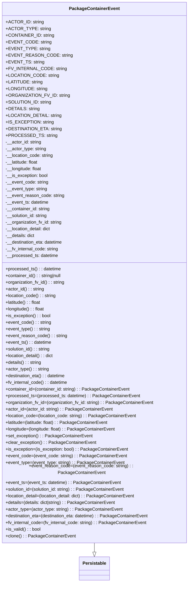

# Diagram: partview_core/partview_service/partview_service/core/datamodel/PackageContainerEvent.py

> Auto-generated by Obscura crawlers

## Mermaid

### SVG

<svg id="container" width="671.828125" xmlns="http://www.w3.org/2000/svg" class="classDiagram" height="2070" viewBox="0 0 671.828125 2070" role="graphics-document document" aria-roledescription="class"><g><defs><marker id="container_class-aggregationStart" class="marker aggregation class" refX="18" refY="7" markerWidth="190" markerHeight="240" orient="auto"><path d="M 18,7 L9,13 L1,7 L9,1 Z"></path></marker></defs><defs><marker id="container_class-aggregationEnd" class="marker aggregation class" refX="1" refY="7" markerWidth="20" markerHeight="28" orient="auto"><path d="M 18,7 L9,13 L1,7 L9,1 Z"></path></marker></defs><defs><marker id="container_class-extensionStart" class="marker extension class" refX="18" refY="7" markerWidth="190" markerHeight="240" orient="auto"><path d="M 1,7 L18,13 V 1 Z"></path></marker></defs><defs><marker id="container_class-extensionEnd" class="marker extension class" refX="1" refY="7" markerWidth="20" markerHeight="28" orient="auto"><path d="M 1,1 V 13 L18,7 Z"></path></marker></defs><defs><marker id="container_class-compositionStart" class="marker composition class" refX="18" refY="7" markerWidth="190" markerHeight="240" orient="auto"><path d="M 18,7 L9,13 L1,7 L9,1 Z"></path></marker></defs><defs><marker id="container_class-compositionEnd" class="marker composition class" refX="1" refY="7" markerWidth="20" markerHeight="28" orient="auto"><path d="M 18,7 L9,13 L1,7 L9,1 Z"></path></marker></defs><defs><marker id="container_class-dependencyStart" class="marker dependency class" refX="6" refY="7" markerWidth="190" markerHeight="240" orient="auto"><path d="M 5,7 L9,13 L1,7 L9,1 Z"></path></marker></defs><defs><marker id="container_class-dependencyEnd" class="marker dependency class" refX="13" refY="7" markerWidth="20" markerHeight="28" orient="auto"><path d="M 18,7 L9,13 L14,7 L9,1 Z"></path></marker></defs><defs><marker id="container_class-lollipopStart" class="marker lollipop class" refX="13" refY="7" markerWidth="190" markerHeight="240" orient="auto"><circle stroke="black" fill="transparent" cx="7" cy="7" r="6"></circle></marker></defs><defs><marker id="container_class-lollipopEnd" class="marker lollipop class" refX="1" refY="7" markerWidth="190" markerHeight="240" orient="auto"><circle stroke="black" fill="transparent" cx="7" cy="7" r="6"></circle></marker></defs><g class="root"><g class="clusters"></g><g class="edgePaths"><path d="M335.914,1928L335.914,1932.167C335.914,1936.333,335.914,1944.667,335.914,1950.125C335.914,1955.583,335.914,1958.167,335.914,1959.458L335.914,1960.75" id="id_PackageContainerEvent_Persistable_1" class="edge-thickness-normal edge-pattern-solid relation" style=";;;" data-edge="true" data-et="edge" data-id="id_PackageContainerEvent_Persistable_1" data-points="W3sieCI6MzM1LjkxNDA2MjUsInkiOjE5Mjh9LHsieCI6MzM1LjkxNDA2MjUsInkiOjE5NTN9LHsieCI6MzM1LjkxNDA2MjUsInkiOjE5Nzh9XQ==" marker-end="url(#container_class-extensionEnd)"></path></g><g class="edgeLabels"><g class="edgeLabel"><g class="label" data-id="id_PackageContainerEvent_Persistable_1" transform="translate(0, 0)"><foreignObject width="0" height="0">

</foreignObject></g></g></g><g class="nodes"><g class="node default" id="classId-Persistable-0" transform="translate(335.9140625, 2020)"><g class="basic label-container"><path d="M-52.9765625 -42 L52.9765625 -42 L52.9765625 42 L-52.9765625 42" stroke="none" stroke-width="0" fill="#ECECFF" style=""></path><path d="M-52.9765625 -42 C-23.080381284879092 -42, 6.815799930241816 -42, 52.9765625 -42 M-52.9765625 -42 C-19.211237485819417 -42, 14.554087528361165 -42, 52.9765625 -42 M52.9765625 -42 C52.9765625 -12.546616741383627, 52.9765625 16.906766517232747, 52.9765625 42 M52.9765625 -42 C52.9765625 -17.049957192267172, 52.9765625 7.900085615465656, 52.9765625 42 M52.9765625 42 C10.623483513119332 42, -31.729595473761336 42, -52.9765625 42 M52.9765625 42 C15.002794936383687 42, -22.970972627232626 42, -52.9765625 42 M-52.9765625 42 C-52.9765625 24.39676606425801, -52.9765625 6.79353212851602, -52.9765625 -42 M-52.9765625 42 C-52.9765625 9.425806613784388, -52.9765625 -23.148386772431223, -52.9765625 -42" stroke="#9370DB" stroke-width="1.3" fill="none" stroke-dasharray="0 0" style=""></path></g><g class="annotation-group text" transform="translate(0, -18)"></g><g class="label-group text" transform="translate(-40.9765625, -18)"><g class="label" style="font-weight: bolder" transform="translate(0,-12)"><foreignObject width="81.953125" height="24">

Persistable

</foreignObject></g></g><g class="members-group text" transform="translate(-40.9765625, 30)"></g><g class="methods-group text" transform="translate(-40.9765625, 60)"></g><g class="divider" style=""><path d="M-52.9765625 6 C-30.514021530875517 6, -8.051480561751035 6, 52.9765625 6 M-52.9765625 6 C-15.583631939322657 6, 21.809298621354685 6, 52.9765625 6" stroke="#9370DB" stroke-width="1.3" fill="none" stroke-dasharray="0 0" style=""></path></g><g class="divider" style=""><path d="M-52.9765625 24 C-20.698631227027356 24, 11.579300045945288 24, 52.9765625 24 M-52.9765625 24 C-28.094467902882403 24, -3.2123733057648067 24, 52.9765625 24" stroke="#9370DB" stroke-width="1.3" fill="none" stroke-dasharray="0 0" style=""></path></g></g><g class="node default" id="classId-PackageContainerEvent-1" transform="translate(335.9140625, 968)"><g class="basic label-container"><path d="M-327.9140625 -960 L327.9140625 -960 L327.9140625 960 L-327.9140625 960" stroke="none" stroke-width="0" fill="#ECECFF" style=""></path><path d="M-327.9140625 -960 C-108.150821028232 -960, 111.612420443536 -960, 327.9140625 -960 M-327.9140625 -960 C-87.35956642833122 -960, 153.19492964333756 -960, 327.9140625 -960 M327.9140625 -960 C327.9140625 -276.9413504339226, 327.9140625 406.1172991321548, 327.9140625 960 M327.9140625 -960 C327.9140625 -211.45242271419124, 327.9140625 537.0951545716175, 327.9140625 960 M327.9140625 960 C167.71639876165 960, 7.518735023299996 960, -327.9140625 960 M327.9140625 960 C153.39434906854592 960, -21.125364362908158 960, -327.9140625 960 M-327.9140625 960 C-327.9140625 199.60671596193833, -327.9140625 -560.7865680761233, -327.9140625 -960 M-327.9140625 960 C-327.9140625 393.54028972339427, -327.9140625 -172.91942055321147, -327.9140625 -960" stroke="#9370DB" stroke-width="1.3" fill="none" stroke-dasharray="0 0" style=""></path></g><g class="annotation-group text" transform="translate(0, -936)"></g><g class="label-group text" transform="translate(-85.65625, -936)"><g class="label" style="font-weight: bolder" transform="translate(0,-12)"><foreignObject width="171.3125" height="24">

PackageContainerEvent

</foreignObject></g></g><g class="members-group text" transform="translate(-315.9140625, -888)"><g class="label" style="" transform="translate(0,-12)"><foreignObject width="127.15625" height="24">

+ACTOR_ID: string

</foreignObject></g><g class="label" style="" transform="translate(0,12)"><foreignObject width="146.265625" height="24">

+ACTOR_TYPE: string

</foreignObject></g><g class="label" style="" transform="translate(0,36)"><foreignObject width="162.21875" height="24">

+CONTAINER_ID: string

</foreignObject></g><g class="label" style="" transform="translate(0,60)"><foreignObject width="148.375" height="24">

+EVENT_CODE: string

</foreignObject></g><g class="label" style="" transform="translate(0,84)"><foreignObject width="144.5625" height="24">

+EVENT_TYPE: string

</foreignObject></g><g class="label" style="" transform="translate(0,108)"><foreignObject width="214.828125" height="24">

+EVENT_REASON_CODE: string

</foreignObject></g><g class="label" style="" transform="translate(0,132)"><foreignObject width="126.3125" height="24">

+EVENT_TS: string

</foreignObject></g><g class="label" style="" transform="translate(0,156)"><foreignObject width="198.453125" height="24">

+FV_INTERNAL_CODE: string

</foreignObject></g><g class="label" style="" transform="translate(0,180)"><foreignObject width="174.59375" height="24">

+LOCATION_CODE: string

</foreignObject></g><g class="label" style="" transform="translate(0,204)"><foreignObject width="124.765625" height="24">

+LATITUDE: string

</foreignObject></g><g class="label" style="" transform="translate(0,228)"><foreignObject width="139.5" height="24">

+LONGITUDE: string

</foreignObject></g><g class="label" style="" transform="translate(0,252)"><foreignObject width="212.546875" height="24">

+ORGANIZATION_FV_ID: string

</foreignObject></g><g class="label" style="" transform="translate(0,276)"><foreignObject width="153.359375" height="24">

+SOLUTION_ID: string

</foreignObject></g><g class="label" style="" transform="translate(0,300)"><foreignObject width="114.375" height="24">

+DETAILS: string

</foreignObject></g><g class="label" style="" transform="translate(0,324)"><foreignObject width="184.859375" height="24">

+LOCATION_DETAIL: string

</foreignObject></g><g class="label" style="" transform="translate(0,348)"><foreignObject width="157.375" height="24">

+IS_EXCEPTION: string

</foreignObject></g><g class="label" style="" transform="translate(0,372)"><foreignObject width="185.640625" height="24">

+DESTINATION_ETA: string

</foreignObject></g><g class="label" style="" transform="translate(0,396)"><foreignObject width="164.625" height="24">

+PROCESSED_TS: string

</foreignObject></g><g class="label" style="" transform="translate(0,420)"><foreignObject width="129.578125" height="24">

-__actor_id: string

</foreignObject></g><g class="label" style="" transform="translate(0,444)"><foreignObject width="146.96875" height="24">

-__actor_type: string

</foreignObject></g><g class="label" style="" transform="translate(0,468)"><foreignObject width="173.3125" height="24">

-__location_code: string

</foreignObject></g><g class="label" style="" transform="translate(0,492)"><foreignObject width="119.609375" height="24">

-__latitude: float

</foreignObject></g><g class="label" style="" transform="translate(0,516)"><foreignObject width="132.171875" height="24">

-__longitude: float

</foreignObject></g><g class="label" style="" transform="translate(0,540)"><foreignObject width="153.03125" height="24">

-__is_exception: bool

</foreignObject></g><g class="label" style="" transform="translate(0,564)"><foreignObject width="154.34375" height="24">

-__event_code: string

</foreignObject></g><g class="label" style="" transform="translate(0,588)"><foreignObject width="151.171875" height="24">

-__event_type: string

</foreignObject></g><g class="label" style="" transform="translate(0,612)"><foreignObject width="211.65625" height="24">

-__event_reason_code: string

</foreignObject></g><g class="label" style="" transform="translate(0,636)"><foreignObject width="156.25" height="24">

-__event_ts: datetime

</foreignObject></g><g class="label" style="" transform="translate(0,660)"><foreignObject width="161.375" height="24">

-__container_id: string

</foreignObject></g><g class="label" style="" transform="translate(0,684)"><foreignObject width="153.59375" height="24">

-__solution_id: string

</foreignObject></g><g class="label" style="" transform="translate(0,708)"><foreignObject width="204.546875" height="24">

-__organization_fv_id: string

</foreignObject></g><g class="label" style="" transform="translate(0,732)"><foreignObject width="166.25" height="24">

-__location_detail: dict

</foreignObject></g><g class="label" style="" transform="translate(0,756)"><foreignObject width="106.25" height="24">

-__details: dict

</foreignObject></g><g class="label" style="" transform="translate(0,780)"><foreignObject width="208.890625" height="24">

-__destination_eta: datetime

</foreignObject></g><g class="label" style="" transform="translate(0,804)"><foreignObject width="192.015625" height="24">

-__fv_internal_code: string

</foreignObject></g><g class="label" style="" transform="translate(0,828)"><foreignObject width="189.890625" height="24">

-__processed_ts: datetime

</foreignObject></g></g><g class="methods-group text" transform="translate(-315.9140625, 0)"><g class="label" style="" transform="translate(0,-12)"><foreignObject width="198.921875" height="24">

+processed_ts() : : datetime

</foreignObject></g><g class="label" style="" transform="translate(0,12)"><foreignObject width="205.21875" height="24">

+container_id() : : string|null

</foreignObject></g><g class="label" style="" transform="translate(0,36)"><foreignObject width="213.890625" height="24">

+organization_fv_id() : : string

</foreignObject></g><g class="label" style="" transform="translate(0,60)"><foreignObject width="138.6875" height="24">

+actor_id() : : string

</foreignObject></g><g class="label" style="" transform="translate(0,84)"><foreignObject width="182.5" height="24">

+location_code() : : string

</foreignObject></g><g class="label" style="" transform="translate(0,108)"><foreignObject width="128.796875" height="24">

+latitude() : : float

</foreignObject></g><g class="label" style="" transform="translate(0,132)"><foreignObject width="141.359375" height="24">

+longitude() : : float

</foreignObject></g><g class="label" style="" transform="translate(0,156)"><foreignObject width="162.0625" height="24">

+is_exception() : : bool

</foreignObject></g><g class="label" style="" transform="translate(0,180)"><foreignObject width="163.6875" height="24">

+event_code() : : string

</foreignObject></g><g class="label" style="" transform="translate(0,204)"><foreignObject width="160.515625" height="24">

+event_type() : : string

</foreignObject></g><g class="label" style="" transform="translate(0,228)"><foreignObject width="221" height="24">

+event_reason_code() : : string

</foreignObject></g><g class="label" style="" transform="translate(0,252)"><foreignObject width="165.59375" height="24">

+event_ts() : : datetime

</foreignObject></g><g class="label" style="" transform="translate(0,276)"><foreignObject width="162.609375" height="24">

+solution_id() : : string

</foreignObject></g><g class="label" style="" transform="translate(0,300)"><foreignObject width="175.265625" height="24">

+location_detail() : : dict

</foreignObject></g><g class="label" style="" transform="translate(0,324)"><foreignObject width="129.71875" height="24">

+details() : : string

</foreignObject></g><g class="label" style="" transform="translate(0,348)"><foreignObject width="156.078125" height="24">

+actor_type() : : string

</foreignObject></g><g class="label" style="" transform="translate(0,372)"><foreignObject width="218.234375" height="24">

+destination_eta() : : datetime

</foreignObject></g><g class="label" style="" transform="translate(0,396)"><foreignObject width="224.734375" height="24">

+fv_internal_code() : : datetime

</foreignObject></g><g class="label" style="" transform="translate(0,420)"><foreignObject width="445.59375" height="24">

+container_id=(container_id: string) : : PackageContainerEvent

</foreignObject></g><g class="label" style="" transform="translate(0,444)"><foreignObject width="478.390625" height="24">

+processed_ts=(processed_ts: datetime) : : PackageContainerEvent

</foreignObject></g><g class="label" style="" transform="translate(0,468)"><foreignObject width="531.96875" height="24">

+organization_fv_id=(organization_fv_id: string) : : PackageContainerEvent

</foreignObject></g><g class="label" style="" transform="translate(0,492)"><foreignObject width="381.765625" height="24">

+actor_id=(actor_id: string) : : PackageContainerEvent

</foreignObject></g><g class="label" style="" transform="translate(0,516)"><foreignObject width="469.171875" height="24">

+location_code=(location_code: string) : : PackageContainerEvent

</foreignObject></g><g class="label" style="" transform="translate(0,540)"><foreignObject width="370.328125" height="24">

+latitude=(latitude: float) : : PackageContainerEvent

</foreignObject></g><g class="label" style="" transform="translate(0,564)"><foreignObject width="395.453125" height="24">

+longitude=(longitude: float) : : PackageContainerEvent

</foreignObject></g><g class="label" style="" transform="translate(0,588)"><foreignObject width="307.953125" height="24">

+set_exception() : : PackageContainerEvent

</foreignObject></g><g class="label" style="" transform="translate(0,612)"><foreignObject width="320.40625" height="24">

+clear_exception() : : PackageContainerEvent

</foreignObject></g><g class="label" style="" transform="translate(0,636)"><foreignObject width="437.03125" height="24">

+is_exception=(is_exception: bool) : : PackageContainerEvent

</foreignObject></g><g class="label" style="" transform="translate(0,660)"><foreignObject width="431.546875" height="24">

+event_code=(event_code: string) : : PackageContainerEvent

</foreignObject></g><g class="label" style="" transform="translate(0,684)"><foreignObject width="425.203125" height="24">

+event_type=(event_type: string) : : PackageContainerEvent

</foreignObject></g><g class="label" style="" transform="translate(0,708)"><foreignObject width="546.171875" height="24">

+event_reason_code=(event_reason_code: string) : : PackageContainerEvent

</foreignObject></g><g class="label" style="" transform="translate(0,732)"><foreignObject width="411.734375" height="24">

+event_ts=(event_ts: datetime) : : PackageContainerEvent

</foreignObject></g><g class="label" style="" transform="translate(0,756)"><foreignObject width="429.40625" height="24">

+solution_id=(solution_id: string) : : PackageContainerEvent

</foreignObject></g><g class="label" style="" transform="translate(0,780)"><foreignObject width="469" height="24">

+location_detail=(location_detail: dict) : : PackageContainerEvent

</foreignObject></g><g class="label" style="" transform="translate(0,804)"><foreignObject width="397.5625" height="24">

+details=(details: dict|string) : : PackageContainerEvent

</foreignObject></g><g class="label" style="" transform="translate(0,828)"><foreignObject width="416.546875" height="24">

+actor_type=(actor_type: string) : : PackageContainerEvent

</foreignObject></g><g class="label" style="" transform="translate(0,852)"><foreignObject width="517.015625" height="24">

+destination_eta=(destination_eta: datetime) : : PackageContainerEvent

</foreignObject></g><g class="label" style="" transform="translate(0,876)"><foreignObject width="506.640625" height="24">

+fv_internal_code=(fv_internal_code: string) : : PackageContainerEvent

</foreignObject></g><g class="label" style="" transform="translate(0,900)"><foreignObject width="126.078125" height="24">

+is_valid() : : bool

</foreignObject></g><g class="label" style="" transform="translate(0,924)"><foreignObject width="246.9375" height="24">

+clone() : : PackageContainerEvent

</foreignObject></g></g><g class="divider" style=""><path d="M-327.9140625 -912 C-131.7736713975664 -912, 64.3667197048672 -912, 327.9140625 -912 M-327.9140625 -912 C-186.5032339029098 -912, -45.092405305819625 -912, 327.9140625 -912" stroke="#9370DB" stroke-width="1.3" fill="none" stroke-dasharray="0 0" style=""></path></g><g class="divider" style=""><path d="M-327.9140625 -24 C-104.35512791343237 -24, 119.20380667313526 -24, 327.9140625 -24 M-327.9140625 -24 C-117.14214961590986 -24, 93.62976326818028 -24, 327.9140625 -24" stroke="#9370DB" stroke-width="1.3" fill="none" stroke-dasharray="0 0" style=""></path></g></g></g></g></g></svg>
