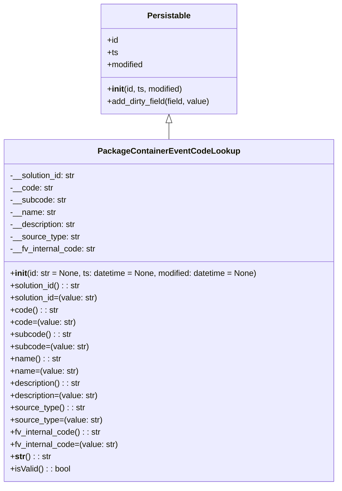

# Diagram: partview_core/partview_service/partview_service/core/datamodel/PackageContainerEventCodeLookup.py

> Auto-generated by Obscura crawlers

## Mermaid

### SVG

<svg id="container" width="660.2265625" xmlns="http://www.w3.org/2000/svg" class="classDiagram" height="954" viewBox="0 0 660.2265625 954" role="graphics-document document" aria-roledescription="class"><g><defs><marker id="container_class-aggregationStart" class="marker aggregation class" refX="18" refY="7" markerWidth="190" markerHeight="240" orient="auto"><path d="M 18,7 L9,13 L1,7 L9,1 Z"></path></marker></defs><defs><marker id="container_class-aggregationEnd" class="marker aggregation class" refX="1" refY="7" markerWidth="20" markerHeight="28" orient="auto"><path d="M 18,7 L9,13 L1,7 L9,1 Z"></path></marker></defs><defs><marker id="container_class-extensionStart" class="marker extension class" refX="18" refY="7" markerWidth="190" markerHeight="240" orient="auto"><path d="M 1,7 L18,13 V 1 Z"></path></marker></defs><defs><marker id="container_class-extensionEnd" class="marker extension class" refX="1" refY="7" markerWidth="20" markerHeight="28" orient="auto"><path d="M 1,1 V 13 L18,7 Z"></path></marker></defs><defs><marker id="container_class-compositionStart" class="marker composition class" refX="18" refY="7" markerWidth="190" markerHeight="240" orient="auto"><path d="M 18,7 L9,13 L1,7 L9,1 Z"></path></marker></defs><defs><marker id="container_class-compositionEnd" class="marker composition class" refX="1" refY="7" markerWidth="20" markerHeight="28" orient="auto"><path d="M 18,7 L9,13 L1,7 L9,1 Z"></path></marker></defs><defs><marker id="container_class-dependencyStart" class="marker dependency class" refX="6" refY="7" markerWidth="190" markerHeight="240" orient="auto"><path d="M 5,7 L9,13 L1,7 L9,1 Z"></path></marker></defs><defs><marker id="container_class-dependencyEnd" class="marker dependency class" refX="13" refY="7" markerWidth="20" markerHeight="28" orient="auto"><path d="M 18,7 L9,13 L14,7 L9,1 Z"></path></marker></defs><defs><marker id="container_class-lollipopStart" class="marker lollipop class" refX="13" refY="7" markerWidth="190" markerHeight="240" orient="auto"><circle stroke="black" fill="transparent" cx="7" cy="7" r="6"></circle></marker></defs><defs><marker id="container_class-lollipopEnd" class="marker lollipop class" refX="1" refY="7" markerWidth="190" markerHeight="240" orient="auto"><circle stroke="black" fill="transparent" cx="7" cy="7" r="6"></circle></marker></defs><g class="root"><g class="clusters"></g><g class="edgePaths"><path d="M330.113,241.25L330.113,242.542C330.113,243.833,330.113,246.417,330.113,251.875C330.113,257.333,330.113,265.667,330.113,269.833L330.113,274" id="id_Persistable_PackageContainerEventCodeLookup_1" class="edge-thickness-normal edge-pattern-solid relation" style=";;;" data-edge="true" data-et="edge" data-id="id_Persistable_PackageContainerEventCodeLookup_1" data-points="W3sieCI6MzMwLjExMzI4MTI1LCJ5IjoyMjR9LHsieCI6MzMwLjExMzI4MTI1LCJ5IjoyNDl9LHsieCI6MzMwLjExMzI4MTI1LCJ5IjoyNzR9XQ==" marker-start="url(#container_class-extensionStart)"></path></g><g class="edgeLabels"><g class="edgeLabel"><g class="label" data-id="id_Persistable_PackageContainerEventCodeLookup_1" transform="translate(0, 0)"><foreignObject width="0" height="0">

</foreignObject></g></g></g><g class="nodes"><g class="node default" id="classId-Persistable-0" transform="translate(330.11328125, 116)"><g class="basic label-container"><path d="M-135.71484375 -108 L135.71484375 -108 L135.71484375 108 L-135.71484375 108" stroke="none" stroke-width="0" fill="#ECECFF" style=""></path><path d="M-135.71484375 -108 C-45.84674392813409 -108, 44.02135589373182 -108, 135.71484375 -108 M-135.71484375 -108 C-53.01784172695372 -108, 29.67916029609256 -108, 135.71484375 -108 M135.71484375 -108 C135.71484375 -31.848203626788987, 135.71484375 44.30359274642203, 135.71484375 108 M135.71484375 -108 C135.71484375 -60.02387853860161, 135.71484375 -12.047757077203215, 135.71484375 108 M135.71484375 108 C30.16207146214407 108, -75.39070082571186 108, -135.71484375 108 M135.71484375 108 C76.59044816856408 108, 17.466052587128146 108, -135.71484375 108 M-135.71484375 108 C-135.71484375 51.264667254029284, -135.71484375 -5.470665491941432, -135.71484375 -108 M-135.71484375 108 C-135.71484375 28.870392403539512, -135.71484375 -50.259215192920976, -135.71484375 -108" stroke="#9370DB" stroke-width="1.3" fill="none" stroke-dasharray="0 0" style=""></path></g><g class="annotation-group text" transform="translate(0, -84)"></g><g class="label-group text" transform="translate(-40.9765625, -84)"><g class="label" style="font-weight: bolder" transform="translate(0,-12)"><foreignObject width="81.953125" height="24">

Persistable

</foreignObject></g></g><g class="members-group text" transform="translate(-123.71484375, -36)"><g class="label" style="" transform="translate(0,-12)"><foreignObject width="22.078125" height="24">

+id

</foreignObject></g><g class="label" style="" transform="translate(0,12)"><foreignObject width="21.15625" height="24">

+ts

</foreignObject></g><g class="label" style="" transform="translate(0,36)"><foreignObject width="72.609375" height="24">

+modified

</foreignObject></g></g><g class="methods-group text" transform="translate(-123.71484375, 60)"><g class="label" style="" transform="translate(0,-12)"><foreignObject width="150.90625" height="24">

+<strong>init</strong>(id, ts, modified)

</foreignObject></g><g class="label" style="" transform="translate(0,12)"><foreignObject width="206.453125" height="24">

+add_dirty_field(field, value)

</foreignObject></g></g><g class="divider" style=""><path d="M-135.71484375 -60 C-59.59155837195907 -60, 16.531727006081866 -60, 135.71484375 -60 M-135.71484375 -60 C-42.18187461276369 -60, 51.351094524472614 -60, 135.71484375 -60" stroke="#9370DB" stroke-width="1.3" fill="none" stroke-dasharray="0 0" style=""></path></g><g class="divider" style=""><path d="M-135.71484375 36 C-35.71799557197323 36, 64.27885260605353 36, 135.71484375 36 M-135.71484375 36 C-32.039763428104436 36, 71.63531689379113 36, 135.71484375 36" stroke="#9370DB" stroke-width="1.3" fill="none" stroke-dasharray="0 0" style=""></path></g></g><g class="node default" id="classId-PackageContainerEventCodeLookup-1" transform="translate(330.11328125, 610)"><g class="basic label-container"><path d="M-322.11328125 -336 L322.11328125 -336 L322.11328125 336 L-322.11328125 336" stroke="none" stroke-width="0" fill="#ECECFF" style=""></path><path d="M-322.11328125 -336 C-123.28741683264201 -336, 75.53844758471598 -336, 322.11328125 -336 M-322.11328125 -336 C-87.14981273441862 -336, 147.81365578116277 -336, 322.11328125 -336 M322.11328125 -336 C322.11328125 -189.62604195828902, 322.11328125 -43.252083916578044, 322.11328125 336 M322.11328125 -336 C322.11328125 -178.0514307252507, 322.11328125 -20.102861450501393, 322.11328125 336 M322.11328125 336 C166.51914470549332 336, 10.925008160986636 336, -322.11328125 336 M322.11328125 336 C86.44547971686188 336, -149.22232181627624 336, -322.11328125 336 M-322.11328125 336 C-322.11328125 156.2843704639326, -322.11328125 -23.43125907213482, -322.11328125 -336 M-322.11328125 336 C-322.11328125 71.01256904303386, -322.11328125 -193.97486191393227, -322.11328125 -336" stroke="#9370DB" stroke-width="1.3" fill="none" stroke-dasharray="0 0" style=""></path></g><g class="annotation-group text" transform="translate(0, -312)"></g><g class="label-group text" transform="translate(-130.9296875, -312)"><g class="label" style="font-weight: bolder" transform="translate(0,-12)"><foreignObject width="261.859375" height="24">

PackageContainerEventCodeLookup

</foreignObject></g></g><g class="members-group text" transform="translate(-310.11328125, -264)"><g class="label" style="" transform="translate(0,-12)"><foreignObject width="131.390625" height="24">

-__solution_id: str

</foreignObject></g><g class="label" style="" transform="translate(0,12)"><foreignObject width="83.796875" height="24">

-__code: str

</foreignObject></g><g class="label" style="" transform="translate(0,36)"><foreignObject width="110.40625" height="24">

-__subcode: str

</foreignObject></g><g class="label" style="" transform="translate(0,60)"><foreignObject width="89.671875" height="24">

-__name: str

</foreignObject></g><g class="label" style="" transform="translate(0,84)"><foreignObject width="131.453125" height="24">

-__description: str

</foreignObject></g><g class="label" style="" transform="translate(0,108)"><foreignObject width="136.5" height="24">

-__source_type: str

</foreignObject></g><g class="label" style="" transform="translate(0,132)"><foreignObject width="169.796875" height="24">

-__fv_internal_code: str

</foreignObject></g></g><g class="methods-group text" transform="translate(-310.11328125, -72)"><g class="label" style="" transform="translate(0,-12)"><foreignObject width="489.296875" height="24">

+<strong>init</strong>(id: str = None, ts: datetime = None, modified: datetime = None)

</foreignObject></g><g class="label" style="" transform="translate(0,12)"><foreignObject width="140.40625" height="24">

+solution_id() : : str

</foreignObject></g><g class="label" style="" transform="translate(0,36)"><foreignObject width="174.96875" height="24">

+solution_id=(value: str)

</foreignObject></g><g class="label" style="" transform="translate(0,60)"><foreignObject width="93.140625" height="24">

+code() : : str

</foreignObject></g><g class="label" style="" transform="translate(0,84)"><foreignObject width="127.703125" height="24">

+code=(value: str)

</foreignObject></g><g class="label" style="" transform="translate(0,108)"><foreignObject width="119.4375" height="24">

+subcode() : : str

</foreignObject></g><g class="label" style="" transform="translate(0,132)"><foreignObject width="153.984375" height="24">

+subcode=(value: str)

</foreignObject></g><g class="label" style="" transform="translate(0,156)"><foreignObject width="98.703125" height="24">

+name() : : str

</foreignObject></g><g class="label" style="" transform="translate(0,180)"><foreignObject width="133.25" height="24">

+name=(value: str)

</foreignObject></g><g class="label" style="" transform="translate(0,204)"><foreignObject width="140.796875" height="24">

+description() : : str

</foreignObject></g><g class="label" style="" transform="translate(0,228)"><foreignObject width="175.359375" height="24">

+description=(value: str)

</foreignObject></g><g class="label" style="" transform="translate(0,252)"><foreignObject width="145.53125" height="24">

+source_type() : : str

</foreignObject></g><g class="label" style="" transform="translate(0,276)"><foreignObject width="180.09375" height="24">

+source_type=(value: str)

</foreignObject></g><g class="label" style="" transform="translate(0,300)"><foreignObject width="178.90625" height="24">

+fv_internal_code() : : str

</foreignObject></g><g class="label" style="" transform="translate(0,324)"><foreignObject width="213.46875" height="24">

+fv_internal_code=(value: str)

</foreignObject></g><g class="label" style="" transform="translate(0,348)"><foreignObject width="78.515625" height="24">

+<strong>str</strong>() : : str

</foreignObject></g><g class="label" style="" transform="translate(0,372)"><foreignObject width="119.1875" height="24">

+isValid() : : bool

</foreignObject></g></g><g class="divider" style=""><path d="M-322.11328125 -288 C-100.68139305257975 -288, 120.7504951448405 -288, 322.11328125 -288 M-322.11328125 -288 C-188.58977912669758 -288, -55.06627700339516 -288, 322.11328125 -288" stroke="#9370DB" stroke-width="1.3" fill="none" stroke-dasharray="0 0" style=""></path></g><g class="divider" style=""><path d="M-322.11328125 -96 C-130.5749283536667 -96, 60.96342454266659 -96, 322.11328125 -96 M-322.11328125 -96 C-102.39636416908968 -96, 117.32055291182064 -96, 322.11328125 -96" stroke="#9370DB" stroke-width="1.3" fill="none" stroke-dasharray="0 0" style=""></path></g></g></g></g></g></svg>
