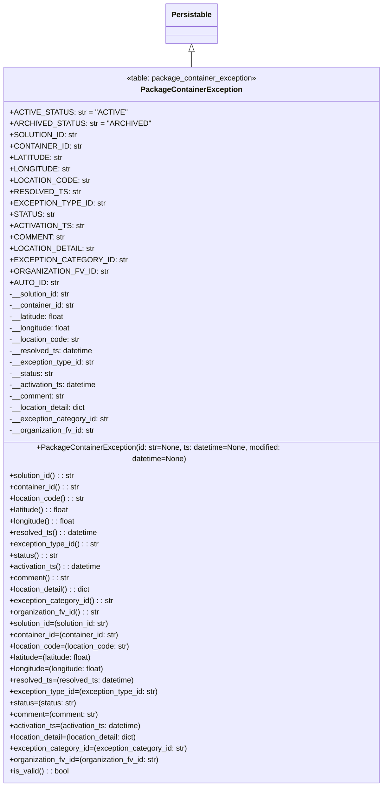

# Diagram: partview_core/partview_service/partview_service/core/datamodel/PackageContainerException.py

> Auto-generated by Obscura crawlers

## Mermaid

### SVG

<svg id="container" width="817.15625" xmlns="http://www.w3.org/2000/svg" class="classDiagram" height="1638" viewBox="0 0 817.15625 1638" role="graphics-document document" aria-roledescription="class"><g><defs><marker id="container_class-aggregationStart" class="marker aggregation class" refX="18" refY="7" markerWidth="190" markerHeight="240" orient="auto"><path d="M 18,7 L9,13 L1,7 L9,1 Z"></path></marker></defs><defs><marker id="container_class-aggregationEnd" class="marker aggregation class" refX="1" refY="7" markerWidth="20" markerHeight="28" orient="auto"><path d="M 18,7 L9,13 L1,7 L9,1 Z"></path></marker></defs><defs><marker id="container_class-extensionStart" class="marker extension class" refX="18" refY="7" markerWidth="190" markerHeight="240" orient="auto"><path d="M 1,7 L18,13 V 1 Z"></path></marker></defs><defs><marker id="container_class-extensionEnd" class="marker extension class" refX="1" refY="7" markerWidth="20" markerHeight="28" orient="auto"><path d="M 1,1 V 13 L18,7 Z"></path></marker></defs><defs><marker id="container_class-compositionStart" class="marker composition class" refX="18" refY="7" markerWidth="190" markerHeight="240" orient="auto"><path d="M 18,7 L9,13 L1,7 L9,1 Z"></path></marker></defs><defs><marker id="container_class-compositionEnd" class="marker composition class" refX="1" refY="7" markerWidth="20" markerHeight="28" orient="auto"><path d="M 18,7 L9,13 L1,7 L9,1 Z"></path></marker></defs><defs><marker id="container_class-dependencyStart" class="marker dependency class" refX="6" refY="7" markerWidth="190" markerHeight="240" orient="auto"><path d="M 5,7 L9,13 L1,7 L9,1 Z"></path></marker></defs><defs><marker id="container_class-dependencyEnd" class="marker dependency class" refX="13" refY="7" markerWidth="20" markerHeight="28" orient="auto"><path d="M 18,7 L9,13 L14,7 L9,1 Z"></path></marker></defs><defs><marker id="container_class-lollipopStart" class="marker lollipop class" refX="13" refY="7" markerWidth="190" markerHeight="240" orient="auto"><circle stroke="black" fill="transparent" cx="7" cy="7" r="6"></circle></marker></defs><defs><marker id="container_class-lollipopEnd" class="marker lollipop class" refX="1" refY="7" markerWidth="190" markerHeight="240" orient="auto"><circle stroke="black" fill="transparent" cx="7" cy="7" r="6"></circle></marker></defs><g class="root"><g class="clusters"></g><g class="edgePaths"><path d="M408.578,109.25L408.578,110.542C408.578,111.833,408.578,114.417,408.578,119.875C408.578,125.333,408.578,133.667,408.578,137.833L408.578,142" id="id_Persistable_PackageContainerException_1" class="edge-thickness-normal edge-pattern-solid relation" style=";;;" data-edge="true" data-et="edge" data-id="id_Persistable_PackageContainerException_1" data-points="W3sieCI6NDA4LjU3ODEyNSwieSI6OTJ9LHsieCI6NDA4LjU3ODEyNSwieSI6MTE3fSx7IngiOjQwOC41NzgxMjUsInkiOjE0Mn1d" marker-start="url(#container_class-extensionStart)"></path></g><g class="edgeLabels"><g class="edgeLabel"><g class="label" data-id="id_Persistable_PackageContainerException_1" transform="translate(0, 0)"><foreignObject width="0" height="0">

</foreignObject></g></g></g><g class="nodes"><g class="node default" id="classId-Persistable-0" transform="translate(408.578125, 50)"><g class="basic label-container"><path d="M-52.9765625 -42 L52.9765625 -42 L52.9765625 42 L-52.9765625 42" stroke="none" stroke-width="0" fill="#ECECFF" style=""></path><path d="M-52.9765625 -42 C-12.285790422135378 -42, 28.404981655729244 -42, 52.9765625 -42 M-52.9765625 -42 C-27.05979055736646 -42, -1.1430186147329167 -42, 52.9765625 -42 M52.9765625 -42 C52.9765625 -10.3127847197321, 52.9765625 21.3744305605358, 52.9765625 42 M52.9765625 -42 C52.9765625 -24.18383622468006, 52.9765625 -6.367672449360121, 52.9765625 42 M52.9765625 42 C22.100044963154875 42, -8.77647257369025 42, -52.9765625 42 M52.9765625 42 C26.98788821385887 42, 0.9992139277177401 42, -52.9765625 42 M-52.9765625 42 C-52.9765625 16.300431672659183, -52.9765625 -9.399136654681634, -52.9765625 -42 M-52.9765625 42 C-52.9765625 9.42076171164905, -52.9765625 -23.1584765767019, -52.9765625 -42" stroke="#9370DB" stroke-width="1.3" fill="none" stroke-dasharray="0 0" style=""></path></g><g class="annotation-group text" transform="translate(0, -18)"></g><g class="label-group text" transform="translate(-40.9765625, -18)"><g class="label" style="font-weight: bolder" transform="translate(0,-12)"><foreignObject width="81.953125" height="24">

Persistable

</foreignObject></g></g><g class="members-group text" transform="translate(-40.9765625, 30)"></g><g class="methods-group text" transform="translate(-40.9765625, 60)"></g><g class="divider" style=""><path d="M-52.9765625 6 C-29.33871509503459 6, -5.700867690069181 6, 52.9765625 6 M-52.9765625 6 C-15.84988946421035 6, 21.2767835715793 6, 52.9765625 6" stroke="#9370DB" stroke-width="1.3" fill="none" stroke-dasharray="0 0" style=""></path></g><g class="divider" style=""><path d="M-52.9765625 24 C-28.058970508254173 24, -3.1413785165083468 24, 52.9765625 24 M-52.9765625 24 C-23.448707860058867 24, 6.079146779882265 24, 52.9765625 24" stroke="#9370DB" stroke-width="1.3" fill="none" stroke-dasharray="0 0" style=""></path></g></g><g class="node default" id="classId-PackageContainerException-1" transform="translate(408.578125, 886)"><g class="basic label-container"><path d="M-400.578125 -744 L400.578125 -744 L400.578125 744 L-400.578125 744" stroke="none" stroke-width="0" fill="#ECECFF" style=""></path><path d="M-400.578125 -744 C-82.82940194088792 -744, 234.91932111822416 -744, 400.578125 -744 M-400.578125 -744 C-104.91099044276297 -744, 190.75614411447407 -744, 400.578125 -744 M400.578125 -744 C400.578125 -372.0816978510176, 400.578125 -0.16339570203524545, 400.578125 744 M400.578125 -744 C400.578125 -253.36298692525628, 400.578125 237.27402614948744, 400.578125 744 M400.578125 744 C197.13227548566363 744, -6.313574028672747 744, -400.578125 744 M400.578125 744 C92.62083692196387 744, -215.33645115607226 744, -400.578125 744 M-400.578125 744 C-400.578125 217.21536375839491, -400.578125 -309.56927248321017, -400.578125 -744 M-400.578125 744 C-400.578125 316.4450021447311, -400.578125 -111.10999571053776, -400.578125 -744" stroke="#9370DB" stroke-width="1.3" fill="none" stroke-dasharray="0 0" style=""></path></g><g class="annotation-group text" transform="translate(-138.4375, -720)"><g class="label" style="" transform="translate(0,-12)"><foreignObject width="276.875" height="24">

«table: package_container_exception»

</foreignObject></g></g><g class="label-group text" transform="translate(-101.1484375, -696)"><g class="label" style="font-weight: bolder" transform="translate(0,-12)"><foreignObject width="202.296875" height="24">

PackageContainerException

</foreignObject></g></g><g class="members-group text" transform="translate(-388.578125, -648)"><g class="label" style="" transform="translate(0,-12)"><foreignObject width="220.296875" height="24">

+ACTIVE_STATUS: str = "ACTIVE"

</foreignObject></g><g class="label" style="" transform="translate(0,12)"><foreignObject width="265.1875" height="24">

+ARCHIVED_STATUS: str = "ARCHIVED"

</foreignObject></g><g class="label" style="" transform="translate(0,36)"><foreignObject width="131.140625" height="24">

+SOLUTION_ID: str

</foreignObject></g><g class="label" style="" transform="translate(0,60)"><foreignObject width="140.015625" height="24">

+CONTAINER_ID: str

</foreignObject></g><g class="label" style="" transform="translate(0,84)"><foreignObject width="102.546875" height="24">

+LATITUDE: str

</foreignObject></g><g class="label" style="" transform="translate(0,108)"><foreignObject width="117.28125" height="24">

+LONGITUDE: str

</foreignObject></g><g class="label" style="" transform="translate(0,132)"><foreignObject width="152.390625" height="24">

+LOCATION_CODE: str

</foreignObject></g><g class="label" style="" transform="translate(0,156)"><foreignObject width="131.40625" height="24">

+RESOLVED_TS: str

</foreignObject></g><g class="label" style="" transform="translate(0,180)"><foreignObject width="179.671875" height="24">

+EXCEPTION_TYPE_ID: str

</foreignObject></g><g class="label" style="" transform="translate(0,204)"><foreignObject width="86.53125" height="24">

+STATUS: str

</foreignObject></g><g class="label" style="" transform="translate(0,228)"><foreignObject width="142.359375" height="24">

+ACTIVATION_TS: str

</foreignObject></g><g class="label" style="" transform="translate(0,252)"><foreignObject width="107.109375" height="24">

+COMMENT: str

</foreignObject></g><g class="label" style="" transform="translate(0,276)"><foreignObject width="162.640625" height="24">

+LOCATION_DETAIL: str

</foreignObject></g><g class="label" style="" transform="translate(0,300)"><foreignObject width="216.828125" height="24">

+EXCEPTION_CATEGORY_ID: str

</foreignObject></g><g class="label" style="" transform="translate(0,324)"><foreignObject width="190.34375" height="24">

+ORGANIZATION_FV_ID: str

</foreignObject></g><g class="label" style="" transform="translate(0,348)"><foreignObject width="96.421875" height="24">

+AUTO_ID: str

</foreignObject></g><g class="label" style="" transform="translate(0,372)"><foreignObject width="131.390625" height="24">

-__solution_id: str

</foreignObject></g><g class="label" style="" transform="translate(0,396)"><foreignObject width="139.15625" height="24">

-__container_id: str

</foreignObject></g><g class="label" style="" transform="translate(0,420)"><foreignObject width="119.609375" height="24">

-__latitude: float

</foreignObject></g><g class="label" style="" transform="translate(0,444)"><foreignObject width="132.171875" height="24">

-__longitude: float

</foreignObject></g><g class="label" style="" transform="translate(0,468)"><foreignObject width="151.109375" height="24">

-__location_code: str

</foreignObject></g><g class="label" style="" transform="translate(0,492)"><foreignObject width="178.09375" height="24">

-__resolved_ts: datetime

</foreignObject></g><g class="label" style="" transform="translate(0,516)"><foreignObject width="181.46875" height="24">

-__exception_type_id: str

</foreignObject></g><g class="label" style="" transform="translate(0,540)"><foreignObject width="93.5625" height="24">

-__status: str

</foreignObject></g><g class="label" style="" transform="translate(0,564)"><foreignObject width="187.875" height="24">

-__activation_ts: datetime

</foreignObject></g><g class="label" style="" transform="translate(0,588)"><foreignObject width="116.875" height="24">

-__comment: str

</foreignObject></g><g class="label" style="" transform="translate(0,612)"><foreignObject width="166.25" height="24">

-__location_detail: dict

</foreignObject></g><g class="label" style="" transform="translate(0,636)"><foreignObject width="211.421875" height="24">

-__exception_category_id: str

</foreignObject></g><g class="label" style="" transform="translate(0,660)"><foreignObject width="182.34375" height="24">

-__organization_fv_id: str

</foreignObject></g></g><g class="methods-group text" transform="translate(-388.578125, 72)"><g class="label" style="" transform="translate(0,-12)"><foreignObject width="638.71875" height="24">

+PackageContainerException(id: str=None, ts: datetime=None, modified: datetime=None)

</foreignObject></g><g class="label" style="" transform="translate(0,12)"><foreignObject width="140.40625" height="24">

+solution_id() : : str

</foreignObject></g><g class="label" style="" transform="translate(0,36)"><foreignObject width="148.5" height="24">

+container_id() : : str

</foreignObject></g><g class="label" style="" transform="translate(0,60)"><foreignObject width="160.296875" height="24">

+location_code() : : str

</foreignObject></g><g class="label" style="" transform="translate(0,84)"><foreignObject width="128.796875" height="24">

+latitude() : : float

</foreignObject></g><g class="label" style="" transform="translate(0,108)"><foreignObject width="141.359375" height="24">

+longitude() : : float

</foreignObject></g><g class="label" style="" transform="translate(0,132)"><foreignObject width="187.109375" height="24">

+resolved_ts() : : datetime

</foreignObject></g><g class="label" style="" transform="translate(0,156)"><foreignObject width="190.8125" height="24">

+exception_type_id() : : str

</foreignObject></g><g class="label" style="" transform="translate(0,180)"><foreignObject width="102.578125" height="24">

+status() : : str

</foreignObject></g><g class="label" style="" transform="translate(0,204)"><foreignObject width="196.984375" height="24">

+activation_ts() : : datetime

</foreignObject></g><g class="label" style="" transform="translate(0,228)"><foreignObject width="126.15625" height="24">

+comment() : : str

</foreignObject></g><g class="label" style="" transform="translate(0,252)"><foreignObject width="175.265625" height="24">

+location_detail() : : dict

</foreignObject></g><g class="label" style="" transform="translate(0,276)"><foreignObject width="220.765625" height="24">

+exception_category_id() : : str

</foreignObject></g><g class="label" style="" transform="translate(0,300)"><foreignObject width="191.6875" height="24">

+organization_fv_id() : : str

</foreignObject></g><g class="label" style="" transform="translate(0,324)"><foreignObject width="218.3125" height="24">

+solution_id=(solution_id: str)

</foreignObject></g><g class="label" style="" transform="translate(0,348)"><foreignObject width="234.5" height="24">

+container_id=(container_id: str)

</foreignObject></g><g class="label" style="" transform="translate(0,372)"><foreignObject width="258.09375" height="24">

+location_code=(location_code: str)

</foreignObject></g><g class="label" style="" transform="translate(0,396)"><foreignObject width="181.453125" height="24">

+latitude=(latitude: float)

</foreignObject></g><g class="label" style="" transform="translate(0,420)"><foreignObject width="206.5625" height="24">

+longitude=(longitude: float)

</foreignObject></g><g class="label" style="" transform="translate(0,444)"><foreignObject width="265.890625" height="24">

+resolved_ts=(resolved_ts: datetime)

</foreignObject></g><g class="label" style="" transform="translate(0,468)"><foreignObject width="319.109375" height="24">

+exception_type_id=(exception_type_id: str)

</foreignObject></g><g class="label" style="" transform="translate(0,492)"><foreignObject width="142.671875" height="24">

+status=(status: str)

</foreignObject></g><g class="label" style="" transform="translate(0,516)"><foreignObject width="189.859375" height="24">

+comment=(comment: str)

</foreignObject></g><g class="label" style="" transform="translate(0,540)"><foreignObject width="285.875" height="24">

+activation_ts=(activation_ts: datetime)

</foreignObject></g><g class="label" style="" transform="translate(0,564)"><foreignObject width="280.125" height="24">

+location_detail=(location_detail: dict)

</foreignObject></g><g class="label" style="" transform="translate(0,588)"><foreignObject width="379.015625" height="24">

+exception_category_id=(exception_category_id: str)

</foreignObject></g><g class="label" style="" transform="translate(0,612)"><foreignObject width="320.875" height="24">

+organization_fv_id=(organization_fv_id: str)

</foreignObject></g><g class="label" style="" transform="translate(0,636)"><foreignObject width="126.078125" height="24">

+is_valid() : : bool

</foreignObject></g></g><g class="divider" style=""><path d="M-400.578125 -672 C-164.5851502928593 -672, 71.40782441428138 -672, 400.578125 -672 M-400.578125 -672 C-195.97822380479658 -672, 8.62167739040683 -672, 400.578125 -672" stroke="#9370DB" stroke-width="1.3" fill="none" stroke-dasharray="0 0" style=""></path></g><g class="divider" style=""><path d="M-400.578125 48 C-121.70511954830079 48, 157.16788590339843 48, 400.578125 48 M-400.578125 48 C-233.17535114085055 48, -65.7725772817011 48, 400.578125 48" stroke="#9370DB" stroke-width="1.3" fill="none" stroke-dasharray="0 0" style=""></path></g></g></g></g></g></svg>
