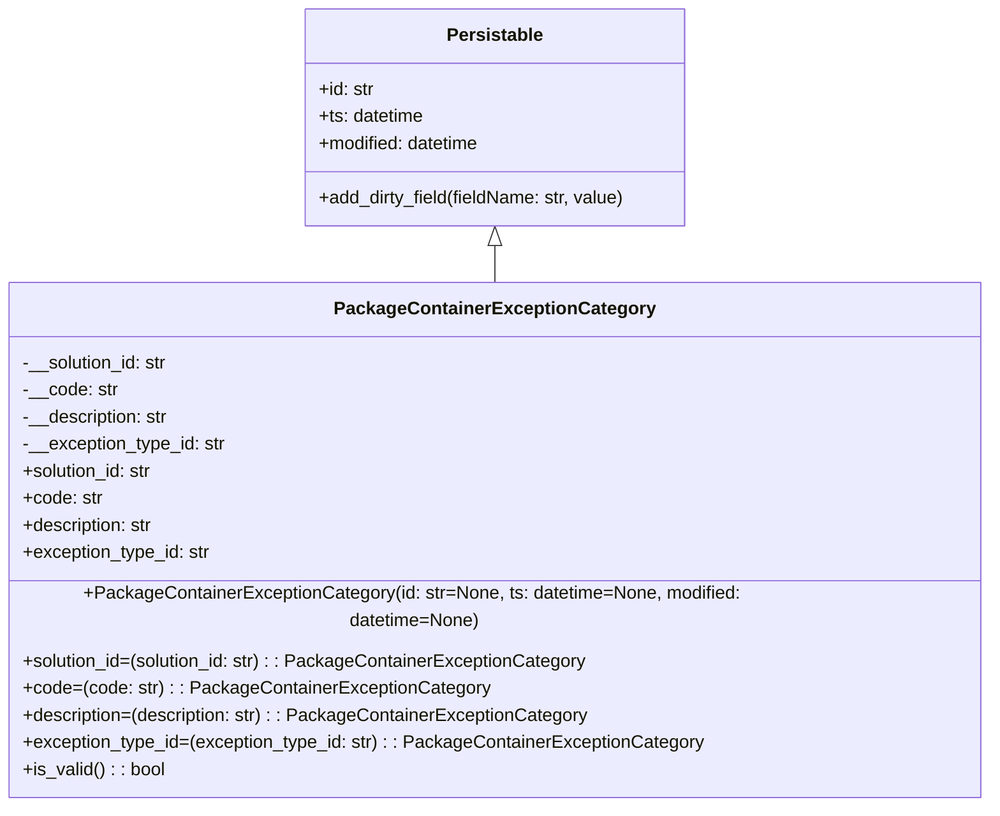

# Diagram: partview_core/partview_service/partview_service/core/datamodel/PackageContainerExceptionCategory.py

> Auto-generated by Obscura crawlers

## Mermaid

### SVG

<svg id="container" width="875.59375" xmlns="http://www.w3.org/2000/svg" class="classDiagram" height="690" viewBox="0 0 875.59375 690" role="graphics-document document" aria-roledescription="class"><g><defs><marker id="container_class-aggregationStart" class="marker aggregation class" refX="18" refY="7" markerWidth="190" markerHeight="240" orient="auto"><path d="M 18,7 L9,13 L1,7 L9,1 Z"></path></marker></defs><defs><marker id="container_class-aggregationEnd" class="marker aggregation class" refX="1" refY="7" markerWidth="20" markerHeight="28" orient="auto"><path d="M 18,7 L9,13 L1,7 L9,1 Z"></path></marker></defs><defs><marker id="container_class-extensionStart" class="marker extension class" refX="18" refY="7" markerWidth="190" markerHeight="240" orient="auto"><path d="M 1,7 L18,13 V 1 Z"></path></marker></defs><defs><marker id="container_class-extensionEnd" class="marker extension class" refX="1" refY="7" markerWidth="20" markerHeight="28" orient="auto"><path d="M 1,1 V 13 L18,7 Z"></path></marker></defs><defs><marker id="container_class-compositionStart" class="marker composition class" refX="18" refY="7" markerWidth="190" markerHeight="240" orient="auto"><path d="M 18,7 L9,13 L1,7 L9,1 Z"></path></marker></defs><defs><marker id="container_class-compositionEnd" class="marker composition class" refX="1" refY="7" markerWidth="20" markerHeight="28" orient="auto"><path d="M 18,7 L9,13 L1,7 L9,1 Z"></path></marker></defs><defs><marker id="container_class-dependencyStart" class="marker dependency class" refX="6" refY="7" markerWidth="190" markerHeight="240" orient="auto"><path d="M 5,7 L9,13 L1,7 L9,1 Z"></path></marker></defs><defs><marker id="container_class-dependencyEnd" class="marker dependency class" refX="13" refY="7" markerWidth="20" markerHeight="28" orient="auto"><path d="M 18,7 L9,13 L14,7 L9,1 Z"></path></marker></defs><defs><marker id="container_class-lollipopStart" class="marker lollipop class" refX="13" refY="7" markerWidth="190" markerHeight="240" orient="auto"><circle stroke="black" fill="transparent" cx="7" cy="7" r="6"></circle></marker></defs><defs><marker id="container_class-lollipopEnd" class="marker lollipop class" refX="1" refY="7" markerWidth="190" markerHeight="240" orient="auto"><circle stroke="black" fill="transparent" cx="7" cy="7" r="6"></circle></marker></defs><g class="root"><g class="clusters"></g><g class="edgePaths"><path d="M437.797,217.25L437.797,218.542C437.797,219.833,437.797,222.417,437.797,227.875C437.797,233.333,437.797,241.667,437.797,245.833L437.797,250" id="id_Persistable_PackageContainerExceptionCategory_1" class="edge-thickness-normal edge-pattern-solid relation" style=";;;" data-edge="true" data-et="edge" data-id="id_Persistable_PackageContainerExceptionCategory_1" data-points="W3sieCI6NDM3Ljc5Njg3NSwieSI6MjAwfSx7IngiOjQzNy43OTY4NzUsInkiOjIyNX0seyJ4Ijo0MzcuNzk2ODc1LCJ5IjoyNTB9XQ==" marker-start="url(#container_class-extensionStart)"></path></g><g class="edgeLabels"><g class="edgeLabel"><g class="label" data-id="id_Persistable_PackageContainerExceptionCategory_1" transform="translate(0, 0)"><foreignObject width="0" height="0">

</foreignObject></g></g></g><g class="nodes"><g class="node default" id="classId-Persistable-0" transform="translate(437.796875, 104)"><g class="basic label-container"><path d="M-169.86328125 -96 L169.86328125 -96 L169.86328125 96 L-169.86328125 96" stroke="none" stroke-width="0" fill="#ECECFF" style=""></path><path d="M-169.86328125 -96 C-38.80964727423216 -96, 92.24398670153568 -96, 169.86328125 -96 M-169.86328125 -96 C-49.85745237817807 -96, 70.14837649364387 -96, 169.86328125 -96 M169.86328125 -96 C169.86328125 -34.7258064501248, 169.86328125 26.5483870997504, 169.86328125 96 M169.86328125 -96 C169.86328125 -47.32257391044354, 169.86328125 1.3548521791129247, 169.86328125 96 M169.86328125 96 C55.04765559101456 96, -59.76797006797088 96, -169.86328125 96 M169.86328125 96 C81.70387737108594 96, -6.455526507828125 96, -169.86328125 96 M-169.86328125 96 C-169.86328125 22.151147135115735, -169.86328125 -51.69770572976853, -169.86328125 -96 M-169.86328125 96 C-169.86328125 55.185513349322136, -169.86328125 14.371026698644272, -169.86328125 -96" stroke="#9370DB" stroke-width="1.3" fill="none" stroke-dasharray="0 0" style=""></path></g><g class="annotation-group text" transform="translate(0, -72)"></g><g class="label-group text" transform="translate(-40.9765625, -72)"><g class="label" style="font-weight: bolder" transform="translate(0,-12)"><foreignObject width="81.953125" height="24">

Persistable

</foreignObject></g></g><g class="members-group text" transform="translate(-157.86328125, -24)"><g class="label" style="" transform="translate(0,-12)"><foreignObject width="49.578125" height="24">

+id: str

</foreignObject></g><g class="label" style="" transform="translate(0,12)"><foreignObject width="94.484375" height="24">

+ts: datetime

</foreignObject></g><g class="label" style="" transform="translate(0,36)"><foreignObject width="145.9375" height="24">

+modified: datetime

</foreignObject></g></g><g class="methods-group text" transform="translate(-157.86328125, 72)"><g class="label" style="" transform="translate(0,-12)"><foreignObject width="274.75" height="24">

+add_dirty_field(fieldName: str, value)

</foreignObject></g></g><g class="divider" style=""><path d="M-169.86328125 -48 C-72.15426403149829 -48, 25.554753187003428 -48, 169.86328125 -48 M-169.86328125 -48 C-100.09102454367037 -48, -30.318767837340744 -48, 169.86328125 -48" stroke="#9370DB" stroke-width="1.3" fill="none" stroke-dasharray="0 0" style=""></path></g><g class="divider" style=""><path d="M-169.86328125 48 C-80.46591613168984 48, 8.931448986620325 48, 169.86328125 48 M-169.86328125 48 C-36.404189580561905 48, 97.05490208887619 48, 169.86328125 48" stroke="#9370DB" stroke-width="1.3" fill="none" stroke-dasharray="0 0" style=""></path></g></g><g class="node default" id="classId-PackageContainerExceptionCategory-1" transform="translate(437.796875, 466)"><g class="basic label-container"><path d="M-429.796875 -216 L429.796875 -216 L429.796875 216 L-429.796875 216" stroke="none" stroke-width="0" fill="#ECECFF" style=""></path><path d="M-429.796875 -216 C-200.44385282806135 -216, 28.909169343877295 -216, 429.796875 -216 M-429.796875 -216 C-96.94299837786792 -216, 235.91087824426415 -216, 429.796875 -216 M429.796875 -216 C429.796875 -115.91391578248218, 429.796875 -15.827831564964356, 429.796875 216 M429.796875 -216 C429.796875 -128.96964432916178, 429.796875 -41.93928865832356, 429.796875 216 M429.796875 216 C118.3469966700464 216, -193.1028816599072 216, -429.796875 216 M429.796875 216 C202.08904693165388 216, -25.618781136692235 216, -429.796875 216 M-429.796875 216 C-429.796875 122.84573503135938, -429.796875 29.691470062718764, -429.796875 -216 M-429.796875 216 C-429.796875 90.38296959956396, -429.796875 -35.23406080087207, -429.796875 -216" stroke="#9370DB" stroke-width="1.3" fill="none" stroke-dasharray="0 0" style=""></path></g><g class="annotation-group text" transform="translate(0, -192)"></g><g class="label-group text" transform="translate(-133.671875, -192)"><g class="label" style="font-weight: bolder" transform="translate(0,-12)"><foreignObject width="267.34375" height="24">

PackageContainerExceptionCategory

</foreignObject></g></g><g class="members-group text" transform="translate(-417.796875, -144)"><g class="label" style="" transform="translate(0,-12)"><foreignObject width="131.390625" height="24">

-__solution_id: str

</foreignObject></g><g class="label" style="" transform="translate(0,12)"><foreignObject width="83.796875" height="24">

-__code: str

</foreignObject></g><g class="label" style="" transform="translate(0,36)"><foreignObject width="131.453125" height="24">

-__description: str

</foreignObject></g><g class="label" style="" transform="translate(0,60)"><foreignObject width="181.46875" height="24">

-__exception_type_id: str

</foreignObject></g><g class="label" style="" transform="translate(0,84)"><foreignObject width="117.71875" height="24">

+solution_id: str

</foreignObject></g><g class="label" style="" transform="translate(0,108)"><foreignObject width="70.453125" height="24">

+code: str

</foreignObject></g><g class="label" style="" transform="translate(0,132)"><foreignObject width="118.109375" height="24">

+description: str

</foreignObject></g><g class="label" style="" transform="translate(0,156)"><foreignObject width="168.125" height="24">

+exception_type_id: str

</foreignObject></g></g><g class="methods-group text" transform="translate(-417.796875, 72)"><g class="label" style="" transform="translate(0,-12)"><foreignObject width="701.921875" height="24">

+PackageContainerExceptionCategory(id: str=None, ts: datetime=None, modified: datetime=None)

</foreignObject></g><g class="label" style="" transform="translate(0,12)"><foreignObject width="501.21875" height="24">

+solution_id=(solution_id: str) : : PackageContainerExceptionCategory

</foreignObject></g><g class="label" style="" transform="translate(0,36)"><foreignObject width="406.703125" height="24">

+code=(code: str) : : PackageContainerExceptionCategory

</foreignObject></g><g class="label" style="" transform="translate(0,60)"><foreignObject width="502" height="24">

+description=(description: str) : : PackageContainerExceptionCategory

</foreignObject></g><g class="label" style="" transform="translate(0,84)"><foreignObject width="602.03125" height="24">

+exception_type_id=(exception_type_id: str) : : PackageContainerExceptionCategory

</foreignObject></g><g class="label" style="" transform="translate(0,108)"><foreignObject width="126.078125" height="24">

+is_valid() : : bool

</foreignObject></g></g><g class="divider" style=""><path d="M-429.796875 -168 C-131.47813801140722 -168, 166.84059897718555 -168, 429.796875 -168 M-429.796875 -168 C-156.4533731663571 -168, 116.89012866728581 -168, 429.796875 -168" stroke="#9370DB" stroke-width="1.3" fill="none" stroke-dasharray="0 0" style=""></path></g><g class="divider" style=""><path d="M-429.796875 48 C-232.5257892840193 48, -35.25470356803862 48, 429.796875 48 M-429.796875 48 C-194.998952595091 48, 39.798969809818004 48, 429.796875 48" stroke="#9370DB" stroke-width="1.3" fill="none" stroke-dasharray="0 0" style=""></path></g></g></g></g></g></svg>
