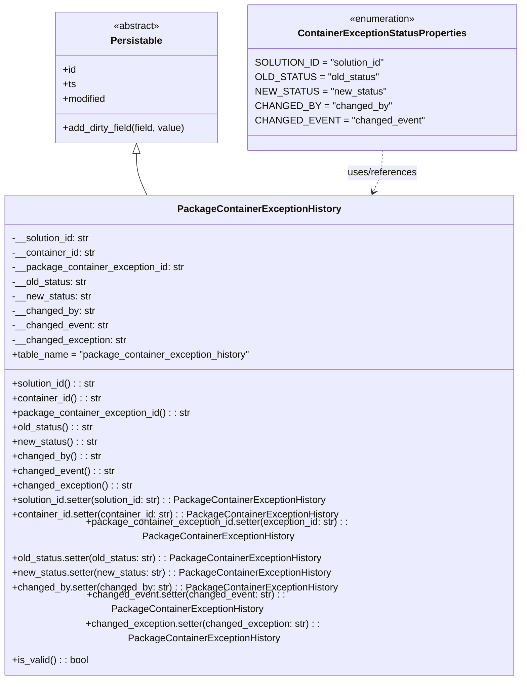

# Diagram: partview_core/partview_service/partview_service/core/datamodel/PackageContainerExceptionHistory.py

> Auto-generated by Obscura crawlers

## Mermaid

### SVG

<svg id="container" width="860.09375" xmlns="http://www.w3.org/2000/svg" class="classDiagram" height="1050" viewBox="0 0 860.09375 1050" role="graphics-document document" aria-roledescription="class"><g><defs><marker id="container_class-aggregationStart" class="marker aggregation class" refX="18" refY="7" markerWidth="190" markerHeight="240" orient="auto"><path d="M 18,7 L9,13 L1,7 L9,1 Z"></path></marker></defs><defs><marker id="container_class-aggregationEnd" class="marker aggregation class" refX="1" refY="7" markerWidth="20" markerHeight="28" orient="auto"><path d="M 18,7 L9,13 L1,7 L9,1 Z"></path></marker></defs><defs><marker id="container_class-extensionStart" class="marker extension class" refX="18" refY="7" markerWidth="190" markerHeight="240" orient="auto"><path d="M 1,7 L18,13 V 1 Z"></path></marker></defs><defs><marker id="container_class-extensionEnd" class="marker extension class" refX="1" refY="7" markerWidth="20" markerHeight="28" orient="auto"><path d="M 1,1 V 13 L18,7 Z"></path></marker></defs><defs><marker id="container_class-compositionStart" class="marker composition class" refX="18" refY="7" markerWidth="190" markerHeight="240" orient="auto"><path d="M 18,7 L9,13 L1,7 L9,1 Z"></path></marker></defs><defs><marker id="container_class-compositionEnd" class="marker composition class" refX="1" refY="7" markerWidth="20" markerHeight="28" orient="auto"><path d="M 18,7 L9,13 L1,7 L9,1 Z"></path></marker></defs><defs><marker id="container_class-dependencyStart" class="marker dependency class" refX="6" refY="7" markerWidth="190" markerHeight="240" orient="auto"><path d="M 5,7 L9,13 L1,7 L9,1 Z"></path></marker></defs><defs><marker id="container_class-dependencyEnd" class="marker dependency class" refX="13" refY="7" markerWidth="20" markerHeight="28" orient="auto"><path d="M 18,7 L9,13 L14,7 L9,1 Z"></path></marker></defs><defs><marker id="container_class-lollipopStart" class="marker lollipop class" refX="13" refY="7" markerWidth="190" markerHeight="240" orient="auto"><circle stroke="black" fill="transparent" cx="7" cy="7" r="6"></circle></marker></defs><defs><marker id="container_class-lollipopEnd" class="marker lollipop class" refX="1" refY="7" markerWidth="190" markerHeight="240" orient="auto"><circle stroke="black" fill="transparent" cx="7" cy="7" r="6"></circle></marker></defs><g class="root"><g class="clusters"></g><g class="edgePaths"><path d="M232.809,253.25L232.809,258.542C232.809,263.833,232.809,274.417,235.872,285.875C238.936,297.333,245.064,309.667,248.127,315.833L251.191,322" id="id_Persistable_PackageContainerExceptionHistory_1" class="edge-thickness-normal edge-pattern-solid relation" style=";;;" data-edge="true" data-et="edge" data-id="id_Persistable_PackageContainerExceptionHistory_1" data-points="W3sieCI6MjMyLjgwODU5Mzc1LCJ5IjoyMzZ9LHsieCI6MjMyLjgwODU5Mzc1LCJ5IjoyODV9LHsieCI6MjUxLjE5MTAwMjgzMzc1MzE1LCJ5IjozMjJ9XQ==" marker-start="url(#container_class-extensionStart)"></path><path d="M627.285,248L627.285,254.167C627.285,260.333,627.285,272.667,624.666,284.104C622.048,295.542,616.81,306.084,614.191,311.356L611.572,316.627" id="id_ContainerExceptionStatusProperties_PackageContainerExceptionHistory_2" class="edge-thickness-normal edge-pattern-dashed relation" style=";;;" data-edge="true" data-et="edge" data-id="id_ContainerExceptionStatusProperties_PackageContainerExceptionHistory_2" data-points="W3sieCI6NjI3LjI4NTE1NjI1LCJ5IjoyNDh9LHsieCI6NjI3LjI4NTE1NjI1LCJ5IjoyODV9LHsieCI6NjA4LjkwMjc0NzE2NjI0NjksInkiOjMyMn1d" marker-end="url(#container_class-dependencyEnd)"></path></g><g class="edgeLabels"><g class="edgeLabel"><g class="label" data-id="id_Persistable_PackageContainerExceptionHistory_1" transform="translate(0, 0)"><foreignObject width="0" height="0">

</foreignObject></g></g><g class="edgeLabel" transform="translate(627.28515625, 285)"><g class="label" data-id="id_ContainerExceptionStatusProperties_PackageContainerExceptionHistory_2" transform="translate(-58.234375, -12)"><foreignObject width="116.46875" height="24">

uses/references

</foreignObject></g></g></g><g class="nodes"><g class="node default" id="classId-Persistable-0" transform="translate(232.80859375, 128)"><g class="basic label-container"><path d="M-135.71484375 -108 L135.71484375 -108 L135.71484375 108 L-135.71484375 108" stroke="none" stroke-width="0" fill="#ECECFF" style=""></path><path d="M-135.71484375 -108 C-55.515208243416524 -108, 24.684427263166953 -108, 135.71484375 -108 M-135.71484375 -108 C-78.36112658879368 -108, -21.007409427587362 -108, 135.71484375 -108 M135.71484375 -108 C135.71484375 -48.01161816026461, 135.71484375 11.976763679470778, 135.71484375 108 M135.71484375 -108 C135.71484375 -45.87781055243999, 135.71484375 16.244378895120022, 135.71484375 108 M135.71484375 108 C79.10959995760356 108, 22.50435616520714 108, -135.71484375 108 M135.71484375 108 C31.71277124400872 108, -72.28930126198256 108, -135.71484375 108 M-135.71484375 108 C-135.71484375 28.740396138293207, -135.71484375 -50.51920772341359, -135.71484375 -108 M-135.71484375 108 C-135.71484375 48.74604769069279, -135.71484375 -10.507904618614418, -135.71484375 -108" stroke="#9370DB" stroke-width="1.3" fill="none" stroke-dasharray="0 0" style=""></path></g><g class="annotation-group text" transform="translate(-38.609375, -84)"><g class="label" style="" transform="translate(0,-12)"><foreignObject width="77.21875" height="24">

«abstract»

</foreignObject></g></g><g class="label-group text" transform="translate(-40.9765625, -60)"><g class="label" style="font-weight: bolder" transform="translate(0,-12)"><foreignObject width="81.953125" height="24">

Persistable

</foreignObject></g></g><g class="members-group text" transform="translate(-123.71484375, -12)"><g class="label" style="" transform="translate(0,-12)"><foreignObject width="22.078125" height="24">

+id

</foreignObject></g><g class="label" style="" transform="translate(0,12)"><foreignObject width="21.15625" height="24">

+ts

</foreignObject></g><g class="label" style="" transform="translate(0,36)"><foreignObject width="72.609375" height="24">

+modified

</foreignObject></g></g><g class="methods-group text" transform="translate(-123.71484375, 84)"><g class="label" style="" transform="translate(0,-12)"><foreignObject width="206.453125" height="24">

+add_dirty_field(field, value)

</foreignObject></g></g><g class="divider" style=""><path d="M-135.71484375 -36 C-62.971612158510595 -36, 9.77161943297881 -36, 135.71484375 -36 M-135.71484375 -36 C-67.39559099535856 -36, 0.9236617592828793 -36, 135.71484375 -36" stroke="#9370DB" stroke-width="1.3" fill="none" stroke-dasharray="0 0" style=""></path></g><g class="divider" style=""><path d="M-135.71484375 60 C-45.90890851976786 60, 43.897026710464274 60, 135.71484375 60 M-135.71484375 60 C-78.48652923304829 60, -21.258214716096575 60, 135.71484375 60" stroke="#9370DB" stroke-width="1.3" fill="none" stroke-dasharray="0 0" style=""></path></g></g><g class="node default" id="classId-ContainerExceptionStatusProperties-1" transform="translate(627.28515625, 128)"><g class="basic label-container"><path d="M-208.76171875 -120 L208.76171875 -120 L208.76171875 120 L-208.76171875 120" stroke="none" stroke-width="0" fill="#ECECFF" style=""></path><path d="M-208.76171875 -120 C-60.35285360150576 -120, 88.05601154698849 -120, 208.76171875 -120 M-208.76171875 -120 C-60.89363474286526 -120, 86.97444926426948 -120, 208.76171875 -120 M208.76171875 -120 C208.76171875 -35.55526789336342, 208.76171875 48.88946421327316, 208.76171875 120 M208.76171875 -120 C208.76171875 -42.12399994271398, 208.76171875 35.75200011457204, 208.76171875 120 M208.76171875 120 C95.14067762360591 120, -18.48036350278818 120, -208.76171875 120 M208.76171875 120 C54.79339929675032 120, -99.17492015649935 120, -208.76171875 120 M-208.76171875 120 C-208.76171875 56.065340300765925, -208.76171875 -7.86931939846815, -208.76171875 -120 M-208.76171875 120 C-208.76171875 64.0920330407036, -208.76171875 8.184066081407195, -208.76171875 -120" stroke="#9370DB" stroke-width="1.3" fill="none" stroke-dasharray="0 0" style=""></path></g><g class="annotation-group text" transform="translate(-55.5546875, -96)"><g class="label" style="" transform="translate(0,-12)"><foreignObject width="111.109375" height="24">

«enumeration»

</foreignObject></g></g><g class="label-group text" transform="translate(-133.0859375, -72)"><g class="label" style="font-weight: bolder" transform="translate(0,-12)"><foreignObject width="266.171875" height="24">

ContainerExceptionStatusProperties

</foreignObject></g></g><g class="members-group text" transform="translate(-196.76171875, -24)"><g class="label" style="" transform="translate(0,-12)"><foreignObject width="207.609375" height="24">

SOLUTION_ID = "solution_id"

</foreignObject></g><g class="label" style="" transform="translate(0,12)"><foreignObject width="193.484375" height="24">

OLD_STATUS = "old_status"

</foreignObject></g><g class="label" style="" transform="translate(0,36)"><foreignObject width="202.40625" height="24">

NEW_STATUS = "new_status"

</foreignObject></g><g class="label" style="" transform="translate(0,60)"><foreignObject width="210.90625" height="24">

CHANGED_BY = "changed_by"

</foreignObject></g><g class="label" style="" transform="translate(0,84)"><foreignObject width="260.4375" height="24">

CHANGED_EVENT = "changed_event"

</foreignObject></g></g><g class="methods-group text" transform="translate(-196.76171875, 120)"></g><g class="divider" style=""><path d="M-208.76171875 -48 C-109.08568140758163 -48, -9.409644065163263 -48, 208.76171875 -48 M-208.76171875 -48 C-119.23168152349422 -48, -29.701644296988434 -48, 208.76171875 -48" stroke="#9370DB" stroke-width="1.3" fill="none" stroke-dasharray="0 0" style=""></path></g><g class="divider" style=""><path d="M-208.76171875 96 C-102.73908446740124 96, 3.2835498151975173 96, 208.76171875 96 M-208.76171875 96 C-121.60223516236839 96, -34.442751574736775 96, 208.76171875 96" stroke="#9370DB" stroke-width="1.3" fill="none" stroke-dasharray="0 0" style=""></path></g></g><g class="node default" id="classId-PackageContainerExceptionHistory-2" transform="translate(430.046875, 682)"><g class="basic label-container"><path d="M-422.046875 -360 L422.046875 -360 L422.046875 360 L-422.046875 360" stroke="none" stroke-width="0" fill="#ECECFF" style=""></path><path d="M-422.046875 -360 C-245.31507550037549 -360, -68.58327600075097 -360, 422.046875 -360 M-422.046875 -360 C-90.26101102458722 -360, 241.52485295082556 -360, 422.046875 -360 M422.046875 -360 C422.046875 -167.9489656086014, 422.046875 24.102068782797176, 422.046875 360 M422.046875 -360 C422.046875 -83.4409545467928, 422.046875 193.1180909064144, 422.046875 360 M422.046875 360 C106.01517905238046 360, -210.01651689523908 360, -422.046875 360 M422.046875 360 C223.94789163281018 360, 25.848908265620366 360, -422.046875 360 M-422.046875 360 C-422.046875 204.39634856878178, -422.046875 48.79269713756355, -422.046875 -360 M-422.046875 360 C-422.046875 130.22964687597678, -422.046875 -99.54070624804643, -422.046875 -360" stroke="#9370DB" stroke-width="1.3" fill="none" stroke-dasharray="0 0" style=""></path></g><g class="annotation-group text" transform="translate(0, -336)"></g><g class="label-group text" transform="translate(-127.5625, -336)"><g class="label" style="font-weight: bolder" transform="translate(0,-12)"><foreignObject width="255.125" height="24">

PackageContainerExceptionHistory

</foreignObject></g></g><g class="members-group text" transform="translate(-410.046875, -288)"><g class="label" style="" transform="translate(0,-12)"><foreignObject width="131.390625" height="24">

-__solution_id: str

</foreignObject></g><g class="label" style="" transform="translate(0,12)"><foreignObject width="139.15625" height="24">

-__container_id: str

</foreignObject></g><g class="label" style="" transform="translate(0,36)"><foreignObject width="284.890625" height="24">

-__package_container_exception_id: str

</foreignObject></g><g class="label" style="" transform="translate(0,60)"><foreignObject width="125.078125" height="24">

-__old_status: str

</foreignObject></g><g class="label" style="" transform="translate(0,84)"><foreignObject width="131.125" height="24">

-__new_status: str

</foreignObject></g><g class="label" style="" transform="translate(0,108)"><foreignObject width="135.984375" height="24">

-__changed_by: str

</foreignObject></g><g class="label" style="" transform="translate(0,132)"><foreignObject width="158.703125" height="24">

-__changed_event: str

</foreignObject></g><g class="label" style="" transform="translate(0,156)"><foreignObject width="189.046875" height="24">

-__changed_exception: str

</foreignObject></g><g class="label" style="" transform="translate(0,180)"><foreignObject width="394.8125" height="24">

+table_name = "package_container_exception_history"

</foreignObject></g></g><g class="methods-group text" transform="translate(-410.046875, -48)"><g class="label" style="" transform="translate(0,-12)"><foreignObject width="140.40625" height="24">

+solution_id() : : str

</foreignObject></g><g class="label" style="" transform="translate(0,12)"><foreignObject width="148.5" height="24">

+container_id() : : str

</foreignObject></g><g class="label" style="" transform="translate(0,36)"><foreignObject width="293.90625" height="24">

+package_container_exception_id() : : str

</foreignObject></g><g class="label" style="" transform="translate(0,60)"><foreignObject width="134.421875" height="24">

+old_status() : : str

</foreignObject></g><g class="label" style="" transform="translate(0,84)"><foreignObject width="140.15625" height="24">

+new_status() : : str

</foreignObject></g><g class="label" style="" transform="translate(0,108)"><foreignObject width="145.265625" height="24">

+changed_by() : : str

</foreignObject></g><g class="label" style="" transform="translate(0,132)"><foreignObject width="167.96875" height="24">

+changed_event() : : str

</foreignObject></g><g class="label" style="" transform="translate(0,156)"><foreignObject width="198.390625" height="24">

+changed_exception() : : str

</foreignObject></g><g class="label" style="" transform="translate(0,180)"><foreignObject width="528.109375" height="24">

+solution_id.setter(solution_id: str) : : PackageContainerExceptionHistory

</foreignObject></g><g class="label" style="" transform="translate(0,204)"><foreignObject width="544.296875" height="24">

+container_id.setter(container_id: str) : : PackageContainerExceptionHistory

</foreignObject></g><g class="label" style="" transform="translate(0,228)"><foreignObject width="692.53125" height="24">

+package_container_exception_id.setter(exception_id: str) : : PackageContainerExceptionHistory

</foreignObject></g><g class="label" style="" transform="translate(0,252)"><foreignObject width="516.140625" height="24">

+old_status.setter(old_status: str) : : PackageContainerExceptionHistory

</foreignObject></g><g class="label" style="" transform="translate(0,276)"><foreignObject width="527.59375" height="24">

+new_status.setter(new_status: str) : : PackageContainerExceptionHistory

</foreignObject></g><g class="label" style="" transform="translate(0,300)"><foreignObject width="537.25" height="24">

+changed_by.setter(changed_by: str) : : PackageContainerExceptionHistory

</foreignObject></g><g class="label" style="" transform="translate(0,324)"><foreignObject width="583.375" height="24">

+changed_event.setter(changed_event: str) : : PackageContainerExceptionHistory

</foreignObject></g><g class="label" style="" transform="translate(0,348)"><foreignObject width="644.078125" height="24">

+changed_exception.setter(changed_exception: str) : : PackageContainerExceptionHistory

</foreignObject></g><g class="label" style="" transform="translate(0,372)"><foreignObject width="126.078125" height="24">

+is_valid() : : bool

</foreignObject></g></g><g class="divider" style=""><path d="M-422.046875 -312 C-224.45252020139404 -312, -26.858165402788075 -312, 422.046875 -312 M-422.046875 -312 C-247.62715349892142 -312, -73.20743199784283 -312, 422.046875 -312" stroke="#9370DB" stroke-width="1.3" fill="none" stroke-dasharray="0 0" style=""></path></g><g class="divider" style=""><path d="M-422.046875 -72 C-192.6234947450394 -72, 36.79988550992118 -72, 422.046875 -72 M-422.046875 -72 C-152.62377114137058 -72, 116.79933271725884 -72, 422.046875 -72" stroke="#9370DB" stroke-width="1.3" fill="none" stroke-dasharray="0 0" style=""></path></g></g></g></g></g></svg>
