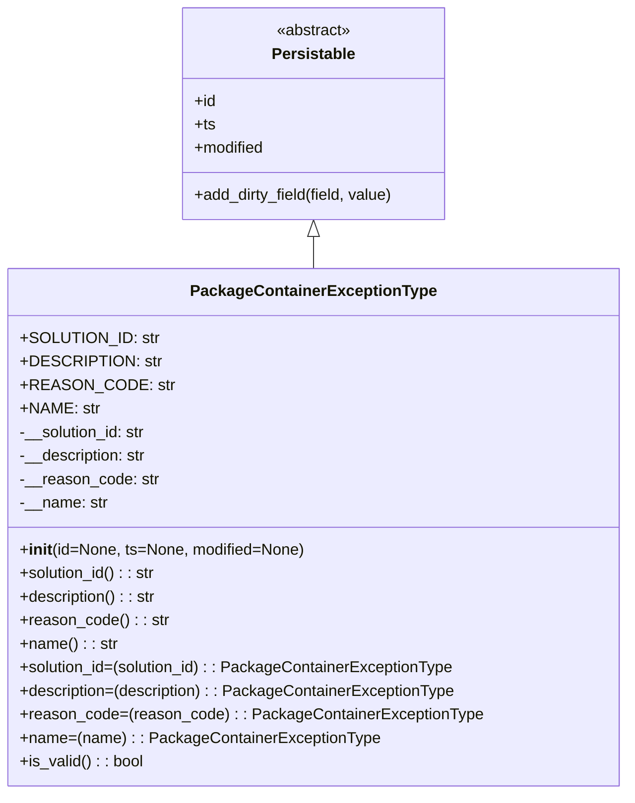

# Diagram: partview_core/partview_service/partview_service/core/datamodel/PackageContainerExceptionType.py

> Auto-generated by Obscura crawlers

## Mermaid

### SVG

<svg id="container" width="622.171875" xmlns="http://www.w3.org/2000/svg" class="classDiagram" height="810" viewBox="0 0 622.171875 810" role="graphics-document document" aria-roledescription="class"><g><defs><marker id="container_class-aggregationStart" class="marker aggregation class" refX="18" refY="7" markerWidth="190" markerHeight="240" orient="auto"><path d="M 18,7 L9,13 L1,7 L9,1 Z"></path></marker></defs><defs><marker id="container_class-aggregationEnd" class="marker aggregation class" refX="1" refY="7" markerWidth="20" markerHeight="28" orient="auto"><path d="M 18,7 L9,13 L1,7 L9,1 Z"></path></marker></defs><defs><marker id="container_class-extensionStart" class="marker extension class" refX="18" refY="7" markerWidth="190" markerHeight="240" orient="auto"><path d="M 1,7 L18,13 V 1 Z"></path></marker></defs><defs><marker id="container_class-extensionEnd" class="marker extension class" refX="1" refY="7" markerWidth="20" markerHeight="28" orient="auto"><path d="M 1,1 V 13 L18,7 Z"></path></marker></defs><defs><marker id="container_class-compositionStart" class="marker composition class" refX="18" refY="7" markerWidth="190" markerHeight="240" orient="auto"><path d="M 18,7 L9,13 L1,7 L9,1 Z"></path></marker></defs><defs><marker id="container_class-compositionEnd" class="marker composition class" refX="1" refY="7" markerWidth="20" markerHeight="28" orient="auto"><path d="M 18,7 L9,13 L1,7 L9,1 Z"></path></marker></defs><defs><marker id="container_class-dependencyStart" class="marker dependency class" refX="6" refY="7" markerWidth="190" markerHeight="240" orient="auto"><path d="M 5,7 L9,13 L1,7 L9,1 Z"></path></marker></defs><defs><marker id="container_class-dependencyEnd" class="marker dependency class" refX="13" refY="7" markerWidth="20" markerHeight="28" orient="auto"><path d="M 18,7 L9,13 L14,7 L9,1 Z"></path></marker></defs><defs><marker id="container_class-lollipopStart" class="marker lollipop class" refX="13" refY="7" markerWidth="190" markerHeight="240" orient="auto"><circle stroke="black" fill="transparent" cx="7" cy="7" r="6"></circle></marker></defs><defs><marker id="container_class-lollipopEnd" class="marker lollipop class" refX="1" refY="7" markerWidth="190" markerHeight="240" orient="auto"><circle stroke="black" fill="transparent" cx="7" cy="7" r="6"></circle></marker></defs><g class="root"><g class="clusters"></g><g class="edgePaths"><path d="M311.086,241.25L311.086,242.542C311.086,243.833,311.086,246.417,311.086,251.875C311.086,257.333,311.086,265.667,311.086,269.833L311.086,274" id="id_Persistable_PackageContainerExceptionType_1" class="edge-thickness-normal edge-pattern-solid relation" style=";;;" data-edge="true" data-et="edge" data-id="id_Persistable_PackageContainerExceptionType_1" data-points="W3sieCI6MzExLjA4NTkzNzUsInkiOjIyNH0seyJ4IjozMTEuMDg1OTM3NSwieSI6MjQ5fSx7IngiOjMxMS4wODU5Mzc1LCJ5IjoyNzR9XQ==" marker-start="url(#container_class-extensionStart)"></path></g><g class="edgeLabels"><g class="edgeLabel"><g class="label" data-id="id_Persistable_PackageContainerExceptionType_1" transform="translate(0, 0)"><foreignObject width="0" height="0">

</foreignObject></g></g></g><g class="nodes"><g class="node default" id="classId-Persistable-0" transform="translate(311.0859375, 116)"><g class="basic label-container"><path d="M-135.71484375 -108 L135.71484375 -108 L135.71484375 108 L-135.71484375 108" stroke="none" stroke-width="0" fill="#ECECFF" style=""></path><path d="M-135.71484375 -108 C-27.237458926280638 -108, 81.23992589743872 -108, 135.71484375 -108 M-135.71484375 -108 C-65.61101652360915 -108, 4.492810702781696 -108, 135.71484375 -108 M135.71484375 -108 C135.71484375 -34.984263338881235, 135.71484375 38.03147332223753, 135.71484375 108 M135.71484375 -108 C135.71484375 -30.755925858182323, 135.71484375 46.488148283635354, 135.71484375 108 M135.71484375 108 C57.065241176324875 108, -21.58436139735025 108, -135.71484375 108 M135.71484375 108 C44.48250668589435 108, -46.7498303782113 108, -135.71484375 108 M-135.71484375 108 C-135.71484375 54.562826852116004, -135.71484375 1.1256537042320076, -135.71484375 -108 M-135.71484375 108 C-135.71484375 44.700461460120216, -135.71484375 -18.599077079759567, -135.71484375 -108" stroke="#9370DB" stroke-width="1.3" fill="none" stroke-dasharray="0 0" style=""></path></g><g class="annotation-group text" transform="translate(-38.609375, -84)"><g class="label" style="" transform="translate(0,-12)"><foreignObject width="77.21875" height="24">

«abstract»

</foreignObject></g></g><g class="label-group text" transform="translate(-40.9765625, -60)"><g class="label" style="font-weight: bolder" transform="translate(0,-12)"><foreignObject width="81.953125" height="24">

Persistable

</foreignObject></g></g><g class="members-group text" transform="translate(-123.71484375, -12)"><g class="label" style="" transform="translate(0,-12)"><foreignObject width="22.078125" height="24">

+id

</foreignObject></g><g class="label" style="" transform="translate(0,12)"><foreignObject width="21.15625" height="24">

+ts

</foreignObject></g><g class="label" style="" transform="translate(0,36)"><foreignObject width="72.609375" height="24">

+modified

</foreignObject></g></g><g class="methods-group text" transform="translate(-123.71484375, 84)"><g class="label" style="" transform="translate(0,-12)"><foreignObject width="206.453125" height="24">

+add_dirty_field(field, value)

</foreignObject></g></g><g class="divider" style=""><path d="M-135.71484375 -36 C-76.91394080004235 -36, -18.11303785008471 -36, 135.71484375 -36 M-135.71484375 -36 C-40.66074281308511 -36, 54.393358123829785 -36, 135.71484375 -36" stroke="#9370DB" stroke-width="1.3" fill="none" stroke-dasharray="0 0" style=""></path></g><g class="divider" style=""><path d="M-135.71484375 60 C-80.56492695372367 60, -25.41501015744734 60, 135.71484375 60 M-135.71484375 60 C-68.40949399984947 60, -1.1041442496989475 60, 135.71484375 60" stroke="#9370DB" stroke-width="1.3" fill="none" stroke-dasharray="0 0" style=""></path></g></g><g class="node default" id="classId-PackageContainerExceptionType-1" transform="translate(311.0859375, 538)"><g class="basic label-container"><path d="M-303.0859375 -264 L303.0859375 -264 L303.0859375 264 L-303.0859375 264" stroke="none" stroke-width="0" fill="#ECECFF" style=""></path><path d="M-303.0859375 -264 C-103.2951519125161 -264, 96.49563367496779 -264, 303.0859375 -264 M-303.0859375 -264 C-95.67470098705621 -264, 111.73653552588758 -264, 303.0859375 -264 M303.0859375 -264 C303.0859375 -126.90835279026084, 303.0859375 10.18329441947833, 303.0859375 264 M303.0859375 -264 C303.0859375 -120.65861125989639, 303.0859375 22.68277748020722, 303.0859375 264 M303.0859375 264 C90.63069070705507 264, -121.82455608588987 264, -303.0859375 264 M303.0859375 264 C111.95926535898244 264, -79.16740678203513 264, -303.0859375 264 M-303.0859375 264 C-303.0859375 126.07069839787437, -303.0859375 -11.858603204251267, -303.0859375 -264 M-303.0859375 264 C-303.0859375 120.38335225887457, -303.0859375 -23.233295482250867, -303.0859375 -264" stroke="#9370DB" stroke-width="1.3" fill="none" stroke-dasharray="0 0" style=""></path></g><g class="annotation-group text" transform="translate(0, -240)"></g><g class="label-group text" transform="translate(-118.484375, -240)"><g class="label" style="font-weight: bolder" transform="translate(0,-12)"><foreignObject width="236.96875" height="24">

PackageContainerExceptionType

</foreignObject></g></g><g class="members-group text" transform="translate(-291.0859375, -192)"><g class="label" style="" transform="translate(0,-12)"><foreignObject width="131.140625" height="24">

+SOLUTION_ID: str

</foreignObject></g><g class="label" style="" transform="translate(0,12)"><foreignObject width="130.171875" height="24">

+DESCRIPTION: str

</foreignObject></g><g class="label" style="" transform="translate(0,36)"><foreignObject width="139.875" height="24">

+REASON_CODE: str

</foreignObject></g><g class="label" style="" transform="translate(0,60)"><foreignObject width="76.59375" height="24">

+NAME: str

</foreignObject></g><g class="label" style="" transform="translate(0,84)"><foreignObject width="131.390625" height="24">

-__solution_id: str

</foreignObject></g><g class="label" style="" transform="translate(0,108)"><foreignObject width="131.453125" height="24">

-__description: str

</foreignObject></g><g class="label" style="" transform="translate(0,132)"><foreignObject width="141.109375" height="24">

-__reason_code: str

</foreignObject></g><g class="label" style="" transform="translate(0,156)"><foreignObject width="89.671875" height="24">

-__name: str

</foreignObject></g></g><g class="methods-group text" transform="translate(-291.0859375, 24)"><g class="label" style="" transform="translate(0,-12)"><foreignObject width="289.6875" height="24">

+<strong>init</strong>(id=None, ts=None, modified=None)

</foreignObject></g><g class="label" style="" transform="translate(0,12)"><foreignObject width="140.40625" height="24">

+solution_id() : : str

</foreignObject></g><g class="label" style="" transform="translate(0,36)"><foreignObject width="140.796875" height="24">

+description() : : str

</foreignObject></g><g class="label" style="" transform="translate(0,60)"><foreignObject width="150.140625" height="24">

+reason_code() : : str

</foreignObject></g><g class="label" style="" transform="translate(0,84)"><foreignObject width="98.703125" height="24">

+name() : : str

</foreignObject></g><g class="label" style="" transform="translate(0,108)"><foreignObject width="444.234375" height="24">

+solution_id=(solution_id) : : PackageContainerExceptionType

</foreignObject></g><g class="label" style="" transform="translate(0,132)"><foreignObject width="445" height="24">

+description=(description) : : PackageContainerExceptionType

</foreignObject></g><g class="label" style="" transform="translate(0,156)"><foreignObject width="463.6875" height="24">

+reason_code=(reason_code) : : PackageContainerExceptionType

</foreignObject></g><g class="label" style="" transform="translate(0,180)"><foreignObject width="360.8125" height="24">

+name=(name) : : PackageContainerExceptionType

</foreignObject></g><g class="label" style="" transform="translate(0,204)"><foreignObject width="126.078125" height="24">

+is_valid() : : bool

</foreignObject></g></g><g class="divider" style=""><path d="M-303.0859375 -216 C-175.8697495869516 -216, -48.6535616739032 -216, 303.0859375 -216 M-303.0859375 -216 C-105.58905173371008 -216, 91.90783403257984 -216, 303.0859375 -216" stroke="#9370DB" stroke-width="1.3" fill="none" stroke-dasharray="0 0" style=""></path></g><g class="divider" style=""><path d="M-303.0859375 0 C-99.81064660996304 0, 103.46464428007391 0, 303.0859375 0 M-303.0859375 0 C-72.61201096460073 0, 157.86191557079854 0, 303.0859375 0" stroke="#9370DB" stroke-width="1.3" fill="none" stroke-dasharray="0 0" style=""></path></g></g></g></g></g></svg>
