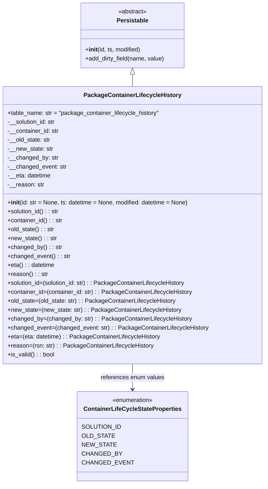

# Diagram: partview_core/partview_service/partview_service/core/datamodel/PackageContainerLifecycleHistory.py

> Auto-generated by Obscura crawlers

## Mermaid

### SVG

<svg id="container" width="701" xmlns="http://www.w3.org/2000/svg" class="classDiagram" height="1298" viewBox="0 0 701 1298" role="graphics-document document" aria-roledescription="class"><g><defs><marker id="container_class-aggregationStart" class="marker aggregation class" refX="18" refY="7" markerWidth="190" markerHeight="240" orient="auto"><path d="M 18,7 L9,13 L1,7 L9,1 Z"></path></marker></defs><defs><marker id="container_class-aggregationEnd" class="marker aggregation class" refX="1" refY="7" markerWidth="20" markerHeight="28" orient="auto"><path d="M 18,7 L9,13 L1,7 L9,1 Z"></path></marker></defs><defs><marker id="container_class-extensionStart" class="marker extension class" refX="18" refY="7" markerWidth="190" markerHeight="240" orient="auto"><path d="M 1,7 L18,13 V 1 Z"></path></marker></defs><defs><marker id="container_class-extensionEnd" class="marker extension class" refX="1" refY="7" markerWidth="20" markerHeight="28" orient="auto"><path d="M 1,1 V 13 L18,7 Z"></path></marker></defs><defs><marker id="container_class-compositionStart" class="marker composition class" refX="18" refY="7" markerWidth="190" markerHeight="240" orient="auto"><path d="M 18,7 L9,13 L1,7 L9,1 Z"></path></marker></defs><defs><marker id="container_class-compositionEnd" class="marker composition class" refX="1" refY="7" markerWidth="20" markerHeight="28" orient="auto"><path d="M 18,7 L9,13 L1,7 L9,1 Z"></path></marker></defs><defs><marker id="container_class-dependencyStart" class="marker dependency class" refX="6" refY="7" markerWidth="190" markerHeight="240" orient="auto"><path d="M 5,7 L9,13 L1,7 L9,1 Z"></path></marker></defs><defs><marker id="container_class-dependencyEnd" class="marker dependency class" refX="13" refY="7" markerWidth="20" markerHeight="28" orient="auto"><path d="M 18,7 L9,13 L14,7 L9,1 Z"></path></marker></defs><defs><marker id="container_class-lollipopStart" class="marker lollipop class" refX="13" refY="7" markerWidth="190" markerHeight="240" orient="auto"><circle stroke="black" fill="transparent" cx="7" cy="7" r="6"></circle></marker></defs><defs><marker id="container_class-lollipopEnd" class="marker lollipop class" refX="1" refY="7" markerWidth="190" markerHeight="240" orient="auto"><circle stroke="black" fill="transparent" cx="7" cy="7" r="6"></circle></marker></defs><g class="root"><g class="clusters"></g><g class="edgePaths"><path d="M350.5,199.25L350.5,200.542C350.5,201.833,350.5,204.417,350.5,209.875C350.5,215.333,350.5,223.667,350.5,227.833L350.5,232" id="id_Persistable_PackageContainerLifecycleHistory_1" class="edge-thickness-normal edge-pattern-solid relation" style=";;;" data-edge="true" data-et="edge" data-id="id_Persistable_PackageContainerLifecycleHistory_1" data-points="W3sieCI6MzUwLjUsInkiOjE4Mn0seyJ4IjozNTAuNSwieSI6MjA3fSx7IngiOjM1MC41LCJ5IjoyMzJ9XQ==" marker-start="url(#container_class-extensionStart)"></path><path d="M350.5,976L350.5,982.167C350.5,988.333,350.5,1000.667,350.5,1012C350.5,1023.333,350.5,1033.667,350.5,1038.833L350.5,1044" id="id_PackageContainerLifecycleHistory_ContainerLifeCycleStateProperties_2" class="edge-thickness-normal edge-pattern-solid relation" style=";;;" data-edge="true" data-et="edge" data-id="id_PackageContainerLifecycleHistory_ContainerLifeCycleStateProperties_2" data-points="W3sieCI6MzUwLjUsInkiOjk3Nn0seyJ4IjozNTAuNSwieSI6MTAxM30seyJ4IjozNTAuNSwieSI6MTA1MH1d" marker-end="url(#container_class-dependencyEnd)"></path></g><g class="edgeLabels"><g class="edgeLabel"><g class="label" data-id="id_Persistable_PackageContainerLifecycleHistory_1" transform="translate(0, 0)"><foreignObject width="0" height="0">

</foreignObject></g></g><g class="edgeLabel" transform="translate(350.5, 1013)"><g class="label" data-id="id_PackageContainerLifecycleHistory_ContainerLifeCycleStateProperties_2" transform="translate(-85.8046875, -12)"><foreignObject width="171.609375" height="24">

references enum values

</foreignObject></g></g></g><g class="nodes"><g class="node default" id="classId-ContainerLifeCycleStateProperties-0" transform="translate(350.5, 1170)"><g class="basic label-container"><path d="M-137.625 -120 L137.625 -120 L137.625 120 L-137.625 120" stroke="none" stroke-width="0" fill="#ECECFF" style=""></path><path d="M-137.625 -120 C-35.59723189020187 -120, 66.43053621959626 -120, 137.625 -120 M-137.625 -120 C-54.466653123237265 -120, 28.69169375352547 -120, 137.625 -120 M137.625 -120 C137.625 -54.331359961721176, 137.625 11.337280076557647, 137.625 120 M137.625 -120 C137.625 -68.83684202965175, 137.625 -17.673684059303497, 137.625 120 M137.625 120 C67.27578539699243 120, -3.0734292060151347 120, -137.625 120 M137.625 120 C73.33313041570956 120, 9.041260831419123 120, -137.625 120 M-137.625 120 C-137.625 61.68891759399002, -137.625 3.3778351879800397, -137.625 -120 M-137.625 120 C-137.625 33.34671331284913, -137.625 -53.306573374301735, -137.625 -120" stroke="#9370DB" stroke-width="1.3" fill="none" stroke-dasharray="0 0" style=""></path></g><g class="annotation-group text" transform="translate(-55.5546875, -96)"><g class="label" style="" transform="translate(0,-12)"><foreignObject width="111.109375" height="24">

«enumeration»

</foreignObject></g></g><g class="label-group text" transform="translate(-125.625, -72)"><g class="label" style="font-weight: bolder" transform="translate(0,-12)"><foreignObject width="251.25" height="24">

ContainerLifeCycleStateProperties

</foreignObject></g></g><g class="members-group text" transform="translate(-125.625, -24)"><g class="label" style="" transform="translate(0,-12)"><foreignObject width="96.296875" height="24">

SOLUTION_ID

</foreignObject></g><g class="label" style="" transform="translate(0,12)"><foreignObject width="77.75" height="24">

OLD_STATE

</foreignObject></g><g class="label" style="" transform="translate(0,36)"><foreignObject width="80.796875" height="24">

NEW_STATE

</foreignObject></g><g class="label" style="" transform="translate(0,60)"><foreignObject width="94.734375" height="24">

CHANGED_BY

</foreignObject></g><g class="label" style="" transform="translate(0,84)"><foreignObject width="121.796875" height="24">

CHANGED_EVENT

</foreignObject></g></g><g class="methods-group text" transform="translate(-125.625, 120)"></g><g class="divider" style=""><path d="M-137.625 -48 C-39.65737405007988 -48, 58.31025189984024 -48, 137.625 -48 M-137.625 -48 C-76.44124528875705 -48, -15.257490577514105 -48, 137.625 -48" stroke="#9370DB" stroke-width="1.3" fill="none" stroke-dasharray="0 0" style=""></path></g><g class="divider" style=""><path d="M-137.625 96 C-50.117843604456866 96, 37.38931279108627 96, 137.625 96 M-137.625 96 C-30.234379751800034 96, 77.15624049639993 96, 137.625 96" stroke="#9370DB" stroke-width="1.3" fill="none" stroke-dasharray="0 0" style=""></path></g></g><g class="node default" id="classId-Persistable-1" transform="translate(350.5, 95)"><g class="basic label-container"><path d="M-139.84765625 -87 L139.84765625 -87 L139.84765625 87 L-139.84765625 87" stroke="none" stroke-width="0" fill="#ECECFF" style=""></path><path d="M-139.84765625 -87 C-42.68315268739836 -87, 54.481350875203276 -87, 139.84765625 -87 M-139.84765625 -87 C-41.3069499813477 -87, 57.2337562873046 -87, 139.84765625 -87 M139.84765625 -87 C139.84765625 -28.986644959484607, 139.84765625 29.026710081030785, 139.84765625 87 M139.84765625 -87 C139.84765625 -24.91578142004301, 139.84765625 37.16843715991398, 139.84765625 87 M139.84765625 87 C81.75732147992761 87, 23.66698670985521 87, -139.84765625 87 M139.84765625 87 C64.87334153145383 87, -10.100973187092336 87, -139.84765625 87 M-139.84765625 87 C-139.84765625 25.36097887116336, -139.84765625 -36.27804225767328, -139.84765625 -87 M-139.84765625 87 C-139.84765625 35.40524160557332, -139.84765625 -16.189516788853354, -139.84765625 -87" stroke="#9370DB" stroke-width="1.3" fill="none" stroke-dasharray="0 0" style=""></path></g><g class="annotation-group text" transform="translate(-38.609375, -63)"><g class="label" style="" transform="translate(0,-12)"><foreignObject width="77.21875" height="24">

«abstract»

</foreignObject></g></g><g class="label-group text" transform="translate(-40.9765625, -39)"><g class="label" style="font-weight: bolder" transform="translate(0,-12)"><foreignObject width="81.953125" height="24">

Persistable

</foreignObject></g></g><g class="members-group text" transform="translate(-127.84765625, 9)"></g><g class="methods-group text" transform="translate(-127.84765625, 39)"><g class="label" style="" transform="translate(0,-12)"><foreignObject width="150.90625" height="24">

+<strong>init</strong>(id, ts, modified)

</foreignObject></g><g class="label" style="" transform="translate(0,12)"><foreignObject width="214.71875" height="24">

+add_dirty_field(name, value)

</foreignObject></g></g><g class="divider" style=""><path d="M-139.84765625 -15 C-51.821554456633194 -15, 36.20454733673361 -15, 139.84765625 -15 M-139.84765625 -15 C-48.922615889904975 -15, 42.00242447019005 -15, 139.84765625 -15" stroke="#9370DB" stroke-width="1.3" fill="none" stroke-dasharray="0 0" style=""></path></g><g class="divider" style=""><path d="M-139.84765625 9 C-46.72246705850286 9, 46.402722132994285 9, 139.84765625 9 M-139.84765625 9 C-54.0797158338337 9, 31.688224582332595 9, 139.84765625 9" stroke="#9370DB" stroke-width="1.3" fill="none" stroke-dasharray="0 0" style=""></path></g></g><g class="node default" id="classId-PackageContainerLifecycleHistory-2" transform="translate(350.5, 604)"><g class="basic label-container"><path d="M-342.5 -372 L342.5 -372 L342.5 372 L-342.5 372" stroke="none" stroke-width="0" fill="#ECECFF" style=""></path><path d="M-342.5 -372 C-86.20344088847742 -372, 170.09311822304517 -372, 342.5 -372 M-342.5 -372 C-146.02010850279126 -372, 50.45978299441748 -372, 342.5 -372 M342.5 -372 C342.5 -140.56372548362597, 342.5 90.87254903274805, 342.5 372 M342.5 -372 C342.5 -89.66949823583917, 342.5 192.66100352832166, 342.5 372 M342.5 372 C98.49732103766118 372, -145.50535792467764 372, -342.5 372 M342.5 372 C76.87890096218842 372, -188.74219807562315 372, -342.5 372 M-342.5 372 C-342.5 124.97137676722446, -342.5 -122.05724646555109, -342.5 -372 M-342.5 372 C-342.5 130.48970141365072, -342.5 -111.02059717269856, -342.5 -372" stroke="#9370DB" stroke-width="1.3" fill="none" stroke-dasharray="0 0" style=""></path></g><g class="annotation-group text" transform="translate(0, -348)"></g><g class="label-group text" transform="translate(-123.90625, -348)"><g class="label" style="font-weight: bolder" transform="translate(0,-12)"><foreignObject width="247.8125" height="24">

PackageContainerLifecycleHistory

</foreignObject></g></g><g class="members-group text" transform="translate(-330.5, -300)"><g class="label" style="" transform="translate(0,-12)"><foreignObject width="410.953125" height="24">

+table_name: str = "package_container_lifecycle_history"

</foreignObject></g><g class="label" style="" transform="translate(0,12)"><foreignObject width="131.390625" height="24">

-__solution_id: str

</foreignObject></g><g class="label" style="" transform="translate(0,36)"><foreignObject width="139.15625" height="24">

-__container_id: str

</foreignObject></g><g class="label" style="" transform="translate(0,60)"><foreignObject width="116.78125" height="24">

-__old_state: str

</foreignObject></g><g class="label" style="" transform="translate(0,84)"><foreignObject width="122.828125" height="24">

-__new_state: str

</foreignObject></g><g class="label" style="" transform="translate(0,108)"><foreignObject width="135.984375" height="24">

-__changed_by: str

</foreignObject></g><g class="label" style="" transform="translate(0,132)"><foreignObject width="158.703125" height="24">

-__changed_event: str

</foreignObject></g><g class="label" style="" transform="translate(0,156)"><foreignObject width="117.75" height="24">

-__eta: datetime

</foreignObject></g><g class="label" style="" transform="translate(0,180)"><foreignObject width="98.15625" height="24">

-__reason: str

</foreignObject></g></g><g class="methods-group text" transform="translate(-330.5, -60)"><g class="label" style="" transform="translate(0,-12)"><foreignObject width="489.296875" height="24">

+<strong>init</strong>(id: str = None, ts: datetime = None, modified: datetime = None)

</foreignObject></g><g class="label" style="" transform="translate(0,12)"><foreignObject width="140.40625" height="24">

+solution_id() : : str

</foreignObject></g><g class="label" style="" transform="translate(0,36)"><foreignObject width="148.5" height="24">

+container_id() : : str

</foreignObject></g><g class="label" style="" transform="translate(0,60)"><foreignObject width="126.125" height="24">

+old_state() : : str

</foreignObject></g><g class="label" style="" transform="translate(0,84)"><foreignObject width="131.84375" height="24">

+new_state() : : str

</foreignObject></g><g class="label" style="" transform="translate(0,108)"><foreignObject width="145.265625" height="24">

+changed_by() : : str

</foreignObject></g><g class="label" style="" transform="translate(0,132)"><foreignObject width="167.96875" height="24">

+changed_event() : : str

</foreignObject></g><g class="label" style="" transform="translate(0,156)"><foreignObject width="127.09375" height="24">

+eta() : : datetime

</foreignObject></g><g class="label" style="" transform="translate(0,180)"><foreignObject width="107.171875" height="24">

+reason() : : str

</foreignObject></g><g class="label" style="" transform="translate(0,204)"><foreignObject width="481.890625" height="24">

+solution_id=(solution_id: str) : : PackageContainerLifecycleHistory

</foreignObject></g><g class="label" style="" transform="translate(0,228)"><foreignObject width="498.09375" height="24">

+container_id=(container_id: str) : : PackageContainerLifecycleHistory

</foreignObject></g><g class="label" style="" transform="translate(0,252)"><foreignObject width="453.328125" height="24">

+old_state=(old_state: str) : : PackageContainerLifecycleHistory

</foreignObject></g><g class="label" style="" transform="translate(0,276)"><foreignObject width="464.78125" height="24">

+new_state=(new_state: str) : : PackageContainerLifecycleHistory

</foreignObject></g><g class="label" style="" transform="translate(0,300)"><foreignObject width="491.6875" height="24">

+changed_by=(changed_by: str) : : PackageContainerLifecycleHistory

</foreignObject></g><g class="label" style="" transform="translate(0,324)"><foreignObject width="537.09375" height="24">

+changed_event=(changed_event: str) : : PackageContainerLifecycleHistory

</foreignObject></g><g class="label" style="" transform="translate(0,348)"><foreignObject width="409.453125" height="24">

+eta=(eta: datetime) : : PackageContainerLifecycleHistory

</foreignObject></g><g class="label" style="" transform="translate(0,372)"><foreignObject width="389.21875" height="24">

+reason=(rsn: str) : : PackageContainerLifecycleHistory

</foreignObject></g><g class="label" style="" transform="translate(0,396)"><foreignObject width="126.078125" height="24">

+is_valid() : : bool

</foreignObject></g></g><g class="divider" style=""><path d="M-342.5 -324 C-153.13179169978613 -324, 36.23641660042773 -324, 342.5 -324 M-342.5 -324 C-126.05477880872445 -324, 90.3904423825511 -324, 342.5 -324" stroke="#9370DB" stroke-width="1.3" fill="none" stroke-dasharray="0 0" style=""></path></g><g class="divider" style=""><path d="M-342.5 -84 C-179.35629400065662 -84, -16.212588001313236 -84, 342.5 -84 M-342.5 -84 C-83.74789230765668 -84, 175.00421538468663 -84, 342.5 -84" stroke="#9370DB" stroke-width="1.3" fill="none" stroke-dasharray="0 0" style=""></path></g></g></g></g></g></svg>
