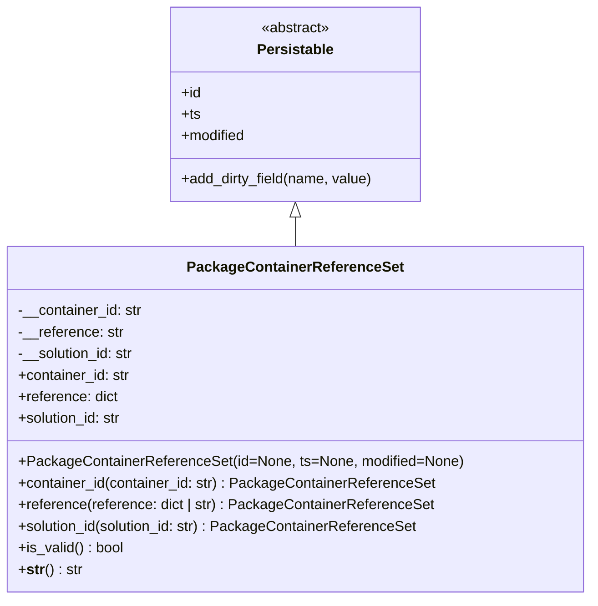

# Diagram: partview_core/partview_service/partview_service/core/datamodel/PackageContainerReferenceSet.py

> Auto-generated by Obscura crawlers

## Mermaid

### SVG

<svg id="container" width="642.9921875" xmlns="http://www.w3.org/2000/svg" class="classDiagram" height="666" viewBox="0 0 642.9921875 666" role="graphics-document document" aria-roledescription="class"><g><defs><marker id="container_class-aggregationStart" class="marker aggregation class" refX="18" refY="7" markerWidth="190" markerHeight="240" orient="auto"><path d="M 18,7 L9,13 L1,7 L9,1 Z"></path></marker></defs><defs><marker id="container_class-aggregationEnd" class="marker aggregation class" refX="1" refY="7" markerWidth="20" markerHeight="28" orient="auto"><path d="M 18,7 L9,13 L1,7 L9,1 Z"></path></marker></defs><defs><marker id="container_class-extensionStart" class="marker extension class" refX="18" refY="7" markerWidth="190" markerHeight="240" orient="auto"><path d="M 1,7 L18,13 V 1 Z"></path></marker></defs><defs><marker id="container_class-extensionEnd" class="marker extension class" refX="1" refY="7" markerWidth="20" markerHeight="28" orient="auto"><path d="M 1,1 V 13 L18,7 Z"></path></marker></defs><defs><marker id="container_class-compositionStart" class="marker composition class" refX="18" refY="7" markerWidth="190" markerHeight="240" orient="auto"><path d="M 18,7 L9,13 L1,7 L9,1 Z"></path></marker></defs><defs><marker id="container_class-compositionEnd" class="marker composition class" refX="1" refY="7" markerWidth="20" markerHeight="28" orient="auto"><path d="M 18,7 L9,13 L1,7 L9,1 Z"></path></marker></defs><defs><marker id="container_class-dependencyStart" class="marker dependency class" refX="6" refY="7" markerWidth="190" markerHeight="240" orient="auto"><path d="M 5,7 L9,13 L1,7 L9,1 Z"></path></marker></defs><defs><marker id="container_class-dependencyEnd" class="marker dependency class" refX="13" refY="7" markerWidth="20" markerHeight="28" orient="auto"><path d="M 18,7 L9,13 L14,7 L9,1 Z"></path></marker></defs><defs><marker id="container_class-lollipopStart" class="marker lollipop class" refX="13" refY="7" markerWidth="190" markerHeight="240" orient="auto"><circle stroke="black" fill="transparent" cx="7" cy="7" r="6"></circle></marker></defs><defs><marker id="container_class-lollipopEnd" class="marker lollipop class" refX="1" refY="7" markerWidth="190" markerHeight="240" orient="auto"><circle stroke="black" fill="transparent" cx="7" cy="7" r="6"></circle></marker></defs><g class="root"><g class="clusters"></g><g class="edgePaths"><path d="M321.496,241.25L321.496,242.542C321.496,243.833,321.496,246.417,321.496,251.875C321.496,257.333,321.496,265.667,321.496,269.833L321.496,274" id="id_Persistable_PackageContainerReferenceSet_1" class="edge-thickness-normal edge-pattern-solid relation" style=";;;" data-edge="true" data-et="edge" data-id="id_Persistable_PackageContainerReferenceSet_1" data-points="W3sieCI6MzIxLjQ5NjA5Mzc1LCJ5IjoyMjR9LHsieCI6MzIxLjQ5NjA5Mzc1LCJ5IjoyNDl9LHsieCI6MzIxLjQ5NjA5Mzc1LCJ5IjoyNzR9XQ==" marker-start="url(#container_class-extensionStart)"></path></g><g class="edgeLabels"><g class="edgeLabel"><g class="label" data-id="id_Persistable_PackageContainerReferenceSet_1" transform="translate(0, 0)"><foreignObject width="0" height="0">

</foreignObject></g></g></g><g class="nodes"><g class="node default" id="classId-Persistable-0" transform="translate(321.49609375, 116)"><g class="basic label-container"><path d="M-139.84765625 -108 L139.84765625 -108 L139.84765625 108 L-139.84765625 108" stroke="none" stroke-width="0" fill="#ECECFF" style=""></path><path d="M-139.84765625 -108 C-65.89269559619268 -108, 8.062265057614638 -108, 139.84765625 -108 M-139.84765625 -108 C-60.04106185584594 -108, 19.765532538308122 -108, 139.84765625 -108 M139.84765625 -108 C139.84765625 -35.73789035404769, 139.84765625 36.524219291904615, 139.84765625 108 M139.84765625 -108 C139.84765625 -62.69579264984279, 139.84765625 -17.391585299685573, 139.84765625 108 M139.84765625 108 C28.55241619972746 108, -82.74282385054508 108, -139.84765625 108 M139.84765625 108 C66.103835346642 108, -7.639985556715999 108, -139.84765625 108 M-139.84765625 108 C-139.84765625 56.89014214421388, -139.84765625 5.780284288427765, -139.84765625 -108 M-139.84765625 108 C-139.84765625 61.962834794117434, -139.84765625 15.925669588234868, -139.84765625 -108" stroke="#9370DB" stroke-width="1.3" fill="none" stroke-dasharray="0 0" style=""></path></g><g class="annotation-group text" transform="translate(-38.609375, -84)"><g class="label" style="" transform="translate(0,-12)"><foreignObject width="77.21875" height="24">

«abstract»

</foreignObject></g></g><g class="label-group text" transform="translate(-40.9765625, -60)"><g class="label" style="font-weight: bolder" transform="translate(0,-12)"><foreignObject width="81.953125" height="24">

Persistable

</foreignObject></g></g><g class="members-group text" transform="translate(-127.84765625, -12)"><g class="label" style="" transform="translate(0,-12)"><foreignObject width="22.078125" height="24">

+id

</foreignObject></g><g class="label" style="" transform="translate(0,12)"><foreignObject width="21.15625" height="24">

+ts

</foreignObject></g><g class="label" style="" transform="translate(0,36)"><foreignObject width="72.609375" height="24">

+modified

</foreignObject></g></g><g class="methods-group text" transform="translate(-127.84765625, 84)"><g class="label" style="" transform="translate(0,-12)"><foreignObject width="214.71875" height="24">

+add_dirty_field(name, value)

</foreignObject></g></g><g class="divider" style=""><path d="M-139.84765625 -36 C-61.567768277880276 -36, 16.712119694239448 -36, 139.84765625 -36 M-139.84765625 -36 C-52.48625025965262 -36, 34.87515573069476 -36, 139.84765625 -36" stroke="#9370DB" stroke-width="1.3" fill="none" stroke-dasharray="0 0" style=""></path></g><g class="divider" style=""><path d="M-139.84765625 60 C-40.42906558039887 60, 58.98952508920226 60, 139.84765625 60 M-139.84765625 60 C-61.67251223545594 60, 16.50263177908812 60, 139.84765625 60" stroke="#9370DB" stroke-width="1.3" fill="none" stroke-dasharray="0 0" style=""></path></g></g><g class="node default" id="classId-PackageContainerReferenceSet-1" transform="translate(321.49609375, 466)"><g class="basic label-container"><path d="M-313.49609375 -192 L313.49609375 -192 L313.49609375 192 L-313.49609375 192" stroke="none" stroke-width="0" fill="#ECECFF" style=""></path><path d="M-313.49609375 -192 C-79.97570241289486 -192, 153.54468892421028 -192, 313.49609375 -192 M-313.49609375 -192 C-66.17741433691154 -192, 181.14126507617692 -192, 313.49609375 -192 M313.49609375 -192 C313.49609375 -44.51646027379749, 313.49609375 102.96707945240502, 313.49609375 192 M313.49609375 -192 C313.49609375 -72.69811068562166, 313.49609375 46.603778628756686, 313.49609375 192 M313.49609375 192 C102.19953141179036 192, -109.09703092641928 192, -313.49609375 192 M313.49609375 192 C79.91382211648903 192, -153.66844951702194 192, -313.49609375 192 M-313.49609375 192 C-313.49609375 89.81273018942792, -313.49609375 -12.374539621144152, -313.49609375 -192 M-313.49609375 192 C-313.49609375 112.95373059694504, -313.49609375 33.90746119389007, -313.49609375 -192" stroke="#9370DB" stroke-width="1.3" fill="none" stroke-dasharray="0 0" style=""></path></g><g class="annotation-group text" transform="translate(0, -168)"></g><g class="label-group text" transform="translate(-114.0390625, -168)"><g class="label" style="font-weight: bolder" transform="translate(0,-12)"><foreignObject width="228.078125" height="24">

PackageContainerReferenceSet

</foreignObject></g></g><g class="members-group text" transform="translate(-301.49609375, -120)"><g class="label" style="" transform="translate(0,-12)"><foreignObject width="139.15625" height="24">

-__container_id: str

</foreignObject></g><g class="label" style="" transform="translate(0,12)"><foreignObject width="117.34375" height="24">

-__reference: str

</foreignObject></g><g class="label" style="" transform="translate(0,36)"><foreignObject width="131.390625" height="24">

-__solution_id: str

</foreignObject></g><g class="label" style="" transform="translate(0,60)"><foreignObject width="125.8125" height="24">

+container_id: str

</foreignObject></g><g class="label" style="" transform="translate(0,84)"><foreignObject width="111.75" height="24">

+reference: dict

</foreignObject></g><g class="label" style="" transform="translate(0,108)"><foreignObject width="117.71875" height="24">

+solution_id: str

</foreignObject></g></g><g class="methods-group text" transform="translate(-301.49609375, 48)"><g class="label" style="" transform="translate(0,-12)"><foreignObject width="488.953125" height="24">

+PackageContainerReferenceSet(id=None, ts=None, modified=None)

</foreignObject></g><g class="label" style="" transform="translate(0,12)"><foreignObject width="462.515625" height="24">

+container_id(container_id: str) : PackageContainerReferenceSet

</foreignObject></g><g class="label" style="" transform="translate(0,36)"><foreignObject width="460.671875" height="24">

+reference(reference: dict | str) : PackageContainerReferenceSet

</foreignObject></g><g class="label" style="" transform="translate(0,60)"><foreignObject width="446.328125" height="24">

+solution_id(solution_id: str) : PackageContainerReferenceSet

</foreignObject></g><g class="label" style="" transform="translate(0,84)"><foreignObject width="117.984375" height="24">

+is_valid() : bool

</foreignObject></g><g class="label" style="" transform="translate(0,108)"><foreignObject width="70.4375" height="24">

+<strong>str</strong>() : str

</foreignObject></g></g><g class="divider" style=""><path d="M-313.49609375 -144 C-138.66314872481408 -144, 36.16979630037184 -144, 313.49609375 -144 M-313.49609375 -144 C-121.01057195364746 -144, 71.47494984270509 -144, 313.49609375 -144" stroke="#9370DB" stroke-width="1.3" fill="none" stroke-dasharray="0 0" style=""></path></g><g class="divider" style=""><path d="M-313.49609375 24 C-143.34854902140322 24, 26.79899570719357 24, 313.49609375 24 M-313.49609375 24 C-92.52708432403955 24, 128.4419251019209 24, 313.49609375 24" stroke="#9370DB" stroke-width="1.3" fill="none" stroke-dasharray="0 0" style=""></path></g></g></g></g></g></svg>
