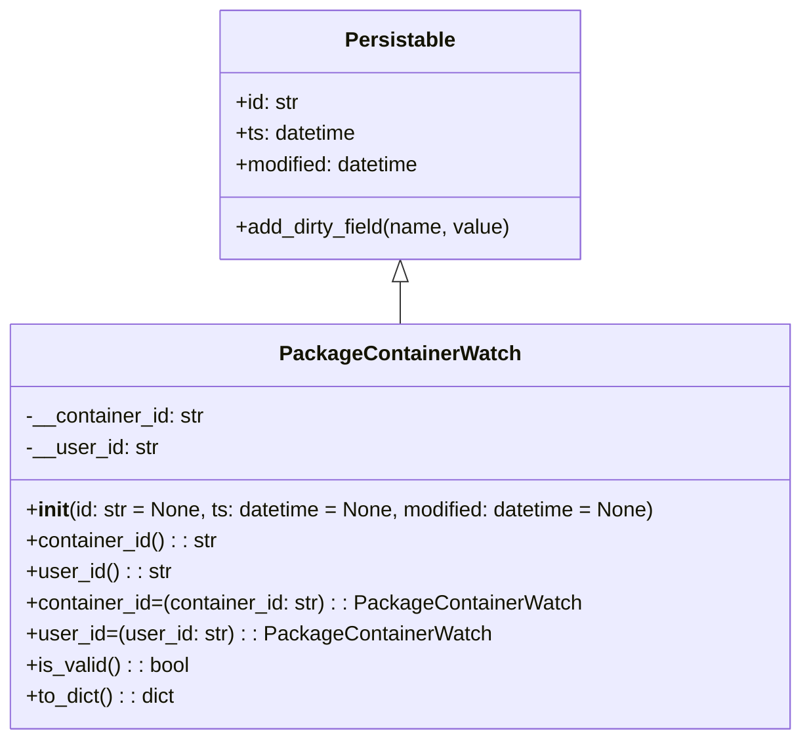

# Diagram: partview_core/partview_service/partview_service/core/datamodel/PackageContainerWatch.py

> Auto-generated by Obscura crawlers

## Mermaid

### SVG

<svg id="container" width="617.0625" xmlns="http://www.w3.org/2000/svg" class="classDiagram" height="570" viewBox="0 0 617.0625 570" role="graphics-document document" aria-roledescription="class"><g><defs><marker id="container_class-aggregationStart" class="marker aggregation class" refX="18" refY="7" markerWidth="190" markerHeight="240" orient="auto"><path d="M 18,7 L9,13 L1,7 L9,1 Z"></path></marker></defs><defs><marker id="container_class-aggregationEnd" class="marker aggregation class" refX="1" refY="7" markerWidth="20" markerHeight="28" orient="auto"><path d="M 18,7 L9,13 L1,7 L9,1 Z"></path></marker></defs><defs><marker id="container_class-extensionStart" class="marker extension class" refX="18" refY="7" markerWidth="190" markerHeight="240" orient="auto"><path d="M 1,7 L18,13 V 1 Z"></path></marker></defs><defs><marker id="container_class-extensionEnd" class="marker extension class" refX="1" refY="7" markerWidth="20" markerHeight="28" orient="auto"><path d="M 1,1 V 13 L18,7 Z"></path></marker></defs><defs><marker id="container_class-compositionStart" class="marker composition class" refX="18" refY="7" markerWidth="190" markerHeight="240" orient="auto"><path d="M 18,7 L9,13 L1,7 L9,1 Z"></path></marker></defs><defs><marker id="container_class-compositionEnd" class="marker composition class" refX="1" refY="7" markerWidth="20" markerHeight="28" orient="auto"><path d="M 18,7 L9,13 L1,7 L9,1 Z"></path></marker></defs><defs><marker id="container_class-dependencyStart" class="marker dependency class" refX="6" refY="7" markerWidth="190" markerHeight="240" orient="auto"><path d="M 5,7 L9,13 L1,7 L9,1 Z"></path></marker></defs><defs><marker id="container_class-dependencyEnd" class="marker dependency class" refX="13" refY="7" markerWidth="20" markerHeight="28" orient="auto"><path d="M 18,7 L9,13 L14,7 L9,1 Z"></path></marker></defs><defs><marker id="container_class-lollipopStart" class="marker lollipop class" refX="13" refY="7" markerWidth="190" markerHeight="240" orient="auto"><circle stroke="black" fill="transparent" cx="7" cy="7" r="6"></circle></marker></defs><defs><marker id="container_class-lollipopEnd" class="marker lollipop class" refX="1" refY="7" markerWidth="190" markerHeight="240" orient="auto"><circle stroke="black" fill="transparent" cx="7" cy="7" r="6"></circle></marker></defs><g class="root"><g class="clusters"></g><g class="edgePaths"><path d="M308.531,217.25L308.531,218.542C308.531,219.833,308.531,222.417,308.531,227.875C308.531,233.333,308.531,241.667,308.531,245.833L308.531,250" id="id_Persistable_PackageContainerWatch_1" class="edge-thickness-normal edge-pattern-solid relation" style=";;;" data-edge="true" data-et="edge" data-id="id_Persistable_PackageContainerWatch_1" data-points="W3sieCI6MzA4LjUzMTI1LCJ5IjoyMDB9LHsieCI6MzA4LjUzMTI1LCJ5IjoyMjV9LHsieCI6MzA4LjUzMTI1LCJ5IjoyNTB9XQ==" marker-start="url(#container_class-extensionStart)"></path></g><g class="edgeLabels"><g class="edgeLabel"><g class="label" data-id="id_Persistable_PackageContainerWatch_1" transform="translate(0, 0)"><foreignObject width="0" height="0">

</foreignObject></g></g></g><g class="nodes"><g class="node default" id="classId-Persistable-0" transform="translate(308.53125, 104)"><g class="basic label-container"><path d="M-139.84765625 -96 L139.84765625 -96 L139.84765625 96 L-139.84765625 96" stroke="none" stroke-width="0" fill="#ECECFF" style=""></path><path d="M-139.84765625 -96 C-71.38871589695263 -96, -2.929775543905265 -96, 139.84765625 -96 M-139.84765625 -96 C-66.10491743655506 -96, 7.637821376889889 -96, 139.84765625 -96 M139.84765625 -96 C139.84765625 -56.90308058238872, 139.84765625 -17.806161164777436, 139.84765625 96 M139.84765625 -96 C139.84765625 -49.36414344996412, 139.84765625 -2.7282868999282357, 139.84765625 96 M139.84765625 96 C71.18175029068017 96, 2.5158443313603414 96, -139.84765625 96 M139.84765625 96 C52.01900826139952 96, -35.80963972720096 96, -139.84765625 96 M-139.84765625 96 C-139.84765625 47.37293165952804, -139.84765625 -1.2541366809439154, -139.84765625 -96 M-139.84765625 96 C-139.84765625 36.893340894805505, -139.84765625 -22.21331821038899, -139.84765625 -96" stroke="#9370DB" stroke-width="1.3" fill="none" stroke-dasharray="0 0" style=""></path></g><g class="annotation-group text" transform="translate(0, -72)"></g><g class="label-group text" transform="translate(-40.9765625, -72)"><g class="label" style="font-weight: bolder" transform="translate(0,-12)"><foreignObject width="81.953125" height="24">

Persistable

</foreignObject></g></g><g class="members-group text" transform="translate(-127.84765625, -24)"><g class="label" style="" transform="translate(0,-12)"><foreignObject width="49.578125" height="24">

+id: str

</foreignObject></g><g class="label" style="" transform="translate(0,12)"><foreignObject width="94.484375" height="24">

+ts: datetime

</foreignObject></g><g class="label" style="" transform="translate(0,36)"><foreignObject width="145.9375" height="24">

+modified: datetime

</foreignObject></g></g><g class="methods-group text" transform="translate(-127.84765625, 72)"><g class="label" style="" transform="translate(0,-12)"><foreignObject width="214.71875" height="24">

+add_dirty_field(name, value)

</foreignObject></g></g><g class="divider" style=""><path d="M-139.84765625 -48 C-37.38797574145322 -48, 65.07170476709356 -48, 139.84765625 -48 M-139.84765625 -48 C-47.286311225677366 -48, 45.27503379864527 -48, 139.84765625 -48" stroke="#9370DB" stroke-width="1.3" fill="none" stroke-dasharray="0 0" style=""></path></g><g class="divider" style=""><path d="M-139.84765625 48 C-30.298536005456043 48, 79.25058423908791 48, 139.84765625 48 M-139.84765625 48 C-67.86065804070714 48, 4.1263401685857275 48, 139.84765625 48" stroke="#9370DB" stroke-width="1.3" fill="none" stroke-dasharray="0 0" style=""></path></g></g><g class="node default" id="classId-PackageContainerWatch-1" transform="translate(308.53125, 406)"><g class="basic label-container"><path d="M-300.53125 -156 L300.53125 -156 L300.53125 156 L-300.53125 156" stroke="none" stroke-width="0" fill="#ECECFF" style=""></path><path d="M-300.53125 -156 C-132.72340386946752 -156, 35.084442261064964 -156, 300.53125 -156 M-300.53125 -156 C-86.87544195651861 -156, 126.78036608696277 -156, 300.53125 -156 M300.53125 -156 C300.53125 -32.66811889874535, 300.53125 90.6637622025093, 300.53125 156 M300.53125 -156 C300.53125 -45.40666328854164, 300.53125 65.18667342291673, 300.53125 156 M300.53125 156 C135.75818020017587 156, -29.014889599648257 156, -300.53125 156 M300.53125 156 C92.07068115157381 156, -116.38988769685238 156, -300.53125 156 M-300.53125 156 C-300.53125 50.36798239918208, -300.53125 -55.264035201635835, -300.53125 -156 M-300.53125 156 C-300.53125 41.165109324877406, -300.53125 -73.66978135024519, -300.53125 -156" stroke="#9370DB" stroke-width="1.3" fill="none" stroke-dasharray="0 0" style=""></path></g><g class="annotation-group text" transform="translate(0, -132)"></g><g class="label-group text" transform="translate(-87.765625, -132)"><g class="label" style="font-weight: bolder" transform="translate(0,-12)"><foreignObject width="175.53125" height="24">

PackageContainerWatch

</foreignObject></g></g><g class="members-group text" transform="translate(-288.53125, -84)"><g class="label" style="" transform="translate(0,-12)"><foreignObject width="139.15625" height="24">

-__container_id: str

</foreignObject></g><g class="label" style="" transform="translate(0,12)"><foreignObject width="101.640625" height="24">

-__user_id: str

</foreignObject></g></g><g class="methods-group text" transform="translate(-288.53125, -12)"><g class="label" style="" transform="translate(0,-12)"><foreignObject width="489.296875" height="24">

+<strong>init</strong>(id: str = None, ts: datetime = None, modified: datetime = None)

</foreignObject></g><g class="label" style="" transform="translate(0,12)"><foreignObject width="148.5" height="24">

+container_id() : : str

</foreignObject></g><g class="label" style="" transform="translate(0,36)"><foreignObject width="110.984375" height="24">

+user_id() : : str

</foreignObject></g><g class="label" style="" transform="translate(0,60)"><foreignObject width="427.46875" height="24">

+container_id=(container_id: str) : : PackageContainerWatch

</foreignObject></g><g class="label" style="" transform="translate(0,84)"><foreignObject width="352.421875" height="24">

+user_id=(user_id: str) : : PackageContainerWatch

</foreignObject></g><g class="label" style="" transform="translate(0,108)"><foreignObject width="126.078125" height="24">

+is_valid() : : bool

</foreignObject></g><g class="label" style="" transform="translate(0,132)"><foreignObject width="116.25" height="24">

+to_dict() : : dict

</foreignObject></g></g><g class="divider" style=""><path d="M-300.53125 -108 C-151.1327534424068 -108, -1.7342568848135897 -108, 300.53125 -108 M-300.53125 -108 C-111.61311504523186 -108, 77.30501990953627 -108, 300.53125 -108" stroke="#9370DB" stroke-width="1.3" fill="none" stroke-dasharray="0 0" style=""></path></g><g class="divider" style=""><path d="M-300.53125 -36 C-61.20117033679688 -36, 178.12890932640624 -36, 300.53125 -36 M-300.53125 -36 C-94.59726445672328 -36, 111.33672108655344 -36, 300.53125 -36" stroke="#9370DB" stroke-width="1.3" fill="none" stroke-dasharray="0 0" style=""></path></g></g></g></g></g></svg>
