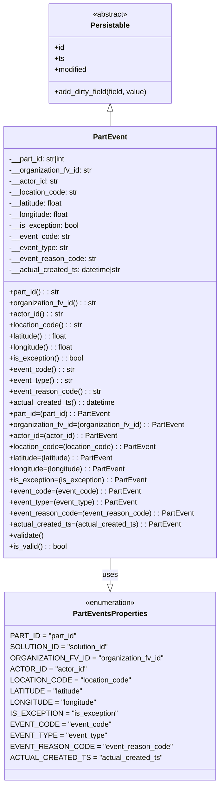

# Diagram: partview_core/partview_service/partview_service/core/datamodel/PartEvent.py

> Auto-generated by Obscura crawlers

## Mermaid

### SVG

<svg id="container" width="472.2421875" xmlns="http://www.w3.org/2000/svg" class="classDiagram" height="1700" viewBox="0 0 472.2421875 1700" role="graphics-document document" aria-roledescription="class"><g><defs><marker id="container_class-aggregationStart" class="marker aggregation class" refX="18" refY="7" markerWidth="190" markerHeight="240" orient="auto"><path d="M 18,7 L9,13 L1,7 L9,1 Z"></path></marker></defs><defs><marker id="container_class-aggregationEnd" class="marker aggregation class" refX="1" refY="7" markerWidth="20" markerHeight="28" orient="auto"><path d="M 18,7 L9,13 L1,7 L9,1 Z"></path></marker></defs><defs><marker id="container_class-extensionStart" class="marker extension class" refX="18" refY="7" markerWidth="190" markerHeight="240" orient="auto"><path d="M 1,7 L18,13 V 1 Z"></path></marker></defs><defs><marker id="container_class-extensionEnd" class="marker extension class" refX="1" refY="7" markerWidth="20" markerHeight="28" orient="auto"><path d="M 1,1 V 13 L18,7 Z"></path></marker></defs><defs><marker id="container_class-compositionStart" class="marker composition class" refX="18" refY="7" markerWidth="190" markerHeight="240" orient="auto"><path d="M 18,7 L9,13 L1,7 L9,1 Z"></path></marker></defs><defs><marker id="container_class-compositionEnd" class="marker composition class" refX="1" refY="7" markerWidth="20" markerHeight="28" orient="auto"><path d="M 18,7 L9,13 L1,7 L9,1 Z"></path></marker></defs><defs><marker id="container_class-dependencyStart" class="marker dependency class" refX="6" refY="7" markerWidth="190" markerHeight="240" orient="auto"><path d="M 5,7 L9,13 L1,7 L9,1 Z"></path></marker></defs><defs><marker id="container_class-dependencyEnd" class="marker dependency class" refX="13" refY="7" markerWidth="20" markerHeight="28" orient="auto"><path d="M 18,7 L9,13 L14,7 L9,1 Z"></path></marker></defs><defs><marker id="container_class-lollipopStart" class="marker lollipop class" refX="13" refY="7" markerWidth="190" markerHeight="240" orient="auto"><circle stroke="black" fill="transparent" cx="7" cy="7" r="6"></circle></marker></defs><defs><marker id="container_class-lollipopEnd" class="marker lollipop class" refX="1" refY="7" markerWidth="190" markerHeight="240" orient="auto"><circle stroke="black" fill="transparent" cx="7" cy="7" r="6"></circle></marker></defs><g class="root"><g class="clusters"></g><g class="edgePaths"><path d="M236.121,241.25L236.121,242.542C236.121,243.833,236.121,246.417,236.121,251.875C236.121,257.333,236.121,265.667,236.121,269.833L236.121,274" id="id_Persistable_PartEvent_1" class="edge-thickness-normal edge-pattern-solid relation" style=";;;" data-edge="true" data-et="edge" data-id="id_Persistable_PartEvent_1" data-points="W3sieCI6MjM2LjEyMTA5Mzc1LCJ5IjoyMjR9LHsieCI6MjM2LjEyMTA5Mzc1LCJ5IjoyNDl9LHsieCI6MjM2LjEyMTA5Mzc1LCJ5IjoyNzR9XQ==" marker-start="url(#container_class-extensionStart)"></path><path d="M236.121,1210L236.121,1216.167C236.121,1222.333,236.121,1234.667,236.121,1244.125C236.121,1253.583,236.121,1260.167,236.121,1263.458L236.121,1266.75" id="id_PartEvent_PartEventsProperties_2" class="edge-thickness-normal edge-pattern-solid relation" style=";;;" data-edge="true" data-et="edge" data-id="id_PartEvent_PartEventsProperties_2" data-points="W3sieCI6MjM2LjEyMTA5Mzc1LCJ5IjoxMjEwfSx7IngiOjIzNi4xMjEwOTM3NSwieSI6MTI0N30seyJ4IjoyMzYuMTIxMDkzNzUsInkiOjEyODR9XQ==" marker-end="url(#container_class-extensionEnd)"></path></g><g class="edgeLabels"><g class="edgeLabel"><g class="label" data-id="id_Persistable_PartEvent_1" transform="translate(0, 0)"><foreignObject width="0" height="0">

</foreignObject></g></g><g class="edgeLabel" transform="translate(236.12109375, 1247)"><g class="label" data-id="id_PartEvent_PartEventsProperties_2" transform="translate(-16.4921875, -12)"><foreignObject width="32.984375" height="24">

uses

</foreignObject></g></g></g><g class="nodes"><g class="node default" id="classId-Persistable-0" transform="translate(236.12109375, 116)"><g class="basic label-container"><path d="M-135.71484375 -108 L135.71484375 -108 L135.71484375 108 L-135.71484375 108" stroke="none" stroke-width="0" fill="#ECECFF" style=""></path><path d="M-135.71484375 -108 C-66.60985795638791 -108, 2.4951278372241745 -108, 135.71484375 -108 M-135.71484375 -108 C-44.02027926602064 -108, 47.674285217958726 -108, 135.71484375 -108 M135.71484375 -108 C135.71484375 -36.51997050800345, 135.71484375 34.96005898399309, 135.71484375 108 M135.71484375 -108 C135.71484375 -50.81918141806362, 135.71484375 6.361637163872757, 135.71484375 108 M135.71484375 108 C64.64828376361378 108, -6.418276222772448 108, -135.71484375 108 M135.71484375 108 C62.51973330253351 108, -10.67537714493298 108, -135.71484375 108 M-135.71484375 108 C-135.71484375 52.40588742678587, -135.71484375 -3.188225146428266, -135.71484375 -108 M-135.71484375 108 C-135.71484375 34.32743339466745, -135.71484375 -39.3451332106651, -135.71484375 -108" stroke="#9370DB" stroke-width="1.3" fill="none" stroke-dasharray="0 0" style=""></path></g><g class="annotation-group text" transform="translate(-38.609375, -84)"><g class="label" style="" transform="translate(0,-12)"><foreignObject width="77.21875" height="24">

«abstract»

</foreignObject></g></g><g class="label-group text" transform="translate(-40.9765625, -60)"><g class="label" style="font-weight: bolder" transform="translate(0,-12)"><foreignObject width="81.953125" height="24">

Persistable

</foreignObject></g></g><g class="members-group text" transform="translate(-123.71484375, -12)"><g class="label" style="" transform="translate(0,-12)"><foreignObject width="22.078125" height="24">

+id

</foreignObject></g><g class="label" style="" transform="translate(0,12)"><foreignObject width="21.15625" height="24">

+ts

</foreignObject></g><g class="label" style="" transform="translate(0,36)"><foreignObject width="72.609375" height="24">

+modified

</foreignObject></g></g><g class="methods-group text" transform="translate(-123.71484375, 84)"><g class="label" style="" transform="translate(0,-12)"><foreignObject width="206.453125" height="24">

+add_dirty_field(field, value)

</foreignObject></g></g><g class="divider" style=""><path d="M-135.71484375 -36 C-75.4886079732205 -36, -15.262372196440992 -36, 135.71484375 -36 M-135.71484375 -36 C-42.68489832960465 -36, 50.3450470907907 -36, 135.71484375 -36" stroke="#9370DB" stroke-width="1.3" fill="none" stroke-dasharray="0 0" style=""></path></g><g class="divider" style=""><path d="M-135.71484375 60 C-41.213238742519096 60, 53.28836626496181 60, 135.71484375 60 M-135.71484375 60 C-63.33280788449105 60, 9.049227981017907 60, 135.71484375 60" stroke="#9370DB" stroke-width="1.3" fill="none" stroke-dasharray="0 0" style=""></path></g></g><g class="node default" id="classId-PartEvent-1" transform="translate(236.12109375, 742)"><g class="basic label-container"><path d="M-228.12109375 -468 L228.12109375 -468 L228.12109375 468 L-228.12109375 468" stroke="none" stroke-width="0" fill="#ECECFF" style=""></path><path d="M-228.12109375 -468 C-68.10989852709628 -468, 91.90129669580745 -468, 228.12109375 -468 M-228.12109375 -468 C-63.56486687481282 -468, 100.99136000037436 -468, 228.12109375 -468 M228.12109375 -468 C228.12109375 -278.37326583794777, 228.12109375 -88.74653167589548, 228.12109375 468 M228.12109375 -468 C228.12109375 -145.67560048653877, 228.12109375 176.64879902692246, 228.12109375 468 M228.12109375 468 C91.5728664324727 468, -44.97536088505461 468, -228.12109375 468 M228.12109375 468 C100.72045814595883 468, -26.68017745808234 468, -228.12109375 468 M-228.12109375 468 C-228.12109375 174.92420787628095, -228.12109375 -118.15158424743811, -228.12109375 -468 M-228.12109375 468 C-228.12109375 204.61592068805936, -228.12109375 -58.76815862388128, -228.12109375 -468" stroke="#9370DB" stroke-width="1.3" fill="none" stroke-dasharray="0 0" style=""></path></g><g class="annotation-group text" transform="translate(0, -444)"></g><g class="label-group text" transform="translate(-35.2734375, -444)"><g class="label" style="font-weight: bolder" transform="translate(0,-12)"><foreignObject width="70.546875" height="24">

PartEvent

</foreignObject></g></g><g class="members-group text" transform="translate(-216.12109375, -396)"><g class="label" style="" transform="translate(0,-12)"><foreignObject width="127.671875" height="24">

-__part_id: str|int

</foreignObject></g><g class="label" style="" transform="translate(0,12)"><foreignObject width="182.34375" height="24">

-__organization_fv_id: str

</foreignObject></g><g class="label" style="" transform="translate(0,36)"><foreignObject width="107.375" height="24">

-__actor_id: str

</foreignObject></g><g class="label" style="" transform="translate(0,60)"><foreignObject width="151.109375" height="24">

-__location_code: str

</foreignObject></g><g class="label" style="" transform="translate(0,84)"><foreignObject width="119.609375" height="24">

-__latitude: float

</foreignObject></g><g class="label" style="" transform="translate(0,108)"><foreignObject width="132.171875" height="24">

-__longitude: float

</foreignObject></g><g class="label" style="" transform="translate(0,132)"><foreignObject width="153.03125" height="24">

-__is_exception: bool

</foreignObject></g><g class="label" style="" transform="translate(0,156)"><foreignObject width="132.140625" height="24">

-__event_code: str

</foreignObject></g><g class="label" style="" transform="translate(0,180)"><foreignObject width="128.96875" height="24">

-__event_type: str

</foreignObject></g><g class="label" style="" transform="translate(0,204)"><foreignObject width="189.453125" height="24">

-__event_reason_code: str

</foreignObject></g><g class="label" style="" transform="translate(0,228)"><foreignObject width="248.890625" height="24">

-__actual_created_ts: datetime|str

</foreignObject></g></g><g class="methods-group text" transform="translate(-216.12109375, -108)"><g class="label" style="" transform="translate(0,-12)"><foreignObject width="110.578125" height="24">

+part_id() : : str

</foreignObject></g><g class="label" style="" transform="translate(0,12)"><foreignObject width="191.6875" height="24">

+organization_fv_id() : : str

</foreignObject></g><g class="label" style="" transform="translate(0,36)"><foreignObject width="116.46875" height="24">

+actor_id() : : str

</foreignObject></g><g class="label" style="" transform="translate(0,60)"><foreignObject width="160.296875" height="24">

+location_code() : : str

</foreignObject></g><g class="label" style="" transform="translate(0,84)"><foreignObject width="128.796875" height="24">

+latitude() : : float

</foreignObject></g><g class="label" style="" transform="translate(0,108)"><foreignObject width="141.359375" height="24">

+longitude() : : float

</foreignObject></g><g class="label" style="" transform="translate(0,132)"><foreignObject width="162.0625" height="24">

+is_exception() : : bool

</foreignObject></g><g class="label" style="" transform="translate(0,156)"><foreignObject width="141.484375" height="24">

+event_code() : : str

</foreignObject></g><g class="label" style="" transform="translate(0,180)"><foreignObject width="138.3125" height="24">

+event_type() : : str

</foreignObject></g><g class="label" style="" transform="translate(0,204)"><foreignObject width="198.796875" height="24">

+event_reason_code() : : str

</foreignObject></g><g class="label" style="" transform="translate(0,228)"><foreignObject width="232.125" height="24">

+actual_created_ts() : : datetime

</foreignObject></g><g class="label" style="" transform="translate(0,252)"><foreignObject width="220.546875" height="24">

+part_id=(part_id) : : PartEvent

</foreignObject></g><g class="label" style="" transform="translate(0,276)"><foreignObject width="382.765625" height="24">

+organization_fv_id=(organization_fv_id) : : PartEvent

</foreignObject></g><g class="label" style="" transform="translate(0,300)"><foreignObject width="232.5625" height="24">

+actor_id=(actor_id) : : PartEvent

</foreignObject></g><g class="label" style="" transform="translate(0,324)"><foreignObject width="319.96875" height="24">

+location_code=(location_code) : : PartEvent

</foreignObject></g><g class="label" style="" transform="translate(0,348)"><foreignObject width="229.703125" height="24">

+latitude=(latitude) : : PartEvent

</foreignObject></g><g class="label" style="" transform="translate(0,372)"><foreignObject width="254.828125" height="24">

+longitude=(longitude) : : PartEvent

</foreignObject></g><g class="label" style="" transform="translate(0,396)"><foreignObject width="296.578125" height="24">

+is_exception=(is_exception) : : PartEvent

</foreignObject></g><g class="label" style="" transform="translate(0,420)"><foreignObject width="282.34375" height="24">

+event_code=(event_code) : : PartEvent

</foreignObject></g><g class="label" style="" transform="translate(0,444)"><foreignObject width="276.015625" height="24">

+event_type=(event_type) : : PartEvent

</foreignObject></g><g class="label" style="" transform="translate(0,468)"><foreignObject width="396.96875" height="24">

+event_reason_code=(event_reason_code) : : PartEvent

</foreignObject></g><g class="label" style="" transform="translate(0,492)"><foreignObject width="372.21875" height="24">

+actual_created_ts=(actual_created_ts) : : PartEvent

</foreignObject></g><g class="label" style="" transform="translate(0,516)"><foreignObject width="76.09375" height="24">

+validate()

</foreignObject></g><g class="label" style="" transform="translate(0,540)"><foreignObject width="126.078125" height="24">

+is_valid() : : bool

</foreignObject></g></g><g class="divider" style=""><path d="M-228.12109375 -420 C-92.83876587083324 -420, 42.443562008333515 -420, 228.12109375 -420 M-228.12109375 -420 C-123.3376962580376 -420, -18.554298766075192 -420, 228.12109375 -420" stroke="#9370DB" stroke-width="1.3" fill="none" stroke-dasharray="0 0" style=""></path></g><g class="divider" style=""><path d="M-228.12109375 -132 C-62.10967495111754 -132, 103.90174384776492 -132, 228.12109375 -132 M-228.12109375 -132 C-110.94549114138485 -132, 6.2301114672303015 -132, 228.12109375 -132" stroke="#9370DB" stroke-width="1.3" fill="none" stroke-dasharray="0 0" style=""></path></g></g><g class="node default" id="classId-PartEventsProperties-2" transform="translate(236.12109375, 1488)"><g class="basic label-container"><path d="M-214.05859375 -204 L214.05859375 -204 L214.05859375 204 L-214.05859375 204" stroke="none" stroke-width="0" fill="#ECECFF" style=""></path><path d="M-214.05859375 -204 C-64.05123960173637 -204, 85.95611454652726 -204, 214.05859375 -204 M-214.05859375 -204 C-90.2019574213517 -204, 33.65467890729661 -204, 214.05859375 -204 M214.05859375 -204 C214.05859375 -86.91290541879961, 214.05859375 30.17418916240078, 214.05859375 204 M214.05859375 -204 C214.05859375 -98.88120592853579, 214.05859375 6.237588142928416, 214.05859375 204 M214.05859375 204 C105.06536663821836 204, -3.927860473563271 204, -214.05859375 204 M214.05859375 204 C77.01687196703298 204, -60.02484981593403 204, -214.05859375 204 M-214.05859375 204 C-214.05859375 66.2594474184915, -214.05859375 -71.48110516301699, -214.05859375 -204 M-214.05859375 204 C-214.05859375 115.54834471659383, -214.05859375 27.096689433187663, -214.05859375 -204" stroke="#9370DB" stroke-width="1.3" fill="none" stroke-dasharray="0 0" style=""></path></g><g class="annotation-group text" transform="translate(-55.5546875, -180)"><g class="label" style="" transform="translate(0,-12)"><foreignObject width="111.109375" height="24">

«enumeration»

</foreignObject></g></g><g class="label-group text" transform="translate(-77.4453125, -156)"><g class="label" style="font-weight: bolder" transform="translate(0,-12)"><foreignObject width="154.890625" height="24">

PartEventsProperties

</foreignObject></g></g><g class="members-group text" transform="translate(-202.05859375, -108)"><g class="label" style="" transform="translate(0,-12)"><foreignObject width="139.34375" height="24">

PART_ID = "part_id"

</foreignObject></g><g class="label" style="" transform="translate(0,12)"><foreignObject width="207.609375" height="24">

SOLUTION_ID = "solution_id"

</foreignObject></g><g class="label" style="" transform="translate(0,36)"><foreignObject width="317.453125" height="24">

ORGANIZATION_FV_ID = "organization_fv_id"

</foreignObject></g><g class="label" style="" transform="translate(0,60)"><foreignObject width="157.15625" height="24">

ACTOR_ID = "actor_id"

</foreignObject></g><g class="label" style="" transform="translate(0,84)"><foreignObject width="248.109375" height="24">

LOCATION_CODE = "location_code"

</foreignObject></g><g class="label" style="" transform="translate(0,108)"><foreignObject width="153.125" height="24">

LATITUDE = "latitude"

</foreignObject></g><g class="label" style="" transform="translate(0,132)"><foreignObject width="180.421875" height="24">

LONGITUDE = "longitude"

</foreignObject></g><g class="label" style="" transform="translate(0,156)"><foreignObject width="219.171875" height="24">

IS_EXCEPTION = "is_exception"

</foreignObject></g><g class="label" style="" transform="translate(0,180)"><foreignObject width="202.90625" height="24">

EVENT_CODE = "event_code"

</foreignObject></g><g class="label" style="" transform="translate(0,204)"><foreignObject width="195.921875" height="24">

EVENT_TYPE = "event_type"

</foreignObject></g><g class="label" style="" transform="translate(0,228)"><foreignObject width="326.671875" height="24">

EVENT_REASON_CODE = "event_reason_code"

</foreignObject></g><g class="label" style="" transform="translate(0,252)"><foreignObject width="304.71875" height="24">

ACTUAL_CREATED_TS = "actual_created_ts"

</foreignObject></g></g><g class="methods-group text" transform="translate(-202.05859375, 204)"></g><g class="divider" style=""><path d="M-214.05859375 -132 C-43.311782810715044 -132, 127.43502812856991 -132, 214.05859375 -132 M-214.05859375 -132 C-61.59511372899172 -132, 90.86836629201656 -132, 214.05859375 -132" stroke="#9370DB" stroke-width="1.3" fill="none" stroke-dasharray="0 0" style=""></path></g><g class="divider" style=""><path d="M-214.05859375 180 C-112.61855374178539 180, -11.178513733570782 180, 214.05859375 180 M-214.05859375 180 C-84.14916604057726 180, 45.76026166884549 180, 214.05859375 180" stroke="#9370DB" stroke-width="1.3" fill="none" stroke-dasharray="0 0" style=""></path></g></g></g></g></g></svg>
