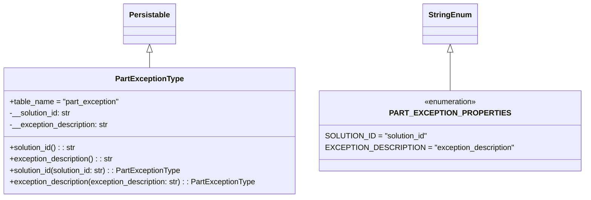

# Diagram: partview_core/partview_service/partview_service/core/datamodel/PartExceptionType.py

> Auto-generated by Obscura crawlers

## Mermaid

```mermaid
classDiagram
    class Persistable {
    }
    class StringEnum {
    }
    class PART_EXCEPTION_PROPERTIES <<enumeration>> {
        SOLUTION_ID = "solution_id"
        EXCEPTION_DESCRIPTION = "exception_description"
    }
    class PartExceptionType {
        +table_name = "part_exception"
        -__solution_id: str
        -__exception_description: str
        +solution_id(): str
        +exception_description(): str
        +solution_id(solution_id: str): PartExceptionType
        +exception_description(exception_description: str): PartExceptionType
    }
    StringEnum <|-- PART_EXCEPTION_PROPERTIES
    Persistable <|-- PartExceptionType
```

> SVG rendering failed for this diagram.
