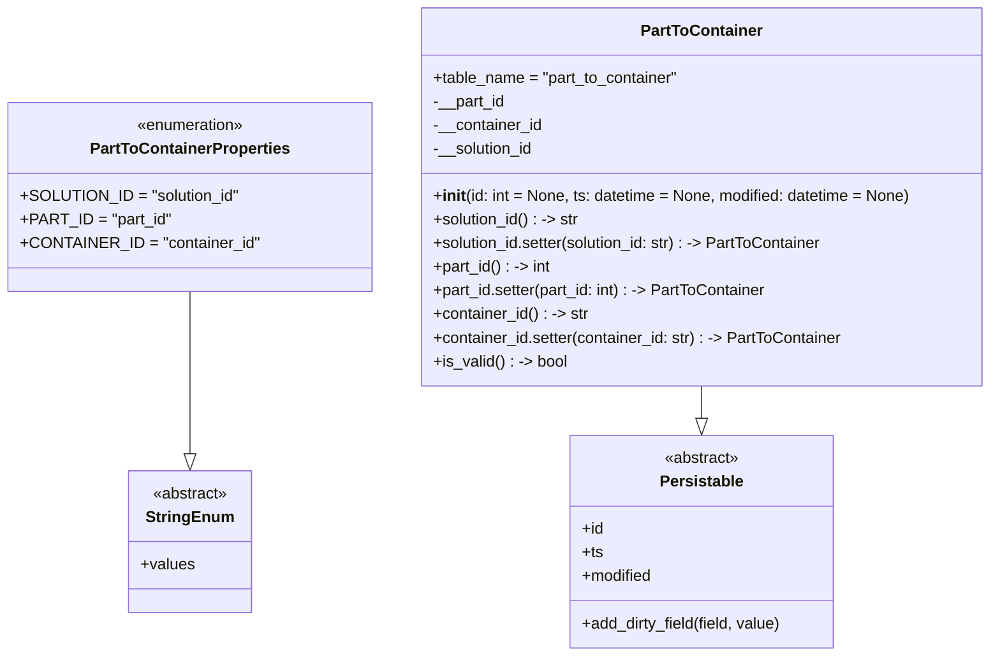

# Diagram: partview_core/partview_service/partview_service/core/datamodel/PartToContainer.py

> Auto-generated by Obscura crawlers

## Mermaid

### SVG

<svg id="container" width="992.1796875" xmlns="http://www.w3.org/2000/svg" class="classDiagram" height="666" viewBox="0 0 992.1796875 666" role="graphics-document document" aria-roledescription="class"><g><defs><marker id="container_class-aggregationStart" class="marker aggregation class" refX="18" refY="7" markerWidth="190" markerHeight="240" orient="auto"><path d="M 18,7 L9,13 L1,7 L9,1 Z"></path></marker></defs><defs><marker id="container_class-aggregationEnd" class="marker aggregation class" refX="1" refY="7" markerWidth="20" markerHeight="28" orient="auto"><path d="M 18,7 L9,13 L1,7 L9,1 Z"></path></marker></defs><defs><marker id="container_class-extensionStart" class="marker extension class" refX="18" refY="7" markerWidth="190" markerHeight="240" orient="auto"><path d="M 1,7 L18,13 V 1 Z"></path></marker></defs><defs><marker id="container_class-extensionEnd" class="marker extension class" refX="1" refY="7" markerWidth="20" markerHeight="28" orient="auto"><path d="M 1,1 V 13 L18,7 Z"></path></marker></defs><defs><marker id="container_class-compositionStart" class="marker composition class" refX="18" refY="7" markerWidth="190" markerHeight="240" orient="auto"><path d="M 18,7 L9,13 L1,7 L9,1 Z"></path></marker></defs><defs><marker id="container_class-compositionEnd" class="marker composition class" refX="1" refY="7" markerWidth="20" markerHeight="28" orient="auto"><path d="M 18,7 L9,13 L1,7 L9,1 Z"></path></marker></defs><defs><marker id="container_class-dependencyStart" class="marker dependency class" refX="6" refY="7" markerWidth="190" markerHeight="240" orient="auto"><path d="M 5,7 L9,13 L1,7 L9,1 Z"></path></marker></defs><defs><marker id="container_class-dependencyEnd" class="marker dependency class" refX="13" refY="7" markerWidth="20" markerHeight="28" orient="auto"><path d="M 18,7 L9,13 L14,7 L9,1 Z"></path></marker></defs><defs><marker id="container_class-lollipopStart" class="marker lollipop class" refX="13" refY="7" markerWidth="190" markerHeight="240" orient="auto"><circle stroke="black" fill="transparent" cx="7" cy="7" r="6"></circle></marker></defs><defs><marker id="container_class-lollipopEnd" class="marker lollipop class" refX="1" refY="7" markerWidth="190" markerHeight="240" orient="auto"><circle stroke="black" fill="transparent" cx="7" cy="7" r="6"></circle></marker></defs><g class="root"><g class="clusters"></g><g class="edgePaths"><path d="M697.805,392L697.805,396.167C697.805,400.333,697.805,408.667,697.805,414.125C697.805,419.583,697.805,422.167,697.805,423.458L697.805,424.75" id="id_PartToContainer_Persistable_1" class="edge-thickness-normal edge-pattern-solid relation" style=";;;" data-edge="true" data-et="edge" data-id="id_PartToContainer_Persistable_1" data-points="W3sieCI6Njk3LjgwNDY4NzUsInkiOjM5Mn0seyJ4Ijo2OTcuODA0Njg3NSwieSI6NDE3fSx7IngiOjY5Ny44MDQ2ODc1LCJ5Ijo0NDJ9XQ==" marker-end="url(#container_class-extensionEnd)"></path><path d="M184.715,296L184.715,316.167C184.715,336.333,184.715,376.667,184.715,404.125C184.715,431.583,184.715,446.167,184.715,453.458L184.715,460.75" id="id_PartToContainerProperties_StringEnum_2" class="edge-thickness-normal edge-pattern-solid relation" style=";;;" data-edge="true" data-et="edge" data-id="id_PartToContainerProperties_StringEnum_2" data-points="W3sieCI6MTg0LjcxNDg0Mzc1LCJ5IjoyOTZ9LHsieCI6MTg0LjcxNDg0Mzc1LCJ5Ijo0MTd9LHsieCI6MTg0LjcxNDg0Mzc1LCJ5Ijo0Nzh9XQ==" marker-end="url(#container_class-extensionEnd)"></path></g><g class="edgeLabels"><g class="edgeLabel"><g class="label" data-id="id_PartToContainer_Persistable_1" transform="translate(0, 0)"><foreignObject width="0" height="0">

</foreignObject></g></g><g class="edgeLabel"><g class="label" data-id="id_PartToContainerProperties_StringEnum_2" transform="translate(0, 0)"><foreignObject width="0" height="0">

</foreignObject></g></g></g><g class="nodes"><g class="node default" id="classId-Persistable-0" transform="translate(697.8046875, 550)"><g class="basic label-container"><path d="M-135.71484375 -108 L135.71484375 -108 L135.71484375 108 L-135.71484375 108" stroke="none" stroke-width="0" fill="#ECECFF" style=""></path><path d="M-135.71484375 -108 C-59.72301499019035 -108, 16.2688137696193 -108, 135.71484375 -108 M-135.71484375 -108 C-69.90118663359867 -108, -4.087529517197339 -108, 135.71484375 -108 M135.71484375 -108 C135.71484375 -63.24358667653975, 135.71484375 -18.4871733530795, 135.71484375 108 M135.71484375 -108 C135.71484375 -49.60152155160695, 135.71484375 8.7969568967861, 135.71484375 108 M135.71484375 108 C45.62804008718598 108, -44.45876357562804 108, -135.71484375 108 M135.71484375 108 C58.623680326456494 108, -18.467483097087012 108, -135.71484375 108 M-135.71484375 108 C-135.71484375 46.295176575650224, -135.71484375 -15.409646848699552, -135.71484375 -108 M-135.71484375 108 C-135.71484375 58.19596155746701, -135.71484375 8.391923114934016, -135.71484375 -108" stroke="#9370DB" stroke-width="1.3" fill="none" stroke-dasharray="0 0" style=""></path></g><g class="annotation-group text" transform="translate(-38.609375, -84)"><g class="label" style="" transform="translate(0,-12)"><foreignObject width="77.21875" height="24">

«abstract»

</foreignObject></g></g><g class="label-group text" transform="translate(-40.9765625, -60)"><g class="label" style="font-weight: bolder" transform="translate(0,-12)"><foreignObject width="81.953125" height="24">

Persistable

</foreignObject></g></g><g class="members-group text" transform="translate(-123.71484375, -12)"><g class="label" style="" transform="translate(0,-12)"><foreignObject width="22.078125" height="24">

+id

</foreignObject></g><g class="label" style="" transform="translate(0,12)"><foreignObject width="21.15625" height="24">

+ts

</foreignObject></g><g class="label" style="" transform="translate(0,36)"><foreignObject width="72.609375" height="24">

+modified

</foreignObject></g></g><g class="methods-group text" transform="translate(-123.71484375, 84)"><g class="label" style="" transform="translate(0,-12)"><foreignObject width="206.453125" height="24">

+add_dirty_field(field, value)

</foreignObject></g></g><g class="divider" style=""><path d="M-135.71484375 -36 C-75.24438236877094 -36, -14.773920987541885 -36, 135.71484375 -36 M-135.71484375 -36 C-57.602388945370535 -36, 20.51006585925893 -36, 135.71484375 -36" stroke="#9370DB" stroke-width="1.3" fill="none" stroke-dasharray="0 0" style=""></path></g><g class="divider" style=""><path d="M-135.71484375 60 C-27.95693714605656 60, 79.80096945788688 60, 135.71484375 60 M-135.71484375 60 C-63.470862501795395 60, 8.77311874640921 60, 135.71484375 60" stroke="#9370DB" stroke-width="1.3" fill="none" stroke-dasharray="0 0" style=""></path></g></g><g class="node default" id="classId-StringEnum-1" transform="translate(184.71484375, 550)"><g class="basic label-container"><path d="M-60.2109375 -72 L60.2109375 -72 L60.2109375 72 L-60.2109375 72" stroke="none" stroke-width="0" fill="#ECECFF" style=""></path><path d="M-60.2109375 -72 C-17.503953148521298 -72, 25.203031202957405 -72, 60.2109375 -72 M-60.2109375 -72 C-17.368464249400127 -72, 25.474009001199747 -72, 60.2109375 -72 M60.2109375 -72 C60.2109375 -29.208841534777847, 60.2109375 13.582316930444307, 60.2109375 72 M60.2109375 -72 C60.2109375 -17.40668181989848, 60.2109375 37.18663636020304, 60.2109375 72 M60.2109375 72 C17.670551166246774 72, -24.86983516750645 72, -60.2109375 72 M60.2109375 72 C32.752642132490216 72, 5.294346764980432 72, -60.2109375 72 M-60.2109375 72 C-60.2109375 23.869761964348662, -60.2109375 -24.260476071302676, -60.2109375 -72 M-60.2109375 72 C-60.2109375 22.051221718112032, -60.2109375 -27.897556563775936, -60.2109375 -72" stroke="#9370DB" stroke-width="1.3" fill="none" stroke-dasharray="0 0" style=""></path></g><g class="annotation-group text" transform="translate(-38.609375, -48)"><g class="label" style="" transform="translate(0,-12)"><foreignObject width="77.21875" height="24">

«abstract»

</foreignObject></g></g><g class="label-group text" transform="translate(-42.234375, -24)"><g class="label" style="font-weight: bolder" transform="translate(0,-12)"><foreignObject width="84.46875" height="24">

StringEnum

</foreignObject></g></g><g class="members-group text" transform="translate(-48.2109375, 24)"><g class="label" style="" transform="translate(0,-12)"><foreignObject width="54.1875" height="24">

+values

</foreignObject></g></g><g class="methods-group text" transform="translate(-48.2109375, 72)"></g><g class="divider" style=""><path d="M-60.2109375 0 C-28.404228339228947 0, 3.402480821542106 0, 60.2109375 0 M-60.2109375 0 C-25.050355081216168 0, 10.110227337567665 0, 60.2109375 0" stroke="#9370DB" stroke-width="1.3" fill="none" stroke-dasharray="0 0" style=""></path></g><g class="divider" style=""><path d="M-60.2109375 48 C-16.809001926546046 48, 26.59293364690791 48, 60.2109375 48 M-60.2109375 48 C-14.596877452991812 48, 31.017182594016376 48, 60.2109375 48" stroke="#9370DB" stroke-width="1.3" fill="none" stroke-dasharray="0 0" style=""></path></g></g><g class="node default" id="classId-PartToContainerProperties-2" transform="translate(184.71484375, 200)"><g class="basic label-container"><path d="M-176.71484375 -96 L176.71484375 -96 L176.71484375 96 L-176.71484375 96" stroke="none" stroke-width="0" fill="#ECECFF" style=""></path><path d="M-176.71484375 -96 C-36.24920502316175 -96, 104.2164337036765 -96, 176.71484375 -96 M-176.71484375 -96 C-40.050693112864735 -96, 96.61345752427053 -96, 176.71484375 -96 M176.71484375 -96 C176.71484375 -43.84044806413514, 176.71484375 8.319103871729723, 176.71484375 96 M176.71484375 -96 C176.71484375 -51.66038894725752, 176.71484375 -7.320777894515047, 176.71484375 96 M176.71484375 96 C45.066640293146406 96, -86.58156316370719 96, -176.71484375 96 M176.71484375 96 C64.24590176957975 96, -48.22304021084051 96, -176.71484375 96 M-176.71484375 96 C-176.71484375 38.962041114492095, -176.71484375 -18.07591777101581, -176.71484375 -96 M-176.71484375 96 C-176.71484375 55.337208694916924, -176.71484375 14.674417389833849, -176.71484375 -96" stroke="#9370DB" stroke-width="1.3" fill="none" stroke-dasharray="0 0" style=""></path></g><g class="annotation-group text" transform="translate(-55.5546875, -72)"><g class="label" style="" transform="translate(0,-12)"><foreignObject width="111.109375" height="24">

«enumeration»

</foreignObject></g></g><g class="label-group text" transform="translate(-97.5234375, -48)"><g class="label" style="font-weight: bolder" transform="translate(0,-12)"><foreignObject width="195.046875" height="24">

PartToContainerProperties

</foreignObject></g></g><g class="members-group text" transform="translate(-164.71484375, 0)"><g class="label" style="" transform="translate(0,-12)"><foreignObject width="214.953125" height="24">

+SOLUTION_ID = "solution_id"

</foreignObject></g><g class="label" style="" transform="translate(0,12)"><foreignObject width="147.3125" height="24">

+PART_ID = "part_id"

</foreignObject></g><g class="label" style="" transform="translate(0,36)"><foreignObject width="231.90625" height="24">

+CONTAINER_ID = "container_id"

</foreignObject></g></g><g class="methods-group text" transform="translate(-164.71484375, 96)"></g><g class="divider" style=""><path d="M-176.71484375 -24 C-94.9834727732457 -24, -13.252101796491388 -24, 176.71484375 -24 M-176.71484375 -24 C-105.56678132434207 -24, -34.41871889868415 -24, 176.71484375 -24" stroke="#9370DB" stroke-width="1.3" fill="none" stroke-dasharray="0 0" style=""></path></g><g class="divider" style=""><path d="M-176.71484375 72 C-75.86825998815323 72, 24.978323773693546 72, 176.71484375 72 M-176.71484375 72 C-46.802215360011814 72, 83.11041302997637 72, 176.71484375 72" stroke="#9370DB" stroke-width="1.3" fill="none" stroke-dasharray="0 0" style=""></path></g></g><g class="node default" id="classId-PartToContainer-3" transform="translate(697.8046875, 200)"><g class="basic label-container"><path d="M-286.375 -192 L286.375 -192 L286.375 192 L-286.375 192" stroke="none" stroke-width="0" fill="#ECECFF" style=""></path><path d="M-286.375 -192 C-148.2878652622257 -192, -10.200730524451387 -192, 286.375 -192 M-286.375 -192 C-113.51171729517418 -192, 59.35156540965164 -192, 286.375 -192 M286.375 -192 C286.375 -105.25608913305926, 286.375 -18.512178266118525, 286.375 192 M286.375 -192 C286.375 -55.10588944714405, 286.375 81.7882211057119, 286.375 192 M286.375 192 C139.00460970071347 192, -8.365780598573053 192, -286.375 192 M286.375 192 C98.18619108231513 192, -90.00261783536973 192, -286.375 192 M-286.375 192 C-286.375 41.41969575870752, -286.375 -109.16060848258496, -286.375 -192 M-286.375 192 C-286.375 59.98832267479503, -286.375 -72.02335465040994, -286.375 -192" stroke="#9370DB" stroke-width="1.3" fill="none" stroke-dasharray="0 0" style=""></path></g><g class="annotation-group text" transform="translate(0, -168)"></g><g class="label-group text" transform="translate(-59.21875, -168)"><g class="label" style="font-weight: bolder" transform="translate(0,-12)"><foreignObject width="118.4375" height="24">

PartToContainer

</foreignObject></g></g><g class="members-group text" transform="translate(-274.375, -120)"><g class="label" style="" transform="translate(0,-12)"><foreignObject width="252.703125" height="24">

+table_name = "part_to_container"

</foreignObject></g><g class="label" style="" transform="translate(0,12)"><foreignObject width="74.0625" height="24">

-__part_id

</foreignObject></g><g class="label" style="" transform="translate(0,36)"><foreignObject width="111.65625" height="24">

-__container_id

</foreignObject></g><g class="label" style="" transform="translate(0,60)"><foreignObject width="103.875" height="24">

-__solution_id

</foreignObject></g></g><g class="methods-group text" transform="translate(-274.375, 0)"><g class="label" style="" transform="translate(0,-12)"><foreignObject width="489.53125" height="24">

+<strong>init</strong>(id: int = None, ts: datetime = None, modified: datetime = None)

</foreignObject></g><g class="label" style="" transform="translate(0,12)"><foreignObject width="151.015625" height="24">

+solution_id() : -&gt; str

</foreignObject></g><g class="label" style="" transform="translate(0,36)"><foreignObject width="403.9375" height="24">

+solution_id.setter(solution_id: str) : -&gt; PartToContainer

</foreignObject></g><g class="label" style="" transform="translate(0,60)"><foreignObject width="121.4375" height="24">

+part_id() : -&gt; int

</foreignObject></g><g class="label" style="" transform="translate(0,84)"><foreignObject width="344.53125" height="24">

+part_id.setter(part_id: int) : -&gt; PartToContainer

</foreignObject></g><g class="label" style="" transform="translate(0,108)"><foreignObject width="159.109375" height="24">

+container_id() : -&gt; str

</foreignObject></g><g class="label" style="" transform="translate(0,132)"><foreignObject width="420.140625" height="24">

+container_id.setter(container_id: str) : -&gt; PartToContainer

</foreignObject></g><g class="label" style="" transform="translate(0,156)"><foreignObject width="136.6875" height="24">

+is_valid() : -&gt; bool

</foreignObject></g></g><g class="divider" style=""><path d="M-286.375 -144 C-96.56061774334856 -144, 93.25376451330288 -144, 286.375 -144 M-286.375 -144 C-151.7379865313532 -144, -17.100973062706373 -144, 286.375 -144" stroke="#9370DB" stroke-width="1.3" fill="none" stroke-dasharray="0 0" style=""></path></g><g class="divider" style=""><path d="M-286.375 -24 C-164.82667052147957 -24, -43.27834104295914 -24, 286.375 -24 M-286.375 -24 C-80.93459879781062 -24, 124.50580240437876 -24, 286.375 -24" stroke="#9370DB" stroke-width="1.3" fill="none" stroke-dasharray="0 0" style=""></path></g></g></g></g></g></svg>
