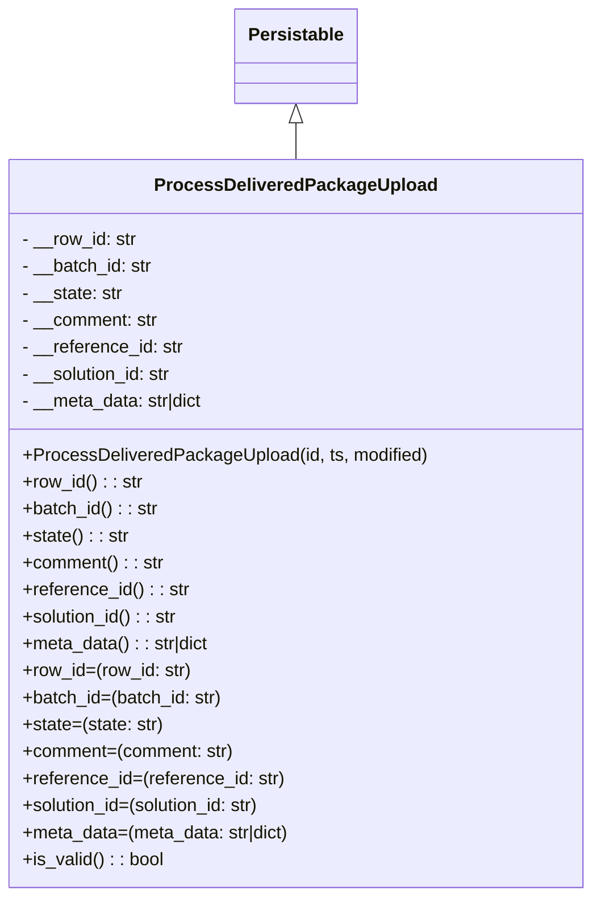

# Diagram: partview_core/partview_service/partview_service/core/datamodel/ProcessDeliveredPackageUpload.py

> Auto-generated by Obscura crawlers

## Mermaid

### SVG

<svg id="container" width="519.1484375" xmlns="http://www.w3.org/2000/svg" class="classDiagram" height="798" viewBox="0 0 519.1484375 798" role="graphics-document document" aria-roledescription="class"><g><defs><marker id="container_class-aggregationStart" class="marker aggregation class" refX="18" refY="7" markerWidth="190" markerHeight="240" orient="auto"><path d="M 18,7 L9,13 L1,7 L9,1 Z"></path></marker></defs><defs><marker id="container_class-aggregationEnd" class="marker aggregation class" refX="1" refY="7" markerWidth="20" markerHeight="28" orient="auto"><path d="M 18,7 L9,13 L1,7 L9,1 Z"></path></marker></defs><defs><marker id="container_class-extensionStart" class="marker extension class" refX="18" refY="7" markerWidth="190" markerHeight="240" orient="auto"><path d="M 1,7 L18,13 V 1 Z"></path></marker></defs><defs><marker id="container_class-extensionEnd" class="marker extension class" refX="1" refY="7" markerWidth="20" markerHeight="28" orient="auto"><path d="M 1,1 V 13 L18,7 Z"></path></marker></defs><defs><marker id="container_class-compositionStart" class="marker composition class" refX="18" refY="7" markerWidth="190" markerHeight="240" orient="auto"><path d="M 18,7 L9,13 L1,7 L9,1 Z"></path></marker></defs><defs><marker id="container_class-compositionEnd" class="marker composition class" refX="1" refY="7" markerWidth="20" markerHeight="28" orient="auto"><path d="M 18,7 L9,13 L1,7 L9,1 Z"></path></marker></defs><defs><marker id="container_class-dependencyStart" class="marker dependency class" refX="6" refY="7" markerWidth="190" markerHeight="240" orient="auto"><path d="M 5,7 L9,13 L1,7 L9,1 Z"></path></marker></defs><defs><marker id="container_class-dependencyEnd" class="marker dependency class" refX="13" refY="7" markerWidth="20" markerHeight="28" orient="auto"><path d="M 18,7 L9,13 L14,7 L9,1 Z"></path></marker></defs><defs><marker id="container_class-lollipopStart" class="marker lollipop class" refX="13" refY="7" markerWidth="190" markerHeight="240" orient="auto"><circle stroke="black" fill="transparent" cx="7" cy="7" r="6"></circle></marker></defs><defs><marker id="container_class-lollipopEnd" class="marker lollipop class" refX="1" refY="7" markerWidth="190" markerHeight="240" orient="auto"><circle stroke="black" fill="transparent" cx="7" cy="7" r="6"></circle></marker></defs><g class="root"><g class="clusters"></g><g class="edgePaths"><path d="M259.574,109.25L259.574,110.542C259.574,111.833,259.574,114.417,259.574,119.875C259.574,125.333,259.574,133.667,259.574,137.833L259.574,142" id="id_Persistable_ProcessDeliveredPackageUpload_1" class="edge-thickness-normal edge-pattern-solid relation" style=";;;" data-edge="true" data-et="edge" data-id="id_Persistable_ProcessDeliveredPackageUpload_1" data-points="W3sieCI6MjU5LjU3NDIxODc1LCJ5Ijo5Mn0seyJ4IjoyNTkuNTc0MjE4NzUsInkiOjExN30seyJ4IjoyNTkuNTc0MjE4NzUsInkiOjE0Mn1d" marker-start="url(#container_class-extensionStart)"></path></g><g class="edgeLabels"><g class="edgeLabel"><g class="label" data-id="id_Persistable_ProcessDeliveredPackageUpload_1" transform="translate(0, 0)"><foreignObject width="0" height="0">

</foreignObject></g></g></g><g class="nodes"><g class="node default" id="classId-Persistable-0" transform="translate(259.57421875, 50)"><g class="basic label-container"><path d="M-52.9765625 -42 L52.9765625 -42 L52.9765625 42 L-52.9765625 42" stroke="none" stroke-width="0" fill="#ECECFF" style=""></path><path d="M-52.9765625 -42 C-18.488984256264715 -42, 15.99859398747057 -42, 52.9765625 -42 M-52.9765625 -42 C-12.568132206601675 -42, 27.84029808679665 -42, 52.9765625 -42 M52.9765625 -42 C52.9765625 -8.897724264145594, 52.9765625 24.20455147170881, 52.9765625 42 M52.9765625 -42 C52.9765625 -23.34050694930477, 52.9765625 -4.681013898609542, 52.9765625 42 M52.9765625 42 C25.1224720602807 42, -2.7316183794386006 42, -52.9765625 42 M52.9765625 42 C14.111056500565688 42, -24.754449498868624 42, -52.9765625 42 M-52.9765625 42 C-52.9765625 11.231361581862089, -52.9765625 -19.537276836275822, -52.9765625 -42 M-52.9765625 42 C-52.9765625 10.739624497937662, -52.9765625 -20.520751004124676, -52.9765625 -42" stroke="#9370DB" stroke-width="1.3" fill="none" stroke-dasharray="0 0" style=""></path></g><g class="annotation-group text" transform="translate(0, -18)"></g><g class="label-group text" transform="translate(-40.9765625, -18)"><g class="label" style="font-weight: bolder" transform="translate(0,-12)"><foreignObject width="81.953125" height="24">

Persistable

</foreignObject></g></g><g class="members-group text" transform="translate(-40.9765625, 30)"></g><g class="methods-group text" transform="translate(-40.9765625, 60)"></g><g class="divider" style=""><path d="M-52.9765625 6 C-27.661046587311287 6, -2.345530674622573 6, 52.9765625 6 M-52.9765625 6 C-12.488423985247827 6, 27.999714529504345 6, 52.9765625 6" stroke="#9370DB" stroke-width="1.3" fill="none" stroke-dasharray="0 0" style=""></path></g><g class="divider" style=""><path d="M-52.9765625 24 C-23.780746965107028 24, 5.415068569785944 24, 52.9765625 24 M-52.9765625 24 C-13.35194730335845 24, 26.2726678932831 24, 52.9765625 24" stroke="#9370DB" stroke-width="1.3" fill="none" stroke-dasharray="0 0" style=""></path></g></g><g class="node default" id="classId-ProcessDeliveredPackageUpload-1" transform="translate(259.57421875, 466)"><g class="basic label-container"><path d="M-251.57421875 -324 L251.57421875 -324 L251.57421875 324 L-251.57421875 324" stroke="none" stroke-width="0" fill="#ECECFF" style=""></path><path d="M-251.57421875 -324 C-64.18921933272011 -324, 123.19578008455977 -324, 251.57421875 -324 M-251.57421875 -324 C-92.50501498586127 -324, 66.56418877827747 -324, 251.57421875 -324 M251.57421875 -324 C251.57421875 -99.16732711224537, 251.57421875 125.66534577550925, 251.57421875 324 M251.57421875 -324 C251.57421875 -157.19238563293686, 251.57421875 9.615228734126276, 251.57421875 324 M251.57421875 324 C50.73150629128756 324, -150.11120616742488 324, -251.57421875 324 M251.57421875 324 C87.06537577317118 324, -77.44346720365763 324, -251.57421875 324 M-251.57421875 324 C-251.57421875 178.82697135818333, -251.57421875 33.65394271636666, -251.57421875 -324 M-251.57421875 324 C-251.57421875 138.81840542001663, -251.57421875 -46.36318915996674, -251.57421875 -324" stroke="#9370DB" stroke-width="1.3" fill="none" stroke-dasharray="0 0" style=""></path></g><g class="annotation-group text" transform="translate(0, -300)"></g><g class="label-group text" transform="translate(-118.8828125, -300)"><g class="label" style="font-weight: bolder" transform="translate(0,-12)"><foreignObject width="237.765625" height="24">

ProcessDeliveredPackageUpload

</foreignObject></g></g><g class="members-group text" transform="translate(-239.57421875, -252)"><g class="label" style="" transform="translate(0,-12)"><foreignObject width="103.265625" height="24">

- __row_id: str

</foreignObject></g><g class="label" style="" transform="translate(0,12)"><foreignObject width="117.6875" height="24">

- __batch_id: str

</foreignObject></g><g class="label" style="" transform="translate(0,36)"><foreignObject width="90.78125" height="24">

- __state: str

</foreignObject></g><g class="label" style="" transform="translate(0,60)"><foreignObject width="122.390625" height="24">

- __comment: str

</foreignObject></g><g class="label" style="" transform="translate(0,84)"><foreignObject width="144.9375" height="24">

- __reference_id: str

</foreignObject></g><g class="label" style="" transform="translate(0,108)"><foreignObject width="136.90625" height="24">

- __solution_id: str

</foreignObject></g><g class="label" style="" transform="translate(0,132)"><foreignObject width="166.078125" height="24">

- __meta_data: str|dict

</foreignObject></g></g><g class="methods-group text" transform="translate(-239.57421875, -60)"><g class="label" style="" transform="translate(0,-12)"><foreignObject width="360.265625" height="24">

+ProcessDeliveredPackageUpload(id, ts, modified)

</foreignObject></g><g class="label" style="" transform="translate(0,12)"><foreignObject width="106.78125" height="24">

+row_id() : : str

</foreignObject></g><g class="label" style="" transform="translate(0,36)"><foreignObject width="121.1875" height="24">

+batch_id() : : str

</foreignObject></g><g class="label" style="" transform="translate(0,60)"><foreignObject width="94.28125" height="24">

+state() : : str

</foreignObject></g><g class="label" style="" transform="translate(0,84)"><foreignObject width="126.15625" height="24">

+comment() : : str

</foreignObject></g><g class="label" style="" transform="translate(0,108)"><foreignObject width="148.4375" height="24">

+reference_id() : : str

</foreignObject></g><g class="label" style="" transform="translate(0,132)"><foreignObject width="140.40625" height="24">

+solution_id() : : str

</foreignObject></g><g class="label" style="" transform="translate(0,156)"><foreignObject width="169.578125" height="24">

+meta_data() : : str|dict

</foreignObject></g><g class="label" style="" transform="translate(0,180)"><foreignObject width="151.046875" height="24">

+row_id=(row_id: str)

</foreignObject></g><g class="label" style="" transform="translate(0,204)"><foreignObject width="179.875" height="24">

+batch_id=(batch_id: str)

</foreignObject></g><g class="label" style="" transform="translate(0,228)"><foreignObject width="126.0625" height="24">

+state=(state: str)

</foreignObject></g><g class="label" style="" transform="translate(0,252)"><foreignObject width="189.859375" height="24">

+comment=(comment: str)

</foreignObject></g><g class="label" style="" transform="translate(0,276)"><foreignObject width="234.375" height="24">

+reference_id=(reference_id: str)

</foreignObject></g><g class="label" style="" transform="translate(0,300)"><foreignObject width="218.3125" height="24">

+solution_id=(solution_id: str)

</foreignObject></g><g class="label" style="" transform="translate(0,324)"><foreignObject width="242.703125" height="24">

+meta_data=(meta_data: str|dict)

</foreignObject></g><g class="label" style="" transform="translate(0,348)"><foreignObject width="126.078125" height="24">

+is_valid() : : bool

</foreignObject></g></g><g class="divider" style=""><path d="M-251.57421875 -276 C-99.91718829523208 -276, 51.73984215953584 -276, 251.57421875 -276 M-251.57421875 -276 C-94.59058709453387 -276, 62.39304456093225 -276, 251.57421875 -276" stroke="#9370DB" stroke-width="1.3" fill="none" stroke-dasharray="0 0" style=""></path></g><g class="divider" style=""><path d="M-251.57421875 -84 C-67.9645493746466 -84, 115.64512000070681 -84, 251.57421875 -84 M-251.57421875 -84 C-144.9363090796853 -84, -38.298399409370575 -84, 251.57421875 -84" stroke="#9370DB" stroke-width="1.3" fill="none" stroke-dasharray="0 0" style=""></path></g></g></g></g></g></svg>
