# Diagram: partview_core/partview_service/partview_service/core/datamodel/TripLeg.py

> Auto-generated by Obscura crawlers

## Mermaid

```mermaid
classDiagram
    class Persistable

    class TripLeg {
        <<class>>
        PLANNED_TRIP_LEG: "PLANNED"
        ACTUAL_TRIP_LEG: "ACTUAL"
        solution_id: str
        status: str
        owner_organization_fv_id: str
        carrier_organization_fv_id: str
        creator_shipment_id: str
        destination_location_code: str
        origin_location_code: str
        bill_of_lading: str
        trailer_equipment_number: str
        mode_of_transport: str
        scheduled_destination_delivery_window: DateTimeRange
        scheduled_origin_pickup_window: DateTimeRange
        origin_location_details: dict
        destination_location_details: dict
        llp_number: str
        consolidator_id: str
        shipment_number: str
        mode: str
        type: str
        delivery_type: str
        sequence_number: int
        carrier_scac: str
        actor_id: str
        load_code: str
        route_id: str
        parent_creator_shipment_id: str
        +__init__(id, ts, modified)
        +solution_id(): str
        +status(): str
        +actor_id(): str
        +owner_organization_fv_id(): str
        +carrier_organization_fv_id(): str
        +creator_shipment_id(): str
        +destination_location_code(): str
        +origin_location_code(): str
        +bill_of_lading(): str
        +trailer_equipment_number(): str
        +mode_of_transport(): str
        +scheduled_destination_delivery_window(): DateTimeRange
        +scheduled_origin_pickup_window(): DateTimeRange
        +origin_location_details(): dict
        +destination_location_details(): dict
        +llp_number(): str
        +consolidator_id(): str
        +shipment_number(): str
        +mode(): str
        +type(): str
        +delivery_type(): str
        +sequence_number(): int
        +carrier_scac(): str
        +load_code(): str
        +route_id(): str
        +parent_creator_shipment_id(): str
        +solution_id=(solution_id): TripLeg
        +status=(status): TripLeg
        +owner_organization_fv_id=(owner_organization_fv_id): TripLeg
        +carrier_organization_fv_id=(carrier_org_fv_id): TripLeg
        +creator_shipment_id=(creator_shipment_id): TripLeg
        +destination_location_code=(destination_location_code): TripLeg
        +origin_location_code=(origin_location_code): TripLeg
        +bill_of_lading=(bill_of_lading): TripLeg
        +trailer_equipment_number=(trailer_equipment_number): TripLeg
        +mode_of_transport=(mode_of_transport): TripLeg
        +scheduled_destination_delivery_window=(window): TripLeg
        +scheduled_origin_pickup_window=(window): TripLeg
        +origin_location_details=(details): TripLeg
        +destination_location_details=(details): TripLeg
        +llp_number=(llp_number): TripLeg
        +consolidator_id=(consolidator_id): TripLeg
        +shipment_number=(shipment_number): TripLeg
        +mode=(mode): TripLeg
        +type=(type): TripLeg
        +delivery_type=(delivery_type): TripLeg
        +sequence_number=(sequence_number): TripLeg
        +carrier_scac=(carrier_scac): TripLeg
        +actor_id=(actor_id): TripLeg
        +load_code=(load_code): TripLeg
        +route_id=(route_id): TripLeg
        +parent_creator_shipment_id=(parent_id): TripLeg
        +is_valid(): bool
    }

    Persistable <|-- TripLeg
```

### SVG

<svg id="container" width="556.6328125" xmlns="http://www.w3.org/2000/svg" class="classDiagram" height="2238" viewBox="0 0 556.6328125 2238" role="graphics-document document" aria-roledescription="class"><g><defs><marker id="container_class-aggregationStart" class="marker aggregation class" refX="18" refY="7" markerWidth="190" markerHeight="240" orient="auto"><path d="M 18,7 L9,13 L1,7 L9,1 Z"></path></marker></defs><defs><marker id="container_class-aggregationEnd" class="marker aggregation class" refX="1" refY="7" markerWidth="20" markerHeight="28" orient="auto"><path d="M 18,7 L9,13 L1,7 L9,1 Z"></path></marker></defs><defs><marker id="container_class-extensionStart" class="marker extension class" refX="18" refY="7" markerWidth="190" markerHeight="240" orient="auto"><path d="M 1,7 L18,13 V 1 Z"></path></marker></defs><defs><marker id="container_class-extensionEnd" class="marker extension class" refX="1" refY="7" markerWidth="20" markerHeight="28" orient="auto"><path d="M 1,1 V 13 L18,7 Z"></path></marker></defs><defs><marker id="container_class-compositionStart" class="marker composition class" refX="18" refY="7" markerWidth="190" markerHeight="240" orient="auto"><path d="M 18,7 L9,13 L1,7 L9,1 Z"></path></marker></defs><defs><marker id="container_class-compositionEnd" class="marker composition class" refX="1" refY="7" markerWidth="20" markerHeight="28" orient="auto"><path d="M 18,7 L9,13 L1,7 L9,1 Z"></path></marker></defs><defs><marker id="container_class-dependencyStart" class="marker dependency class" refX="6" refY="7" markerWidth="190" markerHeight="240" orient="auto"><path d="M 5,7 L9,13 L1,7 L9,1 Z"></path></marker></defs><defs><marker id="container_class-dependencyEnd" class="marker dependency class" refX="13" refY="7" markerWidth="20" markerHeight="28" orient="auto"><path d="M 18,7 L9,13 L14,7 L9,1 Z"></path></marker></defs><defs><marker id="container_class-lollipopStart" class="marker lollipop class" refX="13" refY="7" markerWidth="190" markerHeight="240" orient="auto"><circle stroke="black" fill="transparent" cx="7" cy="7" r="6"></circle></marker></defs><defs><marker id="container_class-lollipopEnd" class="marker lollipop class" refX="1" refY="7" markerWidth="190" markerHeight="240" orient="auto"><circle stroke="black" fill="transparent" cx="7" cy="7" r="6"></circle></marker></defs><g class="root"><g class="clusters"></g><g class="edgePaths"><path d="M278.316,109.25L278.316,110.542C278.316,111.833,278.316,114.417,278.316,119.875C278.316,125.333,278.316,133.667,278.316,137.833L278.316,142" id="id_Persistable_TripLeg_1" class="edge-thickness-normal edge-pattern-solid relation" style=";;;" data-edge="true" data-et="edge" data-id="id_Persistable_TripLeg_1" data-points="W3sieCI6Mjc4LjMxNjQwNjI1LCJ5Ijo5Mn0seyJ4IjoyNzguMzE2NDA2MjUsInkiOjExN30seyJ4IjoyNzguMzE2NDA2MjUsInkiOjE0Mn1d" marker-start="url(#container_class-extensionStart)"></path></g><g class="edgeLabels"><g class="edgeLabel"><g class="label" data-id="id_Persistable_TripLeg_1" transform="translate(0, 0)"><foreignObject width="0" height="0">

</foreignObject></g></g></g><g class="nodes"><g class="node default" id="classId-Persistable-0" transform="translate(278.31640625, 50)"><g class="basic label-container"><path d="M-52.9765625 -42 L52.9765625 -42 L52.9765625 42 L-52.9765625 42" stroke="none" stroke-width="0" fill="#ECECFF" style=""></path><path d="M-52.9765625 -42 C-21.329166580689325 -42, 10.31822933862135 -42, 52.9765625 -42 M-52.9765625 -42 C-14.793113517196666 -42, 23.390335465606668 -42, 52.9765625 -42 M52.9765625 -42 C52.9765625 -24.94937855403183, 52.9765625 -7.898757108063663, 52.9765625 42 M52.9765625 -42 C52.9765625 -20.884016146689692, 52.9765625 0.2319677066206154, 52.9765625 42 M52.9765625 42 C13.134340102129656 42, -26.70788229574069 42, -52.9765625 42 M52.9765625 42 C18.635848526811124 42, -15.704865446377752 42, -52.9765625 42 M-52.9765625 42 C-52.9765625 19.642506014522404, -52.9765625 -2.7149879709551925, -52.9765625 -42 M-52.9765625 42 C-52.9765625 21.315497472462177, -52.9765625 0.6309949449243533, -52.9765625 -42" stroke="#9370DB" stroke-width="1.3" fill="none" stroke-dasharray="0 0" style=""></path></g><g class="annotation-group text" transform="translate(0, -18)"></g><g class="label-group text" transform="translate(-40.9765625, -18)"><g class="label" style="font-weight: bolder" transform="translate(0,-12)"><foreignObject width="81.953125" height="24">

Persistable

</foreignObject></g></g><g class="members-group text" transform="translate(-40.9765625, 30)"></g><g class="methods-group text" transform="translate(-40.9765625, 60)"></g><g class="divider" style=""><path d="M-52.9765625 6 C-20.271046318470702 6, 12.434469863058595 6, 52.9765625 6 M-52.9765625 6 C-29.029533127779388 6, -5.0825037555587755 6, 52.9765625 6" stroke="#9370DB" stroke-width="1.3" fill="none" stroke-dasharray="0 0" style=""></path></g><g class="divider" style=""><path d="M-52.9765625 24 C-26.356611123741118 24, 0.2633402525177644 24, 52.9765625 24 M-52.9765625 24 C-20.359112347885073 24, 12.258337804229853 24, 52.9765625 24" stroke="#9370DB" stroke-width="1.3" fill="none" stroke-dasharray="0 0" style=""></path></g></g><g class="node default" id="classId-TripLeg-1" transform="translate(278.31640625, 1186)"><g class="basic label-container"><path d="M-270.31640625 -1044 L270.31640625 -1044 L270.31640625 1044 L-270.31640625 1044" stroke="none" stroke-width="0" fill="#ECECFF" style=""></path><path d="M-270.31640625 -1044 C-56.40794111313727 -1044, 157.50052402372546 -1044, 270.31640625 -1044 M-270.31640625 -1044 C-136.02079541625395 -1044, -1.725184582507893 -1044, 270.31640625 -1044 M270.31640625 -1044 C270.31640625 -276.3074914180595, 270.31640625 491.385017163881, 270.31640625 1044 M270.31640625 -1044 C270.31640625 -377.476558449069, 270.31640625 289.046883101862, 270.31640625 1044 M270.31640625 1044 C135.79137349325936 1044, 1.266340736518714 1044, -270.31640625 1044 M270.31640625 1044 C117.07074196422741 1044, -36.17492232154518 1044, -270.31640625 1044 M-270.31640625 1044 C-270.31640625 417.0931553324622, -270.31640625 -209.81368933507565, -270.31640625 -1044 M-270.31640625 1044 C-270.31640625 373.0715660235244, -270.31640625 -297.85686795295123, -270.31640625 -1044" stroke="#9370DB" stroke-width="1.3" fill="none" stroke-dasharray="0 0" style=""></path></g><g class="annotation-group text" transform="translate(-26.765625, -1020)"><g class="label" style="" transform="translate(0,-12)"><foreignObject width="53.53125" height="24">

«class»

</foreignObject></g></g><g class="label-group text" transform="translate(-27.0546875, -996)"><g class="label" style="font-weight: bolder" transform="translate(0,-12)"><foreignObject width="54.109375" height="24">

TripLeg

</foreignObject></g></g><g class="members-group text" transform="translate(-258.31640625, -948)"><g class="label" style="" transform="translate(0,-12)"><foreignObject width="227.15625" height="24">

PLANNED_TRIP_LEG: "PLANNED"

</foreignObject></g><g class="label" style="" transform="translate(0,12)"><foreignObject width="198.71875" height="24">

ACTUAL_TRIP_LEG: "ACTUAL"

</foreignObject></g><g class="label" style="" transform="translate(0,36)"><foreignObject width="109.734375" height="24">

solution_id: str

</foreignObject></g><g class="label" style="" transform="translate(0,60)"><foreignObject width="71.90625" height="24">

status: str

</foreignObject></g><g class="label" style="" transform="translate(0,84)"><foreignObject width="212.828125" height="24">

owner_organization_fv_id: str

</foreignObject></g><g class="label" style="" transform="translate(0,108)"><foreignObject width="215.6875" height="24">

carrier_organization_fv_id: str

</foreignObject></g><g class="label" style="" transform="translate(0,132)"><foreignObject width="177.0625" height="24">

creator_shipment_id: str

</foreignObject></g><g class="label" style="" transform="translate(0,156)"><foreignObject width="220.921875" height="24">

destination_location_code: str

</foreignObject></g><g class="label" style="" transform="translate(0,180)"><foreignObject width="180.03125" height="24">

origin_location_code: str

</foreignObject></g><g class="label" style="" transform="translate(0,204)"><foreignObject width="126.375" height="24">

bill_of_lading: str

</foreignObject></g><g class="label" style="" transform="translate(0,228)"><foreignObject width="222.828125" height="24">

trailer_equipment_number: str

</foreignObject></g><g class="label" style="" transform="translate(0,252)"><foreignObject width="166.5625" height="24">

mode_of_transport: str

</foreignObject></g><g class="label" style="" transform="translate(0,276)"><foreignObject width="416.3125" height="24">

scheduled_destination_delivery_window: DateTimeRange

</foreignObject></g><g class="label" style="" transform="translate(0,300)"><foreignObject width="366.390625" height="24">

scheduled_origin_pickup_window: DateTimeRange

</foreignObject></g><g class="label" style="" transform="translate(0,324)"><foreignObject width="202.46875" height="24">

origin_location_details: dict

</foreignObject></g><g class="label" style="" transform="translate(0,348)"><foreignObject width="243.375" height="24">

destination_location_details: dict

</foreignObject></g><g class="label" style="" transform="translate(0,372)"><foreignObject width="111.359375" height="24">

llp_number: str

</foreignObject></g><g class="label" style="" transform="translate(0,396)"><foreignObject width="140.03125" height="24">

consolidator_id: str

</foreignObject></g><g class="label" style="" transform="translate(0,420)"><foreignObject width="161.234375" height="24">

shipment_number: str

</foreignObject></g><g class="label" style="" transform="translate(0,444)"><foreignObject width="68.859375" height="24">

mode: str

</foreignObject></g><g class="label" style="" transform="translate(0,468)"><foreignObject width="59.296875" height="24">

type: str

</foreignObject></g><g class="label" style="" transform="translate(0,492)"><foreignObject width="124.890625" height="24">

delivery_type: str

</foreignObject></g><g class="label" style="" transform="translate(0,516)"><foreignObject width="161.921875" height="24">

sequence_number: int

</foreignObject></g><g class="label" style="" transform="translate(0,540)"><foreignObject width="113.875" height="24">

carrier_scac: str

</foreignObject></g><g class="label" style="" transform="translate(0,564)"><foreignObject width="86.046875" height="24">

actor_id: str

</foreignObject></g><g class="label" style="" transform="translate(0,588)"><foreignObject width="102.53125" height="24">

load_code: str

</foreignObject></g><g class="label" style="" transform="translate(0,612)"><foreignObject width="88.203125" height="24">

route_id: str

</foreignObject></g><g class="label" style="" transform="translate(0,636)"><foreignObject width="232.6875" height="24">

parent_creator_shipment_id: str

</foreignObject></g></g><g class="methods-group text" transform="translate(-258.31640625, -252)"><g class="label" style="" transform="translate(0,-12)"><foreignObject width="150.90625" height="24">

+<strong>init</strong>(id, ts, modified)

</foreignObject></g><g class="label" style="" transform="translate(0,12)"><foreignObject width="140.40625" height="24">

+solution_id() : : str

</foreignObject></g><g class="label" style="" transform="translate(0,36)"><foreignObject width="102.578125" height="24">

+status() : : str

</foreignObject></g><g class="label" style="" transform="translate(0,60)"><foreignObject width="116.46875" height="24">

+actor_id() : : str

</foreignObject></g><g class="label" style="" transform="translate(0,84)"><foreignObject width="243.5" height="24">

+owner_organization_fv_id() : : str

</foreignObject></g><g class="label" style="" transform="translate(0,108)"><foreignObject width="246.359375" height="24">

+carrier_organization_fv_id() : : str

</foreignObject></g><g class="label" style="" transform="translate(0,132)"><foreignObject width="207.734375" height="24">

+creator_shipment_id() : : str

</foreignObject></g><g class="label" style="" transform="translate(0,156)"><foreignObject width="251.59375" height="24">

+destination_location_code() : : str

</foreignObject></g><g class="label" style="" transform="translate(0,180)"><foreignObject width="210.703125" height="24">

+origin_location_code() : : str

</foreignObject></g><g class="label" style="" transform="translate(0,204)"><foreignObject width="157.046875" height="24">

+bill_of_lading() : : str

</foreignObject></g><g class="label" style="" transform="translate(0,228)"><foreignObject width="253.25" height="24">

+trailer_equipment_number() : : str

</foreignObject></g><g class="label" style="" transform="translate(0,252)"><foreignObject width="197.171875" height="24">

+mode_of_transport() : : str

</foreignObject></g><g class="label" style="" transform="translate(0,276)"><foreignObject width="446.921875" height="24">

+scheduled_destination_delivery_window() : : DateTimeRange

</foreignObject></g><g class="label" style="" transform="translate(0,300)"><foreignObject width="397" height="24">

+scheduled_origin_pickup_window() : : DateTimeRange

</foreignObject></g><g class="label" style="" transform="translate(0,324)"><foreignObject width="233.140625" height="24">

+origin_location_details() : : dict

</foreignObject></g><g class="label" style="" transform="translate(0,348)"><foreignObject width="274.046875" height="24">

+destination_location_details() : : dict

</foreignObject></g><g class="label" style="" transform="translate(0,372)"><foreignObject width="141.859375" height="24">

+llp_number() : : str

</foreignObject></g><g class="label" style="" transform="translate(0,396)"><foreignObject width="170.703125" height="24">

+consolidator_id() : : str

</foreignObject></g><g class="label" style="" transform="translate(0,420)"><foreignObject width="191.75" height="24">

+shipment_number() : : str

</foreignObject></g><g class="label" style="" transform="translate(0,444)"><foreignObject width="99.53125" height="24">

+mode() : : str

</foreignObject></g><g class="label" style="" transform="translate(0,468)"><foreignObject width="89.890625" height="24">

+type() : : str

</foreignObject></g><g class="label" style="" transform="translate(0,492)"><foreignObject width="155.5625" height="24">

+delivery_type() : : str

</foreignObject></g><g class="label" style="" transform="translate(0,516)"><foreignObject width="192.4375" height="24">

+sequence_number() : : int

</foreignObject></g><g class="label" style="" transform="translate(0,540)"><foreignObject width="144.484375" height="24">

+carrier_scac() : : str

</foreignObject></g><g class="label" style="" transform="translate(0,564)"><foreignObject width="133.203125" height="24">

+load_code() : : str

</foreignObject></g><g class="label" style="" transform="translate(0,588)"><foreignObject width="118.875" height="24">

+route_id() : : str

</foreignObject></g><g class="label" style="" transform="translate(0,612)"><foreignObject width="263.359375" height="24">

+parent_creator_shipment_id() : : str

</foreignObject></g><g class="label" style="" transform="translate(0,636)"><foreignObject width="263.796875" height="24">

+solution_id=(solution_id) : : TripLeg

</foreignObject></g><g class="label" style="" transform="translate(0,660)"><foreignObject width="188.15625" height="24">

+status=(status) : : TripLeg

</foreignObject></g><g class="label" style="" transform="translate(0,684)"><foreignObject width="469.984375" height="24">

+owner_organization_fv_id=(owner_organization_fv_id) : : TripLeg

</foreignObject></g><g class="label" style="" transform="translate(0,708)"><foreignObject width="409.015625" height="24">

+carrier_organization_fv_id=(carrier_org_fv_id) : : TripLeg

</foreignObject></g><g class="label" style="" transform="translate(0,732)"><foreignObject width="398.453125" height="24">

+creator_shipment_id=(creator_shipment_id) : : TripLeg

</foreignObject></g><g class="label" style="" transform="translate(0,756)"><foreignObject width="486.171875" height="24">

+destination_location_code=(destination_location_code) : : TripLeg

</foreignObject></g><g class="label" style="" transform="translate(0,780)"><foreignObject width="404.375" height="24">

+origin_location_code=(origin_location_code) : : TripLeg

</foreignObject></g><g class="label" style="" transform="translate(0,804)"><foreignObject width="297.078125" height="24">

+bill_of_lading=(bill_of_lading) : : TripLeg

</foreignObject></g><g class="label" style="" transform="translate(0,828)"><foreignObject width="489.578125" height="24">

+trailer_equipment_number=(trailer_equipment_number) : : TripLeg

</foreignObject></g><g class="label" style="" transform="translate(0,852)"><foreignObject width="377.34375" height="24">

+mode_of_transport=(mode_of_transport) : : TripLeg

</foreignObject></g><g class="label" style="" transform="translate(0,876)"><foreignObject width="450.546875" height="24">

+scheduled_destination_delivery_window=(window) : : TripLeg

</foreignObject></g><g class="label" style="" transform="translate(0,900)"><foreignObject width="400.625" height="24">

+scheduled_origin_pickup_window=(window) : : TripLeg

</foreignObject></g><g class="label" style="" transform="translate(0,924)"><foreignObject width="315.5625" height="24">

+origin_location_details=(details) : : TripLeg

</foreignObject></g><g class="label" style="" transform="translate(0,948)"><foreignObject width="356.453125" height="24">

+destination_location_details=(details) : : TripLeg

</foreignObject></g><g class="label" style="" transform="translate(0,972)"><foreignObject width="266.71875" height="24">

+llp_number=(llp_number) : : TripLeg

</foreignObject></g><g class="label" style="" transform="translate(0,996)"><foreignObject width="324.375" height="24">

+consolidator_id=(consolidator_id) : : TripLeg

</foreignObject></g><g class="label" style="" transform="translate(0,1020)"><foreignObject width="366.484375" height="24">

+shipment_number=(shipment_number) : : TripLeg

</foreignObject></g><g class="label" style="" transform="translate(0,1044)"><foreignObject width="182.046875" height="24">

+mode=(mode) : : TripLeg

</foreignObject></g><g class="label" style="" transform="translate(0,1068)"><foreignObject width="162.859375" height="24">

+type=(type) : : TripLeg

</foreignObject></g><g class="label" style="" transform="translate(0,1092)"><foreignObject width="294.109375" height="24">

+delivery_type=(delivery_type) : : TripLeg

</foreignObject></g><g class="label" style="" transform="translate(0,1116)"><foreignObject width="367.390625" height="24">

+sequence_number=(sequence_number) : : TripLeg

</foreignObject></g><g class="label" style="" transform="translate(0,1140)"><foreignObject width="271.640625" height="24">

+carrier_scac=(carrier_scac) : : TripLeg

</foreignObject></g><g class="label" style="" transform="translate(0,1164)"><foreignObject width="216.171875" height="24">

+actor_id=(actor_id) : : TripLeg

</foreignObject></g><g class="label" style="" transform="translate(0,1188)"><foreignObject width="249.40625" height="24">

+load_code=(load_code) : : TripLeg

</foreignObject></g><g class="label" style="" transform="translate(0,1212)"><foreignObject width="220.734375" height="24">

+route_id=(route_id) : : TripLeg

</foreignObject></g><g class="label" style="" transform="translate(0,1236)"><foreignObject width="374.53125" height="24">

+parent_creator_shipment_id=(parent_id) : : TripLeg

</foreignObject></g><g class="label" style="" transform="translate(0,1260)"><foreignObject width="126.078125" height="24">

+is_valid() : : bool

</foreignObject></g></g><g class="divider" style=""><path d="M-270.31640625 -972 C-159.5684434529527 -972, -48.82048065590536 -972, 270.31640625 -972 M-270.31640625 -972 C-102.59049166050633 -972, 65.13542292898734 -972, 270.31640625 -972" stroke="#9370DB" stroke-width="1.3" fill="none" stroke-dasharray="0 0" style=""></path></g><g class="divider" style=""><path d="M-270.31640625 -276 C-125.25128741529579 -276, 19.813831419408416 -276, 270.31640625 -276 M-270.31640625 -276 C-59.89870487585537 -276, 150.51899649828925 -276, 270.31640625 -276" stroke="#9370DB" stroke-width="1.3" fill="none" stroke-dasharray="0 0" style=""></path></g></g></g></g></g></svg>
