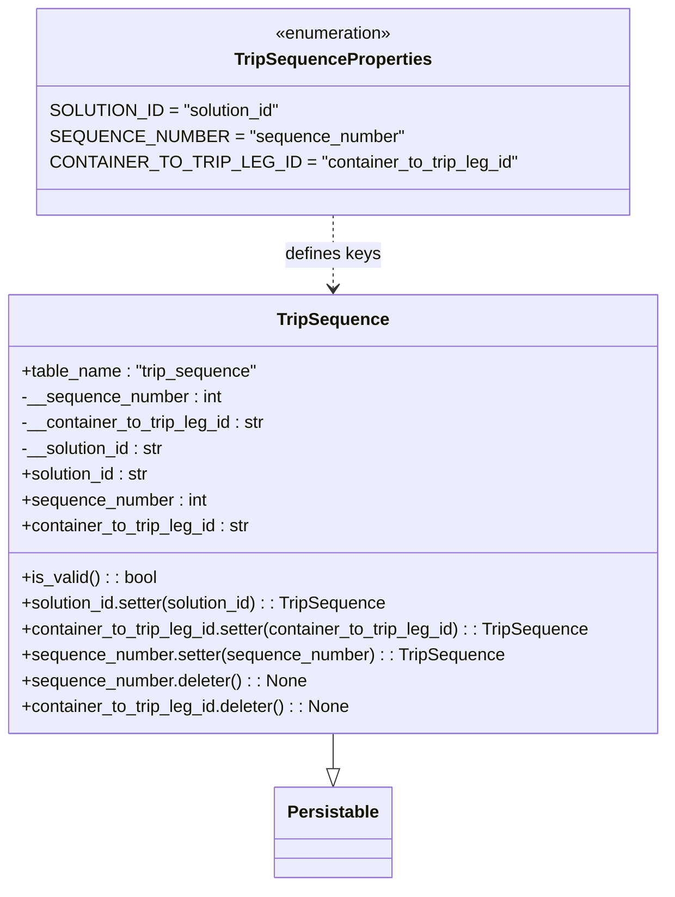

# Diagram: partview_core/partview_service/partview_service/core/datamodel/TripSequence.py

> Auto-generated by Obscura crawlers

## Mermaid

### SVG

<svg id="container" width="626.125" xmlns="http://www.w3.org/2000/svg" class="classDiagram" height="824" viewBox="0 0 626.125 824" role="graphics-document document" aria-roledescription="class"><g><defs><marker id="container_class-aggregationStart" class="marker aggregation class" refX="18" refY="7" markerWidth="190" markerHeight="240" orient="auto"><path d="M 18,7 L9,13 L1,7 L9,1 Z"></path></marker></defs><defs><marker id="container_class-aggregationEnd" class="marker aggregation class" refX="1" refY="7" markerWidth="20" markerHeight="28" orient="auto"><path d="M 18,7 L9,13 L1,7 L9,1 Z"></path></marker></defs><defs><marker id="container_class-extensionStart" class="marker extension class" refX="18" refY="7" markerWidth="190" markerHeight="240" orient="auto"><path d="M 1,7 L18,13 V 1 Z"></path></marker></defs><defs><marker id="container_class-extensionEnd" class="marker extension class" refX="1" refY="7" markerWidth="20" markerHeight="28" orient="auto"><path d="M 1,1 V 13 L18,7 Z"></path></marker></defs><defs><marker id="container_class-compositionStart" class="marker composition class" refX="18" refY="7" markerWidth="190" markerHeight="240" orient="auto"><path d="M 18,7 L9,13 L1,7 L9,1 Z"></path></marker></defs><defs><marker id="container_class-compositionEnd" class="marker composition class" refX="1" refY="7" markerWidth="20" markerHeight="28" orient="auto"><path d="M 18,7 L9,13 L1,7 L9,1 Z"></path></marker></defs><defs><marker id="container_class-dependencyStart" class="marker dependency class" refX="6" refY="7" markerWidth="190" markerHeight="240" orient="auto"><path d="M 5,7 L9,13 L1,7 L9,1 Z"></path></marker></defs><defs><marker id="container_class-dependencyEnd" class="marker dependency class" refX="13" refY="7" markerWidth="20" markerHeight="28" orient="auto"><path d="M 18,7 L9,13 L14,7 L9,1 Z"></path></marker></defs><defs><marker id="container_class-lollipopStart" class="marker lollipop class" refX="13" refY="7" markerWidth="190" markerHeight="240" orient="auto"><circle stroke="black" fill="transparent" cx="7" cy="7" r="6"></circle></marker></defs><defs><marker id="container_class-lollipopEnd" class="marker lollipop class" refX="1" refY="7" markerWidth="190" markerHeight="240" orient="auto"><circle stroke="black" fill="transparent" cx="7" cy="7" r="6"></circle></marker></defs><g class="root"><g class="clusters"></g><g class="edgePaths"><path d="M313.063,682L313.063,686.167C313.063,690.333,313.063,698.667,313.063,704.125C313.063,709.583,313.063,712.167,313.063,713.458L313.063,714.75" id="id_TripSequence_Persistable_1" class="edge-thickness-normal edge-pattern-solid relation" style=";;;" data-edge="true" data-et="edge" data-id="id_TripSequence_Persistable_1" data-points="W3sieCI6MzEzLjA2MjUsInkiOjY4Mn0seyJ4IjozMTMuMDYyNSwieSI6NzA3fSx7IngiOjMxMy4wNjI1LCJ5Ijo3MzJ9XQ==" marker-end="url(#container_class-extensionEnd)"></path><path d="M313.063,200L313.063,206.167C313.063,212.333,313.063,224.667,313.063,236C313.063,247.333,313.063,257.667,313.063,262.833L313.063,268" id="id_TripSequenceProperties_TripSequence_2" class="edge-thickness-normal edge-pattern-dashed relation" style=";;;" data-edge="true" data-et="edge" data-id="id_TripSequenceProperties_TripSequence_2" data-points="W3sieCI6MzEzLjA2MjUsInkiOjIwMH0seyJ4IjozMTMuMDYyNSwieSI6MjM3fSx7IngiOjMxMy4wNjI1LCJ5IjoyNzR9XQ==" marker-end="url(#container_class-dependencyEnd)"></path></g><g class="edgeLabels"><g class="edgeLabel"><g class="label" data-id="id_TripSequence_Persistable_1" transform="translate(0, 0)"><foreignObject width="0" height="0">

</foreignObject></g></g><g class="edgeLabel" transform="translate(313.0625, 237)"><g class="label" data-id="id_TripSequenceProperties_TripSequence_2" transform="translate(-44.6171875, -12)"><foreignObject width="89.234375" height="24">

defines keys

</foreignObject></g></g></g><g class="nodes"><g class="node default" id="classId-TripSequenceProperties-0" transform="translate(313.0625, 104)"><g class="basic label-container"><path d="M-260.21484375 -96 L260.21484375 -96 L260.21484375 96 L-260.21484375 96" stroke="none" stroke-width="0" fill="#ECECFF" style=""></path><path d="M-260.21484375 -96 C-102.2156934436311 -96, 55.78345686273781 -96, 260.21484375 -96 M-260.21484375 -96 C-111.21712417501453 -96, 37.780595399970935 -96, 260.21484375 -96 M260.21484375 -96 C260.21484375 -52.955110259828636, 260.21484375 -9.910220519657273, 260.21484375 96 M260.21484375 -96 C260.21484375 -31.979156465083804, 260.21484375 32.04168706983239, 260.21484375 96 M260.21484375 96 C111.72114334830292 96, -36.772557053394166 96, -260.21484375 96 M260.21484375 96 C124.46798350771357 96, -11.278876734572862 96, -260.21484375 96 M-260.21484375 96 C-260.21484375 43.16802174794608, -260.21484375 -9.663956504107844, -260.21484375 -96 M-260.21484375 96 C-260.21484375 50.96903109943476, -260.21484375 5.938062198869517, -260.21484375 -96" stroke="#9370DB" stroke-width="1.3" fill="none" stroke-dasharray="0 0" style=""></path></g><g class="annotation-group text" transform="translate(-55.5546875, -72)"><g class="label" style="" transform="translate(0,-12)"><foreignObject width="111.109375" height="24">

«enumeration»

</foreignObject></g></g><g class="label-group text" transform="translate(-88.1171875, -48)"><g class="label" style="font-weight: bolder" transform="translate(0,-12)"><foreignObject width="176.234375" height="24">

TripSequenceProperties

</foreignObject></g></g><g class="members-group text" transform="translate(-248.21484375, 0)"><g class="label" style="" transform="translate(0,-12)"><foreignObject width="207.609375" height="24">

SOLUTION_ID = "solution_id"

</foreignObject></g><g class="label" style="" transform="translate(0,12)"><foreignObject width="309.171875" height="24">

SEQUENCE_NUMBER = "sequence_number"

</foreignObject></g><g class="label" style="" transform="translate(0,36)"><foreignObject width="408.3125" height="24">

CONTAINER_TO_TRIP_LEG_ID = "container_to_trip_leg_id"

</foreignObject></g></g><g class="methods-group text" transform="translate(-248.21484375, 96)"></g><g class="divider" style=""><path d="M-260.21484375 -24 C-90.05246558276778 -24, 80.10991258446444 -24, 260.21484375 -24 M-260.21484375 -24 C-128.81657374727638 -24, 2.581696255447241 -24, 260.21484375 -24" stroke="#9370DB" stroke-width="1.3" fill="none" stroke-dasharray="0 0" style=""></path></g><g class="divider" style=""><path d="M-260.21484375 72 C-108.31039465569606 72, 43.594054438607884 72, 260.21484375 72 M-260.21484375 72 C-150.25878404645158 72, -40.30272434290313 72, 260.21484375 72" stroke="#9370DB" stroke-width="1.3" fill="none" stroke-dasharray="0 0" style=""></path></g></g><g class="node default" id="classId-Persistable-1" transform="translate(313.0625, 774)"><g class="basic label-container"><path d="M-52.9765625 -42 L52.9765625 -42 L52.9765625 42 L-52.9765625 42" stroke="none" stroke-width="0" fill="#ECECFF" style=""></path><path d="M-52.9765625 -42 C-25.53160961624381 -42, 1.9133432675123814 -42, 52.9765625 -42 M-52.9765625 -42 C-18.45545639520641 -42, 16.065649709587177 -42, 52.9765625 -42 M52.9765625 -42 C52.9765625 -14.539486001971717, 52.9765625 12.921027996056566, 52.9765625 42 M52.9765625 -42 C52.9765625 -20.73460932142453, 52.9765625 0.5307813571509428, 52.9765625 42 M52.9765625 42 C29.58163143389413 42, 6.186700367788262 42, -52.9765625 42 M52.9765625 42 C19.48148127646016 42, -14.013599947079683 42, -52.9765625 42 M-52.9765625 42 C-52.9765625 13.427769310448, -52.9765625 -15.144461379104001, -52.9765625 -42 M-52.9765625 42 C-52.9765625 12.21465976407979, -52.9765625 -17.57068047184042, -52.9765625 -42" stroke="#9370DB" stroke-width="1.3" fill="none" stroke-dasharray="0 0" style=""></path></g><g class="annotation-group text" transform="translate(0, -18)"></g><g class="label-group text" transform="translate(-40.9765625, -18)"><g class="label" style="font-weight: bolder" transform="translate(0,-12)"><foreignObject width="81.953125" height="24">

Persistable

</foreignObject></g></g><g class="members-group text" transform="translate(-40.9765625, 30)"></g><g class="methods-group text" transform="translate(-40.9765625, 60)"></g><g class="divider" style=""><path d="M-52.9765625 6 C-14.94897280182088 6, 23.07861689635824 6, 52.9765625 6 M-52.9765625 6 C-11.135364128389448 6, 30.705834243221105 6, 52.9765625 6" stroke="#9370DB" stroke-width="1.3" fill="none" stroke-dasharray="0 0" style=""></path></g><g class="divider" style=""><path d="M-52.9765625 24 C-23.29542959294559 24, 6.385703314108817 24, 52.9765625 24 M-52.9765625 24 C-29.035561176506455 24, -5.09455985301291 24, 52.9765625 24" stroke="#9370DB" stroke-width="1.3" fill="none" stroke-dasharray="0 0" style=""></path></g></g><g class="node default" id="classId-TripSequence-2" transform="translate(313.0625, 478)"><g class="basic label-container"><path d="M-305.0625 -204 L305.0625 -204 L305.0625 204 L-305.0625 204" stroke="none" stroke-width="0" fill="#ECECFF" style=""></path><path d="M-305.0625 -204 C-67.22201385018712 -204, 170.61847229962575 -204, 305.0625 -204 M-305.0625 -204 C-72.1602804285956 -204, 160.7419391428088 -204, 305.0625 -204 M305.0625 -204 C305.0625 -100.22655875537473, 305.0625 3.5468824892505495, 305.0625 204 M305.0625 -204 C305.0625 -47.87058064673681, 305.0625 108.25883870652638, 305.0625 204 M305.0625 204 C158.1053574516369 204, 11.14821490327381 204, -305.0625 204 M305.0625 204 C159.26565661258775 204, 13.468813225175495 204, -305.0625 204 M-305.0625 204 C-305.0625 100.47994599462086, -305.0625 -3.0401080107582743, -305.0625 -204 M-305.0625 204 C-305.0625 119.68298975541192, -305.0625 35.36597951082385, -305.0625 -204" stroke="#9370DB" stroke-width="1.3" fill="none" stroke-dasharray="0 0" style=""></path></g><g class="annotation-group text" transform="translate(0, -180)"></g><g class="label-group text" transform="translate(-49.8125, -180)"><g class="label" style="font-weight: bolder" transform="translate(0,-12)"><foreignObject width="99.625" height="24">

TripSequence

</foreignObject></g></g><g class="members-group text" transform="translate(-293.0625, -132)"><g class="label" style="" transform="translate(0,-12)"><foreignObject width="221.890625" height="24">

+table_name : "trip_sequence"

</foreignObject></g><g class="label" style="" transform="translate(0,12)"><foreignObject width="187.65625" height="24">

-__sequence_number : int

</foreignObject></g><g class="label" style="" transform="translate(0,36)"><foreignObject width="229.484375" height="24">

-__container_to_trip_leg_id : str

</foreignObject></g><g class="label" style="" transform="translate(0,60)"><foreignObject width="135.625" height="24">

-__solution_id : str

</foreignObject></g><g class="label" style="" transform="translate(0,84)"><foreignObject width="121.953125" height="24">

+solution_id : str

</foreignObject></g><g class="label" style="" transform="translate(0,108)"><foreignObject width="173.984375" height="24">

+sequence_number : int

</foreignObject></g><g class="label" style="" transform="translate(0,132)"><foreignObject width="216.140625" height="24">

+container_to_trip_leg_id : str

</foreignObject></g></g><g class="methods-group text" transform="translate(-293.0625, 60)"><g class="label" style="" transform="translate(0,-12)"><foreignObject width="126.078125" height="24">

+is_valid() : : bool

</foreignObject></g><g class="label" style="" transform="translate(0,12)"><foreignObject width="347.953125" height="24">

+solution_id.setter(solution_id) : : TripSequence

</foreignObject></g><g class="label" style="" transform="translate(0,36)"><foreignObject width="536.3125" height="24">

+container_to_trip_leg_id.setter(container_to_trip_leg_id) : : TripSequence

</foreignObject></g><g class="label" style="" transform="translate(0,60)"><foreignObject width="450.265625" height="24">

+sequence_number.setter(sequence_number) : : TripSequence

</foreignObject></g><g class="label" style="" transform="translate(0,84)"><foreignObject width="265.59375" height="24">

+sequence_number.deleter() : : None

</foreignObject></g><g class="label" style="" transform="translate(0,108)"><foreignObject width="309.25" height="24">

+container_to_trip_leg_id.deleter() : : None

</foreignObject></g></g><g class="divider" style=""><path d="M-305.0625 -156 C-67.05181243281604 -156, 170.95887513436793 -156, 305.0625 -156 M-305.0625 -156 C-85.46800599132058 -156, 134.12648801735884 -156, 305.0625 -156" stroke="#9370DB" stroke-width="1.3" fill="none" stroke-dasharray="0 0" style=""></path></g><g class="divider" style=""><path d="M-305.0625 36 C-108.76429730372129 36, 87.53390539255741 36, 305.0625 36 M-305.0625 36 C-123.154772089477 36, 58.75295582104599 36, 305.0625 36" stroke="#9370DB" stroke-width="1.3" fill="none" stroke-dasharray="0 0" style=""></path></g></g></g></g></g></svg>
