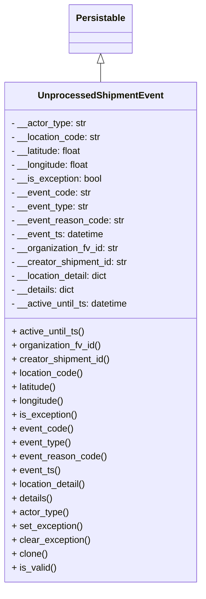

# Diagram: partview_core/partview_service/partview_service/core/datamodel/UnprocessedShipmentEvent.py


> Auto-generated by Obscura crawlers

## Diagram 1



### SVG

<svg id="container" width="348.46875" xmlns="http://www.w3.org/2000/svg" class="classDiagram" height="1014" viewBox="0 0 348.46875 1014" role="graphics-document document" aria-roledescription="class"><style>#container{font-family:"trebuchet ms",verdana,arial,sans-serif;font-size:16px;fill:#333;}@keyframes edge-animation-frame{from{stroke-dashoffset:0;}}@keyframes dash{to{stroke-dashoffset:0;}}#container .edge-animation-slow{stroke-dasharray:9,5!important;stroke-dashoffset:900;animation:dash 50s linear infinite;stroke-linecap:round;}#container .edge-animation-fast{stroke-dasharray:9,5!important;stroke-dashoffset:900;animation:dash 20s linear infinite;stroke-linecap:round;}#container .error-icon{fill:#552222;}#container .error-text{fill:#552222;stroke:#552222;}#container .edge-thickness-normal{stroke-width:1px;}#container .edge-thickness-thick{stroke-width:3.5px;}#container .edge-pattern-solid{stroke-dasharray:0;}#container .edge-thickness-invisible{stroke-width:0;fill:none;}#container .edge-pattern-dashed{stroke-dasharray:3;}#container .edge-pattern-dotted{stroke-dasharray:2;}#container .marker{fill:#333333;stroke:#333333;}#container .marker.cross{stroke:#333333;}#container svg{font-family:"trebuchet ms",verdana,arial,sans-serif;font-size:16px;}#container p{margin:0;}#container g.classGroup text{fill:#9370DB;stroke:none;font-family:"trebuchet ms",verdana,arial,sans-serif;font-size:10px;}#container g.classGroup text .title{font-weight:bolder;}#container .nodeLabel,#container .edgeLabel{color:#131300;}#container .edgeLabel .label rect{fill:#ECECFF;}#container .label text{fill:#131300;}#container .labelBkg{background:#ECECFF;}#container .edgeLabel .label span{background:#ECECFF;}#container .classTitle{font-weight:bolder;}#container .node rect,#container .node circle,#container .node ellipse,#container .node polygon,#container .node path{fill:#ECECFF;stroke:#9370DB;stroke-width:1px;}#container .divider{stroke:#9370DB;stroke-width:1;}#container g.clickable{cursor:pointer;}#container g.classGroup rect{fill:#ECECFF;stroke:#9370DB;}#container g.classGroup line{stroke:#9370DB;stroke-width:1;}#container .classLabel .box{stroke:none;stroke-width:0;fill:#ECECFF;opacity:0.5;}#container .classLabel .label{fill:#9370DB;font-size:10px;}#container .relation{stroke:#333333;stroke-width:1;fill:none;}#container .dashed-line{stroke-dasharray:3;}#container .dotted-line{stroke-dasharray:1 2;}#container #compositionStart,#container .composition{fill:#333333!important;stroke:#333333!important;stroke-width:1;}#container #compositionEnd,#container .composition{fill:#333333!important;stroke:#333333!important;stroke-width:1;}#container #dependencyStart,#container .dependency{fill:#333333!important;stroke:#333333!important;stroke-width:1;}#container #dependencyStart,#container .dependency{fill:#333333!important;stroke:#333333!important;stroke-width:1;}#container #extensionStart,#container .extension{fill:transparent!important;stroke:#333333!important;stroke-width:1;}#container #extensionEnd,#container .extension{fill:transparent!important;stroke:#333333!important;stroke-width:1;}#container #aggregationStart,#container .aggregation{fill:transparent!important;stroke:#333333!important;stroke-width:1;}#container #aggregationEnd,#container .aggregation{fill:transparent!important;stroke:#333333!important;stroke-width:1;}#container #lollipopStart,#container .lollipop{fill:#ECECFF!important;stroke:#333333!important;stroke-width:1;}#container #lollipopEnd,#container .lollipop{fill:#ECECFF!important;stroke:#333333!important;stroke-width:1;}#container .edgeTerminals{font-size:11px;line-height:initial;}#container .classTitleText{text-anchor:middle;font-size:18px;fill:#333;}#container .label-icon{display:inline-block;height:1em;overflow:visible;vertical-align:-0.125em;}#container .node .label-icon path{fill:currentColor;stroke:revert;stroke-width:revert;}#container :root{--mermaid-font-family:"trebuchet ms",verdana,arial,sans-serif;}</style><g><defs><marker id="container_class-aggregationStart" class="marker aggregation class" refX="18" refY="7" markerWidth="190" markerHeight="240" orient="auto"><path d="M 18,7 L9,13 L1,7 L9,1 Z"></path></marker></defs><defs><marker id="container_class-aggregationEnd" class="marker aggregation class" refX="1" refY="7" markerWidth="20" markerHeight="28" orient="auto"><path d="M 18,7 L9,13 L1,7 L9,1 Z"></path></marker></defs><defs><marker id="container_class-extensionStart" class="marker extension class" refX="18" refY="7" markerWidth="190" markerHeight="240" orient="auto"><path d="M 1,7 L18,13 V 1 Z"></path></marker></defs><defs><marker id="container_class-extensionEnd" class="marker extension class" refX="1" refY="7" markerWidth="20" markerHeight="28" orient="auto"><path d="M 1,1 V 13 L18,7 Z"></path></marker></defs><defs><marker id="container_class-compositionStart" class="marker composition class" refX="18" refY="7" markerWidth="190" markerHeight="240" orient="auto"><path d="M 18,7 L9,13 L1,7 L9,1 Z"></path></marker></defs><defs><marker id="container_class-compositionEnd" class="marker composition class" refX="1" refY="7" markerWidth="20" markerHeight="28" orient="auto"><path d="M 18,7 L9,13 L1,7 L9,1 Z"></path></marker></defs><defs><marker id="container_class-dependencyStart" class="marker dependency class" refX="6" refY="7" markerWidth="190" markerHeight="240" orient="auto"><path d="M 5,7 L9,13 L1,7 L9,1 Z"></path></marker></defs><defs><marker id="container_class-dependencyEnd" class="marker dependency class" refX="13" refY="7" markerWidth="20" markerHeight="28" orient="auto"><path d="M 18,7 L9,13 L14,7 L9,1 Z"></path></marker></defs><defs><marker id="container_class-lollipopStart" class="marker lollipop class" refX="13" refY="7" markerWidth="190" markerHeight="240" orient="auto"><circle stroke="black" fill="transparent" cx="7" cy="7" r="6"></circle></marker></defs><defs><marker id="container_class-lollipopEnd" class="marker lollipop class" refX="1" refY="7" markerWidth="190" markerHeight="240" orient="auto"><circle stroke="black" fill="transparent" cx="7" cy="7" r="6"></circle></marker></defs><g class="root"><g class="clusters"></g><g class="edgePaths"><path d="M174.234,109.25L174.234,110.542C174.234,111.833,174.234,114.417,174.234,119.875C174.234,125.333,174.234,133.667,174.234,137.833L174.234,142" id="id_Persistable_UnprocessedShipmentEvent_1" class="edge-thickness-normal edge-pattern-solid relation" style=";;;" data-edge="true" data-et="edge" data-id="id_Persistable_UnprocessedShipmentEvent_1" data-points="W3sieCI6MTc0LjIzNDM3NSwieSI6OTJ9LHsieCI6MTc0LjIzNDM3NSwieSI6MTE3fSx7IngiOjE3NC4yMzQzNzUsInkiOjE0Mn1d" marker-start="url(#container_class-extensionStart)"></path></g><g class="edgeLabels"><g class="edgeLabel"><g class="label" data-id="id_Persistable_UnprocessedShipmentEvent_1" transform="translate(0, 0)"><foreignObject width="0" height="0"><div xmlns="http://www.w3.org/1999/xhtml" class="labelBkg" style="display: table-cell; white-space: nowrap; line-height: 1.5; max-width: 200px; text-align: center;"><span class="edgeLabel"></span></div></foreignObject></g></g></g><g class="nodes"><g class="node default" id="classId-Persistable-0" transform="translate(174.234375, 50)"><g class="basic label-container"><path d="M-52.9765625 -42 L52.9765625 -42 L52.9765625 42 L-52.9765625 42" stroke="none" stroke-width="0" fill="#ECECFF" style=""></path><path d="M-52.9765625 -42 C-23.04626170263821 -42, 6.884039094723583 -42, 52.9765625 -42 M-52.9765625 -42 C-31.344184319460798 -42, -9.711806138921595 -42, 52.9765625 -42 M52.9765625 -42 C52.9765625 -14.420876569448641, 52.9765625 13.158246861102718, 52.9765625 42 M52.9765625 -42 C52.9765625 -9.073751975297682, 52.9765625 23.852496049404635, 52.9765625 42 M52.9765625 42 C25.886486487298694 42, -1.203589525402613 42, -52.9765625 42 M52.9765625 42 C21.259998979936004 42, -10.456564540127992 42, -52.9765625 42 M-52.9765625 42 C-52.9765625 15.180919482027459, -52.9765625 -11.638161035945082, -52.9765625 -42 M-52.9765625 42 C-52.9765625 12.77031924445025, -52.9765625 -16.4593615110995, -52.9765625 -42" stroke="#9370DB" stroke-width="1.3" fill="none" stroke-dasharray="0 0" style=""></path></g><g class="annotation-group text" transform="translate(0, -18)"></g><g class="label-group text" transform="translate(-40.9765625, -18)"><g class="label" style="font-weight: bolder" transform="translate(0,-12)"><foreignObject width="81.953125" height="24"><div xmlns="http://www.w3.org/1999/xhtml" style="display: table-cell; white-space: nowrap; line-height: 1.5; max-width: 130px; text-align: center;"><span class="nodeLabel markdown-node-label" style=""><p>Persistable</p></span></div></foreignObject></g></g><g class="members-group text" transform="translate(-40.9765625, 30)"></g><g class="methods-group text" transform="translate(-40.9765625, 60)"></g><g class="divider" style=""><path d="M-52.9765625 6 C-31.31643071744701 6, -9.656298934894018 6, 52.9765625 6 M-52.9765625 6 C-26.078233659183336 6, 0.8200951816333273 6, 52.9765625 6" stroke="#9370DB" stroke-width="1.3" fill="none" stroke-dasharray="0 0" style=""></path></g><g class="divider" style=""><path d="M-52.9765625 24 C-16.36718783810643 24, 20.242186823787137 24, 52.9765625 24 M-52.9765625 24 C-15.972456785464502 24, 21.031648929070997 24, 52.9765625 24" stroke="#9370DB" stroke-width="1.3" fill="none" stroke-dasharray="0 0" style=""></path></g></g><g class="node default" id="classId-UnprocessedShipmentEvent-1" transform="translate(174.234375, 574)"><g class="basic label-container"><path d="M-166.234375 -432 L166.234375 -432 L166.234375 432 L-166.234375 432" stroke="none" stroke-width="0" fill="#ECECFF" style=""></path><path d="M-166.234375 -432 C-72.16444733430133 -432, 21.905480331397342 -432, 166.234375 -432 M-166.234375 -432 C-66.66161489412683 -432, 32.911145211746344 -432, 166.234375 -432 M166.234375 -432 C166.234375 -198.80216126298058, 166.234375 34.39567747403885, 166.234375 432 M166.234375 -432 C166.234375 -137.89930373118432, 166.234375 156.20139253763136, 166.234375 432 M166.234375 432 C89.44803614544391 432, 12.661697290887815 432, -166.234375 432 M166.234375 432 C63.82834023249737 432, -38.577694535005264 432, -166.234375 432 M-166.234375 432 C-166.234375 109.04940012535553, -166.234375 -213.90119974928893, -166.234375 -432 M-166.234375 432 C-166.234375 190.3733779914596, -166.234375 -51.25324401708082, -166.234375 -432" stroke="#9370DB" stroke-width="1.3" fill="none" stroke-dasharray="0 0" style=""></path></g><g class="annotation-group text" transform="translate(0, -408)"></g><g class="label-group text" transform="translate(-102.53125, -408)"><g class="label" style="font-weight: bolder" transform="translate(0,-12)"><foreignObject width="205.0625" height="24"><div xmlns="http://www.w3.org/1999/xhtml" style="display: table-cell; white-space: nowrap; line-height: 1.5; max-width: 253px; text-align: center;"><span class="nodeLabel markdown-node-label" style=""><p>UnprocessedShipmentEvent</p></span></div></foreignObject></g></g><g class="members-group text" transform="translate(-154.234375, -360)"><g class="label" style="" transform="translate(0,-12)"><foreignObject width="130.28125" height="24"><div xmlns="http://www.w3.org/1999/xhtml" style="display: table-cell; white-space: nowrap; line-height: 1.5; max-width: 188px; text-align: center;"><span class="nodeLabel markdown-node-label" style=""><p>- __actor_type: str</p></span></div></foreignObject></g><g class="label" style="" transform="translate(0,12)"><foreignObject width="156.625" height="24"><div xmlns="http://www.w3.org/1999/xhtml" style="display: table-cell; white-space: nowrap; line-height: 1.5; max-width: 215px; text-align: center;"><span class="nodeLabel markdown-node-label" style=""><p>- __location_code: str</p></span></div></foreignObject></g><g class="label" style="" transform="translate(0,36)"><foreignObject width="125.125" height="24"><div xmlns="http://www.w3.org/1999/xhtml" style="display: table-cell; white-space: nowrap; line-height: 1.5; max-width: 183px; text-align: center;"><span class="nodeLabel markdown-node-label" style=""><p>- __latitude: float</p></span></div></foreignObject></g><g class="label" style="" transform="translate(0,60)"><foreignObject width="137.6875" height="24"><div xmlns="http://www.w3.org/1999/xhtml" style="display: table-cell; white-space: nowrap; line-height: 1.5; max-width: 195px; text-align: center;"><span class="nodeLabel markdown-node-label" style=""><p>- __longitude: float</p></span></div></foreignObject></g><g class="label" style="" transform="translate(0,84)"><foreignObject width="158.546875" height="24"><div xmlns="http://www.w3.org/1999/xhtml" style="display: table-cell; white-space: nowrap; line-height: 1.5; max-width: 216px; text-align: center;"><span class="nodeLabel markdown-node-label" style=""><p>- __is_exception: bool</p></span></div></foreignObject></g><g class="label" style="" transform="translate(0,108)"><foreignObject width="137.65625" height="24"><div xmlns="http://www.w3.org/1999/xhtml" style="display: table-cell; white-space: nowrap; line-height: 1.5; max-width: 196px; text-align: center;"><span class="nodeLabel markdown-node-label" style=""><p>- __event_code: str</p></span></div></foreignObject></g><g class="label" style="" transform="translate(0,132)"><foreignObject width="134.484375" height="24"><div xmlns="http://www.w3.org/1999/xhtml" style="display: table-cell; white-space: nowrap; line-height: 1.5; max-width: 193px; text-align: center;"><span class="nodeLabel markdown-node-label" style=""><p>- __event_type: str</p></span></div></foreignObject></g><g class="label" style="" transform="translate(0,156)"><foreignObject width="194.96875" height="24"><div xmlns="http://www.w3.org/1999/xhtml" style="display: table-cell; white-space: nowrap; line-height: 1.5; max-width: 253px; text-align: center;"><span class="nodeLabel markdown-node-label" style=""><p>- __event_reason_code: str</p></span></div></foreignObject></g><g class="label" style="" transform="translate(0,180)"><foreignObject width="161.765625" height="24"><div xmlns="http://www.w3.org/1999/xhtml" style="display: table-cell; white-space: nowrap; line-height: 1.5; max-width: 219px; text-align: center;"><span class="nodeLabel markdown-node-label" style=""><p>- __event_ts: datetime</p></span></div></foreignObject></g><g class="label" style="" transform="translate(0,204)"><foreignObject width="187.859375" height="24"><div xmlns="http://www.w3.org/1999/xhtml" style="display: table-cell; white-space: nowrap; line-height: 1.5; max-width: 246px; text-align: center;"><span class="nodeLabel markdown-node-label" style=""><p>- __organization_fv_id: str</p></span></div></foreignObject></g><g class="label" style="" transform="translate(0,228)"><foreignObject width="203.90625" height="24"><div xmlns="http://www.w3.org/1999/xhtml" style="display: table-cell; white-space: nowrap; line-height: 1.5; max-width: 262px; text-align: center;"><span class="nodeLabel markdown-node-label" style=""><p>- __creator_shipment_id: str</p></span></div></foreignObject></g><g class="label" style="" transform="translate(0,252)"><foreignObject width="171.765625" height="24"><div xmlns="http://www.w3.org/1999/xhtml" style="display: table-cell; white-space: nowrap; line-height: 1.5; max-width: 229px; text-align: center;"><span class="nodeLabel markdown-node-label" style=""><p>- __location_detail: dict</p></span></div></foreignObject></g><g class="label" style="" transform="translate(0,276)"><foreignObject width="111.765625" height="24"><div xmlns="http://www.w3.org/1999/xhtml" style="display: table-cell; white-space: nowrap; line-height: 1.5; max-width: 169px; text-align: center;"><span class="nodeLabel markdown-node-label" style=""><p>- __details: dict</p></span></div></foreignObject></g><g class="label" style="" transform="translate(0,300)"><foreignObject width="205.9375" height="24"><div xmlns="http://www.w3.org/1999/xhtml" style="display: table-cell; white-space: nowrap; line-height: 1.5; max-width: 263px; text-align: center;"><span class="nodeLabel markdown-node-label" style=""><p>- __active_until_ts: datetime</p></span></div></foreignObject></g></g><g class="methods-group text" transform="translate(-154.234375, 0)"><g class="label" style="" transform="translate(0,-12)"><foreignObject width="128.359375" height="24"><div xmlns="http://www.w3.org/1999/xhtml" style="display: table-cell; white-space: nowrap; line-height: 1.5; max-width: 186px; text-align: center;"><span class="nodeLabel markdown-node-label" style=""><p>+ active_until_ts()</p></span></div></foreignObject></g><g class="label" style="" transform="translate(0,12)"><foreignObject width="156.109375" height="24"><div xmlns="http://www.w3.org/1999/xhtml" style="display: table-cell; white-space: nowrap; line-height: 1.5; max-width: 213px; text-align: center;"><span class="nodeLabel markdown-node-label" style=""><p>+ organization_fv_id()</p></span></div></foreignObject></g><g class="label" style="" transform="translate(0,36)"><foreignObject width="172.15625" height="24"><div xmlns="http://www.w3.org/1999/xhtml" style="display: table-cell; white-space: nowrap; line-height: 1.5; max-width: 230px; text-align: center;"><span class="nodeLabel markdown-node-label" style=""><p>+ creator_shipment_id()</p></span></div></foreignObject></g><g class="label" style="" transform="translate(0,60)"><foreignObject width="124.71875" height="24"><div xmlns="http://www.w3.org/1999/xhtml" style="display: table-cell; white-space: nowrap; line-height: 1.5; max-width: 182px; text-align: center;"><span class="nodeLabel markdown-node-label" style=""><p>+ location_code()</p></span></div></foreignObject></g><g class="label" style="" transform="translate(0,84)"><foreignObject width="79.578125" height="24"><div xmlns="http://www.w3.org/1999/xhtml" style="display: table-cell; white-space: nowrap; line-height: 1.5; max-width: 137px; text-align: center;"><span class="nodeLabel markdown-node-label" style=""><p>+ latitude()</p></span></div></foreignObject></g><g class="label" style="" transform="translate(0,108)"><foreignObject width="92.140625" height="24"><div xmlns="http://www.w3.org/1999/xhtml" style="display: table-cell; white-space: nowrap; line-height: 1.5; max-width: 150px; text-align: center;"><span class="nodeLabel markdown-node-label" style=""><p>+ longitude()</p></span></div></foreignObject></g><g class="label" style="" transform="translate(0,132)"><foreignObject width="113.015625" height="24"><div xmlns="http://www.w3.org/1999/xhtml" style="display: table-cell; white-space: nowrap; line-height: 1.5; max-width: 170px; text-align: center;"><span class="nodeLabel markdown-node-label" style=""><p>+ is_exception()</p></span></div></foreignObject></g><g class="label" style="" transform="translate(0,156)"><foreignObject width="105.890625" height="24"><div xmlns="http://www.w3.org/1999/xhtml" style="display: table-cell; white-space: nowrap; line-height: 1.5; max-width: 163px; text-align: center;"><span class="nodeLabel markdown-node-label" style=""><p>+ event_code()</p></span></div></foreignObject></g><g class="label" style="" transform="translate(0,180)"><foreignObject width="102.734375" height="24"><div xmlns="http://www.w3.org/1999/xhtml" style="display: table-cell; white-space: nowrap; line-height: 1.5; max-width: 160px; text-align: center;"><span class="nodeLabel markdown-node-label" style=""><p>+ event_type()</p></span></div></foreignObject></g><g class="label" style="" transform="translate(0,204)"><foreignObject width="163.203125" height="24"><div xmlns="http://www.w3.org/1999/xhtml" style="display: table-cell; white-space: nowrap; line-height: 1.5; max-width: 221px; text-align: center;"><span class="nodeLabel markdown-node-label" style=""><p>+ event_reason_code()</p></span></div></foreignObject></g><g class="label" style="" transform="translate(0,228)"><foreignObject width="84.1875" height="24"><div xmlns="http://www.w3.org/1999/xhtml" style="display: table-cell; white-space: nowrap; line-height: 1.5; max-width: 142px; text-align: center;"><span class="nodeLabel markdown-node-label" style=""><p>+ event_ts()</p></span></div></foreignObject></g><g class="label" style="" transform="translate(0,252)"><foreignObject width="131.609375" height="24"><div xmlns="http://www.w3.org/1999/xhtml" style="display: table-cell; white-space: nowrap; line-height: 1.5; max-width: 189px; text-align: center;"><span class="nodeLabel markdown-node-label" style=""><p>+ location_detail()</p></span></div></foreignObject></g><g class="label" style="" transform="translate(0,276)"><foreignObject width="71.921875" height="24"><div xmlns="http://www.w3.org/1999/xhtml" style="display: table-cell; white-space: nowrap; line-height: 1.5; max-width: 129px; text-align: center;"><span class="nodeLabel markdown-node-label" style=""><p>+ details()</p></span></div></foreignObject></g><g class="label" style="" transform="translate(0,300)"><foreignObject width="98.515625" height="24"><div xmlns="http://www.w3.org/1999/xhtml" style="display: table-cell; white-space: nowrap; line-height: 1.5; max-width: 156px; text-align: center;"><span class="nodeLabel markdown-node-label" style=""><p>+ actor_type()</p></span></div></foreignObject></g><g class="label" style="" transform="translate(0,324)"><foreignObject width="123.3125" height="24"><div xmlns="http://www.w3.org/1999/xhtml" style="display: table-cell; white-space: nowrap; line-height: 1.5; max-width: 181px; text-align: center;"><span class="nodeLabel markdown-node-label" style=""><p>+ set_exception()</p></span></div></foreignObject></g><g class="label" style="" transform="translate(0,348)"><foreignObject width="135.765625" height="24"><div xmlns="http://www.w3.org/1999/xhtml" style="display: table-cell; white-space: nowrap; line-height: 1.5; max-width: 193px; text-align: center;"><span class="nodeLabel markdown-node-label" style=""><p>+ clear_exception()</p></span></div></foreignObject></g><g class="label" style="" transform="translate(0,372)"><foreignObject width="62.296875" height="24"><div xmlns="http://www.w3.org/1999/xhtml" style="display: table-cell; white-space: nowrap; line-height: 1.5; max-width: 120px; text-align: center;"><span class="nodeLabel markdown-node-label" style=""><p>+ clone()</p></span></div></foreignObject></g><g class="label" style="" transform="translate(0,396)"><foreignObject width="77.03125" height="24"><div xmlns="http://www.w3.org/1999/xhtml" style="display: table-cell; white-space: nowrap; line-height: 1.5; max-width: 134px; text-align: center;"><span class="nodeLabel markdown-node-label" style=""><p>+ is_valid()</p></span></div></foreignObject></g></g><g class="divider" style=""><path d="M-166.234375 -384 C-90.8546193796054 -384, -15.474863759210791 -384, 166.234375 -384 M-166.234375 -384 C-68.67365059892497 -384, 28.88707380215007 -384, 166.234375 -384" stroke="#9370DB" stroke-width="1.3" fill="none" stroke-dasharray="0 0" style=""></path></g><g class="divider" style=""><path d="M-166.234375 -24 C-49.67743643981272 -24, 66.87950212037455 -24, 166.234375 -24 M-166.234375 -24 C-54.652931415623044 -24, 56.92851216875391 -24, 166.234375 -24" stroke="#9370DB" stroke-width="1.3" fill="none" stroke-dasharray="0 0" style=""></path></g></g></g></g></g></svg>

## Diagram 2

```mermaid
flowchart TD
    Create[Create/Load UnprocessedShipmentEvent]
    Modify[Call setter or mutator]
    SetterChecks{setter assertions (type checks)}
    ConvertNum[Int latitude/longitude -> float if int]
    DetailsParse[details string -> json.loads]
    AddDirty[add_dirty_field(field, value)]
    SetException[set_exception / clear_exception toggles __is_exception]
    Validation[is_valid checks\n - organization_fv_id str\n - creator_shipment_id str\n - if event_type == "milestone": location_code/lat/long types\n - is_exception type\n - event_code str\n - event_ts datetime]
    Valid[Valid -> True]
    Invalid[Invalid -> False]

    Create --> Modify
    Modify --> SetterChecks
    SetterChecks -->|pass| AddDirty
    SetterChecks -->|fail| Invalid
    SetterChecks --> ConvertNum
    ConvertNum --> AddDirty
    Modify --> DetailsParse
    DetailsParse --> AddDirty
    Modify --> SetException
    AddDirty --> Validation
    SetException --> Validation
    Validation -->|ok| Valid
    Validation -->|fail| Invalid
```

> SVG rendering failed for this diagram.
