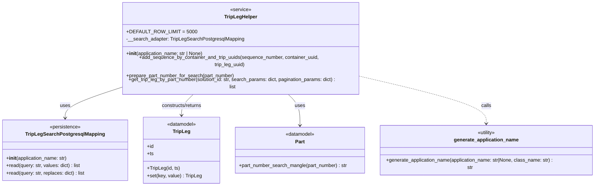

# Diagram: partview_core/partview_service/partview_service/core/helpers/TripLegHelper.py

> Auto-generated by Obscura crawlers

## Mermaid

### SVG

<svg id="container" width="1948.359375" xmlns="http://www.w3.org/2000/svg" class="classDiagram" height="570" viewBox="0 0 1948.359375 570" role="graphics-document document" aria-roledescription="class"><g><defs><marker id="container_class-aggregationStart" class="marker aggregation class" refX="18" refY="7" markerWidth="190" markerHeight="240" orient="auto"><path d="M 18,7 L9,13 L1,7 L9,1 Z"></path></marker></defs><defs><marker id="container_class-aggregationEnd" class="marker aggregation class" refX="1" refY="7" markerWidth="20" markerHeight="28" orient="auto"><path d="M 18,7 L9,13 L1,7 L9,1 Z"></path></marker></defs><defs><marker id="container_class-extensionStart" class="marker extension class" refX="18" refY="7" markerWidth="190" markerHeight="240" orient="auto"><path d="M 1,7 L18,13 V 1 Z"></path></marker></defs><defs><marker id="container_class-extensionEnd" class="marker extension class" refX="1" refY="7" markerWidth="20" markerHeight="28" orient="auto"><path d="M 1,1 V 13 L18,7 Z"></path></marker></defs><defs><marker id="container_class-compositionStart" class="marker composition class" refX="18" refY="7" markerWidth="190" markerHeight="240" orient="auto"><path d="M 18,7 L9,13 L1,7 L9,1 Z"></path></marker></defs><defs><marker id="container_class-compositionEnd" class="marker composition class" refX="1" refY="7" markerWidth="20" markerHeight="28" orient="auto"><path d="M 18,7 L9,13 L1,7 L9,1 Z"></path></marker></defs><defs><marker id="container_class-dependencyStart" class="marker dependency class" refX="6" refY="7" markerWidth="190" markerHeight="240" orient="auto"><path d="M 5,7 L9,13 L1,7 L9,1 Z"></path></marker></defs><defs><marker id="container_class-dependencyEnd" class="marker dependency class" refX="13" refY="7" markerWidth="20" markerHeight="28" orient="auto"><path d="M 18,7 L9,13 L14,7 L9,1 Z"></path></marker></defs><defs><marker id="container_class-lollipopStart" class="marker lollipop class" refX="13" refY="7" markerWidth="190" markerHeight="240" orient="auto"><circle stroke="black" fill="transparent" cx="7" cy="7" r="6"></circle></marker></defs><defs><marker id="container_class-lollipopEnd" class="marker lollipop class" refX="1" refY="7" markerWidth="190" markerHeight="240" orient="auto"><circle stroke="black" fill="transparent" cx="7" cy="7" r="6"></circle></marker></defs><g class="root"><g class="clusters"></g><g class="edgePaths"><path d="M386.625,256.718L357.202,265.432C327.78,274.146,268.935,291.573,239.512,306.953C210.09,322.333,210.09,335.667,210.09,342.333L210.09,349" id="id_TripLegHelper_TripLegSearchPostgresqlMapping_1" class="edge-thickness-normal edge-pattern-solid relation" style=";;;" data-edge="true" data-et="edge" data-id="id_TripLegHelper_TripLegSearchPostgresqlMapping_1" data-points="W3sieCI6Mzg2LjYyNSwieSI6MjU2LjcxODM1MDgzNDQ0fSx7IngiOjIxMC4wODk4NDM3NSwieSI6MzA5fSx7IngiOjIxMC4wODk4NDM3NSwieSI6MzU1fV0=" marker-end="url(#container_class-dependencyEnd)"></path><path d="M628.949,272L621.858,278.167C614.767,284.333,600.585,296.667,593.493,308C586.402,319.333,586.402,329.667,586.402,334.833L586.402,340" id="id_TripLegHelper_TripLeg_2" class="edge-thickness-normal edge-pattern-solid relation" style=";;;" data-edge="true" data-et="edge" data-id="id_TripLegHelper_TripLeg_2" data-points="W3sieCI6NjI4Ljk0OTI2NDk3NzgxMDcsInkiOjI3Mn0seyJ4Ijo1ODYuNDAyMzQzNzUsInkiOjMwOX0seyJ4Ijo1ODYuNDAyMzQzNzUsInkiOjM0Nn1d" marker-end="url(#container_class-dependencyEnd)"></path><path d="M932.527,272L939.618,278.167C946.71,284.333,960.892,296.667,967.983,313.5C975.074,330.333,975.074,351.667,975.074,362.333L975.074,373" id="id_TripLegHelper_Part_3" class="edge-thickness-normal edge-pattern-solid relation" style=";;;" data-edge="true" data-et="edge" data-id="id_TripLegHelper_Part_3" data-points="W3sieCI6OTMyLjUyNzI5NzUyMjE4OTMsInkiOjI3Mn0seyJ4Ijo5NzUuMDc0MjE4NzUsInkiOjMwOX0seyJ4Ijo5NzUuMDc0MjE4NzUsInkiOjM3OX1d" marker-end="url(#container_class-dependencyEnd)"></path><path d="M1174.852,222.31L1244.033,236.758C1313.215,251.206,1451.578,280.103,1520.76,305.218C1589.941,330.333,1589.941,351.667,1589.941,362.333L1589.941,373" id="id_TripLegHelper_generate_application_name_4" class="edge-thickness-normal edge-pattern-dashed relation" style=";;;" data-edge="true" data-et="edge" data-id="id_TripLegHelper_generate_application_name_4" data-points="W3sieCI6MTE3NC44NTE1NjI1LCJ5IjoyMjIuMzA5NTQ5MzI1MTQ2MjZ9LHsieCI6MTU4OS45NDE0MDYyNSwieSI6MzA5fSx7IngiOjE1ODkuOTQxNDA2MjUsInkiOjM3OX1d" marker-end="url(#container_class-dependencyEnd)"></path></g><g class="edgeLabels"><g class="edgeLabel" transform="translate(210.08984375, 309)"><g class="label" data-id="id_TripLegHelper_TripLegSearchPostgresqlMapping_1" transform="translate(-16.4921875, -12)"><foreignObject width="32.984375" height="24">

uses

</foreignObject></g></g><g class="edgeLabel" transform="translate(586.40234375, 309)"><g class="label" data-id="id_TripLegHelper_TripLeg_2" transform="translate(-68.03125, -12)"><foreignObject width="136.0625" height="24">

constructs/returns

</foreignObject></g></g><g class="edgeLabel" transform="translate(975.07421875, 309)"><g class="label" data-id="id_TripLegHelper_Part_3" transform="translate(-16.4921875, -12)"><foreignObject width="32.984375" height="24">

uses

</foreignObject></g></g><g class="edgeLabel" transform="translate(1589.94140625, 309)"><g class="label" data-id="id_TripLegHelper_generate_application_name_4" transform="translate(-16.4453125, -12)"><foreignObject width="32.890625" height="24">

calls

</foreignObject></g></g></g><g class="nodes"><g class="node default" id="classId-TripLegHelper-0" transform="translate(780.73828125, 140)"><g class="basic label-container"><path d="M-394.11328125 -132 L394.11328125 -132 L394.11328125 132 L-394.11328125 132" stroke="none" stroke-width="0" fill="#ECECFF" style=""></path><path d="M-394.11328125 -132 C-166.89191053818988 -132, 60.32946017362025 -132, 394.11328125 -132 M-394.11328125 -132 C-111.05750440338721 -132, 171.99827244322557 -132, 394.11328125 -132 M394.11328125 -132 C394.11328125 -67.48994102411046, 394.11328125 -2.9798820482209294, 394.11328125 132 M394.11328125 -132 C394.11328125 -59.66099728779078, 394.11328125 12.678005424418444, 394.11328125 132 M394.11328125 132 C176.02657330626678 132, -42.06013463746643 132, -394.11328125 132 M394.11328125 132 C158.72171964490954 132, -76.66984196018092 132, -394.11328125 132 M-394.11328125 132 C-394.11328125 53.47742355130542, -394.11328125 -25.04515289738916, -394.11328125 -132 M-394.11328125 132 C-394.11328125 32.6308768796266, -394.11328125 -66.7382462407468, -394.11328125 -132" stroke="#9370DB" stroke-width="1.3" fill="none" stroke-dasharray="0 0" style=""></path></g><g class="annotation-group text" transform="translate(-34.375, -108)"><g class="label" style="" transform="translate(0,-12)"><foreignObject width="68.75" height="24">

«service»

</foreignObject></g></g><g class="label-group text" transform="translate(-51.5703125, -84)"><g class="label" style="font-weight: bolder" transform="translate(0,-12)"><foreignObject width="103.140625" height="24">

TripLegHelper

</foreignObject></g></g><g class="members-group text" transform="translate(-382.11328125, -36)"><g class="label" style="" transform="translate(0,-12)"><foreignObject width="206.53125" height="24">

+DEFAULT_ROW_LIMIT = 5000

</foreignObject></g><g class="label" style="" transform="translate(0,12)"><foreignObject width="381.5625" height="24">

-__search_adapter: TripLegSearchPostgresqlMapping

</foreignObject></g></g><g class="methods-group text" transform="translate(-382.11328125, 36)"><g class="label" style="" transform="translate(0,-12)"><foreignObject width="254.546875" height="24">

+<strong>init</strong>(application_name: str | None)

</foreignObject></g><g class="label" style="" transform="translate(0,12)"><foreignObject width="695.46875" height="24">

+add_sequence_by_container_and_trip_uuids(sequence_number, container_uuid, trip_leg_uuid)

</foreignObject></g><g class="label" style="" transform="translate(0,36)"><foreignObject width="354.921875" height="24">

+prepare_part_number_for_search(part_number)

</foreignObject></g><g class="label" style="" transform="translate(0,60)"><foreignObject width="712.65625" height="24">

+get_trip_leg_by_part_number(solution_id: str, search_params: dict, pagination_params: dict) : list

</foreignObject></g></g><g class="divider" style=""><path d="M-394.11328125 -60 C-105.06228672589003 -60, 183.98870779821993 -60, 394.11328125 -60 M-394.11328125 -60 C-201.22731343524867 -60, -8.34134562049735 -60, 394.11328125 -60" stroke="#9370DB" stroke-width="1.3" fill="none" stroke-dasharray="0 0" style=""></path></g><g class="divider" style=""><path d="M-394.11328125 12 C-207.84160149417974 12, -21.569921738359483 12, 394.11328125 12 M-394.11328125 12 C-158.52384519625647 12, 77.06559085748705 12, 394.11328125 12" stroke="#9370DB" stroke-width="1.3" fill="none" stroke-dasharray="0 0" style=""></path></g></g><g class="node default" id="classId-TripLegSearchPostgresqlMapping-1" transform="translate(210.08984375, 454)"><g class="basic label-container"><path d="M-202.08984375 -99 L202.08984375 -99 L202.08984375 99 L-202.08984375 99" stroke="none" stroke-width="0" fill="#ECECFF" style=""></path><path d="M-202.08984375 -99 C-69.90594291608775 -99, 62.277957917824494 -99, 202.08984375 -99 M-202.08984375 -99 C-46.01506290211316 -99, 110.05971794577368 -99, 202.08984375 -99 M202.08984375 -99 C202.08984375 -37.9247400281905, 202.08984375 23.150519943619003, 202.08984375 99 M202.08984375 -99 C202.08984375 -30.43233312438842, 202.08984375 38.13533375122316, 202.08984375 99 M202.08984375 99 C49.84374873017683 99, -102.40234628964635 99, -202.08984375 99 M202.08984375 99 C92.09524593684291 99, -17.89935187631417 99, -202.08984375 99 M-202.08984375 99 C-202.08984375 28.931677448424267, -202.08984375 -41.136645103151466, -202.08984375 -99 M-202.08984375 99 C-202.08984375 33.735641313786346, -202.08984375 -31.52871737242731, -202.08984375 -99" stroke="#9370DB" stroke-width="1.3" fill="none" stroke-dasharray="0 0" style=""></path></g><g class="annotation-group text" transform="translate(-50.6171875, -75)"><g class="label" style="" transform="translate(0,-12)"><foreignObject width="101.234375" height="24">

«persistence»

</foreignObject></g></g><g class="label-group text" transform="translate(-122.1640625, -51)"><g class="label" style="font-weight: bolder" transform="translate(0,-12)"><foreignObject width="244.328125" height="24">

TripLegSearchPostgresqlMapping

</foreignObject></g></g><g class="members-group text" transform="translate(-190.08984375, -3)"></g><g class="methods-group text" transform="translate(-190.08984375, 27)"><g class="label" style="" transform="translate(0,-12)"><foreignObject width="201.25" height="24">

+<strong>init</strong>(application_name: str)

</foreignObject></g><g class="label" style="" transform="translate(0,12)"><foreignObject width="243.609375" height="24">

+read(query: str, values: dict) : list

</foreignObject></g><g class="label" style="" transform="translate(0,36)"><foreignObject width="258.015625" height="24">

+read(query: str, replaces: dict) : list

</foreignObject></g></g><g class="divider" style=""><path d="M-202.08984375 -27 C-45.81655432379256 -27, 110.45673510241488 -27, 202.08984375 -27 M-202.08984375 -27 C-80.37067738064759 -27, 41.348488988704815 -27, 202.08984375 -27" stroke="#9370DB" stroke-width="1.3" fill="none" stroke-dasharray="0 0" style=""></path></g><g class="divider" style=""><path d="M-202.08984375 -3 C-80.51213271789356 -3, 41.06557831421287 -3, 202.08984375 -3 M-202.08984375 -3 C-84.46650466263472 -3, 33.15683442473056 -3, 202.08984375 -3" stroke="#9370DB" stroke-width="1.3" fill="none" stroke-dasharray="0 0" style=""></path></g></g><g class="node default" id="classId-TripLeg-2" transform="translate(586.40234375, 454)"><g class="basic label-container"><path d="M-124.22265625 -108 L124.22265625 -108 L124.22265625 108 L-124.22265625 108" stroke="none" stroke-width="0" fill="#ECECFF" style=""></path><path d="M-124.22265625 -108 C-56.767313617014466 -108, 10.688029015971068 -108, 124.22265625 -108 M-124.22265625 -108 C-56.23706227196948 -108, 11.748531706061044 -108, 124.22265625 -108 M124.22265625 -108 C124.22265625 -37.88631388683595, 124.22265625 32.2273722263281, 124.22265625 108 M124.22265625 -108 C124.22265625 -34.69969746973831, 124.22265625 38.60060506052338, 124.22265625 108 M124.22265625 108 C39.60486738327096 108, -45.012921483458086 108, -124.22265625 108 M124.22265625 108 C60.15023889475373 108, -3.922178460492546 108, -124.22265625 108 M-124.22265625 108 C-124.22265625 30.824931460100245, -124.22265625 -46.35013707979951, -124.22265625 -108 M-124.22265625 108 C-124.22265625 62.55022172635834, -124.22265625 17.100443452716675, -124.22265625 -108" stroke="#9370DB" stroke-width="1.3" fill="none" stroke-dasharray="0 0" style=""></path></g><g class="annotation-group text" transform="translate(-48.3046875, -84)"><g class="label" style="" transform="translate(0,-12)"><foreignObject width="96.609375" height="24">

«datamodel»

</foreignObject></g></g><g class="label-group text" transform="translate(-27.0546875, -60)"><g class="label" style="font-weight: bolder" transform="translate(0,-12)"><foreignObject width="54.109375" height="24">

TripLeg

</foreignObject></g></g><g class="members-group text" transform="translate(-112.22265625, -12)"><g class="label" style="" transform="translate(0,-12)"><foreignObject width="22.078125" height="24">

+id

</foreignObject></g><g class="label" style="" transform="translate(0,12)"><foreignObject width="21.15625" height="24">

+ts

</foreignObject></g></g><g class="methods-group text" transform="translate(-112.22265625, 60)"><g class="label" style="" transform="translate(0,-12)"><foreignObject width="105.5625" height="24">

+TripLeg(id, ts)

</foreignObject></g><g class="label" style="" transform="translate(0,12)"><foreignObject width="176.140625" height="24">

+set(key, value) : TripLeg

</foreignObject></g></g><g class="divider" style=""><path d="M-124.22265625 -36 C-35.487786251538594 -36, 53.24708374692281 -36, 124.22265625 -36 M-124.22265625 -36 C-74.09176521245624 -36, -23.960874174912462 -36, 124.22265625 -36" stroke="#9370DB" stroke-width="1.3" fill="none" stroke-dasharray="0 0" style=""></path></g><g class="divider" style=""><path d="M-124.22265625 36 C-26.77368499273716 36, 70.67528626452568 36, 124.22265625 36 M-124.22265625 36 C-54.36097288474808 36, 15.500710480503841 36, 124.22265625 36" stroke="#9370DB" stroke-width="1.3" fill="none" stroke-dasharray="0 0" style=""></path></g></g><g class="node default" id="classId-Part-3" transform="translate(975.07421875, 454)"><g class="basic label-container"><path d="M-214.44921875 -75 L214.44921875 -75 L214.44921875 75 L-214.44921875 75" stroke="none" stroke-width="0" fill="#ECECFF" style=""></path><path d="M-214.44921875 -75 C-49.82575420398456 -75, 114.79771034203088 -75, 214.44921875 -75 M-214.44921875 -75 C-86.7003030538271 -75, 41.0486126423458 -75, 214.44921875 -75 M214.44921875 -75 C214.44921875 -35.851991149392546, 214.44921875 3.2960177012149074, 214.44921875 75 M214.44921875 -75 C214.44921875 -28.842828838569723, 214.44921875 17.314342322860554, 214.44921875 75 M214.44921875 75 C77.7859754165859 75, -58.8772679168282 75, -214.44921875 75 M214.44921875 75 C108.82765704743015 75, 3.2060953448603016 75, -214.44921875 75 M-214.44921875 75 C-214.44921875 33.38181421212766, -214.44921875 -8.236371575744684, -214.44921875 -75 M-214.44921875 75 C-214.44921875 20.185342356540318, -214.44921875 -34.629315286919365, -214.44921875 -75" stroke="#9370DB" stroke-width="1.3" fill="none" stroke-dasharray="0 0" style=""></path></g><g class="annotation-group text" transform="translate(-48.3046875, -51)"><g class="label" style="" transform="translate(0,-12)"><foreignObject width="96.609375" height="24">

«datamodel»

</foreignObject></g></g><g class="label-group text" transform="translate(-15.0703125, -27)"><g class="label" style="font-weight: bolder" transform="translate(0,-12)"><foreignObject width="30.140625" height="24">

Part

</foreignObject></g></g><g class="members-group text" transform="translate(-202.44921875, 21)"></g><g class="methods-group text" transform="translate(-202.44921875, 51)"><g class="label" style="" transform="translate(0,-12)"><foreignObject width="356.59375" height="24">

+part_number_search_mangle(part_number) : str

</foreignObject></g></g><g class="divider" style=""><path d="M-214.44921875 -3 C-83.73821360210235 -3, 46.9727915457953 -3, 214.44921875 -3 M-214.44921875 -3 C-95.99326396697127 -3, 22.46269081605746 -3, 214.44921875 -3" stroke="#9370DB" stroke-width="1.3" fill="none" stroke-dasharray="0 0" style=""></path></g><g class="divider" style=""><path d="M-214.44921875 21 C-118.83395883074452 21, -23.218698911489042 21, 214.44921875 21 M-214.44921875 21 C-47.242273106962415 21, 119.96467253607517 21, 214.44921875 21" stroke="#9370DB" stroke-width="1.3" fill="none" stroke-dasharray="0 0" style=""></path></g></g><g class="node default" id="classId-generate_application_name-4" transform="translate(1589.94140625, 454)"><g class="basic label-container"><path d="M-350.41796875 -75 L350.41796875 -75 L350.41796875 75 L-350.41796875 75" stroke="none" stroke-width="0" fill="#ECECFF" style=""></path><path d="M-350.41796875 -75 C-201.86034475056212 -75, -53.30272075112424 -75, 350.41796875 -75 M-350.41796875 -75 C-179.6612479312163 -75, -8.904527112432618 -75, 350.41796875 -75 M350.41796875 -75 C350.41796875 -37.55509599281639, 350.41796875 -0.1101919856327811, 350.41796875 75 M350.41796875 -75 C350.41796875 -16.809061222180638, 350.41796875 41.381877555638724, 350.41796875 75 M350.41796875 75 C196.2004998102991 75, 41.98303087059821 75, -350.41796875 75 M350.41796875 75 C167.82463895524174 75, -14.768690839516523 75, -350.41796875 75 M-350.41796875 75 C-350.41796875 36.409875596525914, -350.41796875 -2.180248806948171, -350.41796875 -75 M-350.41796875 75 C-350.41796875 44.95632236591134, -350.41796875 14.912644731822681, -350.41796875 -75" stroke="#9370DB" stroke-width="1.3" fill="none" stroke-dasharray="0 0" style=""></path></g><g class="annotation-group text" transform="translate(-30.3125, -51)"><g class="label" style="" transform="translate(0,-12)"><foreignObject width="60.625" height="24">

«utility»

</foreignObject></g></g><g class="label-group text" transform="translate(-101.8671875, -27)"><g class="label" style="font-weight: bolder" transform="translate(0,-12)"><foreignObject width="203.734375" height="24">

generate_application_name

</foreignObject></g></g><g class="members-group text" transform="translate(-338.41796875, 21)"></g><g class="methods-group text" transform="translate(-338.41796875, 51)"><g class="label" style="" transform="translate(0,-12)"><foreignObject width="574.96875" height="24">

+generate_application_name(application_name: str|None, class_name: str) : str

</foreignObject></g></g><g class="divider" style=""><path d="M-350.41796875 -3 C-164.8035086721576 -3, 20.81095140568482 -3, 350.41796875 -3 M-350.41796875 -3 C-155.2365575763727 -3, 39.94485359725462 -3, 350.41796875 -3" stroke="#9370DB" stroke-width="1.3" fill="none" stroke-dasharray="0 0" style=""></path></g><g class="divider" style=""><path d="M-350.41796875 21 C-128.49130035318967 21, 93.43536804362066 21, 350.41796875 21 M-350.41796875 21 C-154.868276224119 21, 40.681416301762 21, 350.41796875 21" stroke="#9370DB" stroke-width="1.3" fill="none" stroke-dasharray="0 0" style=""></path></g></g></g></g></g></svg>
