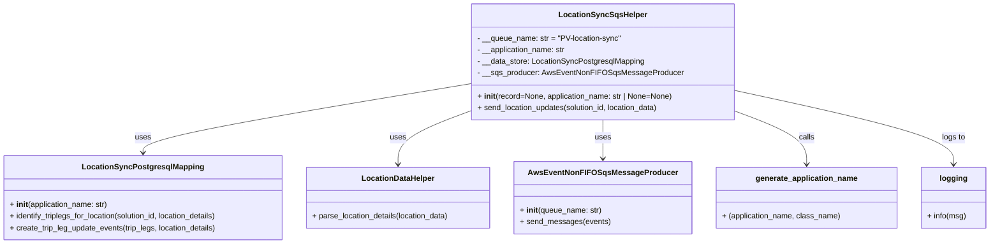
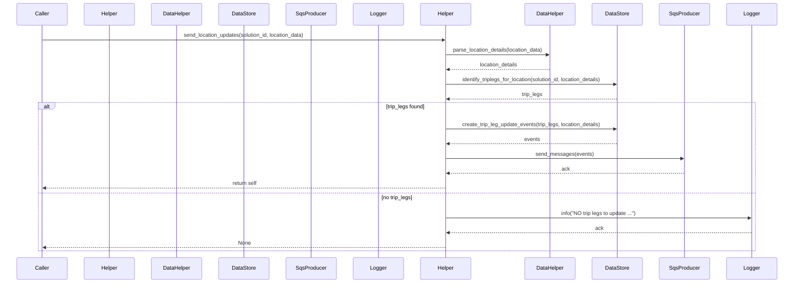

# Diagram: partview_core/partview_service/partview_service/core/helpers/location_sync_helper.py

> Auto-generated by Obscura crawlers

## Diagram 1

### SVG

<svg id="container" width="2037.625" xmlns="http://www.w3.org/2000/svg" class="classDiagram" height="504" viewBox="0 0 2037.625 504" role="graphics-document document" aria-roledescription="class"><g><defs><marker id="container_class-aggregationStart" class="marker aggregation class" refX="18" refY="7" markerWidth="190" markerHeight="240" orient="auto"><path d="M 18,7 L9,13 L1,7 L9,1 Z"></path></marker></defs><defs><marker id="container_class-aggregationEnd" class="marker aggregation class" refX="1" refY="7" markerWidth="20" markerHeight="28" orient="auto"><path d="M 18,7 L9,13 L1,7 L9,1 Z"></path></marker></defs><defs><marker id="container_class-extensionStart" class="marker extension class" refX="18" refY="7" markerWidth="190" markerHeight="240" orient="auto"><path d="M 1,7 L18,13 V 1 Z"></path></marker></defs><defs><marker id="container_class-extensionEnd" class="marker extension class" refX="1" refY="7" markerWidth="20" markerHeight="28" orient="auto"><path d="M 1,1 V 13 L18,7 Z"></path></marker></defs><defs><marker id="container_class-compositionStart" class="marker composition class" refX="18" refY="7" markerWidth="190" markerHeight="240" orient="auto"><path d="M 18,7 L9,13 L1,7 L9,1 Z"></path></marker></defs><defs><marker id="container_class-compositionEnd" class="marker composition class" refX="1" refY="7" markerWidth="20" markerHeight="28" orient="auto"><path d="M 18,7 L9,13 L1,7 L9,1 Z"></path></marker></defs><defs><marker id="container_class-dependencyStart" class="marker dependency class" refX="6" refY="7" markerWidth="190" markerHeight="240" orient="auto"><path d="M 5,7 L9,13 L1,7 L9,1 Z"></path></marker></defs><defs><marker id="container_class-dependencyEnd" class="marker dependency class" refX="13" refY="7" markerWidth="20" markerHeight="28" orient="auto"><path d="M 18,7 L9,13 L14,7 L9,1 Z"></path></marker></defs><defs><marker id="container_class-lollipopStart" class="marker lollipop class" refX="13" refY="7" markerWidth="190" markerHeight="240" orient="auto"><circle stroke="black" fill="transparent" cx="7" cy="7" r="6"></circle></marker></defs><defs><marker id="container_class-lollipopEnd" class="marker lollipop class" refX="1" refY="7" markerWidth="190" markerHeight="240" orient="auto"><circle stroke="black" fill="transparent" cx="7" cy="7" r="6"></circle></marker></defs><g class="root"><g class="clusters"></g><g class="edgePaths"><path d="M989.188,171.305L874.394,190.254C759.6,209.203,530.013,247.102,415.219,271.217C300.426,295.333,300.426,305.667,300.426,310.833L300.426,316" id="id_LocationSyncSqsHelper_LocationSyncPostgresqlMapping_1" class="edge-thickness-normal edge-pattern-solid relation" style=";;;" data-edge="true" data-et="edge" data-id="id_LocationSyncSqsHelper_LocationSyncPostgresqlMapping_1" data-points="W3sieCI6OTg5LjE4NzUsInkiOjE3MS4zMDQ4OTcyODE5MzQ2fSx7IngiOjMwMC40MjU3ODEyNSwieSI6Mjg1fSx7IngiOjMwMC40MjU3ODEyNSwieSI6MzIyfV0=" marker-end="url(#container_class-dependencyEnd)"></path><path d="M989.188,226.806L963.436,236.505C937.684,246.204,886.18,265.602,860.428,284.468C834.676,303.333,834.676,321.667,834.676,330.833L834.676,340" id="id_LocationSyncSqsHelper_LocationDataHelper_2" class="edge-thickness-normal edge-pattern-solid relation" style=";;;" data-edge="true" data-et="edge" data-id="id_LocationSyncSqsHelper_LocationDataHelper_2" data-points="W3sieCI6OTg5LjE4NzUsInkiOjIyNi44MDU4MDgwNDc2Nzg4NX0seyJ4Ijo4MzQuNjc1NzgxMjUsInkiOjI4NX0seyJ4Ijo4MzQuNjc1NzgxMjUsInkiOjM0Nn1d" marker-end="url(#container_class-dependencyEnd)"></path><path d="M1251.527,248L1251.527,254.167C1251.527,260.333,1251.527,272.667,1251.527,286C1251.527,299.333,1251.527,313.667,1251.527,320.833L1251.527,328" id="id_LocationSyncSqsHelper_AwsEventNonFIFOSqsMessageProducer_3" class="edge-thickness-normal edge-pattern-solid relation" style=";;;" data-edge="true" data-et="edge" data-id="id_LocationSyncSqsHelper_AwsEventNonFIFOSqsMessageProducer_3" data-points="W3sieCI6MTI1MS41MjczNDM3NSwieSI6MjQ4fSx7IngiOjEyNTEuNTI3MzQzNzUsInkiOjI4NX0seyJ4IjoxMjUxLjUyNzM0Mzc1LCJ5IjozMzR9XQ==" marker-end="url(#container_class-dependencyEnd)"></path><path d="M1513.867,228.275L1538.601,237.73C1563.335,247.184,1612.802,266.092,1637.536,284.713C1662.27,303.333,1662.27,321.667,1662.27,330.833L1662.27,340" id="id_LocationSyncSqsHelper_generate_application_name_4" class="edge-thickness-normal edge-pattern-solid relation" style=";;;" data-edge="true" data-et="edge" data-id="id_LocationSyncSqsHelper_generate_application_name_4" data-points="W3sieCI6MTUxMy44NjcxODc1LCJ5IjoyMjguMjc1NDQ0NjAyOTQ4MTd9LHsieCI6MTY2Mi4yNjk1MzEyNSwieSI6Mjg1fSx7IngiOjE2NjIuMjY5NTMxMjUsInkiOjM0Nn1d" marker-end="url(#container_class-dependencyEnd)"></path><path d="M1513.867,185.825L1588.857,202.354C1663.846,218.883,1813.826,251.942,1888.815,277.637C1963.805,303.333,1963.805,321.667,1963.805,330.833L1963.805,340" id="id_LocationSyncSqsHelper_logging_5" class="edge-thickness-normal edge-pattern-solid relation" style=";;;" data-edge="true" data-et="edge" data-id="id_LocationSyncSqsHelper_logging_5" data-points="W3sieCI6MTUxMy44NjcxODc1LCJ5IjoxODUuODI0ODg0OTY5NTM1NDV9LHsieCI6MTk2My44MDQ2ODc1LCJ5IjoyODV9LHsieCI6MTk2My44MDQ2ODc1LCJ5IjozNDZ9XQ==" marker-end="url(#container_class-dependencyEnd)"></path></g><g class="edgeLabels"><g class="edgeLabel" transform="translate(300.42578125, 285)"><g class="label" data-id="id_LocationSyncSqsHelper_LocationSyncPostgresqlMapping_1" transform="translate(-16.4921875, -12)"><foreignObject width="32.984375" height="24">

uses

</foreignObject></g></g><g class="edgeLabel" transform="translate(834.67578125, 285)"><g class="label" data-id="id_LocationSyncSqsHelper_LocationDataHelper_2" transform="translate(-16.4921875, -12)"><foreignObject width="32.984375" height="24">

uses

</foreignObject></g></g><g class="edgeLabel" transform="translate(1251.52734375, 285)"><g class="label" data-id="id_LocationSyncSqsHelper_AwsEventNonFIFOSqsMessageProducer_3" transform="translate(-16.4921875, -12)"><foreignObject width="32.984375" height="24">

uses

</foreignObject></g></g><g class="edgeLabel" transform="translate(1662.26953125, 285)"><g class="label" data-id="id_LocationSyncSqsHelper_generate_application_name_4" transform="translate(-16.4453125, -12)"><foreignObject width="32.890625" height="24">

calls

</foreignObject></g></g><g class="edgeLabel" transform="translate(1963.8046875, 285)"><g class="label" data-id="id_LocationSyncSqsHelper_logging_5" transform="translate(-24.3828125, -12)"><foreignObject width="48.765625" height="24">

logs to

</foreignObject></g></g></g><g class="nodes"><g class="node default" id="classId-LocationSyncSqsHelper-0" transform="translate(1251.52734375, 128)"><g class="basic label-container"><path d="M-262.33984375 -120 L262.33984375 -120 L262.33984375 120 L-262.33984375 120" stroke="none" stroke-width="0" fill="#ECECFF" style=""></path><path d="M-262.33984375 -120 C-58.37803303989068 -120, 145.58377767021864 -120, 262.33984375 -120 M-262.33984375 -120 C-149.08249225724722 -120, -35.82514076449448 -120, 262.33984375 -120 M262.33984375 -120 C262.33984375 -70.7478215747825, 262.33984375 -21.495643149564998, 262.33984375 120 M262.33984375 -120 C262.33984375 -69.88053056672882, 262.33984375 -19.761061133457645, 262.33984375 120 M262.33984375 120 C71.36917471719138 120, -119.60149431561723 120, -262.33984375 120 M262.33984375 120 C98.72828987466528 120, -64.88326400066944 120, -262.33984375 120 M-262.33984375 120 C-262.33984375 36.318154665445206, -262.33984375 -47.36369066910959, -262.33984375 -120 M-262.33984375 120 C-262.33984375 46.82561279946631, -262.33984375 -26.348774401067374, -262.33984375 -120" stroke="#9370DB" stroke-width="1.3" fill="none" stroke-dasharray="0 0" style=""></path></g><g class="annotation-group text" transform="translate(0, -96)"></g><g class="label-group text" transform="translate(-86.1953125, -96)"><g class="label" style="font-weight: bolder" transform="translate(0,-12)"><foreignObject width="172.390625" height="24">

LocationSyncSqsHelper

</foreignObject></g></g><g class="members-group text" transform="translate(-250.33984375, -48)"><g class="label" style="" transform="translate(0,-12)"><foreignObject width="299.375" height="24">

- __queue_name: str = "PV-location-sync"

</foreignObject></g><g class="label" style="" transform="translate(0,12)"><foreignObject width="185.296875" height="24">

- __application_name: str

</foreignObject></g><g class="label" style="" transform="translate(0,36)"><foreignObject width="346.234375" height="24">

- __data_store: LocationSyncPostgresqlMapping

</foreignObject></g><g class="label" style="" transform="translate(0,60)"><foreignObject width="414.484375" height="24">

- __sqs_producer: AwsEventNonFIFOSqsMessageProducer

</foreignObject></g></g><g class="methods-group text" transform="translate(-250.33984375, 72)"><g class="label" style="" transform="translate(0,-12)"><foreignObject width="405.796875" height="24">

+ <strong>init</strong>(record=None, application_name: str | None=None)

</foreignObject></g><g class="label" style="" transform="translate(0,12)"><foreignObject width="381.953125" height="24">

+ send_location_updates(solution_id, location_data)

</foreignObject></g></g><g class="divider" style=""><path d="M-262.33984375 -72 C-69.40787058442925 -72, 123.5241025811415 -72, 262.33984375 -72 M-262.33984375 -72 C-76.86150970963146 -72, 108.61682433073707 -72, 262.33984375 -72" stroke="#9370DB" stroke-width="1.3" fill="none" stroke-dasharray="0 0" style=""></path></g><g class="divider" style=""><path d="M-262.33984375 48 C-83.29816629581708 48, 95.74351115836583 48, 262.33984375 48 M-262.33984375 48 C-81.91180001348317 48, 98.51624372303365 48, 262.33984375 48" stroke="#9370DB" stroke-width="1.3" fill="none" stroke-dasharray="0 0" style=""></path></g></g><g class="node default" id="classId-LocationSyncPostgresqlMapping-1" transform="translate(300.42578125, 409)"><g class="basic label-container"><path d="M-292.42578125 -87 L292.42578125 -87 L292.42578125 87 L-292.42578125 87" stroke="none" stroke-width="0" fill="#ECECFF" style=""></path><path d="M-292.42578125 -87 C-142.8563854527393 -87, 6.713010344521422 -87, 292.42578125 -87 M-292.42578125 -87 C-65.33077609184727 -87, 161.76422906630546 -87, 292.42578125 -87 M292.42578125 -87 C292.42578125 -35.78891631897924, 292.42578125 15.42216736204152, 292.42578125 87 M292.42578125 -87 C292.42578125 -30.419406179696125, 292.42578125 26.16118764060775, 292.42578125 87 M292.42578125 87 C160.96465089623447 87, 29.503520542468948 87, -292.42578125 87 M292.42578125 87 C132.4392057822695 87, -27.54736968546098 87, -292.42578125 87 M-292.42578125 87 C-292.42578125 32.009505466243034, -292.42578125 -22.98098906751393, -292.42578125 -87 M-292.42578125 87 C-292.42578125 32.82596859078085, -292.42578125 -21.348062818438294, -292.42578125 -87" stroke="#9370DB" stroke-width="1.3" fill="none" stroke-dasharray="0 0" style=""></path></g><g class="annotation-group text" transform="translate(0, -63)"></g><g class="label-group text" transform="translate(-118.8359375, -63)"><g class="label" style="font-weight: bolder" transform="translate(0,-12)"><foreignObject width="237.671875" height="24">

LocationSyncPostgresqlMapping

</foreignObject></g></g><g class="members-group text" transform="translate(-280.42578125, -15)"></g><g class="methods-group text" transform="translate(-280.42578125, 15)"><g class="label" style="" transform="translate(0,-12)"><foreignObject width="205.5" height="24">

+ <strong>init</strong>(application_name: str)

</foreignObject></g><g class="label" style="" transform="translate(0,12)"><foreignObject width="442.015625" height="24">

+ identify_triplegs_for_location(solution_id, location_details)

</foreignObject></g><g class="label" style="" transform="translate(0,36)"><foreignObject width="432.875" height="24">

+ create_trip_leg_update_events(trip_legs, location_details)

</foreignObject></g></g><g class="divider" style=""><path d="M-292.42578125 -39 C-115.65504619888637 -39, 61.115688852227265 -39, 292.42578125 -39 M-292.42578125 -39 C-161.30229426923574 -39, -30.17880728847149 -39, 292.42578125 -39" stroke="#9370DB" stroke-width="1.3" fill="none" stroke-dasharray="0 0" style=""></path></g><g class="divider" style=""><path d="M-292.42578125 -15 C-148.09987755284703 -15, -3.7739738556940665 -15, 292.42578125 -15 M-292.42578125 -15 C-123.97461688319524 -15, 44.47654748360952 -15, 292.42578125 -15" stroke="#9370DB" stroke-width="1.3" fill="none" stroke-dasharray="0 0" style=""></path></g></g><g class="node default" id="classId-LocationDataHelper-2" transform="translate(834.67578125, 409)"><g class="basic label-container"><path d="M-191.82421875 -63 L191.82421875 -63 L191.82421875 63 L-191.82421875 63" stroke="none" stroke-width="0" fill="#ECECFF" style=""></path><path d="M-191.82421875 -63 C-80.8351040428522 -63, 30.154010664295612 -63, 191.82421875 -63 M-191.82421875 -63 C-62.35496971792111 -63, 67.11427931415778 -63, 191.82421875 -63 M191.82421875 -63 C191.82421875 -36.3264372646388, 191.82421875 -9.652874529277597, 191.82421875 63 M191.82421875 -63 C191.82421875 -14.052536111008727, 191.82421875 34.894927777982545, 191.82421875 63 M191.82421875 63 C80.48572632675774 63, -30.852766096484515 63, -191.82421875 63 M191.82421875 63 C43.194387880577096 63, -105.43544298884581 63, -191.82421875 63 M-191.82421875 63 C-191.82421875 35.3717574714549, -191.82421875 7.743514942909798, -191.82421875 -63 M-191.82421875 63 C-191.82421875 17.8708737956279, -191.82421875 -27.258252408744198, -191.82421875 -63" stroke="#9370DB" stroke-width="1.3" fill="none" stroke-dasharray="0 0" style=""></path></g><g class="annotation-group text" transform="translate(0, -39)"></g><g class="label-group text" transform="translate(-72.7578125, -39)"><g class="label" style="font-weight: bolder" transform="translate(0,-12)"><foreignObject width="145.515625" height="24">

LocationDataHelper

</foreignObject></g></g><g class="members-group text" transform="translate(-179.82421875, 9)"></g><g class="methods-group text" transform="translate(-179.82421875, 39)"><g class="label" style="" transform="translate(0,-12)"><foreignObject width="286.890625" height="24">

+ parse_location_details(location_data)

</foreignObject></g></g><g class="divider" style=""><path d="M-191.82421875 -15 C-75.17010379743391 -15, 41.48401115513218 -15, 191.82421875 -15 M-191.82421875 -15 C-112.93537356176746 -15, -34.046528373534926 -15, 191.82421875 -15" stroke="#9370DB" stroke-width="1.3" fill="none" stroke-dasharray="0 0" style=""></path></g><g class="divider" style=""><path d="M-191.82421875 9 C-93.17660935278398 9, 5.4710000444320315 9, 191.82421875 9 M-191.82421875 9 C-110.02838521343786 9, -28.232551676875715 9, 191.82421875 9" stroke="#9370DB" stroke-width="1.3" fill="none" stroke-dasharray="0 0" style=""></path></g></g><g class="node default" id="classId-AwsEventNonFIFOSqsMessageProducer-3" transform="translate(1251.52734375, 409)"><g class="basic label-container"><path d="M-175.02734375 -75 L175.02734375 -75 L175.02734375 75 L-175.02734375 75" stroke="none" stroke-width="0" fill="#ECECFF" style=""></path><path d="M-175.02734375 -75 C-87.44084484827098 -75, 0.14565405345803129 -75, 175.02734375 -75 M-175.02734375 -75 C-56.153501989706925 -75, 62.72033977058615 -75, 175.02734375 -75 M175.02734375 -75 C175.02734375 -20.52486068595907, 175.02734375 33.95027862808186, 175.02734375 75 M175.02734375 -75 C175.02734375 -34.22052588986182, 175.02734375 6.558948220276363, 175.02734375 75 M175.02734375 75 C72.47985045471655 75, -30.06764284056689 75, -175.02734375 75 M175.02734375 75 C49.23435777729213 75, -76.55862819541574 75, -175.02734375 75 M-175.02734375 75 C-175.02734375 35.15759019051867, -175.02734375 -4.684819618962663, -175.02734375 -75 M-175.02734375 75 C-175.02734375 44.650882736978595, -175.02734375 14.30176547395719, -175.02734375 -75" stroke="#9370DB" stroke-width="1.3" fill="none" stroke-dasharray="0 0" style=""></path></g><g class="annotation-group text" transform="translate(0, -51)"></g><g class="label-group text" transform="translate(-142.3359375, -51)"><g class="label" style="font-weight: bolder" transform="translate(0,-12)"><foreignObject width="284.671875" height="24">

AwsEventNonFIFOSqsMessageProducer

</foreignObject></g></g><g class="members-group text" transform="translate(-163.02734375, -3)"></g><g class="methods-group text" transform="translate(-163.02734375, 27)"><g class="label" style="" transform="translate(0,-12)"><foreignObject width="168.703125" height="24">

+ <strong>init</strong>(queue_name: str)

</foreignObject></g><g class="label" style="" transform="translate(0,12)"><foreignObject width="183.71875" height="24">

+ send_messages(events)

</foreignObject></g></g><g class="divider" style=""><path d="M-175.02734375 -27 C-80.23867434626482 -27, 14.549995057470369 -27, 175.02734375 -27 M-175.02734375 -27 C-61.215648207720506 -27, 52.59604733455899 -27, 175.02734375 -27" stroke="#9370DB" stroke-width="1.3" fill="none" stroke-dasharray="0 0" style=""></path></g><g class="divider" style=""><path d="M-175.02734375 -3 C-90.00798822219919 -3, -4.988632694398376 -3, 175.02734375 -3 M-175.02734375 -3 C-100.61317128002702 -3, -26.198998810054036 -3, 175.02734375 -3" stroke="#9370DB" stroke-width="1.3" fill="none" stroke-dasharray="0 0" style=""></path></g></g><g class="node default" id="classId-generate_application_name-4" transform="translate(1662.26953125, 409)"><g class="basic label-container"><path d="M-185.71484375 -63 L185.71484375 -63 L185.71484375 63 L-185.71484375 63" stroke="none" stroke-width="0" fill="#ECECFF" style=""></path><path d="M-185.71484375 -63 C-69.21828111152307 -63, 47.27828152695386 -63, 185.71484375 -63 M-185.71484375 -63 C-99.35376813552507 -63, -12.992692521050145 -63, 185.71484375 -63 M185.71484375 -63 C185.71484375 -34.356311487400504, 185.71484375 -5.7126229748010005, 185.71484375 63 M185.71484375 -63 C185.71484375 -28.579635473323528, 185.71484375 5.840729053352945, 185.71484375 63 M185.71484375 63 C106.79883600005424 63, 27.882828250108474 63, -185.71484375 63 M185.71484375 63 C66.67092056002194 63, -52.37300262995612 63, -185.71484375 63 M-185.71484375 63 C-185.71484375 18.741437733886592, -185.71484375 -25.517124532226816, -185.71484375 -63 M-185.71484375 63 C-185.71484375 13.999290334035464, -185.71484375 -35.00141933192907, -185.71484375 -63" stroke="#9370DB" stroke-width="1.3" fill="none" stroke-dasharray="0 0" style=""></path></g><g class="annotation-group text" transform="translate(0, -39)"></g><g class="label-group text" transform="translate(-101.8671875, -39)"><g class="label" style="font-weight: bolder" transform="translate(0,-12)"><foreignObject width="203.734375" height="24">

generate_application_name

</foreignObject></g></g><g class="members-group text" transform="translate(-173.71484375, 9)"></g><g class="methods-group text" transform="translate(-173.71484375, 39)"><g class="label" style="" transform="translate(0,-12)"><foreignObject width="245.5625" height="24">

+ (application_name, class_name)

</foreignObject></g></g><g class="divider" style=""><path d="M-185.71484375 -15 C-62.412766803183246 -15, 60.88931014363351 -15, 185.71484375 -15 M-185.71484375 -15 C-46.302330313804305 -15, 93.11018312239139 -15, 185.71484375 -15" stroke="#9370DB" stroke-width="1.3" fill="none" stroke-dasharray="0 0" style=""></path></g><g class="divider" style=""><path d="M-185.71484375 9 C-81.12078162063374 9, 23.47328050873253 9, 185.71484375 9 M-185.71484375 9 C-98.64078862633659 9, -11.566733502673173 9, 185.71484375 9" stroke="#9370DB" stroke-width="1.3" fill="none" stroke-dasharray="0 0" style=""></path></g></g><g class="node default" id="classId-logging-5" transform="translate(1963.8046875, 409)"><g class="basic label-container"><path d="M-65.8203125 -63 L65.8203125 -63 L65.8203125 63 L-65.8203125 63" stroke="none" stroke-width="0" fill="#ECECFF" style=""></path><path d="M-65.8203125 -63 C-16.867186609678434 -63, 32.08593928064313 -63, 65.8203125 -63 M-65.8203125 -63 C-36.26741436846328 -63, -6.714516236926563 -63, 65.8203125 -63 M65.8203125 -63 C65.8203125 -21.15075896371058, 65.8203125 20.69848207257884, 65.8203125 63 M65.8203125 -63 C65.8203125 -20.323701739652904, 65.8203125 22.352596520694192, 65.8203125 63 M65.8203125 63 C20.621357100612947 63, -24.577598298774106 63, -65.8203125 63 M65.8203125 63 C16.130306974712816 63, -33.55969855057437 63, -65.8203125 63 M-65.8203125 63 C-65.8203125 31.70440752025848, -65.8203125 0.4088150405169628, -65.8203125 -63 M-65.8203125 63 C-65.8203125 37.6250779129135, -65.8203125 12.250155825826987, -65.8203125 -63" stroke="#9370DB" stroke-width="1.3" fill="none" stroke-dasharray="0 0" style=""></path></g><g class="annotation-group text" transform="translate(0, -39)"></g><g class="label-group text" transform="translate(-27.109375, -39)"><g class="label" style="font-weight: bolder" transform="translate(0,-12)"><foreignObject width="54.21875" height="24">

logging

</foreignObject></g></g><g class="members-group text" transform="translate(-53.8203125, 9)"></g><g class="methods-group text" transform="translate(-53.8203125, 39)"><g class="label" style="" transform="translate(0,-12)"><foreignObject width="80.53125" height="24">

+ info(msg)

</foreignObject></g></g><g class="divider" style=""><path d="M-65.8203125 -15 C-29.03341166408422 -15, 7.753489171831561 -15, 65.8203125 -15 M-65.8203125 -15 C-37.95418552693735 -15, -10.088058553874703 -15, 65.8203125 -15" stroke="#9370DB" stroke-width="1.3" fill="none" stroke-dasharray="0 0" style=""></path></g><g class="divider" style=""><path d="M-65.8203125 9 C-20.55080464062324 9, 24.718703218753518 9, 65.8203125 9 M-65.8203125 9 C-39.37208163278979 9, -12.92385076557958 9, 65.8203125 9" stroke="#9370DB" stroke-width="1.3" fill="none" stroke-dasharray="0 0" style=""></path></g></g></g></g></g></svg>

## Diagram 2

### SVG

<svg id="container" width="2395" xmlns="http://www.w3.org/2000/svg" height="895" viewBox="-50 -10 2395 895" role="graphics-document document" aria-roledescription="sequence"><g><rect x="2145" y="809" fill="#eaeaea" stroke="#666" width="150" height="65" name="Logger" rx="3" ry="3" class="actor actor-bottom"></rect><text x="2220" y="841.5" dominant-baseline="central" alignment-baseline="central" class="actor actor-box" style="text-anchor: middle; font-size: 16px; font-weight: 400;"><tspan x="2220" dy="0">Logger</tspan></text></g><g><rect x="1945" y="809" fill="#eaeaea" stroke="#666" width="150" height="65" name="SqsProducer" rx="3" ry="3" class="actor actor-bottom"></rect><text x="2020" y="841.5" dominant-baseline="central" alignment-baseline="central" class="actor actor-box" style="text-anchor: middle; font-size: 16px; font-weight: 400;"><tspan x="2020" dy="0">SqsProducer</tspan></text></g><g><rect x="1745" y="809" fill="#eaeaea" stroke="#666" width="150" height="65" name="DataStore" rx="3" ry="3" class="actor actor-bottom"></rect><text x="1820" y="841.5" dominant-baseline="central" alignment-baseline="central" class="actor actor-box" style="text-anchor: middle; font-size: 16px; font-weight: 400;"><tspan x="1820" dy="0">DataStore</tspan></text></g><g><rect x="1545" y="809" fill="#eaeaea" stroke="#666" width="150" height="65" name="DataHelper" rx="3" ry="3" class="actor actor-bottom"></rect><text x="1620" y="841.5" dominant-baseline="central" alignment-baseline="central" class="actor actor-box" style="text-anchor: middle; font-size: 16px; font-weight: 400;"><tspan x="1620" dy="0">DataHelper</tspan></text></g><g><rect x="1200" y="809" fill="#eaeaea" stroke="#666" width="150" height="65" name="Helper" rx="3" ry="3" class="actor actor-bottom"></rect><text x="1275" y="841.5" dominant-baseline="central" alignment-baseline="central" class="actor actor-box" style="text-anchor: middle; font-size: 16px; font-weight: 400;"><tspan x="1275" dy="0">Helper</tspan></text></g><g><rect x="1000" y="809" fill="#eaeaea" stroke="#666" width="150" height="65" name="logging" rx="3" ry="3" class="actor actor-bottom"></rect><text x="1075" y="841.5" dominant-baseline="central" alignment-baseline="central" class="actor actor-box" style="text-anchor: middle; font-size: 16px; font-weight: 400;"><tspan x="1075" dy="0">Logger</tspan></text></g><g><rect x="800" y="809" fill="#eaeaea" stroke="#666" width="150" height="65" name="AwsEventNonFIFOSqsMessageProducer" rx="3" ry="3" class="actor actor-bottom"></rect><text x="875" y="841.5" dominant-baseline="central" alignment-baseline="central" class="actor actor-box" style="text-anchor: middle; font-size: 16px; font-weight: 400;"><tspan x="875" dy="0">SqsProducer</tspan></text></g><g><rect x="600" y="809" fill="#eaeaea" stroke="#666" width="150" height="65" name="LocationSyncPostgresqlMapping" rx="3" ry="3" class="actor actor-bottom"></rect><text x="675" y="841.5" dominant-baseline="central" alignment-baseline="central" class="actor actor-box" style="text-anchor: middle; font-size: 16px; font-weight: 400;"><tspan x="675" dy="0">DataStore</tspan></text></g><g><rect x="400" y="809" fill="#eaeaea" stroke="#666" width="150" height="65" name="LocationDataHelper" rx="3" ry="3" class="actor actor-bottom"></rect><text x="475" y="841.5" dominant-baseline="central" alignment-baseline="central" class="actor actor-box" style="text-anchor: middle; font-size: 16px; font-weight: 400;"><tspan x="475" dy="0">DataHelper</tspan></text></g><g><rect x="200" y="809" fill="#eaeaea" stroke="#666" width="150" height="65" name="LocationSyncSqsHelper" rx="3" ry="3" class="actor actor-bottom"></rect><text x="275" y="841.5" dominant-baseline="central" alignment-baseline="central" class="actor actor-box" style="text-anchor: middle; font-size: 16px; font-weight: 400;"><tspan x="275" dy="0">Helper</tspan></text></g><g><rect x="0" y="809" fill="#eaeaea" stroke="#666" width="150" height="65" name="Caller" rx="3" ry="3" class="actor actor-bottom"></rect><text x="75" y="841.5" dominant-baseline="central" alignment-baseline="central" class="actor actor-box" style="text-anchor: middle; font-size: 16px; font-weight: 400;"><tspan x="75" dy="0">Caller</tspan></text></g><g><line id="actor10" x1="2220" y1="65" x2="2220" y2="809" class="actor-line 200" stroke-width="0.5px" stroke="#999" name="Logger"></line><g id="root-10"><rect x="2145" y="0" fill="#eaeaea" stroke="#666" width="150" height="65" name="Logger" rx="3" ry="3" class="actor actor-top"></rect><text x="2220" y="32.5" dominant-baseline="central" alignment-baseline="central" class="actor actor-box" style="text-anchor: middle; font-size: 16px; font-weight: 400;"><tspan x="2220" dy="0">Logger</tspan></text></g></g><g><line id="actor9" x1="2020" y1="65" x2="2020" y2="809" class="actor-line 200" stroke-width="0.5px" stroke="#999" name="SqsProducer"></line><g id="root-9"><rect x="1945" y="0" fill="#eaeaea" stroke="#666" width="150" height="65" name="SqsProducer" rx="3" ry="3" class="actor actor-top"></rect><text x="2020" y="32.5" dominant-baseline="central" alignment-baseline="central" class="actor actor-box" style="text-anchor: middle; font-size: 16px; font-weight: 400;"><tspan x="2020" dy="0">SqsProducer</tspan></text></g></g><g><line id="actor8" x1="1820" y1="65" x2="1820" y2="809" class="actor-line 200" stroke-width="0.5px" stroke="#999" name="DataStore"></line><g id="root-8"><rect x="1745" y="0" fill="#eaeaea" stroke="#666" width="150" height="65" name="DataStore" rx="3" ry="3" class="actor actor-top"></rect><text x="1820" y="32.5" dominant-baseline="central" alignment-baseline="central" class="actor actor-box" style="text-anchor: middle; font-size: 16px; font-weight: 400;"><tspan x="1820" dy="0">DataStore</tspan></text></g></g><g><line id="actor7" x1="1620" y1="65" x2="1620" y2="809" class="actor-line 200" stroke-width="0.5px" stroke="#999" name="DataHelper"></line><g id="root-7"><rect x="1545" y="0" fill="#eaeaea" stroke="#666" width="150" height="65" name="DataHelper" rx="3" ry="3" class="actor actor-top"></rect><text x="1620" y="32.5" dominant-baseline="central" alignment-baseline="central" class="actor actor-box" style="text-anchor: middle; font-size: 16px; font-weight: 400;"><tspan x="1620" dy="0">DataHelper</tspan></text></g></g><g><line id="actor6" x1="1275" y1="65" x2="1275" y2="809" class="actor-line 200" stroke-width="0.5px" stroke="#999" name="Helper"></line><g id="root-6"><rect x="1200" y="0" fill="#eaeaea" stroke="#666" width="150" height="65" name="Helper" rx="3" ry="3" class="actor actor-top"></rect><text x="1275" y="32.5" dominant-baseline="central" alignment-baseline="central" class="actor actor-box" style="text-anchor: middle; font-size: 16px; font-weight: 400;"><tspan x="1275" dy="0">Helper</tspan></text></g></g><g><line id="actor5" x1="1075" y1="65" x2="1075" y2="809" class="actor-line 200" stroke-width="0.5px" stroke="#999" name="logging"></line><g id="root-5"><rect x="1000" y="0" fill="#eaeaea" stroke="#666" width="150" height="65" name="logging" rx="3" ry="3" class="actor actor-top"></rect><text x="1075" y="32.5" dominant-baseline="central" alignment-baseline="central" class="actor actor-box" style="text-anchor: middle; font-size: 16px; font-weight: 400;"><tspan x="1075" dy="0">Logger</tspan></text></g></g><g><line id="actor4" x1="875" y1="65" x2="875" y2="809" class="actor-line 200" stroke-width="0.5px" stroke="#999" name="AwsEventNonFIFOSqsMessageProducer"></line><g id="root-4"><rect x="800" y="0" fill="#eaeaea" stroke="#666" width="150" height="65" name="AwsEventNonFIFOSqsMessageProducer" rx="3" ry="3" class="actor actor-top"></rect><text x="875" y="32.5" dominant-baseline="central" alignment-baseline="central" class="actor actor-box" style="text-anchor: middle; font-size: 16px; font-weight: 400;"><tspan x="875" dy="0">SqsProducer</tspan></text></g></g><g><line id="actor3" x1="675" y1="65" x2="675" y2="809" class="actor-line 200" stroke-width="0.5px" stroke="#999" name="LocationSyncPostgresqlMapping"></line><g id="root-3"><rect x="600" y="0" fill="#eaeaea" stroke="#666" width="150" height="65" name="LocationSyncPostgresqlMapping" rx="3" ry="3" class="actor actor-top"></rect><text x="675" y="32.5" dominant-baseline="central" alignment-baseline="central" class="actor actor-box" style="text-anchor: middle; font-size: 16px; font-weight: 400;"><tspan x="675" dy="0">DataStore</tspan></text></g></g><g><line id="actor2" x1="475" y1="65" x2="475" y2="809" class="actor-line 200" stroke-width="0.5px" stroke="#999" name="LocationDataHelper"></line><g id="root-2"><rect x="400" y="0" fill="#eaeaea" stroke="#666" width="150" height="65" name="LocationDataHelper" rx="3" ry="3" class="actor actor-top"></rect><text x="475" y="32.5" dominant-baseline="central" alignment-baseline="central" class="actor actor-box" style="text-anchor: middle; font-size: 16px; font-weight: 400;"><tspan x="475" dy="0">DataHelper</tspan></text></g></g><g><line id="actor1" x1="275" y1="65" x2="275" y2="809" class="actor-line 200" stroke-width="0.5px" stroke="#999" name="LocationSyncSqsHelper"></line><g id="root-1"><rect x="200" y="0" fill="#eaeaea" stroke="#666" width="150" height="65" name="LocationSyncSqsHelper" rx="3" ry="3" class="actor actor-top"></rect><text x="275" y="32.5" dominant-baseline="central" alignment-baseline="central" class="actor actor-box" style="text-anchor: middle; font-size: 16px; font-weight: 400;"><tspan x="275" dy="0">Helper</tspan></text></g></g><g><line id="actor0" x1="75" y1="65" x2="75" y2="809" class="actor-line 200" stroke-width="0.5px" stroke="#999" name="Caller"></line><g id="root-0"><rect x="0" y="0" fill="#eaeaea" stroke="#666" width="150" height="65" name="Caller" rx="3" ry="3" class="actor actor-top"></rect><text x="75" y="32.5" dominant-baseline="central" alignment-baseline="central" class="actor actor-box" style="text-anchor: middle; font-size: 16px; font-weight: 400;"><tspan x="75" dy="0">Caller</tspan></text></g></g><g></g><defs><symbol id="computer" width="24" height="24"><path transform="scale(.5)" d="M2 2v13h20v-13h-20zm18 11h-16v-9h16v9zm-10.228 6l.466-1h3.524l.467 1h-4.457zm14.228 3h-24l2-6h2.104l-1.33 4h18.45l-1.297-4h2.073l2 6zm-5-10h-14v-7h14v7z"></path></symbol></defs><defs><symbol id="database" fill-rule="evenodd" clip-rule="evenodd"><path transform="scale(.5)" d="M12.258.001l.256.004.255.005.253.008.251.01.249.012.247.015.246.016.242.019.241.02.239.023.236.024.233.027.231.028.229.031.225.032.223.034.22.036.217.038.214.04.211.041.208.043.205.045.201.046.198.048.194.05.191.051.187.053.183.054.18.056.175.057.172.059.168.06.163.061.16.063.155.064.15.066.074.033.073.033.071.034.07.034.069.035.068.035.067.035.066.035.064.036.064.036.062.036.06.036.06.037.058.037.058.037.055.038.055.038.053.038.052.038.051.039.05.039.048.039.047.039.045.04.044.04.043.04.041.04.04.041.039.041.037.041.036.041.034.041.033.042.032.042.03.042.029.042.027.042.026.043.024.043.023.043.021.043.02.043.018.044.017.043.015.044.013.044.012.044.011.045.009.044.007.045.006.045.004.045.002.045.001.045v17l-.001.045-.002.045-.004.045-.006.045-.007.045-.009.044-.011.045-.012.044-.013.044-.015.044-.017.043-.018.044-.02.043-.021.043-.023.043-.024.043-.026.043-.027.042-.029.042-.03.042-.032.042-.033.042-.034.041-.036.041-.037.041-.039.041-.04.041-.041.04-.043.04-.044.04-.045.04-.047.039-.048.039-.05.039-.051.039-.052.038-.053.038-.055.038-.055.038-.058.037-.058.037-.06.037-.06.036-.062.036-.064.036-.064.036-.066.035-.067.035-.068.035-.069.035-.07.034-.071.034-.073.033-.074.033-.15.066-.155.064-.16.063-.163.061-.168.06-.172.059-.175.057-.18.056-.183.054-.187.053-.191.051-.194.05-.198.048-.201.046-.205.045-.208.043-.211.041-.214.04-.217.038-.22.036-.223.034-.225.032-.229.031-.231.028-.233.027-.236.024-.239.023-.241.02-.242.019-.246.016-.247.015-.249.012-.251.01-.253.008-.255.005-.256.004-.258.001-.258-.001-.256-.004-.255-.005-.253-.008-.251-.01-.249-.012-.247-.015-.245-.016-.243-.019-.241-.02-.238-.023-.236-.024-.234-.027-.231-.028-.228-.031-.226-.032-.223-.034-.22-.036-.217-.038-.214-.04-.211-.041-.208-.043-.204-.045-.201-.046-.198-.048-.195-.05-.19-.051-.187-.053-.184-.054-.179-.056-.176-.057-.172-.059-.167-.06-.164-.061-.159-.063-.155-.064-.151-.066-.074-.033-.072-.033-.072-.034-.07-.034-.069-.035-.068-.035-.067-.035-.066-.035-.064-.036-.063-.036-.062-.036-.061-.036-.06-.037-.058-.037-.057-.037-.056-.038-.055-.038-.053-.038-.052-.038-.051-.039-.049-.039-.049-.039-.046-.039-.046-.04-.044-.04-.043-.04-.041-.04-.04-.041-.039-.041-.037-.041-.036-.041-.034-.041-.033-.042-.032-.042-.03-.042-.029-.042-.027-.042-.026-.043-.024-.043-.023-.043-.021-.043-.02-.043-.018-.044-.017-.043-.015-.044-.013-.044-.012-.044-.011-.045-.009-.044-.007-.045-.006-.045-.004-.045-.002-.045-.001-.045v-17l.001-.045.002-.045.004-.045.006-.045.007-.045.009-.044.011-.045.012-.044.013-.044.015-.044.017-.043.018-.044.02-.043.021-.043.023-.043.024-.043.026-.043.027-.042.029-.042.03-.042.032-.042.033-.042.034-.041.036-.041.037-.041.039-.041.04-.041.041-.04.043-.04.044-.04.046-.04.046-.039.049-.039.049-.039.051-.039.052-.038.053-.038.055-.038.056-.038.057-.037.058-.037.06-.037.061-.036.062-.036.063-.036.064-.036.066-.035.067-.035.068-.035.069-.035.07-.034.072-.034.072-.033.074-.033.151-.066.155-.064.159-.063.164-.061.167-.06.172-.059.176-.057.179-.056.184-.054.187-.053.19-.051.195-.05.198-.048.201-.046.204-.045.208-.043.211-.041.214-.04.217-.038.22-.036.223-.034.226-.032.228-.031.231-.028.234-.027.236-.024.238-.023.241-.02.243-.019.245-.016.247-.015.249-.012.251-.01.253-.008.255-.005.256-.004.258-.001.258.001zm-9.258 20.499v.01l.001.021.003.021.004.022.005.021.006.022.007.022.009.023.01.022.011.023.012.023.013.023.015.023.016.024.017.023.018.024.019.024.021.024.022.025.023.024.024.025.052.049.056.05.061.051.066.051.07.051.075.051.079.052.084.052.088.052.092.052.097.052.102.051.105.052.11.052.114.051.119.051.123.051.127.05.131.05.135.05.139.048.144.049.147.047.152.047.155.047.16.045.163.045.167.043.171.043.176.041.178.041.183.039.187.039.19.037.194.035.197.035.202.033.204.031.209.03.212.029.216.027.219.025.222.024.226.021.23.02.233.018.236.016.24.015.243.012.246.01.249.008.253.005.256.004.259.001.26-.001.257-.004.254-.005.25-.008.247-.011.244-.012.241-.014.237-.016.233-.018.231-.021.226-.021.224-.024.22-.026.216-.027.212-.028.21-.031.205-.031.202-.034.198-.034.194-.036.191-.037.187-.039.183-.04.179-.04.175-.042.172-.043.168-.044.163-.045.16-.046.155-.046.152-.047.148-.048.143-.049.139-.049.136-.05.131-.05.126-.05.123-.051.118-.052.114-.051.11-.052.106-.052.101-.052.096-.052.092-.052.088-.053.083-.051.079-.052.074-.052.07-.051.065-.051.06-.051.056-.05.051-.05.023-.024.023-.025.021-.024.02-.024.019-.024.018-.024.017-.024.015-.023.014-.024.013-.023.012-.023.01-.023.01-.022.008-.022.006-.022.006-.022.004-.022.004-.021.001-.021.001-.021v-4.127l-.077.055-.08.053-.083.054-.085.053-.087.052-.09.052-.093.051-.095.05-.097.05-.1.049-.102.049-.105.048-.106.047-.109.047-.111.046-.114.045-.115.045-.118.044-.12.043-.122.042-.124.042-.126.041-.128.04-.13.04-.132.038-.134.038-.135.037-.138.037-.139.035-.142.035-.143.034-.144.033-.147.032-.148.031-.15.03-.151.03-.153.029-.154.027-.156.027-.158.026-.159.025-.161.024-.162.023-.163.022-.165.021-.166.02-.167.019-.169.018-.169.017-.171.016-.173.015-.173.014-.175.013-.175.012-.177.011-.178.01-.179.008-.179.008-.181.006-.182.005-.182.004-.184.003-.184.002h-.37l-.184-.002-.184-.003-.182-.004-.182-.005-.181-.006-.179-.008-.179-.008-.178-.01-.176-.011-.176-.012-.175-.013-.173-.014-.172-.015-.171-.016-.17-.017-.169-.018-.167-.019-.166-.02-.165-.021-.163-.022-.162-.023-.161-.024-.159-.025-.157-.026-.156-.027-.155-.027-.153-.029-.151-.03-.15-.03-.148-.031-.146-.032-.145-.033-.143-.034-.141-.035-.14-.035-.137-.037-.136-.037-.134-.038-.132-.038-.13-.04-.128-.04-.126-.041-.124-.042-.122-.042-.12-.044-.117-.043-.116-.045-.113-.045-.112-.046-.109-.047-.106-.047-.105-.048-.102-.049-.1-.049-.097-.05-.095-.05-.093-.052-.09-.051-.087-.052-.085-.053-.083-.054-.08-.054-.077-.054v4.127zm0-5.654v.011l.001.021.003.021.004.021.005.022.006.022.007.022.009.022.01.022.011.023.012.023.013.023.015.024.016.023.017.024.018.024.019.024.021.024.022.024.023.025.024.024.052.05.056.05.061.05.066.051.07.051.075.052.079.051.084.052.088.052.092.052.097.052.102.052.105.052.11.051.114.051.119.052.123.05.127.051.131.05.135.049.139.049.144.048.147.048.152.047.155.046.16.045.163.045.167.044.171.042.176.042.178.04.183.04.187.038.19.037.194.036.197.034.202.033.204.032.209.03.212.028.216.027.219.025.222.024.226.022.23.02.233.018.236.016.24.014.243.012.246.01.249.008.253.006.256.003.259.001.26-.001.257-.003.254-.006.25-.008.247-.01.244-.012.241-.015.237-.016.233-.018.231-.02.226-.022.224-.024.22-.025.216-.027.212-.029.21-.03.205-.032.202-.033.198-.035.194-.036.191-.037.187-.039.183-.039.179-.041.175-.042.172-.043.168-.044.163-.045.16-.045.155-.047.152-.047.148-.048.143-.048.139-.05.136-.049.131-.05.126-.051.123-.051.118-.051.114-.052.11-.052.106-.052.101-.052.096-.052.092-.052.088-.052.083-.052.079-.052.074-.051.07-.052.065-.051.06-.05.056-.051.051-.049.023-.025.023-.024.021-.025.02-.024.019-.024.018-.024.017-.024.015-.023.014-.023.013-.024.012-.022.01-.023.01-.023.008-.022.006-.022.006-.022.004-.021.004-.022.001-.021.001-.021v-4.139l-.077.054-.08.054-.083.054-.085.052-.087.053-.09.051-.093.051-.095.051-.097.05-.1.049-.102.049-.105.048-.106.047-.109.047-.111.046-.114.045-.115.044-.118.044-.12.044-.122.042-.124.042-.126.041-.128.04-.13.039-.132.039-.134.038-.135.037-.138.036-.139.036-.142.035-.143.033-.144.033-.147.033-.148.031-.15.03-.151.03-.153.028-.154.028-.156.027-.158.026-.159.025-.161.024-.162.023-.163.022-.165.021-.166.02-.167.019-.169.018-.169.017-.171.016-.173.015-.173.014-.175.013-.175.012-.177.011-.178.009-.179.009-.179.007-.181.007-.182.005-.182.004-.184.003-.184.002h-.37l-.184-.002-.184-.003-.182-.004-.182-.005-.181-.007-.179-.007-.179-.009-.178-.009-.176-.011-.176-.012-.175-.013-.173-.014-.172-.015-.171-.016-.17-.017-.169-.018-.167-.019-.166-.02-.165-.021-.163-.022-.162-.023-.161-.024-.159-.025-.157-.026-.156-.027-.155-.028-.153-.028-.151-.03-.15-.03-.148-.031-.146-.033-.145-.033-.143-.033-.141-.035-.14-.036-.137-.036-.136-.037-.134-.038-.132-.039-.13-.039-.128-.04-.126-.041-.124-.042-.122-.043-.12-.043-.117-.044-.116-.044-.113-.046-.112-.046-.109-.046-.106-.047-.105-.048-.102-.049-.1-.049-.097-.05-.095-.051-.093-.051-.09-.051-.087-.053-.085-.052-.083-.054-.08-.054-.077-.054v4.139zm0-5.666v.011l.001.02.003.022.004.021.005.022.006.021.007.022.009.023.01.022.011.023.012.023.013.023.015.023.016.024.017.024.018.023.019.024.021.025.022.024.023.024.024.025.052.05.056.05.061.05.066.051.07.051.075.052.079.051.084.052.088.052.092.052.097.052.102.052.105.051.11.052.114.051.119.051.123.051.127.05.131.05.135.05.139.049.144.048.147.048.152.047.155.046.16.045.163.045.167.043.171.043.176.042.178.04.183.04.187.038.19.037.194.036.197.034.202.033.204.032.209.03.212.028.216.027.219.025.222.024.226.021.23.02.233.018.236.017.24.014.243.012.246.01.249.008.253.006.256.003.259.001.26-.001.257-.003.254-.006.25-.008.247-.01.244-.013.241-.014.237-.016.233-.018.231-.02.226-.022.224-.024.22-.025.216-.027.212-.029.21-.03.205-.032.202-.033.198-.035.194-.036.191-.037.187-.039.183-.039.179-.041.175-.042.172-.043.168-.044.163-.045.16-.045.155-.047.152-.047.148-.048.143-.049.139-.049.136-.049.131-.051.126-.05.123-.051.118-.052.114-.051.11-.052.106-.052.101-.052.096-.052.092-.052.088-.052.083-.052.079-.052.074-.052.07-.051.065-.051.06-.051.056-.05.051-.049.023-.025.023-.025.021-.024.02-.024.019-.024.018-.024.017-.024.015-.023.014-.024.013-.023.012-.023.01-.022.01-.023.008-.022.006-.022.006-.022.004-.022.004-.021.001-.021.001-.021v-4.153l-.077.054-.08.054-.083.053-.085.053-.087.053-.09.051-.093.051-.095.051-.097.05-.1.049-.102.048-.105.048-.106.048-.109.046-.111.046-.114.046-.115.044-.118.044-.12.043-.122.043-.124.042-.126.041-.128.04-.13.039-.132.039-.134.038-.135.037-.138.036-.139.036-.142.034-.143.034-.144.033-.147.032-.148.032-.15.03-.151.03-.153.028-.154.028-.156.027-.158.026-.159.024-.161.024-.162.023-.163.023-.165.021-.166.02-.167.019-.169.018-.169.017-.171.016-.173.015-.173.014-.175.013-.175.012-.177.01-.178.01-.179.009-.179.007-.181.006-.182.006-.182.004-.184.003-.184.001-.185.001-.185-.001-.184-.001-.184-.003-.182-.004-.182-.006-.181-.006-.179-.007-.179-.009-.178-.01-.176-.01-.176-.012-.175-.013-.173-.014-.172-.015-.171-.016-.17-.017-.169-.018-.167-.019-.166-.02-.165-.021-.163-.023-.162-.023-.161-.024-.159-.024-.157-.026-.156-.027-.155-.028-.153-.028-.151-.03-.15-.03-.148-.032-.146-.032-.145-.033-.143-.034-.141-.034-.14-.036-.137-.036-.136-.037-.134-.038-.132-.039-.13-.039-.128-.041-.126-.041-.124-.041-.122-.043-.12-.043-.117-.044-.116-.044-.113-.046-.112-.046-.109-.046-.106-.048-.105-.048-.102-.048-.1-.05-.097-.049-.095-.051-.093-.051-.09-.052-.087-.052-.085-.053-.083-.053-.08-.054-.077-.054v4.153zm8.74-8.179l-.257.004-.254.005-.25.008-.247.011-.244.012-.241.014-.237.016-.233.018-.231.021-.226.022-.224.023-.22.026-.216.027-.212.028-.21.031-.205.032-.202.033-.198.034-.194.036-.191.038-.187.038-.183.04-.179.041-.175.042-.172.043-.168.043-.163.045-.16.046-.155.046-.152.048-.148.048-.143.048-.139.049-.136.05-.131.05-.126.051-.123.051-.118.051-.114.052-.11.052-.106.052-.101.052-.096.052-.092.052-.088.052-.083.052-.079.052-.074.051-.07.052-.065.051-.06.05-.056.05-.051.05-.023.025-.023.024-.021.024-.02.025-.019.024-.018.024-.017.023-.015.024-.014.023-.013.023-.012.023-.01.023-.01.022-.008.022-.006.023-.006.021-.004.022-.004.021-.001.021-.001.021.001.021.001.021.004.021.004.022.006.021.006.023.008.022.01.022.01.023.012.023.013.023.014.023.015.024.017.023.018.024.019.024.02.025.021.024.023.024.023.025.051.05.056.05.06.05.065.051.07.052.074.051.079.052.083.052.088.052.092.052.096.052.101.052.106.052.11.052.114.052.118.051.123.051.126.051.131.05.136.05.139.049.143.048.148.048.152.048.155.046.16.046.163.045.168.043.172.043.175.042.179.041.183.04.187.038.191.038.194.036.198.034.202.033.205.032.21.031.212.028.216.027.22.026.224.023.226.022.231.021.233.018.237.016.241.014.244.012.247.011.25.008.254.005.257.004.26.001.26-.001.257-.004.254-.005.25-.008.247-.011.244-.012.241-.014.237-.016.233-.018.231-.021.226-.022.224-.023.22-.026.216-.027.212-.028.21-.031.205-.032.202-.033.198-.034.194-.036.191-.038.187-.038.183-.04.179-.041.175-.042.172-.043.168-.043.163-.045.16-.046.155-.046.152-.048.148-.048.143-.048.139-.049.136-.05.131-.05.126-.051.123-.051.118-.051.114-.052.11-.052.106-.052.101-.052.096-.052.092-.052.088-.052.083-.052.079-.052.074-.051.07-.052.065-.051.06-.05.056-.05.051-.05.023-.025.023-.024.021-.024.02-.025.019-.024.018-.024.017-.023.015-.024.014-.023.013-.023.012-.023.01-.023.01-.022.008-.022.006-.023.006-.021.004-.022.004-.021.001-.021.001-.021-.001-.021-.001-.021-.004-.021-.004-.022-.006-.021-.006-.023-.008-.022-.01-.022-.01-.023-.012-.023-.013-.023-.014-.023-.015-.024-.017-.023-.018-.024-.019-.024-.02-.025-.021-.024-.023-.024-.023-.025-.051-.05-.056-.05-.06-.05-.065-.051-.07-.052-.074-.051-.079-.052-.083-.052-.088-.052-.092-.052-.096-.052-.101-.052-.106-.052-.11-.052-.114-.052-.118-.051-.123-.051-.126-.051-.131-.05-.136-.05-.139-.049-.143-.048-.148-.048-.152-.048-.155-.046-.16-.046-.163-.045-.168-.043-.172-.043-.175-.042-.179-.041-.183-.04-.187-.038-.191-.038-.194-.036-.198-.034-.202-.033-.205-.032-.21-.031-.212-.028-.216-.027-.22-.026-.224-.023-.226-.022-.231-.021-.233-.018-.237-.016-.241-.014-.244-.012-.247-.011-.25-.008-.254-.005-.257-.004-.26-.001-.26.001z"></path></symbol></defs><defs><symbol id="clock" width="24" height="24"><path transform="scale(.5)" d="M12 2c5.514 0 10 4.486 10 10s-4.486 10-10 10-10-4.486-10-10 4.486-10 10-10zm0-2c-6.627 0-12 5.373-12 12s5.373 12 12 12 12-5.373 12-12-5.373-12-12-12zm5.848 12.459c.202.038.202.333.001.372-1.907.361-6.045 1.111-6.547 1.111-.719 0-1.301-.582-1.301-1.301 0-.512.77-5.447 1.125-7.445.034-.192.312-.181.343.014l.985 6.238 5.394 1.011z"></path></symbol></defs><defs><marker id="arrowhead" refX="7.9" refY="5" markerUnits="userSpaceOnUse" markerWidth="12" markerHeight="12" orient="auto-start-reverse"><path d="M -1 0 L 10 5 L 0 10 z"></path></marker></defs><defs><marker id="crosshead" markerWidth="15" markerHeight="8" orient="auto" refX="4" refY="4.5"><path fill="none" stroke="#000000" stroke-width="1pt" d="M 1,2 L 6,7 M 6,2 L 1,7" style="stroke-dasharray: 0, 0;"></path></marker></defs><defs><marker id="filled-head" refX="15.5" refY="7" markerWidth="20" markerHeight="28" orient="auto"><path d="M 18,7 L9,13 L14,7 L9,1 Z"></path></marker></defs><defs><marker id="sequencenumber" refX="15" refY="15" markerWidth="60" markerHeight="40" orient="auto"><circle cx="15" cy="15" r="6"></circle></marker></defs><g><line x1="64" y1="315" x2="2231" y2="315" class="loopLine"></line><line x1="2231" y1="315" x2="2231" y2="789" class="loopLine"></line><line x1="64" y1="789" x2="2231" y2="789" class="loopLine"></line><line x1="64" y1="315" x2="64" y2="789" class="loopLine"></line><line x1="64" y1="605" x2="2231" y2="605" class="loopLine" style="stroke-dasharray: 3, 3;"></line><polygon points="64,315 114,315 114,328 105.6,335 64,335" class="labelBox"></polygon><text x="89" y="328" text-anchor="middle" dominant-baseline="middle" alignment-baseline="middle" class="labelText" style="font-size: 16px; font-weight: 400;">alt</text><text x="1172.5" y="333" text-anchor="middle" class="loopText" style="font-size: 16px; font-weight: 400;"><tspan x="1172.5">[trip_legs found]</tspan></text><text x="1147.5" y="623" text-anchor="middle" class="loopText" style="font-size: 16px; font-weight: 400;">[no trip_legs]</text></g><text x="674" y="80" text-anchor="middle" dominant-baseline="middle" alignment-baseline="middle" class="messageText" dy="1em" style="font-size: 16px; font-weight: 400;">send_location_updates(solution_id, location_data)</text><line x1="76" y1="113" x2="1271" y2="113" class="messageLine0" stroke-width="2" stroke="none" marker-end="url(#arrowhead)" style="fill: none;"></line><text x="1446" y="128" text-anchor="middle" dominant-baseline="middle" alignment-baseline="middle" class="messageText" dy="1em" style="font-size: 16px; font-weight: 400;">parse_location_details(location_data)</text><line x1="1276" y1="161" x2="1616" y2="161" class="messageLine0" stroke-width="2" stroke="none" marker-end="url(#arrowhead)" style="fill: none;"></line><text x="1449" y="176" text-anchor="middle" dominant-baseline="middle" alignment-baseline="middle" class="messageText" dy="1em" style="font-size: 16px; font-weight: 400;">location_details</text><line x1="1619" y1="209" x2="1279" y2="209" class="messageLine1" stroke-width="2" stroke="none" marker-end="url(#arrowhead)" style="stroke-dasharray: 3, 3; fill: none;"></line><text x="1546" y="224" text-anchor="middle" dominant-baseline="middle" alignment-baseline="middle" class="messageText" dy="1em" style="font-size: 16px; font-weight: 400;">identify_triplegs_for_location(solution_id, location_details)</text><line x1="1276" y1="257" x2="1816" y2="257" class="messageLine0" stroke-width="2" stroke="none" marker-end="url(#arrowhead)" style="fill: none;"></line><text x="1549" y="272" text-anchor="middle" dominant-baseline="middle" alignment-baseline="middle" class="messageText" dy="1em" style="font-size: 16px; font-weight: 400;">trip_legs</text><line x1="1819" y1="305" x2="1279" y2="305" class="messageLine1" stroke-width="2" stroke="none" marker-end="url(#arrowhead)" style="stroke-dasharray: 3, 3; fill: none;"></line><text x="1546" y="365" text-anchor="middle" dominant-baseline="middle" alignment-baseline="middle" class="messageText" dy="1em" style="font-size: 16px; font-weight: 400;">create_trip_leg_update_events(trip_legs, location_details)</text><line x1="1276" y1="398" x2="1816" y2="398" class="messageLine0" stroke-width="2" stroke="none" marker-end="url(#arrowhead)" style="fill: none;"></line><text x="1549" y="413" text-anchor="middle" dominant-baseline="middle" alignment-baseline="middle" class="messageText" dy="1em" style="font-size: 16px; font-weight: 400;">events</text><line x1="1819" y1="446" x2="1279" y2="446" class="messageLine1" stroke-width="2" stroke="none" marker-end="url(#arrowhead)" style="stroke-dasharray: 3, 3; fill: none;"></line><text x="1646" y="461" text-anchor="middle" dominant-baseline="middle" alignment-baseline="middle" class="messageText" dy="1em" style="font-size: 16px; font-weight: 400;">send_messages(events)</text><line x1="1276" y1="494" x2="2016" y2="494" class="messageLine0" stroke-width="2" stroke="none" marker-end="url(#arrowhead)" style="fill: none;"></line><text x="1649" y="509" text-anchor="middle" dominant-baseline="middle" alignment-baseline="middle" class="messageText" dy="1em" style="font-size: 16px; font-weight: 400;">ack</text><line x1="2019" y1="542" x2="1279" y2="542" class="messageLine1" stroke-width="2" stroke="none" marker-end="url(#arrowhead)" style="stroke-dasharray: 3, 3; fill: none;"></line><text x="677" y="557" text-anchor="middle" dominant-baseline="middle" alignment-baseline="middle" class="messageText" dy="1em" style="font-size: 16px; font-weight: 400;">return self</text><line x1="1274" y1="590" x2="79" y2="590" class="messageLine1" stroke-width="2" stroke="none" marker-end="url(#arrowhead)" style="stroke-dasharray: 3, 3; fill: none;"></line><text x="1746" y="650" text-anchor="middle" dominant-baseline="middle" alignment-baseline="middle" class="messageText" dy="1em" style="font-size: 16px; font-weight: 400;">info("NO trip legs to update ...")</text><line x1="1276" y1="683" x2="2216" y2="683" class="messageLine0" stroke-width="2" stroke="none" marker-end="url(#arrowhead)" style="fill: none;"></line><text x="1749" y="698" text-anchor="middle" dominant-baseline="middle" alignment-baseline="middle" class="messageText" dy="1em" style="font-size: 16px; font-weight: 400;">ack</text><line x1="2219" y1="731" x2="1279" y2="731" class="messageLine1" stroke-width="2" stroke="none" marker-end="url(#arrowhead)" style="stroke-dasharray: 3, 3; fill: none;"></line><text x="677" y="746" text-anchor="middle" dominant-baseline="middle" alignment-baseline="middle" class="messageText" dy="1em" style="font-size: 16px; font-weight: 400;">None</text><line x1="1274" y1="779" x2="79" y2="779" class="messageLine1" stroke-width="2" stroke="none" marker-end="url(#arrowhead)" style="stroke-dasharray: 3, 3; fill: none;"></line></svg>
