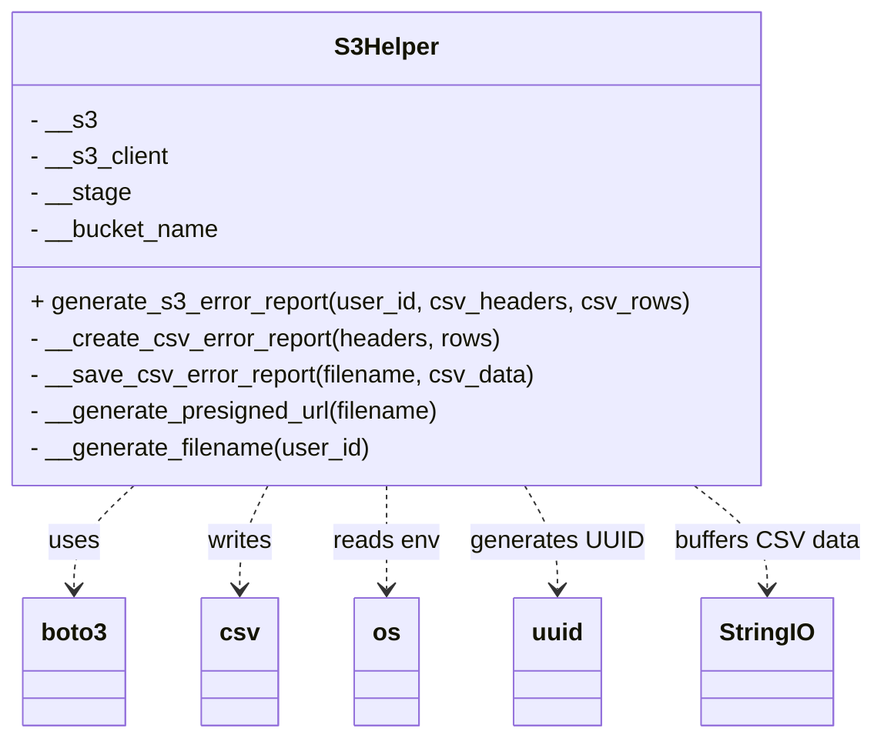

# Diagram: partview_core/partview_service/partview_service/core/helpers/s3_helper.py

> Auto-generated by Obscura crawlers

## Mermaid

### SVG

<svg id="container" width="563.78515625" xmlns="http://www.w3.org/2000/svg" class="classDiagram" height="486" viewBox="0 0 563.78515625 486" role="graphics-document document" aria-roledescription="class"><g><defs><marker id="container_class-aggregationStart" class="marker aggregation class" refX="18" refY="7" markerWidth="190" markerHeight="240" orient="auto"><path d="M 18,7 L9,13 L1,7 L9,1 Z"></path></marker></defs><defs><marker id="container_class-aggregationEnd" class="marker aggregation class" refX="1" refY="7" markerWidth="20" markerHeight="28" orient="auto"><path d="M 18,7 L9,13 L1,7 L9,1 Z"></path></marker></defs><defs><marker id="container_class-extensionStart" class="marker extension class" refX="18" refY="7" markerWidth="190" markerHeight="240" orient="auto"><path d="M 1,7 L18,13 V 1 Z"></path></marker></defs><defs><marker id="container_class-extensionEnd" class="marker extension class" refX="1" refY="7" markerWidth="20" markerHeight="28" orient="auto"><path d="M 1,1 V 13 L18,7 Z"></path></marker></defs><defs><marker id="container_class-compositionStart" class="marker composition class" refX="18" refY="7" markerWidth="190" markerHeight="240" orient="auto"><path d="M 18,7 L9,13 L1,7 L9,1 Z"></path></marker></defs><defs><marker id="container_class-compositionEnd" class="marker composition class" refX="1" refY="7" markerWidth="20" markerHeight="28" orient="auto"><path d="M 18,7 L9,13 L1,7 L9,1 Z"></path></marker></defs><defs><marker id="container_class-dependencyStart" class="marker dependency class" refX="6" refY="7" markerWidth="190" markerHeight="240" orient="auto"><path d="M 5,7 L9,13 L1,7 L9,1 Z"></path></marker></defs><defs><marker id="container_class-dependencyEnd" class="marker dependency class" refX="13" refY="7" markerWidth="20" markerHeight="28" orient="auto"><path d="M 18,7 L9,13 L14,7 L9,1 Z"></path></marker></defs><defs><marker id="container_class-lollipopStart" class="marker lollipop class" refX="13" refY="7" markerWidth="190" markerHeight="240" orient="auto"><circle stroke="black" fill="transparent" cx="7" cy="7" r="6"></circle></marker></defs><defs><marker id="container_class-lollipopEnd" class="marker lollipop class" refX="1" refY="7" markerWidth="190" markerHeight="240" orient="auto"><circle stroke="black" fill="transparent" cx="7" cy="7" r="6"></circle></marker></defs><g class="root"><g class="clusters"></g><g class="edgePaths"><path d="M88.215,320L81.796,326.167C75.376,332.333,62.538,344.667,56.119,356C49.699,367.333,49.699,377.667,49.699,382.833L49.699,388" id="id_S3Helper_boto3_1" class="edge-thickness-normal edge-pattern-dashed relation" style=";;;" data-edge="true" data-et="edge" data-id="id_S3Helper_boto3_1" data-points="W3sieCI6ODguMjE0OTI0NzA4NTQ5MjMsInkiOjMyMH0seyJ4Ijo0OS42OTkyMTg3NSwieSI6MzU3fSx7IngiOjQ5LjY5OTIxODc1LCJ5IjozOTR9XQ==" marker-end="url(#container_class-dependencyEnd)"></path><path d="M174.475,320L171.465,326.167C168.456,332.333,162.437,344.667,159.427,356C156.418,367.333,156.418,377.667,156.418,382.833L156.418,388" id="id_S3Helper_csv_2" class="edge-thickness-normal edge-pattern-dashed relation" style=";;;" data-edge="true" data-et="edge" data-id="id_S3Helper_csv_2" data-points="W3sieCI6MTc0LjQ3NDYzOTczNDQ1NTk2LCJ5IjozMjB9LHsieCI6MTU2LjQxNzk2ODc1LCJ5IjozNTd9LHsieCI6MTU2LjQxNzk2ODc1LCJ5IjozOTR9XQ==" marker-end="url(#container_class-dependencyEnd)"></path><path d="M250.605,320L250.605,326.167C250.605,332.333,250.605,344.667,250.605,356C250.605,367.333,250.605,377.667,250.605,382.833L250.605,388" id="id_S3Helper_os_3" class="edge-thickness-normal edge-pattern-dashed relation" style=";;;" data-edge="true" data-et="edge" data-id="id_S3Helper_os_3" data-points="W3sieCI6MjUwLjYwNTQ2ODc1LCJ5IjozMjB9LHsieCI6MjUwLjYwNTQ2ODc1LCJ5IjozNTd9LHsieCI6MjUwLjYwNTQ2ODc1LCJ5IjozOTR9XQ==" marker-end="url(#container_class-dependencyEnd)"></path><path d="M340.124,320L343.662,326.167C347.201,332.333,354.278,344.667,357.817,356C361.355,367.333,361.355,377.667,361.355,382.833L361.355,388" id="id_S3Helper_uuid_4" class="edge-thickness-normal edge-pattern-dashed relation" style=";;;" data-edge="true" data-et="edge" data-id="id_S3Helper_uuid_4" data-points="W3sieCI6MzQwLjEyMzYwMzQ2NTAyNTksInkiOjMyMH0seyJ4IjozNjEuMzU1NDY4NzUsInkiOjM1N30seyJ4IjozNjEuMzU1NDY4NzUsInkiOjM5NH1d" marker-end="url(#container_class-dependencyEnd)"></path><path d="M449.293,320L457.147,326.167C465.002,332.333,480.71,344.667,488.564,356C496.418,367.333,496.418,377.667,496.418,382.833L496.418,388" id="id_S3Helper_StringIO_5" class="edge-thickness-normal edge-pattern-dashed relation" style=";;;" data-edge="true" data-et="edge" data-id="id_S3Helper_StringIO_5" data-points="W3sieCI6NDQ5LjI5MzI5MjU4NDE5NjkzLCJ5IjozMjB9LHsieCI6NDk2LjQxNzk2ODc1LCJ5IjozNTd9LHsieCI6NDk2LjQxNzk2ODc1LCJ5IjozOTR9XQ==" marker-end="url(#container_class-dependencyEnd)"></path></g><g class="edgeLabels"><g class="edgeLabel" transform="translate(49.69921875, 357)"><g class="label" data-id="id_S3Helper_boto3_1" transform="translate(-16.4921875, -12)"><foreignObject width="32.984375" height="24">

uses

</foreignObject></g></g><g class="edgeLabel" transform="translate(156.41796875, 357)"><g class="label" data-id="id_S3Helper_csv_2" transform="translate(-21.9453125, -12)"><foreignObject width="43.890625" height="24">

writes

</foreignObject></g></g><g class="edgeLabel" transform="translate(250.60546875, 357)"><g class="label" data-id="id_S3Helper_os_3" transform="translate(-35.0546875, -12)"><foreignObject width="70.109375" height="24">

reads env

</foreignObject></g></g><g class="edgeLabel" transform="translate(361.35546875, 357)"><g class="label" data-id="id_S3Helper_uuid_4" transform="translate(-55.6953125, -12)"><foreignObject width="111.390625" height="24">

generates UUID

</foreignObject></g></g><g class="edgeLabel" transform="translate(496.41796875, 357)"><g class="label" data-id="id_S3Helper_StringIO_5" transform="translate(-59.3671875, -12)"><foreignObject width="118.734375" height="24">

buffers CSV data

</foreignObject></g></g></g><g class="nodes"><g class="node default" id="classId-S3Helper-0" transform="translate(250.60546875, 164)"><g class="basic label-container"><path d="M-242.60546875 -156 L242.60546875 -156 L242.60546875 156 L-242.60546875 156" stroke="none" stroke-width="0" fill="#ECECFF" style=""></path><path d="M-242.60546875 -156 C-102.74408309314757 -156, 37.11730256370487 -156, 242.60546875 -156 M-242.60546875 -156 C-49.008030241322615 -156, 144.58940826735477 -156, 242.60546875 -156 M242.60546875 -156 C242.60546875 -60.33233729479177, 242.60546875 35.33532541041646, 242.60546875 156 M242.60546875 -156 C242.60546875 -90.64153959656083, 242.60546875 -25.283079193121665, 242.60546875 156 M242.60546875 156 C54.21888390782104 156, -134.16770093435792 156, -242.60546875 156 M242.60546875 156 C50.359467324854364 156, -141.88653410029127 156, -242.60546875 156 M-242.60546875 156 C-242.60546875 63.14397586418325, -242.60546875 -29.712048271633506, -242.60546875 -156 M-242.60546875 156 C-242.60546875 65.60552245761095, -242.60546875 -24.78895508477811, -242.60546875 -156" stroke="#9370DB" stroke-width="1.3" fill="none" stroke-dasharray="0 0" style=""></path></g><g class="annotation-group text" transform="translate(0, -132)"></g><g class="label-group text" transform="translate(-33.2578125, -132)"><g class="label" style="font-weight: bolder" transform="translate(0,-12)"><foreignObject width="66.515625" height="24">

S3Helper

</foreignObject></g></g><g class="members-group text" transform="translate(-230.60546875, -84)"><g class="label" style="" transform="translate(0,-12)"><foreignObject width="42.625" height="24">

- __s3

</foreignObject></g><g class="label" style="" transform="translate(0,12)"><foreignObject width="91.03125" height="24">

- __s3_client

</foreignObject></g><g class="label" style="" transform="translate(0,36)"><foreignObject width="65.640625" height="24">

- __stage

</foreignObject></g><g class="label" style="" transform="translate(0,60)"><foreignObject width="125.015625" height="24">

- __bucket_name

</foreignObject></g></g><g class="methods-group text" transform="translate(-230.60546875, 36)"><g class="label" style="" transform="translate(0,-12)"><foreignObject width="427.953125" height="24">

+ generate_s3_error_report(user_id, csv_headers, csv_rows)

</foreignObject></g><g class="label" style="" transform="translate(0,12)"><foreignObject width="308.78125" height="24">

- __create_csv_error_report(headers, rows)

</foreignObject></g><g class="label" style="" transform="translate(0,36)"><foreignObject width="329.96875" height="24">

- __save_csv_error_report(filename, csv_data)

</foreignObject></g><g class="label" style="" transform="translate(0,60)"><foreignObject width="272.25" height="24">

- __generate_presigned_url(filename)

</foreignObject></g><g class="label" style="" transform="translate(0,84)"><foreignObject width="224.671875" height="24">

- __generate_filename(user_id)

</foreignObject></g></g><g class="divider" style=""><path d="M-242.60546875 -108 C-118.43052316846205 -108, 5.74442241307591 -108, 242.60546875 -108 M-242.60546875 -108 C-84.94009371994537 -108, 72.72528131010927 -108, 242.60546875 -108" stroke="#9370DB" stroke-width="1.3" fill="none" stroke-dasharray="0 0" style=""></path></g><g class="divider" style=""><path d="M-242.60546875 12 C-58.081218175372356 12, 126.44303239925529 12, 242.60546875 12 M-242.60546875 12 C-124.61412088515469 12, -6.622773020309381 12, 242.60546875 12" stroke="#9370DB" stroke-width="1.3" fill="none" stroke-dasharray="0 0" style=""></path></g></g><g class="node default" id="classId-boto3-1" transform="translate(49.69921875, 436)"><g class="basic label-container"><path d="M-33.0703125 -42 L33.0703125 -42 L33.0703125 42 L-33.0703125 42" stroke="none" stroke-width="0" fill="#ECECFF" style=""></path><path d="M-33.0703125 -42 C-19.225703631425304 -42, -5.3810947628506085 -42, 33.0703125 -42 M-33.0703125 -42 C-10.539903122219645 -42, 11.99050625556071 -42, 33.0703125 -42 M33.0703125 -42 C33.0703125 -11.298213213231609, 33.0703125 19.403573573536782, 33.0703125 42 M33.0703125 -42 C33.0703125 -19.99005887742075, 33.0703125 2.019882245158499, 33.0703125 42 M33.0703125 42 C13.208182648730265 42, -6.65394720253947 42, -33.0703125 42 M33.0703125 42 C15.624088745853378 42, -1.8221350082932446 42, -33.0703125 42 M-33.0703125 42 C-33.0703125 10.037636233431492, -33.0703125 -21.924727533137016, -33.0703125 -42 M-33.0703125 42 C-33.0703125 15.921668104561608, -33.0703125 -10.156663790876785, -33.0703125 -42" stroke="#9370DB" stroke-width="1.3" fill="none" stroke-dasharray="0 0" style=""></path></g><g class="annotation-group text" transform="translate(0, -18)"></g><g class="label-group text" transform="translate(-21.0703125, -18)"><g class="label" style="font-weight: bolder" transform="translate(0,-12)"><foreignObject width="42.140625" height="24">

boto3

</foreignObject></g></g><g class="members-group text" transform="translate(-21.0703125, 30)"></g><g class="methods-group text" transform="translate(-21.0703125, 60)"></g><g class="divider" style=""><path d="M-33.0703125 6 C-16.355851719658133 6, 0.3586090606837331 6, 33.0703125 6 M-33.0703125 6 C-10.817302506464362 6, 11.435707487071276 6, 33.0703125 6" stroke="#9370DB" stroke-width="1.3" fill="none" stroke-dasharray="0 0" style=""></path></g><g class="divider" style=""><path d="M-33.0703125 24 C-13.972044689075286 24, 5.126223121849428 24, 33.0703125 24 M-33.0703125 24 C-14.087420973968577 24, 4.8954705520628465 24, 33.0703125 24" stroke="#9370DB" stroke-width="1.3" fill="none" stroke-dasharray="0 0" style=""></path></g></g><g class="node default" id="classId-csv-2" transform="translate(156.41796875, 436)"><g class="basic label-container"><path d="M-23.6484375 -42 L23.6484375 -42 L23.6484375 42 L-23.6484375 42" stroke="none" stroke-width="0" fill="#ECECFF" style=""></path><path d="M-23.6484375 -42 C-9.856851537218393 -42, 3.9347344255632137 -42, 23.6484375 -42 M-23.6484375 -42 C-5.5038729986196095 -42, 12.640691502760781 -42, 23.6484375 -42 M23.6484375 -42 C23.6484375 -15.839528841310393, 23.6484375 10.320942317379213, 23.6484375 42 M23.6484375 -42 C23.6484375 -19.18871746905685, 23.6484375 3.6225650618862986, 23.6484375 42 M23.6484375 42 C4.822769794129993 42, -14.002897911740014 42, -23.6484375 42 M23.6484375 42 C11.78762113760651 42, -0.07319522478697849 42, -23.6484375 42 M-23.6484375 42 C-23.6484375 8.942156761545348, -23.6484375 -24.115686476909303, -23.6484375 -42 M-23.6484375 42 C-23.6484375 11.333319057924175, -23.6484375 -19.33336188415165, -23.6484375 -42" stroke="#9370DB" stroke-width="1.3" fill="none" stroke-dasharray="0 0" style=""></path></g><g class="annotation-group text" transform="translate(0, -18)"></g><g class="label-group text" transform="translate(-11.6484375, -18)"><g class="label" style="font-weight: bolder" transform="translate(0,-12)"><foreignObject width="23.296875" height="24">

csv

</foreignObject></g></g><g class="members-group text" transform="translate(-11.6484375, 30)"></g><g class="methods-group text" transform="translate(-11.6484375, 60)"></g><g class="divider" style=""><path d="M-23.6484375 6 C-10.662971046641914 6, 2.322495406716172 6, 23.6484375 6 M-23.6484375 6 C-9.124253479298641 6, 5.399930541402718 6, 23.6484375 6" stroke="#9370DB" stroke-width="1.3" fill="none" stroke-dasharray="0 0" style=""></path></g><g class="divider" style=""><path d="M-23.6484375 24 C-12.231932463514779 24, -0.8154274270295581 24, 23.6484375 24 M-23.6484375 24 C-9.432653144903554 24, 4.783131210192892 24, 23.6484375 24" stroke="#9370DB" stroke-width="1.3" fill="none" stroke-dasharray="0 0" style=""></path></g></g><g class="node default" id="classId-os-3" transform="translate(250.60546875, 436)"><g class="basic label-container"><path d="M-20.5390625 -42 L20.5390625 -42 L20.5390625 42 L-20.5390625 42" stroke="none" stroke-width="0" fill="#ECECFF" style=""></path><path d="M-20.5390625 -42 C-7.954456290437674 -42, 4.630149919124651 -42, 20.5390625 -42 M-20.5390625 -42 C-8.685080273651879 -42, 3.168901952696242 -42, 20.5390625 -42 M20.5390625 -42 C20.5390625 -17.06712193185272, 20.5390625 7.865756136294557, 20.5390625 42 M20.5390625 -42 C20.5390625 -13.008466587359663, 20.5390625 15.983066825280673, 20.5390625 42 M20.5390625 42 C9.828788590866893 42, -0.8814853182662148 42, -20.5390625 42 M20.5390625 42 C4.856603145785536 42, -10.825856208428927 42, -20.5390625 42 M-20.5390625 42 C-20.5390625 13.019157203884745, -20.5390625 -15.96168559223051, -20.5390625 -42 M-20.5390625 42 C-20.5390625 16.36246495740907, -20.5390625 -9.27507008518186, -20.5390625 -42" stroke="#9370DB" stroke-width="1.3" fill="none" stroke-dasharray="0 0" style=""></path></g><g class="annotation-group text" transform="translate(0, -18)"></g><g class="label-group text" transform="translate(-8.5390625, -18)"><g class="label" style="font-weight: bolder" transform="translate(0,-12)"><foreignObject width="17.078125" height="24">

os

</foreignObject></g></g><g class="members-group text" transform="translate(-8.5390625, 30)"></g><g class="methods-group text" transform="translate(-8.5390625, 60)"></g><g class="divider" style=""><path d="M-20.5390625 6 C-12.176915764935847 6, -3.8147690298716945 6, 20.5390625 6 M-20.5390625 6 C-5.594695182652021 6, 9.349672134695957 6, 20.5390625 6" stroke="#9370DB" stroke-width="1.3" fill="none" stroke-dasharray="0 0" style=""></path></g><g class="divider" style=""><path d="M-20.5390625 24 C-10.716217911851656 24, -0.8933733237033117 24, 20.5390625 24 M-20.5390625 24 C-11.391285233209214 24, -2.243507966418427 24, 20.5390625 24" stroke="#9370DB" stroke-width="1.3" fill="none" stroke-dasharray="0 0" style=""></path></g></g><g class="node default" id="classId-uuid-4" transform="translate(361.35546875, 436)"><g class="basic label-container"><path d="M-28.2109375 -42 L28.2109375 -42 L28.2109375 42 L-28.2109375 42" stroke="none" stroke-width="0" fill="#ECECFF" style=""></path><path d="M-28.2109375 -42 C-10.156547061254834 -42, 7.897843377490332 -42, 28.2109375 -42 M-28.2109375 -42 C-10.351629992179209 -42, 7.507677515641582 -42, 28.2109375 -42 M28.2109375 -42 C28.2109375 -24.020788087883382, 28.2109375 -6.041576175766764, 28.2109375 42 M28.2109375 -42 C28.2109375 -18.33793072045195, 28.2109375 5.324138559096099, 28.2109375 42 M28.2109375 42 C14.80240965548848 42, 1.3938818109769606 42, -28.2109375 42 M28.2109375 42 C15.160757362450616 42, 2.110577224901231 42, -28.2109375 42 M-28.2109375 42 C-28.2109375 20.094067314491944, -28.2109375 -1.8118653710161112, -28.2109375 -42 M-28.2109375 42 C-28.2109375 23.210392278739487, -28.2109375 4.420784557478974, -28.2109375 -42" stroke="#9370DB" stroke-width="1.3" fill="none" stroke-dasharray="0 0" style=""></path></g><g class="annotation-group text" transform="translate(0, -18)"></g><g class="label-group text" transform="translate(-16.2109375, -18)"><g class="label" style="font-weight: bolder" transform="translate(0,-12)"><foreignObject width="32.421875" height="24">

uuid

</foreignObject></g></g><g class="members-group text" transform="translate(-16.2109375, 30)"></g><g class="methods-group text" transform="translate(-16.2109375, 60)"></g><g class="divider" style=""><path d="M-28.2109375 6 C-12.414774750201163 6, 3.381387999597674 6, 28.2109375 6 M-28.2109375 6 C-14.806980355089296 6, -1.403023210178592 6, 28.2109375 6" stroke="#9370DB" stroke-width="1.3" fill="none" stroke-dasharray="0 0" style=""></path></g><g class="divider" style=""><path d="M-28.2109375 24 C-16.605988695361663 24, -5.001039890723327 24, 28.2109375 24 M-28.2109375 24 C-14.399600182914496 24, -0.588262865828991 24, 28.2109375 24" stroke="#9370DB" stroke-width="1.3" fill="none" stroke-dasharray="0 0" style=""></path></g></g><g class="node default" id="classId-StringIO-5" transform="translate(496.41796875, 436)"><g class="basic label-container"><path d="M-42.03125 -42 L42.03125 -42 L42.03125 42 L-42.03125 42" stroke="none" stroke-width="0" fill="#ECECFF" style=""></path><path d="M-42.03125 -42 C-21.535749480912152 -42, -1.0402489618243038 -42, 42.03125 -42 M-42.03125 -42 C-9.434438205333151 -42, 23.162373589333697 -42, 42.03125 -42 M42.03125 -42 C42.03125 -19.507026462774544, 42.03125 2.9859470744509125, 42.03125 42 M42.03125 -42 C42.03125 -20.73935642599694, 42.03125 0.5212871480061168, 42.03125 42 M42.03125 42 C22.82893438949058 42, 3.626618778981161 42, -42.03125 42 M42.03125 42 C18.83365373159566 42, -4.363942536808679 42, -42.03125 42 M-42.03125 42 C-42.03125 13.99918855365345, -42.03125 -14.0016228926931, -42.03125 -42 M-42.03125 42 C-42.03125 10.20047354886055, -42.03125 -21.5990529022789, -42.03125 -42" stroke="#9370DB" stroke-width="1.3" fill="none" stroke-dasharray="0 0" style=""></path></g><g class="annotation-group text" transform="translate(0, -18)"></g><g class="label-group text" transform="translate(-30.03125, -18)"><g class="label" style="font-weight: bolder" transform="translate(0,-12)"><foreignObject width="60.0625" height="24">

StringIO

</foreignObject></g></g><g class="members-group text" transform="translate(-30.03125, 30)"></g><g class="methods-group text" transform="translate(-30.03125, 60)"></g><g class="divider" style=""><path d="M-42.03125 6 C-19.937609158635162 6, 2.156031682729676 6, 42.03125 6 M-42.03125 6 C-9.565938895774863 6, 22.899372208450274 6, 42.03125 6" stroke="#9370DB" stroke-width="1.3" fill="none" stroke-dasharray="0 0" style=""></path></g><g class="divider" style=""><path d="M-42.03125 24 C-23.682415158184146 24, -5.333580316368291 24, 42.03125 24 M-42.03125 24 C-11.32599033271002 24, 19.37926933457996 24, 42.03125 24" stroke="#9370DB" stroke-width="1.3" fill="none" stroke-dasharray="0 0" style=""></path></g></g></g></g></g></svg>
