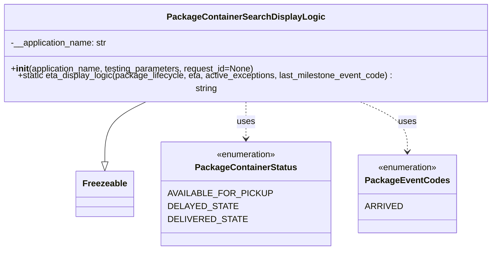

# Diagram: partview_core/partview_service/partview_service/core/helpers/search_display_logic.py

> Auto-generated by Obscura crawlers

## Mermaid

### SVG

<svg id="container" width="917.9140625" xmlns="http://www.w3.org/2000/svg" class="classDiagram" height="450" viewBox="0 0 917.9140625 450" role="graphics-document document" aria-roledescription="class"><g><defs><marker id="container_class-aggregationStart" class="marker aggregation class" refX="18" refY="7" markerWidth="190" markerHeight="240" orient="auto"><path d="M 18,7 L9,13 L1,7 L9,1 Z"></path></marker></defs><defs><marker id="container_class-aggregationEnd" class="marker aggregation class" refX="1" refY="7" markerWidth="20" markerHeight="28" orient="auto"><path d="M 18,7 L9,13 L1,7 L9,1 Z"></path></marker></defs><defs><marker id="container_class-extensionStart" class="marker extension class" refX="18" refY="7" markerWidth="190" markerHeight="240" orient="auto"><path d="M 1,7 L18,13 V 1 Z"></path></marker></defs><defs><marker id="container_class-extensionEnd" class="marker extension class" refX="1" refY="7" markerWidth="20" markerHeight="28" orient="auto"><path d="M 1,1 V 13 L18,7 Z"></path></marker></defs><defs><marker id="container_class-compositionStart" class="marker composition class" refX="18" refY="7" markerWidth="190" markerHeight="240" orient="auto"><path d="M 18,7 L9,13 L1,7 L9,1 Z"></path></marker></defs><defs><marker id="container_class-compositionEnd" class="marker composition class" refX="1" refY="7" markerWidth="20" markerHeight="28" orient="auto"><path d="M 18,7 L9,13 L1,7 L9,1 Z"></path></marker></defs><defs><marker id="container_class-dependencyStart" class="marker dependency class" refX="6" refY="7" markerWidth="190" markerHeight="240" orient="auto"><path d="M 5,7 L9,13 L1,7 L9,1 Z"></path></marker></defs><defs><marker id="container_class-dependencyEnd" class="marker dependency class" refX="13" refY="7" markerWidth="20" markerHeight="28" orient="auto"><path d="M 18,7 L9,13 L14,7 L9,1 Z"></path></marker></defs><defs><marker id="container_class-lollipopStart" class="marker lollipop class" refX="13" refY="7" markerWidth="190" markerHeight="240" orient="auto"><circle stroke="black" fill="transparent" cx="7" cy="7" r="6"></circle></marker></defs><defs><marker id="container_class-lollipopEnd" class="marker lollipop class" refX="1" refY="7" markerWidth="190" markerHeight="240" orient="auto"><circle stroke="black" fill="transparent" cx="7" cy="7" r="6"></circle></marker></defs><g class="root"><g class="clusters"></g><g class="edgePaths"><path d="M289.783,176L277.363,182.167C264.944,188.333,240.105,200.667,227.685,219.125C215.266,237.583,215.266,262.167,215.266,274.458L215.266,286.75" id="id_PackageContainerSearchDisplayLogic_Freezeable_1" class="edge-thickness-normal edge-pattern-solid relation" style=";;;" data-edge="true" data-et="edge" data-id="id_PackageContainerSearchDisplayLogic_Freezeable_1" data-points="W3sieCI6Mjg5Ljc4MjgzMTg2OTgzNDcsInkiOjE3Nn0seyJ4IjoyMTUuMjY1NjI1LCJ5IjoyMTN9LHsieCI6MjE1LjI2NTYyNSwieSI6MzA0fV0=" marker-end="url(#container_class-extensionEnd)"></path><path d="M458.957,176L458.957,182.167C458.957,188.333,458.957,200.667,458.957,212C458.957,223.333,458.957,233.667,458.957,238.833L458.957,244" id="id_PackageContainerSearchDisplayLogic_PackageContainerStatus_2" class="edge-thickness-normal edge-pattern-dashed relation" style=";;;" data-edge="true" data-et="edge" data-id="id_PackageContainerSearchDisplayLogic_PackageContainerStatus_2" data-points="W3sieCI6NDU4Ljk1NzAzMTI1LCJ5IjoxNzZ9LHsieCI6NDU4Ljk1NzAzMTI1LCJ5IjoyMTN9LHsieCI6NDU4Ljk1NzAzMTI1LCJ5IjoyNTB9XQ==" marker-end="url(#container_class-dependencyEnd)"></path><path d="M651.078,176L665.182,182.167C679.287,188.333,707.495,200.667,721.599,216C735.703,231.333,735.703,249.667,735.703,258.833L735.703,268" id="id_PackageContainerSearchDisplayLogic_PackageEventCodes_3" class="edge-thickness-normal edge-pattern-dashed relation" style=";;;" data-edge="true" data-et="edge" data-id="id_PackageContainerSearchDisplayLogic_PackageEventCodes_3" data-points="W3sieCI6NjUxLjA3ODI4NjQxNTI4OTMsInkiOjE3Nn0seyJ4Ijo3MzUuNzAzMTI1LCJ5IjoyMTN9LHsieCI6NzM1LjcwMzEyNSwieSI6Mjc0fV0=" marker-end="url(#container_class-dependencyEnd)"></path></g><g class="edgeLabels"><g class="edgeLabel"><g class="label" data-id="id_PackageContainerSearchDisplayLogic_Freezeable_1" transform="translate(0, 0)"><foreignObject width="0" height="0">

</foreignObject></g></g><g class="edgeLabel" transform="translate(458.95703125, 213)"><g class="label" data-id="id_PackageContainerSearchDisplayLogic_PackageContainerStatus_2" transform="translate(-16.4921875, -12)"><foreignObject width="32.984375" height="24">

uses

</foreignObject></g></g><g class="edgeLabel" transform="translate(735.703125, 213)"><g class="label" data-id="id_PackageContainerSearchDisplayLogic_PackageEventCodes_3" transform="translate(-16.4921875, -12)"><foreignObject width="32.984375" height="24">

uses

</foreignObject></g></g></g><g class="nodes"><g class="node default" id="classId-Freezeable-0" transform="translate(215.265625, 346)"><g class="basic label-container"><path d="M-51.1953125 -42 L51.1953125 -42 L51.1953125 42 L-51.1953125 42" stroke="none" stroke-width="0" fill="#ECECFF" style=""></path><path d="M-51.1953125 -42 C-18.744068538362967 -42, 13.707175423274066 -42, 51.1953125 -42 M-51.1953125 -42 C-24.7720276514448 -42, 1.6512571971103966 -42, 51.1953125 -42 M51.1953125 -42 C51.1953125 -21.738791998863654, 51.1953125 -1.477583997727308, 51.1953125 42 M51.1953125 -42 C51.1953125 -24.772535828319565, 51.1953125 -7.545071656639131, 51.1953125 42 M51.1953125 42 C14.468653652011461 42, -22.258005195977077 42, -51.1953125 42 M51.1953125 42 C13.394500918585322 42, -24.406310662829355 42, -51.1953125 42 M-51.1953125 42 C-51.1953125 18.180651417987068, -51.1953125 -5.638697164025864, -51.1953125 -42 M-51.1953125 42 C-51.1953125 21.26788232635148, -51.1953125 0.5357646527029587, -51.1953125 -42" stroke="#9370DB" stroke-width="1.3" fill="none" stroke-dasharray="0 0" style=""></path></g><g class="annotation-group text" transform="translate(0, -18)"></g><g class="label-group text" transform="translate(-39.1953125, -18)"><g class="label" style="font-weight: bolder" transform="translate(0,-12)"><foreignObject width="78.390625" height="24">

Freezeable

</foreignObject></g></g><g class="members-group text" transform="translate(-39.1953125, 30)"></g><g class="methods-group text" transform="translate(-39.1953125, 60)"></g><g class="divider" style=""><path d="M-51.1953125 6 C-18.629236980794303 6, 13.936838538411394 6, 51.1953125 6 M-51.1953125 6 C-20.85398462799687 6, 9.487343244006262 6, 51.1953125 6" stroke="#9370DB" stroke-width="1.3" fill="none" stroke-dasharray="0 0" style=""></path></g><g class="divider" style=""><path d="M-51.1953125 24 C-14.28504170235933 24, 22.62522909528134 24, 51.1953125 24 M-51.1953125 24 C-26.16168400152934 24, -1.1280555030586825 24, 51.1953125 24" stroke="#9370DB" stroke-width="1.3" fill="none" stroke-dasharray="0 0" style=""></path></g></g><g class="node default" id="classId-PackageContainerStatus-1" transform="translate(458.95703125, 346)"><g class="basic label-container"><path d="M-142.49609375 -96 L142.49609375 -96 L142.49609375 96 L-142.49609375 96" stroke="none" stroke-width="0" fill="#ECECFF" style=""></path><path d="M-142.49609375 -96 C-73.50242785290433 -96, -4.508761955808666 -96, 142.49609375 -96 M-142.49609375 -96 C-37.73669905103631 -96, 67.02269564792738 -96, 142.49609375 -96 M142.49609375 -96 C142.49609375 -24.26987039337186, 142.49609375 47.46025921325628, 142.49609375 96 M142.49609375 -96 C142.49609375 -23.22503127051087, 142.49609375 49.54993745897826, 142.49609375 96 M142.49609375 96 C35.798663895607405 96, -70.89876595878519 96, -142.49609375 96 M142.49609375 96 C81.55049952976196 96, 20.604905309523943 96, -142.49609375 96 M-142.49609375 96 C-142.49609375 52.70199742434049, -142.49609375 9.40399484868098, -142.49609375 -96 M-142.49609375 96 C-142.49609375 25.724703851878644, -142.49609375 -44.55059229624271, -142.49609375 -96" stroke="#9370DB" stroke-width="1.3" fill="none" stroke-dasharray="0 0" style=""></path></g><g class="annotation-group text" transform="translate(-55.5546875, -72)"><g class="label" style="" transform="translate(0,-12)"><foreignObject width="111.109375" height="24">

«enumeration»

</foreignObject></g></g><g class="label-group text" transform="translate(-88.9296875, -48)"><g class="label" style="font-weight: bolder" transform="translate(0,-12)"><foreignObject width="177.859375" height="24">

PackageContainerStatus

</foreignObject></g></g><g class="members-group text" transform="translate(-130.49609375, 0)"><g class="label" style="" transform="translate(0,-12)"><foreignObject width="172.0625" height="24">

AVAILABLE_FOR_PICKUP

</foreignObject></g><g class="label" style="" transform="translate(0,12)"><foreignObject width="111.28125" height="24">

DELAYED_STATE

</foreignObject></g><g class="label" style="" transform="translate(0,36)"><foreignObject width="125.953125" height="24">

DELIVERED_STATE

</foreignObject></g></g><g class="methods-group text" transform="translate(-130.49609375, 96)"></g><g class="divider" style=""><path d="M-142.49609375 -24 C-69.97524578174622 -24, 2.5456021865075513 -24, 142.49609375 -24 M-142.49609375 -24 C-77.94155770967762 -24, -13.38702166935525 -24, 142.49609375 -24" stroke="#9370DB" stroke-width="1.3" fill="none" stroke-dasharray="0 0" style=""></path></g><g class="divider" style=""><path d="M-142.49609375 72 C-77.69763430857837 72, -12.899174867156745 72, 142.49609375 72 M-142.49609375 72 C-67.49532438163868 72, 7.505444986722637 72, 142.49609375 72" stroke="#9370DB" stroke-width="1.3" fill="none" stroke-dasharray="0 0" style=""></path></g></g><g class="node default" id="classId-PackageEventCodes-2" transform="translate(735.703125, 346)"><g class="basic label-container"><path d="M-84.25 -72 L84.25 -72 L84.25 72 L-84.25 72" stroke="none" stroke-width="0" fill="#ECECFF" style=""></path><path d="M-84.25 -72 C-50.15704561061199 -72, -16.064091221223975 -72, 84.25 -72 M-84.25 -72 C-36.01053470119172 -72, 12.228930597616554 -72, 84.25 -72 M84.25 -72 C84.25 -32.63570838238004, 84.25 6.728583235239924, 84.25 72 M84.25 -72 C84.25 -31.52922937015439, 84.25 8.94154125969122, 84.25 72 M84.25 72 C31.407275094155793 72, -21.435449811688414 72, -84.25 72 M84.25 72 C32.35791235478713 72, -19.534175290425736 72, -84.25 72 M-84.25 72 C-84.25 27.296720092648954, -84.25 -17.406559814702092, -84.25 -72 M-84.25 72 C-84.25 41.528410445005726, -84.25 11.056820890011451, -84.25 -72" stroke="#9370DB" stroke-width="1.3" fill="none" stroke-dasharray="0 0" style=""></path></g><g class="annotation-group text" transform="translate(-55.5546875, -48)"><g class="label" style="" transform="translate(0,-12)"><foreignObject width="111.109375" height="24">

«enumeration»

</foreignObject></g></g><g class="label-group text" transform="translate(-72.25, -24)"><g class="label" style="font-weight: bolder" transform="translate(0,-12)"><foreignObject width="144.5" height="24">

PackageEventCodes

</foreignObject></g></g><g class="members-group text" transform="translate(-72.25, 24)"><g class="label" style="" transform="translate(0,-12)"><foreignObject width="61.015625" height="24">

ARRIVED

</foreignObject></g></g><g class="methods-group text" transform="translate(-72.25, 72)"></g><g class="divider" style=""><path d="M-84.25 0 C-39.79317535906359 0, 4.6636492818728215 0, 84.25 0 M-84.25 0 C-18.311276375793526 0, 47.62744724841295 0, 84.25 0" stroke="#9370DB" stroke-width="1.3" fill="none" stroke-dasharray="0 0" style=""></path></g><g class="divider" style=""><path d="M-84.25 48 C-36.39224173509928 48, 11.465516529801434 48, 84.25 48 M-84.25 48 C-28.879193934457213 48, 26.491612131085574 48, 84.25 48" stroke="#9370DB" stroke-width="1.3" fill="none" stroke-dasharray="0 0" style=""></path></g></g><g class="node default" id="classId-PackageContainerSearchDisplayLogic-3" transform="translate(458.95703125, 92)"><g class="basic label-container"><path d="M-450.95703125 -84 L450.95703125 -84 L450.95703125 84 L-450.95703125 84" stroke="none" stroke-width="0" fill="#ECECFF" style=""></path><path d="M-450.95703125 -84 C-109.2328999041224 -84, 232.4912314417552 -84, 450.95703125 -84 M-450.95703125 -84 C-152.98643587706 -84, 144.98415949588002 -84, 450.95703125 -84 M450.95703125 -84 C450.95703125 -41.75336198530767, 450.95703125 0.49327602938465986, 450.95703125 84 M450.95703125 -84 C450.95703125 -39.97459206029909, 450.95703125 4.050815879401824, 450.95703125 84 M450.95703125 84 C133.42967965268463 84, -184.09767194463075 84, -450.95703125 84 M450.95703125 84 C198.14374773162817 84, -54.669535786743666 84, -450.95703125 84 M-450.95703125 84 C-450.95703125 46.428645485259416, -450.95703125 8.857290970518832, -450.95703125 -84 M-450.95703125 84 C-450.95703125 36.29910959533759, -450.95703125 -11.40178080932482, -450.95703125 -84" stroke="#9370DB" stroke-width="1.3" fill="none" stroke-dasharray="0 0" style=""></path></g><g class="annotation-group text" transform="translate(0, -60)"></g><g class="label-group text" transform="translate(-136.0859375, -60)"><g class="label" style="font-weight: bolder" transform="translate(0,-12)"><foreignObject width="272.171875" height="24">

PackageContainerSearchDisplayLogic

</foreignObject></g></g><g class="members-group text" transform="translate(-438.95703125, -12)"><g class="label" style="" transform="translate(0,-12)"><foreignObject width="179.78125" height="24">

-__application_name: str

</foreignObject></g></g><g class="methods-group text" transform="translate(-438.95703125, 36)"><g class="label" style="" transform="translate(0,-12)"><foreignObject width="454.328125" height="24">

+<strong>init</strong>(application_name, testing_parameters, request_id=None)

</foreignObject></g><g class="label" style="" transform="translate(0,12)"><foreignObject width="741.828125" height="24">

+static eta_display_logic(package_lifecycle, eta, active_exceptions, last_milestone_event_code) : string

</foreignObject></g></g><g class="divider" style=""><path d="M-450.95703125 -36 C-202.8538167739916 -36, 45.24939770201678 -36, 450.95703125 -36 M-450.95703125 -36 C-172.1687005611994 -36, 106.61963012760123 -36, 450.95703125 -36" stroke="#9370DB" stroke-width="1.3" fill="none" stroke-dasharray="0 0" style=""></path></g><g class="divider" style=""><path d="M-450.95703125 12 C-267.4056199434598 12, -83.85420863691957 12, 450.95703125 12 M-450.95703125 12 C-183.6212581974255 12, 83.71451485514899 12, 450.95703125 12" stroke="#9370DB" stroke-width="1.3" fill="none" stroke-dasharray="0 0" style=""></path></g></g></g></g></g></svg>
