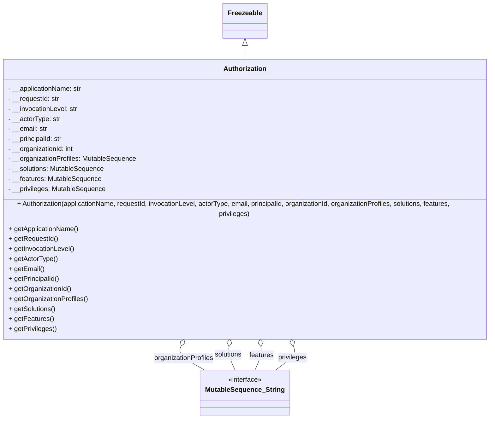

# Diagram: partview_core/partview_service/partview_service/core/messaging/Authorization.py

> Auto-generated by Obscura crawlers

## Mermaid

### SVG

<svg id="container" width="1234.3203125" xmlns="http://www.w3.org/2000/svg" class="classDiagram" height="980" viewBox="0 0 1234.3203125 980" role="graphics-document document" aria-roledescription="class"><g><defs><marker id="container_class-aggregationStart" class="marker aggregation class" refX="18" refY="7" markerWidth="190" markerHeight="240" orient="auto"><path d="M 18,7 L9,13 L1,7 L9,1 Z"></path></marker></defs><defs><marker id="container_class-aggregationEnd" class="marker aggregation class" refX="1" refY="7" markerWidth="20" markerHeight="28" orient="auto"><path d="M 18,7 L9,13 L1,7 L9,1 Z"></path></marker></defs><defs><marker id="container_class-extensionStart" class="marker extension class" refX="18" refY="7" markerWidth="190" markerHeight="240" orient="auto"><path d="M 1,7 L18,13 V 1 Z"></path></marker></defs><defs><marker id="container_class-extensionEnd" class="marker extension class" refX="1" refY="7" markerWidth="20" markerHeight="28" orient="auto"><path d="M 1,1 V 13 L18,7 Z"></path></marker></defs><defs><marker id="container_class-compositionStart" class="marker composition class" refX="18" refY="7" markerWidth="190" markerHeight="240" orient="auto"><path d="M 18,7 L9,13 L1,7 L9,1 Z"></path></marker></defs><defs><marker id="container_class-compositionEnd" class="marker composition class" refX="1" refY="7" markerWidth="20" markerHeight="28" orient="auto"><path d="M 18,7 L9,13 L1,7 L9,1 Z"></path></marker></defs><defs><marker id="container_class-dependencyStart" class="marker dependency class" refX="6" refY="7" markerWidth="190" markerHeight="240" orient="auto"><path d="M 5,7 L9,13 L1,7 L9,1 Z"></path></marker></defs><defs><marker id="container_class-dependencyEnd" class="marker dependency class" refX="13" refY="7" markerWidth="20" markerHeight="28" orient="auto"><path d="M 18,7 L9,13 L14,7 L9,1 Z"></path></marker></defs><defs><marker id="container_class-lollipopStart" class="marker lollipop class" refX="13" refY="7" markerWidth="190" markerHeight="240" orient="auto"><circle stroke="black" fill="transparent" cx="7" cy="7" r="6"></circle></marker></defs><defs><marker id="container_class-lollipopEnd" class="marker lollipop class" refX="1" refY="7" markerWidth="190" markerHeight="240" orient="auto"><circle stroke="black" fill="transparent" cx="7" cy="7" r="6"></circle></marker></defs><g class="root"><g class="clusters"></g><g class="edgePaths"><path d="M617.16,109.25L617.16,110.542C617.16,111.833,617.16,114.417,617.16,119.875C617.16,125.333,617.16,133.667,617.16,137.833L617.16,142" id="id_Freezeable_Authorization_1" class="edge-thickness-normal edge-pattern-solid relation" style=";;;" data-edge="true" data-et="edge" data-id="id_Freezeable_Authorization_1" data-points="W3sieCI6NjE3LjE2MDE1NjI1LCJ5Ijo5Mn0seyJ4Ijo2MTcuMTYwMTU2MjUsInkiOjExN30seyJ4Ijo2MTcuMTYwMTU2MjUsInkiOjE0Mn1d" marker-start="url(#container_class-extensionStart)"></path><path d="M459.546,805.647L457.894,809.206C456.243,812.765,452.94,819.882,462.641,829.608C472.341,839.333,495.046,851.667,506.398,857.833L517.751,864" id="id_Authorization_MutableSequence_String_2" class="edge-thickness-normal edge-pattern-solid relation" style=";;;" data-edge="true" data-et="edge" data-id="id_Authorization_MutableSequence_String_2" data-points="W3sieCI6NDY2LjgwNjcxMDk1OTE0MTI0LCJ5Ijo3OTB9LHsieCI6NDQ5LjYzNjcxODc1LCJ5Ijo4Mjd9LHsieCI6NTE3Ljc1MDY0Mzg4NzM2MjcsInkiOjg2NH1d" marker-start="url(#container_class-aggregationStart)"></path><path d="M577.766,807.136L577.384,810.447C577.002,813.757,576.237,820.379,578.68,829.856C581.123,839.333,586.773,851.667,589.598,857.833L592.423,864" id="id_Authorization_MutableSequence_String_3" class="edge-thickness-normal edge-pattern-solid relation" style=";;;" data-edge="true" data-et="edge" data-id="id_Authorization_MutableSequence_String_3" data-points="W3sieCI6NTc5Ljc0NTMzNjMwNTQwMTcsInkiOjc5MH0seyJ4Ijo1NzUuNDcyNjU2MjUsInkiOjgyN30seyJ4Ijo1OTIuNDIyNTE4ODg3MzYyNywieSI6ODY0fV0=" marker-start="url(#container_class-aggregationStart)"></path><path d="M656.554,807.136L656.936,810.447C657.318,813.757,658.083,820.379,655.64,829.856C653.198,839.333,647.548,851.667,644.723,857.833L641.898,864" id="id_Authorization_MutableSequence_String_4" class="edge-thickness-normal edge-pattern-solid relation" style=";;;" data-edge="true" data-et="edge" data-id="id_Authorization_MutableSequence_String_4" data-points="W3sieCI6NjU0LjU3NDk3NjE5NDU5ODMsInkiOjc5MH0seyJ4Ijo2NTguODQ3NjU2MjUsInkiOjgyN30seyJ4Ijo2NDEuODk3NzkzNjEyNjM3MywieSI6ODY0fV0=" marker-start="url(#container_class-aggregationStart)"></path><path d="M736.399,806.279L737.609,809.733C738.82,813.186,741.24,820.093,733.878,829.713C726.515,839.333,709.371,851.667,700.798,857.833L692.226,864" id="id_Authorization_MutableSequence_String_5" class="edge-thickness-normal edge-pattern-solid relation" style=";;;" data-edge="true" data-et="edge" data-id="id_Authorization_MutableSequence_String_5" data-points="W3sieCI6NzMwLjY5NDc4MjI4ODc4MTIsInkiOjc5MH0seyJ4Ijo3NDMuNjYwMTU2MjUsInkiOjgyN30seyJ4Ijo2OTIuMjI2MDkwMzE1OTM0LCJ5Ijo4NjR9XQ==" marker-start="url(#container_class-aggregationStart)"></path></g><g class="edgeLabels"><g class="edgeLabel"><g class="label" data-id="id_Freezeable_Authorization_1" transform="translate(0, 0)"><foreignObject width="0" height="0">

</foreignObject></g></g><g class="edgeLabel" transform="translate(465.77218, 835.76491)"><g class="label" data-id="id_Authorization_MutableSequence_String_2" transform="translate(-72.1875, -12)"><foreignObject width="144.375" height="24">

organizationProfiles

</foreignObject></g></g><g class="edgeLabel" transform="translate(576.19145, 828.56907)"><g class="label" data-id="id_Authorization_MutableSequence_String_3" transform="translate(-33.6484375, -12)"><foreignObject width="67.296875" height="24">

solutions

</foreignObject></g></g><g class="edgeLabel" transform="translate(658.12886, 828.56907)"><g class="label" data-id="id_Authorization_MutableSequence_String_4" transform="translate(-29.7265625, -12)"><foreignObject width="59.453125" height="24">

features

</foreignObject></g></g><g class="edgeLabel" transform="translate(733.85635, 834.05254)"><g class="label" data-id="id_Authorization_MutableSequence_String_5" transform="translate(-35.0859375, -12)"><foreignObject width="70.171875" height="24">

privileges

</foreignObject></g></g></g><g class="nodes"><g class="node default" id="classId-Freezeable-0" transform="translate(617.16015625, 50)"><g class="basic label-container"><path d="M-51.1953125 -42 L51.1953125 -42 L51.1953125 42 L-51.1953125 42" stroke="none" stroke-width="0" fill="#ECECFF" style=""></path><path d="M-51.1953125 -42 C-26.665602543261826 -42, -2.135892586523653 -42, 51.1953125 -42 M-51.1953125 -42 C-17.39610536475766 -42, 16.40310177048468 -42, 51.1953125 -42 M51.1953125 -42 C51.1953125 -24.711940847368478, 51.1953125 -7.423881694736956, 51.1953125 42 M51.1953125 -42 C51.1953125 -17.997303324650467, 51.1953125 6.005393350699066, 51.1953125 42 M51.1953125 42 C27.274965767366204 42, 3.3546190347324085 42, -51.1953125 42 M51.1953125 42 C10.687396851264367 42, -29.820518797471266 42, -51.1953125 42 M-51.1953125 42 C-51.1953125 16.967969156572508, -51.1953125 -8.064061686854984, -51.1953125 -42 M-51.1953125 42 C-51.1953125 23.223497308165886, -51.1953125 4.4469946163317715, -51.1953125 -42" stroke="#9370DB" stroke-width="1.3" fill="none" stroke-dasharray="0 0" style=""></path></g><g class="annotation-group text" transform="translate(0, -18)"></g><g class="label-group text" transform="translate(-39.1953125, -18)"><g class="label" style="font-weight: bolder" transform="translate(0,-12)"><foreignObject width="78.390625" height="24">

Freezeable

</foreignObject></g></g><g class="members-group text" transform="translate(-39.1953125, 30)"></g><g class="methods-group text" transform="translate(-39.1953125, 60)"></g><g class="divider" style=""><path d="M-51.1953125 6 C-14.329555601085353 6, 22.536201297829294 6, 51.1953125 6 M-51.1953125 6 C-14.613902686215411 6, 21.967507127569178 6, 51.1953125 6" stroke="#9370DB" stroke-width="1.3" fill="none" stroke-dasharray="0 0" style=""></path></g><g class="divider" style=""><path d="M-51.1953125 24 C-10.86650945625675 24, 29.4622935874865 24, 51.1953125 24 M-51.1953125 24 C-29.00940520490113 24, -6.8234979098022635 24, 51.1953125 24" stroke="#9370DB" stroke-width="1.3" fill="none" stroke-dasharray="0 0" style=""></path></g></g><g class="node default" id="classId-Authorization-1" transform="translate(617.16015625, 466)"><g class="basic label-container"><path d="M-609.16015625 -324 L609.16015625 -324 L609.16015625 324 L-609.16015625 324" stroke="none" stroke-width="0" fill="#ECECFF" style=""></path><path d="M-609.16015625 -324 C-227.89945822220176 -324, 153.36123980559648 -324, 609.16015625 -324 M-609.16015625 -324 C-336.4836425754671 -324, -63.80712890093423 -324, 609.16015625 -324 M609.16015625 -324 C609.16015625 -143.1244428986946, 609.16015625 37.75111420261078, 609.16015625 324 M609.16015625 -324 C609.16015625 -174.94288671231456, 609.16015625 -25.88577342462912, 609.16015625 324 M609.16015625 324 C279.71014559041305 324, -49.7398650691739 324, -609.16015625 324 M609.16015625 324 C340.33008688208855 324, 71.5000175141771 324, -609.16015625 324 M-609.16015625 324 C-609.16015625 191.54714267695468, -609.16015625 59.094285353909356, -609.16015625 -324 M-609.16015625 324 C-609.16015625 185.0941287176653, -609.16015625 46.18825743533063, -609.16015625 -324" stroke="#9370DB" stroke-width="1.3" fill="none" stroke-dasharray="0 0" style=""></path></g><g class="annotation-group text" transform="translate(0, -300)"></g><g class="label-group text" transform="translate(-49.7109375, -300)"><g class="label" style="font-weight: bolder" transform="translate(0,-12)"><foreignObject width="99.421875" height="24">

Authorization

</foreignObject></g></g><g class="members-group text" transform="translate(-597.16015625, -252)"><g class="label" style="" transform="translate(0,-12)"><foreignObject width="178.53125" height="24">

- __applicationName: str

</foreignObject></g><g class="label" style="" transform="translate(0,12)"><foreignObject width="124.234375" height="24">

- __requestId: str

</foreignObject></g><g class="label" style="" transform="translate(0,36)"><foreignObject width="168.40625" height="24">

- __invocationLevel: str

</foreignObject></g><g class="label" style="" transform="translate(0,60)"><foreignObject width="125.5" height="24">

- __actorType: str

</foreignObject></g><g class="label" style="" transform="translate(0,84)"><foreignObject width="94.859375" height="24">

- __email: str

</foreignObject></g><g class="label" style="" transform="translate(0,108)"><foreignObject width="133.265625" height="24">

- __principalId: str

</foreignObject></g><g class="label" style="" transform="translate(0,132)"><foreignObject width="159.234375" height="24">

- __organizationId: int

</foreignObject></g><g class="label" style="" transform="translate(0,156)"><foreignObject width="308.734375" height="24">

- __organizationProfiles: MutableSequence

</foreignObject></g><g class="label" style="" transform="translate(0,180)"><foreignObject width="231.96875" height="24">

- __solutions: MutableSequence

</foreignObject></g><g class="label" style="" transform="translate(0,204)"><foreignObject width="223.796875" height="24">

- __features: MutableSequence

</foreignObject></g><g class="label" style="" transform="translate(0,228)"><foreignObject width="234.84375" height="24">

- __privileges: MutableSequence

</foreignObject></g></g><g class="methods-group text" transform="translate(-597.16015625, 36)"><g class="label" style="" transform="translate(0,-12)"><foreignObject width="1144.609375" height="24">

+ Authorization(applicationName, requestId, invocationLevel, actorType, email, principalId, organizationId, organizationProfiles, solutions, features, privileges)

</foreignObject></g><g class="label" style="" transform="translate(0,12)"><foreignObject width="169.796875" height="24">

+ getApplicationName()

</foreignObject></g><g class="label" style="" transform="translate(0,36)"><foreignObject width="118.453125" height="24">

+ getRequestId()

</foreignObject></g><g class="label" style="" transform="translate(0,60)"><foreignObject width="158.9375" height="24">

+ getInvocationLevel()

</foreignObject></g><g class="label" style="" transform="translate(0,84)"><foreignObject width="116.765625" height="24">

+ getActorType()

</foreignObject></g><g class="label" style="" transform="translate(0,108)"><foreignObject width="85.171875" height="24">

+ getEmail()

</foreignObject></g><g class="label" style="" transform="translate(0,132)"><foreignObject width="123.21875" height="24">

+ getPrincipalId()

</foreignObject></g><g class="label" style="" transform="translate(0,156)"><foreignObject width="151.53125" height="24">

+ getOrganizationId()

</foreignObject></g><g class="label" style="" transform="translate(0,180)"><foreignObject width="191.25" height="24">

+ getOrganizationProfiles()

</foreignObject></g><g class="label" style="" transform="translate(0,204)"><foreignObject width="113.703125" height="24">

+ getSolutions()

</foreignObject></g><g class="label" style="" transform="translate(0,228)"><foreignObject width="106.703125" height="24">

+ getFeatures()

</foreignObject></g><g class="label" style="" transform="translate(0,252)"><foreignObject width="114.796875" height="24">

+ getPrivileges()

</foreignObject></g></g><g class="divider" style=""><path d="M-609.16015625 -276 C-325.1327119897626 -276, -41.10526772952517 -276, 609.16015625 -276 M-609.16015625 -276 C-171.94855046038668 -276, 265.26305532922663 -276, 609.16015625 -276" stroke="#9370DB" stroke-width="1.3" fill="none" stroke-dasharray="0 0" style=""></path></g><g class="divider" style=""><path d="M-609.16015625 12 C-141.05317199736527 12, 327.05381225526946 12, 609.16015625 12 M-609.16015625 12 C-288.9150910869408 12, 31.329974076118447 12, 609.16015625 12" stroke="#9370DB" stroke-width="1.3" fill="none" stroke-dasharray="0 0" style=""></path></g></g><g class="node default" id="classId-MutableSequence_String-2" transform="translate(617.16015625, 918)"><g class="basic label-container"><path d="M-103.25 -54 L103.25 -54 L103.25 54 L-103.25 54" stroke="none" stroke-width="0" fill="#ECECFF" style=""></path><path d="M-103.25 -54 C-34.48977698591737 -54, 34.27044602816525 -54, 103.25 -54 M-103.25 -54 C-44.26618558544618 -54, 14.717628829107639 -54, 103.25 -54 M103.25 -54 C103.25 -30.963021461491028, 103.25 -7.926042922982056, 103.25 54 M103.25 -54 C103.25 -17.90016561605379, 103.25 18.19966876789242, 103.25 54 M103.25 54 C51.21365074062878 54, -0.8226985187424418 54, -103.25 54 M103.25 54 C53.989986513677245 54, 4.7299730273544895 54, -103.25 54 M-103.25 54 C-103.25 20.34588172611506, -103.25 -13.30823654776988, -103.25 -54 M-103.25 54 C-103.25 13.823043989225567, -103.25 -26.353912021548865, -103.25 -54" stroke="#9370DB" stroke-width="1.3" fill="none" stroke-dasharray="0 0" style=""></path></g><g class="annotation-group text" transform="translate(-41.015625, -30)"><g class="label" style="" transform="translate(0,-12)"><foreignObject width="82.03125" height="24">

«interface»

</foreignObject></g></g><g class="label-group text" transform="translate(-91.25, -6)"><g class="label" style="font-weight: bolder" transform="translate(0,-12)"><foreignObject width="182.5" height="24">

MutableSequence_String

</foreignObject></g></g><g class="members-group text" transform="translate(-91.25, 42)"></g><g class="methods-group text" transform="translate(-91.25, 72)"></g><g class="divider" style=""><path d="M-103.25 18 C-31.720709298987202 18, 39.808581402025595 18, 103.25 18 M-103.25 18 C-32.0458838523612 18, 39.1582322952776 18, 103.25 18" stroke="#9370DB" stroke-width="1.3" fill="none" stroke-dasharray="0 0" style=""></path></g><g class="divider" style=""><path d="M-103.25 36 C-38.84396704864665 36, 25.562065902706706 36, 103.25 36 M-103.25 36 C-58.93038202491185 36, -14.6107640498237 36, 103.25 36" stroke="#9370DB" stroke-width="1.3" fill="none" stroke-dasharray="0 0" style=""></path></g></g></g></g></g></svg>
