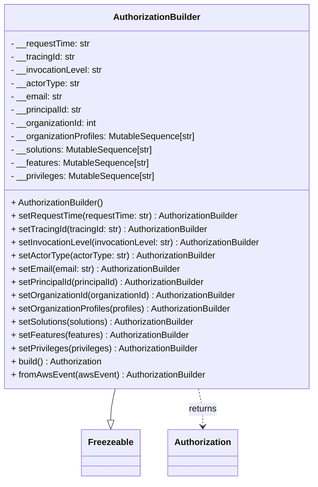

# Diagram: partview_core/partview_service/partview_service/core/messaging/AuthorizationBuilder.py


> Auto-generated by Obscura crawlers

## Diagram 1



### SVG

<svg id="container" width="578.890625" xmlns="http://www.w3.org/2000/svg" class="classDiagram" height="870" viewBox="0 0 578.890625 870" role="graphics-document document" aria-roledescription="class"><style>#container{font-family:"trebuchet ms",verdana,arial,sans-serif;font-size:16px;fill:#333;}@keyframes edge-animation-frame{from{stroke-dashoffset:0;}}@keyframes dash{to{stroke-dashoffset:0;}}#container .edge-animation-slow{stroke-dasharray:9,5!important;stroke-dashoffset:900;animation:dash 50s linear infinite;stroke-linecap:round;}#container .edge-animation-fast{stroke-dasharray:9,5!important;stroke-dashoffset:900;animation:dash 20s linear infinite;stroke-linecap:round;}#container .error-icon{fill:#552222;}#container .error-text{fill:#552222;stroke:#552222;}#container .edge-thickness-normal{stroke-width:1px;}#container .edge-thickness-thick{stroke-width:3.5px;}#container .edge-pattern-solid{stroke-dasharray:0;}#container .edge-thickness-invisible{stroke-width:0;fill:none;}#container .edge-pattern-dashed{stroke-dasharray:3;}#container .edge-pattern-dotted{stroke-dasharray:2;}#container .marker{fill:#333333;stroke:#333333;}#container .marker.cross{stroke:#333333;}#container svg{font-family:"trebuchet ms",verdana,arial,sans-serif;font-size:16px;}#container p{margin:0;}#container g.classGroup text{fill:#9370DB;stroke:none;font-family:"trebuchet ms",verdana,arial,sans-serif;font-size:10px;}#container g.classGroup text .title{font-weight:bolder;}#container .nodeLabel,#container .edgeLabel{color:#131300;}#container .edgeLabel .label rect{fill:#ECECFF;}#container .label text{fill:#131300;}#container .labelBkg{background:#ECECFF;}#container .edgeLabel .label span{background:#ECECFF;}#container .classTitle{font-weight:bolder;}#container .node rect,#container .node circle,#container .node ellipse,#container .node polygon,#container .node path{fill:#ECECFF;stroke:#9370DB;stroke-width:1px;}#container .divider{stroke:#9370DB;stroke-width:1;}#container g.clickable{cursor:pointer;}#container g.classGroup rect{fill:#ECECFF;stroke:#9370DB;}#container g.classGroup line{stroke:#9370DB;stroke-width:1;}#container .classLabel .box{stroke:none;stroke-width:0;fill:#ECECFF;opacity:0.5;}#container .classLabel .label{fill:#9370DB;font-size:10px;}#container .relation{stroke:#333333;stroke-width:1;fill:none;}#container .dashed-line{stroke-dasharray:3;}#container .dotted-line{stroke-dasharray:1 2;}#container #compositionStart,#container .composition{fill:#333333!important;stroke:#333333!important;stroke-width:1;}#container #compositionEnd,#container .composition{fill:#333333!important;stroke:#333333!important;stroke-width:1;}#container #dependencyStart,#container .dependency{fill:#333333!important;stroke:#333333!important;stroke-width:1;}#container #dependencyStart,#container .dependency{fill:#333333!important;stroke:#333333!important;stroke-width:1;}#container #extensionStart,#container .extension{fill:transparent!important;stroke:#333333!important;stroke-width:1;}#container #extensionEnd,#container .extension{fill:transparent!important;stroke:#333333!important;stroke-width:1;}#container #aggregationStart,#container .aggregation{fill:transparent!important;stroke:#333333!important;stroke-width:1;}#container #aggregationEnd,#container .aggregation{fill:transparent!important;stroke:#333333!important;stroke-width:1;}#container #lollipopStart,#container .lollipop{fill:#ECECFF!important;stroke:#333333!important;stroke-width:1;}#container #lollipopEnd,#container .lollipop{fill:#ECECFF!important;stroke:#333333!important;stroke-width:1;}#container .edgeTerminals{font-size:11px;line-height:initial;}#container .classTitleText{text-anchor:middle;font-size:18px;fill:#333;}#container .label-icon{display:inline-block;height:1em;overflow:visible;vertical-align:-0.125em;}#container .node .label-icon path{fill:currentColor;stroke:revert;stroke-width:revert;}#container :root{--mermaid-font-family:"trebuchet ms",verdana,arial,sans-serif;}</style><g><defs><marker id="container_class-aggregationStart" class="marker aggregation class" refX="18" refY="7" markerWidth="190" markerHeight="240" orient="auto"><path d="M 18,7 L9,13 L1,7 L9,1 Z"></path></marker></defs><defs><marker id="container_class-aggregationEnd" class="marker aggregation class" refX="1" refY="7" markerWidth="20" markerHeight="28" orient="auto"><path d="M 18,7 L9,13 L1,7 L9,1 Z"></path></marker></defs><defs><marker id="container_class-extensionStart" class="marker extension class" refX="18" refY="7" markerWidth="190" markerHeight="240" orient="auto"><path d="M 1,7 L18,13 V 1 Z"></path></marker></defs><defs><marker id="container_class-extensionEnd" class="marker extension class" refX="1" refY="7" markerWidth="20" markerHeight="28" orient="auto"><path d="M 1,1 V 13 L18,7 Z"></path></marker></defs><defs><marker id="container_class-compositionStart" class="marker composition class" refX="18" refY="7" markerWidth="190" markerHeight="240" orient="auto"><path d="M 18,7 L9,13 L1,7 L9,1 Z"></path></marker></defs><defs><marker id="container_class-compositionEnd" class="marker composition class" refX="1" refY="7" markerWidth="20" markerHeight="28" orient="auto"><path d="M 18,7 L9,13 L1,7 L9,1 Z"></path></marker></defs><defs><marker id="container_class-dependencyStart" class="marker dependency class" refX="6" refY="7" markerWidth="190" markerHeight="240" orient="auto"><path d="M 5,7 L9,13 L1,7 L9,1 Z"></path></marker></defs><defs><marker id="container_class-dependencyEnd" class="marker dependency class" refX="13" refY="7" markerWidth="20" markerHeight="28" orient="auto"><path d="M 18,7 L9,13 L14,7 L9,1 Z"></path></marker></defs><defs><marker id="container_class-lollipopStart" class="marker lollipop class" refX="13" refY="7" markerWidth="190" markerHeight="240" orient="auto"><circle stroke="black" fill="transparent" cx="7" cy="7" r="6"></circle></marker></defs><defs><marker id="container_class-lollipopEnd" class="marker lollipop class" refX="1" refY="7" markerWidth="190" markerHeight="240" orient="auto"><circle stroke="black" fill="transparent" cx="7" cy="7" r="6"></circle></marker></defs><g class="root"><g class="clusters"></g><g class="edgePaths"><path d="M215.82,704L214.515,710.167C213.211,716.333,210.602,728.667,209.297,738.125C207.992,747.583,207.992,754.167,207.992,757.458L207.992,760.75" id="id_AuthorizationBuilder_Freezeable_1" class="edge-thickness-normal edge-pattern-solid relation" style=";;;" data-edge="true" data-et="edge" data-id="id_AuthorizationBuilder_Freezeable_1" data-points="W3sieCI6MjE1LjgyMDE1MDE2MjMzNzY1LCJ5Ijo3MDR9LHsieCI6MjA3Ljk5MjE4NzUsInkiOjc0MX0seyJ4IjoyMDcuOTkyMTg3NSwieSI6Nzc4fV0=" marker-end="url(#container_class-extensionEnd)"></path><path d="M363.07,704L364.375,710.167C365.68,716.333,368.289,728.667,369.594,740C370.898,751.333,370.898,761.667,370.898,766.833L370.898,772" id="id_AuthorizationBuilder_Authorization_2" class="edge-thickness-normal edge-pattern-dashed relation" style=";;;" data-edge="true" data-et="edge" data-id="id_AuthorizationBuilder_Authorization_2" data-points="W3sieCI6MzYzLjA3MDQ3NDgzNzY2MjM1LCJ5Ijo3MDR9LHsieCI6MzcwLjg5ODQzNzUsInkiOjc0MX0seyJ4IjozNzAuODk4NDM3NSwieSI6Nzc4fV0=" marker-end="url(#container_class-dependencyEnd)"></path></g><g class="edgeLabels"><g class="edgeLabel"><g class="label" data-id="id_AuthorizationBuilder_Freezeable_1" transform="translate(0, 0)"><foreignObject width="0" height="0"><div xmlns="http://www.w3.org/1999/xhtml" class="labelBkg" style="display: table-cell; white-space: nowrap; line-height: 1.5; max-width: 200px; text-align: center;"><span class="edgeLabel"></span></div></foreignObject></g></g><g class="edgeLabel" transform="translate(370.8984375, 741)"><g class="label" data-id="id_AuthorizationBuilder_Authorization_2" transform="translate(-26.265625, -12)"><foreignObject width="52.53125" height="24"><div xmlns="http://www.w3.org/1999/xhtml" class="labelBkg" style="display: table-cell; white-space: nowrap; line-height: 1.5; max-width: 200px; text-align: center;"><span class="edgeLabel"><p>returns</p></span></div></foreignObject></g></g></g><g class="nodes"><g class="node default" id="classId-AuthorizationBuilder-0" transform="translate(289.4453125, 356)"><g class="basic label-container"><path d="M-281.4453125 -348 L281.4453125 -348 L281.4453125 348 L-281.4453125 348" stroke="none" stroke-width="0" fill="#ECECFF" style=""></path><path d="M-281.4453125 -348 C-148.28069615011606 -348, -15.116079800232114 -348, 281.4453125 -348 M-281.4453125 -348 C-139.01492806160883 -348, 3.4154563767823447 -348, 281.4453125 -348 M281.4453125 -348 C281.4453125 -126.12269246419348, 281.4453125 95.75461507161305, 281.4453125 348 M281.4453125 -348 C281.4453125 -118.21448111767128, 281.4453125 111.57103776465743, 281.4453125 348 M281.4453125 348 C127.26319974145974 348, -26.918913017080513 348, -281.4453125 348 M281.4453125 348 C147.498092697709 348, 13.550872895418024 348, -281.4453125 348 M-281.4453125 348 C-281.4453125 182.44481637963074, -281.4453125 16.889632759261474, -281.4453125 -348 M-281.4453125 348 C-281.4453125 173.82548225872696, -281.4453125 -0.3490354825460713, -281.4453125 -348" stroke="#9370DB" stroke-width="1.3" fill="none" stroke-dasharray="0 0" style=""></path></g><g class="annotation-group text" transform="translate(0, -324)"></g><g class="label-group text" transform="translate(-76.234375, -324)"><g class="label" style="font-weight: bolder" transform="translate(0,-12)"><foreignObject width="152.46875" height="24"><div xmlns="http://www.w3.org/1999/xhtml" style="display: table-cell; white-space: nowrap; line-height: 1.5; max-width: 202px; text-align: center;"><span class="nodeLabel markdown-node-label" style=""><p>AuthorizationBuilder</p></span></div></foreignObject></g></g><g class="members-group text" transform="translate(-269.4453125, -276)"><g class="label" style="" transform="translate(0,-12)"><foreignObject width="145.15625" height="24"><div xmlns="http://www.w3.org/1999/xhtml" style="display: table-cell; white-space: nowrap; line-height: 1.5; max-width: 203px; text-align: center;"><span class="nodeLabel markdown-node-label" style=""><p>- __requestTime: str</p></span></div></foreignObject></g><g class="label" style="" transform="translate(0,12)"><foreignObject width="118.59375" height="24"><div xmlns="http://www.w3.org/1999/xhtml" style="display: table-cell; white-space: nowrap; line-height: 1.5; max-width: 177px; text-align: center;"><span class="nodeLabel markdown-node-label" style=""><p>- __tracingId: str</p></span></div></foreignObject></g><g class="label" style="" transform="translate(0,36)"><foreignObject width="168.40625" height="24"><div xmlns="http://www.w3.org/1999/xhtml" style="display: table-cell; white-space: nowrap; line-height: 1.5; max-width: 227px; text-align: center;"><span class="nodeLabel markdown-node-label" style=""><p>- __invocationLevel: str</p></span></div></foreignObject></g><g class="label" style="" transform="translate(0,60)"><foreignObject width="125.5" height="24"><div xmlns="http://www.w3.org/1999/xhtml" style="display: table-cell; white-space: nowrap; line-height: 1.5; max-width: 184px; text-align: center;"><span class="nodeLabel markdown-node-label" style=""><p>- __actorType: str</p></span></div></foreignObject></g><g class="label" style="" transform="translate(0,84)"><foreignObject width="94.859375" height="24"><div xmlns="http://www.w3.org/1999/xhtml" style="display: table-cell; white-space: nowrap; line-height: 1.5; max-width: 153px; text-align: center;"><span class="nodeLabel markdown-node-label" style=""><p>- __email: str</p></span></div></foreignObject></g><g class="label" style="" transform="translate(0,108)"><foreignObject width="133.265625" height="24"><div xmlns="http://www.w3.org/1999/xhtml" style="display: table-cell; white-space: nowrap; line-height: 1.5; max-width: 191px; text-align: center;"><span class="nodeLabel markdown-node-label" style=""><p>- __principalId: str</p></span></div></foreignObject></g><g class="label" style="" transform="translate(0,132)"><foreignObject width="159.234375" height="24"><div xmlns="http://www.w3.org/1999/xhtml" style="display: table-cell; white-space: nowrap; line-height: 1.5; max-width: 217px; text-align: center;"><span class="nodeLabel markdown-node-label" style=""><p>- __organizationId: int</p></span></div></foreignObject></g><g class="label" style="" transform="translate(0,156)"><foreignObject width="338.453125" height="24"><div xmlns="http://www.w3.org/1999/xhtml" style="display: table-cell; white-space: nowrap; line-height: 1.5; max-width: 396px; text-align: center;"><span class="nodeLabel markdown-node-label" style=""><p>- __organizationProfiles: MutableSequence[str]</p></span></div></foreignObject></g><g class="label" style="" transform="translate(0,180)"><foreignObject width="261.703125" height="24"><div xmlns="http://www.w3.org/1999/xhtml" style="display: table-cell; white-space: nowrap; line-height: 1.5; max-width: 319px; text-align: center;"><span class="nodeLabel markdown-node-label" style=""><p>- __solutions: MutableSequence[str]</p></span></div></foreignObject></g><g class="label" style="" transform="translate(0,204)"><foreignObject width="253.53125" height="24"><div xmlns="http://www.w3.org/1999/xhtml" style="display: table-cell; white-space: nowrap; line-height: 1.5; max-width: 311px; text-align: center;"><span class="nodeLabel markdown-node-label" style=""><p>- __features: MutableSequence[str]</p></span></div></foreignObject></g><g class="label" style="" transform="translate(0,228)"><foreignObject width="264.5625" height="24"><div xmlns="http://www.w3.org/1999/xhtml" style="display: table-cell; white-space: nowrap; line-height: 1.5; max-width: 322px; text-align: center;"><span class="nodeLabel markdown-node-label" style=""><p>- __privileges: MutableSequence[str]</p></span></div></foreignObject></g></g><g class="methods-group text" transform="translate(-269.4453125, 12)"><g class="label" style="" transform="translate(0,-12)"><foreignObject width="173.359375" height="24"><div xmlns="http://www.w3.org/1999/xhtml" style="display: table-cell; white-space: nowrap; line-height: 1.5; max-width: 231px; text-align: center;"><span class="nodeLabel markdown-node-label" style=""><p>+ AuthorizationBuilder()</p></span></div></foreignObject></g><g class="label" style="" transform="translate(0,12)"><foreignObject width="419.84375" height="24"><div xmlns="http://www.w3.org/1999/xhtml" style="display: table-cell; white-space: nowrap; line-height: 1.5; max-width: 478px; text-align: center;"><span class="nodeLabel markdown-node-label" style=""><p>+ setRequestTime(requestTime: str) : AuthorizationBuilder</p></span></div></foreignObject></g><g class="label" style="" transform="translate(0,36)"><foreignObject width="365.640625" height="24"><div xmlns="http://www.w3.org/1999/xhtml" style="display: table-cell; white-space: nowrap; line-height: 1.5; max-width: 424px; text-align: center;"><span class="nodeLabel markdown-node-label" style=""><p>+ setTracingId(tracingId: str) : AuthorizationBuilder</p></span></div></foreignObject></g><g class="label" style="" transform="translate(0,60)"><foreignObject width="462.65625" height="24"><div xmlns="http://www.w3.org/1999/xhtml" style="display: table-cell; white-space: nowrap; line-height: 1.5; max-width: 521px; text-align: center;"><span class="nodeLabel markdown-node-label" style=""><p>+ setInvocationLevel(invocationLevel: str) : AuthorizationBuilder</p></span></div></foreignObject></g><g class="label" style="" transform="translate(0,84)"><foreignObject width="377.875" height="24"><div xmlns="http://www.w3.org/1999/xhtml" style="display: table-cell; white-space: nowrap; line-height: 1.5; max-width: 436px; text-align: center;"><span class="nodeLabel markdown-node-label" style=""><p>+ setActorType(actorType: str) : AuthorizationBuilder</p></span></div></foreignObject></g><g class="label" style="" transform="translate(0,108)"><foreignObject width="315.65625" height="24"><div xmlns="http://www.w3.org/1999/xhtml" style="display: table-cell; white-space: nowrap; line-height: 1.5; max-width: 374px; text-align: center;"><span class="nodeLabel markdown-node-label" style=""><p>+ setEmail(email: str) : AuthorizationBuilder</p></span></div></foreignObject></g><g class="label" style="" transform="translate(0,132)"><foreignObject width="364.296875" height="24"><div xmlns="http://www.w3.org/1999/xhtml" style="display: table-cell; white-space: nowrap; line-height: 1.5; max-width: 422px; text-align: center;"><span class="nodeLabel markdown-node-label" style=""><p>+ setPrincipalId(principalId) : AuthorizationBuilder</p></span></div></foreignObject></g><g class="label" style="" transform="translate(0,156)"><foreignObject width="418.65625" height="24"><div xmlns="http://www.w3.org/1999/xhtml" style="display: table-cell; white-space: nowrap; line-height: 1.5; max-width: 477px; text-align: center;"><span class="nodeLabel markdown-node-label" style=""><p>+ setOrganizationId(organizationId) : AuthorizationBuilder</p></span></div></foreignObject></g><g class="label" style="" transform="translate(0,180)"><foreignObject width="408.28125" height="24"><div xmlns="http://www.w3.org/1999/xhtml" style="display: table-cell; white-space: nowrap; line-height: 1.5; max-width: 466px; text-align: center;"><span class="nodeLabel markdown-node-label" style=""><p>+ setOrganizationProfiles(profiles) : AuthorizationBuilder</p></span></div></foreignObject></g><g class="label" style="" transform="translate(0,204)"><foreignObject width="343.484375" height="24"><div xmlns="http://www.w3.org/1999/xhtml" style="display: table-cell; white-space: nowrap; line-height: 1.5; max-width: 402px; text-align: center;"><span class="nodeLabel markdown-node-label" style=""><p>+ setSolutions(solutions) : AuthorizationBuilder</p></span></div></foreignObject></g><g class="label" style="" transform="translate(0,228)"><foreignObject width="328.609375" height="24"><div xmlns="http://www.w3.org/1999/xhtml" style="display: table-cell; white-space: nowrap; line-height: 1.5; max-width: 387px; text-align: center;"><span class="nodeLabel markdown-node-label" style=""><p>+ setFeatures(features) : AuthorizationBuilder</p></span></div></foreignObject></g><g class="label" style="" transform="translate(0,252)"><foreignObject width="347.4375" height="24"><div xmlns="http://www.w3.org/1999/xhtml" style="display: table-cell; white-space: nowrap; line-height: 1.5; max-width: 406px; text-align: center;"><span class="nodeLabel markdown-node-label" style=""><p>+ setPrivileges(privileges) : AuthorizationBuilder</p></span></div></foreignObject></g><g class="label" style="" transform="translate(0,276)"><foreignObject width="170.546875" height="24"><div xmlns="http://www.w3.org/1999/xhtml" style="display: table-cell; white-space: nowrap; line-height: 1.5; max-width: 228px; text-align: center;"><span class="nodeLabel markdown-node-label" style=""><p>+ build() : Authorization</p></span></div></foreignObject></g><g class="label" style="" transform="translate(0,300)"><foreignObject width="355.296875" height="24"><div xmlns="http://www.w3.org/1999/xhtml" style="display: table-cell; white-space: nowrap; line-height: 1.5; max-width: 413px; text-align: center;"><span class="nodeLabel markdown-node-label" style=""><p>+ fromAwsEvent(awsEvent) : AuthorizationBuilder</p></span></div></foreignObject></g></g><g class="divider" style=""><path d="M-281.4453125 -300 C-97.91884733125241 -300, 85.60761783749518 -300, 281.4453125 -300 M-281.4453125 -300 C-109.30301862462247 -300, 62.839275250755065 -300, 281.4453125 -300" stroke="#9370DB" stroke-width="1.3" fill="none" stroke-dasharray="0 0" style=""></path></g><g class="divider" style=""><path d="M-281.4453125 -12 C-116.33583389871333 -12, 48.773644702573336 -12, 281.4453125 -12 M-281.4453125 -12 C-71.31467734485895 -12, 138.8159578102821 -12, 281.4453125 -12" stroke="#9370DB" stroke-width="1.3" fill="none" stroke-dasharray="0 0" style=""></path></g></g><g class="node default" id="classId-Freezeable-1" transform="translate(207.9921875, 820)"><g class="basic label-container"><path d="M-51.1953125 -42 L51.1953125 -42 L51.1953125 42 L-51.1953125 42" stroke="none" stroke-width="0" fill="#ECECFF" style=""></path><path d="M-51.1953125 -42 C-13.088044947094623 -42, 25.019222605810754 -42, 51.1953125 -42 M-51.1953125 -42 C-15.807962264851781 -42, 19.579387970296438 -42, 51.1953125 -42 M51.1953125 -42 C51.1953125 -16.15295117933751, 51.1953125 9.69409764132498, 51.1953125 42 M51.1953125 -42 C51.1953125 -23.1802393434618, 51.1953125 -4.360478686923599, 51.1953125 42 M51.1953125 42 C29.73300816554749 42, 8.270703831094977 42, -51.1953125 42 M51.1953125 42 C28.99722300899381 42, 6.79913351798762 42, -51.1953125 42 M-51.1953125 42 C-51.1953125 13.789972469115877, -51.1953125 -14.420055061768245, -51.1953125 -42 M-51.1953125 42 C-51.1953125 21.55585738404285, -51.1953125 1.1117147680856974, -51.1953125 -42" stroke="#9370DB" stroke-width="1.3" fill="none" stroke-dasharray="0 0" style=""></path></g><g class="annotation-group text" transform="translate(0, -18)"></g><g class="label-group text" transform="translate(-39.1953125, -18)"><g class="label" style="font-weight: bolder" transform="translate(0,-12)"><foreignObject width="78.390625" height="24"><div xmlns="http://www.w3.org/1999/xhtml" style="display: table-cell; white-space: nowrap; line-height: 1.5; max-width: 127px; text-align: center;"><span class="nodeLabel markdown-node-label" style=""><p>Freezeable</p></span></div></foreignObject></g></g><g class="members-group text" transform="translate(-39.1953125, 30)"></g><g class="methods-group text" transform="translate(-39.1953125, 60)"></g><g class="divider" style=""><path d="M-51.1953125 6 C-26.501752948629125 6, -1.8081933972582505 6, 51.1953125 6 M-51.1953125 6 C-12.469431702071219 6, 26.256449095857562 6, 51.1953125 6" stroke="#9370DB" stroke-width="1.3" fill="none" stroke-dasharray="0 0" style=""></path></g><g class="divider" style=""><path d="M-51.1953125 24 C-29.17655726795619 24, -7.157802035912383 24, 51.1953125 24 M-51.1953125 24 C-10.926496609358693 24, 29.342319281282613 24, 51.1953125 24" stroke="#9370DB" stroke-width="1.3" fill="none" stroke-dasharray="0 0" style=""></path></g></g><g class="node default" id="classId-Authorization-2" transform="translate(370.8984375, 820)"><g class="basic label-container"><path d="M-61.7109375 -42 L61.7109375 -42 L61.7109375 42 L-61.7109375 42" stroke="none" stroke-width="0" fill="#ECECFF" style=""></path><path d="M-61.7109375 -42 C-29.03995698607868 -42, 3.6310235278426433 -42, 61.7109375 -42 M-61.7109375 -42 C-34.35311838379546 -42, -6.995299267590923 -42, 61.7109375 -42 M61.7109375 -42 C61.7109375 -23.357553176717694, 61.7109375 -4.715106353435388, 61.7109375 42 M61.7109375 -42 C61.7109375 -11.085556759398631, 61.7109375 19.828886481202737, 61.7109375 42 M61.7109375 42 C26.188154831381986 42, -9.334627837236027 42, -61.7109375 42 M61.7109375 42 C14.310217863764919 42, -33.09050177247016 42, -61.7109375 42 M-61.7109375 42 C-61.7109375 10.325511792010893, -61.7109375 -21.348976415978214, -61.7109375 -42 M-61.7109375 42 C-61.7109375 13.480178673416326, -61.7109375 -15.039642653167348, -61.7109375 -42" stroke="#9370DB" stroke-width="1.3" fill="none" stroke-dasharray="0 0" style=""></path></g><g class="annotation-group text" transform="translate(0, -18)"></g><g class="label-group text" transform="translate(-49.7109375, -18)"><g class="label" style="font-weight: bolder" transform="translate(0,-12)"><foreignObject width="99.421875" height="24"><div xmlns="http://www.w3.org/1999/xhtml" style="display: table-cell; white-space: nowrap; line-height: 1.5; max-width: 148px; text-align: center;"><span class="nodeLabel markdown-node-label" style=""><p>Authorization</p></span></div></foreignObject></g></g><g class="members-group text" transform="translate(-49.7109375, 30)"></g><g class="methods-group text" transform="translate(-49.7109375, 60)"></g><g class="divider" style=""><path d="M-61.7109375 6 C-14.570566221668834 6, 32.56980505666233 6, 61.7109375 6 M-61.7109375 6 C-36.9632019808081 6, -12.215466461616202 6, 61.7109375 6" stroke="#9370DB" stroke-width="1.3" fill="none" stroke-dasharray="0 0" style=""></path></g><g class="divider" style=""><path d="M-61.7109375 24 C-34.08481065187561 24, -6.458683803751214 24, 61.7109375 24 M-61.7109375 24 C-30.238842699999037 24, 1.233252100001927 24, 61.7109375 24" stroke="#9370DB" stroke-width="1.3" fill="none" stroke-dasharray="0 0" style=""></path></g></g></g></g></g></svg>

## Diagram 2

```mermaid
flowchart TD
    A[awsEvent] --> B{requestContext present?}
    B -->|yes| C[authorizer = requestContext.authorizer]
    B -->|no| D[authorizer = {}]
    C --> E[requestId ← requestContext.requestId]
    C --> F[requestTime ← requestContext.requestTime]
    C --> G[invocationLevel ← requestContext.lambda_level]
    C --> H[actorType ← authorizer.actor_type or "human"]
    C --> I[email ← authorizer.email]
    C --> J[principalId ← authorizer.principalId]
    C --> K[organizationId ← authorizer.organization_id]
    C --> L[organizationProfiles ← authorizer.org_profiles]
    C --> M[solutions ← authorizer.solutions]
    C --> N[features ← authorizer.features]
    C --> O[privileges ← authorizer.privileges]
    E & F & G & H & I & J & K & L & M & N & O --> P[set fields on AuthorizationBuilder]
    P --> Q[return self (AuthorizationBuilder)]
```

> SVG rendering failed for this diagram.
