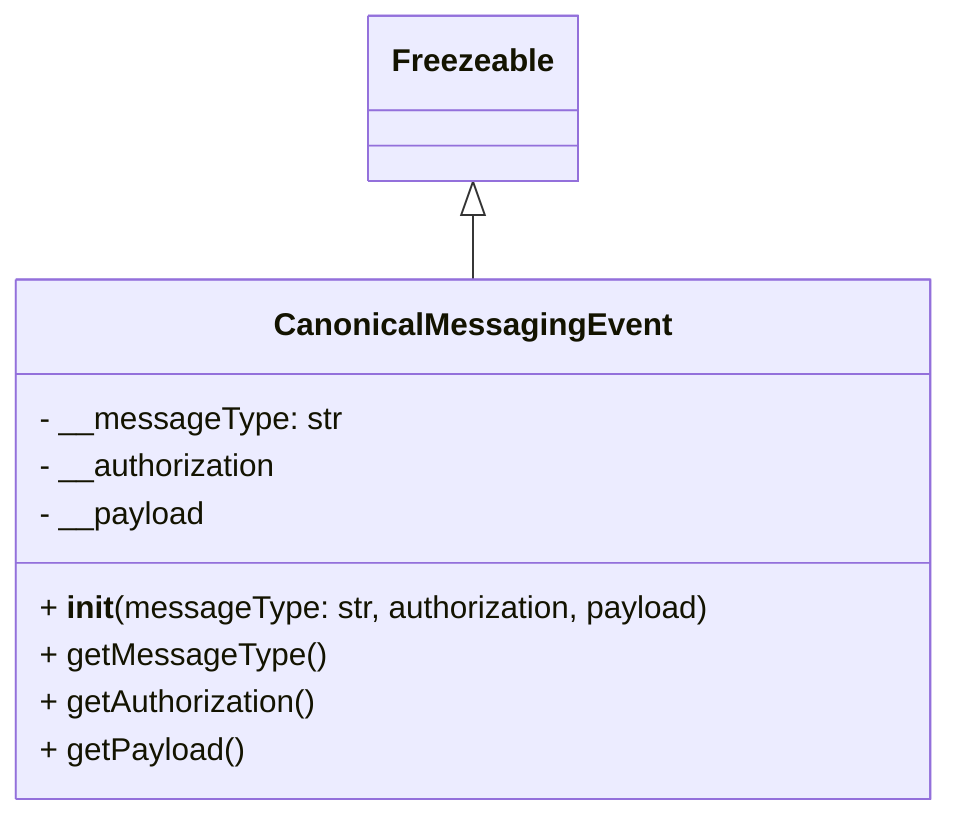

# Diagram: partview_core/partview_service/partview_service/core/messaging/CanonicalMessagingEvent.py

> Auto-generated by Obscura crawlers

## Mermaid

### SVG

<svg id="container" width="474.953125" xmlns="http://www.w3.org/2000/svg" class="classDiagram" height="414" viewBox="0 0 474.953125 414" role="graphics-document document" aria-roledescription="class"><g><defs><marker id="container_class-aggregationStart" class="marker aggregation class" refX="18" refY="7" markerWidth="190" markerHeight="240" orient="auto"><path d="M 18,7 L9,13 L1,7 L9,1 Z"></path></marker></defs><defs><marker id="container_class-aggregationEnd" class="marker aggregation class" refX="1" refY="7" markerWidth="20" markerHeight="28" orient="auto"><path d="M 18,7 L9,13 L1,7 L9,1 Z"></path></marker></defs><defs><marker id="container_class-extensionStart" class="marker extension class" refX="18" refY="7" markerWidth="190" markerHeight="240" orient="auto"><path d="M 1,7 L18,13 V 1 Z"></path></marker></defs><defs><marker id="container_class-extensionEnd" class="marker extension class" refX="1" refY="7" markerWidth="20" markerHeight="28" orient="auto"><path d="M 1,1 V 13 L18,7 Z"></path></marker></defs><defs><marker id="container_class-compositionStart" class="marker composition class" refX="18" refY="7" markerWidth="190" markerHeight="240" orient="auto"><path d="M 18,7 L9,13 L1,7 L9,1 Z"></path></marker></defs><defs><marker id="container_class-compositionEnd" class="marker composition class" refX="1" refY="7" markerWidth="20" markerHeight="28" orient="auto"><path d="M 18,7 L9,13 L1,7 L9,1 Z"></path></marker></defs><defs><marker id="container_class-dependencyStart" class="marker dependency class" refX="6" refY="7" markerWidth="190" markerHeight="240" orient="auto"><path d="M 5,7 L9,13 L1,7 L9,1 Z"></path></marker></defs><defs><marker id="container_class-dependencyEnd" class="marker dependency class" refX="13" refY="7" markerWidth="20" markerHeight="28" orient="auto"><path d="M 18,7 L9,13 L14,7 L9,1 Z"></path></marker></defs><defs><marker id="container_class-lollipopStart" class="marker lollipop class" refX="13" refY="7" markerWidth="190" markerHeight="240" orient="auto"><circle stroke="black" fill="transparent" cx="7" cy="7" r="6"></circle></marker></defs><defs><marker id="container_class-lollipopEnd" class="marker lollipop class" refX="1" refY="7" markerWidth="190" markerHeight="240" orient="auto"><circle stroke="black" fill="transparent" cx="7" cy="7" r="6"></circle></marker></defs><g class="root"><g class="clusters"></g><g class="edgePaths"><path d="M237.477,109.25L237.477,110.542C237.477,111.833,237.477,114.417,237.477,119.875C237.477,125.333,237.477,133.667,237.477,137.833L237.477,142" id="id_Freezeable_CanonicalMessagingEvent_1" class="edge-thickness-normal edge-pattern-solid relation" style=";;;" data-edge="true" data-et="edge" data-id="id_Freezeable_CanonicalMessagingEvent_1" data-points="W3sieCI6MjM3LjQ3NjU2MjUsInkiOjkyfSx7IngiOjIzNy40NzY1NjI1LCJ5IjoxMTd9LHsieCI6MjM3LjQ3NjU2MjUsInkiOjE0Mn1d" marker-start="url(#container_class-extensionStart)"></path></g><g class="edgeLabels"><g class="edgeLabel"><g class="label" data-id="id_Freezeable_CanonicalMessagingEvent_1" transform="translate(0, 0)"><foreignObject width="0" height="0">

</foreignObject></g></g></g><g class="nodes"><g class="node default" id="classId-Freezeable-0" transform="translate(237.4765625, 50)"><g class="basic label-container"><path d="M-51.1953125 -42 L51.1953125 -42 L51.1953125 42 L-51.1953125 42" stroke="none" stroke-width="0" fill="#ECECFF" style=""></path><path d="M-51.1953125 -42 C-10.466513060958249 -42, 30.262286378083502 -42, 51.1953125 -42 M-51.1953125 -42 C-11.145888961091373 -42, 28.903534577817254 -42, 51.1953125 -42 M51.1953125 -42 C51.1953125 -10.638017562862391, 51.1953125 20.723964874275218, 51.1953125 42 M51.1953125 -42 C51.1953125 -22.14766730396037, 51.1953125 -2.2953346079207435, 51.1953125 42 M51.1953125 42 C14.364015420738014 42, -22.467281658523973 42, -51.1953125 42 M51.1953125 42 C13.204551259970728 42, -24.786209980058544 42, -51.1953125 42 M-51.1953125 42 C-51.1953125 20.781043495022313, -51.1953125 -0.4379130099553734, -51.1953125 -42 M-51.1953125 42 C-51.1953125 9.977108022673619, -51.1953125 -22.045783954652762, -51.1953125 -42" stroke="#9370DB" stroke-width="1.3" fill="none" stroke-dasharray="0 0" style=""></path></g><g class="annotation-group text" transform="translate(0, -18)"></g><g class="label-group text" transform="translate(-39.1953125, -18)"><g class="label" style="font-weight: bolder" transform="translate(0,-12)"><foreignObject width="78.390625" height="24">

Freezeable

</foreignObject></g></g><g class="members-group text" transform="translate(-39.1953125, 30)"></g><g class="methods-group text" transform="translate(-39.1953125, 60)"></g><g class="divider" style=""><path d="M-51.1953125 6 C-18.432708284826347 6, 14.329895930347305 6, 51.1953125 6 M-51.1953125 6 C-20.38163807943384 6, 10.432036341132317 6, 51.1953125 6" stroke="#9370DB" stroke-width="1.3" fill="none" stroke-dasharray="0 0" style=""></path></g><g class="divider" style=""><path d="M-51.1953125 24 C-10.339410092275088 24, 30.516492315449824 24, 51.1953125 24 M-51.1953125 24 C-15.489578686592694 24, 20.216155126814613 24, 51.1953125 24" stroke="#9370DB" stroke-width="1.3" fill="none" stroke-dasharray="0 0" style=""></path></g></g><g class="node default" id="classId-CanonicalMessagingEvent-1" transform="translate(237.4765625, 274)"><g class="basic label-container"><path d="M-229.4765625 -132 L229.4765625 -132 L229.4765625 132 L-229.4765625 132" stroke="none" stroke-width="0" fill="#ECECFF" style=""></path><path d="M-229.4765625 -132 C-119.27751001566342 -132, -9.078457531326848 -132, 229.4765625 -132 M-229.4765625 -132 C-115.07220265005498 -132, -0.6678428001099519 -132, 229.4765625 -132 M229.4765625 -132 C229.4765625 -31.41455942089773, 229.4765625 69.17088115820454, 229.4765625 132 M229.4765625 -132 C229.4765625 -56.41436026761936, 229.4765625 19.171279464761284, 229.4765625 132 M229.4765625 132 C59.34007927749107 132, -110.79640394501786 132, -229.4765625 132 M229.4765625 132 C91.37375939056082 132, -46.72904371887836 132, -229.4765625 132 M-229.4765625 132 C-229.4765625 34.01280489873416, -229.4765625 -63.97439020253168, -229.4765625 -132 M-229.4765625 132 C-229.4765625 56.57015274039149, -229.4765625 -18.859694519217015, -229.4765625 -132" stroke="#9370DB" stroke-width="1.3" fill="none" stroke-dasharray="0 0" style=""></path></g><g class="annotation-group text" transform="translate(0, -108)"></g><g class="label-group text" transform="translate(-94, -108)"><g class="label" style="font-weight: bolder" transform="translate(0,-12)"><foreignObject width="188" height="24">

CanonicalMessagingEvent

</foreignObject></g></g><g class="members-group text" transform="translate(-217.4765625, -60)"><g class="label" style="" transform="translate(0,-12)"><foreignObject width="150.796875" height="24">

- __messageType: str

</foreignObject></g><g class="label" style="" transform="translate(0,12)"><foreignObject width="124.515625" height="24">

- __authorization

</foreignObject></g><g class="label" style="" transform="translate(0,36)"><foreignObject width="84.921875" height="24">

- __payload

</foreignObject></g></g><g class="methods-group text" transform="translate(-217.4765625, 36)"><g class="label" style="" transform="translate(0,-12)"><foreignObject width="340.953125" height="24">

+ <strong>init</strong>(messageType: str, authorization, payload)

</foreignObject></g><g class="label" style="" transform="translate(0,12)"><foreignObject width="140.015625" height="24">

+ getMessageType()

</foreignObject></g><g class="label" style="" transform="translate(0,36)"><foreignObject width="143.28125" height="24">

+ getAuthorization()

</foreignObject></g><g class="label" style="" transform="translate(0,60)"><foreignObject width="101.96875" height="24">

+ getPayload()

</foreignObject></g></g><g class="divider" style=""><path d="M-229.4765625 -84 C-51.16014975531482 -84, 127.15626298937036 -84, 229.4765625 -84 M-229.4765625 -84 C-126.45677761386807 -84, -23.43699272773614 -84, 229.4765625 -84" stroke="#9370DB" stroke-width="1.3" fill="none" stroke-dasharray="0 0" style=""></path></g><g class="divider" style=""><path d="M-229.4765625 12 C-72.80546046318736 12, 83.86564157362528 12, 229.4765625 12 M-229.4765625 12 C-96.8052401962704 12, 35.86608210745919 12, 229.4765625 12" stroke="#9370DB" stroke-width="1.3" fill="none" stroke-dasharray="0 0" style=""></path></g></g></g></g></g></svg>
