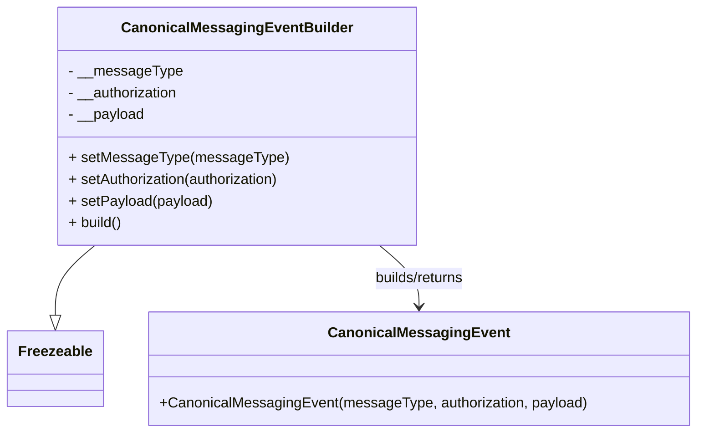

# Diagram: partview_core/partview_service/partview_service/core/messaging/CanonicalMessagingEventBuilder.py

> Auto-generated by Obscura crawlers

## Mermaid

### SVG

<svg id="container" width="757.890625" xmlns="http://www.w3.org/2000/svg" class="classDiagram" height="480" viewBox="0 0 757.890625 480" role="graphics-document document" aria-roledescription="class"><g><defs><marker id="container_class-aggregationStart" class="marker aggregation class" refX="18" refY="7" markerWidth="190" markerHeight="240" orient="auto"><path d="M 18,7 L9,13 L1,7 L9,1 Z"></path></marker></defs><defs><marker id="container_class-aggregationEnd" class="marker aggregation class" refX="1" refY="7" markerWidth="20" markerHeight="28" orient="auto"><path d="M 18,7 L9,13 L1,7 L9,1 Z"></path></marker></defs><defs><marker id="container_class-extensionStart" class="marker extension class" refX="18" refY="7" markerWidth="190" markerHeight="240" orient="auto"><path d="M 1,7 L18,13 V 1 Z"></path></marker></defs><defs><marker id="container_class-extensionEnd" class="marker extension class" refX="1" refY="7" markerWidth="20" markerHeight="28" orient="auto"><path d="M 1,1 V 13 L18,7 Z"></path></marker></defs><defs><marker id="container_class-compositionStart" class="marker composition class" refX="18" refY="7" markerWidth="190" markerHeight="240" orient="auto"><path d="M 18,7 L9,13 L1,7 L9,1 Z"></path></marker></defs><defs><marker id="container_class-compositionEnd" class="marker composition class" refX="1" refY="7" markerWidth="20" markerHeight="28" orient="auto"><path d="M 18,7 L9,13 L1,7 L9,1 Z"></path></marker></defs><defs><marker id="container_class-dependencyStart" class="marker dependency class" refX="6" refY="7" markerWidth="190" markerHeight="240" orient="auto"><path d="M 5,7 L9,13 L1,7 L9,1 Z"></path></marker></defs><defs><marker id="container_class-dependencyEnd" class="marker dependency class" refX="13" refY="7" markerWidth="20" markerHeight="28" orient="auto"><path d="M 18,7 L9,13 L14,7 L9,1 Z"></path></marker></defs><defs><marker id="container_class-lollipopStart" class="marker lollipop class" refX="13" refY="7" markerWidth="190" markerHeight="240" orient="auto"><circle stroke="black" fill="transparent" cx="7" cy="7" r="6"></circle></marker></defs><defs><marker id="container_class-lollipopEnd" class="marker lollipop class" refX="1" refY="7" markerWidth="190" markerHeight="240" orient="auto"><circle stroke="black" fill="transparent" cx="7" cy="7" r="6"></circle></marker></defs><g class="root"><g class="clusters"></g><g class="edgePaths"><path d="M102.538,272L95.315,278.167C88.091,284.333,73.643,296.667,66.419,309.625C59.195,322.583,59.195,336.167,59.195,342.958L59.195,349.75" id="id_CanonicalMessagingEventBuilder_Freezeable_1" class="edge-thickness-normal edge-pattern-solid relation" style=";;;" data-edge="true" data-et="edge" data-id="id_CanonicalMessagingEventBuilder_Freezeable_1" data-points="W3sieCI6MTAyLjUzODQzODQyNDU1NjIsInkiOjI3Mn0seyJ4Ijo1OS4xOTUzMTI1LCJ5IjozMDl9LHsieCI6NTkuMTk1MzEyNSwieSI6MzY3fV0=" marker-end="url(#container_class-extensionEnd)"></path><path d="M411.797,272L419.021,278.167C426.245,284.333,440.693,296.667,447.917,308C455.141,319.333,455.141,329.667,455.141,334.833L455.141,340" id="id_CanonicalMessagingEventBuilder_CanonicalMessagingEvent_2" class="edge-thickness-normal edge-pattern-solid relation" style=";;;" data-edge="true" data-et="edge" data-id="id_CanonicalMessagingEventBuilder_CanonicalMessagingEvent_2" data-points="W3sieCI6NDExLjc5NzQ5OTA3NTQ0MzgsInkiOjI3Mn0seyJ4Ijo0NTUuMTQwNjI1LCJ5IjozMDl9LHsieCI6NDU1LjE0MDYyNSwieSI6MzQ2fV0=" marker-end="url(#container_class-dependencyEnd)"></path></g><g class="edgeLabels"><g class="edgeLabel"><g class="label" data-id="id_CanonicalMessagingEventBuilder_Freezeable_1" transform="translate(0, 0)"><foreignObject width="0" height="0">

</foreignObject></g></g><g class="edgeLabel" transform="translate(455.140625, 309)"><g class="label" data-id="id_CanonicalMessagingEventBuilder_CanonicalMessagingEvent_2" transform="translate(-52.6796875, -12)"><foreignObject width="105.359375" height="24">

builds/returns

</foreignObject></g></g></g><g class="nodes"><g class="node default" id="classId-Freezeable-0" transform="translate(59.1953125, 409)"><g class="basic label-container"><path d="M-51.1953125 -42 L51.1953125 -42 L51.1953125 42 L-51.1953125 42" stroke="none" stroke-width="0" fill="#ECECFF" style=""></path><path d="M-51.1953125 -42 C-22.13555046023899 -42, 6.924211579522023 -42, 51.1953125 -42 M-51.1953125 -42 C-10.9963682379504 -42, 29.2025760240992 -42, 51.1953125 -42 M51.1953125 -42 C51.1953125 -22.726636425503614, 51.1953125 -3.4532728510072275, 51.1953125 42 M51.1953125 -42 C51.1953125 -21.20070430979106, 51.1953125 -0.4014086195821207, 51.1953125 42 M51.1953125 42 C13.666655023085077 42, -23.862002453829845 42, -51.1953125 42 M51.1953125 42 C30.51182021930421 42, 9.828327938608417 42, -51.1953125 42 M-51.1953125 42 C-51.1953125 18.00729565069445, -51.1953125 -5.985408698611103, -51.1953125 -42 M-51.1953125 42 C-51.1953125 16.555670485579117, -51.1953125 -8.888659028841765, -51.1953125 -42" stroke="#9370DB" stroke-width="1.3" fill="none" stroke-dasharray="0 0" style=""></path></g><g class="annotation-group text" transform="translate(0, -18)"></g><g class="label-group text" transform="translate(-39.1953125, -18)"><g class="label" style="font-weight: bolder" transform="translate(0,-12)"><foreignObject width="78.390625" height="24">

Freezeable

</foreignObject></g></g><g class="members-group text" transform="translate(-39.1953125, 30)"></g><g class="methods-group text" transform="translate(-39.1953125, 60)"></g><g class="divider" style=""><path d="M-51.1953125 6 C-18.032138832978752 6, 15.131034834042495 6, 51.1953125 6 M-51.1953125 6 C-10.321938898510247 6, 30.551434702979506 6, 51.1953125 6" stroke="#9370DB" stroke-width="1.3" fill="none" stroke-dasharray="0 0" style=""></path></g><g class="divider" style=""><path d="M-51.1953125 24 C-14.175935379297734 24, 22.843441741404533 24, 51.1953125 24 M-51.1953125 24 C-16.08904765147897 24, 19.017217197042058 24, 51.1953125 24" stroke="#9370DB" stroke-width="1.3" fill="none" stroke-dasharray="0 0" style=""></path></g></g><g class="node default" id="classId-CanonicalMessagingEvent-1" transform="translate(455.140625, 409)"><g class="basic label-container"><path d="M-294.75 -63 L294.75 -63 L294.75 63 L-294.75 63" stroke="none" stroke-width="0" fill="#ECECFF" style=""></path><path d="M-294.75 -63 C-67.76971498636723 -63, 159.21057002726553 -63, 294.75 -63 M-294.75 -63 C-137.73779069891495 -63, 19.2744186021701 -63, 294.75 -63 M294.75 -63 C294.75 -20.113464490926916, 294.75 22.77307101814617, 294.75 63 M294.75 -63 C294.75 -34.29947595512563, 294.75 -5.598951910251266, 294.75 63 M294.75 63 C122.93291034955246 63, -48.884179300895084 63, -294.75 63 M294.75 63 C152.9141111568045 63, 11.07822231360899 63, -294.75 63 M-294.75 63 C-294.75 34.97548940850274, -294.75 6.950978817005478, -294.75 -63 M-294.75 63 C-294.75 22.558405153095343, -294.75 -17.883189693809314, -294.75 -63" stroke="#9370DB" stroke-width="1.3" fill="none" stroke-dasharray="0 0" style=""></path></g><g class="annotation-group text" transform="translate(0, -39)"></g><g class="label-group text" transform="translate(-94, -39)"><g class="label" style="font-weight: bolder" transform="translate(0,-12)"><foreignObject width="188" height="24">

CanonicalMessagingEvent

</foreignObject></g></g><g class="members-group text" transform="translate(-282.75, 9)"></g><g class="methods-group text" transform="translate(-282.75, 39)"><g class="label" style="" transform="translate(0,-12)"><foreignObject width="471.5" height="24">

+CanonicalMessagingEvent(messageType, authorization, payload)

</foreignObject></g></g><g class="divider" style=""><path d="M-294.75 -15 C-83.04168568354197 -15, 128.66662863291606 -15, 294.75 -15 M-294.75 -15 C-173.3248353133415 -15, -51.89967062668302 -15, 294.75 -15" stroke="#9370DB" stroke-width="1.3" fill="none" stroke-dasharray="0 0" style=""></path></g><g class="divider" style=""><path d="M-294.75 9 C-125.19220587464949 9, 44.36558825070102 9, 294.75 9 M-294.75 9 C-98.283102894021 9, 98.183794211958 9, 294.75 9" stroke="#9370DB" stroke-width="1.3" fill="none" stroke-dasharray="0 0" style=""></path></g></g><g class="node default" id="classId-CanonicalMessagingEventBuilder-2" transform="translate(257.16796875, 140)"><g class="basic label-container"><path d="M-192.44140625 -132 L192.44140625 -132 L192.44140625 132 L-192.44140625 132" stroke="none" stroke-width="0" fill="#ECECFF" style=""></path><path d="M-192.44140625 -132 C-76.12167962215041 -132, 40.19804700569918 -132, 192.44140625 -132 M-192.44140625 -132 C-81.44407139203588 -132, 29.55326346592824 -132, 192.44140625 -132 M192.44140625 -132 C192.44140625 -30.714035921102337, 192.44140625 70.57192815779533, 192.44140625 132 M192.44140625 -132 C192.44140625 -67.65882271185218, 192.44140625 -3.317645423704363, 192.44140625 132 M192.44140625 132 C45.562745591770124 132, -101.31591506645975 132, -192.44140625 132 M192.44140625 132 C64.30046534389635 132, -63.8404755622073 132, -192.44140625 132 M-192.44140625 132 C-192.44140625 46.817641171857446, -192.44140625 -38.36471765628511, -192.44140625 -132 M-192.44140625 132 C-192.44140625 27.957130687701166, -192.44140625 -76.08573862459767, -192.44140625 -132" stroke="#9370DB" stroke-width="1.3" fill="none" stroke-dasharray="0 0" style=""></path></g><g class="annotation-group text" transform="translate(0, -108)"></g><g class="label-group text" transform="translate(-120.5234375, -108)"><g class="label" style="font-weight: bolder" transform="translate(0,-12)"><foreignObject width="241.046875" height="24">

CanonicalMessagingEventBuilder

</foreignObject></g></g><g class="members-group text" transform="translate(-180.44140625, -60)"><g class="label" style="" transform="translate(0,-12)"><foreignObject width="123.28125" height="24">

- __messageType

</foreignObject></g><g class="label" style="" transform="translate(0,12)"><foreignObject width="124.515625" height="24">

- __authorization

</foreignObject></g><g class="label" style="" transform="translate(0,36)"><foreignObject width="84.921875" height="24">

- __payload

</foreignObject></g></g><g class="methods-group text" transform="translate(-180.44140625, 36)"><g class="label" style="" transform="translate(0,-12)"><foreignObject width="235.53125" height="24">

+ setMessageType(messageType)

</foreignObject></g><g class="label" style="" transform="translate(0,12)"><foreignObject width="240.359375" height="24">

+ setAuthorization(authorization)

</foreignObject></g><g class="label" style="" transform="translate(0,36)"><foreignObject width="159.125" height="24">

+ setPayload(payload)

</foreignObject></g><g class="label" style="" transform="translate(0,60)"><foreignObject width="60.109375" height="24">

+ build()

</foreignObject></g></g><g class="divider" style=""><path d="M-192.44140625 -84 C-110.20857572503817 -84, -27.975745200076346 -84, 192.44140625 -84 M-192.44140625 -84 C-62.44281976485172 -84, 67.55576672029656 -84, 192.44140625 -84" stroke="#9370DB" stroke-width="1.3" fill="none" stroke-dasharray="0 0" style=""></path></g><g class="divider" style=""><path d="M-192.44140625 12 C-83.09734389295018 12, 26.246718464099644 12, 192.44140625 12 M-192.44140625 12 C-68.51420303331777 12, 55.41300018336446 12, 192.44140625 12" stroke="#9370DB" stroke-width="1.3" fill="none" stroke-dasharray="0 0" style=""></path></g></g></g></g></g></svg>
