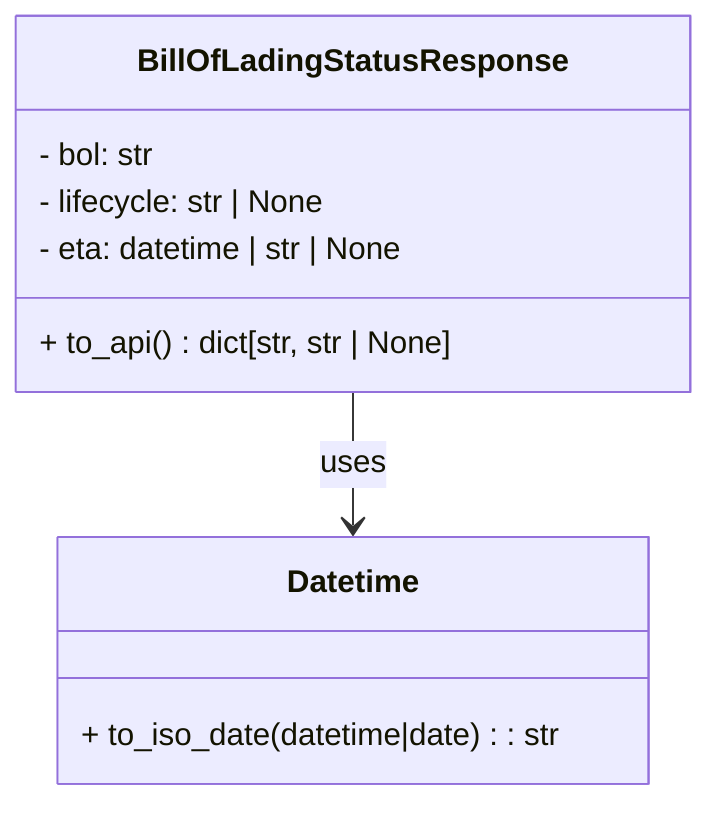

# Diagram: partview_core/partview_service/partview_service/core/model/bill_of_lading_status_response.py


> Auto-generated by Obscura crawlers

## Diagram 1



### SVG

<svg id="container" width="360.6875" xmlns="http://www.w3.org/2000/svg" class="classDiagram" height="408" viewBox="0 0 360.6875 408" role="graphics-document document" aria-roledescription="class"><style>#container{font-family:"trebuchet ms",verdana,arial,sans-serif;font-size:16px;fill:#333;}@keyframes edge-animation-frame{from{stroke-dashoffset:0;}}@keyframes dash{to{stroke-dashoffset:0;}}#container .edge-animation-slow{stroke-dasharray:9,5!important;stroke-dashoffset:900;animation:dash 50s linear infinite;stroke-linecap:round;}#container .edge-animation-fast{stroke-dasharray:9,5!important;stroke-dashoffset:900;animation:dash 20s linear infinite;stroke-linecap:round;}#container .error-icon{fill:#552222;}#container .error-text{fill:#552222;stroke:#552222;}#container .edge-thickness-normal{stroke-width:1px;}#container .edge-thickness-thick{stroke-width:3.5px;}#container .edge-pattern-solid{stroke-dasharray:0;}#container .edge-thickness-invisible{stroke-width:0;fill:none;}#container .edge-pattern-dashed{stroke-dasharray:3;}#container .edge-pattern-dotted{stroke-dasharray:2;}#container .marker{fill:#333333;stroke:#333333;}#container .marker.cross{stroke:#333333;}#container svg{font-family:"trebuchet ms",verdana,arial,sans-serif;font-size:16px;}#container p{margin:0;}#container g.classGroup text{fill:#9370DB;stroke:none;font-family:"trebuchet ms",verdana,arial,sans-serif;font-size:10px;}#container g.classGroup text .title{font-weight:bolder;}#container .nodeLabel,#container .edgeLabel{color:#131300;}#container .edgeLabel .label rect{fill:#ECECFF;}#container .label text{fill:#131300;}#container .labelBkg{background:#ECECFF;}#container .edgeLabel .label span{background:#ECECFF;}#container .classTitle{font-weight:bolder;}#container .node rect,#container .node circle,#container .node ellipse,#container .node polygon,#container .node path{fill:#ECECFF;stroke:#9370DB;stroke-width:1px;}#container .divider{stroke:#9370DB;stroke-width:1;}#container g.clickable{cursor:pointer;}#container g.classGroup rect{fill:#ECECFF;stroke:#9370DB;}#container g.classGroup line{stroke:#9370DB;stroke-width:1;}#container .classLabel .box{stroke:none;stroke-width:0;fill:#ECECFF;opacity:0.5;}#container .classLabel .label{fill:#9370DB;font-size:10px;}#container .relation{stroke:#333333;stroke-width:1;fill:none;}#container .dashed-line{stroke-dasharray:3;}#container .dotted-line{stroke-dasharray:1 2;}#container #compositionStart,#container .composition{fill:#333333!important;stroke:#333333!important;stroke-width:1;}#container #compositionEnd,#container .composition{fill:#333333!important;stroke:#333333!important;stroke-width:1;}#container #dependencyStart,#container .dependency{fill:#333333!important;stroke:#333333!important;stroke-width:1;}#container #dependencyStart,#container .dependency{fill:#333333!important;stroke:#333333!important;stroke-width:1;}#container #extensionStart,#container .extension{fill:transparent!important;stroke:#333333!important;stroke-width:1;}#container #extensionEnd,#container .extension{fill:transparent!important;stroke:#333333!important;stroke-width:1;}#container #aggregationStart,#container .aggregation{fill:transparent!important;stroke:#333333!important;stroke-width:1;}#container #aggregationEnd,#container .aggregation{fill:transparent!important;stroke:#333333!important;stroke-width:1;}#container #lollipopStart,#container .lollipop{fill:#ECECFF!important;stroke:#333333!important;stroke-width:1;}#container #lollipopEnd,#container .lollipop{fill:#ECECFF!important;stroke:#333333!important;stroke-width:1;}#container .edgeTerminals{font-size:11px;line-height:initial;}#container .classTitleText{text-anchor:middle;font-size:18px;fill:#333;}#container .label-icon{display:inline-block;height:1em;overflow:visible;vertical-align:-0.125em;}#container .node .label-icon path{fill:currentColor;stroke:revert;stroke-width:revert;}#container :root{--mermaid-font-family:"trebuchet ms",verdana,arial,sans-serif;}</style><g><defs><marker id="container_class-aggregationStart" class="marker aggregation class" refX="18" refY="7" markerWidth="190" markerHeight="240" orient="auto"><path d="M 18,7 L9,13 L1,7 L9,1 Z"></path></marker></defs><defs><marker id="container_class-aggregationEnd" class="marker aggregation class" refX="1" refY="7" markerWidth="20" markerHeight="28" orient="auto"><path d="M 18,7 L9,13 L1,7 L9,1 Z"></path></marker></defs><defs><marker id="container_class-extensionStart" class="marker extension class" refX="18" refY="7" markerWidth="190" markerHeight="240" orient="auto"><path d="M 1,7 L18,13 V 1 Z"></path></marker></defs><defs><marker id="container_class-extensionEnd" class="marker extension class" refX="1" refY="7" markerWidth="20" markerHeight="28" orient="auto"><path d="M 1,1 V 13 L18,7 Z"></path></marker></defs><defs><marker id="container_class-compositionStart" class="marker composition class" refX="18" refY="7" markerWidth="190" markerHeight="240" orient="auto"><path d="M 18,7 L9,13 L1,7 L9,1 Z"></path></marker></defs><defs><marker id="container_class-compositionEnd" class="marker composition class" refX="1" refY="7" markerWidth="20" markerHeight="28" orient="auto"><path d="M 18,7 L9,13 L1,7 L9,1 Z"></path></marker></defs><defs><marker id="container_class-dependencyStart" class="marker dependency class" refX="6" refY="7" markerWidth="190" markerHeight="240" orient="auto"><path d="M 5,7 L9,13 L1,7 L9,1 Z"></path></marker></defs><defs><marker id="container_class-dependencyEnd" class="marker dependency class" refX="13" refY="7" markerWidth="20" markerHeight="28" orient="auto"><path d="M 18,7 L9,13 L14,7 L9,1 Z"></path></marker></defs><defs><marker id="container_class-lollipopStart" class="marker lollipop class" refX="13" refY="7" markerWidth="190" markerHeight="240" orient="auto"><circle stroke="black" fill="transparent" cx="7" cy="7" r="6"></circle></marker></defs><defs><marker id="container_class-lollipopEnd" class="marker lollipop class" refX="1" refY="7" markerWidth="190" markerHeight="240" orient="auto"><circle stroke="black" fill="transparent" cx="7" cy="7" r="6"></circle></marker></defs><g class="root"><g class="clusters"></g><g class="edgePaths"><path d="M180.344,200L180.344,206.167C180.344,212.333,180.344,224.667,180.344,236C180.344,247.333,180.344,257.667,180.344,262.833L180.344,268" id="id_BillOfLadingStatusResponse_Datetime_1" class="edge-thickness-normal edge-pattern-solid relation" style=";;;" data-edge="true" data-et="edge" data-id="id_BillOfLadingStatusResponse_Datetime_1" data-points="W3sieCI6MTgwLjM0Mzc1LCJ5IjoyMDB9LHsieCI6MTgwLjM0Mzc1LCJ5IjoyMzd9LHsieCI6MTgwLjM0Mzc1LCJ5IjoyNzR9XQ==" marker-end="url(#container_class-dependencyEnd)"></path></g><g class="edgeLabels"><g class="edgeLabel" transform="translate(180.34375, 237)"><g class="label" data-id="id_BillOfLadingStatusResponse_Datetime_1" transform="translate(-16.4921875, -12)"><foreignObject width="32.984375" height="24"><div xmlns="http://www.w3.org/1999/xhtml" class="labelBkg" style="display: table-cell; white-space: nowrap; line-height: 1.5; max-width: 200px; text-align: center;"><span class="edgeLabel"><p>uses</p></span></div></foreignObject></g></g></g><g class="nodes"><g class="node default" id="classId-BillOfLadingStatusResponse-0" transform="translate(180.34375, 104)"><g class="basic label-container"><path d="M-172.34375 -96 L172.34375 -96 L172.34375 96 L-172.34375 96" stroke="none" stroke-width="0" fill="#ECECFF" style=""></path><path d="M-172.34375 -96 C-97.25027655716416 -96, -22.156803114328312 -96, 172.34375 -96 M-172.34375 -96 C-70.2439337864859 -96, 31.855882427028206 -96, 172.34375 -96 M172.34375 -96 C172.34375 -31.9728747571955, 172.34375 32.054250485609, 172.34375 96 M172.34375 -96 C172.34375 -45.35970188487045, 172.34375 5.280596230259107, 172.34375 96 M172.34375 96 C100.98969184895245 96, 29.635633697904893 96, -172.34375 96 M172.34375 96 C86.26706135384333 96, 0.19037270768666303 96, -172.34375 96 M-172.34375 96 C-172.34375 47.18578225948956, -172.34375 -1.6284354810208868, -172.34375 -96 M-172.34375 96 C-172.34375 24.85460927887445, -172.34375 -46.2907814422511, -172.34375 -96" stroke="#9370DB" stroke-width="1.3" fill="none" stroke-dasharray="0 0" style=""></path></g><g class="annotation-group text" transform="translate(0, -72)"></g><g class="label-group text" transform="translate(-103.734375, -72)"><g class="label" style="font-weight: bolder" transform="translate(0,-12)"><foreignObject width="207.46875" height="24"><div xmlns="http://www.w3.org/1999/xhtml" style="display: table-cell; white-space: nowrap; line-height: 1.5; max-width: 254px; text-align: center;"><span class="nodeLabel markdown-node-label" style=""><p>BillOfLadingStatusResponse</p></span></div></foreignObject></g></g><g class="members-group text" transform="translate(-160.34375, -24)"><g class="label" style="" transform="translate(0,-12)"><foreignObject width="61.890625" height="24"><div xmlns="http://www.w3.org/1999/xhtml" style="display: table-cell; white-space: nowrap; line-height: 1.5; max-width: 120px; text-align: center;"><span class="nodeLabel markdown-node-label" style=""><p>- bol: str</p></span></div></foreignObject></g><g class="label" style="" transform="translate(0,12)"><foreignObject width="151.046875" height="24"><div xmlns="http://www.w3.org/1999/xhtml" style="display: table-cell; white-space: nowrap; line-height: 1.5; max-width: 208px; text-align: center;"><span class="nodeLabel markdown-node-label" style=""><p>- lifecycle: str | None</p></span></div></foreignObject></g><g class="label" style="" transform="translate(0,36)"><foreignObject width="194.765625" height="24"><div xmlns="http://www.w3.org/1999/xhtml" style="display: table-cell; white-space: nowrap; line-height: 1.5; max-width: 252px; text-align: center;"><span class="nodeLabel markdown-node-label" style=""><p>- eta: datetime | str | None</p></span></div></foreignObject></g></g><g class="methods-group text" transform="translate(-160.34375, 72)"><g class="label" style="" transform="translate(0,-12)"><foreignObject width="216.953125" height="24"><div xmlns="http://www.w3.org/1999/xhtml" style="display: table-cell; white-space: nowrap; line-height: 1.5; max-width: 274px; text-align: center;"><span class="nodeLabel markdown-node-label" style=""><p>+ to_api() : dict[str, str | None]</p></span></div></foreignObject></g></g><g class="divider" style=""><path d="M-172.34375 -48 C-53.64679823062389 -48, 65.05015353875223 -48, 172.34375 -48 M-172.34375 -48 C-48.343374894120856 -48, 75.65700021175829 -48, 172.34375 -48" stroke="#9370DB" stroke-width="1.3" fill="none" stroke-dasharray="0 0" style=""></path></g><g class="divider" style=""><path d="M-172.34375 48 C-41.33302489723249 48, 89.67770020553502 48, 172.34375 48 M-172.34375 48 C-77.65541744261391 48, 17.03291511477218 48, 172.34375 48" stroke="#9370DB" stroke-width="1.3" fill="none" stroke-dasharray="0 0" style=""></path></g></g><g class="node default" id="classId-Datetime-1" transform="translate(180.34375, 337)"><g class="basic label-container"><path d="M-154.23046875 -63 L154.23046875 -63 L154.23046875 63 L-154.23046875 63" stroke="none" stroke-width="0" fill="#ECECFF" style=""></path><path d="M-154.23046875 -63 C-38.935291583816934 -63, 76.35988558236613 -63, 154.23046875 -63 M-154.23046875 -63 C-34.0707980079256 -63, 86.0888727341488 -63, 154.23046875 -63 M154.23046875 -63 C154.23046875 -36.010623671042126, 154.23046875 -9.021247342084244, 154.23046875 63 M154.23046875 -63 C154.23046875 -16.00222625073259, 154.23046875 30.99554749853482, 154.23046875 63 M154.23046875 63 C65.83581680917648 63, -22.558835131647044 63, -154.23046875 63 M154.23046875 63 C55.93640190904274 63, -42.35766493191451 63, -154.23046875 63 M-154.23046875 63 C-154.23046875 20.610206824042194, -154.23046875 -21.77958635191561, -154.23046875 -63 M-154.23046875 63 C-154.23046875 29.266757924965596, -154.23046875 -4.466484150068808, -154.23046875 -63" stroke="#9370DB" stroke-width="1.3" fill="none" stroke-dasharray="0 0" style=""></path></g><g class="annotation-group text" transform="translate(0, -39)"></g><g class="label-group text" transform="translate(-33.3984375, -39)"><g class="label" style="font-weight: bolder" transform="translate(0,-12)"><foreignObject width="66.796875" height="24"><div xmlns="http://www.w3.org/1999/xhtml" style="display: table-cell; white-space: nowrap; line-height: 1.5; max-width: 116px; text-align: center;"><span class="nodeLabel markdown-node-label" style=""><p>Datetime</p></span></div></foreignObject></g></g><g class="members-group text" transform="translate(-142.23046875, 9)"></g><g class="methods-group text" transform="translate(-142.23046875, 39)"><g class="label" style="" transform="translate(0,-12)"><foreignObject width="251.0625" height="24"><div xmlns="http://www.w3.org/1999/xhtml" style="display: table-cell; white-space: nowrap; line-height: 1.5; max-width: 309px; text-align: center;"><span class="nodeLabel markdown-node-label" style=""><p>+ to_iso_date(datetime|date) : : str</p></span></div></foreignObject></g></g><g class="divider" style=""><path d="M-154.23046875 -15 C-57.18843168771508 -15, 39.85360537456984 -15, 154.23046875 -15 M-154.23046875 -15 C-53.00069406041551 -15, 48.229080629168976 -15, 154.23046875 -15" stroke="#9370DB" stroke-width="1.3" fill="none" stroke-dasharray="0 0" style=""></path></g><g class="divider" style=""><path d="M-154.23046875 9 C-39.33447249497797 9, 75.56152376004405 9, 154.23046875 9 M-154.23046875 9 C-53.12308882268239 9, 47.98429110463522 9, 154.23046875 9" stroke="#9370DB" stroke-width="1.3" fill="none" stroke-dasharray="0 0" style=""></path></g></g></g></g></g></svg>

## Diagram 2

```mermaid
flowchart TD
    A[BillOfLadingStatusResponse instance] --> B[to_api()]
    B --> C{is eta a datetime or date?}
    C -- Yes --> D[Datetime.to_iso_date(eta) => eta_out]
    C -- No --> E[eta_out = eta]
    D --> F[return {billOfLadingNumber, lifecycleState, eta}]
    E --> F
```

> SVG rendering failed for this diagram.
