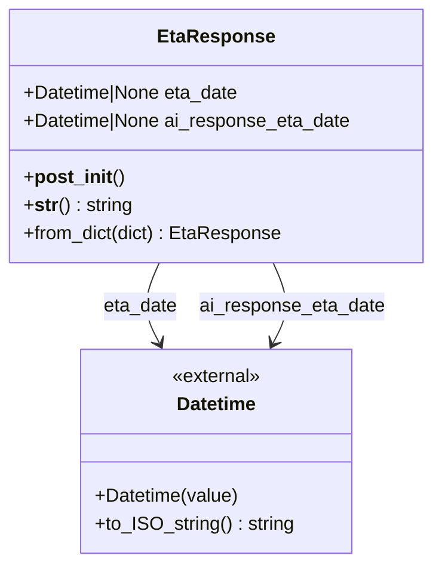

# Diagram: partview_core/partview_service/partview_service/core/model/eta_response.py

> Auto-generated by Obscura crawlers

## Mermaid

### SVG

<svg id="container" width="368.8984375" xmlns="http://www.w3.org/2000/svg" class="classDiagram" height="480" viewBox="0 0 368.8984375 480" role="graphics-document document" aria-roledescription="class"><g><defs><marker id="container_class-aggregationStart" class="marker aggregation class" refX="18" refY="7" markerWidth="190" markerHeight="240" orient="auto"><path d="M 18,7 L9,13 L1,7 L9,1 Z"></path></marker></defs><defs><marker id="container_class-aggregationEnd" class="marker aggregation class" refX="1" refY="7" markerWidth="20" markerHeight="28" orient="auto"><path d="M 18,7 L9,13 L1,7 L9,1 Z"></path></marker></defs><defs><marker id="container_class-extensionStart" class="marker extension class" refX="18" refY="7" markerWidth="190" markerHeight="240" orient="auto"><path d="M 1,7 L18,13 V 1 Z"></path></marker></defs><defs><marker id="container_class-extensionEnd" class="marker extension class" refX="1" refY="7" markerWidth="20" markerHeight="28" orient="auto"><path d="M 1,1 V 13 L18,7 Z"></path></marker></defs><defs><marker id="container_class-compositionStart" class="marker composition class" refX="18" refY="7" markerWidth="190" markerHeight="240" orient="auto"><path d="M 18,7 L9,13 L1,7 L9,1 Z"></path></marker></defs><defs><marker id="container_class-compositionEnd" class="marker composition class" refX="1" refY="7" markerWidth="20" markerHeight="28" orient="auto"><path d="M 18,7 L9,13 L1,7 L9,1 Z"></path></marker></defs><defs><marker id="container_class-dependencyStart" class="marker dependency class" refX="6" refY="7" markerWidth="190" markerHeight="240" orient="auto"><path d="M 5,7 L9,13 L1,7 L9,1 Z"></path></marker></defs><defs><marker id="container_class-dependencyEnd" class="marker dependency class" refX="13" refY="7" markerWidth="20" markerHeight="28" orient="auto"><path d="M 18,7 L9,13 L14,7 L9,1 Z"></path></marker></defs><defs><marker id="container_class-lollipopStart" class="marker lollipop class" refX="13" refY="7" markerWidth="190" markerHeight="240" orient="auto"><circle stroke="black" fill="transparent" cx="7" cy="7" r="6"></circle></marker></defs><defs><marker id="container_class-lollipopEnd" class="marker lollipop class" refX="1" refY="7" markerWidth="190" markerHeight="240" orient="auto"><circle stroke="black" fill="transparent" cx="7" cy="7" r="6"></circle></marker></defs><g class="root"><g class="clusters"></g><g class="edgePaths"><path d="M135.52,224L132.727,230.167C129.933,236.333,124.345,248.667,124.35,260.116C124.355,271.566,129.953,282.132,132.752,287.415L135.55,292.698" id="id_EtaResponse_Datetime_1" class="edge-thickness-normal edge-pattern-solid relation" style=";;;" data-edge="true" data-et="edge" data-id="id_EtaResponse_Datetime_1" data-points="W3sieCI6MTM1LjUyMDQ0NzE5ODI3NTg2LCJ5IjoyMjR9LHsieCI6MTE4Ljc1NzgxMjUsInkiOjI2MX0seyJ4IjoxMzguMzU5MjgwNDkzOTUxNjIsInkiOjI5OH1d" marker-end="url(#container_class-dependencyEnd)"></path><path d="M233.378,224L236.172,230.167C238.966,236.333,244.553,248.667,244.548,260.116C244.543,271.566,238.946,282.132,236.147,287.415L233.348,292.698" id="id_EtaResponse_Datetime_2" class="edge-thickness-normal edge-pattern-solid relation" style=";;;" data-edge="true" data-et="edge" data-id="id_EtaResponse_Datetime_2" data-points="W3sieCI6MjMzLjM3Nzk5MDMwMTcyNDE0LCJ5IjoyMjR9LHsieCI6MjUwLjE0MDYyNSwieSI6MjYxfSx7IngiOjIzMC41MzkxNTcwMDYwNDgzOCwieSI6Mjk4fV0=" marker-end="url(#container_class-dependencyEnd)"></path></g><g class="edgeLabels"><g class="edgeLabel" transform="translate(119.05073, 261.55291)"><g class="label" data-id="id_EtaResponse_Datetime_1" transform="translate(-31.8125, -12)"><foreignObject width="63.625" height="24">

eta_date

</foreignObject></g></g><g class="edgeLabel" transform="translate(249.84771, 261.55291)"><g class="label" data-id="id_EtaResponse_Datetime_2" transform="translate(-79.5703125, -12)"><foreignObject width="159.140625" height="24">

ai_response_eta_date

</foreignObject></g></g></g><g class="nodes"><g class="node default" id="classId-Datetime-0" transform="translate(184.44921875, 385)"><g class="basic label-container"><path d="M-115.796875 -87 L115.796875 -87 L115.796875 87 L-115.796875 87" stroke="none" stroke-width="0" fill="#ECECFF" style=""></path><path d="M-115.796875 -87 C-35.00508986570243 -87, 45.78669526859514 -87, 115.796875 -87 M-115.796875 -87 C-48.54350062849481 -87, 18.709873743010377 -87, 115.796875 -87 M115.796875 -87 C115.796875 -26.54205277489944, 115.796875 33.91589445020112, 115.796875 87 M115.796875 -87 C115.796875 -34.79739764318169, 115.796875 17.40520471363662, 115.796875 87 M115.796875 87 C52.787323493431366 87, -10.222228013137268 87, -115.796875 87 M115.796875 87 C44.60315140599127 87, -26.59057218801746 87, -115.796875 87 M-115.796875 87 C-115.796875 44.38373233571791, -115.796875 1.7674646714358175, -115.796875 -87 M-115.796875 87 C-115.796875 26.79020071919396, -115.796875 -33.41959856161208, -115.796875 -87" stroke="#9370DB" stroke-width="1.3" fill="none" stroke-dasharray="0 0" style=""></path></g><g class="annotation-group text" transform="translate(-38.65625, -63)"><g class="label" style="" transform="translate(0,-12)"><foreignObject width="77.3125" height="24">

«external»

</foreignObject></g></g><g class="label-group text" transform="translate(-33.3984375, -39)"><g class="label" style="font-weight: bolder" transform="translate(0,-12)"><foreignObject width="66.796875" height="24">

Datetime

</foreignObject></g></g><g class="members-group text" transform="translate(-103.796875, 9)"></g><g class="methods-group text" transform="translate(-103.796875, 39)"><g class="label" style="" transform="translate(0,-12)"><foreignObject width="123.0625" height="24">

+Datetime(value)

</foreignObject></g><g class="label" style="" transform="translate(0,12)"><foreignObject width="168.9375" height="24">

+to_ISO_string() : string

</foreignObject></g></g><g class="divider" style=""><path d="M-115.796875 -15 C-26.780296467476347 -15, 62.236282065047305 -15, 115.796875 -15 M-115.796875 -15 C-54.86736476685791 -15, 6.0621454662841785 -15, 115.796875 -15" stroke="#9370DB" stroke-width="1.3" fill="none" stroke-dasharray="0 0" style=""></path></g><g class="divider" style=""><path d="M-115.796875 9 C-51.32087350731062 9, 13.155127985378755 9, 115.796875 9 M-115.796875 9 C-33.13494650955961 9, 49.52698198088078 9, 115.796875 9" stroke="#9370DB" stroke-width="1.3" fill="none" stroke-dasharray="0 0" style=""></path></g></g><g class="node default" id="classId-EtaResponse-1" transform="translate(184.44921875, 116)"><g class="basic label-container"><path d="M-176.44921875 -108 L176.44921875 -108 L176.44921875 108 L-176.44921875 108" stroke="none" stroke-width="0" fill="#ECECFF" style=""></path><path d="M-176.44921875 -108 C-40.286592356457874 -108, 95.87603403708425 -108, 176.44921875 -108 M-176.44921875 -108 C-87.29071704710596 -108, 1.8677846557880855 -108, 176.44921875 -108 M176.44921875 -108 C176.44921875 -21.628303097704347, 176.44921875 64.7433938045913, 176.44921875 108 M176.44921875 -108 C176.44921875 -33.51272126332567, 176.44921875 40.97455747334865, 176.44921875 108 M176.44921875 108 C59.62384952622678 108, -57.201519697546445 108, -176.44921875 108 M176.44921875 108 C56.04728969488589 108, -64.35463936022822 108, -176.44921875 108 M-176.44921875 108 C-176.44921875 22.365445446141734, -176.44921875 -63.26910910771653, -176.44921875 -108 M-176.44921875 108 C-176.44921875 21.800693154228213, -176.44921875 -64.39861369154357, -176.44921875 -108" stroke="#9370DB" stroke-width="1.3" fill="none" stroke-dasharray="0 0" style=""></path></g><g class="annotation-group text" transform="translate(0, -84)"></g><g class="label-group text" transform="translate(-46.8828125, -84)"><g class="label" style="font-weight: bolder" transform="translate(0,-12)"><foreignObject width="93.765625" height="24">

EtaResponse

</foreignObject></g></g><g class="members-group text" transform="translate(-164.44921875, -36)"><g class="label" style="" transform="translate(0,-12)"><foreignObject width="186.484375" height="24">

+Datetime|None eta_date

</foreignObject></g><g class="label" style="" transform="translate(0,12)"><foreignObject width="282.015625" height="24">

+Datetime|None ai_response_eta_date

</foreignObject></g></g><g class="methods-group text" transform="translate(-164.44921875, 36)"><g class="label" style="" transform="translate(0,-12)"><foreignObject width="83.921875" height="24">

+<strong>post_init</strong>()

</foreignObject></g><g class="label" style="" transform="translate(0,12)"><foreignObject width="92.640625" height="24">

+<strong>str</strong>() : string

</foreignObject></g><g class="label" style="" transform="translate(0,36)"><foreignObject width="220.3125" height="24">

+from_dict(dict) : EtaResponse

</foreignObject></g></g><g class="divider" style=""><path d="M-176.44921875 -60 C-41.924351785537226 -60, 92.60051517892555 -60, 176.44921875 -60 M-176.44921875 -60 C-69.69747302678063 -60, 37.054272696438744 -60, 176.44921875 -60" stroke="#9370DB" stroke-width="1.3" fill="none" stroke-dasharray="0 0" style=""></path></g><g class="divider" style=""><path d="M-176.44921875 12 C-49.75681319626436 12, 76.93559235747128 12, 176.44921875 12 M-176.44921875 12 C-39.633060138935065 12, 97.18309847212987 12, 176.44921875 12" stroke="#9370DB" stroke-width="1.3" fill="none" stroke-dasharray="0 0" style=""></path></g></g></g></g></g></svg>
