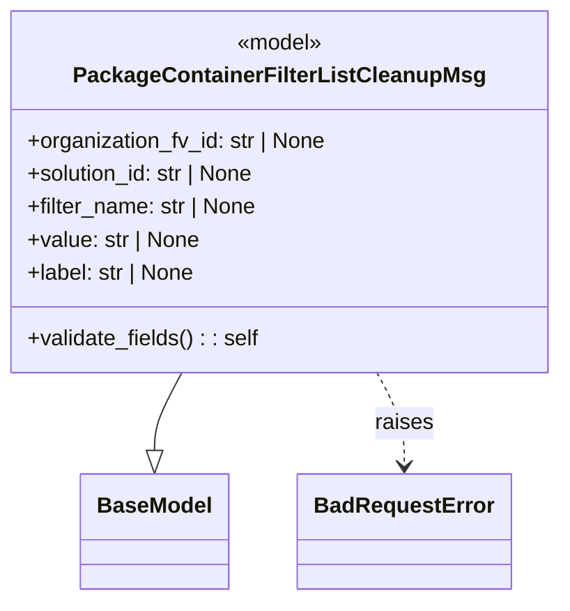

# Diagram: partview_core/partview_service/partview_service/core/model/package_container_filter_list_cleanup_msg.py

> Auto-generated by Obscura crawlers

## Mermaid

### SVG

<svg id="container" width="404.03125" xmlns="http://www.w3.org/2000/svg" class="classDiagram" height="438" viewBox="0 0 404.03125 438" role="graphics-document document" aria-roledescription="class"><g><defs><marker id="container_class-aggregationStart" class="marker aggregation class" refX="18" refY="7" markerWidth="190" markerHeight="240" orient="auto"><path d="M 18,7 L9,13 L1,7 L9,1 Z"></path></marker></defs><defs><marker id="container_class-aggregationEnd" class="marker aggregation class" refX="1" refY="7" markerWidth="20" markerHeight="28" orient="auto"><path d="M 18,7 L9,13 L1,7 L9,1 Z"></path></marker></defs><defs><marker id="container_class-extensionStart" class="marker extension class" refX="18" refY="7" markerWidth="190" markerHeight="240" orient="auto"><path d="M 1,7 L18,13 V 1 Z"></path></marker></defs><defs><marker id="container_class-extensionEnd" class="marker extension class" refX="1" refY="7" markerWidth="20" markerHeight="28" orient="auto"><path d="M 1,1 V 13 L18,7 Z"></path></marker></defs><defs><marker id="container_class-compositionStart" class="marker composition class" refX="18" refY="7" markerWidth="190" markerHeight="240" orient="auto"><path d="M 18,7 L9,13 L1,7 L9,1 Z"></path></marker></defs><defs><marker id="container_class-compositionEnd" class="marker composition class" refX="1" refY="7" markerWidth="20" markerHeight="28" orient="auto"><path d="M 18,7 L9,13 L1,7 L9,1 Z"></path></marker></defs><defs><marker id="container_class-dependencyStart" class="marker dependency class" refX="6" refY="7" markerWidth="190" markerHeight="240" orient="auto"><path d="M 5,7 L9,13 L1,7 L9,1 Z"></path></marker></defs><defs><marker id="container_class-dependencyEnd" class="marker dependency class" refX="13" refY="7" markerWidth="20" markerHeight="28" orient="auto"><path d="M 18,7 L9,13 L14,7 L9,1 Z"></path></marker></defs><defs><marker id="container_class-lollipopStart" class="marker lollipop class" refX="13" refY="7" markerWidth="190" markerHeight="240" orient="auto"><circle stroke="black" fill="transparent" cx="7" cy="7" r="6"></circle></marker></defs><defs><marker id="container_class-lollipopEnd" class="marker lollipop class" refX="1" refY="7" markerWidth="190" markerHeight="240" orient="auto"><circle stroke="black" fill="transparent" cx="7" cy="7" r="6"></circle></marker></defs><g class="root"><g class="clusters"></g><g class="edgePaths"><path d="M133.142,272L129.924,278.167C126.706,284.333,120.271,296.667,117.054,306.125C113.836,315.583,113.836,322.167,113.836,325.458L113.836,328.75" id="id_PackageContainerFilterListCleanupMsg_BaseModel_1" class="edge-thickness-normal edge-pattern-solid relation" style=";;;" data-edge="true" data-et="edge" data-id="id_PackageContainerFilterListCleanupMsg_BaseModel_1" data-points="W3sieCI6MTMzLjE0MTU0OTU1NjIxMzAyLCJ5IjoyNzJ9LHsieCI6MTEzLjgzNTkzNzUsInkiOjMwOX0seyJ4IjoxMTMuODM1OTM3NSwieSI6MzQ2fV0=" marker-end="url(#container_class-extensionEnd)"></path><path d="M270.89,272L274.107,278.167C277.325,284.333,283.76,296.667,286.978,308C290.195,319.333,290.195,329.667,290.195,334.833L290.195,340" id="id_PackageContainerFilterListCleanupMsg_BadRequestError_2" class="edge-thickness-normal edge-pattern-dashed relation" style=";;;" data-edge="true" data-et="edge" data-id="id_PackageContainerFilterListCleanupMsg_BadRequestError_2" data-points="W3sieCI6MjcwLjg4OTcwMDQ0Mzc4NywieSI6MjcyfSx7IngiOjI5MC4xOTUzMTI1LCJ5IjozMDl9LHsieCI6MjkwLjE5NTMxMjUsInkiOjM0Nn1d" marker-end="url(#container_class-dependencyEnd)"></path></g><g class="edgeLabels"><g class="edgeLabel"><g class="label" data-id="id_PackageContainerFilterListCleanupMsg_BaseModel_1" transform="translate(0, 0)"><foreignObject width="0" height="0">

</foreignObject></g></g><g class="edgeLabel" transform="translate(290.1953125, 309)"><g class="label" data-id="id_PackageContainerFilterListCleanupMsg_BadRequestError_2" transform="translate(-21.25, -12)"><foreignObject width="42.5" height="24">

raises

</foreignObject></g></g></g><g class="nodes"><g class="node default" id="classId-BaseModel-0" transform="translate(113.8359375, 388)"><g class="basic label-container"><path d="M-52.078125 -42 L52.078125 -42 L52.078125 42 L-52.078125 42" stroke="none" stroke-width="0" fill="#ECECFF" style=""></path><path d="M-52.078125 -42 C-18.956923169934285 -42, 14.16427866013143 -42, 52.078125 -42 M-52.078125 -42 C-24.29405542192755 -42, 3.490014156144902 -42, 52.078125 -42 M52.078125 -42 C52.078125 -17.33645111551589, 52.078125 7.327097768968223, 52.078125 42 M52.078125 -42 C52.078125 -10.850834446586532, 52.078125 20.298331106826936, 52.078125 42 M52.078125 42 C13.708944206218256 42, -24.66023658756349 42, -52.078125 42 M52.078125 42 C11.298874071626287 42, -29.480376856747426 42, -52.078125 42 M-52.078125 42 C-52.078125 16.001275238189116, -52.078125 -9.997449523621768, -52.078125 -42 M-52.078125 42 C-52.078125 19.866524584025733, -52.078125 -2.2669508319485345, -52.078125 -42" stroke="#9370DB" stroke-width="1.3" fill="none" stroke-dasharray="0 0" style=""></path></g><g class="annotation-group text" transform="translate(0, -18)"></g><g class="label-group text" transform="translate(-40.078125, -18)"><g class="label" style="font-weight: bolder" transform="translate(0,-12)"><foreignObject width="80.15625" height="24">

BaseModel

</foreignObject></g></g><g class="members-group text" transform="translate(-40.078125, 30)"></g><g class="methods-group text" transform="translate(-40.078125, 60)"></g><g class="divider" style=""><path d="M-52.078125 6 C-14.257767848714288 6, 23.562589302571425 6, 52.078125 6 M-52.078125 6 C-19.208557888059985 6, 13.66100922388003 6, 52.078125 6" stroke="#9370DB" stroke-width="1.3" fill="none" stroke-dasharray="0 0" style=""></path></g><g class="divider" style=""><path d="M-52.078125 24 C-27.644781591896738 24, -3.211438183793476 24, 52.078125 24 M-52.078125 24 C-23.18421163583308 24, 5.70970172833384 24, 52.078125 24" stroke="#9370DB" stroke-width="1.3" fill="none" stroke-dasharray="0 0" style=""></path></g></g><g class="node default" id="classId-PackageContainerFilterListCleanupMsg-1" transform="translate(202.015625, 140)"><g class="basic label-container"><path d="M-194.015625 -132 L194.015625 -132 L194.015625 132 L-194.015625 132" stroke="none" stroke-width="0" fill="#ECECFF" style=""></path><path d="M-194.015625 -132 C-104.09111091887475 -132, -14.166596837749495 -132, 194.015625 -132 M-194.015625 -132 C-80.94979751505491 -132, 32.11602996989018 -132, 194.015625 -132 M194.015625 -132 C194.015625 -72.26190707510969, 194.015625 -12.523814150219366, 194.015625 132 M194.015625 -132 C194.015625 -34.62677192503378, 194.015625 62.74645614993244, 194.015625 132 M194.015625 132 C59.61465868146473 132, -74.78630763707054 132, -194.015625 132 M194.015625 132 C75.57397073069141 132, -42.86768353861717 132, -194.015625 132 M-194.015625 132 C-194.015625 29.07754116094364, -194.015625 -73.84491767811272, -194.015625 -132 M-194.015625 132 C-194.015625 46.23569371035849, -194.015625 -39.52861257928302, -194.015625 -132" stroke="#9370DB" stroke-width="1.3" fill="none" stroke-dasharray="0 0" style=""></path></g><g class="annotation-group text" transform="translate(-32.1484375, -108)"><g class="label" style="" transform="translate(0,-12)"><foreignObject width="64.296875" height="24">

«model»

</foreignObject></g></g><g class="label-group text" transform="translate(-141.734375, -84)"><g class="label" style="font-weight: bolder" transform="translate(0,-12)"><foreignObject width="283.46875" height="24">

PackageContainerFilterListCleanupMsg

</foreignObject></g></g><g class="members-group text" transform="translate(-182.015625, -36)"><g class="label" style="" transform="translate(0,-12)"><foreignObject width="222.296875" height="24">

+organization_fv_id: str | None

</foreignObject></g><g class="label" style="" transform="translate(0,12)"><foreignObject width="171.015625" height="24">

+solution_id: str | None

</foreignObject></g><g class="label" style="" transform="translate(0,36)"><foreignObject width="170.421875" height="24">

+filter_name: str | None

</foreignObject></g><g class="label" style="" transform="translate(0,60)"><foreignObject width="127.515625" height="24">

+value: str | None

</foreignObject></g><g class="label" style="" transform="translate(0,84)"><foreignObject width="125.171875" height="24">

+label: str | None

</foreignObject></g></g><g class="methods-group text" transform="translate(-182.015625, 108)"><g class="label" style="" transform="translate(0,-12)"><foreignObject width="169.96875" height="24">

+validate_fields() : : self

</foreignObject></g></g><g class="divider" style=""><path d="M-194.015625 -60 C-104.09307522810052 -60, -14.170525456201034 -60, 194.015625 -60 M-194.015625 -60 C-90.86894064882136 -60, 12.27774370235727 -60, 194.015625 -60" stroke="#9370DB" stroke-width="1.3" fill="none" stroke-dasharray="0 0" style=""></path></g><g class="divider" style=""><path d="M-194.015625 84 C-87.94473800530595 84, 18.1261489893881 84, 194.015625 84 M-194.015625 84 C-57.97629837371301 84, 78.06302825257399 84, 194.015625 84" stroke="#9370DB" stroke-width="1.3" fill="none" stroke-dasharray="0 0" style=""></path></g></g><g class="node default" id="classId-BadRequestError-2" transform="translate(290.1953125, 388)"><g class="basic label-container"><path d="M-74.28125 -42 L74.28125 -42 L74.28125 42 L-74.28125 42" stroke="none" stroke-width="0" fill="#ECECFF" style=""></path><path d="M-74.28125 -42 C-26.848742427468565 -42, 20.58376514506287 -42, 74.28125 -42 M-74.28125 -42 C-16.700971641501432 -42, 40.879306716997135 -42, 74.28125 -42 M74.28125 -42 C74.28125 -16.701727534216587, 74.28125 8.596544931566825, 74.28125 42 M74.28125 -42 C74.28125 -17.728496071399608, 74.28125 6.543007857200784, 74.28125 42 M74.28125 42 C15.24891104951594 42, -43.78342790096812 42, -74.28125 42 M74.28125 42 C33.17237986703105 42, -7.9364902659379055 42, -74.28125 42 M-74.28125 42 C-74.28125 14.28307249112325, -74.28125 -13.433855017753501, -74.28125 -42 M-74.28125 42 C-74.28125 20.524580213559123, -74.28125 -0.9508395728817547, -74.28125 -42" stroke="#9370DB" stroke-width="1.3" fill="none" stroke-dasharray="0 0" style=""></path></g><g class="annotation-group text" transform="translate(0, -18)"></g><g class="label-group text" transform="translate(-62.28125, -18)"><g class="label" style="font-weight: bolder" transform="translate(0,-12)"><foreignObject width="124.5625" height="24">

BadRequestError

</foreignObject></g></g><g class="members-group text" transform="translate(-62.28125, 30)"></g><g class="methods-group text" transform="translate(-62.28125, 60)"></g><g class="divider" style=""><path d="M-74.28125 6 C-21.11251585142721 6, 32.05621829714558 6, 74.28125 6 M-74.28125 6 C-32.31021619100016 6, 9.660817617999683 6, 74.28125 6" stroke="#9370DB" stroke-width="1.3" fill="none" stroke-dasharray="0 0" style=""></path></g><g class="divider" style=""><path d="M-74.28125 24 C-21.412173826412065 24, 31.45690234717587 24, 74.28125 24 M-74.28125 24 C-26.149598141034836 24, 21.982053717930327 24, 74.28125 24" stroke="#9370DB" stroke-width="1.3" fill="none" stroke-dasharray="0 0" style=""></path></g></g></g></g></g></svg>
