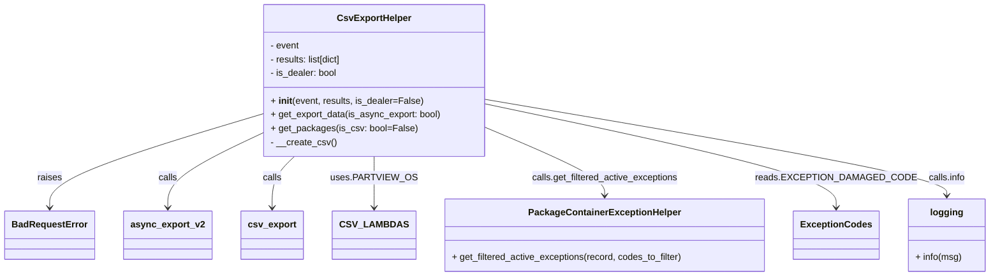

# Diagram: partview_core/partview_service/partview_service/elastic_search/helpers/csv_export_helper.py

> Auto-generated by Obscura crawlers

## Mermaid

### SVG

<svg id="container" width="1665.71875" xmlns="http://www.w3.org/2000/svg" class="classDiagram" height="480" viewBox="0 0 1665.71875 480" role="graphics-document document" aria-roledescription="class"><g><defs><marker id="container_class-aggregationStart" class="marker aggregation class" refX="18" refY="7" markerWidth="190" markerHeight="240" orient="auto"><path d="M 18,7 L9,13 L1,7 L9,1 Z"></path></marker></defs><defs><marker id="container_class-aggregationEnd" class="marker aggregation class" refX="1" refY="7" markerWidth="20" markerHeight="28" orient="auto"><path d="M 18,7 L9,13 L1,7 L9,1 Z"></path></marker></defs><defs><marker id="container_class-extensionStart" class="marker extension class" refX="18" refY="7" markerWidth="190" markerHeight="240" orient="auto"><path d="M 1,7 L18,13 V 1 Z"></path></marker></defs><defs><marker id="container_class-extensionEnd" class="marker extension class" refX="1" refY="7" markerWidth="20" markerHeight="28" orient="auto"><path d="M 1,1 V 13 L18,7 Z"></path></marker></defs><defs><marker id="container_class-compositionStart" class="marker composition class" refX="18" refY="7" markerWidth="190" markerHeight="240" orient="auto"><path d="M 18,7 L9,13 L1,7 L9,1 Z"></path></marker></defs><defs><marker id="container_class-compositionEnd" class="marker composition class" refX="1" refY="7" markerWidth="20" markerHeight="28" orient="auto"><path d="M 18,7 L9,13 L1,7 L9,1 Z"></path></marker></defs><defs><marker id="container_class-dependencyStart" class="marker dependency class" refX="6" refY="7" markerWidth="190" markerHeight="240" orient="auto"><path d="M 5,7 L9,13 L1,7 L9,1 Z"></path></marker></defs><defs><marker id="container_class-dependencyEnd" class="marker dependency class" refX="13" refY="7" markerWidth="20" markerHeight="28" orient="auto"><path d="M 18,7 L9,13 L14,7 L9,1 Z"></path></marker></defs><defs><marker id="container_class-lollipopStart" class="marker lollipop class" refX="13" refY="7" markerWidth="190" markerHeight="240" orient="auto"><circle stroke="black" fill="transparent" cx="7" cy="7" r="6"></circle></marker></defs><defs><marker id="container_class-lollipopEnd" class="marker lollipop class" refX="1" refY="7" markerWidth="190" markerHeight="240" orient="auto"><circle stroke="black" fill="transparent" cx="7" cy="7" r="6"></circle></marker></defs><g class="root"><g class="clusters"></g><g class="edgePaths"><path d="M427.945,200.181L370.335,218.317C312.724,236.454,197.503,272.727,139.892,299.53C82.281,326.333,82.281,343.667,82.281,352.333L82.281,361" id="id_CsvExportHelper_BadRequestError_1" class="edge-thickness-normal edge-pattern-solid relation" style=";;;" data-edge="true" data-et="edge" data-id="id_CsvExportHelper_BadRequestError_1" data-points="W3sieCI6NDI3Ljk0NTMxMjUsInkiOjIwMC4xODA3NjM3NDUzNzk0fSx7IngiOjgyLjI4MTI1LCJ5IjozMDl9LHsieCI6ODIuMjgxMjUsInkiOjM2N31d" marker-end="url(#container_class-dependencyEnd)"></path><path d="M427.945,235.103L403.189,247.419C378.432,259.735,328.919,284.368,304.163,305.35C279.406,326.333,279.406,343.667,279.406,352.333L279.406,361" id="id_CsvExportHelper_async_export_v2_2" class="edge-thickness-normal edge-pattern-solid relation" style=";;;" data-edge="true" data-et="edge" data-id="id_CsvExportHelper_async_export_v2_2" data-points="W3sieCI6NDI3Ljk0NTMxMjUsInkiOjIzNS4xMDI4MjQxNTcxMjI0OH0seyJ4IjoyNzkuNDA2MjUsInkiOjMwOX0seyJ4IjoyNzkuNDA2MjUsInkiOjM2N31d" marker-end="url(#container_class-dependencyEnd)"></path><path d="M490.002,272L483.97,278.167C477.939,284.333,465.876,296.667,459.844,311.5C453.813,326.333,453.813,343.667,453.813,352.333L453.813,361" id="id_CsvExportHelper_csv_export_3" class="edge-thickness-normal edge-pattern-solid relation" style=";;;" data-edge="true" data-et="edge" data-id="id_CsvExportHelper_csv_export_3" data-points="W3sieCI6NDkwLjAwMTc1NjY1NjgwNDczLCJ5IjoyNzJ9LHsieCI6NDUzLjgxMjUsInkiOjMwOX0seyJ4Ijo0NTMuODEyNSwieSI6MzY3fV0=" marker-end="url(#container_class-dependencyEnd)"></path><path d="M619.109,272L619.109,278.167C619.109,284.333,619.109,296.667,619.109,311.5C619.109,326.333,619.109,343.667,619.109,352.333L619.109,361" id="id_CsvExportHelper_CSV_LAMBDAS_4" class="edge-thickness-normal edge-pattern-solid relation" style=";;;" data-edge="true" data-et="edge" data-id="id_CsvExportHelper_CSV_LAMBDAS_4" data-points="W3sieCI6NjE5LjEwOTM3NSwieSI6MjcyfSx7IngiOjYxOS4xMDkzNzUsInkiOjMwOX0seyJ4Ijo2MTkuMTA5Mzc1LCJ5IjozNjd9XQ==" marker-end="url(#container_class-dependencyEnd)"></path><path d="M810.273,222.74L843.49,237.117C876.706,251.493,943.138,280.247,976.354,299.79C1009.57,319.333,1009.57,329.667,1009.57,334.833L1009.57,340" id="id_CsvExportHelper_PackageContainerExceptionHelper_5" class="edge-thickness-normal edge-pattern-solid relation" style=";;;" data-edge="true" data-et="edge" data-id="id_CsvExportHelper_PackageContainerExceptionHelper_5" data-points="W3sieCI6ODEwLjI3MzQzNzUsInkiOjIyMi43Mzk5NzA3ODc3MzA4NH0seyJ4IjoxMDA5LjU3MDMxMjUsInkiOjMwOX0seyJ4IjoxMDA5LjU3MDMxMjUsInkiOjM0Nn1d" marker-end="url(#container_class-dependencyEnd)"></path><path d="M810.273,181.046L909.592,202.372C1008.911,223.698,1207.549,266.349,1306.868,296.341C1406.188,326.333,1406.188,343.667,1406.188,352.333L1406.188,361" id="id_CsvExportHelper_ExceptionCodes_6" class="edge-thickness-normal edge-pattern-solid relation" style=";;;" data-edge="true" data-et="edge" data-id="id_CsvExportHelper_ExceptionCodes_6" data-points="W3sieCI6ODEwLjI3MzQzNzUsInkiOjE4MS4wNDY0MDM4Mjc0NDcyNX0seyJ4IjoxNDA2LjE4NzUsInkiOjMwOX0seyJ4IjoxNDA2LjE4NzUsInkiOjM2N31d" marker-end="url(#container_class-dependencyEnd)"></path><path d="M810.273,173.21L940.544,195.842C1070.815,218.474,1331.357,263.737,1461.628,291.535C1591.898,319.333,1591.898,329.667,1591.898,334.833L1591.898,340" id="id_CsvExportHelper_logging_7" class="edge-thickness-normal edge-pattern-solid relation" style=";;;" data-edge="true" data-et="edge" data-id="id_CsvExportHelper_logging_7" data-points="W3sieCI6ODEwLjI3MzQzNzUsInkiOjE3My4yMTA0MTMwMzU5NzF9LHsieCI6MTU5MS44OTg0Mzc1LCJ5IjozMDl9LHsieCI6MTU5MS44OTg0Mzc1LCJ5IjozNDZ9XQ==" marker-end="url(#container_class-dependencyEnd)"></path></g><g class="edgeLabels"><g class="edgeLabel" transform="translate(82.28125, 309)"><g class="label" data-id="id_CsvExportHelper_BadRequestError_1" transform="translate(-21.25, -12)"><foreignObject width="42.5" height="24">

raises

</foreignObject></g></g><g class="edgeLabel" transform="translate(279.40625, 309)"><g class="label" data-id="id_CsvExportHelper_async_export_v2_2" transform="translate(-16.4453125, -12)"><foreignObject width="32.890625" height="24">

calls

</foreignObject></g></g><g class="edgeLabel" transform="translate(453.8125, 309)"><g class="label" data-id="id_CsvExportHelper_csv_export_3" transform="translate(-16.4453125, -12)"><foreignObject width="32.890625" height="24">

calls

</foreignObject></g></g><g class="edgeLabel" transform="translate(619.109375, 309)"><g class="label" data-id="id_CsvExportHelper_CSV_LAMBDAS_4" transform="translate(-66.9296875, -12)"><foreignObject width="133.859375" height="24">

uses.PARTVIEW_OS

</foreignObject></g></g><g class="edgeLabel" transform="translate(1009.5703125, 309)"><g class="label" data-id="id_CsvExportHelper_PackageContainerExceptionHelper_5" transform="translate(-128.1640625, -12)"><foreignObject width="256.328125" height="24">

calls.get_filtered_active_exceptions

</foreignObject></g></g><g class="edgeLabel" transform="translate(1406.1875, 309)"><g class="label" data-id="id_CsvExportHelper_ExceptionCodes_6" transform="translate(-122.9453125, -12)"><foreignObject width="245.890625" height="24">

reads.EXCEPTION_DAMAGED_CODE

</foreignObject></g></g><g class="edgeLabel" transform="translate(1591.8984375, 309)"><g class="label" data-id="id_CsvExportHelper_logging_7" transform="translate(-32.578125, -12)"><foreignObject width="65.15625" height="24">

calls.info

</foreignObject></g></g></g><g class="nodes"><g class="node default" id="classId-CsvExportHelper-0" transform="translate(619.109375, 140)"><g class="basic label-container"><path d="M-191.1640625 -132 L191.1640625 -132 L191.1640625 132 L-191.1640625 132" stroke="none" stroke-width="0" fill="#ECECFF" style=""></path><path d="M-191.1640625 -132 C-49.28506044722127 -132, 92.59394160555746 -132, 191.1640625 -132 M-191.1640625 -132 C-104.95349057256838 -132, -18.74291864513677 -132, 191.1640625 -132 M191.1640625 -132 C191.1640625 -36.91524049414831, 191.1640625 58.169519011703386, 191.1640625 132 M191.1640625 -132 C191.1640625 -30.3990581907791, 191.1640625 71.2018836184418, 191.1640625 132 M191.1640625 132 C62.961435467363515 132, -65.24119156527297 132, -191.1640625 132 M191.1640625 132 C59.64141758945908 132, -71.88122732108184 132, -191.1640625 132 M-191.1640625 132 C-191.1640625 72.28952169389952, -191.1640625 12.579043387799032, -191.1640625 -132 M-191.1640625 132 C-191.1640625 69.10031851144862, -191.1640625 6.20063702289724, -191.1640625 -132" stroke="#9370DB" stroke-width="1.3" fill="none" stroke-dasharray="0 0" style=""></path></g><g class="annotation-group text" transform="translate(0, -108)"></g><g class="label-group text" transform="translate(-60.921875, -108)"><g class="label" style="font-weight: bolder" transform="translate(0,-12)"><foreignObject width="121.84375" height="24">

CsvExportHelper

</foreignObject></g></g><g class="members-group text" transform="translate(-179.1640625, -60)"><g class="label" style="" transform="translate(0,-12)"><foreignObject width="51.03125" height="24">

- event

</foreignObject></g><g class="label" style="" transform="translate(0,12)"><foreignObject width="128.328125" height="24">

- results: list[dict]

</foreignObject></g><g class="label" style="" transform="translate(0,36)"><foreignObject width="117.65625" height="24">

- is_dealer: bool

</foreignObject></g></g><g class="methods-group text" transform="translate(-179.1640625, 36)"><g class="label" style="" transform="translate(0,-12)"><foreignObject width="262.90625" height="24">

+ <strong>init</strong>(event, results, is_dealer=False)

</foreignObject></g><g class="label" style="" transform="translate(0,12)"><foreignObject width="297.40625" height="24">

+ get_export_data(is_async_export: bool)

</foreignObject></g><g class="label" style="" transform="translate(0,36)"><foreignObject width="247.65625" height="24">

+ get_packages(is_csv: bool=False)

</foreignObject></g><g class="label" style="" transform="translate(0,60)"><foreignObject width="112.484375" height="24">

- __create_csv()

</foreignObject></g></g><g class="divider" style=""><path d="M-191.1640625 -84 C-111.20677129293058 -84, -31.249480085861165 -84, 191.1640625 -84 M-191.1640625 -84 C-38.63480217764163 -84, 113.89445814471674 -84, 191.1640625 -84" stroke="#9370DB" stroke-width="1.3" fill="none" stroke-dasharray="0 0" style=""></path></g><g class="divider" style=""><path d="M-191.1640625 12 C-110.99462595653581 12, -30.825189413071627 12, 191.1640625 12 M-191.1640625 12 C-113.51979858338235 12, -35.87553466676471 12, 191.1640625 12" stroke="#9370DB" stroke-width="1.3" fill="none" stroke-dasharray="0 0" style=""></path></g></g><g class="node default" id="classId-BadRequestError-1" transform="translate(82.28125, 409)"><g class="basic label-container"><path d="M-74.28125 -42 L74.28125 -42 L74.28125 42 L-74.28125 42" stroke="none" stroke-width="0" fill="#ECECFF" style=""></path><path d="M-74.28125 -42 C-29.647566377317787 -42, 14.986117245364426 -42, 74.28125 -42 M-74.28125 -42 C-40.86376882488669 -42, -7.446287649773382 -42, 74.28125 -42 M74.28125 -42 C74.28125 -17.29511755238152, 74.28125 7.409764895236961, 74.28125 42 M74.28125 -42 C74.28125 -10.780383204788258, 74.28125 20.439233590423484, 74.28125 42 M74.28125 42 C19.974265512924646 42, -34.33271897415071 42, -74.28125 42 M74.28125 42 C19.961311383028992 42, -34.358627233942016 42, -74.28125 42 M-74.28125 42 C-74.28125 21.706490515942765, -74.28125 1.4129810318855291, -74.28125 -42 M-74.28125 42 C-74.28125 15.581630140138579, -74.28125 -10.836739719722843, -74.28125 -42" stroke="#9370DB" stroke-width="1.3" fill="none" stroke-dasharray="0 0" style=""></path></g><g class="annotation-group text" transform="translate(0, -18)"></g><g class="label-group text" transform="translate(-62.28125, -18)"><g class="label" style="font-weight: bolder" transform="translate(0,-12)"><foreignObject width="124.5625" height="24">

BadRequestError

</foreignObject></g></g><g class="members-group text" transform="translate(-62.28125, 30)"></g><g class="methods-group text" transform="translate(-62.28125, 60)"></g><g class="divider" style=""><path d="M-74.28125 6 C-28.386339848099837 6, 17.508570303800326 6, 74.28125 6 M-74.28125 6 C-19.06580340711912 6, 36.14964318576176 6, 74.28125 6" stroke="#9370DB" stroke-width="1.3" fill="none" stroke-dasharray="0 0" style=""></path></g><g class="divider" style=""><path d="M-74.28125 24 C-17.964794399426836 24, 38.35166120114633 24, 74.28125 24 M-74.28125 24 C-37.03198426452364 24, 0.2172814709527131 24, 74.28125 24" stroke="#9370DB" stroke-width="1.3" fill="none" stroke-dasharray="0 0" style=""></path></g></g><g class="node default" id="classId-async_export_v2-2" transform="translate(279.40625, 409)"><g class="basic label-container"><path d="M-72.84375 -42 L72.84375 -42 L72.84375 42 L-72.84375 42" stroke="none" stroke-width="0" fill="#ECECFF" style=""></path><path d="M-72.84375 -42 C-16.608659399016595 -42, 39.62643120196681 -42, 72.84375 -42 M-72.84375 -42 C-16.14402539036613 -42, 40.55569921926774 -42, 72.84375 -42 M72.84375 -42 C72.84375 -18.780877100153724, 72.84375 4.438245799692552, 72.84375 42 M72.84375 -42 C72.84375 -10.72770361181373, 72.84375 20.54459277637254, 72.84375 42 M72.84375 42 C39.24762725499688 42, 5.651504509993757 42, -72.84375 42 M72.84375 42 C43.6172485780845 42, 14.390747156168992 42, -72.84375 42 M-72.84375 42 C-72.84375 20.511507948409598, -72.84375 -0.9769841031808042, -72.84375 -42 M-72.84375 42 C-72.84375 10.541054867298584, -72.84375 -20.917890265402832, -72.84375 -42" stroke="#9370DB" stroke-width="1.3" fill="none" stroke-dasharray="0 0" style=""></path></g><g class="annotation-group text" transform="translate(0, -18)"></g><g class="label-group text" transform="translate(-60.84375, -18)"><g class="label" style="font-weight: bolder" transform="translate(0,-12)"><foreignObject width="121.6875" height="24">

async_export_v2

</foreignObject></g></g><g class="members-group text" transform="translate(-60.84375, 30)"></g><g class="methods-group text" transform="translate(-60.84375, 60)"></g><g class="divider" style=""><path d="M-72.84375 6 C-17.446291932880904 6, 37.95116613423819 6, 72.84375 6 M-72.84375 6 C-36.532143731607455 6, -0.2205374632149102 6, 72.84375 6" stroke="#9370DB" stroke-width="1.3" fill="none" stroke-dasharray="0 0" style=""></path></g><g class="divider" style=""><path d="M-72.84375 24 C-43.16077971303139 24, -13.477809426062784 24, 72.84375 24 M-72.84375 24 C-42.704256658731666 24, -12.564763317463324 24, 72.84375 24" stroke="#9370DB" stroke-width="1.3" fill="none" stroke-dasharray="0 0" style=""></path></g></g><g class="node default" id="classId-csv_export-3" transform="translate(453.8125, 409)"><g class="basic label-container"><path d="M-51.5625 -42 L51.5625 -42 L51.5625 42 L-51.5625 42" stroke="none" stroke-width="0" fill="#ECECFF" style=""></path><path d="M-51.5625 -42 C-12.813061988587322 -42, 25.936376022825357 -42, 51.5625 -42 M-51.5625 -42 C-25.640085878553965 -42, 0.2823282428920706 -42, 51.5625 -42 M51.5625 -42 C51.5625 -14.5736730817544, 51.5625 12.8526538364912, 51.5625 42 M51.5625 -42 C51.5625 -16.089784591978933, 51.5625 9.820430816042133, 51.5625 42 M51.5625 42 C13.668679505236597 42, -24.225140989526807 42, -51.5625 42 M51.5625 42 C25.2214678916596 42, -1.1195642166808 42, -51.5625 42 M-51.5625 42 C-51.5625 24.72822084455065, -51.5625 7.456441689101297, -51.5625 -42 M-51.5625 42 C-51.5625 9.347411306760492, -51.5625 -23.305177386479016, -51.5625 -42" stroke="#9370DB" stroke-width="1.3" fill="none" stroke-dasharray="0 0" style=""></path></g><g class="annotation-group text" transform="translate(0, -18)"></g><g class="label-group text" transform="translate(-39.5625, -18)"><g class="label" style="font-weight: bolder" transform="translate(0,-12)"><foreignObject width="79.125" height="24">

csv_export

</foreignObject></g></g><g class="members-group text" transform="translate(-39.5625, 30)"></g><g class="methods-group text" transform="translate(-39.5625, 60)"></g><g class="divider" style=""><path d="M-51.5625 6 C-22.768950023693463 6, 6.024599952613073 6, 51.5625 6 M-51.5625 6 C-24.88197904445264 6, 1.7985419110947234 6, 51.5625 6" stroke="#9370DB" stroke-width="1.3" fill="none" stroke-dasharray="0 0" style=""></path></g><g class="divider" style=""><path d="M-51.5625 24 C-20.80373623125478 24, 9.955027537490437 24, 51.5625 24 M-51.5625 24 C-24.432089740288365 24, 2.6983205194232696 24, 51.5625 24" stroke="#9370DB" stroke-width="1.3" fill="none" stroke-dasharray="0 0" style=""></path></g></g><g class="node default" id="classId-CSV_LAMBDAS-4" transform="translate(619.109375, 409)"><g class="basic label-container"><path d="M-63.734375 -42 L63.734375 -42 L63.734375 42 L-63.734375 42" stroke="none" stroke-width="0" fill="#ECECFF" style=""></path><path d="M-63.734375 -42 C-30.114902506090296 -42, 3.5045699878194085 -42, 63.734375 -42 M-63.734375 -42 C-26.816148281526814 -42, 10.102078436946371 -42, 63.734375 -42 M63.734375 -42 C63.734375 -17.061592373699398, 63.734375 7.8768152526012045, 63.734375 42 M63.734375 -42 C63.734375 -24.187973159501738, 63.734375 -6.375946319003475, 63.734375 42 M63.734375 42 C35.31691374427412 42, 6.899452488548235 42, -63.734375 42 M63.734375 42 C13.633645279174488 42, -36.467084441651025 42, -63.734375 42 M-63.734375 42 C-63.734375 19.119448444005613, -63.734375 -3.761103111988774, -63.734375 -42 M-63.734375 42 C-63.734375 20.913033081261737, -63.734375 -0.17393383747652535, -63.734375 -42" stroke="#9370DB" stroke-width="1.3" fill="none" stroke-dasharray="0 0" style=""></path></g><g class="annotation-group text" transform="translate(0, -18)"></g><g class="label-group text" transform="translate(-51.734375, -18)"><g class="label" style="font-weight: bolder" transform="translate(0,-12)"><foreignObject width="103.46875" height="24">

CSV_LAMBDAS

</foreignObject></g></g><g class="members-group text" transform="translate(-51.734375, 30)"></g><g class="methods-group text" transform="translate(-51.734375, 60)"></g><g class="divider" style=""><path d="M-63.734375 6 C-13.109145793462673 6, 37.516083413074654 6, 63.734375 6 M-63.734375 6 C-22.904312930734832 6, 17.925749138530335 6, 63.734375 6" stroke="#9370DB" stroke-width="1.3" fill="none" stroke-dasharray="0 0" style=""></path></g><g class="divider" style=""><path d="M-63.734375 24 C-14.049984469351067 24, 35.63440606129787 24, 63.734375 24 M-63.734375 24 C-30.757574914815287 24, 2.219225170369427 24, 63.734375 24" stroke="#9370DB" stroke-width="1.3" fill="none" stroke-dasharray="0 0" style=""></path></g></g><g class="node default" id="classId-PackageContainerExceptionHelper-5" transform="translate(1009.5703125, 409)"><g class="basic label-container"><path d="M-276.7265625 -63 L276.7265625 -63 L276.7265625 63 L-276.7265625 63" stroke="none" stroke-width="0" fill="#ECECFF" style=""></path><path d="M-276.7265625 -63 C-136.333576965982 -63, 4.0594085680360195 -63, 276.7265625 -63 M-276.7265625 -63 C-65.11693518937088 -63, 146.49269212125824 -63, 276.7265625 -63 M276.7265625 -63 C276.7265625 -22.956624184347042, 276.7265625 17.086751631305916, 276.7265625 63 M276.7265625 -63 C276.7265625 -23.381114691005422, 276.7265625 16.237770617989156, 276.7265625 63 M276.7265625 63 C98.82143719984464 63, -79.08368810031072 63, -276.7265625 63 M276.7265625 63 C141.26956998192435 63, 5.812577463848697 63, -276.7265625 63 M-276.7265625 63 C-276.7265625 32.3434627127807, -276.7265625 1.6869254255613981, -276.7265625 -63 M-276.7265625 63 C-276.7265625 24.835738307434767, -276.7265625 -13.328523385130467, -276.7265625 -63" stroke="#9370DB" stroke-width="1.3" fill="none" stroke-dasharray="0 0" style=""></path></g><g class="annotation-group text" transform="translate(0, -39)"></g><g class="label-group text" transform="translate(-125.671875, -39)"><g class="label" style="font-weight: bolder" transform="translate(0,-12)"><foreignObject width="251.34375" height="24">

PackageContainerExceptionHelper

</foreignObject></g></g><g class="members-group text" transform="translate(-264.7265625, 9)"></g><g class="methods-group text" transform="translate(-264.7265625, 39)"><g class="label" style="" transform="translate(0,-12)"><foreignObject width="403.78125" height="24">

+ get_filtered_active_exceptions(record, codes_to_filter)

</foreignObject></g></g><g class="divider" style=""><path d="M-276.7265625 -15 C-119.10107411403462 -15, 38.524414271930766 -15, 276.7265625 -15 M-276.7265625 -15 C-130.49525216837048 -15, 15.736058163259031 -15, 276.7265625 -15" stroke="#9370DB" stroke-width="1.3" fill="none" stroke-dasharray="0 0" style=""></path></g><g class="divider" style=""><path d="M-276.7265625 9 C-138.15447444562562 9, 0.4176136087487521 9, 276.7265625 9 M-276.7265625 9 C-70.23687241572514 9, 136.2528176685497 9, 276.7265625 9" stroke="#9370DB" stroke-width="1.3" fill="none" stroke-dasharray="0 0" style=""></path></g></g><g class="node default" id="classId-ExceptionCodes-6" transform="translate(1406.1875, 409)"><g class="basic label-container"><path d="M-69.890625 -42 L69.890625 -42 L69.890625 42 L-69.890625 42" stroke="none" stroke-width="0" fill="#ECECFF" style=""></path><path d="M-69.890625 -42 C-41.74524509615472 -42, -13.599865192309444 -42, 69.890625 -42 M-69.890625 -42 C-39.09270074692512 -42, -8.294776493850243 -42, 69.890625 -42 M69.890625 -42 C69.890625 -23.857687381690482, 69.890625 -5.715374763380964, 69.890625 42 M69.890625 -42 C69.890625 -18.525138751154785, 69.890625 4.949722497690431, 69.890625 42 M69.890625 42 C24.70521670260721 42, -20.48019159478558 42, -69.890625 42 M69.890625 42 C28.828128792003305 42, -12.23436741599339 42, -69.890625 42 M-69.890625 42 C-69.890625 17.726917468085297, -69.890625 -6.546165063829406, -69.890625 -42 M-69.890625 42 C-69.890625 17.126324554905814, -69.890625 -7.747350890188372, -69.890625 -42" stroke="#9370DB" stroke-width="1.3" fill="none" stroke-dasharray="0 0" style=""></path></g><g class="annotation-group text" transform="translate(0, -18)"></g><g class="label-group text" transform="translate(-57.890625, -18)"><g class="label" style="font-weight: bolder" transform="translate(0,-12)"><foreignObject width="115.78125" height="24">

ExceptionCodes

</foreignObject></g></g><g class="members-group text" transform="translate(-57.890625, 30)"></g><g class="methods-group text" transform="translate(-57.890625, 60)"></g><g class="divider" style=""><path d="M-69.890625 6 C-24.655530346254658 6, 20.579564307490685 6, 69.890625 6 M-69.890625 6 C-35.622187672165296 6, -1.3537503443305923 6, 69.890625 6" stroke="#9370DB" stroke-width="1.3" fill="none" stroke-dasharray="0 0" style=""></path></g><g class="divider" style=""><path d="M-69.890625 24 C-29.93317664228364 24, 10.024271715432718 24, 69.890625 24 M-69.890625 24 C-39.4821394688564 24, -9.073653937712812 24, 69.890625 24" stroke="#9370DB" stroke-width="1.3" fill="none" stroke-dasharray="0 0" style=""></path></g></g><g class="node default" id="classId-logging-7" transform="translate(1591.8984375, 409)"><g class="basic label-container"><path d="M-65.8203125 -63 L65.8203125 -63 L65.8203125 63 L-65.8203125 63" stroke="none" stroke-width="0" fill="#ECECFF" style=""></path><path d="M-65.8203125 -63 C-35.169096985093155 -63, -4.51788147018631 -63, 65.8203125 -63 M-65.8203125 -63 C-31.722351123970007 -63, 2.3756102520599853 -63, 65.8203125 -63 M65.8203125 -63 C65.8203125 -27.76735119094073, 65.8203125 7.465297618118541, 65.8203125 63 M65.8203125 -63 C65.8203125 -16.638013642121827, 65.8203125 29.723972715756346, 65.8203125 63 M65.8203125 63 C36.44657099488981 63, 7.072829489779622 63, -65.8203125 63 M65.8203125 63 C17.479875198939972 63, -30.860562102120056 63, -65.8203125 63 M-65.8203125 63 C-65.8203125 25.982187742226614, -65.8203125 -11.035624515546772, -65.8203125 -63 M-65.8203125 63 C-65.8203125 20.904422143367817, -65.8203125 -21.191155713264365, -65.8203125 -63" stroke="#9370DB" stroke-width="1.3" fill="none" stroke-dasharray="0 0" style=""></path></g><g class="annotation-group text" transform="translate(0, -39)"></g><g class="label-group text" transform="translate(-27.109375, -39)"><g class="label" style="font-weight: bolder" transform="translate(0,-12)"><foreignObject width="54.21875" height="24">

logging

</foreignObject></g></g><g class="members-group text" transform="translate(-53.8203125, 9)"></g><g class="methods-group text" transform="translate(-53.8203125, 39)"><g class="label" style="" transform="translate(0,-12)"><foreignObject width="80.53125" height="24">

+ info(msg)

</foreignObject></g></g><g class="divider" style=""><path d="M-65.8203125 -15 C-24.98452187679444 -15, 15.851268746411122 -15, 65.8203125 -15 M-65.8203125 -15 C-27.87442022958382 -15, 10.071472040832361 -15, 65.8203125 -15" stroke="#9370DB" stroke-width="1.3" fill="none" stroke-dasharray="0 0" style=""></path></g><g class="divider" style=""><path d="M-65.8203125 9 C-28.707312357899056 9, 8.405687784201888 9, 65.8203125 9 M-65.8203125 9 C-38.98607576098131 9, -12.151839021962608 9, 65.8203125 9" stroke="#9370DB" stroke-width="1.3" fill="none" stroke-dasharray="0 0" style=""></path></g></g></g></g></g></svg>
