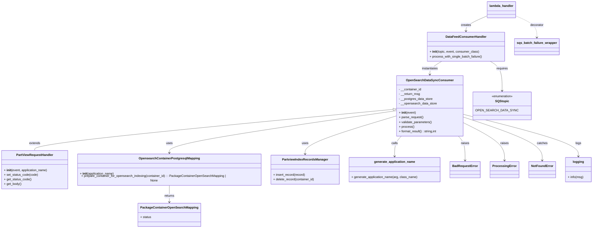

# Diagram: partview_core/partview_service/partview_service/elastic_search/open_search_data_sync_consumer.py

> Auto-generated by Obscura crawlers

## Mermaid

### SVG

<svg id="container" width="3033.953125" xmlns="http://www.w3.org/2000/svg" class="classDiagram" height="1176" viewBox="0 0 3033.953125 1176" role="graphics-document document" aria-roledescription="class"><g><defs><marker id="container_class-aggregationStart" class="marker aggregation class" refX="18" refY="7" markerWidth="190" markerHeight="240" orient="auto"><path d="M 18,7 L9,13 L1,7 L9,1 Z"></path></marker></defs><defs><marker id="container_class-aggregationEnd" class="marker aggregation class" refX="1" refY="7" markerWidth="20" markerHeight="28" orient="auto"><path d="M 18,7 L9,13 L1,7 L9,1 Z"></path></marker></defs><defs><marker id="container_class-extensionStart" class="marker extension class" refX="18" refY="7" markerWidth="190" markerHeight="240" orient="auto"><path d="M 1,7 L18,13 V 1 Z"></path></marker></defs><defs><marker id="container_class-extensionEnd" class="marker extension class" refX="1" refY="7" markerWidth="20" markerHeight="28" orient="auto"><path d="M 1,1 V 13 L18,7 Z"></path></marker></defs><defs><marker id="container_class-compositionStart" class="marker composition class" refX="18" refY="7" markerWidth="190" markerHeight="240" orient="auto"><path d="M 18,7 L9,13 L1,7 L9,1 Z"></path></marker></defs><defs><marker id="container_class-compositionEnd" class="marker composition class" refX="1" refY="7" markerWidth="20" markerHeight="28" orient="auto"><path d="M 18,7 L9,13 L1,7 L9,1 Z"></path></marker></defs><defs><marker id="container_class-dependencyStart" class="marker dependency class" refX="6" refY="7" markerWidth="190" markerHeight="240" orient="auto"><path d="M 5,7 L9,13 L1,7 L9,1 Z"></path></marker></defs><defs><marker id="container_class-dependencyEnd" class="marker dependency class" refX="13" refY="7" markerWidth="20" markerHeight="28" orient="auto"><path d="M 18,7 L9,13 L14,7 L9,1 Z"></path></marker></defs><defs><marker id="container_class-lollipopStart" class="marker lollipop class" refX="13" refY="7" markerWidth="190" markerHeight="240" orient="auto"><circle stroke="black" fill="transparent" cx="7" cy="7" r="6"></circle></marker></defs><defs><marker id="container_class-lollipopEnd" class="marker lollipop class" refX="1" refY="7" markerWidth="190" markerHeight="240" orient="auto"><circle stroke="black" fill="transparent" cx="7" cy="7" r="6"></circle></marker></defs><g class="root"><g class="clusters"></g><g class="edgePaths"><path d="M2035.453,563.57L1726.03,592.808C1416.607,622.047,797.761,680.523,488.337,715.928C178.914,751.333,178.914,763.667,178.914,769.833L178.914,776" id="id_OpenSearchDataSyncConsumer_PartViewRequestHandler_1" class="edge-thickness-normal edge-pattern-solid relation" style=";;;" data-edge="true" data-et="edge" data-id="id_OpenSearchDataSyncConsumer_PartViewRequestHandler_1" data-points="W3sieCI6MjA1Mi42MjY5NTMxMjUsInkiOjU2MS45NDcxNzY2MTY5NTExfSx7IngiOjE3OC45MTQwNjI1LCJ5Ijo3Mzl9LHsieCI6MTc4LjkxNDA2MjUsInkiOjc3Nn1d" marker-start="url(#container_class-extensionStart)"></path><path d="M2052.627,570.283L1857.194,598.402C1661.762,626.522,1270.896,682.761,1075.464,720.047C880.031,757.333,880.031,775.667,880.031,784.833L880.031,794" id="id_OpenSearchDataSyncConsumer_OpensearchContainerPostgresqlMapping_2" class="edge-thickness-normal edge-pattern-solid relation" style=";;;" data-edge="true" data-et="edge" data-id="id_OpenSearchDataSyncConsumer_OpensearchContainerPostgresqlMapping_2" data-points="W3sieCI6MjA1Mi42MjY5NTMxMjUsInkiOjU3MC4yODI2MTg2NjY2MTIzfSx7IngiOjg4MC4wMzEyNSwieSI6NzM5fSx7IngiOjg4MC4wMzEyNSwieSI6ODAwfV0=" marker-end="url(#container_class-dependencyEnd)"></path><path d="M2052.627,597.191L1974.708,620.826C1896.789,644.461,1740.951,691.73,1663.032,724.532C1585.113,757.333,1585.113,775.667,1585.113,784.833L1585.113,794" id="id_OpenSearchDataSyncConsumer_PartviewIndexRecordsManager_3" class="edge-thickness-normal edge-pattern-solid relation" style=";;;" data-edge="true" data-et="edge" data-id="id_OpenSearchDataSyncConsumer_PartviewIndexRecordsManager_3" data-points="W3sieCI6MjA1Mi42MjY5NTMxMjUsInkiOjU5Ny4xOTA5ODc2NDQ4NDY5fSx7IngiOjE1ODUuMTEzMjgxMjUsInkiOjczOX0seyJ4IjoxNTg1LjExMzI4MTI1LCJ5Ijo4MDB9XQ==" marker-end="url(#container_class-dependencyEnd)"></path><path d="M880.031,950L880.031,960.167C880.031,970.333,880.031,990.667,880.031,1006C880.031,1021.333,880.031,1031.667,880.031,1036.833L880.031,1042" id="id_OpensearchContainerPostgresqlMapping_PackageContainerOpenSearchMapping_4" class="edge-thickness-normal edge-pattern-solid relation" style=";;;" data-edge="true" data-et="edge" data-id="id_OpensearchContainerPostgresqlMapping_PackageContainerOpenSearchMapping_4" data-points="W3sieCI6ODgwLjAzMTI1LCJ5Ijo5NTB9LHsieCI6ODgwLjAzMTI1LCJ5IjoxMDExfSx7IngiOjg4MC4wMzEyNSwieSI6MTA0OH1d" marker-end="url(#container_class-dependencyEnd)"></path><path d="M2365.721,702L2371.427,708.167C2377.132,714.333,2388.543,726.667,2394.248,747.5C2399.953,768.333,2399.953,797.667,2399.953,812.333L2399.953,827" id="id_OpenSearchDataSyncConsumer_BadRequestError_5" class="edge-thickness-normal edge-pattern-solid relation" style=";;;" data-edge="true" data-et="edge" data-id="id_OpenSearchDataSyncConsumer_BadRequestError_5" data-points="W3sieCI6MjM2NS43MjEzMTAzMTQxMTk0LCJ5Ijo3MDJ9LHsieCI6MjM5OS45NTMxMjUsInkiOjczOX0seyJ4IjoyMzk5Ljk1MzEyNSwieSI6ODMzfV0=" marker-end="url(#container_class-dependencyEnd)"></path><path d="M2390.158,633.476L2424.089,651.064C2458.02,668.651,2525.881,703.825,2559.812,736.079C2593.742,768.333,2593.742,797.667,2593.742,812.333L2593.742,827" id="id_OpenSearchDataSyncConsumer_ProcessingError_6" class="edge-thickness-normal edge-pattern-solid relation" style=";;;" data-edge="true" data-et="edge" data-id="id_OpenSearchDataSyncConsumer_ProcessingError_6" data-points="W3sieCI6MjM5MC4xNTgyMDMxMjUsInkiOjYzMy40NzYyOTg2MzE0NzM1fSx7IngiOjI1OTMuNzQyMTg3NSwieSI6NzM5fSx7IngiOjI1OTMuNzQyMTg3NSwieSI6ODMzfV0=" marker-end="url(#container_class-dependencyEnd)"></path><path d="M2390.158,604.436L2454.929,626.864C2519.699,649.291,2649.24,694.145,2714.011,731.239C2778.781,768.333,2778.781,797.667,2778.781,812.333L2778.781,827" id="id_OpenSearchDataSyncConsumer_NotFoundError_7" class="edge-thickness-normal edge-pattern-solid relation" style=";;;" data-edge="true" data-et="edge" data-id="id_OpenSearchDataSyncConsumer_NotFoundError_7" data-points="W3sieCI6MjM5MC4xNTgyMDMxMjUsInkiOjYwNC40MzYzNjA5NjA1MzM4fSx7IngiOjI3NzguNzgxMjUsInkiOjczOX0seyJ4IjoyNzc4Ljc4MTI1LCJ5Ijo4MzN9XQ==" marker-end="url(#container_class-dependencyEnd)"></path><path d="M2390.158,590.091L2485.154,614.909C2580.15,639.727,2770.141,689.364,2865.137,725.348C2960.133,761.333,2960.133,783.667,2960.133,794.833L2960.133,806" id="id_OpenSearchDataSyncConsumer_logging_8" class="edge-thickness-normal edge-pattern-solid relation" style=";;;" data-edge="true" data-et="edge" data-id="id_OpenSearchDataSyncConsumer_logging_8" data-points="W3sieCI6MjM5MC4xNTgyMDMxMjUsInkiOjU5MC4wOTA5NTkzMjQyMjk2fSx7IngiOjI5NjAuMTMyODEyNSwieSI6NzM5fSx7IngiOjI5NjAuMTMyODEyNSwieSI6ODEyfV0=" marker-end="url(#container_class-dependencyEnd)"></path><path d="M2506.016,81.719L2488.134,89.599C2470.253,97.479,2434.49,113.24,2416.608,126.287C2398.727,139.333,2398.727,149.667,2398.727,154.833L2398.727,160" id="id_lambda_handler_DataFeedConsumerHandler_9" class="edge-thickness-normal edge-pattern-solid relation" style=";;;" data-edge="true" data-et="edge" data-id="id_lambda_handler_DataFeedConsumerHandler_9" data-points="W3sieCI6MjUwNi4wMTU2MjUsInkiOjgxLjcxOTEyMzE1ODcyMDQ4fSx7IngiOjIzOTguNzI2NTYyNSwieSI6MTI5fSx7IngiOjIzOTguNzI2NTYyNSwieSI6MTY2fV0=" marker-end="url(#container_class-dependencyEnd)"></path><path d="M2649.969,81.719L2667.85,89.599C2685.732,97.479,2721.495,113.24,2739.376,131.787C2757.258,150.333,2757.258,171.667,2757.258,182.333L2757.258,193" id="id_lambda_handler_sqs_batch_failure_wrapper_10" class="edge-thickness-normal edge-pattern-dashed relation" style=";;;" data-edge="true" data-et="edge" data-id="id_lambda_handler_sqs_batch_failure_wrapper_10" data-points="W3sieCI6MjY0OS45Njg3NSwieSI6ODEuNzE5MTIzMTU4NzIwNDh9LHsieCI6Mjc1Ny4yNTc4MTI1LCJ5IjoxMjl9LHsieCI6Mjc1Ny4yNTc4MTI1LCJ5IjoxOTl9XQ==" marker-end="url(#container_class-dependencyEnd)"></path><path d="M2517.477,316L2527.241,322.167C2537.005,328.333,2556.533,340.667,2566.297,366C2576.061,391.333,2576.061,429.667,2576.061,448.833L2576.061,468" id="id_DataFeedConsumerHandler_SQStopic_11" class="edge-thickness-normal edge-pattern-solid relation" style=";;;" data-edge="true" data-et="edge" data-id="id_DataFeedConsumerHandler_SQStopic_11" data-points="W3sieCI6MjUxNy40NzY5OTg0NjU0MDE3LCJ5IjozMTZ9LHsieCI6MjU3Ni4wNjA1NDY4NzUsInkiOjM1M30seyJ4IjoyNTc2LjA2MDU0Njg3NSwieSI6NDc0fV0=" marker-end="url(#container_class-dependencyEnd)"></path><path d="M2279.976,316L2270.212,322.167C2260.448,328.333,2240.92,340.667,2231.157,352C2221.393,363.333,2221.393,373.667,2221.393,378.833L2221.393,384" id="id_DataFeedConsumerHandler_OpenSearchDataSyncConsumer_12" class="edge-thickness-normal edge-pattern-solid relation" style=";;;" data-edge="true" data-et="edge" data-id="id_DataFeedConsumerHandler_OpenSearchDataSyncConsumer_12" data-points="W3sieCI6MjI3OS45NzYxMjY1MzQ1OTgzLCJ5IjozMTZ9LHsieCI6MjIyMS4zOTI1NzgxMjUsInkiOjM1M30seyJ4IjoyMjIxLjM5MjU3ODEyNSwieSI6MzkwfV0=" marker-end="url(#container_class-dependencyEnd)"></path><path d="M2077.064,702L2071.359,708.167C2065.653,714.333,2054.243,726.667,2048.537,744C2042.832,761.333,2042.832,783.667,2042.832,794.833L2042.832,806" id="id_OpenSearchDataSyncConsumer_generate_application_name_13" class="edge-thickness-normal edge-pattern-solid relation" style=";;;" data-edge="true" data-et="edge" data-id="id_OpenSearchDataSyncConsumer_generate_application_name_13" data-points="W3sieCI6MjA3Ny4wNjM4NDU5MzU4ODA2LCJ5Ijo3MDJ9LHsieCI6MjA0Mi44MzIwMzEyNSwieSI6NzM5fSx7IngiOjIwNDIuODMyMDMxMjUsInkiOjgxMn1d" marker-end="url(#container_class-dependencyEnd)"></path></g><g class="edgeLabels"><g class="edgeLabel" transform="translate(178.9140625, 739)"><g class="label" data-id="id_OpenSearchDataSyncConsumer_PartViewRequestHandler_1" transform="translate(-28.5078125, -12)"><foreignObject width="57.015625" height="24">

extends

</foreignObject></g></g><g class="edgeLabel" transform="translate(880.03125, 739)"><g class="label" data-id="id_OpenSearchDataSyncConsumer_OpensearchContainerPostgresqlMapping_2" transform="translate(-16.4921875, -12)"><foreignObject width="32.984375" height="24">

uses

</foreignObject></g></g><g class="edgeLabel" transform="translate(1585.11328125, 739)"><g class="label" data-id="id_OpenSearchDataSyncConsumer_PartviewIndexRecordsManager_3" transform="translate(-16.4921875, -12)"><foreignObject width="32.984375" height="24">

uses

</foreignObject></g></g><g class="edgeLabel" transform="translate(880.03125, 1011)"><g class="label" data-id="id_OpensearchContainerPostgresqlMapping_PackageContainerOpenSearchMapping_4" transform="translate(-26.265625, -12)"><foreignObject width="52.53125" height="24">

returns

</foreignObject></g></g><g class="edgeLabel" transform="translate(2399.953125, 739)"><g class="label" data-id="id_OpenSearchDataSyncConsumer_BadRequestError_5" transform="translate(-21.25, -12)"><foreignObject width="42.5" height="24">

raises

</foreignObject></g></g><g class="edgeLabel" transform="translate(2593.7421875, 739)"><g class="label" data-id="id_OpenSearchDataSyncConsumer_ProcessingError_6" transform="translate(-21.25, -12)"><foreignObject width="42.5" height="24">

raises

</foreignObject></g></g><g class="edgeLabel" transform="translate(2778.78125, 739)"><g class="label" data-id="id_OpenSearchDataSyncConsumer_NotFoundError_7" transform="translate(-27.4765625, -12)"><foreignObject width="54.953125" height="24">

catches

</foreignObject></g></g><g class="edgeLabel" transform="translate(2960.1328125, 739)"><g class="label" data-id="id_OpenSearchDataSyncConsumer_logging_8" transform="translate(-14.8203125, -12)"><foreignObject width="29.640625" height="24">

logs

</foreignObject></g></g><g class="edgeLabel" transform="translate(2398.7265625, 129)"><g class="label" data-id="id_lambda_handler_DataFeedConsumerHandler_9" transform="translate(-26.171875, -12)"><foreignObject width="52.34375" height="24">

creates

</foreignObject></g></g><g class="edgeLabel" transform="translate(2757.2578125, 129)"><g class="label" data-id="id_lambda_handler_sqs_batch_failure_wrapper_10" transform="translate(-35.171875, -12)"><foreignObject width="70.34375" height="24">

decorator

</foreignObject></g></g><g class="edgeLabel" transform="translate(2576.060546875, 353)"><g class="label" data-id="id_DataFeedConsumerHandler_SQStopic_11" transform="translate(-29.8515625, -12)"><foreignObject width="59.703125" height="24">

requires

</foreignObject></g></g><g class="edgeLabel" transform="translate(2221.392578125, 353)"><g class="label" data-id="id_DataFeedConsumerHandler_OpenSearchDataSyncConsumer_12" transform="translate(-42.9140625, -12)"><foreignObject width="85.828125" height="24">

instantiates

</foreignObject></g></g><g class="edgeLabel" transform="translate(2042.83203125, 739)"><g class="label" data-id="id_OpenSearchDataSyncConsumer_generate_application_name_13" transform="translate(-16.4453125, -12)"><foreignObject width="32.890625" height="24">

calls

</foreignObject></g></g></g><g class="nodes"><g class="node default" id="classId-OpenSearchDataSyncConsumer-0" transform="translate(2221.392578125, 546)"><g class="basic label-container"><path d="M-168.765625 -156 L168.765625 -156 L168.765625 156 L-168.765625 156" stroke="none" stroke-width="0" fill="#ECECFF" style=""></path><path d="M-168.765625 -156 C-66.00993033860667 -156, 36.74576432278667 -156, 168.765625 -156 M-168.765625 -156 C-96.97881010169054 -156, -25.191995203381083 -156, 168.765625 -156 M168.765625 -156 C168.765625 -37.17567422480863, 168.765625 81.64865155038274, 168.765625 156 M168.765625 -156 C168.765625 -71.91205069521396, 168.765625 12.175898609572073, 168.765625 156 M168.765625 156 C35.9781731410643 156, -96.8092787178714 156, -168.765625 156 M168.765625 156 C37.638012784416276 156, -93.48959943116745 156, -168.765625 156 M-168.765625 156 C-168.765625 91.51321357070738, -168.765625 27.026427141414757, -168.765625 -156 M-168.765625 156 C-168.765625 80.10231756972169, -168.765625 4.204635139443383, -168.765625 -156" stroke="#9370DB" stroke-width="1.3" fill="none" stroke-dasharray="0 0" style=""></path></g><g class="annotation-group text" transform="translate(0, -132)"></g><g class="label-group text" transform="translate(-114.578125, -132)"><g class="label" style="font-weight: bolder" transform="translate(0,-12)"><foreignObject width="229.15625" height="24">

OpenSearchDataSyncConsumer

</foreignObject></g></g><g class="members-group text" transform="translate(-156.765625, -84)"><g class="label" style="" transform="translate(0,-12)"><foreignObject width="117.171875" height="24">

- __container_id

</foreignObject></g><g class="label" style="" transform="translate(0,12)"><foreignObject width="110.0625" height="24">

- __return_msg

</foreignObject></g><g class="label" style="" transform="translate(0,36)"><foreignObject width="174.640625" height="24">

- __postgres_data_store

</foreignObject></g><g class="label" style="" transform="translate(0,60)"><foreignObject width="196.984375" height="24">

- __opensearch_data_store

</foreignObject></g></g><g class="methods-group text" transform="translate(-156.765625, 36)"><g class="label" style="" transform="translate(0,-12)"><foreignObject width="87.390625" height="24">

+ <strong>init</strong>(event)

</foreignObject></g><g class="label" style="" transform="translate(0,12)"><foreignObject width="126.046875" height="24">

+ parse_request()

</foreignObject></g><g class="label" style="" transform="translate(0,36)"><foreignObject width="170.953125" height="24">

+ validate_parameters()

</foreignObject></g><g class="label" style="" transform="translate(0,60)"><foreignObject width="77.96875" height="24">

+ process()

</foreignObject></g><g class="label" style="" transform="translate(0,84)"><foreignObject width="198.953125" height="24">

+ format_result() : string,int

</foreignObject></g></g><g class="divider" style=""><path d="M-168.765625 -108 C-96.19720600421529 -108, -23.628787008430578 -108, 168.765625 -108 M-168.765625 -108 C-53.654663346155104 -108, 61.45629830768979 -108, 168.765625 -108" stroke="#9370DB" stroke-width="1.3" fill="none" stroke-dasharray="0 0" style=""></path></g><g class="divider" style=""><path d="M-168.765625 12 C-35.78911843772315 12, 97.1873881245537 12, 168.765625 12 M-168.765625 12 C-57.26923490268486 12, 54.227155194630285 12, 168.765625 12" stroke="#9370DB" stroke-width="1.3" fill="none" stroke-dasharray="0 0" style=""></path></g></g><g class="node default" id="classId-PartViewRequestHandler-1" transform="translate(178.9140625, 875)"><g class="basic label-container"><path d="M-170.9140625 -99 L170.9140625 -99 L170.9140625 99 L-170.9140625 99" stroke="none" stroke-width="0" fill="#ECECFF" style=""></path><path d="M-170.9140625 -99 C-90.95791516555488 -99, -11.00176783110976 -99, 170.9140625 -99 M-170.9140625 -99 C-74.38166241993613 -99, 22.15073766012773 -99, 170.9140625 -99 M170.9140625 -99 C170.9140625 -36.35500437430387, 170.9140625 26.289991251392266, 170.9140625 99 M170.9140625 -99 C170.9140625 -38.56635305096887, 170.9140625 21.867293898062258, 170.9140625 99 M170.9140625 99 C82.157530816386 99, -6.599000867228 99, -170.9140625 99 M170.9140625 99 C59.84844381569255 99, -51.217174868614904 99, -170.9140625 99 M-170.9140625 99 C-170.9140625 25.32654775334666, -170.9140625 -48.34690449330668, -170.9140625 -99 M-170.9140625 99 C-170.9140625 44.67308025914887, -170.9140625 -9.653839481702263, -170.9140625 -99" stroke="#9370DB" stroke-width="1.3" fill="none" stroke-dasharray="0 0" style=""></path></g><g class="annotation-group text" transform="translate(0, -75)"></g><g class="label-group text" transform="translate(-91.359375, -75)"><g class="label" style="font-weight: bolder" transform="translate(0,-12)"><foreignObject width="182.71875" height="24">

PartViewRequestHandler

</foreignObject></g></g><g class="members-group text" transform="translate(-158.9140625, -27)"></g><g class="methods-group text" transform="translate(-158.9140625, 3)"><g class="label" style="" transform="translate(0,-12)"><foreignObject width="226.46875" height="24">

+ <strong>init</strong>(event, application_name)

</foreignObject></g><g class="label" style="" transform="translate(0,12)"><foreignObject width="174.890625" height="24">

+ set_status_code(code)

</foreignObject></g><g class="label" style="" transform="translate(0,36)"><foreignObject width="140.515625" height="24">

+ get_status_code()

</foreignObject></g><g class="label" style="" transform="translate(0,60)"><foreignObject width="89.765625" height="24">

+ get_body()

</foreignObject></g></g><g class="divider" style=""><path d="M-170.9140625 -51 C-75.35746194904996 -51, 20.199138601900074 -51, 170.9140625 -51 M-170.9140625 -51 C-56.19669818257147 -51, 58.520666134857066 -51, 170.9140625 -51" stroke="#9370DB" stroke-width="1.3" fill="none" stroke-dasharray="0 0" style=""></path></g><g class="divider" style=""><path d="M-170.9140625 -27 C-90.61357813336608 -27, -10.313093766732152 -27, 170.9140625 -27 M-170.9140625 -27 C-83.21053164475703 -27, 4.492999210485948 -27, 170.9140625 -27" stroke="#9370DB" stroke-width="1.3" fill="none" stroke-dasharray="0 0" style=""></path></g></g><g class="node default" id="classId-OpensearchContainerPostgresqlMapping-2" transform="translate(880.03125, 875)"><g class="basic label-container"><path d="M-480.203125 -75 L480.203125 -75 L480.203125 75 L-480.203125 75" stroke="none" stroke-width="0" fill="#ECECFF" style=""></path><path d="M-480.203125 -75 C-272.58808982099015 -75, -64.97305464198035 -75, 480.203125 -75 M-480.203125 -75 C-255.88949527111615 -75, -31.575865542232293 -75, 480.203125 -75 M480.203125 -75 C480.203125 -33.411563130220316, 480.203125 8.176873739559369, 480.203125 75 M480.203125 -75 C480.203125 -41.148409862281284, 480.203125 -7.296819724562567, 480.203125 75 M480.203125 75 C278.45834269212355 75, 76.71356038424716 75, -480.203125 75 M480.203125 75 C281.6996952755085 75, 83.196265551017 75, -480.203125 75 M-480.203125 75 C-480.203125 29.657569805299858, -480.203125 -15.684860389400285, -480.203125 -75 M-480.203125 75 C-480.203125 38.419123578996405, -480.203125 1.8382471579928108, -480.203125 -75" stroke="#9370DB" stroke-width="1.3" fill="none" stroke-dasharray="0 0" style=""></path></g><g class="annotation-group text" transform="translate(0, -51)"></g><g class="label-group text" transform="translate(-149.34375, -51)"><g class="label" style="font-weight: bolder" transform="translate(0,-12)"><foreignObject width="298.6875" height="24">

OpensearchContainerPostgresqlMapping

</foreignObject></g></g><g class="members-group text" transform="translate(-468.203125, -3)"></g><g class="methods-group text" transform="translate(-468.203125, 27)"><g class="label" style="" transform="translate(0,-12)"><foreignObject width="177.984375" height="24">

+ <strong>init</strong>(application_name)

</foreignObject></g><g class="label" style="" transform="translate(0,12)"><foreignObject width="787.0625" height="24">

+ prepare_container_for_opensearch_indexing(container_id) : : PackageContainerOpenSearchMapping | None

</foreignObject></g></g><g class="divider" style=""><path d="M-480.203125 -27 C-206.65804891367162 -27, 66.88702717265676 -27, 480.203125 -27 M-480.203125 -27 C-261.5649470315768 -27, -42.92676906315364 -27, 480.203125 -27" stroke="#9370DB" stroke-width="1.3" fill="none" stroke-dasharray="0 0" style=""></path></g><g class="divider" style=""><path d="M-480.203125 -3 C-215.7896641090672 -3, 48.62379678186562 -3, 480.203125 -3 M-480.203125 -3 C-200.14479574427935 -3, 79.9135335114413 -3, 480.203125 -3" stroke="#9370DB" stroke-width="1.3" fill="none" stroke-dasharray="0 0" style=""></path></g></g><g class="node default" id="classId-PartviewIndexRecordsManager-3" transform="translate(1585.11328125, 875)"><g class="basic label-container"><path d="M-174.87890625 -75 L174.87890625 -75 L174.87890625 75 L-174.87890625 75" stroke="none" stroke-width="0" fill="#ECECFF" style=""></path><path d="M-174.87890625 -75 C-101.27701885476928 -75, -27.675131459538562 -75, 174.87890625 -75 M-174.87890625 -75 C-90.02942603202823 -75, -5.1799458140564525 -75, 174.87890625 -75 M174.87890625 -75 C174.87890625 -39.70766533131413, 174.87890625 -4.415330662628264, 174.87890625 75 M174.87890625 -75 C174.87890625 -33.76615926891143, 174.87890625 7.46768146217714, 174.87890625 75 M174.87890625 75 C100.3839733929917 75, 25.889040535983412 75, -174.87890625 75 M174.87890625 75 C80.30104771857428 75, -14.276810812851437 75, -174.87890625 75 M-174.87890625 75 C-174.87890625 21.780625403024978, -174.87890625 -31.438749193950045, -174.87890625 -75 M-174.87890625 75 C-174.87890625 32.34164395299115, -174.87890625 -10.316712094017703, -174.87890625 -75" stroke="#9370DB" stroke-width="1.3" fill="none" stroke-dasharray="0 0" style=""></path></g><g class="annotation-group text" transform="translate(0, -51)"></g><g class="label-group text" transform="translate(-112.6171875, -51)"><g class="label" style="font-weight: bolder" transform="translate(0,-12)"><foreignObject width="225.234375" height="24">

PartviewIndexRecordsManager

</foreignObject></g></g><g class="members-group text" transform="translate(-162.87890625, -3)"></g><g class="methods-group text" transform="translate(-162.87890625, 27)"><g class="label" style="" transform="translate(0,-12)"><foreignObject width="165.65625" height="24">

+ insert_record(record)

</foreignObject></g><g class="label" style="" transform="translate(0,12)"><foreignObject width="213.140625" height="24">

+ delete_record(container_id)

</foreignObject></g></g><g class="divider" style=""><path d="M-174.87890625 -27 C-90.1034085385379 -27, -5.3279108270758115 -27, 174.87890625 -27 M-174.87890625 -27 C-53.35984130953986 -27, 68.15922363092028 -27, 174.87890625 -27" stroke="#9370DB" stroke-width="1.3" fill="none" stroke-dasharray="0 0" style=""></path></g><g class="divider" style=""><path d="M-174.87890625 -3 C-66.90600861516367 -3, 41.06688901967266 -3, 174.87890625 -3 M-174.87890625 -3 C-88.8667568943501 -3, -2.8546075387002077 -3, 174.87890625 -3" stroke="#9370DB" stroke-width="1.3" fill="none" stroke-dasharray="0 0" style=""></path></g></g><g class="node default" id="classId-PackageContainerOpenSearchMapping-4" transform="translate(880.03125, 1108)"><g class="basic label-container"><path d="M-153.0078125 -60 L153.0078125 -60 L153.0078125 60 L-153.0078125 60" stroke="none" stroke-width="0" fill="#ECECFF" style=""></path><path d="M-153.0078125 -60 C-65.47727602563546 -60, 22.053260448729077 -60, 153.0078125 -60 M-153.0078125 -60 C-77.18047742903688 -60, -1.353142358073768 -60, 153.0078125 -60 M153.0078125 -60 C153.0078125 -28.228939065826463, 153.0078125 3.542121868347074, 153.0078125 60 M153.0078125 -60 C153.0078125 -19.669442062961608, 153.0078125 20.661115874076785, 153.0078125 60 M153.0078125 60 C59.167172564964474 60, -34.67346737007105 60, -153.0078125 60 M153.0078125 60 C41.471354180139286 60, -70.06510413972143 60, -153.0078125 60 M-153.0078125 60 C-153.0078125 29.263819311270623, -153.0078125 -1.4723613774587534, -153.0078125 -60 M-153.0078125 60 C-153.0078125 28.473922151017614, -153.0078125 -3.0521556979647713, -153.0078125 -60" stroke="#9370DB" stroke-width="1.3" fill="none" stroke-dasharray="0 0" style=""></path></g><g class="annotation-group text" transform="translate(0, -36)"></g><g class="label-group text" transform="translate(-141.0078125, -36)"><g class="label" style="font-weight: bolder" transform="translate(0,-12)"><foreignObject width="282.015625" height="24">

PackageContainerOpenSearchMapping

</foreignObject></g></g><g class="members-group text" transform="translate(-141.0078125, 12)"><g class="label" style="" transform="translate(0,-12)"><foreignObject width="56.625" height="24">

+ status

</foreignObject></g></g><g class="methods-group text" transform="translate(-141.0078125, 60)"></g><g class="divider" style=""><path d="M-153.0078125 -12 C-48.14585151231792 -12, 56.71610947536416 -12, 153.0078125 -12 M-153.0078125 -12 C-51.460888299579054 -12, 50.08603590084189 -12, 153.0078125 -12" stroke="#9370DB" stroke-width="1.3" fill="none" stroke-dasharray="0 0" style=""></path></g><g class="divider" style=""><path d="M-153.0078125 36 C-36.05713173813264 36, 80.89354902373472 36, 153.0078125 36 M-153.0078125 36 C-39.566993998878914 36, 73.87382450224217 36, 153.0078125 36" stroke="#9370DB" stroke-width="1.3" fill="none" stroke-dasharray="0 0" style=""></path></g></g><g class="node default" id="classId-DataFeedConsumerHandler-5" transform="translate(2398.7265625, 241)"><g class="basic label-container"><path d="M-197.578125 -75 L197.578125 -75 L197.578125 75 L-197.578125 75" stroke="none" stroke-width="0" fill="#ECECFF" style=""></path><path d="M-197.578125 -75 C-114.97633769071952 -75, -32.374550381439036 -75, 197.578125 -75 M-197.578125 -75 C-82.64978768166813 -75, 32.27854963666374 -75, 197.578125 -75 M197.578125 -75 C197.578125 -44.99708540809783, 197.578125 -14.99417081619567, 197.578125 75 M197.578125 -75 C197.578125 -40.64713968247953, 197.578125 -6.294279364959067, 197.578125 75 M197.578125 75 C42.53251562148745 75, -112.5130937570251 75, -197.578125 75 M197.578125 75 C56.96486516755675 75, -83.6483946648865 75, -197.578125 75 M-197.578125 75 C-197.578125 24.486486033035135, -197.578125 -26.02702793392973, -197.578125 -75 M-197.578125 75 C-197.578125 40.45461905444091, -197.578125 5.909238108881823, -197.578125 -75" stroke="#9370DB" stroke-width="1.3" fill="none" stroke-dasharray="0 0" style=""></path></g><g class="annotation-group text" transform="translate(0, -51)"></g><g class="label-group text" transform="translate(-99.78125, -51)"><g class="label" style="font-weight: bolder" transform="translate(0,-12)"><foreignObject width="199.5625" height="24">

DataFeedConsumerHandler

</foreignObject></g></g><g class="members-group text" transform="translate(-185.578125, -3)"></g><g class="methods-group text" transform="translate(-185.578125, 27)"><g class="label" style="" transform="translate(0,-12)"><foreignObject width="254.0625" height="24">

+ <strong>init</strong>(topic, event, consumer_class)

</foreignObject></g><g class="label" style="" transform="translate(0,12)"><foreignObject width="271.375" height="24">

+ process_with_single_batch_failure()

</foreignObject></g></g><g class="divider" style=""><path d="M-197.578125 -27 C-115.27989338332705 -27, -32.9816617666541 -27, 197.578125 -27 M-197.578125 -27 C-85.05623835728677 -27, 27.465648285426454 -27, 197.578125 -27" stroke="#9370DB" stroke-width="1.3" fill="none" stroke-dasharray="0 0" style=""></path></g><g class="divider" style=""><path d="M-197.578125 -3 C-116.87091550216368 -3, -36.163706004327366 -3, 197.578125 -3 M-197.578125 -3 C-97.13894874194033 -3, 3.3002275161193495 -3, 197.578125 -3" stroke="#9370DB" stroke-width="1.3" fill="none" stroke-dasharray="0 0" style=""></path></g></g><g class="node default" id="classId-SQStopic-6" transform="translate(2576.060546875, 546)"><g class="basic label-container"><path d="M-135.90234375 -72 L135.90234375 -72 L135.90234375 72 L-135.90234375 72" stroke="none" stroke-width="0" fill="#ECECFF" style=""></path><path d="M-135.90234375 -72 C-35.12860025709229 -72, 65.64514323581542 -72, 135.90234375 -72 M-135.90234375 -72 C-27.560269868426573 -72, 80.78180401314685 -72, 135.90234375 -72 M135.90234375 -72 C135.90234375 -36.86501894903772, 135.90234375 -1.7300378980754374, 135.90234375 72 M135.90234375 -72 C135.90234375 -29.252576840639165, 135.90234375 13.49484631872167, 135.90234375 72 M135.90234375 72 C51.39710449430942 72, -33.108134761381166 72, -135.90234375 72 M135.90234375 72 C46.39706119172014 72, -43.10822136655972 72, -135.90234375 72 M-135.90234375 72 C-135.90234375 25.050992944392405, -135.90234375 -21.89801411121519, -135.90234375 -72 M-135.90234375 72 C-135.90234375 24.68693807650488, -135.90234375 -22.62612384699024, -135.90234375 -72" stroke="#9370DB" stroke-width="1.3" fill="none" stroke-dasharray="0 0" style=""></path></g><g class="annotation-group text" transform="translate(-55.5546875, -48)"><g class="label" style="" transform="translate(0,-12)"><foreignObject width="111.109375" height="24">

«enumeration»

</foreignObject></g></g><g class="label-group text" transform="translate(-33.15625, -24)"><g class="label" style="font-weight: bolder" transform="translate(0,-12)"><foreignObject width="66.3125" height="24">

SQStopic

</foreignObject></g></g><g class="members-group text" transform="translate(-123.90234375, 24)"><g class="label" style="" transform="translate(0,-12)"><foreignObject width="192.25" height="24">

OPEN_SEARCH_DATA_SYNC

</foreignObject></g></g><g class="methods-group text" transform="translate(-123.90234375, 72)"></g><g class="divider" style=""><path d="M-135.90234375 0 C-32.68595810917297 0, 70.53042753165406 0, 135.90234375 0 M-135.90234375 0 C-76.15212765591704 0, -16.40191156183407 0, 135.90234375 0" stroke="#9370DB" stroke-width="1.3" fill="none" stroke-dasharray="0 0" style=""></path></g><g class="divider" style=""><path d="M-135.90234375 48 C-40.08511266897936 48, 55.732118412041274 48, 135.90234375 48 M-135.90234375 48 C-71.23852036149361 48, -6.574696972987226 48, 135.90234375 48" stroke="#9370DB" stroke-width="1.3" fill="none" stroke-dasharray="0 0" style=""></path></g></g><g class="node default" id="classId-generate_application_name-7" transform="translate(2042.83203125, 875)"><g class="basic label-container"><path d="M-232.83984375 -63 L232.83984375 -63 L232.83984375 63 L-232.83984375 63" stroke="none" stroke-width="0" fill="#ECECFF" style=""></path><path d="M-232.83984375 -63 C-49.55074953705926 -63, 133.73834467588148 -63, 232.83984375 -63 M-232.83984375 -63 C-64.6315164948908 -63, 103.5768107602184 -63, 232.83984375 -63 M232.83984375 -63 C232.83984375 -17.620236258161285, 232.83984375 27.75952748367743, 232.83984375 63 M232.83984375 -63 C232.83984375 -25.33946940955928, 232.83984375 12.321061180881443, 232.83984375 63 M232.83984375 63 C90.88484546083498 63, -51.07015282833004 63, -232.83984375 63 M232.83984375 63 C136.03926372210924 63, 39.23868369421851 63, -232.83984375 63 M-232.83984375 63 C-232.83984375 27.548485392999517, -232.83984375 -7.903029214000966, -232.83984375 -63 M-232.83984375 63 C-232.83984375 14.95713875225745, -232.83984375 -33.0857224954851, -232.83984375 -63" stroke="#9370DB" stroke-width="1.3" fill="none" stroke-dasharray="0 0" style=""></path></g><g class="annotation-group text" transform="translate(0, -39)"></g><g class="label-group text" transform="translate(-101.8671875, -39)"><g class="label" style="font-weight: bolder" transform="translate(0,-12)"><foreignObject width="203.734375" height="24">

generate_application_name

</foreignObject></g></g><g class="members-group text" transform="translate(-220.83984375, 9)"></g><g class="methods-group text" transform="translate(-220.83984375, 39)"><g class="label" style="" transform="translate(0,-12)"><foreignObject width="339.8125" height="24">

+ generate_application_name(arg, class_name)

</foreignObject></g></g><g class="divider" style=""><path d="M-232.83984375 -15 C-90.19091308806327 -15, 52.45801757387346 -15, 232.83984375 -15 M-232.83984375 -15 C-136.16961634218632 -15, -39.49938893437266 -15, 232.83984375 -15" stroke="#9370DB" stroke-width="1.3" fill="none" stroke-dasharray="0 0" style=""></path></g><g class="divider" style=""><path d="M-232.83984375 9 C-101.22754862836354 9, 30.384746493272928 9, 232.83984375 9 M-232.83984375 9 C-107.49939585485286 9, 17.841052040294272 9, 232.83984375 9" stroke="#9370DB" stroke-width="1.3" fill="none" stroke-dasharray="0 0" style=""></path></g></g><g class="node default" id="classId-BadRequestError-8" transform="translate(2399.953125, 875)"><g class="basic label-container"><path d="M-74.28125 -42 L74.28125 -42 L74.28125 42 L-74.28125 42" stroke="none" stroke-width="0" fill="#ECECFF" style=""></path><path d="M-74.28125 -42 C-29.234233573511325 -42, 15.81278285297735 -42, 74.28125 -42 M-74.28125 -42 C-17.06848318315766 -42, 40.14428363368468 -42, 74.28125 -42 M74.28125 -42 C74.28125 -22.84842284475827, 74.28125 -3.696845689516543, 74.28125 42 M74.28125 -42 C74.28125 -14.121389915848376, 74.28125 13.757220168303249, 74.28125 42 M74.28125 42 C34.56543265582242 42, -5.15038468835516 42, -74.28125 42 M74.28125 42 C33.88082506827705 42, -6.5195998634459045 42, -74.28125 42 M-74.28125 42 C-74.28125 23.224793845525276, -74.28125 4.449587691050553, -74.28125 -42 M-74.28125 42 C-74.28125 11.878216729749337, -74.28125 -18.243566540501327, -74.28125 -42" stroke="#9370DB" stroke-width="1.3" fill="none" stroke-dasharray="0 0" style=""></path></g><g class="annotation-group text" transform="translate(0, -18)"></g><g class="label-group text" transform="translate(-62.28125, -18)"><g class="label" style="font-weight: bolder" transform="translate(0,-12)"><foreignObject width="124.5625" height="24">

BadRequestError

</foreignObject></g></g><g class="members-group text" transform="translate(-62.28125, 30)"></g><g class="methods-group text" transform="translate(-62.28125, 60)"></g><g class="divider" style=""><path d="M-74.28125 6 C-40.35977124164881 6, -6.438292483297616 6, 74.28125 6 M-74.28125 6 C-43.88496030983739 6, -13.488670619674778 6, 74.28125 6" stroke="#9370DB" stroke-width="1.3" fill="none" stroke-dasharray="0 0" style=""></path></g><g class="divider" style=""><path d="M-74.28125 24 C-27.30465399999985 24, 19.6719420000003 24, 74.28125 24 M-74.28125 24 C-27.61660501209974 24, 19.04803997580052 24, 74.28125 24" stroke="#9370DB" stroke-width="1.3" fill="none" stroke-dasharray="0 0" style=""></path></g></g><g class="node default" id="classId-ProcessingError-9" transform="translate(2593.7421875, 875)"><g class="basic label-container"><path d="M-69.5078125 -42 L69.5078125 -42 L69.5078125 42 L-69.5078125 42" stroke="none" stroke-width="0" fill="#ECECFF" style=""></path><path d="M-69.5078125 -42 C-29.136842641335733 -42, 11.234127217328535 -42, 69.5078125 -42 M-69.5078125 -42 C-36.26979686217315 -42, -3.031781224346304 -42, 69.5078125 -42 M69.5078125 -42 C69.5078125 -13.28412852738865, 69.5078125 15.431742945222702, 69.5078125 42 M69.5078125 -42 C69.5078125 -18.42547617525687, 69.5078125 5.149047649486263, 69.5078125 42 M69.5078125 42 C40.40629642563857 42, 11.304780351277152 42, -69.5078125 42 M69.5078125 42 C40.01643699201604 42, 10.525061484032086 42, -69.5078125 42 M-69.5078125 42 C-69.5078125 15.9247323341439, -69.5078125 -10.150535331712199, -69.5078125 -42 M-69.5078125 42 C-69.5078125 25.015794172475445, -69.5078125 8.03158834495089, -69.5078125 -42" stroke="#9370DB" stroke-width="1.3" fill="none" stroke-dasharray="0 0" style=""></path></g><g class="annotation-group text" transform="translate(0, -18)"></g><g class="label-group text" transform="translate(-57.5078125, -18)"><g class="label" style="font-weight: bolder" transform="translate(0,-12)"><foreignObject width="115.015625" height="24">

ProcessingError

</foreignObject></g></g><g class="members-group text" transform="translate(-57.5078125, 30)"></g><g class="methods-group text" transform="translate(-57.5078125, 60)"></g><g class="divider" style=""><path d="M-69.5078125 6 C-14.031978784910194 6, 41.44385493017961 6, 69.5078125 6 M-69.5078125 6 C-21.36566056129884 6, 26.776491377402323 6, 69.5078125 6" stroke="#9370DB" stroke-width="1.3" fill="none" stroke-dasharray="0 0" style=""></path></g><g class="divider" style=""><path d="M-69.5078125 24 C-38.620920382820074 24, -7.734028265640141 24, 69.5078125 24 M-69.5078125 24 C-41.573516050107756 24, -13.639219600215512 24, 69.5078125 24" stroke="#9370DB" stroke-width="1.3" fill="none" stroke-dasharray="0 0" style=""></path></g></g><g class="node default" id="classId-NotFoundError-10" transform="translate(2778.78125, 875)"><g class="basic label-container"><path d="M-65.53125 -42 L65.53125 -42 L65.53125 42 L-65.53125 42" stroke="none" stroke-width="0" fill="#ECECFF" style=""></path><path d="M-65.53125 -42 C-36.348788017166484 -42, -7.166326034332975 -42, 65.53125 -42 M-65.53125 -42 C-34.27032304290071 -42, -3.009396085801427 -42, 65.53125 -42 M65.53125 -42 C65.53125 -9.494789179287537, 65.53125 23.010421641424927, 65.53125 42 M65.53125 -42 C65.53125 -22.601559144981763, 65.53125 -3.203118289963527, 65.53125 42 M65.53125 42 C24.11458011340816 42, -17.30208977318368 42, -65.53125 42 M65.53125 42 C16.97592815454123 42, -31.57939369091754 42, -65.53125 42 M-65.53125 42 C-65.53125 19.19255557786367, -65.53125 -3.614888844272663, -65.53125 -42 M-65.53125 42 C-65.53125 15.249606458684532, -65.53125 -11.500787082630936, -65.53125 -42" stroke="#9370DB" stroke-width="1.3" fill="none" stroke-dasharray="0 0" style=""></path></g><g class="annotation-group text" transform="translate(0, -18)"></g><g class="label-group text" transform="translate(-53.53125, -18)"><g class="label" style="font-weight: bolder" transform="translate(0,-12)"><foreignObject width="107.0625" height="24">

NotFoundError

</foreignObject></g></g><g class="members-group text" transform="translate(-53.53125, 30)"></g><g class="methods-group text" transform="translate(-53.53125, 60)"></g><g class="divider" style=""><path d="M-65.53125 6 C-34.50355982252082 6, -3.475869645041641 6, 65.53125 6 M-65.53125 6 C-31.093582284494545 6, 3.3440854310109103 6, 65.53125 6" stroke="#9370DB" stroke-width="1.3" fill="none" stroke-dasharray="0 0" style=""></path></g><g class="divider" style=""><path d="M-65.53125 24 C-33.45531268752879 24, -1.3793753750575775 24, 65.53125 24 M-65.53125 24 C-18.816681122917203 24, 27.897887754165595 24, 65.53125 24" stroke="#9370DB" stroke-width="1.3" fill="none" stroke-dasharray="0 0" style=""></path></g></g><g class="node default" id="classId-logging-11" transform="translate(2960.1328125, 875)"><g class="basic label-container"><path d="M-65.8203125 -63 L65.8203125 -63 L65.8203125 63 L-65.8203125 63" stroke="none" stroke-width="0" fill="#ECECFF" style=""></path><path d="M-65.8203125 -63 C-13.86359210670637 -63, 38.09312828658726 -63, 65.8203125 -63 M-65.8203125 -63 C-36.47364339723464 -63, -7.126974294469271 -63, 65.8203125 -63 M65.8203125 -63 C65.8203125 -26.425540045973626, 65.8203125 10.148919908052747, 65.8203125 63 M65.8203125 -63 C65.8203125 -15.3497846600661, 65.8203125 32.3004306798678, 65.8203125 63 M65.8203125 63 C38.397018478500314 63, 10.973724457000621 63, -65.8203125 63 M65.8203125 63 C37.92403197289264 63, 10.027751445785285 63, -65.8203125 63 M-65.8203125 63 C-65.8203125 15.023960242858834, -65.8203125 -32.95207951428233, -65.8203125 -63 M-65.8203125 63 C-65.8203125 33.3603592550039, -65.8203125 3.720718510007792, -65.8203125 -63" stroke="#9370DB" stroke-width="1.3" fill="none" stroke-dasharray="0 0" style=""></path></g><g class="annotation-group text" transform="translate(0, -39)"></g><g class="label-group text" transform="translate(-27.109375, -39)"><g class="label" style="font-weight: bolder" transform="translate(0,-12)"><foreignObject width="54.21875" height="24">

logging

</foreignObject></g></g><g class="members-group text" transform="translate(-53.8203125, 9)"></g><g class="methods-group text" transform="translate(-53.8203125, 39)"><g class="label" style="" transform="translate(0,-12)"><foreignObject width="80.53125" height="24">

+ info(msg)

</foreignObject></g></g><g class="divider" style=""><path d="M-65.8203125 -15 C-26.63236669439206 -15, 12.555579111215877 -15, 65.8203125 -15 M-65.8203125 -15 C-14.496583658627493 -15, 36.827145182745014 -15, 65.8203125 -15" stroke="#9370DB" stroke-width="1.3" fill="none" stroke-dasharray="0 0" style=""></path></g><g class="divider" style=""><path d="M-65.8203125 9 C-27.230710586326524 9, 11.358891327346953 9, 65.8203125 9 M-65.8203125 9 C-17.944353925682023 9, 29.931604648635954 9, 65.8203125 9" stroke="#9370DB" stroke-width="1.3" fill="none" stroke-dasharray="0 0" style=""></path></g></g><g class="node default" id="classId-sqs_batch_failure_wrapper-12" transform="translate(2757.2578125, 241)"><g class="basic label-container"><path d="M-110.953125 -42 L110.953125 -42 L110.953125 42 L-110.953125 42" stroke="none" stroke-width="0" fill="#ECECFF" style=""></path><path d="M-110.953125 -42 C-52.46735257286028 -42, 6.018419854279443 -42, 110.953125 -42 M-110.953125 -42 C-43.81783368029886 -42, 23.317457639402278 -42, 110.953125 -42 M110.953125 -42 C110.953125 -22.446768993487773, 110.953125 -2.893537986975545, 110.953125 42 M110.953125 -42 C110.953125 -23.768009247909955, 110.953125 -5.53601849581991, 110.953125 42 M110.953125 42 C25.986670951355805 42, -58.97978309728839 42, -110.953125 42 M110.953125 42 C25.663051429100264 42, -59.62702214179947 42, -110.953125 42 M-110.953125 42 C-110.953125 23.987529701252505, -110.953125 5.9750594025050106, -110.953125 -42 M-110.953125 42 C-110.953125 23.86248206064579, -110.953125 5.724964121291578, -110.953125 -42" stroke="#9370DB" stroke-width="1.3" fill="none" stroke-dasharray="0 0" style=""></path></g><g class="annotation-group text" transform="translate(0, -18)"></g><g class="label-group text" transform="translate(-98.953125, -18)"><g class="label" style="font-weight: bolder" transform="translate(0,-12)"><foreignObject width="197.90625" height="24">

sqs_batch_failure_wrapper

</foreignObject></g></g><g class="members-group text" transform="translate(-98.953125, 30)"></g><g class="methods-group text" transform="translate(-98.953125, 60)"></g><g class="divider" style=""><path d="M-110.953125 6 C-43.72367479944434 6, 23.505775401111322 6, 110.953125 6 M-110.953125 6 C-66.47756442016455 6, -22.00200384032911 6, 110.953125 6" stroke="#9370DB" stroke-width="1.3" fill="none" stroke-dasharray="0 0" style=""></path></g><g class="divider" style=""><path d="M-110.953125 24 C-49.61618187413741 24, 11.720761251725179 24, 110.953125 24 M-110.953125 24 C-35.26645336319925 24, 40.420218273601506 24, 110.953125 24" stroke="#9370DB" stroke-width="1.3" fill="none" stroke-dasharray="0 0" style=""></path></g></g><g class="node default" id="classId-lambda_handler-13" transform="translate(2577.9921875, 50)"><g class="basic label-container"><path d="M-71.9765625 -42 L71.9765625 -42 L71.9765625 42 L-71.9765625 42" stroke="none" stroke-width="0" fill="#ECECFF" style=""></path><path d="M-71.9765625 -42 C-38.18379870834328 -42, -4.391034916686564 -42, 71.9765625 -42 M-71.9765625 -42 C-25.9920806082228 -42, 19.9924012835544 -42, 71.9765625 -42 M71.9765625 -42 C71.9765625 -20.340165466637, 71.9765625 1.319669066726, 71.9765625 42 M71.9765625 -42 C71.9765625 -22.112005426575237, 71.9765625 -2.2240108531504745, 71.9765625 42 M71.9765625 42 C23.781623730968363 42, -24.413315038063274 42, -71.9765625 42 M71.9765625 42 C23.582747497306734 42, -24.811067505386532 42, -71.9765625 42 M-71.9765625 42 C-71.9765625 16.08799798913881, -71.9765625 -9.82400402172238, -71.9765625 -42 M-71.9765625 42 C-71.9765625 23.451793266567428, -71.9765625 4.903586533134856, -71.9765625 -42" stroke="#9370DB" stroke-width="1.3" fill="none" stroke-dasharray="0 0" style=""></path></g><g class="annotation-group text" transform="translate(0, -18)"></g><g class="label-group text" transform="translate(-59.9765625, -18)"><g class="label" style="font-weight: bolder" transform="translate(0,-12)"><foreignObject width="119.953125" height="24">

lambda_handler

</foreignObject></g></g><g class="members-group text" transform="translate(-59.9765625, 30)"></g><g class="methods-group text" transform="translate(-59.9765625, 60)"></g><g class="divider" style=""><path d="M-71.9765625 6 C-26.684947300291775 6, 18.60666789941645 6, 71.9765625 6 M-71.9765625 6 C-14.843963450056492 6, 42.288635599887016 6, 71.9765625 6" stroke="#9370DB" stroke-width="1.3" fill="none" stroke-dasharray="0 0" style=""></path></g><g class="divider" style=""><path d="M-71.9765625 24 C-34.23366800627776 24, 3.5092264874444794 24, 71.9765625 24 M-71.9765625 24 C-14.90945627226268 24, 42.15764995547464 24, 71.9765625 24" stroke="#9370DB" stroke-width="1.3" fill="none" stroke-dasharray="0 0" style=""></path></g></g></g></g></g></svg>
