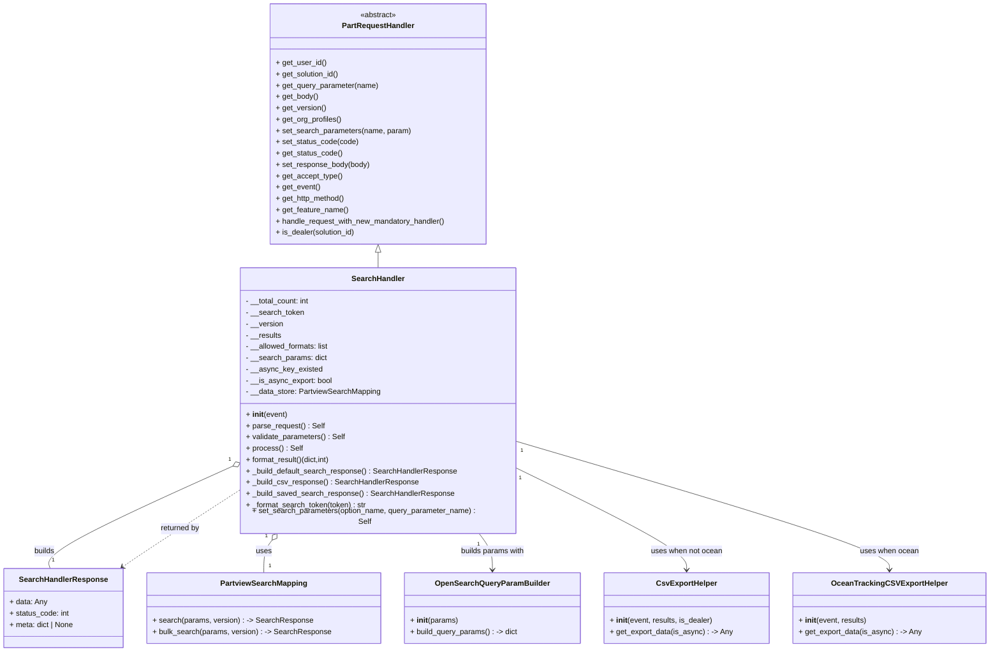

# Diagram: partview_core/partview_service/partview_service/elastic_search/partview_main_search.py


> Auto-generated by Obscura crawlers

## Diagram 1



### SVG

<svg id="container" width="2064.265625" xmlns="http://www.w3.org/2000/svg" class="classDiagram" height="1370" viewBox="0 0 2064.265625 1370" role="graphics-document document" aria-roledescription="class"><style>#container{font-family:"trebuchet ms",verdana,arial,sans-serif;font-size:16px;fill:#333;}@keyframes edge-animation-frame{from{stroke-dashoffset:0;}}@keyframes dash{to{stroke-dashoffset:0;}}#container .edge-animation-slow{stroke-dasharray:9,5!important;stroke-dashoffset:900;animation:dash 50s linear infinite;stroke-linecap:round;}#container .edge-animation-fast{stroke-dasharray:9,5!important;stroke-dashoffset:900;animation:dash 20s linear infinite;stroke-linecap:round;}#container .error-icon{fill:#552222;}#container .error-text{fill:#552222;stroke:#552222;}#container .edge-thickness-normal{stroke-width:1px;}#container .edge-thickness-thick{stroke-width:3.5px;}#container .edge-pattern-solid{stroke-dasharray:0;}#container .edge-thickness-invisible{stroke-width:0;fill:none;}#container .edge-pattern-dashed{stroke-dasharray:3;}#container .edge-pattern-dotted{stroke-dasharray:2;}#container .marker{fill:#333333;stroke:#333333;}#container .marker.cross{stroke:#333333;}#container svg{font-family:"trebuchet ms",verdana,arial,sans-serif;font-size:16px;}#container p{margin:0;}#container g.classGroup text{fill:#9370DB;stroke:none;font-family:"trebuchet ms",verdana,arial,sans-serif;font-size:10px;}#container g.classGroup text .title{font-weight:bolder;}#container .nodeLabel,#container .edgeLabel{color:#131300;}#container .edgeLabel .label rect{fill:#ECECFF;}#container .label text{fill:#131300;}#container .labelBkg{background:#ECECFF;}#container .edgeLabel .label span{background:#ECECFF;}#container .classTitle{font-weight:bolder;}#container .node rect,#container .node circle,#container .node ellipse,#container .node polygon,#container .node path{fill:#ECECFF;stroke:#9370DB;stroke-width:1px;}#container .divider{stroke:#9370DB;stroke-width:1;}#container g.clickable{cursor:pointer;}#container g.classGroup rect{fill:#ECECFF;stroke:#9370DB;}#container g.classGroup line{stroke:#9370DB;stroke-width:1;}#container .classLabel .box{stroke:none;stroke-width:0;fill:#ECECFF;opacity:0.5;}#container .classLabel .label{fill:#9370DB;font-size:10px;}#container .relation{stroke:#333333;stroke-width:1;fill:none;}#container .dashed-line{stroke-dasharray:3;}#container .dotted-line{stroke-dasharray:1 2;}#container #compositionStart,#container .composition{fill:#333333!important;stroke:#333333!important;stroke-width:1;}#container #compositionEnd,#container .composition{fill:#333333!important;stroke:#333333!important;stroke-width:1;}#container #dependencyStart,#container .dependency{fill:#333333!important;stroke:#333333!important;stroke-width:1;}#container #dependencyStart,#container .dependency{fill:#333333!important;stroke:#333333!important;stroke-width:1;}#container #extensionStart,#container .extension{fill:transparent!important;stroke:#333333!important;stroke-width:1;}#container #extensionEnd,#container .extension{fill:transparent!important;stroke:#333333!important;stroke-width:1;}#container #aggregationStart,#container .aggregation{fill:transparent!important;stroke:#333333!important;stroke-width:1;}#container #aggregationEnd,#container .aggregation{fill:transparent!important;stroke:#333333!important;stroke-width:1;}#container #lollipopStart,#container .lollipop{fill:#ECECFF!important;stroke:#333333!important;stroke-width:1;}#container #lollipopEnd,#container .lollipop{fill:#ECECFF!important;stroke:#333333!important;stroke-width:1;}#container .edgeTerminals{font-size:11px;line-height:initial;}#container .classTitleText{text-anchor:middle;font-size:18px;fill:#333;}#container .label-icon{display:inline-block;height:1em;overflow:visible;vertical-align:-0.125em;}#container .node .label-icon path{fill:currentColor;stroke:revert;stroke-width:revert;}#container :root{--mermaid-font-family:"trebuchet ms",verdana,arial,sans-serif;}</style><g><defs><marker id="container_class-aggregationStart" class="marker aggregation class" refX="18" refY="7" markerWidth="190" markerHeight="240" orient="auto"><path d="M 18,7 L9,13 L1,7 L9,1 Z"></path></marker></defs><defs><marker id="container_class-aggregationEnd" class="marker aggregation class" refX="1" refY="7" markerWidth="20" markerHeight="28" orient="auto"><path d="M 18,7 L9,13 L1,7 L9,1 Z"></path></marker></defs><defs><marker id="container_class-extensionStart" class="marker extension class" refX="18" refY="7" markerWidth="190" markerHeight="240" orient="auto"><path d="M 1,7 L18,13 V 1 Z"></path></marker></defs><defs><marker id="container_class-extensionEnd" class="marker extension class" refX="1" refY="7" markerWidth="20" markerHeight="28" orient="auto"><path d="M 1,1 V 13 L18,7 Z"></path></marker></defs><defs><marker id="container_class-compositionStart" class="marker composition class" refX="18" refY="7" markerWidth="190" markerHeight="240" orient="auto"><path d="M 18,7 L9,13 L1,7 L9,1 Z"></path></marker></defs><defs><marker id="container_class-compositionEnd" class="marker composition class" refX="1" refY="7" markerWidth="20" markerHeight="28" orient="auto"><path d="M 18,7 L9,13 L1,7 L9,1 Z"></path></marker></defs><defs><marker id="container_class-dependencyStart" class="marker dependency class" refX="6" refY="7" markerWidth="190" markerHeight="240" orient="auto"><path d="M 5,7 L9,13 L1,7 L9,1 Z"></path></marker></defs><defs><marker id="container_class-dependencyEnd" class="marker dependency class" refX="13" refY="7" markerWidth="20" markerHeight="28" orient="auto"><path d="M 18,7 L9,13 L14,7 L9,1 Z"></path></marker></defs><defs><marker id="container_class-lollipopStart" class="marker lollipop class" refX="13" refY="7" markerWidth="190" markerHeight="240" orient="auto"><circle stroke="black" fill="transparent" cx="7" cy="7" r="6"></circle></marker></defs><defs><marker id="container_class-lollipopEnd" class="marker lollipop class" refX="1" refY="7" markerWidth="190" markerHeight="240" orient="auto"><circle stroke="black" fill="transparent" cx="7" cy="7" r="6"></circle></marker></defs><g class="root"><g class="clusters"></g><g class="edgePaths"><path d="M791.363,535.25L791.363,536.542C791.363,537.833,791.363,540.417,791.363,545.875C791.363,551.333,791.363,559.667,791.363,563.833L791.363,568" id="id_PartRequestHandler_SearchHandler_1" class="edge-thickness-normal edge-pattern-solid relation" style=";;;" data-edge="true" data-et="edge" data-id="id_PartRequestHandler_SearchHandler_1" data-points="W3sieCI6NzkxLjM2MzI4MTI1LCJ5Ijo1MTh9LHsieCI6NzkxLjM2MzI4MTI1LCJ5Ijo1NDN9LHsieCI6NzkxLjM2MzI4MTI1LCJ5Ijo1Njh9XQ==" marker-start="url(#container_class-extensionStart)"></path><path d="M482.806,981.917L417.522,1011.098C352.238,1040.278,221.67,1098.639,158.55,1133.986C95.431,1169.333,99.76,1181.667,101.924,1187.833L104.089,1194" id="id_SearchHandler_SearchHandlerResponse_2" class="edge-thickness-normal edge-pattern-solid relation" style=";;;" data-edge="true" data-et="edge" data-id="id_SearchHandler_SearchHandlerResponse_2" data-points="W3sieCI6NDk4LjU1NDY4NzUsInkiOjk3NC44NzgzMzc4OTgyMTg5fSx7IngiOjkxLjEwMTU2MjUsInkiOjExNTd9LHsieCI6MTA0LjA4OTA2ODk1NjYxMTU3LCJ5IjoxMTk0fV0=" marker-start="url(#container_class-aggregationStart)"></path><path d="M570.243,1133.712L567.28,1137.594C564.318,1141.475,558.393,1149.237,555.431,1160.785C552.469,1172.333,552.469,1187.667,552.469,1195.333L552.469,1203" id="id_SearchHandler_PartviewSearchMapping_3" class="edge-thickness-normal edge-pattern-solid relation" style=";;;" data-edge="true" data-et="edge" data-id="id_SearchHandler_PartviewSearchMapping_3" data-points="W3sieCI6NTgwLjcwODY3ODYxNDIxNzIsInkiOjExMjB9LHsieCI6NTUyLjQ2ODc1LCJ5IjoxMTU3fSx7IngiOjU1Mi40Njg3NSwieSI6MTIwM31d" marker-start="url(#container_class-aggregationStart)"></path><path d="M1002.018,1120L1006.725,1126.167C1011.431,1132.333,1020.845,1144.667,1025.551,1157.5C1030.258,1170.333,1030.258,1183.667,1030.258,1190.333L1030.258,1197" id="id_SearchHandler_OpenSearchQueryParamBuilder_4" class="edge-thickness-normal edge-pattern-solid relation" style=";;;" data-edge="true" data-et="edge" data-id="id_SearchHandler_OpenSearchQueryParamBuilder_4" data-points="W3sieCI6MTAwMi4wMTc4ODM4ODU3ODI4LCJ5IjoxMTIwfSx7IngiOjEwMzAuMjU3ODEyNSwieSI6MTE1N30seyJ4IjoxMDMwLjI1NzgxMjUsInkiOjEyMDN9XQ==" marker-end="url(#container_class-dependencyEnd)"></path><path d="M1084.172,986.07L1142.887,1014.558C1201.602,1043.047,1319.031,1100.023,1377.746,1135.178C1436.461,1170.333,1436.461,1183.667,1436.461,1190.333L1436.461,1197" id="id_SearchHandler_CsvExportHelper_5" class="edge-thickness-normal edge-pattern-solid relation" style=";;;" data-edge="true" data-et="edge" data-id="id_SearchHandler_CsvExportHelper_5" data-points="W3sieCI6MTA4NC4xNzE4NzUsInkiOjk4Ni4wNzAxMDIwMzE1NDh9LHsieCI6MTQzNi40NjA5Mzc1LCJ5IjoxMTU3fSx7IngiOjE0MzYuNDYwOTM3NSwieSI6MTIwM31d" marker-end="url(#container_class-dependencyEnd)"></path><path d="M1084.172,929.985L1213.015,967.821C1341.858,1005.657,1599.544,1081.328,1728.387,1125.831C1857.23,1170.333,1857.23,1183.667,1857.23,1190.333L1857.23,1197" id="id_SearchHandler_OceanTrackingCSVExportHelper_6" class="edge-thickness-normal edge-pattern-solid relation" style=";;;" data-edge="true" data-et="edge" data-id="id_SearchHandler_OceanTrackingCSVExportHelper_6" data-points="W3sieCI6MTA4NC4xNzE4NzUsInkiOjkyOS45ODU0Njg4NDUwNTcyfSx7IngiOjE4NTcuMjMwNDY4NzUsInkiOjExNTd9LHsieCI6MTg1Ny4yMzA0Njg3NSwieSI6MTIwM31d" marker-end="url(#container_class-dependencyEnd)"></path><path d="M256.461,1190.52L264.309,1184.934C272.157,1179.347,287.853,1168.173,328.202,1141.733C368.551,1115.292,433.553,1073.585,466.054,1052.731L498.555,1031.877" id="id_SearchHandlerResponse_SearchHandler_7" class="edge-thickness-normal edge-pattern-dashed relation" style=";;;" data-edge="true" data-et="edge" data-id="id_SearchHandlerResponse_SearchHandler_7" data-points="W3sieCI6MjUxLjU3MzEyMTEyNjAzMzA3LCJ5IjoxMTk0fSx7IngiOjMwMy41NDg4MjgxMjUsInkiOjExNTd9LHsieCI6NDk4LjU1NDY4NzUsInkiOjEwMzEuODc2OTQ2MzYwNzIxfV0=" marker-start="url(#container_class-dependencyStart)"></path></g><g class="edgeLabels"><g class="edgeLabel"><g class="label" data-id="id_PartRequestHandler_SearchHandler_1" transform="translate(0, 0)"><foreignObject width="0" height="0"><div xmlns="http://www.w3.org/1999/xhtml" class="labelBkg" style="display: table-cell; white-space: nowrap; line-height: 1.5; max-width: 200px; text-align: center;"><span class="edgeLabel"></span></div></foreignObject></g></g><g class="edgeLabel" transform="translate(276.92824, 1073.93998)"><g class="label" data-id="id_SearchHandler_SearchHandlerResponse_2" transform="translate(-22.4921875, -12)"><foreignObject width="44.984375" height="24"><div xmlns="http://www.w3.org/1999/xhtml" class="labelBkg" style="display: table-cell; white-space: nowrap; line-height: 1.5; max-width: 200px; text-align: center;"><span class="edgeLabel"><p>builds</p></span></div></foreignObject></g></g><g class="edgeLabel" transform="translate(552.46875, 1157)"><g class="label" data-id="id_SearchHandler_PartviewSearchMapping_3" transform="translate(-16.4921875, -12)"><foreignObject width="32.984375" height="24"><div xmlns="http://www.w3.org/1999/xhtml" class="labelBkg" style="display: table-cell; white-space: nowrap; line-height: 1.5; max-width: 200px; text-align: center;"><span class="edgeLabel"><p>uses</p></span></div></foreignObject></g></g><g class="edgeLabel" transform="translate(1030.2578125, 1157)"><g class="label" data-id="id_SearchHandler_OpenSearchQueryParamBuilder_4" transform="translate(-69.078125, -12)"><foreignObject width="138.15625" height="24"><div xmlns="http://www.w3.org/1999/xhtml" class="labelBkg" style="display: table-cell; white-space: nowrap; line-height: 1.5; max-width: 200px; text-align: center;"><span class="edgeLabel"><p>builds params with</p></span></div></foreignObject></g></g><g class="edgeLabel" transform="translate(1436.4609375, 1157)"><g class="label" data-id="id_SearchHandler_CsvExportHelper_5" transform="translate(-76.2265625, -12)"><foreignObject width="152.453125" height="24"><div xmlns="http://www.w3.org/1999/xhtml" class="labelBkg" style="display: table-cell; white-space: nowrap; line-height: 1.5; max-width: 200px; text-align: center;"><span class="edgeLabel"><p>uses when not ocean</p></span></div></foreignObject></g></g><g class="edgeLabel" transform="translate(1857.23046875, 1157)"><g class="label" data-id="id_SearchHandler_OceanTrackingCSVExportHelper_6" transform="translate(-61.859375, -12)"><foreignObject width="123.71875" height="24"><div xmlns="http://www.w3.org/1999/xhtml" class="labelBkg" style="display: table-cell; white-space: nowrap; line-height: 1.5; max-width: 200px; text-align: center;"><span class="edgeLabel"><p>uses when ocean</p></span></div></foreignObject></g></g><g class="edgeLabel" transform="translate(374.20317, 1111.66553)"><g class="label" data-id="id_SearchHandlerResponse_SearchHandler_7" transform="translate(-42.453125, -12)"><foreignObject width="84.90625" height="24"><div xmlns="http://www.w3.org/1999/xhtml" class="labelBkg" style="display: table-cell; white-space: nowrap; line-height: 1.5; max-width: 200px; text-align: center;"><span class="edgeLabel"><p>returned by</p></span></div></foreignObject></g></g><g class="edgeTerminals" transform="translate(476.4570209082855, 968.325235472254)"><g class="inner" transform="translate(0, 0)"><foreignObject style="width: 9px; height: 12px;"><div xmlns="http://www.w3.org/1999/xhtml" style="display: inline-block; padding-right: 1px; white-space: nowrap;"><span class="edgeLabel">1</span></div></foreignObject></g></g><g class="edgeTerminals" transform="translate(558.1673751384507, 1124.8103569048749)"><g class="inner" transform="translate(0, 0)"><foreignObject style="width: 9px; height: 12px;"><div xmlns="http://www.w3.org/1999/xhtml" style="display: inline-block; padding-right: 1px; white-space: nowrap;"><span class="edgeLabel">1</span></div></foreignObject></g></g><g class="edgeTerminals" transform="translate(1000.7116143244504, 1143.0118151262213)"><g class="inner" transform="translate(0, 0)"><foreignObject style="width: 9px; height: 12px;"><div xmlns="http://www.w3.org/1999/xhtml" style="display: inline-block; padding-right: 1px; white-space: nowrap;"><span class="edgeLabel">1</span></div></foreignObject></g></g><g class="edgeTerminals" transform="translate(1093.368543454084, 1007.2047015581284)"><g class="inner" transform="translate(0, 0)"><foreignObject style="width: 9px; height: 12px;"><div xmlns="http://www.w3.org/1999/xhtml" style="display: inline-block; padding-right: 1px; white-space: nowrap;"><span class="edgeLabel">1</span></div></foreignObject></g></g><g class="edgeTerminals" transform="translate(1096.7364623884018, 949.3085431170038)"><g class="inner" transform="translate(0, 0)"><foreignObject style="width: 9px; height: 12px;"><div xmlns="http://www.w3.org/1999/xhtml" style="display: inline-block; padding-right: 1px; white-space: nowrap;"><span class="edgeLabel">1</span></div></foreignObject></g></g><g class="edgeTerminals" transform="translate(107.44642612149099, 1167.5196708353958)"><g class="inner" transform="translate(0, 0)"></g><foreignObject style="width: 9px; height: 12px;"><div xmlns="http://www.w3.org/1999/xhtml" style="display: inline-block; padding-right: 1px; white-space: nowrap;"><span class="edgeLabel">1</span></div></foreignObject></g><g class="edgeTerminals" transform="translate(562.46875, 1180.5)"><g class="inner" transform="translate(0, 0)"></g><foreignObject style="width: 9px; height: 12px;"><div xmlns="http://www.w3.org/1999/xhtml" style="display: inline-block; padding-right: 1px; white-space: nowrap;"><span class="edgeLabel">1</span></div></foreignObject></g></g><g class="nodes"><g class="node default" id="classId-SearchHandler-0" transform="translate(791.36328125, 844)"><g class="basic label-container"><path d="M-292.80859375 -276 L292.80859375 -276 L292.80859375 276 L-292.80859375 276" stroke="none" stroke-width="0" fill="#ECECFF" style=""></path><path d="M-292.80859375 -276 C-101.21494889776213 -276, 90.37869595447575 -276, 292.80859375 -276 M-292.80859375 -276 C-114.16450506881259 -276, 64.47958361237482 -276, 292.80859375 -276 M292.80859375 -276 C292.80859375 -77.13582099231155, 292.80859375 121.7283580153769, 292.80859375 276 M292.80859375 -276 C292.80859375 -72.84590523323061, 292.80859375 130.30818953353878, 292.80859375 276 M292.80859375 276 C93.86276586148867 276, -105.08306202702266 276, -292.80859375 276 M292.80859375 276 C173.1758743588959 276, 53.543154967791764 276, -292.80859375 276 M-292.80859375 276 C-292.80859375 147.95810986180908, -292.80859375 19.916219723618156, -292.80859375 -276 M-292.80859375 276 C-292.80859375 144.9949429331904, -292.80859375 13.989885866380803, -292.80859375 -276" stroke="#9370DB" stroke-width="1.3" fill="none" stroke-dasharray="0 0" style=""></path></g><g class="annotation-group text" transform="translate(0, -252)"></g><g class="label-group text" transform="translate(-53.8046875, -252)"><g class="label" style="font-weight: bolder" transform="translate(0,-12)"><foreignObject width="107.609375" height="24"><div xmlns="http://www.w3.org/1999/xhtml" style="display: table-cell; white-space: nowrap; line-height: 1.5; max-width: 158px; text-align: center;"><span class="nodeLabel markdown-node-label" style=""><p>SearchHandler</p></span></div></foreignObject></g></g><g class="members-group text" transform="translate(-280.80859375, -204)"><g class="label" style="" transform="translate(0,-12)"><foreignObject width="137.578125" height="24"><div xmlns="http://www.w3.org/1999/xhtml" style="display: table-cell; white-space: nowrap; line-height: 1.5; max-width: 195px; text-align: center;"><span class="nodeLabel markdown-node-label" style=""><p>- __total_count: int</p></span></div></foreignObject></g><g class="label" style="" transform="translate(0,12)"><foreignObject width="123.65625" height="24"><div xmlns="http://www.w3.org/1999/xhtml" style="display: table-cell; white-space: nowrap; line-height: 1.5; max-width: 181px; text-align: center;"><span class="nodeLabel markdown-node-label" style=""><p>- __search_token</p></span></div></foreignObject></g><g class="label" style="" transform="translate(0,36)"><foreignObject width="79.859375" height="24"><div xmlns="http://www.w3.org/1999/xhtml" style="display: table-cell; white-space: nowrap; line-height: 1.5; max-width: 137px; text-align: center;"><span class="nodeLabel markdown-node-label" style=""><p>- __version</p></span></div></foreignObject></g><g class="label" style="" transform="translate(0,60)"><foreignObject width="76.3125" height="24"><div xmlns="http://www.w3.org/1999/xhtml" style="display: table-cell; white-space: nowrap; line-height: 1.5; max-width: 134px; text-align: center;"><span class="nodeLabel markdown-node-label" style=""><p>- __results</p></span></div></foreignObject></g><g class="label" style="" transform="translate(0,84)"><foreignObject width="178.71875" height="24"><div xmlns="http://www.w3.org/1999/xhtml" style="display: table-cell; white-space: nowrap; line-height: 1.5; max-width: 236px; text-align: center;"><span class="nodeLabel markdown-node-label" style=""><p>- __allowed_formats: list</p></span></div></foreignObject></g><g class="label" style="" transform="translate(0,108)"><foreignObject width="172.09375" height="24"><div xmlns="http://www.w3.org/1999/xhtml" style="display: table-cell; white-space: nowrap; line-height: 1.5; max-width: 230px; text-align: center;"><span class="nodeLabel markdown-node-label" style=""><p>- __search_params: dict</p></span></div></foreignObject></g><g class="label" style="" transform="translate(0,132)"><foreignObject width="160.0625" height="24"><div xmlns="http://www.w3.org/1999/xhtml" style="display: table-cell; white-space: nowrap; line-height: 1.5; max-width: 217px; text-align: center;"><span class="nodeLabel markdown-node-label" style=""><p>- __async_key_existed</p></span></div></foreignObject></g><g class="label" style="" transform="translate(0,156)"><foreignObject width="183.640625" height="24"><div xmlns="http://www.w3.org/1999/xhtml" style="display: table-cell; white-space: nowrap; line-height: 1.5; max-width: 241px; text-align: center;"><span class="nodeLabel markdown-node-label" style=""><p>- __is_async_export: bool</p></span></div></foreignObject></g><g class="label" style="" transform="translate(0,180)"><foreignObject width="285.296875" height="24"><div xmlns="http://www.w3.org/1999/xhtml" style="display: table-cell; white-space: nowrap; line-height: 1.5; max-width: 343px; text-align: center;"><span class="nodeLabel markdown-node-label" style=""><p>- __data_store: PartviewSearchMapping</p></span></div></foreignObject></g></g><g class="methods-group text" transform="translate(-280.80859375, 36)"><g class="label" style="" transform="translate(0,-12)"><foreignObject width="87.390625" height="24"><div xmlns="http://www.w3.org/1999/xhtml" style="display: table-cell; white-space: nowrap; line-height: 1.5; max-width: 177px; text-align: center;"><span class="nodeLabel markdown-node-label" style=""><p>+ <strong>init</strong>(event)</p></span></div></foreignObject></g><g class="label" style="" transform="translate(0,12)"><foreignObject width="165.84375" height="24"><div xmlns="http://www.w3.org/1999/xhtml" style="display: table-cell; white-space: nowrap; line-height: 1.5; max-width: 225px; text-align: center;"><span class="nodeLabel markdown-node-label" style=""><p>+ parse_request() : Self</p></span></div></foreignObject></g><g class="label" style="" transform="translate(0,36)"><foreignObject width="210.765625" height="24"><div xmlns="http://www.w3.org/1999/xhtml" style="display: table-cell; white-space: nowrap; line-height: 1.5; max-width: 270px; text-align: center;"><span class="nodeLabel markdown-node-label" style=""><p>+ validate_parameters() : Self</p></span></div></foreignObject></g><g class="label" style="" transform="translate(0,60)"><foreignObject width="117.78125" height="24"><div xmlns="http://www.w3.org/1999/xhtml" style="display: table-cell; white-space: nowrap; line-height: 1.5; max-width: 177px; text-align: center;"><span class="nodeLabel markdown-node-label" style=""><p>+ process() : Self</p></span></div></foreignObject></g><g class="label" style="" transform="translate(0,84)"><foreignObject width="182.9375" height="24"><div xmlns="http://www.w3.org/1999/xhtml" style="display: table-cell; white-space: nowrap; line-height: 1.5; max-width: 240px; text-align: center;"><span class="nodeLabel markdown-node-label" style=""><p>+ format_result()(dict,int)</p></span></div></foreignObject></g><g class="label" style="" transform="translate(0,108)"><foreignObject width="447.703125" height="24"><div xmlns="http://www.w3.org/1999/xhtml" style="display: table-cell; white-space: nowrap; line-height: 1.5; max-width: 505px; text-align: center;"><span class="nodeLabel markdown-node-label" style=""><p>+ _build_default_search_response() : SearchHandlerResponse</p></span></div></foreignObject></g><g class="label" style="" transform="translate(0,132)"><foreignObject width="362.390625" height="24"><div xmlns="http://www.w3.org/1999/xhtml" style="display: table-cell; white-space: nowrap; line-height: 1.5; max-width: 420px; text-align: center;"><span class="nodeLabel markdown-node-label" style=""><p>+ _build_csv_response() : SearchHandlerResponse</p></span></div></foreignObject></g><g class="label" style="" transform="translate(0,156)"><foreignObject width="438.125" height="24"><div xmlns="http://www.w3.org/1999/xhtml" style="display: table-cell; white-space: nowrap; line-height: 1.5; max-width: 495px; text-align: center;"><span class="nodeLabel markdown-node-label" style=""><p>+ _build_saved_search_response() : SearchHandlerResponse</p></span></div></foreignObject></g><g class="label" style="" transform="translate(0,180)"><foreignObject width="257.078125" height="24"><div xmlns="http://www.w3.org/1999/xhtml" style="display: table-cell; white-space: nowrap; line-height: 1.5; max-width: 315px; text-align: center;"><span class="nodeLabel markdown-node-label" style=""><p>+ _format_search_token(token) : str</p></span></div></foreignObject></g><g class="label" style="" transform="translate(0,204)"><foreignObject width="507.8125" height="24"><div xmlns="http://www.w3.org/1999/xhtml" style="display: table-cell; white-space: nowrap; line-height: 1.5; max-width: 567px; text-align: center;"><span class="nodeLabel markdown-node-label" style=""><p>+ set_search_parameters(option_name, query_parameter_name) : Self</p></span></div></foreignObject></g></g><g class="divider" style=""><path d="M-292.80859375 -228 C-143.58933189675298 -228, 5.629929956494038 -228, 292.80859375 -228 M-292.80859375 -228 C-165.15576850944313 -228, -37.50294326888624 -228, 292.80859375 -228" stroke="#9370DB" stroke-width="1.3" fill="none" stroke-dasharray="0 0" style=""></path></g><g class="divider" style=""><path d="M-292.80859375 12 C-80.83191626604642 12, 131.14476121790716 12, 292.80859375 12 M-292.80859375 12 C-113.99901574372487 12, 64.81056226255026 12, 292.80859375 12" stroke="#9370DB" stroke-width="1.3" fill="none" stroke-dasharray="0 0" style=""></path></g></g><g class="node default" id="classId-SearchHandlerResponse-1" transform="translate(133.57421875, 1278)"><g class="basic label-container"><path d="M-125.57421875 -84 L125.57421875 -84 L125.57421875 84 L-125.57421875 84" stroke="none" stroke-width="0" fill="#ECECFF" style=""></path><path d="M-125.57421875 -84 C-50.62172110361544 -84, 24.330776542769115 -84, 125.57421875 -84 M-125.57421875 -84 C-39.228748603062144 -84, 47.11672154387571 -84, 125.57421875 -84 M125.57421875 -84 C125.57421875 -34.474265593190204, 125.57421875 15.051468813619593, 125.57421875 84 M125.57421875 -84 C125.57421875 -37.76273128927487, 125.57421875 8.474537421450265, 125.57421875 84 M125.57421875 84 C59.75440692766611 84, -6.065404894667779 84, -125.57421875 84 M125.57421875 84 C26.322185483598233 84, -72.92984778280353 84, -125.57421875 84 M-125.57421875 84 C-125.57421875 40.171632986760926, -125.57421875 -3.656734026478148, -125.57421875 -84 M-125.57421875 84 C-125.57421875 44.473039415933265, -125.57421875 4.946078831866529, -125.57421875 -84" stroke="#9370DB" stroke-width="1.3" fill="none" stroke-dasharray="0 0" style=""></path></g><g class="annotation-group text" transform="translate(0, -60)"></g><g class="label-group text" transform="translate(-89.2421875, -60)"><g class="label" style="font-weight: bolder" transform="translate(0,-12)"><foreignObject width="178.484375" height="24"><div xmlns="http://www.w3.org/1999/xhtml" style="display: table-cell; white-space: nowrap; line-height: 1.5; max-width: 227px; text-align: center;"><span class="nodeLabel markdown-node-label" style=""><p>SearchHandlerResponse</p></span></div></foreignObject></g></g><g class="members-group text" transform="translate(-113.57421875, -12)"><g class="label" style="" transform="translate(0,-12)"><foreignObject width="79.25" height="24"><div xmlns="http://www.w3.org/1999/xhtml" style="display: table-cell; white-space: nowrap; line-height: 1.5; max-width: 137px; text-align: center;"><span class="nodeLabel markdown-node-label" style=""><p>+ data: Any</p></span></div></foreignObject></g><g class="label" style="" transform="translate(0,12)"><foreignObject width="127.015625" height="24"><div xmlns="http://www.w3.org/1999/xhtml" style="display: table-cell; white-space: nowrap; line-height: 1.5; max-width: 185px; text-align: center;"><span class="nodeLabel markdown-node-label" style=""><p>+ status_code: int</p></span></div></foreignObject></g><g class="label" style="" transform="translate(0,36)"><foreignObject width="137.90625" height="24"><div xmlns="http://www.w3.org/1999/xhtml" style="display: table-cell; white-space: nowrap; line-height: 1.5; max-width: 195px; text-align: center;"><span class="nodeLabel markdown-node-label" style=""><p>+ meta: dict | None</p></span></div></foreignObject></g></g><g class="methods-group text" transform="translate(-113.57421875, 84)"></g><g class="divider" style=""><path d="M-125.57421875 -36 C-49.58493373320442 -36, 26.404351283591154 -36, 125.57421875 -36 M-125.57421875 -36 C-29.447914380529227 -36, 66.67838998894155 -36, 125.57421875 -36" stroke="#9370DB" stroke-width="1.3" fill="none" stroke-dasharray="0 0" style=""></path></g><g class="divider" style=""><path d="M-125.57421875 60 C-25.45262543176237 60, 74.66896788647526 60, 125.57421875 60 M-125.57421875 60 C-36.71032046649566 60, 52.15357781700868 60, 125.57421875 60" stroke="#9370DB" stroke-width="1.3" fill="none" stroke-dasharray="0 0" style=""></path></g></g><g class="node default" id="classId-PartRequestHandler-2" transform="translate(791.36328125, 263)"><g class="basic label-container"><path d="M-231.36328125 -255 L231.36328125 -255 L231.36328125 255 L-231.36328125 255" stroke="none" stroke-width="0" fill="#ECECFF" style=""></path><path d="M-231.36328125 -255 C-55.624488400776784 -255, 120.11430444844643 -255, 231.36328125 -255 M-231.36328125 -255 C-127.30671416710474 -255, -23.250147084209488 -255, 231.36328125 -255 M231.36328125 -255 C231.36328125 -101.77972986067988, 231.36328125 51.44054027864024, 231.36328125 255 M231.36328125 -255 C231.36328125 -63.08765989193506, 231.36328125 128.82468021612988, 231.36328125 255 M231.36328125 255 C124.53602044671801 255, 17.708759643436025 255, -231.36328125 255 M231.36328125 255 C97.65918639051725 255, -36.0449084689655 255, -231.36328125 255 M-231.36328125 255 C-231.36328125 135.84460423701498, -231.36328125 16.689208474029954, -231.36328125 -255 M-231.36328125 255 C-231.36328125 68.89338693145623, -231.36328125 -117.21322613708753, -231.36328125 -255" stroke="#9370DB" stroke-width="1.3" fill="none" stroke-dasharray="0 0" style=""></path></g><g class="annotation-group text" transform="translate(-38.609375, -231)"><g class="label" style="" transform="translate(0,-12)"><foreignObject width="77.21875" height="24"><div xmlns="http://www.w3.org/1999/xhtml" style="display: table-cell; white-space: nowrap; line-height: 1.5; max-width: 127px; text-align: center;"><span class="nodeLabel markdown-node-label" style=""><p>«abstract»</p></span></div></foreignObject></g></g><g class="label-group text" transform="translate(-74.1328125, -207)"><g class="label" style="font-weight: bolder" transform="translate(0,-12)"><foreignObject width="148.265625" height="24"><div xmlns="http://www.w3.org/1999/xhtml" style="display: table-cell; white-space: nowrap; line-height: 1.5; max-width: 197px; text-align: center;"><span class="nodeLabel markdown-node-label" style=""><p>PartRequestHandler</p></span></div></foreignObject></g></g><g class="members-group text" transform="translate(-219.36328125, -159)"></g><g class="methods-group text" transform="translate(-219.36328125, -129)"><g class="label" style="" transform="translate(0,-12)"><foreignObject width="105.953125" height="24"><div xmlns="http://www.w3.org/1999/xhtml" style="display: table-cell; white-space: nowrap; line-height: 1.5; max-width: 163px; text-align: center;"><span class="nodeLabel markdown-node-label" style=""><p>+ get_user_id()</p></span></div></foreignObject></g><g class="label" style="" transform="translate(0,12)"><foreignObject width="135.703125" height="24"><div xmlns="http://www.w3.org/1999/xhtml" style="display: table-cell; white-space: nowrap; line-height: 1.5; max-width: 193px; text-align: center;"><span class="nodeLabel markdown-node-label" style=""><p>+ get_solution_id()</p></span></div></foreignObject></g><g class="label" style="" transform="translate(0,36)"><foreignObject width="218.390625" height="24"><div xmlns="http://www.w3.org/1999/xhtml" style="display: table-cell; white-space: nowrap; line-height: 1.5; max-width: 276px; text-align: center;"><span class="nodeLabel markdown-node-label" style=""><p>+ get_query_parameter(name)</p></span></div></foreignObject></g><g class="label" style="" transform="translate(0,60)"><foreignObject width="89.765625" height="24"><div xmlns="http://www.w3.org/1999/xhtml" style="display: table-cell; white-space: nowrap; line-height: 1.5; max-width: 147px; text-align: center;"><span class="nodeLabel markdown-node-label" style=""><p>+ get_body()</p></span></div></foreignObject></g><g class="label" style="" transform="translate(0,84)"><foreignObject width="106.171875" height="24"><div xmlns="http://www.w3.org/1999/xhtml" style="display: table-cell; white-space: nowrap; line-height: 1.5; max-width: 164px; text-align: center;"><span class="nodeLabel markdown-node-label" style=""><p>+ get_version()</p></span></div></foreignObject></g><g class="label" style="" transform="translate(0,108)"><foreignObject width="139.6875" height="24"><div xmlns="http://www.w3.org/1999/xhtml" style="display: table-cell; white-space: nowrap; line-height: 1.5; max-width: 197px; text-align: center;"><span class="nodeLabel markdown-node-label" style=""><p>+ get_org_profiles()</p></span></div></foreignObject></g><g class="label" style="" transform="translate(0,132)"><foreignObject width="285.640625" height="24"><div xmlns="http://www.w3.org/1999/xhtml" style="display: table-cell; white-space: nowrap; line-height: 1.5; max-width: 343px; text-align: center;"><span class="nodeLabel markdown-node-label" style=""><p>+ set_search_parameters(name, param)</p></span></div></foreignObject></g><g class="label" style="" transform="translate(0,156)"><foreignObject width="174.890625" height="24"><div xmlns="http://www.w3.org/1999/xhtml" style="display: table-cell; white-space: nowrap; line-height: 1.5; max-width: 232px; text-align: center;"><span class="nodeLabel markdown-node-label" style=""><p>+ set_status_code(code)</p></span></div></foreignObject></g><g class="label" style="" transform="translate(0,180)"><foreignObject width="140.515625" height="24"><div xmlns="http://www.w3.org/1999/xhtml" style="display: table-cell; white-space: nowrap; line-height: 1.5; max-width: 198px; text-align: center;"><span class="nodeLabel markdown-node-label" style=""><p>+ get_status_code()</p></span></div></foreignObject></g><g class="label" style="" transform="translate(0,204)"><foreignObject width="199.765625" height="24"><div xmlns="http://www.w3.org/1999/xhtml" style="display: table-cell; white-space: nowrap; line-height: 1.5; max-width: 257px; text-align: center;"><span class="nodeLabel markdown-node-label" style=""><p>+ set_response_body(body)</p></span></div></foreignObject></g><g class="label" style="" transform="translate(0,228)"><foreignObject width="140.3125" height="24"><div xmlns="http://www.w3.org/1999/xhtml" style="display: table-cell; white-space: nowrap; line-height: 1.5; max-width: 198px; text-align: center;"><span class="nodeLabel markdown-node-label" style=""><p>+ get_accept_type()</p></span></div></foreignObject></g><g class="label" style="" transform="translate(0,252)"><foreignObject width="93.5" height="24"><div xmlns="http://www.w3.org/1999/xhtml" style="display: table-cell; white-space: nowrap; line-height: 1.5; max-width: 151px; text-align: center;"><span class="nodeLabel markdown-node-label" style=""><p>+ get_event()</p></span></div></foreignObject></g><g class="label" style="" transform="translate(0,276)"><foreignObject width="148.40625" height="24"><div xmlns="http://www.w3.org/1999/xhtml" style="display: table-cell; white-space: nowrap; line-height: 1.5; max-width: 206px; text-align: center;"><span class="nodeLabel markdown-node-label" style=""><p>+ get_http_method()</p></span></div></foreignObject></g><g class="label" style="" transform="translate(0,300)"><foreignObject width="153.640625" height="24"><div xmlns="http://www.w3.org/1999/xhtml" style="display: table-cell; white-space: nowrap; line-height: 1.5; max-width: 211px; text-align: center;"><span class="nodeLabel markdown-node-label" style=""><p>+ get_feature_name()</p></span></div></foreignObject></g><g class="label" style="" transform="translate(0,324)"><foreignObject width="364.59375" height="24"><div xmlns="http://www.w3.org/1999/xhtml" style="display: table-cell; white-space: nowrap; line-height: 1.5; max-width: 422px; text-align: center;"><span class="nodeLabel markdown-node-label" style=""><p>+ handle_request_with_new_mandatory_handler()</p></span></div></foreignObject></g><g class="label" style="" transform="translate(0,348)"><foreignObject width="170.671875" height="24"><div xmlns="http://www.w3.org/1999/xhtml" style="display: table-cell; white-space: nowrap; line-height: 1.5; max-width: 228px; text-align: center;"><span class="nodeLabel markdown-node-label" style=""><p>+ is_dealer(solution_id)</p></span></div></foreignObject></g></g><g class="divider" style=""><path d="M-231.36328125 -183 C-136.0161444545265 -183, -40.669007659052994 -183, 231.36328125 -183 M-231.36328125 -183 C-56.82718331206016 -183, 117.70891462587969 -183, 231.36328125 -183" stroke="#9370DB" stroke-width="1.3" fill="none" stroke-dasharray="0 0" style=""></path></g><g class="divider" style=""><path d="M-231.36328125 -159 C-100.77276599228787 -159, 29.817749265424254 -159, 231.36328125 -159 M-231.36328125 -159 C-120.15527667901499 -159, -8.947272108029978 -159, 231.36328125 -159" stroke="#9370DB" stroke-width="1.3" fill="none" stroke-dasharray="0 0" style=""></path></g></g><g class="node default" id="classId-PartviewSearchMapping-3" transform="translate(552.46875, 1278)"><g class="basic label-container"><path d="M-243.3203125 -75 L243.3203125 -75 L243.3203125 75 L-243.3203125 75" stroke="none" stroke-width="0" fill="#ECECFF" style=""></path><path d="M-243.3203125 -75 C-79.08881286434357 -75, 85.14268677131287 -75, 243.3203125 -75 M-243.3203125 -75 C-114.2148977873527 -75, 14.890516925294605 -75, 243.3203125 -75 M243.3203125 -75 C243.3203125 -32.5451110270681, 243.3203125 9.909777945863794, 243.3203125 75 M243.3203125 -75 C243.3203125 -44.385699698317175, 243.3203125 -13.77139939663435, 243.3203125 75 M243.3203125 75 C55.798017712812964 75, -131.72427707437407 75, -243.3203125 75 M243.3203125 75 C121.26725709127867 75, -0.7857983174426693 75, -243.3203125 75 M-243.3203125 75 C-243.3203125 21.11556693873557, -243.3203125 -32.76886612252886, -243.3203125 -75 M-243.3203125 75 C-243.3203125 40.98253508717142, -243.3203125 6.965070174342841, -243.3203125 -75" stroke="#9370DB" stroke-width="1.3" fill="none" stroke-dasharray="0 0" style=""></path></g><g class="annotation-group text" transform="translate(0, -51)"></g><g class="label-group text" transform="translate(-88.015625, -51)"><g class="label" style="font-weight: bolder" transform="translate(0,-12)"><foreignObject width="176.03125" height="24"><div xmlns="http://www.w3.org/1999/xhtml" style="display: table-cell; white-space: nowrap; line-height: 1.5; max-width: 223px; text-align: center;"><span class="nodeLabel markdown-node-label" style=""><p>PartviewSearchMapping</p></span></div></foreignObject></g></g><g class="members-group text" transform="translate(-231.3203125, -3)"></g><g class="methods-group text" transform="translate(-231.3203125, 27)"><g class="label" style="" transform="translate(0,-12)"><foreignObject width="334.609375" height="24"><div xmlns="http://www.w3.org/1999/xhtml" style="display: table-cell; white-space: nowrap; line-height: 1.5; max-width: 413px; text-align: center;"><span class="nodeLabel markdown-node-label" style=""><p>+ search(params, version) : -&gt; SearchResponse</p></span></div></foreignObject></g><g class="label" style="" transform="translate(0,12)"><foreignObject width="374.625" height="24"><div xmlns="http://www.w3.org/1999/xhtml" style="display: table-cell; white-space: nowrap; line-height: 1.5; max-width: 453px; text-align: center;"><span class="nodeLabel markdown-node-label" style=""><p>+ bulk_search(params, version) : -&gt; SearchResponse</p></span></div></foreignObject></g></g><g class="divider" style=""><path d="M-243.3203125 -27 C-85.88682161895838 -27, 71.54666926208324 -27, 243.3203125 -27 M-243.3203125 -27 C-114.80118321513083 -27, 13.717946069738332 -27, 243.3203125 -27" stroke="#9370DB" stroke-width="1.3" fill="none" stroke-dasharray="0 0" style=""></path></g><g class="divider" style=""><path d="M-243.3203125 -3 C-85.4857212451954 -3, 72.34887000960919 -3, 243.3203125 -3 M-243.3203125 -3 C-113.92942428382068 -3, 15.46146393235864 -3, 243.3203125 -3" stroke="#9370DB" stroke-width="1.3" fill="none" stroke-dasharray="0 0" style=""></path></g></g><g class="node default" id="classId-OpenSearchQueryParamBuilder-4" transform="translate(1030.2578125, 1278)"><g class="basic label-container"><path d="M-184.46875 -75 L184.46875 -75 L184.46875 75 L-184.46875 75" stroke="none" stroke-width="0" fill="#ECECFF" style=""></path><path d="M-184.46875 -75 C-47.81317277738438 -75, 88.84240444523124 -75, 184.46875 -75 M-184.46875 -75 C-60.69641889111837 -75, 63.07591221776326 -75, 184.46875 -75 M184.46875 -75 C184.46875 -17.87854667795466, 184.46875 39.24290664409068, 184.46875 75 M184.46875 -75 C184.46875 -40.77074423387809, 184.46875 -6.5414884677561815, 184.46875 75 M184.46875 75 C98.33329025268962 75, 12.197830505379244 75, -184.46875 75 M184.46875 75 C104.3422646803778 75, 24.21577936075559 75, -184.46875 75 M-184.46875 75 C-184.46875 24.813768915449955, -184.46875 -25.37246216910009, -184.46875 -75 M-184.46875 75 C-184.46875 40.316524974857764, -184.46875 5.633049949715527, -184.46875 -75" stroke="#9370DB" stroke-width="1.3" fill="none" stroke-dasharray="0 0" style=""></path></g><g class="annotation-group text" transform="translate(0, -51)"></g><g class="label-group text" transform="translate(-115.28125, -51)"><g class="label" style="font-weight: bolder" transform="translate(0,-12)"><foreignObject width="230.5625" height="24"><div xmlns="http://www.w3.org/1999/xhtml" style="display: table-cell; white-space: nowrap; line-height: 1.5; max-width: 279px; text-align: center;"><span class="nodeLabel markdown-node-label" style=""><p>OpenSearchQueryParamBuilder</p></span></div></foreignObject></g></g><g class="members-group text" transform="translate(-172.46875, -3)"></g><g class="methods-group text" transform="translate(-172.46875, 27)"><g class="label" style="" transform="translate(0,-12)"><foreignObject width="100.59375" height="24"><div xmlns="http://www.w3.org/1999/xhtml" style="display: table-cell; white-space: nowrap; line-height: 1.5; max-width: 191px; text-align: center;"><span class="nodeLabel markdown-node-label" style=""><p>+ <strong>init</strong>(params)</p></span></div></foreignObject></g><g class="label" style="" transform="translate(0,12)"><foreignObject width="229.65625" height="24"><div xmlns="http://www.w3.org/1999/xhtml" style="display: table-cell; white-space: nowrap; line-height: 1.5; max-width: 308px; text-align: center;"><span class="nodeLabel markdown-node-label" style=""><p>+ build_query_params() : -&gt; dict</p></span></div></foreignObject></g></g><g class="divider" style=""><path d="M-184.46875 -27 C-79.53543111053389 -27, 25.397887778932215 -27, 184.46875 -27 M-184.46875 -27 C-48.27254775889972 -27, 87.92365448220056 -27, 184.46875 -27" stroke="#9370DB" stroke-width="1.3" fill="none" stroke-dasharray="0 0" style=""></path></g><g class="divider" style=""><path d="M-184.46875 -3 C-54.5545045117878 -3, 75.3597409764244 -3, 184.46875 -3 M-184.46875 -3 C-41.22219028835187 -3, 102.02436942329626 -3, 184.46875 -3" stroke="#9370DB" stroke-width="1.3" fill="none" stroke-dasharray="0 0" style=""></path></g></g><g class="node default" id="classId-CsvExportHelper-5" transform="translate(1436.4609375, 1278)"><g class="basic label-container"><path d="M-171.734375 -75 L171.734375 -75 L171.734375 75 L-171.734375 75" stroke="none" stroke-width="0" fill="#ECECFF" style=""></path><path d="M-171.734375 -75 C-65.22299724816617 -75, 41.28838050366767 -75, 171.734375 -75 M-171.734375 -75 C-71.1036139290986 -75, 29.5271471418028 -75, 171.734375 -75 M171.734375 -75 C171.734375 -44.253580489234395, 171.734375 -13.50716097846879, 171.734375 75 M171.734375 -75 C171.734375 -15.374475186072289, 171.734375 44.25104962785542, 171.734375 75 M171.734375 75 C44.09804347570743 75, -83.53828804858514 75, -171.734375 75 M171.734375 75 C65.83757924043654 75, -40.05921651912692 75, -171.734375 75 M-171.734375 75 C-171.734375 35.122732373166066, -171.734375 -4.754535253667868, -171.734375 -75 M-171.734375 75 C-171.734375 19.295816402650992, -171.734375 -36.408367194698016, -171.734375 -75" stroke="#9370DB" stroke-width="1.3" fill="none" stroke-dasharray="0 0" style=""></path></g><g class="annotation-group text" transform="translate(0, -51)"></g><g class="label-group text" transform="translate(-60.921875, -51)"><g class="label" style="font-weight: bolder" transform="translate(0,-12)"><foreignObject width="121.84375" height="24"><div xmlns="http://www.w3.org/1999/xhtml" style="display: table-cell; white-space: nowrap; line-height: 1.5; max-width: 170px; text-align: center;"><span class="nodeLabel markdown-node-label" style=""><p>CsvExportHelper</p></span></div></foreignObject></g></g><g class="members-group text" transform="translate(-159.734375, -3)"></g><g class="methods-group text" transform="translate(-159.734375, 27)"><g class="label" style="" transform="translate(0,-12)"><foreignObject width="218.578125" height="24"><div xmlns="http://www.w3.org/1999/xhtml" style="display: table-cell; white-space: nowrap; line-height: 1.5; max-width: 309px; text-align: center;"><span class="nodeLabel markdown-node-label" style=""><p>+ <strong>init</strong>(event, results, is_dealer)</p></span></div></foreignObject></g><g class="label" style="" transform="translate(0,12)"><foreignObject width="258.546875" height="24"><div xmlns="http://www.w3.org/1999/xhtml" style="display: table-cell; white-space: nowrap; line-height: 1.5; max-width: 337px; text-align: center;"><span class="nodeLabel markdown-node-label" style=""><p>+ get_export_data(is_async) : -&gt; Any</p></span></div></foreignObject></g></g><g class="divider" style=""><path d="M-171.734375 -27 C-97.99857069624618 -27, -24.262766392492352 -27, 171.734375 -27 M-171.734375 -27 C-63.37251432357719 -27, 44.989346352845615 -27, 171.734375 -27" stroke="#9370DB" stroke-width="1.3" fill="none" stroke-dasharray="0 0" style=""></path></g><g class="divider" style=""><path d="M-171.734375 -3 C-52.48232069869016 -3, 66.76973360261968 -3, 171.734375 -3 M-171.734375 -3 C-66.27599592512048 -3, 39.18238314975903 -3, 171.734375 -3" stroke="#9370DB" stroke-width="1.3" fill="none" stroke-dasharray="0 0" style=""></path></g></g><g class="node default" id="classId-OceanTrackingCSVExportHelper-6" transform="translate(1857.23046875, 1278)"><g class="basic label-container"><path d="M-199.03515625 -75 L199.03515625 -75 L199.03515625 75 L-199.03515625 75" stroke="none" stroke-width="0" fill="#ECECFF" style=""></path><path d="M-199.03515625 -75 C-78.5115992125824 -75, 42.01195782483521 -75, 199.03515625 -75 M-199.03515625 -75 C-91.3838981984225 -75, 16.267359853155 -75, 199.03515625 -75 M199.03515625 -75 C199.03515625 -42.72314418026692, 199.03515625 -10.446288360533842, 199.03515625 75 M199.03515625 -75 C199.03515625 -33.67972054460729, 199.03515625 7.6405589107854155, 199.03515625 75 M199.03515625 75 C96.19019669259043 75, -6.6547628648191335 75, -199.03515625 75 M199.03515625 75 C100.28963562323878 75, 1.5441149964775605 75, -199.03515625 75 M-199.03515625 75 C-199.03515625 38.112398164797966, -199.03515625 1.2247963295959323, -199.03515625 -75 M-199.03515625 75 C-199.03515625 30.52045376249783, -199.03515625 -13.95909247500434, -199.03515625 -75" stroke="#9370DB" stroke-width="1.3" fill="none" stroke-dasharray="0 0" style=""></path></g><g class="annotation-group text" transform="translate(0, -51)"></g><g class="label-group text" transform="translate(-115.5234375, -51)"><g class="label" style="font-weight: bolder" transform="translate(0,-12)"><foreignObject width="231.046875" height="24"><div xmlns="http://www.w3.org/1999/xhtml" style="display: table-cell; white-space: nowrap; line-height: 1.5; max-width: 278px; text-align: center;"><span class="nodeLabel markdown-node-label" style=""><p>OceanTrackingCSVExportHelper</p></span></div></foreignObject></g></g><g class="members-group text" transform="translate(-187.03515625, -3)"></g><g class="methods-group text" transform="translate(-187.03515625, 27)"><g class="label" style="" transform="translate(0,-12)"><foreignObject width="144.65625" height="24"><div xmlns="http://www.w3.org/1999/xhtml" style="display: table-cell; white-space: nowrap; line-height: 1.5; max-width: 235px; text-align: center;"><span class="nodeLabel markdown-node-label" style=""><p>+ <strong>init</strong>(event, results)</p></span></div></foreignObject></g><g class="label" style="" transform="translate(0,12)"><foreignObject width="258.546875" height="24"><div xmlns="http://www.w3.org/1999/xhtml" style="display: table-cell; white-space: nowrap; line-height: 1.5; max-width: 337px; text-align: center;"><span class="nodeLabel markdown-node-label" style=""><p>+ get_export_data(is_async) : -&gt; Any</p></span></div></foreignObject></g></g><g class="divider" style=""><path d="M-199.03515625 -27 C-47.29285872505608 -27, 104.44943879988784 -27, 199.03515625 -27 M-199.03515625 -27 C-82.09628265726971 -27, 34.84259093546058 -27, 199.03515625 -27" stroke="#9370DB" stroke-width="1.3" fill="none" stroke-dasharray="0 0" style=""></path></g><g class="divider" style=""><path d="M-199.03515625 -3 C-97.17449281677781 -3, 4.686170616444372 -3, 199.03515625 -3 M-199.03515625 -3 C-50.528698684142995 -3, 97.97775888171401 -3, 199.03515625 -3" stroke="#9370DB" stroke-width="1.3" fill="none" stroke-dasharray="0 0" style=""></path></g></g></g></g></g></svg>

## Diagram 2

```mermaid
flowchart TD
    A[lambda_handler(event, context)] --> B[SearchHandler(event)]
    B --> C{set_status_code(200)}
    C --> D[parse_request()]
    D --> E[validate_parameters()]
    E --> F[OpenSearchQueryParamBuilder.build_query_params()]
    F --> G{async key exists?}
    G -- true & is_async_export true --> H[Return early (async export gateway)]
    G -- true & is_async_export false --> I[__data_store.bulk_search(params)]
    I --> J[set __results and __total_count]
    G -- false --> K[__data_store.search(params)]
    K --> L[set __results, __total_count, __search_token]
    J --> M[format_result()]
    L --> M
    M --> N{_is_csv_request()?}
    N -- true --> O[_build_csv_response()]
    N -- false --> P{_is_saved_search_version()?}
    P -- true --> Q[_build_saved_search_response()]
    P -- false --> R[_build_default_search_response()]
    O --> S[set_response_body & set_status_code]
    Q --> S
    R --> S
    S --> T[return response]
```

> SVG rendering failed for this diagram.
