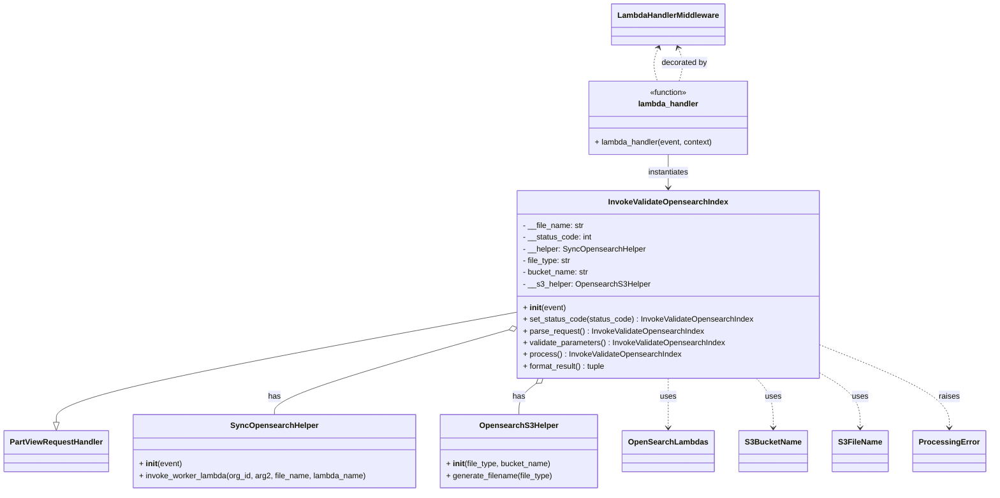

# Diagram: partview_core/partview_service/partview_service/elastic_search/sync_opensearch_index/invoke_validate_opensearch_index.py

> Auto-generated by Obscura crawlers

## Mermaid

> SVG rendering failed for this diagram.
