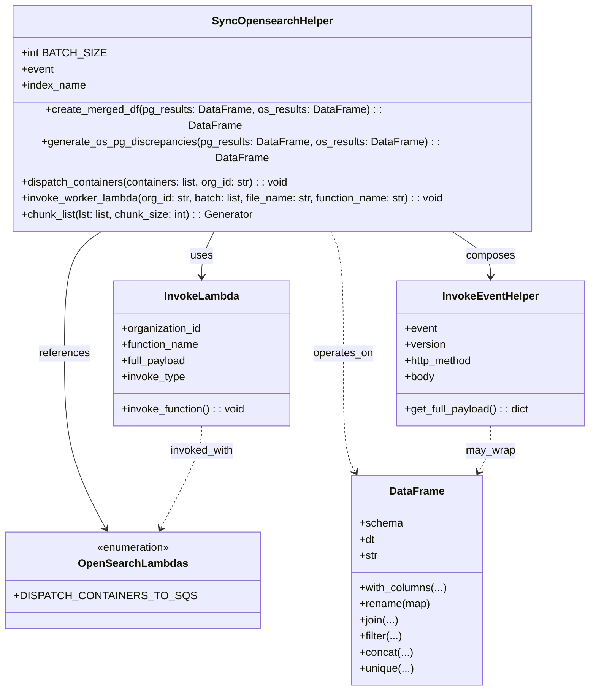

# Diagram: partview_core/partview_service/partview_service/elastic_search/sync_opensearch_index/sync_opensearch_helper.py

> Auto-generated by Obscura crawlers

## Mermaid

### SVG

<svg id="container" width="868.98828125" xmlns="http://www.w3.org/2000/svg" class="classDiagram" height="980" viewBox="0 0 868.98828125 980" role="graphics-document document" aria-roledescription="class"><g><defs><marker id="container_class-aggregationStart" class="marker aggregation class" refX="18" refY="7" markerWidth="190" markerHeight="240" orient="auto"><path d="M 18,7 L9,13 L1,7 L9,1 Z"></path></marker></defs><defs><marker id="container_class-aggregationEnd" class="marker aggregation class" refX="1" refY="7" markerWidth="20" markerHeight="28" orient="auto"><path d="M 18,7 L9,13 L1,7 L9,1 Z"></path></marker></defs><defs><marker id="container_class-extensionStart" class="marker extension class" refX="18" refY="7" markerWidth="190" markerHeight="240" orient="auto"><path d="M 1,7 L18,13 V 1 Z"></path></marker></defs><defs><marker id="container_class-extensionEnd" class="marker extension class" refX="1" refY="7" markerWidth="20" markerHeight="28" orient="auto"><path d="M 1,1 V 13 L18,7 Z"></path></marker></defs><defs><marker id="container_class-compositionStart" class="marker composition class" refX="18" refY="7" markerWidth="190" markerHeight="240" orient="auto"><path d="M 18,7 L9,13 L1,7 L9,1 Z"></path></marker></defs><defs><marker id="container_class-compositionEnd" class="marker composition class" refX="1" refY="7" markerWidth="20" markerHeight="28" orient="auto"><path d="M 18,7 L9,13 L1,7 L9,1 Z"></path></marker></defs><defs><marker id="container_class-dependencyStart" class="marker dependency class" refX="6" refY="7" markerWidth="190" markerHeight="240" orient="auto"><path d="M 5,7 L9,13 L1,7 L9,1 Z"></path></marker></defs><defs><marker id="container_class-dependencyEnd" class="marker dependency class" refX="13" refY="7" markerWidth="20" markerHeight="28" orient="auto"><path d="M 18,7 L9,13 L14,7 L9,1 Z"></path></marker></defs><defs><marker id="container_class-lollipopStart" class="marker lollipop class" refX="13" refY="7" markerWidth="190" markerHeight="240" orient="auto"><circle stroke="black" fill="transparent" cx="7" cy="7" r="6"></circle></marker></defs><defs><marker id="container_class-lollipopEnd" class="marker lollipop class" refX="1" refY="7" markerWidth="190" markerHeight="240" orient="auto"><circle stroke="black" fill="transparent" cx="7" cy="7" r="6"></circle></marker></defs><g class="root"><g class="clusters"></g><g class="edgePaths"><path d="M310.8,296L307.192,302.167C303.584,308.333,296.368,320.667,292.76,332C289.152,343.333,289.152,353.667,289.152,358.833L289.152,364" id="id_SyncOpensearchHelper_InvokeLambda_1" class="edge-thickness-normal edge-pattern-solid relation" style=";;;" data-edge="true" data-et="edge" data-id="id_SyncOpensearchHelper_InvokeLambda_1" data-points="W3sieCI6MzEwLjgwMDA5MDY0MjI2NTIsInkiOjI5Nn0seyJ4IjoyODkuMTUyMzQzNzUsInkiOjMzM30seyJ4IjoyODkuMTUyMzQzNzUsInkiOjM3MH1d" marker-end="url(#container_class-dependencyEnd)"></path><path d="M654.351,296L665.455,302.167C676.559,308.333,698.768,320.667,709.872,332C720.977,343.333,720.977,353.667,720.977,358.833L720.977,364" id="id_SyncOpensearchHelper_InvokeEventHelper_2" class="edge-thickness-normal edge-pattern-solid relation" style=";;;" data-edge="true" data-et="edge" data-id="id_SyncOpensearchHelper_InvokeEventHelper_2" data-points="W3sieCI6NjU0LjM1MDg1MDMxMDc3MzUsInkiOjI5Nn0seyJ4Ijo3MjAuOTc2NTYyNSwieSI6MzMzfSx7IngiOjcyMC45NzY1NjI1LCJ5IjozNzB9XQ==" marker-end="url(#container_class-dependencyEnd)"></path><path d="M148.017,296L137.438,302.167C126.859,308.333,105.701,320.667,95.122,351C84.543,381.333,84.543,429.667,84.543,478C84.543,526.333,84.543,574.667,94.764,618.116C104.986,661.566,125.429,700.132,135.651,719.416L145.872,738.699" id="id_SyncOpensearchHelper_OpenSearchLambdas_3" class="edge-thickness-normal edge-pattern-solid relation" style=";;;" data-edge="true" data-et="edge" data-id="id_SyncOpensearchHelper_OpenSearchLambdas_3" data-points="W3sieCI6MTQ4LjAxNjk0MTQ3MDk5NDQ4LCJ5IjoyOTZ9LHsieCI6ODQuNTQyOTY4NzUsInkiOjMzM30seyJ4Ijo4NC41NDI5Njg3NSwieSI6NDc4fSx7IngiOjg0LjU0Mjk2ODc1LCJ5Ijo2MjN9LHsieCI6MTQ4LjY4MjE3Njk3NTM4ODYsInkiOjc0NH1d" marker-end="url(#container_class-dependencyEnd)"></path><path d="M479.301,296L482.909,302.167C486.517,308.333,493.733,320.667,497.341,351C500.949,381.333,500.949,429.667,500.949,478C500.949,526.333,500.949,574.667,503.969,604.131C506.989,633.596,513.029,644.192,516.049,649.489L519.069,654.787" id="id_SyncOpensearchHelper_DataFrame_4" class="edge-thickness-normal edge-pattern-dashed relation" style=";;;" data-edge="true" data-et="edge" data-id="id_SyncOpensearchHelper_DataFrame_4" data-points="W3sieCI6NDc5LjMwMTQ3MTg1NzczNDgsInkiOjI5Nn0seyJ4Ijo1MDAuOTQ5MjE4NzUsInkiOjMzM30seyJ4Ijo1MDAuOTQ5MjE4NzUsInkiOjQ3OH0seyJ4Ijo1MDAuOTQ5MjE4NzUsInkiOjYyM30seyJ4Ijo1MjIuMDM5OTIyNjg0NTg1NSwieSI6NjYwfV0=" marker-end="url(#container_class-dependencyEnd)"></path><path d="M720.977,586L720.977,592.167C720.977,598.333,720.977,610.667,717.957,622.131C714.937,633.596,708.897,644.192,705.877,649.489L702.857,654.787" id="id_InvokeEventHelper_DataFrame_5" class="edge-thickness-normal edge-pattern-dashed relation" style=";;;" data-edge="true" data-et="edge" data-id="id_InvokeEventHelper_DataFrame_5" data-points="W3sieCI6NzIwLjk3NjU2MjUsInkiOjU4Nn0seyJ4Ijo3MjAuOTc2NTYyNSwieSI6NjIzfSx7IngiOjY5OS44ODU4NTg1NjU0MTQ1LCJ5Ijo2NjB9XQ==" marker-end="url(#container_class-dependencyEnd)"></path><path d="M289.152,586L289.152,592.167C289.152,598.333,289.152,610.667,278.931,636.116C268.709,661.566,248.266,700.132,238.045,719.416L227.823,738.699" id="id_InvokeLambda_OpenSearchLambdas_6" class="edge-thickness-normal edge-pattern-dashed relation" style=";;;" data-edge="true" data-et="edge" data-id="id_InvokeLambda_OpenSearchLambdas_6" data-points="W3sieCI6Mjg5LjE1MjM0Mzc1LCJ5Ijo1ODZ9LHsieCI6Mjg5LjE1MjM0Mzc1LCJ5Ijo2MjN9LHsieCI6MjI1LjAxMzEzNTUyNDYxMTQsInkiOjc0NH1d" marker-end="url(#container_class-dependencyEnd)"></path></g><g class="edgeLabels"><g class="edgeLabel" transform="translate(289.15234375, 333)"><g class="label" data-id="id_SyncOpensearchHelper_InvokeLambda_1" transform="translate(-16.4921875, -12)"><foreignObject width="32.984375" height="24">

uses

</foreignObject></g></g><g class="edgeLabel" transform="translate(720.9765625, 333)"><g class="label" data-id="id_SyncOpensearchHelper_InvokeEventHelper_2" transform="translate(-36.453125, -12)"><foreignObject width="72.90625" height="24">

composes

</foreignObject></g></g><g class="edgeLabel" transform="translate(84.54296875, 478)"><g class="label" data-id="id_SyncOpensearchHelper_OpenSearchLambdas_3" transform="translate(-37.828125, -12)"><foreignObject width="75.65625" height="24">

references

</foreignObject></g></g><g class="edgeLabel" transform="translate(500.94921875, 478)"><g class="label" data-id="id_SyncOpensearchHelper_DataFrame_4" transform="translate(-45.015625, -12)"><foreignObject width="90.03125" height="24">

operates_on

</foreignObject></g></g><g class="edgeLabel" transform="translate(720.9765625, 623)"><g class="label" data-id="id_InvokeEventHelper_DataFrame_5" transform="translate(-36.4375, -12)"><foreignObject width="72.875" height="24">

may_wrap

</foreignObject></g></g><g class="edgeLabel" transform="translate(289.15234375, 623)"><g class="label" data-id="id_InvokeLambda_OpenSearchLambdas_6" transform="translate(-48.203125, -12)"><foreignObject width="96.40625" height="24">

invoked_with

</foreignObject></g></g></g><g class="nodes"><g class="node default" id="classId-SyncOpensearchHelper-0" transform="translate(395.05078125, 152)"><g class="basic label-container"><path d="M-387.05078125 -144 L387.05078125 -144 L387.05078125 144 L-387.05078125 144" stroke="none" stroke-width="0" fill="#ECECFF" style=""></path><path d="M-387.05078125 -144 C-227.21175836611323 -144, -67.37273548222646 -144, 387.05078125 -144 M-387.05078125 -144 C-157.46129653235042 -144, 72.12818818529917 -144, 387.05078125 -144 M387.05078125 -144 C387.05078125 -51.46902242018632, 387.05078125 41.06195515962736, 387.05078125 144 M387.05078125 -144 C387.05078125 -81.63813578595125, 387.05078125 -19.276271571902498, 387.05078125 144 M387.05078125 144 C138.42710786144195 144, -110.19656552711609 144, -387.05078125 144 M387.05078125 144 C124.34474352064558 144, -138.36129420870884 144, -387.05078125 144 M-387.05078125 144 C-387.05078125 64.71408079052065, -387.05078125 -14.571838418958691, -387.05078125 -144 M-387.05078125 144 C-387.05078125 41.403293927880924, -387.05078125 -61.19341214423815, -387.05078125 -144" stroke="#9370DB" stroke-width="1.3" fill="none" stroke-dasharray="0 0" style=""></path></g><g class="annotation-group text" transform="translate(0, -120)"></g><g class="label-group text" transform="translate(-84.9453125, -120)"><g class="label" style="font-weight: bolder" transform="translate(0,-12)"><foreignObject width="169.890625" height="24">

SyncOpensearchHelper

</foreignObject></g></g><g class="members-group text" transform="translate(-375.05078125, -72)"><g class="label" style="" transform="translate(0,-12)"><foreignObject width="115.8125" height="24">

+int BATCH_SIZE

</foreignObject></g><g class="label" style="" transform="translate(0,12)"><foreignObject width="48.328125" height="24">

+event

</foreignObject></g><g class="label" style="" transform="translate(0,36)"><foreignObject width="96.609375" height="24">

+index_name

</foreignObject></g></g><g class="methods-group text" transform="translate(-375.05078125, 24)"><g class="label" style="" transform="translate(0,-12)"><foreignObject width="574.4375" height="24">

+create_merged_df(pg_results: DataFrame, os_results: DataFrame) : : DataFrame

</foreignObject></g><g class="label" style="" transform="translate(0,12)"><foreignObject width="665.15625" height="24">

+generate_os_pg_discrepancies(pg_results: DataFrame, os_results: DataFrame) : : DataFrame

</foreignObject></g><g class="label" style="" transform="translate(0,36)"><foreignObject width="405.25" height="24">

+dispatch_containers(containers: list, org_id: str) : : void

</foreignObject></g><g class="label" style="" transform="translate(0,60)"><foreignObject width="639.015625" height="24">

+invoke_worker_lambda(org_id: str, batch: list, file_name: str, function_name: str) : : void

</foreignObject></g><g class="label" style="" transform="translate(0,84)"><foreignObject width="349.78125" height="24">

+chunk_list(lst: list, chunk_size: int) : : Generator

</foreignObject></g></g><g class="divider" style=""><path d="M-387.05078125 -96 C-231.5597010367214 -96, -76.06862082344281 -96, 387.05078125 -96 M-387.05078125 -96 C-130.0438765039006 -96, 126.96302824219879 -96, 387.05078125 -96" stroke="#9370DB" stroke-width="1.3" fill="none" stroke-dasharray="0 0" style=""></path></g><g class="divider" style=""><path d="M-387.05078125 0 C-225.20042510867708 0, -63.35006896735416 0, 387.05078125 0 M-387.05078125 0 C-82.38553197124907 0, 222.27971730750187 0, 387.05078125 0" stroke="#9370DB" stroke-width="1.3" fill="none" stroke-dasharray="0 0" style=""></path></g></g><g class="node default" id="classId-InvokeLambda-1" transform="translate(289.15234375, 478)"><g class="basic label-container"><path d="M-131.78125 -108 L131.78125 -108 L131.78125 108 L-131.78125 108" stroke="none" stroke-width="0" fill="#ECECFF" style=""></path><path d="M-131.78125 -108 C-50.34333716934219 -108, 31.094575661315616 -108, 131.78125 -108 M-131.78125 -108 C-53.71889847002727 -108, 24.34345305994546 -108, 131.78125 -108 M131.78125 -108 C131.78125 -25.588710069156946, 131.78125 56.82257986168611, 131.78125 108 M131.78125 -108 C131.78125 -33.30765521411776, 131.78125 41.38468957176448, 131.78125 108 M131.78125 108 C43.3215181212624 108, -45.1382137574752 108, -131.78125 108 M131.78125 108 C50.331217930201674 108, -31.11881413959665 108, -131.78125 108 M-131.78125 108 C-131.78125 22.363761911969448, -131.78125 -63.272476176061105, -131.78125 -108 M-131.78125 108 C-131.78125 24.96863160140363, -131.78125 -58.06273679719274, -131.78125 -108" stroke="#9370DB" stroke-width="1.3" fill="none" stroke-dasharray="0 0" style=""></path></g><g class="annotation-group text" transform="translate(0, -84)"></g><g class="label-group text" transform="translate(-53.484375, -84)"><g class="label" style="font-weight: bolder" transform="translate(0,-12)"><foreignObject width="106.96875" height="24">

InvokeLambda

</foreignObject></g></g><g class="members-group text" transform="translate(-119.78125, -36)"><g class="label" style="" transform="translate(0,-12)"><foreignObject width="120.75" height="24">

+organization_id

</foreignObject></g><g class="label" style="" transform="translate(0,12)"><foreignObject width="117.28125" height="24">

+function_name

</foreignObject></g><g class="label" style="" transform="translate(0,36)"><foreignObject width="97.859375" height="24">

+full_payload

</foreignObject></g><g class="label" style="" transform="translate(0,60)"><foreignObject width="95.15625" height="24">

+invoke_type

</foreignObject></g></g><g class="methods-group text" transform="translate(-119.78125, 84)"><g class="label" style="" transform="translate(0,-12)"><foreignObject width="186.078125" height="24">

+invoke_function() : : void

</foreignObject></g></g><g class="divider" style=""><path d="M-131.78125 -60 C-67.40333850786915 -60, -3.025427015738302 -60, 131.78125 -60 M-131.78125 -60 C-43.29103073718363 -60, 45.199188525632735 -60, 131.78125 -60" stroke="#9370DB" stroke-width="1.3" fill="none" stroke-dasharray="0 0" style=""></path></g><g class="divider" style=""><path d="M-131.78125 60 C-68.65225641343724 60, -5.523262826874472 60, 131.78125 60 M-131.78125 60 C-30.78628085836317 60, 70.20868828327366 60, 131.78125 60" stroke="#9370DB" stroke-width="1.3" fill="none" stroke-dasharray="0 0" style=""></path></g></g><g class="node default" id="classId-InvokeEventHelper-2" transform="translate(720.9765625, 478)"><g class="basic label-container"><path d="M-140.01171875 -108 L140.01171875 -108 L140.01171875 108 L-140.01171875 108" stroke="none" stroke-width="0" fill="#ECECFF" style=""></path><path d="M-140.01171875 -108 C-47.51051454886242 -108, 44.990689652275165 -108, 140.01171875 -108 M-140.01171875 -108 C-83.9306221201753 -108, -27.8495254903506 -108, 140.01171875 -108 M140.01171875 -108 C140.01171875 -39.662317730411004, 140.01171875 28.67536453917799, 140.01171875 108 M140.01171875 -108 C140.01171875 -30.25721818878712, 140.01171875 47.48556362242576, 140.01171875 108 M140.01171875 108 C33.03262914548998 108, -73.94646045902005 108, -140.01171875 108 M140.01171875 108 C68.59976948743761 108, -2.8121797751247755 108, -140.01171875 108 M-140.01171875 108 C-140.01171875 29.338414351271496, -140.01171875 -49.32317129745701, -140.01171875 -108 M-140.01171875 108 C-140.01171875 27.22261426503931, -140.01171875 -53.55477146992138, -140.01171875 -108" stroke="#9370DB" stroke-width="1.3" fill="none" stroke-dasharray="0 0" style=""></path></g><g class="annotation-group text" transform="translate(0, -84)"></g><g class="label-group text" transform="translate(-69.0859375, -84)"><g class="label" style="font-weight: bolder" transform="translate(0,-12)"><foreignObject width="138.171875" height="24">

InvokeEventHelper

</foreignObject></g></g><g class="members-group text" transform="translate(-128.01171875, -36)"><g class="label" style="" transform="translate(0,-12)"><foreignObject width="48.328125" height="24">

+event

</foreignObject></g><g class="label" style="" transform="translate(0,12)"><foreignObject width="61" height="24">

+version

</foreignObject></g><g class="label" style="" transform="translate(0,36)"><foreignObject width="102.921875" height="24">

+http_method

</foreignObject></g><g class="label" style="" transform="translate(0,60)"><foreignObject width="44.28125" height="24">

+body

</foreignObject></g></g><g class="methods-group text" transform="translate(-128.01171875, 84)"><g class="label" style="" transform="translate(0,-12)"><foreignObject width="186.9375" height="24">

+get_full_payload() : : dict

</foreignObject></g></g><g class="divider" style=""><path d="M-140.01171875 -60 C-78.80608996402486 -60, -17.600461178049713 -60, 140.01171875 -60 M-140.01171875 -60 C-57.757400960322016 -60, 24.496916829355968 -60, 140.01171875 -60" stroke="#9370DB" stroke-width="1.3" fill="none" stroke-dasharray="0 0" style=""></path></g><g class="divider" style=""><path d="M-140.01171875 60 C-62.45041878505634 60, 15.110881179887315 60, 140.01171875 60 M-140.01171875 60 C-73.38160839465289 60, -6.751498039305773 60, 140.01171875 60" stroke="#9370DB" stroke-width="1.3" fill="none" stroke-dasharray="0 0" style=""></path></g></g><g class="node default" id="classId-OpenSearchLambdas-3" transform="translate(186.84765625, 816)"><g class="basic label-container"><path d="M-168.04296875 -72 L168.04296875 -72 L168.04296875 72 L-168.04296875 72" stroke="none" stroke-width="0" fill="#ECECFF" style=""></path><path d="M-168.04296875 -72 C-96.60616216379894 -72, -25.169355577597884 -72, 168.04296875 -72 M-168.04296875 -72 C-66.80399858051095 -72, 34.4349715889781 -72, 168.04296875 -72 M168.04296875 -72 C168.04296875 -30.426517444997536, 168.04296875 11.146965110004928, 168.04296875 72 M168.04296875 -72 C168.04296875 -19.865154526752598, 168.04296875 32.269690946494805, 168.04296875 72 M168.04296875 72 C76.92211131568409 72, -14.198746118631817 72, -168.04296875 72 M168.04296875 72 C69.75892001513776 72, -28.525128719724478 72, -168.04296875 72 M-168.04296875 72 C-168.04296875 40.687401993318545, -168.04296875 9.37480398663709, -168.04296875 -72 M-168.04296875 72 C-168.04296875 15.625422648372513, -168.04296875 -40.74915470325497, -168.04296875 -72" stroke="#9370DB" stroke-width="1.3" fill="none" stroke-dasharray="0 0" style=""></path></g><g class="annotation-group text" transform="translate(-55.5546875, -48)"><g class="label" style="" transform="translate(0,-12)"><foreignObject width="111.109375" height="24">

«enumeration»

</foreignObject></g></g><g class="label-group text" transform="translate(-76.9609375, -24)"><g class="label" style="font-weight: bolder" transform="translate(0,-12)"><foreignObject width="153.921875" height="24">

OpenSearchLambdas

</foreignObject></g></g><g class="members-group text" transform="translate(-156.04296875, 24)"><g class="label" style="" transform="translate(0,-12)"><foreignObject width="235.125" height="24">

+DISPATCH_CONTAINERS_TO_SQS

</foreignObject></g></g><g class="methods-group text" transform="translate(-156.04296875, 72)"></g><g class="divider" style=""><path d="M-168.04296875 0 C-45.36654435319484 0, 77.30988004361032 0, 168.04296875 0 M-168.04296875 0 C-94.26592727408212 0, -20.488885798164233 0, 168.04296875 0" stroke="#9370DB" stroke-width="1.3" fill="none" stroke-dasharray="0 0" style=""></path></g><g class="divider" style=""><path d="M-168.04296875 48 C-53.114867353148796 48, 61.81323404370241 48, 168.04296875 48 M-168.04296875 48 C-85.13039559569337 48, -2.217822441386744 48, 168.04296875 48" stroke="#9370DB" stroke-width="1.3" fill="none" stroke-dasharray="0 0" style=""></path></g></g><g class="node default" id="classId-DataFrame-4" transform="translate(610.962890625, 816)"><g class="basic label-container"><path d="M-96.62109375 -156 L96.62109375 -156 L96.62109375 156 L-96.62109375 156" stroke="none" stroke-width="0" fill="#ECECFF" style=""></path><path d="M-96.62109375 -156 C-27.96349365481926 -156, 40.69410644036148 -156, 96.62109375 -156 M-96.62109375 -156 C-47.54496542567116 -156, 1.5311628986576835 -156, 96.62109375 -156 M96.62109375 -156 C96.62109375 -51.88397412609328, 96.62109375 52.23205174781344, 96.62109375 156 M96.62109375 -156 C96.62109375 -82.56245807670341, 96.62109375 -9.124916153406815, 96.62109375 156 M96.62109375 156 C44.17639780817773 156, -8.268298133644535 156, -96.62109375 156 M96.62109375 156 C54.715870737495095 156, 12.81064772499019 156, -96.62109375 156 M-96.62109375 156 C-96.62109375 58.48645586800578, -96.62109375 -39.027088263988446, -96.62109375 -156 M-96.62109375 156 C-96.62109375 78.79817552050152, -96.62109375 1.5963510410030324, -96.62109375 -156" stroke="#9370DB" stroke-width="1.3" fill="none" stroke-dasharray="0 0" style=""></path></g><g class="annotation-group text" transform="translate(0, -132)"></g><g class="label-group text" transform="translate(-38.9921875, -132)"><g class="label" style="font-weight: bolder" transform="translate(0,-12)"><foreignObject width="77.984375" height="24">

DataFrame

</foreignObject></g></g><g class="members-group text" transform="translate(-84.62109375, -84)"><g class="label" style="" transform="translate(0,-12)"><foreignObject width="63.625" height="24">

+schema

</foreignObject></g><g class="label" style="" transform="translate(0,12)"><foreignObject width="23.328125" height="24">

+dt

</foreignObject></g><g class="label" style="" transform="translate(0,36)"><foreignObject width="27.421875" height="24">

+str

</foreignObject></g></g><g class="methods-group text" transform="translate(-84.62109375, 12)"><g class="label" style="" transform="translate(0,-12)"><foreignObject width="130.25" height="24">

+with_columns(...)

</foreignObject></g><g class="label" style="" transform="translate(0,12)"><foreignObject width="105.203125" height="24">

+rename(map)

</foreignObject></g><g class="label" style="" transform="translate(0,36)"><foreignObject width="57.4375" height="24">

+join(...)

</foreignObject></g><g class="label" style="" transform="translate(0,60)"><foreignObject width="63.953125" height="24">

+filter(...)

</foreignObject></g><g class="label" style="" transform="translate(0,84)"><foreignObject width="77.890625" height="24">

+concat(...)

</foreignObject></g><g class="label" style="" transform="translate(0,108)"><foreignObject width="80.6875" height="24">

+unique(...)

</foreignObject></g></g><g class="divider" style=""><path d="M-96.62109375 -108 C-26.542015516020896 -108, 43.53706271795821 -108, 96.62109375 -108 M-96.62109375 -108 C-34.16604626116652 -108, 28.289001227666958 -108, 96.62109375 -108" stroke="#9370DB" stroke-width="1.3" fill="none" stroke-dasharray="0 0" style=""></path></g><g class="divider" style=""><path d="M-96.62109375 -12 C-49.42672946343927 -12, -2.2323651768785453 -12, 96.62109375 -12 M-96.62109375 -12 C-29.486980834224525 -12, 37.64713208155095 -12, 96.62109375 -12" stroke="#9370DB" stroke-width="1.3" fill="none" stroke-dasharray="0 0" style=""></path></g></g></g></g></g></svg>
