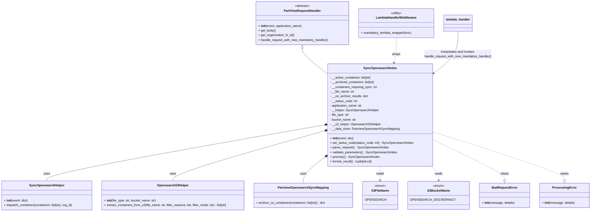

# Diagram: partview_core/partview_service/partview_service/elastic_search/sync_opensearch_index/sync_opensearch_index.py

> Auto-generated by Obscura crawlers

## Mermaid

### SVG

<svg id="container" width="2975.25" xmlns="http://www.w3.org/2000/svg" class="classDiagram" height="1088" viewBox="0 0 2975.25 1088" role="graphics-document document" aria-roledescription="class"><g><defs><marker id="container_class-aggregationStart" class="marker aggregation class" refX="18" refY="7" markerWidth="190" markerHeight="240" orient="auto"><path d="M 18,7 L9,13 L1,7 L9,1 Z"></path></marker></defs><defs><marker id="container_class-aggregationEnd" class="marker aggregation class" refX="1" refY="7" markerWidth="20" markerHeight="28" orient="auto"><path d="M 18,7 L9,13 L1,7 L9,1 Z"></path></marker></defs><defs><marker id="container_class-extensionStart" class="marker extension class" refX="18" refY="7" markerWidth="190" markerHeight="240" orient="auto"><path d="M 1,7 L18,13 V 1 Z"></path></marker></defs><defs><marker id="container_class-extensionEnd" class="marker extension class" refX="1" refY="7" markerWidth="20" markerHeight="28" orient="auto"><path d="M 1,1 V 13 L18,7 Z"></path></marker></defs><defs><marker id="container_class-compositionStart" class="marker composition class" refX="18" refY="7" markerWidth="190" markerHeight="240" orient="auto"><path d="M 18,7 L9,13 L1,7 L9,1 Z"></path></marker></defs><defs><marker id="container_class-compositionEnd" class="marker composition class" refX="1" refY="7" markerWidth="20" markerHeight="28" orient="auto"><path d="M 18,7 L9,13 L1,7 L9,1 Z"></path></marker></defs><defs><marker id="container_class-dependencyStart" class="marker dependency class" refX="6" refY="7" markerWidth="190" markerHeight="240" orient="auto"><path d="M 5,7 L9,13 L1,7 L9,1 Z"></path></marker></defs><defs><marker id="container_class-dependencyEnd" class="marker dependency class" refX="13" refY="7" markerWidth="20" markerHeight="28" orient="auto"><path d="M 18,7 L9,13 L14,7 L9,1 Z"></path></marker></defs><defs><marker id="container_class-lollipopStart" class="marker lollipop class" refX="13" refY="7" markerWidth="190" markerHeight="240" orient="auto"><circle stroke="black" fill="transparent" cx="7" cy="7" r="6"></circle></marker></defs><defs><marker id="container_class-lollipopEnd" class="marker lollipop class" refX="1" refY="7" markerWidth="190" markerHeight="240" orient="auto"><circle stroke="black" fill="transparent" cx="7" cy="7" r="6"></circle></marker></defs><g class="root"><g class="clusters"></g><g class="edgePaths"><path d="M1555.371,247.25L1555.371,252.542C1555.371,257.833,1555.371,268.417,1577.786,291.244C1600.202,314.072,1645.033,349.144,1667.448,366.68L1689.863,384.215" id="id_PartViewRequestHandler_SyncOpensearchIndex_1" class="edge-thickness-normal edge-pattern-solid relation" style=";;;" data-edge="true" data-et="edge" data-id="id_PartViewRequestHandler_SyncOpensearchIndex_1" data-points="W3sieCI6MTU1NS4zNzEwOTM3NSwieSI6MjMwfSx7IngiOjE1NTUuMzcxMDkzNzUsInkiOjI3OX0seyJ4IjoxNjg5Ljg2MzI4MTI1LCJ5IjozODQuMjE1NDc2ODQxMzY1MzN9XQ==" marker-start="url(#container_class-extensionStart)"></path><path d="M1672.874,641.656L1434.476,683.547C1196.078,725.437,719.283,809.219,480.886,857.276C242.488,905.333,242.488,917.667,242.488,923.833L242.488,930" id="id_SyncOpensearchIndex_SyncOpensearchHelper_2" class="edge-thickness-normal edge-pattern-solid relation" style=";;;" data-edge="true" data-et="edge" data-id="id_SyncOpensearchIndex_SyncOpensearchHelper_2" data-points="W3sieCI6MTY4OS44NjMyODEyNSwieSI6NjM4LjY3MDg0ODg5Njk3NjZ9LHsieCI6MjQyLjQ4ODI4MTI1LCJ5Ijo4OTN9LHsieCI6MjQyLjQ4ODI4MTI1LCJ5Ijo5MzB9XQ==" marker-start="url(#container_class-compositionStart)"></path><path d="M1673.271,672.231L1543.855,709.026C1414.438,745.821,1155.606,819.41,1026.19,862.372C896.773,905.333,896.773,917.667,896.773,923.833L896.773,930" id="id_SyncOpensearchIndex_OpensearchS3Helper_3" class="edge-thickness-normal edge-pattern-solid relation" style=";;;" data-edge="true" data-et="edge" data-id="id_SyncOpensearchIndex_OpensearchS3Helper_3" data-points="W3sieCI6MTY4OS44NjMyODEyNSwieSI6NjY3LjUxNDA0NDgyOTgxMjd9LHsieCI6ODk2Ljc3MzQzNzUsInkiOjg5M30seyJ4Ijo4OTYuNzczNDM3NSwieSI6OTMwfV0=" marker-start="url(#container_class-compositionStart)"></path><path d="M1676.274,810.312L1658.65,824.093C1641.025,837.874,1605.776,865.437,1588.152,887.385C1570.527,909.333,1570.527,925.667,1570.527,933.833L1570.527,942" id="id_SyncOpensearchIndex_PartviewOpensearchSyncMapping_4" class="edge-thickness-normal edge-pattern-solid relation" style=";;;" data-edge="true" data-et="edge" data-id="id_SyncOpensearchIndex_PartviewOpensearchSyncMapping_4" data-points="W3sieCI6MTY4OS44NjMyODEyNSwieSI6Nzk5LjY4NTg0NTkxNjU0NDh9LHsieCI6MTU3MC41MjczNDM3NSwieSI6ODkzfSx7IngiOjE1NzAuNTI3MzQzNzUsInkiOjk0Mn1d" marker-start="url(#container_class-compositionStart)"></path><path d="M1955.465,856L1955.465,862.167C1955.465,868.333,1955.465,880.667,1955.465,892.5C1955.465,904.333,1955.465,915.667,1955.465,921.333L1955.465,927" id="id_SyncOpensearchIndex_S3FileName_5" class="edge-thickness-normal edge-pattern-dashed relation" style=";;;" data-edge="true" data-et="edge" data-id="id_SyncOpensearchIndex_S3FileName_5" data-points="W3sieCI6MTk1NS40NjQ4NDM3NSwieSI6ODU2fSx7IngiOjE5NTUuNDY0ODQzNzUsInkiOjg5M30seyJ4IjoxOTU1LjQ2NDg0Mzc1LCJ5Ijo5MzN9XQ==" marker-end="url(#container_class-dependencyEnd)"></path><path d="M2192.978,856L2198.526,862.167C2204.074,868.333,2215.17,880.667,2220.718,892.5C2226.266,904.333,2226.266,915.667,2226.266,921.333L2226.266,927" id="id_SyncOpensearchIndex_S3BucketName_6" class="edge-thickness-normal edge-pattern-dashed relation" style=";;;" data-edge="true" data-et="edge" data-id="id_SyncOpensearchIndex_S3BucketName_6" data-points="W3sieCI6MjE5Mi45Nzc4MjEzMjQ3NTEsInkiOjg1Nn0seyJ4IjoyMjI2LjI2NTYyNSwieSI6ODkzfSx7IngiOjIyMjYuMjY1NjI1LCJ5Ijo5MzN9XQ==" marker-end="url(#container_class-dependencyEnd)"></path><path d="M2221.066,728.17L2274.65,755.642C2328.234,783.113,2435.402,838.057,2488.986,870.82C2542.57,903.583,2542.57,914.167,2542.57,919.458L2542.57,924.75" id="id_SyncOpensearchIndex_BadRequestError_7" class="edge-thickness-normal edge-pattern-dashed relation" style=";;;" data-edge="true" data-et="edge" data-id="id_SyncOpensearchIndex_BadRequestError_7" data-points="W3sieCI6MjIyMS4wNjY0MDYyNSwieSI6NzI4LjE2OTg2MTQwOTU5MDJ9LHsieCI6MjU0Mi41NzAzMTI1LCJ5Ijo4OTN9LHsieCI6MjU0Mi41NzAzMTI1LCJ5Ijo5NDJ9XQ==" marker-end="url(#container_class-extensionEnd)"></path><path d="M2221.066,682.061L2324.747,717.218C2428.428,752.374,2635.79,822.687,2739.471,863.135C2843.152,903.583,2843.152,914.167,2843.152,919.458L2843.152,924.75" id="id_SyncOpensearchIndex_ProcessingError_8" class="edge-thickness-normal edge-pattern-dashed relation" style=";;;" data-edge="true" data-et="edge" data-id="id_SyncOpensearchIndex_ProcessingError_8" data-points="W3sieCI6MjIyMS4wNjY0MDYyNSwieSI6NjgyLjA2MTA1MjI0MjQ4NH0seyJ4IjoyODQzLjE1MjM0Mzc1LCJ5Ijo4OTN9LHsieCI6Mjg0My4xNTIzNDM3NSwieSI6OTQyfV0=" marker-end="url(#container_class-extensionEnd)"></path><path d="M2039.465,194L2039.465,208.167C2039.465,222.333,2039.465,250.667,2037.532,272.034C2035.6,293.402,2031.735,307.803,2029.802,315.004L2027.87,322.205" id="id_LambdaHandlerMiddleware_SyncOpensearchIndex_9" class="edge-thickness-normal edge-pattern-dashed relation" style=";;;" data-edge="true" data-et="edge" data-id="id_LambdaHandlerMiddleware_SyncOpensearchIndex_9" data-points="W3sieCI6MjAzOS40NjQ4NDM3NSwieSI6MTk0fSx7IngiOjIwMzkuNDY0ODQzNzUsInkiOjI3OX0seyJ4IjoyMDI2LjMxNDY4NDAwNTU5MSwieSI6MzI4fV0=" marker-end="url(#container_class-dependencyEnd)"></path><path d="M2355.559,161L2355.559,180.667C2355.559,200.333,2355.559,239.667,2333.931,276.253C2312.303,312.839,2269.048,346.679,2247.42,363.599L2225.792,380.518" id="id_lambda_handler_SyncOpensearchIndex_10" class="edge-thickness-normal edge-pattern-solid relation" style=";;;" data-edge="true" data-et="edge" data-id="id_lambda_handler_SyncOpensearchIndex_10" data-points="W3sieCI6MjM1NS41NTg1OTM3NSwieSI6MTYxfSx7IngiOjIzNTUuNTU4NTkzNzUsInkiOjI3OX0seyJ4IjoyMjIxLjA2NjQwNjI1LCJ5IjozODQuMjE1NDc2ODQxMzY1MzN9XQ==" marker-end="url(#container_class-dependencyEnd)"></path></g><g class="edgeLabels"><g class="edgeLabel"><g class="label" data-id="id_PartViewRequestHandler_SyncOpensearchIndex_1" transform="translate(0, 0)"><foreignObject width="0" height="0">

</foreignObject></g></g><g class="edgeLabel" transform="translate(242.48828125, 893)"><g class="label" data-id="id_SyncOpensearchIndex_SyncOpensearchHelper_2" transform="translate(-16.4921875, -12)"><foreignObject width="32.984375" height="24">

uses

</foreignObject></g></g><g class="edgeLabel" transform="translate(896.7734375, 893)"><g class="label" data-id="id_SyncOpensearchIndex_OpensearchS3Helper_3" transform="translate(-16.4921875, -12)"><foreignObject width="32.984375" height="24">

uses

</foreignObject></g></g><g class="edgeLabel" transform="translate(1570.52734375, 893)"><g class="label" data-id="id_SyncOpensearchIndex_PartviewOpensearchSyncMapping_4" transform="translate(-16.4921875, -12)"><foreignObject width="32.984375" height="24">

uses

</foreignObject></g></g><g class="edgeLabel" transform="translate(1955.46484375, 893)"><g class="label" data-id="id_SyncOpensearchIndex_S3FileName_5" transform="translate(-20.0078125, -12)"><foreignObject width="40.015625" height="24">

reads

</foreignObject></g></g><g class="edgeLabel" transform="translate(2226.265625, 893)"><g class="label" data-id="id_SyncOpensearchIndex_S3BucketName_6" transform="translate(-20.0078125, -12)"><foreignObject width="40.015625" height="24">

reads

</foreignObject></g></g><g class="edgeLabel" transform="translate(2542.5703125, 893)"><g class="label" data-id="id_SyncOpensearchIndex_BadRequestError_7" transform="translate(-21.25, -12)"><foreignObject width="42.5" height="24">

raises

</foreignObject></g></g><g class="edgeLabel" transform="translate(2843.15234375, 893)"><g class="label" data-id="id_SyncOpensearchIndex_ProcessingError_8" transform="translate(-21.25, -12)"><foreignObject width="42.5" height="24">

raises

</foreignObject></g></g><g class="edgeLabel" transform="translate(2039.46484375, 279)"><g class="label" data-id="id_LambdaHandlerMiddleware_SyncOpensearchIndex_9" transform="translate(-21.390625, -12)"><foreignObject width="42.78125" height="24">

wraps

</foreignObject></g></g><g class="edgeLabel" transform="translate(2355.55859375, 279)"><g class="label" data-id="id_lambda_handler_SyncOpensearchIndex_10" transform="translate(-176.1796875, -24)"><foreignObject width="352.359375" height="48">

instantiates and invokes handle_request_with_new_mandatory_handler()

</foreignObject></g></g></g><g class="nodes"><g class="node default" id="classId-SyncOpensearchIndex-0" transform="translate(1955.46484375, 592)"><g class="basic label-container"><path d="M-265.6015625 -264 L265.6015625 -264 L265.6015625 264 L-265.6015625 264" stroke="none" stroke-width="0" fill="#ECECFF" style=""></path><path d="M-265.6015625 -264 C-84.04843858089163 -264, 97.50468533821675 -264, 265.6015625 -264 M-265.6015625 -264 C-131.13347450009127 -264, 3.334613499817465 -264, 265.6015625 -264 M265.6015625 -264 C265.6015625 -98.53787695293423, 265.6015625 66.92424609413155, 265.6015625 264 M265.6015625 -264 C265.6015625 -146.08263271080625, 265.6015625 -28.165265421612474, 265.6015625 264 M265.6015625 264 C156.44615031658526 264, 47.29073813317055 264, -265.6015625 264 M265.6015625 264 C116.72738497862932 264, -32.146792542741366 264, -265.6015625 264 M-265.6015625 264 C-265.6015625 73.7678225965694, -265.6015625 -116.4643548068612, -265.6015625 -264 M-265.6015625 264 C-265.6015625 133.88373648621766, -265.6015625 3.767472972435314, -265.6015625 -264" stroke="#9370DB" stroke-width="1.3" fill="none" stroke-dasharray="0 0" style=""></path></g><g class="annotation-group text" transform="translate(0, -240)"></g><g class="label-group text" transform="translate(-80.59375, -240)"><g class="label" style="font-weight: bolder" transform="translate(0,-12)"><foreignObject width="161.1875" height="24">

SyncOpensearchIndex

</foreignObject></g></g><g class="members-group text" transform="translate(-253.6015625, -192)"><g class="label" style="" transform="translate(0,-12)"><foreignObject width="214.390625" height="24">

- __active_containers: list[str]

</foreignObject></g><g class="label" style="" transform="translate(0,12)"><foreignObject width="233.578125" height="24">

- __archived_containers: list[str]

</foreignObject></g><g class="label" style="" transform="translate(0,36)"><foreignObject width="245.765625" height="24">

- __containers_requiring_sync: int

</foreignObject></g><g class="label" style="" transform="translate(0,60)"><foreignObject width="125.40625" height="24">

- __file_name: str

</foreignObject></g><g class="label" style="" transform="translate(0,84)"><foreignObject width="196.53125" height="24">

- __os_archive_results: dict

</foreignObject></g><g class="label" style="" transform="translate(0,108)"><foreignObject width="141.953125" height="24">

- __status_code: int

</foreignObject></g><g class="label" style="" transform="translate(0,132)"><foreignObject width="169.140625" height="24">

- application_name: str

</foreignObject></g><g class="label" style="" transform="translate(0,156)"><foreignObject width="250.875" height="24">

- __helper: SyncOpensearchHelper

</foreignObject></g><g class="label" style="" transform="translate(0,180)"><foreignObject width="100.203125" height="24">

- file_type: str

</foreignObject></g><g class="label" style="" transform="translate(0,204)"><foreignObject width="136.046875" height="24">

- bucket_name: str

</foreignObject></g><g class="label" style="" transform="translate(0,228)"><foreignObject width="257.578125" height="24">

- __s3_helper: OpensearchS3Helper

</foreignObject></g><g class="label" style="" transform="translate(0,252)"><foreignObject width="356.1875" height="24">

- __data_store: PartviewOpensearchSyncMapping

</foreignObject></g></g><g class="methods-group text" transform="translate(-253.6015625, 120)"><g class="label" style="" transform="translate(0,-12)"><foreignObject width="123.03125" height="24">

+ <strong>init</strong>(event: dict)

</foreignObject></g><g class="label" style="" transform="translate(0,12)"><foreignObject width="426.609375" height="24">

+ set_status_code(status_code: int) : SyncOpensearchIndex

</foreignObject></g><g class="label" style="" transform="translate(0,36)"><foreignObject width="297.9375" height="24">

+ parse_request() : SyncOpensearchIndex

</foreignObject></g><g class="label" style="" transform="translate(0,60)"><foreignObject width="342.859375" height="24">

+ validate_parameters() : SyncOpensearchIndex

</foreignObject></g><g class="label" style="" transform="translate(0,84)"><foreignObject width="249.875" height="24">

+ process() : SyncOpensearchIndex

</foreignObject></g><g class="label" style="" transform="translate(0,108)"><foreignObject width="223.84375" height="24">

+ format_result() : tuple[str,int]

</foreignObject></g></g><g class="divider" style=""><path d="M-265.6015625 -216 C-87.10673587673071 -216, 91.38809074653858 -216, 265.6015625 -216 M-265.6015625 -216 C-100.14551799493853 -216, 65.31052651012294 -216, 265.6015625 -216" stroke="#9370DB" stroke-width="1.3" fill="none" stroke-dasharray="0 0" style=""></path></g><g class="divider" style=""><path d="M-265.6015625 96 C-92.616564879918 96, 80.368432740164 96, 265.6015625 96 M-265.6015625 96 C-147.01841788691718 96, -28.435273273834326 96, 265.6015625 96" stroke="#9370DB" stroke-width="1.3" fill="none" stroke-dasharray="0 0" style=""></path></g></g><g class="node default" id="classId-PartViewRequestHandler-1" transform="translate(1555.37109375, 119)"><g class="basic label-container"><path d="M-239.9765625 -111 L239.9765625 -111 L239.9765625 111 L-239.9765625 111" stroke="none" stroke-width="0" fill="#ECECFF" style=""></path><path d="M-239.9765625 -111 C-67.58312655501575 -111, 104.8103093899685 -111, 239.9765625 -111 M-239.9765625 -111 C-96.2868069240599 -111, 47.402948651880195 -111, 239.9765625 -111 M239.9765625 -111 C239.9765625 -38.753539320656145, 239.9765625 33.49292135868771, 239.9765625 111 M239.9765625 -111 C239.9765625 -65.59342059763853, 239.9765625 -20.186841195277054, 239.9765625 111 M239.9765625 111 C93.06121333159072 111, -53.85413583681856 111, -239.9765625 111 M239.9765625 111 C74.07155785143678 111, -91.83344679712644 111, -239.9765625 111 M-239.9765625 111 C-239.9765625 55.8788651132731, -239.9765625 0.7577302265462009, -239.9765625 -111 M-239.9765625 111 C-239.9765625 39.8564640135892, -239.9765625 -31.287071972821593, -239.9765625 -111" stroke="#9370DB" stroke-width="1.3" fill="none" stroke-dasharray="0 0" style=""></path></g><g class="annotation-group text" transform="translate(-38.609375, -87)"><g class="label" style="" transform="translate(0,-12)"><foreignObject width="77.21875" height="24">

«abstract»

</foreignObject></g></g><g class="label-group text" transform="translate(-91.359375, -63)"><g class="label" style="font-weight: bolder" transform="translate(0,-12)"><foreignObject width="182.71875" height="24">

PartViewRequestHandler

</foreignObject></g></g><g class="members-group text" transform="translate(-227.9765625, -15)"></g><g class="methods-group text" transform="translate(-227.9765625, 15)"><g class="label" style="" transform="translate(0,-12)"><foreignObject width="226.46875" height="24">

+ <strong>init</strong>(event, application_name)

</foreignObject></g><g class="label" style="" transform="translate(0,12)"><foreignObject width="89.765625" height="24">

+ get_body()

</foreignObject></g><g class="label" style="" transform="translate(0,36)"><foreignObject width="186.671875" height="24">

+ get_organization_fv_id()

</foreignObject></g><g class="label" style="" transform="translate(0,60)"><foreignObject width="364.59375" height="24">

+ handle_request_with_new_mandatory_handler()

</foreignObject></g></g><g class="divider" style=""><path d="M-239.9765625 -39 C-100.17506353696214 -39, 39.626435426075716 -39, 239.9765625 -39 M-239.9765625 -39 C-98.63164882772062 -39, 42.71326484455875 -39, 239.9765625 -39" stroke="#9370DB" stroke-width="1.3" fill="none" stroke-dasharray="0 0" style=""></path></g><g class="divider" style=""><path d="M-239.9765625 -15 C-61.14919394404217 -15, 117.67817461191567 -15, 239.9765625 -15 M-239.9765625 -15 C-58.799565400166955 -15, 122.37743169966609 -15, 239.9765625 -15" stroke="#9370DB" stroke-width="1.3" fill="none" stroke-dasharray="0 0" style=""></path></g></g><g class="node default" id="classId-SyncOpensearchHelper-2" transform="translate(242.48828125, 1005)"><g class="basic label-container"><path d="M-234.48828125 -75 L234.48828125 -75 L234.48828125 75 L-234.48828125 75" stroke="none" stroke-width="0" fill="#ECECFF" style=""></path><path d="M-234.48828125 -75 C-102.66472307493055 -75, 29.1588351001389 -75, 234.48828125 -75 M-234.48828125 -75 C-125.97511533957119 -75, -17.46194942914238 -75, 234.48828125 -75 M234.48828125 -75 C234.48828125 -36.41732032285098, 234.48828125 2.165359354298033, 234.48828125 75 M234.48828125 -75 C234.48828125 -32.79359147529214, 234.48828125 9.412817049415722, 234.48828125 75 M234.48828125 75 C88.02856158945232 75, -58.43115807109535 75, -234.48828125 75 M234.48828125 75 C50.8318874063998 75, -132.8245064372004 75, -234.48828125 75 M-234.48828125 75 C-234.48828125 17.68374431420709, -234.48828125 -39.63251137158582, -234.48828125 -75 M-234.48828125 75 C-234.48828125 40.382804736166996, -234.48828125 5.765609472333992, -234.48828125 -75" stroke="#9370DB" stroke-width="1.3" fill="none" stroke-dasharray="0 0" style=""></path></g><g class="annotation-group text" transform="translate(0, -51)"></g><g class="label-group text" transform="translate(-84.9453125, -51)"><g class="label" style="font-weight: bolder" transform="translate(0,-12)"><foreignObject width="169.890625" height="24">

SyncOpensearchHelper

</foreignObject></g></g><g class="members-group text" transform="translate(-222.48828125, -3)"></g><g class="methods-group text" transform="translate(-222.48828125, 27)"><g class="label" style="" transform="translate(0,-12)"><foreignObject width="123.03125" height="24">

+ <strong>init</strong>(event: dict)

</foreignObject></g><g class="label" style="" transform="translate(0,12)"><foreignObject width="360.03125" height="24">

+ dispatch_containers(containers: list[str], org_id)

</foreignObject></g></g><g class="divider" style=""><path d="M-234.48828125 -27 C-105.4579349767676 -27, 23.572411296464793 -27, 234.48828125 -27 M-234.48828125 -27 C-74.98712411714212 -27, 84.51403301571577 -27, 234.48828125 -27" stroke="#9370DB" stroke-width="1.3" fill="none" stroke-dasharray="0 0" style=""></path></g><g class="divider" style=""><path d="M-234.48828125 -3 C-100.31595116649623 -3, 33.85637891700753 -3, 234.48828125 -3 M-234.48828125 -3 C-54.72496570037694 -3, 125.03834984924612 -3, 234.48828125 -3" stroke="#9370DB" stroke-width="1.3" fill="none" stroke-dasharray="0 0" style=""></path></g></g><g class="node default" id="classId-OpensearchS3Helper-3" transform="translate(896.7734375, 1005)"><g class="basic label-container"><path d="M-369.796875 -75 L369.796875 -75 L369.796875 75 L-369.796875 75" stroke="none" stroke-width="0" fill="#ECECFF" style=""></path><path d="M-369.796875 -75 C-74.80965655660623 -75, 220.17756188678754 -75, 369.796875 -75 M-369.796875 -75 C-163.3049185321727 -75, 43.18703793565459 -75, 369.796875 -75 M369.796875 -75 C369.796875 -37.432979914525525, 369.796875 0.13404017094894982, 369.796875 75 M369.796875 -75 C369.796875 -42.69259848342577, 369.796875 -10.385196966851538, 369.796875 75 M369.796875 75 C101.0076704992432 75, -167.7815340015136 75, -369.796875 75 M369.796875 75 C150.4163599911722 75, -68.96415501765563 75, -369.796875 75 M-369.796875 75 C-369.796875 32.636933438244625, -369.796875 -9.726133123510749, -369.796875 -75 M-369.796875 75 C-369.796875 31.240526591891708, -369.796875 -12.518946816216584, -369.796875 -75" stroke="#9370DB" stroke-width="1.3" fill="none" stroke-dasharray="0 0" style=""></path></g><g class="annotation-group text" transform="translate(0, -51)"></g><g class="label-group text" transform="translate(-76.59375, -51)"><g class="label" style="font-weight: bolder" transform="translate(0,-12)"><foreignObject width="153.1875" height="24">

OpensearchS3Helper

</foreignObject></g></g><g class="members-group text" transform="translate(-357.796875, -3)"></g><g class="methods-group text" transform="translate(-357.796875, 27)"><g class="label" style="" transform="translate(0,-12)"><foreignObject width="268.703125" height="24">

+ <strong>init</strong>(file_type: str, bucket_name: str)

</foreignObject></g><g class="label" style="" transform="translate(0,12)"><foreignObject width="639" height="24">

+ extract_containers_from_s3(file_name: str, filter_reasons: list, filter_mode: str) : list[str]

</foreignObject></g></g><g class="divider" style=""><path d="M-369.796875 -27 C-185.0175533933067 -27, -0.2382317866134258 -27, 369.796875 -27 M-369.796875 -27 C-92.35946285720263 -27, 185.07794928559474 -27, 369.796875 -27" stroke="#9370DB" stroke-width="1.3" fill="none" stroke-dasharray="0 0" style=""></path></g><g class="divider" style=""><path d="M-369.796875 -3 C-110.49245316094533 -3, 148.81196867810934 -3, 369.796875 -3 M-369.796875 -3 C-119.77498573600187 -3, 130.24690352799627 -3, 369.796875 -3" stroke="#9370DB" stroke-width="1.3" fill="none" stroke-dasharray="0 0" style=""></path></g></g><g class="node default" id="classId-PartviewOpensearchSyncMapping-4" transform="translate(1570.52734375, 1005)"><g class="basic label-container"><path d="M-253.95703125 -63 L253.95703125 -63 L253.95703125 63 L-253.95703125 63" stroke="none" stroke-width="0" fill="#ECECFF" style=""></path><path d="M-253.95703125 -63 C-86.97961828737206 -63, 79.99779467525588 -63, 253.95703125 -63 M-253.95703125 -63 C-127.09240398799012 -63, -0.22777672598024878 -63, 253.95703125 -63 M253.95703125 -63 C253.95703125 -14.814321658007728, 253.95703125 33.371356683984544, 253.95703125 63 M253.95703125 -63 C253.95703125 -24.661471782432457, 253.95703125 13.677056435135086, 253.95703125 63 M253.95703125 63 C50.833779912456976 63, -152.28947142508605 63, -253.95703125 63 M253.95703125 63 C127.88888491772414 63, 1.8207385854482823 63, -253.95703125 63 M-253.95703125 63 C-253.95703125 28.61878766542796, -253.95703125 -5.762424669144082, -253.95703125 -63 M-253.95703125 63 C-253.95703125 22.797619509125553, -253.95703125 -17.404760981748893, -253.95703125 -63" stroke="#9370DB" stroke-width="1.3" fill="none" stroke-dasharray="0 0" style=""></path></g><g class="annotation-group text" transform="translate(0, -39)"></g><g class="label-group text" transform="translate(-123.7265625, -39)"><g class="label" style="font-weight: bolder" transform="translate(0,-12)"><foreignObject width="247.453125" height="24">

PartviewOpensearchSyncMapping

</foreignObject></g></g><g class="members-group text" transform="translate(-241.95703125, 9)"></g><g class="methods-group text" transform="translate(-241.95703125, 39)"><g class="label" style="" transform="translate(0,-12)"><foreignObject width="360.1875" height="24">

+ archive_os_containers(containers: list[str]) : dict

</foreignObject></g></g><g class="divider" style=""><path d="M-253.95703125 -15 C-147.9514876769786 -15, -41.945944103957174 -15, 253.95703125 -15 M-253.95703125 -15 C-145.42036038698927 -15, -36.883689523978546 -15, 253.95703125 -15" stroke="#9370DB" stroke-width="1.3" fill="none" stroke-dasharray="0 0" style=""></path></g><g class="divider" style=""><path d="M-253.95703125 9 C-83.47561546038278 9, 87.00580032923443 9, 253.95703125 9 M-253.95703125 9 C-104.97296253549476 9, 44.01110617901048 9, 253.95703125 9" stroke="#9370DB" stroke-width="1.3" fill="none" stroke-dasharray="0 0" style=""></path></g></g><g class="node default" id="classId-LambdaHandlerMiddleware-5" transform="translate(2039.46484375, 119)"><g class="basic label-container"><path d="M-194.1171875 -75 L194.1171875 -75 L194.1171875 75 L-194.1171875 75" stroke="none" stroke-width="0" fill="#ECECFF" style=""></path><path d="M-194.1171875 -75 C-41.67476392250853 -75, 110.76765965498294 -75, 194.1171875 -75 M-194.1171875 -75 C-83.6815237363944 -75, 26.754140027211207 -75, 194.1171875 -75 M194.1171875 -75 C194.1171875 -32.3792368065867, 194.1171875 10.241526386826607, 194.1171875 75 M194.1171875 -75 C194.1171875 -29.93766904363323, 194.1171875 15.124661912733544, 194.1171875 75 M194.1171875 75 C68.76538800478099 75, -56.586411490438024 75, -194.1171875 75 M194.1171875 75 C39.6602435889298 75, -114.7967003221404 75, -194.1171875 75 M-194.1171875 75 C-194.1171875 23.016618193419788, -194.1171875 -28.966763613160424, -194.1171875 -75 M-194.1171875 75 C-194.1171875 16.34514713481046, -194.1171875 -42.30970573037908, -194.1171875 -75" stroke="#9370DB" stroke-width="1.3" fill="none" stroke-dasharray="0 0" style=""></path></g><g class="annotation-group text" transform="translate(-30.3125, -51)"><g class="label" style="" transform="translate(0,-12)"><foreignObject width="60.625" height="24">

«utility»

</foreignObject></g></g><g class="label-group text" transform="translate(-100.765625, -27)"><g class="label" style="font-weight: bolder" transform="translate(0,-12)"><foreignObject width="201.53125" height="24">

LambdaHandlerMiddleware

</foreignObject></g></g><g class="members-group text" transform="translate(-182.1171875, 21)"></g><g class="methods-group text" transform="translate(-182.1171875, 51)"><g class="label" style="" transform="translate(0,-12)"><foreignObject width="263.46875" height="24">

+ mandatory_lambda_wrapper(func)

</foreignObject></g></g><g class="divider" style=""><path d="M-194.1171875 -3 C-43.22870129505273 -3, 107.65978490989454 -3, 194.1171875 -3 M-194.1171875 -3 C-40.29292753480479 -3, 113.53133243039042 -3, 194.1171875 -3" stroke="#9370DB" stroke-width="1.3" fill="none" stroke-dasharray="0 0" style=""></path></g><g class="divider" style=""><path d="M-194.1171875 21 C-50.82920471863761 21, 92.45877806272478 21, 194.1171875 21 M-194.1171875 21 C-115.53398254835781 21, -36.950777596715625 21, 194.1171875 21" stroke="#9370DB" stroke-width="1.3" fill="none" stroke-dasharray="0 0" style=""></path></g></g><g class="node default" id="classId-BadRequestError-6" transform="translate(2542.5703125, 1005)"><g class="basic label-container"><path d="M-126.484375 -63 L126.484375 -63 L126.484375 63 L-126.484375 63" stroke="none" stroke-width="0" fill="#ECECFF" style=""></path><path d="M-126.484375 -63 C-60.439864564846985 -63, 5.60464587030603 -63, 126.484375 -63 M-126.484375 -63 C-28.984279573079164 -63, 68.51581585384167 -63, 126.484375 -63 M126.484375 -63 C126.484375 -22.67278492916413, 126.484375 17.65443014167174, 126.484375 63 M126.484375 -63 C126.484375 -36.497879622579944, 126.484375 -9.995759245159881, 126.484375 63 M126.484375 63 C48.506478849755155 63, -29.47141730048969 63, -126.484375 63 M126.484375 63 C69.87748925312619 63, 13.270603506252385 63, -126.484375 63 M-126.484375 63 C-126.484375 23.137022476387727, -126.484375 -16.725955047224545, -126.484375 -63 M-126.484375 63 C-126.484375 29.167897970605047, -126.484375 -4.664204058789906, -126.484375 -63" stroke="#9370DB" stroke-width="1.3" fill="none" stroke-dasharray="0 0" style=""></path></g><g class="annotation-group text" transform="translate(0, -39)"></g><g class="label-group text" transform="translate(-62.28125, -39)"><g class="label" style="font-weight: bolder" transform="translate(0,-12)"><foreignObject width="124.5625" height="24">

BadRequestError

</foreignObject></g></g><g class="members-group text" transform="translate(-114.484375, 9)"></g><g class="methods-group text" transform="translate(-114.484375, 39)"><g class="label" style="" transform="translate(0,-12)"><foreignObject width="166.6875" height="24">

+ <strong>init</strong>(message, details)

</foreignObject></g></g><g class="divider" style=""><path d="M-126.484375 -15 C-36.343014617180486 -15, 53.79834576563903 -15, 126.484375 -15 M-126.484375 -15 C-26.67553813055666 -15, 73.13329873888668 -15, 126.484375 -15" stroke="#9370DB" stroke-width="1.3" fill="none" stroke-dasharray="0 0" style=""></path></g><g class="divider" style=""><path d="M-126.484375 9 C-60.77381267100735 9, 4.9367496579853025 9, 126.484375 9 M-126.484375 9 C-60.26833176437323 9, 5.947711471253541 9, 126.484375 9" stroke="#9370DB" stroke-width="1.3" fill="none" stroke-dasharray="0 0" style=""></path></g></g><g class="node default" id="classId-ProcessingError-7" transform="translate(2843.15234375, 1005)"><g class="basic label-container"><path d="M-124.09765625 -63 L124.09765625 -63 L124.09765625 63 L-124.09765625 63" stroke="none" stroke-width="0" fill="#ECECFF" style=""></path><path d="M-124.09765625 -63 C-59.83561225516634 -63, 4.426431739667322 -63, 124.09765625 -63 M-124.09765625 -63 C-58.98692084684211 -63, 6.123814556315779 -63, 124.09765625 -63 M124.09765625 -63 C124.09765625 -31.97995227906206, 124.09765625 -0.9599045581241228, 124.09765625 63 M124.09765625 -63 C124.09765625 -18.267880079712775, 124.09765625 26.46423984057445, 124.09765625 63 M124.09765625 63 C51.98415859801496 63, -20.129339053970085 63, -124.09765625 63 M124.09765625 63 C38.99445126261631 63, -46.10875372476738 63, -124.09765625 63 M-124.09765625 63 C-124.09765625 29.56212655452073, -124.09765625 -3.8757468909585384, -124.09765625 -63 M-124.09765625 63 C-124.09765625 29.0149125532469, -124.09765625 -4.970174893506197, -124.09765625 -63" stroke="#9370DB" stroke-width="1.3" fill="none" stroke-dasharray="0 0" style=""></path></g><g class="annotation-group text" transform="translate(0, -39)"></g><g class="label-group text" transform="translate(-57.5078125, -39)"><g class="label" style="font-weight: bolder" transform="translate(0,-12)"><foreignObject width="115.015625" height="24">

ProcessingError

</foreignObject></g></g><g class="members-group text" transform="translate(-112.09765625, 9)"></g><g class="methods-group text" transform="translate(-112.09765625, 39)"><g class="label" style="" transform="translate(0,-12)"><foreignObject width="166.6875" height="24">

+ <strong>init</strong>(message, details)

</foreignObject></g></g><g class="divider" style=""><path d="M-124.09765625 -15 C-63.1712748358367 -15, -2.244893421673396 -15, 124.09765625 -15 M-124.09765625 -15 C-59.318746250254065 -15, 5.460163749491869 -15, 124.09765625 -15" stroke="#9370DB" stroke-width="1.3" fill="none" stroke-dasharray="0 0" style=""></path></g><g class="divider" style=""><path d="M-124.09765625 9 C-66.08907150728558 9, -8.080486764571148 9, 124.09765625 9 M-124.09765625 9 C-69.9755859110676 9, -15.853515572135194 9, 124.09765625 9" stroke="#9370DB" stroke-width="1.3" fill="none" stroke-dasharray="0 0" style=""></path></g></g><g class="node default" id="classId-S3BucketName-8" transform="translate(2226.265625, 1005)"><g class="basic label-container"><path d="M-139.8203125 -72 L139.8203125 -72 L139.8203125 72 L-139.8203125 72" stroke="none" stroke-width="0" fill="#ECECFF" style=""></path><path d="M-139.8203125 -72 C-34.819429889944445 -72, 70.18145272011111 -72, 139.8203125 -72 M-139.8203125 -72 C-75.11973989648438 -72, -10.419167292968751 -72, 139.8203125 -72 M139.8203125 -72 C139.8203125 -29.146336741746516, 139.8203125 13.707326516506967, 139.8203125 72 M139.8203125 -72 C139.8203125 -14.752531623382644, 139.8203125 42.49493675323471, 139.8203125 72 M139.8203125 72 C71.58488780808028 72, 3.349463116160564 72, -139.8203125 72 M139.8203125 72 C66.45369953176129 72, -6.9129134364774245 72, -139.8203125 72 M-139.8203125 72 C-139.8203125 38.31732121677445, -139.8203125 4.634642433548905, -139.8203125 -72 M-139.8203125 72 C-139.8203125 17.01917841275438, -139.8203125 -37.96164317449124, -139.8203125 -72" stroke="#9370DB" stroke-width="1.3" fill="none" stroke-dasharray="0 0" style=""></path></g><g class="annotation-group text" transform="translate(-29.53125, -48)"><g class="label" style="" transform="translate(0,-12)"><foreignObject width="59.0625" height="24">

«enum»

</foreignObject></g></g><g class="label-group text" transform="translate(-54.765625, -24)"><g class="label" style="font-weight: bolder" transform="translate(0,-12)"><foreignObject width="109.53125" height="24">

S3BucketName

</foreignObject></g></g><g class="members-group text" transform="translate(-127.8203125, 24)"><g class="label" style="" transform="translate(0,-12)"><foreignObject width="200.875" height="24">

OPENSEARCH_DISCREPANCY

</foreignObject></g></g><g class="methods-group text" transform="translate(-127.8203125, 72)"></g><g class="divider" style=""><path d="M-139.8203125 0 C-32.05600559452604 0, 75.70830131094792 0, 139.8203125 0 M-139.8203125 0 C-49.27440738556243 0, 41.27149772887515 0, 139.8203125 0" stroke="#9370DB" stroke-width="1.3" fill="none" stroke-dasharray="0 0" style=""></path></g><g class="divider" style=""><path d="M-139.8203125 48 C-36.12869217443409 48, 67.56292815113181 48, 139.8203125 48 M-139.8203125 48 C-82.48025217857116 48, -25.14019185714234 48, 139.8203125 48" stroke="#9370DB" stroke-width="1.3" fill="none" stroke-dasharray="0 0" style=""></path></g></g><g class="node default" id="classId-S3FileName-9" transform="translate(1955.46484375, 1005)"><g class="basic label-container"><path d="M-80.98046875 -72 L80.98046875 -72 L80.98046875 72 L-80.98046875 72" stroke="none" stroke-width="0" fill="#ECECFF" style=""></path><path d="M-80.98046875 -72 C-23.220281440281177 -72, 34.539905869437646 -72, 80.98046875 -72 M-80.98046875 -72 C-23.997458589037905 -72, 32.98555157192419 -72, 80.98046875 -72 M80.98046875 -72 C80.98046875 -18.062176123406402, 80.98046875 35.875647753187195, 80.98046875 72 M80.98046875 -72 C80.98046875 -22.146146706813425, 80.98046875 27.70770658637315, 80.98046875 72 M80.98046875 72 C23.731175245036233 72, -33.51811825992753 72, -80.98046875 72 M80.98046875 72 C44.35141929798776 72, 7.722369845975521 72, -80.98046875 72 M-80.98046875 72 C-80.98046875 28.27547488905229, -80.98046875 -15.449050221895419, -80.98046875 -72 M-80.98046875 72 C-80.98046875 24.66081100782049, -80.98046875 -22.678377984359017, -80.98046875 -72" stroke="#9370DB" stroke-width="1.3" fill="none" stroke-dasharray="0 0" style=""></path></g><g class="annotation-group text" transform="translate(-29.53125, -48)"><g class="label" style="" transform="translate(0,-12)"><foreignObject width="59.0625" height="24">

«enum»

</foreignObject></g></g><g class="label-group text" transform="translate(-42.2734375, -24)"><g class="label" style="font-weight: bolder" transform="translate(0,-12)"><foreignObject width="84.546875" height="24">

S3FileName

</foreignObject></g></g><g class="members-group text" transform="translate(-68.98046875, 24)"><g class="label" style="" transform="translate(0,-12)"><foreignObject width="95.6875" height="24">

OPENSEARCH

</foreignObject></g></g><g class="methods-group text" transform="translate(-68.98046875, 72)"></g><g class="divider" style=""><path d="M-80.98046875 0 C-34.07044626156029 0, 12.839576226879416 0, 80.98046875 0 M-80.98046875 0 C-46.323230823266506 0, -11.665992896533012 0, 80.98046875 0" stroke="#9370DB" stroke-width="1.3" fill="none" stroke-dasharray="0 0" style=""></path></g><g class="divider" style=""><path d="M-80.98046875 48 C-37.73376538115121 48, 5.512937987697583 48, 80.98046875 48 M-80.98046875 48 C-40.923784962548694 48, -0.8671011750973889 48, 80.98046875 48" stroke="#9370DB" stroke-width="1.3" fill="none" stroke-dasharray="0 0" style=""></path></g></g><g class="node default" id="classId-lambda_handler-10" transform="translate(2355.55859375, 119)"><g class="basic label-container"><path d="M-71.9765625 -42 L71.9765625 -42 L71.9765625 42 L-71.9765625 42" stroke="none" stroke-width="0" fill="#ECECFF" style=""></path><path d="M-71.9765625 -42 C-23.254315914561815 -42, 25.46793067087637 -42, 71.9765625 -42 M-71.9765625 -42 C-22.157670839676577 -42, 27.661220820646847 -42, 71.9765625 -42 M71.9765625 -42 C71.9765625 -22.530606537293973, 71.9765625 -3.061213074587947, 71.9765625 42 M71.9765625 -42 C71.9765625 -19.455208520122888, 71.9765625 3.0895829597542246, 71.9765625 42 M71.9765625 42 C28.6538871815234 42, -14.668788136953196 42, -71.9765625 42 M71.9765625 42 C21.619747709701826 42, -28.737067080596347 42, -71.9765625 42 M-71.9765625 42 C-71.9765625 23.261727223612077, -71.9765625 4.523454447224154, -71.9765625 -42 M-71.9765625 42 C-71.9765625 13.243357508565769, -71.9765625 -15.513284982868463, -71.9765625 -42" stroke="#9370DB" stroke-width="1.3" fill="none" stroke-dasharray="0 0" style=""></path></g><g class="annotation-group text" transform="translate(0, -18)"></g><g class="label-group text" transform="translate(-59.9765625, -18)"><g class="label" style="font-weight: bolder" transform="translate(0,-12)"><foreignObject width="119.953125" height="24">

lambda_handler

</foreignObject></g></g><g class="members-group text" transform="translate(-59.9765625, 30)"></g><g class="methods-group text" transform="translate(-59.9765625, 60)"></g><g class="divider" style=""><path d="M-71.9765625 6 C-35.71099197698013 6, 0.5545785460397354 6, 71.9765625 6 M-71.9765625 6 C-30.887392923215216 6, 10.201776653569567 6, 71.9765625 6" stroke="#9370DB" stroke-width="1.3" fill="none" stroke-dasharray="0 0" style=""></path></g><g class="divider" style=""><path d="M-71.9765625 24 C-33.03209328109449 24, 5.912375937811021 24, 71.9765625 24 M-71.9765625 24 C-37.50998495235098 24, -3.0434074047019664 24, 71.9765625 24" stroke="#9370DB" stroke-width="1.3" fill="none" stroke-dasharray="0 0" style=""></path></g></g></g></g></g></svg>
