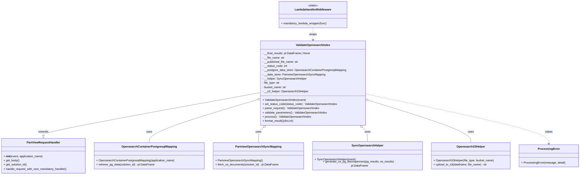

# Diagram: partview_core/partview_service/partview_service/elastic_search/sync_opensearch_index/validate_opensearch_index.py

> Auto-generated by Obscura crawlers

## Mermaid

### SVG

<svg id="container" width="3266.8828125" xmlns="http://www.w3.org/2000/svg" class="classDiagram" height="992" viewBox="0 0 3266.8828125 992" role="graphics-document document" aria-roledescription="class"><g><defs><marker id="container_class-aggregationStart" class="marker aggregation class" refX="18" refY="7" markerWidth="190" markerHeight="240" orient="auto"><path d="M 18,7 L9,13 L1,7 L9,1 Z"></path></marker></defs><defs><marker id="container_class-aggregationEnd" class="marker aggregation class" refX="1" refY="7" markerWidth="20" markerHeight="28" orient="auto"><path d="M 18,7 L9,13 L1,7 L9,1 Z"></path></marker></defs><defs><marker id="container_class-extensionStart" class="marker extension class" refX="18" refY="7" markerWidth="190" markerHeight="240" orient="auto"><path d="M 1,7 L18,13 V 1 Z"></path></marker></defs><defs><marker id="container_class-extensionEnd" class="marker extension class" refX="1" refY="7" markerWidth="20" markerHeight="28" orient="auto"><path d="M 1,1 V 13 L18,7 Z"></path></marker></defs><defs><marker id="container_class-compositionStart" class="marker composition class" refX="18" refY="7" markerWidth="190" markerHeight="240" orient="auto"><path d="M 18,7 L9,13 L1,7 L9,1 Z"></path></marker></defs><defs><marker id="container_class-compositionEnd" class="marker composition class" refX="1" refY="7" markerWidth="20" markerHeight="28" orient="auto"><path d="M 18,7 L9,13 L1,7 L9,1 Z"></path></marker></defs><defs><marker id="container_class-dependencyStart" class="marker dependency class" refX="6" refY="7" markerWidth="190" markerHeight="240" orient="auto"><path d="M 5,7 L9,13 L1,7 L9,1 Z"></path></marker></defs><defs><marker id="container_class-dependencyEnd" class="marker dependency class" refX="13" refY="7" markerWidth="20" markerHeight="28" orient="auto"><path d="M 18,7 L9,13 L14,7 L9,1 Z"></path></marker></defs><defs><marker id="container_class-lollipopStart" class="marker lollipop class" refX="13" refY="7" markerWidth="190" markerHeight="240" orient="auto"><circle stroke="black" fill="transparent" cx="7" cy="7" r="6"></circle></marker></defs><defs><marker id="container_class-lollipopEnd" class="marker lollipop class" refX="1" refY="7" markerWidth="190" markerHeight="240" orient="auto"><circle stroke="black" fill="transparent" cx="7" cy="7" r="6"></circle></marker></defs><g class="root"><g class="clusters"></g><g class="edgePaths"><path d="M1474.125,526.056L1269.767,563.214C1065.409,600.371,656.693,674.685,452.335,715.134C247.977,755.583,247.977,762.167,247.977,765.458L247.977,768.75" id="id_ValidateOpensearchIndex_PartViewRequestHandler_1" class="edge-thickness-normal edge-pattern-solid relation" style=";;;" data-edge="true" data-et="edge" data-id="id_ValidateOpensearchIndex_PartViewRequestHandler_1" data-points="W3sieCI6MTQ3NC4xMjUsInkiOjUyNi4wNTY0ODkzMDkwNTY2fSx7IngiOjI0Ny45NzY1NjI1LCJ5Ijo3NDl9LHsieCI6MjQ3Ljk3NjU2MjUsInkiOjc4Nn1d" marker-end="url(#container_class-extensionEnd)"></path><path d="M1457.603,566.211L1356.123,596.676C1254.642,627.14,1051.68,688.07,950.2,728.702C848.719,769.333,848.719,789.667,848.719,799.833L848.719,810" id="id_ValidateOpensearchIndex_OpensearchContainerPostgresqlMapping_2" class="edge-thickness-normal edge-pattern-solid relation" style=";;;" data-edge="true" data-et="edge" data-id="id_ValidateOpensearchIndex_OpensearchContainerPostgresqlMapping_2" data-points="W3sieCI6MTQ3NC4xMjUsInkiOjU2MS4yNTA3NzM2NjYxNDAzfSx7IngiOjg0OC43MTg3NSwieSI6NzQ5fSx7IngiOjg0OC43MTg3NSwieSI6ODEwfV0=" marker-start="url(#container_class-aggregationStart)"></path><path d="M1492.667,723.557L1487.968,727.797C1483.269,732.038,1473.871,740.519,1469.172,754.926C1464.473,769.333,1464.473,789.667,1464.473,799.833L1464.473,810" id="id_ValidateOpensearchIndex_PartviewOpensearchSyncMapping_3" class="edge-thickness-normal edge-pattern-solid relation" style=";;;" data-edge="true" data-et="edge" data-id="id_ValidateOpensearchIndex_PartviewOpensearchSyncMapping_3" data-points="W3sieCI6MTUwNS40NzM2MTUxODUwMTgsInkiOjcxMn0seyJ4IjoxNDY0LjQ3MjY1NjI1LCJ5Ijo3NDl9LHsieCI6MTQ2NC40NzI2NTYyNSwieSI6ODEwfV0=" marker-start="url(#container_class-aggregationStart)"></path><path d="M2050.184,723.557L2054.883,727.797C2059.583,732.038,2068.981,740.519,2073.68,754.926C2078.379,769.333,2078.379,789.667,2078.379,799.833L2078.379,810" id="id_ValidateOpensearchIndex_SyncOpensearchHelper_4" class="edge-thickness-normal edge-pattern-solid relation" style=";;;" data-edge="true" data-et="edge" data-id="id_ValidateOpensearchIndex_SyncOpensearchHelper_4" data-points="W3sieCI6MjAzNy4zNzc5NDczMTQ5ODIsInkiOjcxMn0seyJ4IjoyMDc4LjM3ODkwNjI1LCJ5Ijo3NDl9LHsieCI6MjA3OC4zNzg5MDYyNSwieSI6ODEwfV0=" marker-start="url(#container_class-aggregationStart)"></path><path d="M2085.193,569.974L2180.749,599.812C2276.305,629.649,2467.418,689.325,2562.975,729.329C2658.531,769.333,2658.531,789.667,2658.531,799.833L2658.531,810" id="id_ValidateOpensearchIndex_OpensearchS3Helper_5" class="edge-thickness-normal edge-pattern-solid relation" style=";;;" data-edge="true" data-et="edge" data-id="id_ValidateOpensearchIndex_OpensearchS3Helper_5" data-points="W3sieCI6MjA2OC43MjY1NjI1LCJ5Ijo1NjQuODMyNjEwNDQ3NDI2fSx7IngiOjI2NTguNTMxMjUsInkiOjc0OX0seyJ4IjoyNjU4LjUzMTI1LCJ5Ijo4MTB9XQ==" marker-start="url(#container_class-aggregationStart)"></path><path d="M1771.426,158L1771.426,164.167C1771.426,170.333,1771.426,182.667,1771.426,194C1771.426,205.333,1771.426,215.667,1771.426,220.833L1771.426,226" id="id_LambdaHandlerMiddleware_ValidateOpensearchIndex_6" class="edge-thickness-normal edge-pattern-dashed relation" style=";;;" data-edge="true" data-et="edge" data-id="id_LambdaHandlerMiddleware_ValidateOpensearchIndex_6" data-points="W3sieCI6MTc3MS40MjU3ODEyNSwieSI6MTU4fSx7IngiOjE3NzEuNDI1NzgxMjUsInkiOjE5NX0seyJ4IjoxNzcxLjQyNTc4MTI1LCJ5IjoyMzJ9XQ==" marker-end="url(#container_class-dependencyEnd)"></path><path d="M2068.727,534.251L2239.66,570.043C2410.592,605.834,2752.458,677.417,2923.391,724.375C3094.324,771.333,3094.324,793.667,3094.324,804.833L3094.324,816" id="id_ValidateOpensearchIndex_ProcessingError_7" class="edge-thickness-normal edge-pattern-dashed relation" style=";;;" data-edge="true" data-et="edge" data-id="id_ValidateOpensearchIndex_ProcessingError_7" data-points="W3sieCI6MjA2OC43MjY1NjI1LCJ5Ijo1MzQuMjUxNDI3Njc3MTUzMX0seyJ4IjozMDk0LjMyNDIxODc1LCJ5Ijo3NDl9LHsieCI6MzA5NC4zMjQyMTg3NSwieSI6ODIyfV0=" marker-end="url(#container_class-dependencyEnd)"></path></g><g class="edgeLabels"><g class="edgeLabel" transform="translate(247.9765625, 749)"><g class="label" data-id="id_ValidateOpensearchIndex_PartViewRequestHandler_1" transform="translate(-28.5078125, -12)"><foreignObject width="57.015625" height="24">

extends

</foreignObject></g></g><g class="edgeLabel" transform="translate(848.71875, 749)"><g class="label" data-id="id_ValidateOpensearchIndex_OpensearchContainerPostgresqlMapping_2" transform="translate(-16.4921875, -12)"><foreignObject width="32.984375" height="24">

uses

</foreignObject></g></g><g class="edgeLabel" transform="translate(1464.47265625, 749)"><g class="label" data-id="id_ValidateOpensearchIndex_PartviewOpensearchSyncMapping_3" transform="translate(-16.4921875, -12)"><foreignObject width="32.984375" height="24">

uses

</foreignObject></g></g><g class="edgeLabel" transform="translate(2078.37890625, 749)"><g class="label" data-id="id_ValidateOpensearchIndex_SyncOpensearchHelper_4" transform="translate(-16.4921875, -12)"><foreignObject width="32.984375" height="24">

uses

</foreignObject></g></g><g class="edgeLabel" transform="translate(2658.53125, 749)"><g class="label" data-id="id_ValidateOpensearchIndex_OpensearchS3Helper_5" transform="translate(-16.4921875, -12)"><foreignObject width="32.984375" height="24">

uses

</foreignObject></g></g><g class="edgeLabel" transform="translate(1771.42578125, 195)"><g class="label" data-id="id_LambdaHandlerMiddleware_ValidateOpensearchIndex_6" transform="translate(-21.390625, -12)"><foreignObject width="42.78125" height="24">

wraps

</foreignObject></g></g><g class="edgeLabel" transform="translate(3094.32421875, 749)"><g class="label" data-id="id_ValidateOpensearchIndex_ProcessingError_7" transform="translate(-21.25, -12)"><foreignObject width="42.5" height="24">

raises

</foreignObject></g></g></g><g class="nodes"><g class="node default" id="classId-ValidateOpensearchIndex-0" transform="translate(1771.42578125, 472)"><g class="basic label-container"><path d="M-297.30078125 -240 L297.30078125 -240 L297.30078125 240 L-297.30078125 240" stroke="none" stroke-width="0" fill="#ECECFF" style=""></path><path d="M-297.30078125 -240 C-77.7888036228724 -240, 141.7231740042552 -240, 297.30078125 -240 M-297.30078125 -240 C-65.9704434481578 -240, 165.3598943536844 -240, 297.30078125 -240 M297.30078125 -240 C297.30078125 -88.31187552759275, 297.30078125 63.376248944814506, 297.30078125 240 M297.30078125 -240 C297.30078125 -85.20737456937798, 297.30078125 69.58525086124405, 297.30078125 240 M297.30078125 240 C74.82471275664429 240, -147.65135573671142 240, -297.30078125 240 M297.30078125 240 C158.8376841138133 240, 20.37458697762662 240, -297.30078125 240 M-297.30078125 240 C-297.30078125 120.17599495484822, -297.30078125 0.3519899096964423, -297.30078125 -240 M-297.30078125 240 C-297.30078125 118.34495556475326, -297.30078125 -3.3100888704934732, -297.30078125 -240" stroke="#9370DB" stroke-width="1.3" fill="none" stroke-dasharray="0 0" style=""></path></g><g class="annotation-group text" transform="translate(0, -216)"></g><g class="label-group text" transform="translate(-93.2265625, -216)"><g class="label" style="font-weight: bolder" transform="translate(0,-12)"><foreignObject width="186.453125" height="24">

ValidateOpensearchIndex

</foreignObject></g></g><g class="members-group text" transform="translate(-285.30078125, -168)"><g class="label" style="" transform="translate(0,-12)"><foreignObject width="272.859375" height="24">

- __final_results: pl.DataFrame | None

</foreignObject></g><g class="label" style="" transform="translate(0,12)"><foreignObject width="125.40625" height="24">

- __file_name: str

</foreignObject></g><g class="label" style="" transform="translate(0,36)"><foreignObject width="206.375" height="24">

- __published_file_name: str

</foreignObject></g><g class="label" style="" transform="translate(0,60)"><foreignObject width="141.953125" height="24">

- __status_code: int

</foreignObject></g><g class="label" style="" transform="translate(0,84)"><foreignObject width="477.375" height="24">

- __postgres_data_store: OpensearchContainerPostgresqlMapping

</foreignObject></g><g class="label" style="" transform="translate(0,108)"><foreignObject width="356.1875" height="24">

- __data_store: PartviewOpensearchSyncMapping

</foreignObject></g><g class="label" style="" transform="translate(0,132)"><foreignObject width="250.875" height="24">

- __helper: SyncOpensearchHelper

</foreignObject></g><g class="label" style="" transform="translate(0,156)"><foreignObject width="100.203125" height="24">

- file_type: str

</foreignObject></g><g class="label" style="" transform="translate(0,180)"><foreignObject width="136.046875" height="24">

- bucket_name: str

</foreignObject></g><g class="label" style="" transform="translate(0,204)"><foreignObject width="257.578125" height="24">

- __s3_helper: OpensearchS3Helper

</foreignObject></g></g><g class="methods-group text" transform="translate(-285.30078125, 96)"><g class="label" style="" transform="translate(0,-12)"><foreignObject width="247.59375" height="24">

+ ValidateOpensearchIndex(event)

</foreignObject></g><g class="label" style="" transform="translate(0,12)"><foreignObject width="423.9375" height="24">

+ set_status_code(status_code) : ValidateOpensearchIndex

</foreignObject></g><g class="label" style="" transform="translate(0,36)"><foreignObject width="323.015625" height="24">

+ parse_request() : ValidateOpensearchIndex

</foreignObject></g><g class="label" style="" transform="translate(0,60)"><foreignObject width="367.921875" height="24">

+ validate_parameters() : ValidateOpensearchIndex

</foreignObject></g><g class="label" style="" transform="translate(0,84)"><foreignObject width="274.953125" height="24">

+ process() : ValidateOpensearchIndex

</foreignObject></g><g class="label" style="" transform="translate(0,108)"><foreignObject width="182.9375" height="24">

+ format_result()(dict,int)

</foreignObject></g></g><g class="divider" style=""><path d="M-297.30078125 -192 C-113.40750309618787 -192, 70.48577505762427 -192, 297.30078125 -192 M-297.30078125 -192 C-78.90205152062012 -192, 139.49667820875976 -192, 297.30078125 -192" stroke="#9370DB" stroke-width="1.3" fill="none" stroke-dasharray="0 0" style=""></path></g><g class="divider" style=""><path d="M-297.30078125 72 C-110.02259289692122 72, 77.25559545615755 72, 297.30078125 72 M-297.30078125 72 C-61.606968878873005 72, 174.086843492254 72, 297.30078125 72" stroke="#9370DB" stroke-width="1.3" fill="none" stroke-dasharray="0 0" style=""></path></g></g><g class="node default" id="classId-PartViewRequestHandler-1" transform="translate(247.9765625, 885)"><g class="basic label-container"><path d="M-239.9765625 -99 L239.9765625 -99 L239.9765625 99 L-239.9765625 99" stroke="none" stroke-width="0" fill="#ECECFF" style=""></path><path d="M-239.9765625 -99 C-90.51934900452753 -99, 58.937864490944946 -99, 239.9765625 -99 M-239.9765625 -99 C-70.91008315126868 -99, 98.15639619746264 -99, 239.9765625 -99 M239.9765625 -99 C239.9765625 -23.309662636484674, 239.9765625 52.38067472703065, 239.9765625 99 M239.9765625 -99 C239.9765625 -24.460149780299872, 239.9765625 50.079700439400256, 239.9765625 99 M239.9765625 99 C50.07194336051316 99, -139.83267577897368 99, -239.9765625 99 M239.9765625 99 C59.12900598013928 99, -121.71855053972143 99, -239.9765625 99 M-239.9765625 99 C-239.9765625 38.40035072895556, -239.9765625 -22.199298542088883, -239.9765625 -99 M-239.9765625 99 C-239.9765625 34.37307403987978, -239.9765625 -30.253851920240436, -239.9765625 -99" stroke="#9370DB" stroke-width="1.3" fill="none" stroke-dasharray="0 0" style=""></path></g><g class="annotation-group text" transform="translate(0, -75)"></g><g class="label-group text" transform="translate(-91.359375, -75)"><g class="label" style="font-weight: bolder" transform="translate(0,-12)"><foreignObject width="182.71875" height="24">

PartViewRequestHandler

</foreignObject></g></g><g class="members-group text" transform="translate(-227.9765625, -27)"></g><g class="methods-group text" transform="translate(-227.9765625, 3)"><g class="label" style="" transform="translate(0,-12)"><foreignObject width="226.46875" height="24">

+ <strong>init</strong>(event, application_name)

</foreignObject></g><g class="label" style="" transform="translate(0,12)"><foreignObject width="89.765625" height="24">

+ get_body()

</foreignObject></g><g class="label" style="" transform="translate(0,36)"><foreignObject width="135.703125" height="24">

+ get_solution_id()

</foreignObject></g><g class="label" style="" transform="translate(0,60)"><foreignObject width="364.59375" height="24">

+ handle_request_with_new_mandatory_handler()

</foreignObject></g></g><g class="divider" style=""><path d="M-239.9765625 -51 C-111.90451874522074 -51, 16.167525009558517 -51, 239.9765625 -51 M-239.9765625 -51 C-99.36914828380782 -51, 41.238265932384365 -51, 239.9765625 -51" stroke="#9370DB" stroke-width="1.3" fill="none" stroke-dasharray="0 0" style=""></path></g><g class="divider" style=""><path d="M-239.9765625 -27 C-138.1482790763955 -27, -36.31999565279099 -27, 239.9765625 -27 M-239.9765625 -27 C-118.39355866076384 -27, 3.1894451784723117 -27, 239.9765625 -27" stroke="#9370DB" stroke-width="1.3" fill="none" stroke-dasharray="0 0" style=""></path></g></g><g class="node default" id="classId-OpensearchContainerPostgresqlMapping-2" transform="translate(848.71875, 885)"><g class="basic label-container"><path d="M-310.765625 -75 L310.765625 -75 L310.765625 75 L-310.765625 75" stroke="none" stroke-width="0" fill="#ECECFF" style=""></path><path d="M-310.765625 -75 C-111.1060621253115 -75, 88.55350074937701 -75, 310.765625 -75 M-310.765625 -75 C-73.78980672890606 -75, 163.18601154218788 -75, 310.765625 -75 M310.765625 -75 C310.765625 -44.195779509253676, 310.765625 -13.391559018507351, 310.765625 75 M310.765625 -75 C310.765625 -38.18212917071494, 310.765625 -1.3642583414298741, 310.765625 75 M310.765625 75 C133.6717121270572 75, -43.42220074588562 75, -310.765625 75 M310.765625 75 C109.78944623894398 75, -91.18673252211204 75, -310.765625 75 M-310.765625 75 C-310.765625 24.266049083026104, -310.765625 -26.467901833947792, -310.765625 -75 M-310.765625 75 C-310.765625 26.67931498166547, -310.765625 -21.64137003666906, -310.765625 -75" stroke="#9370DB" stroke-width="1.3" fill="none" stroke-dasharray="0 0" style=""></path></g><g class="annotation-group text" transform="translate(0, -51)"></g><g class="label-group text" transform="translate(-149.34375, -51)"><g class="label" style="font-weight: bolder" transform="translate(0,-12)"><foreignObject width="298.6875" height="24">

OpensearchContainerPostgresqlMapping

</foreignObject></g></g><g class="members-group text" transform="translate(-298.765625, -3)"></g><g class="methods-group text" transform="translate(-298.765625, 27)"><g class="label" style="" transform="translate(0,-12)"><foreignObject width="448.1875" height="24">

+ OpensearchContainerPostgresqlMapping(application_name)

</foreignObject></g><g class="label" style="" transform="translate(0,12)"><foreignObject width="335.09375" height="24">

+ retrieve_pg_data(solution_id) : pl.DataFrame

</foreignObject></g></g><g class="divider" style=""><path d="M-310.765625 -27 C-169.94926833841137 -27, -29.132911676822744 -27, 310.765625 -27 M-310.765625 -27 C-150.43605761877828 -27, 9.893509762443443 -27, 310.765625 -27" stroke="#9370DB" stroke-width="1.3" fill="none" stroke-dasharray="0 0" style=""></path></g><g class="divider" style=""><path d="M-310.765625 -3 C-75.91725414786586 -3, 158.93111670426828 -3, 310.765625 -3 M-310.765625 -3 C-125.63369656504801 -3, 59.498231869903975 -3, 310.765625 -3" stroke="#9370DB" stroke-width="1.3" fill="none" stroke-dasharray="0 0" style=""></path></g></g><g class="node default" id="classId-PartviewOpensearchSyncMapping-3" transform="translate(1464.47265625, 885)"><g class="basic label-container"><path d="M-254.98828125 -75 L254.98828125 -75 L254.98828125 75 L-254.98828125 75" stroke="none" stroke-width="0" fill="#ECECFF" style=""></path><path d="M-254.98828125 -75 C-86.7636065218569 -75, 81.4610682062862 -75, 254.98828125 -75 M-254.98828125 -75 C-148.1484383359197 -75, -41.308595421839414 -75, 254.98828125 -75 M254.98828125 -75 C254.98828125 -31.02791190272147, 254.98828125 12.944176194557059, 254.98828125 75 M254.98828125 -75 C254.98828125 -18.762281678026035, 254.98828125 37.47543664394793, 254.98828125 75 M254.98828125 75 C151.94707546913196 75, 48.90586968826389 75, -254.98828125 75 M254.98828125 75 C107.22233614918991 75, -40.54360895162017 75, -254.98828125 75 M-254.98828125 75 C-254.98828125 24.873382487177075, -254.98828125 -25.25323502564585, -254.98828125 -75 M-254.98828125 75 C-254.98828125 26.221570080503845, -254.98828125 -22.55685983899231, -254.98828125 -75" stroke="#9370DB" stroke-width="1.3" fill="none" stroke-dasharray="0 0" style=""></path></g><g class="annotation-group text" transform="translate(0, -51)"></g><g class="label-group text" transform="translate(-123.7265625, -51)"><g class="label" style="font-weight: bolder" transform="translate(0,-12)"><foreignObject width="247.453125" height="24">

PartviewOpensearchSyncMapping

</foreignObject></g></g><g class="members-group text" transform="translate(-242.98828125, -3)"></g><g class="methods-group text" transform="translate(-242.98828125, 27)"><g class="label" style="" transform="translate(0,-12)"><foreignObject width="266.125" height="24">

+ PartviewOpensearchSyncMapping()

</foreignObject></g><g class="label" style="" transform="translate(0,12)"><foreignObject width="362.25" height="24">

+ fetch_os_documents(solution_id) : pl.DataFrame

</foreignObject></g></g><g class="divider" style=""><path d="M-254.98828125 -27 C-152.63180013010992 -27, -50.275319010219874 -27, 254.98828125 -27 M-254.98828125 -27 C-127.55930800442277 -27, -0.13033475884554946 -27, 254.98828125 -27" stroke="#9370DB" stroke-width="1.3" fill="none" stroke-dasharray="0 0" style=""></path></g><g class="divider" style=""><path d="M-254.98828125 -3 C-54.836556128441 -3, 145.315168993118 -3, 254.98828125 -3 M-254.98828125 -3 C-56.26446666164543 -3, 142.45934792670914 -3, 254.98828125 -3" stroke="#9370DB" stroke-width="1.3" fill="none" stroke-dasharray="0 0" style=""></path></g></g><g class="node default" id="classId-SyncOpensearchHelper-4" transform="translate(2078.37890625, 885)"><g class="basic label-container"><path d="M-308.91796875 -75 L308.91796875 -75 L308.91796875 75 L-308.91796875 75" stroke="none" stroke-width="0" fill="#ECECFF" style=""></path><path d="M-308.91796875 -75 C-103.3545825466048 -75, 102.2088036567904 -75, 308.91796875 -75 M-308.91796875 -75 C-140.07317781812964 -75, 28.771613113740727 -75, 308.91796875 -75 M308.91796875 -75 C308.91796875 -29.19263813034339, 308.91796875 16.61472373931322, 308.91796875 75 M308.91796875 -75 C308.91796875 -34.707642669551454, 308.91796875 5.584714660897092, 308.91796875 75 M308.91796875 75 C100.17432037439067 75, -108.56932800121865 75, -308.91796875 75 M308.91796875 75 C109.6664348978957 75, -89.5850989542086 75, -308.91796875 75 M-308.91796875 75 C-308.91796875 44.31820185974853, -308.91796875 13.636403719497046, -308.91796875 -75 M-308.91796875 75 C-308.91796875 20.371336808234012, -308.91796875 -34.257326383531975, -308.91796875 -75" stroke="#9370DB" stroke-width="1.3" fill="none" stroke-dasharray="0 0" style=""></path></g><g class="annotation-group text" transform="translate(0, -51)"></g><g class="label-group text" transform="translate(-84.9453125, -51)"><g class="label" style="font-weight: bolder" transform="translate(0,-12)"><foreignObject width="169.890625" height="24">

SyncOpensearchHelper

</foreignObject></g></g><g class="members-group text" transform="translate(-296.91796875, -3)"></g><g class="methods-group text" transform="translate(-296.91796875, 27)"><g class="label" style="" transform="translate(0,-12)"><foreignObject width="231.203125" height="24">

+ SyncOpensearchHelper(event)

</foreignObject></g><g class="label" style="" transform="translate(0,12)"><foreignObject width="508.890625" height="24">

+ generate_os_pg_discrepancies(pg_results, os_results) : pl.DataFrame

</foreignObject></g></g><g class="divider" style=""><path d="M-308.91796875 -27 C-151.84846250586045 -27, 5.221043738279093 -27, 308.91796875 -27 M-308.91796875 -27 C-112.32968999235663 -27, 84.25858876528673 -27, 308.91796875 -27" stroke="#9370DB" stroke-width="1.3" fill="none" stroke-dasharray="0 0" style=""></path></g><g class="divider" style=""><path d="M-308.91796875 -3 C-155.3560154621813 -3, -1.7940621743625798 -3, 308.91796875 -3 M-308.91796875 -3 C-166.72051467923356 -3, -24.52306060846712 -3, 308.91796875 -3" stroke="#9370DB" stroke-width="1.3" fill="none" stroke-dasharray="0 0" style=""></path></g></g><g class="node default" id="classId-OpensearchS3Helper-5" transform="translate(2658.53125, 885)"><g class="basic label-container"><path d="M-221.234375 -75 L221.234375 -75 L221.234375 75 L-221.234375 75" stroke="none" stroke-width="0" fill="#ECECFF" style=""></path><path d="M-221.234375 -75 C-73.91227843148963 -75, 73.40981813702075 -75, 221.234375 -75 M-221.234375 -75 C-95.30321870306781 -75, 30.627937593864374 -75, 221.234375 -75 M221.234375 -75 C221.234375 -19.322276762402012, 221.234375 36.355446475195976, 221.234375 75 M221.234375 -75 C221.234375 -23.604772392295416, 221.234375 27.790455215409168, 221.234375 75 M221.234375 75 C70.7941273241417 75, -79.6461203517166 75, -221.234375 75 M221.234375 75 C79.62544862708944 75, -61.98347774582112 75, -221.234375 75 M-221.234375 75 C-221.234375 40.99510028807401, -221.234375 6.990200576148027, -221.234375 -75 M-221.234375 75 C-221.234375 36.48510577814114, -221.234375 -2.0297884437177203, -221.234375 -75" stroke="#9370DB" stroke-width="1.3" fill="none" stroke-dasharray="0 0" style=""></path></g><g class="annotation-group text" transform="translate(0, -51)"></g><g class="label-group text" transform="translate(-76.59375, -51)"><g class="label" style="font-weight: bolder" transform="translate(0,-12)"><foreignObject width="153.1875" height="24">

OpensearchS3Helper

</foreignObject></g></g><g class="members-group text" transform="translate(-209.234375, -3)"></g><g class="methods-group text" transform="translate(-209.234375, 27)"><g class="label" style="" transform="translate(0,-12)"><foreignObject width="341.875" height="24">

+ OpensearchS3Helper(file_type, bucket_name)

</foreignObject></g><g class="label" style="" transform="translate(0,12)"><foreignObject width="305.265625" height="24">

+ upload_to_s3(dataframe, file_name) : str

</foreignObject></g></g><g class="divider" style=""><path d="M-221.234375 -27 C-56.97784833044747 -27, 107.27867833910506 -27, 221.234375 -27 M-221.234375 -27 C-114.61727626351512 -27, -8.000177527030246 -27, 221.234375 -27" stroke="#9370DB" stroke-width="1.3" fill="none" stroke-dasharray="0 0" style=""></path></g><g class="divider" style=""><path d="M-221.234375 -3 C-111.86727121390028 -3, -2.5001674278005623 -3, 221.234375 -3 M-221.234375 -3 C-83.12754048177086 -3, 54.97929403645827 -3, 221.234375 -3" stroke="#9370DB" stroke-width="1.3" fill="none" stroke-dasharray="0 0" style=""></path></g></g><g class="node default" id="classId-LambdaHandlerMiddleware-6" transform="translate(1771.42578125, 83)"><g class="basic label-container"><path d="M-194.1171875 -75 L194.1171875 -75 L194.1171875 75 L-194.1171875 75" stroke="none" stroke-width="0" fill="#ECECFF" style=""></path><path d="M-194.1171875 -75 C-52.71509429867464 -75, 88.68699890265071 -75, 194.1171875 -75 M-194.1171875 -75 C-55.965719702609476 -75, 82.18574809478105 -75, 194.1171875 -75 M194.1171875 -75 C194.1171875 -19.42802824394323, 194.1171875 36.14394351211354, 194.1171875 75 M194.1171875 -75 C194.1171875 -29.177576101821423, 194.1171875 16.644847796357155, 194.1171875 75 M194.1171875 75 C39.158364715899154 75, -115.80045806820169 75, -194.1171875 75 M194.1171875 75 C71.2002532979684 75, -51.716680904063196 75, -194.1171875 75 M-194.1171875 75 C-194.1171875 43.63168022184429, -194.1171875 12.263360443688583, -194.1171875 -75 M-194.1171875 75 C-194.1171875 25.509250361333265, -194.1171875 -23.98149927733347, -194.1171875 -75" stroke="#9370DB" stroke-width="1.3" fill="none" stroke-dasharray="0 0" style=""></path></g><g class="annotation-group text" transform="translate(-29.0234375, -51)"><g class="label" style="" transform="translate(0,-12)"><foreignObject width="58.046875" height="24">

«static»

</foreignObject></g></g><g class="label-group text" transform="translate(-100.765625, -27)"><g class="label" style="font-weight: bolder" transform="translate(0,-12)"><foreignObject width="201.53125" height="24">

LambdaHandlerMiddleware

</foreignObject></g></g><g class="members-group text" transform="translate(-182.1171875, 21)"></g><g class="methods-group text" transform="translate(-182.1171875, 51)"><g class="label" style="" transform="translate(0,-12)"><foreignObject width="263.46875" height="24">

+ mandatory_lambda_wrapper(func)

</foreignObject></g></g><g class="divider" style=""><path d="M-194.1171875 -3 C-71.96323305639251 -3, 50.19072138721498 -3, 194.1171875 -3 M-194.1171875 -3 C-81.23310018662681 -3, 31.650987126746372 -3, 194.1171875 -3" stroke="#9370DB" stroke-width="1.3" fill="none" stroke-dasharray="0 0" style=""></path></g><g class="divider" style=""><path d="M-194.1171875 21 C-73.24819126018288 21, 47.620804979634244 21, 194.1171875 21 M-194.1171875 21 C-70.71309744578248 21, 52.69099260843504 21, 194.1171875 21" stroke="#9370DB" stroke-width="1.3" fill="none" stroke-dasharray="0 0" style=""></path></g></g><g class="node default" id="classId-ProcessingError-7" transform="translate(3094.32421875, 885)"><g class="basic label-container"><path d="M-164.55859375 -63 L164.55859375 -63 L164.55859375 63 L-164.55859375 63" stroke="none" stroke-width="0" fill="#ECECFF" style=""></path><path d="M-164.55859375 -63 C-91.42361994535284 -63, -18.28864614070568 -63, 164.55859375 -63 M-164.55859375 -63 C-39.35532700373852 -63, 85.84793974252295 -63, 164.55859375 -63 M164.55859375 -63 C164.55859375 -20.016497070727958, 164.55859375 22.967005858544084, 164.55859375 63 M164.55859375 -63 C164.55859375 -21.68941619194382, 164.55859375 19.62116761611236, 164.55859375 63 M164.55859375 63 C89.25639837132812 63, 13.954202992656235 63, -164.55859375 63 M164.55859375 63 C93.25596232900509 63, 21.953330908010173 63, -164.55859375 63 M-164.55859375 63 C-164.55859375 21.510887139177818, -164.55859375 -19.978225721644364, -164.55859375 -63 M-164.55859375 63 C-164.55859375 36.48955633328089, -164.55859375 9.979112666561775, -164.55859375 -63" stroke="#9370DB" stroke-width="1.3" fill="none" stroke-dasharray="0 0" style=""></path></g><g class="annotation-group text" transform="translate(0, -39)"></g><g class="label-group text" transform="translate(-57.5078125, -39)"><g class="label" style="font-weight: bolder" transform="translate(0,-12)"><foreignObject width="115.015625" height="24">

ProcessingError

</foreignObject></g></g><g class="members-group text" transform="translate(-152.55859375, 9)"></g><g class="methods-group text" transform="translate(-152.55859375, 39)"><g class="label" style="" transform="translate(0,-12)"><foreignObject width="247.609375" height="24">

+ ProcessingError(message, detail)

</foreignObject></g></g><g class="divider" style=""><path d="M-164.55859375 -15 C-53.67917152837201 -15, 57.20025069325598 -15, 164.55859375 -15 M-164.55859375 -15 C-79.5023722205118 -15, 5.553849308976396 -15, 164.55859375 -15" stroke="#9370DB" stroke-width="1.3" fill="none" stroke-dasharray="0 0" style=""></path></g><g class="divider" style=""><path d="M-164.55859375 9 C-64.7120414506901 9, 35.13451084861981 9, 164.55859375 9 M-164.55859375 9 C-83.73439102056953 9, -2.9101882911390646 9, 164.55859375 9" stroke="#9370DB" stroke-width="1.3" fill="none" stroke-dasharray="0 0" style=""></path></g></g></g></g></g></svg>
