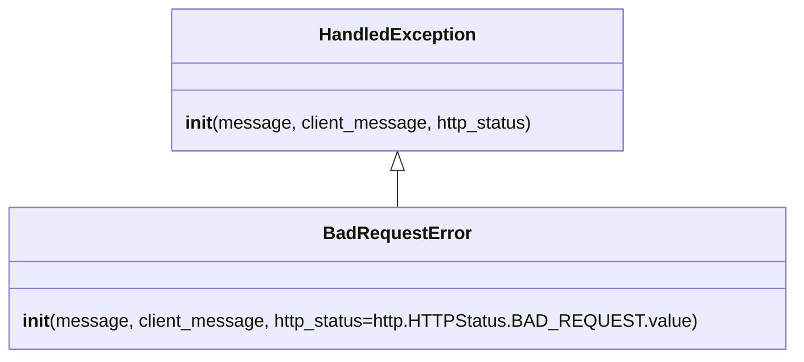
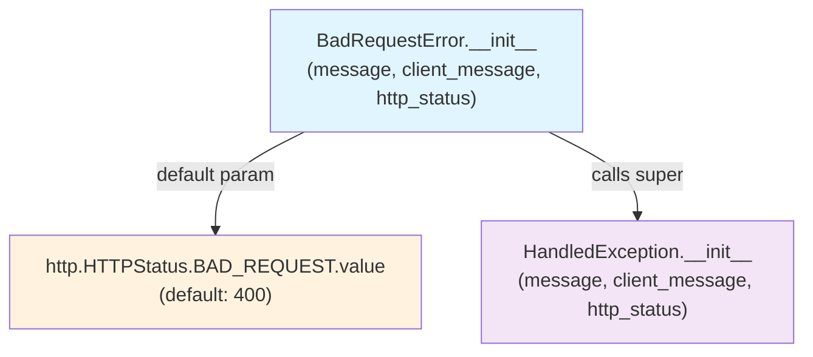

# Diagram: partview_core/partview_service/partview_service/exception/BadRequestError.py

> Auto-generated by Obscura crawlers

## Diagram 1

### SVG

<svg id="container" width="680.234375" xmlns="http://www.w3.org/2000/svg" class="classDiagram" height="318" viewBox="0 0 680.234375 318" role="graphics-document document" aria-roledescription="class"><g><defs><marker id="container_class-aggregationStart" class="marker aggregation class" refX="18" refY="7" markerWidth="190" markerHeight="240" orient="auto"><path d="M 18,7 L9,13 L1,7 L9,1 Z"></path></marker></defs><defs><marker id="container_class-aggregationEnd" class="marker aggregation class" refX="1" refY="7" markerWidth="20" markerHeight="28" orient="auto"><path d="M 18,7 L9,13 L1,7 L9,1 Z"></path></marker></defs><defs><marker id="container_class-extensionStart" class="marker extension class" refX="18" refY="7" markerWidth="190" markerHeight="240" orient="auto"><path d="M 1,7 L18,13 V 1 Z"></path></marker></defs><defs><marker id="container_class-extensionEnd" class="marker extension class" refX="1" refY="7" markerWidth="20" markerHeight="28" orient="auto"><path d="M 1,1 V 13 L18,7 Z"></path></marker></defs><defs><marker id="container_class-compositionStart" class="marker composition class" refX="18" refY="7" markerWidth="190" markerHeight="240" orient="auto"><path d="M 18,7 L9,13 L1,7 L9,1 Z"></path></marker></defs><defs><marker id="container_class-compositionEnd" class="marker composition class" refX="1" refY="7" markerWidth="20" markerHeight="28" orient="auto"><path d="M 18,7 L9,13 L1,7 L9,1 Z"></path></marker></defs><defs><marker id="container_class-dependencyStart" class="marker dependency class" refX="6" refY="7" markerWidth="190" markerHeight="240" orient="auto"><path d="M 5,7 L9,13 L1,7 L9,1 Z"></path></marker></defs><defs><marker id="container_class-dependencyEnd" class="marker dependency class" refX="13" refY="7" markerWidth="20" markerHeight="28" orient="auto"><path d="M 18,7 L9,13 L14,7 L9,1 Z"></path></marker></defs><defs><marker id="container_class-lollipopStart" class="marker lollipop class" refX="13" refY="7" markerWidth="190" markerHeight="240" orient="auto"><circle stroke="black" fill="transparent" cx="7" cy="7" r="6"></circle></marker></defs><defs><marker id="container_class-lollipopEnd" class="marker lollipop class" refX="1" refY="7" markerWidth="190" markerHeight="240" orient="auto"><circle stroke="black" fill="transparent" cx="7" cy="7" r="6"></circle></marker></defs><g class="root"><g class="clusters"></g><g class="edgePaths"><path d="M340.117,151.25L340.117,152.542C340.117,153.833,340.117,156.417,340.117,161.875C340.117,167.333,340.117,175.667,340.117,179.833L340.117,184" id="id_HandledException_BadRequestError_1" class="edge-thickness-normal edge-pattern-solid relation" style=";;;" data-edge="true" data-et="edge" data-id="id_HandledException_BadRequestError_1" data-points="W3sieCI6MzQwLjExNzE4NzUsInkiOjEzNH0seyJ4IjozNDAuMTE3MTg3NSwieSI6MTU5fSx7IngiOjM0MC4xMTcxODc1LCJ5IjoxODR9XQ==" marker-start="url(#container_class-extensionStart)"></path></g><g class="edgeLabels"><g class="edgeLabel"><g class="label" data-id="id_HandledException_BadRequestError_1" transform="translate(0, 0)"><foreignObject width="0" height="0">

</foreignObject></g></g></g><g class="nodes"><g class="node default" id="classId-HandledException-0" transform="translate(340.1171875, 71)"><g class="basic label-container"><path d="M-198.83984375 -63 L198.83984375 -63 L198.83984375 63 L-198.83984375 63" stroke="none" stroke-width="0" fill="#ECECFF" style=""></path><path d="M-198.83984375 -63 C-85.37548622766462 -63, 28.088871294670753 -63, 198.83984375 -63 M-198.83984375 -63 C-108.85679347351842 -63, -18.873743197036845 -63, 198.83984375 -63 M198.83984375 -63 C198.83984375 -24.542785248467595, 198.83984375 13.91442950306481, 198.83984375 63 M198.83984375 -63 C198.83984375 -34.991155365874945, 198.83984375 -6.982310731749884, 198.83984375 63 M198.83984375 63 C99.56620996197782 63, 0.29257617395563784 63, -198.83984375 63 M198.83984375 63 C117.8407701331012 63, 36.841696516202404 63, -198.83984375 63 M-198.83984375 63 C-198.83984375 21.644344778544244, -198.83984375 -19.71131044291151, -198.83984375 -63 M-198.83984375 63 C-198.83984375 20.7651864214021, -198.83984375 -21.469627157195802, -198.83984375 -63" stroke="#9370DB" stroke-width="1.3" fill="none" stroke-dasharray="0 0" style=""></path></g><g class="annotation-group text" transform="translate(0, -39)"></g><g class="label-group text" transform="translate(-66.3828125, -39)"><g class="label" style="font-weight: bolder" transform="translate(0,-12)"><foreignObject width="132.765625" height="24">

HandledException

</foreignObject></g></g><g class="members-group text" transform="translate(-186.83984375, 9)"></g><g class="methods-group text" transform="translate(-186.83984375, 39)"><g class="label" style="" transform="translate(0,-12)"><foreignObject width="307.296875" height="24">

<strong>init</strong>(message, client_message, http_status)

</foreignObject></g></g><g class="divider" style=""><path d="M-198.83984375 -15 C-56.51857356766649 -15, 85.80269661466701 -15, 198.83984375 -15 M-198.83984375 -15 C-104.24548521485455 -15, -9.651126679709108 -15, 198.83984375 -15" stroke="#9370DB" stroke-width="1.3" fill="none" stroke-dasharray="0 0" style=""></path></g><g class="divider" style=""><path d="M-198.83984375 9 C-79.21705268750019 9, 40.40573837499963 9, 198.83984375 9 M-198.83984375 9 C-51.30409470372288 9, 96.23165434255424 9, 198.83984375 9" stroke="#9370DB" stroke-width="1.3" fill="none" stroke-dasharray="0 0" style=""></path></g></g><g class="node default" id="classId-BadRequestError-1" transform="translate(340.1171875, 247)"><g class="basic label-container"><path d="M-332.1171875 -63 L332.1171875 -63 L332.1171875 63 L-332.1171875 63" stroke="none" stroke-width="0" fill="#ECECFF" style=""></path><path d="M-332.1171875 -63 C-152.44061746413425 -63, 27.235952571731502 -63, 332.1171875 -63 M-332.1171875 -63 C-107.93886383622242 -63, 116.23945982755515 -63, 332.1171875 -63 M332.1171875 -63 C332.1171875 -32.34789769529968, 332.1171875 -1.6957953905993506, 332.1171875 63 M332.1171875 -63 C332.1171875 -35.345468537549394, 332.1171875 -7.69093707509878, 332.1171875 63 M332.1171875 63 C149.82673538577168 63, -32.46371672845663 63, -332.1171875 63 M332.1171875 63 C97.47270938356286 63, -137.17176873287428 63, -332.1171875 63 M-332.1171875 63 C-332.1171875 36.79565664045549, -332.1171875 10.591313280910974, -332.1171875 -63 M-332.1171875 63 C-332.1171875 35.916994524300684, -332.1171875 8.833989048601367, -332.1171875 -63" stroke="#9370DB" stroke-width="1.3" fill="none" stroke-dasharray="0 0" style=""></path></g><g class="annotation-group text" transform="translate(0, -39)"></g><g class="label-group text" transform="translate(-62.28125, -39)"><g class="label" style="font-weight: bolder" transform="translate(0,-12)"><foreignObject width="124.5625" height="24">

BadRequestError

</foreignObject></g></g><g class="members-group text" transform="translate(-320.1171875, 9)"></g><g class="methods-group text" transform="translate(-320.1171875, 39)"><g class="label" style="" transform="translate(0,-12)"><foreignObject width="577.953125" height="24">

<strong>init</strong>(message, client_message, http_status=http.HTTPStatus.BAD_REQUEST.value)

</foreignObject></g></g><g class="divider" style=""><path d="M-332.1171875 -15 C-184.08400806300713 -15, -36.050828626014265 -15, 332.1171875 -15 M-332.1171875 -15 C-153.77137026357647 -15, 24.574446972847056 -15, 332.1171875 -15" stroke="#9370DB" stroke-width="1.3" fill="none" stroke-dasharray="0 0" style=""></path></g><g class="divider" style=""><path d="M-332.1171875 9 C-103.23005288432338 9, 125.65708173135323 9, 332.1171875 9 M-332.1171875 9 C-182.95995484583224 9, -33.802722191664486 9, 332.1171875 9" stroke="#9370DB" stroke-width="1.3" fill="none" stroke-dasharray="0 0" style=""></path></g></g></g></g></g></svg>

## Diagram 2

### SVG

<svg id="container" width="648.671875" xmlns="http://www.w3.org/2000/svg" class="flowchart" height="294" viewBox="0 0 648.671875 294" role="graphics-document document" aria-roledescription="flowchart-v2"><g><marker id="container_flowchart-v2-pointEnd" class="marker flowchart-v2" viewBox="0 0 10 10" refX="5" refY="5" markerUnits="userSpaceOnUse" markerWidth="8" markerHeight="8" orient="auto"><path d="M 0 0 L 10 5 L 0 10 z" class="arrowMarkerPath" style="stroke-width: 1; stroke-dasharray: 1, 0;"></path></marker><marker id="container_flowchart-v2-pointStart" class="marker flowchart-v2" viewBox="0 0 10 10" refX="4.5" refY="5" markerUnits="userSpaceOnUse" markerWidth="8" markerHeight="8" orient="auto"><path d="M 0 5 L 10 10 L 10 0 z" class="arrowMarkerPath" style="stroke-width: 1; stroke-dasharray: 1, 0;"></path></marker><marker id="container_flowchart-v2-circleEnd" class="marker flowchart-v2" viewBox="0 0 10 10" refX="11" refY="5" markerUnits="userSpaceOnUse" markerWidth="11" markerHeight="11" orient="auto"><circle cx="5" cy="5" r="5" class="arrowMarkerPath" style="stroke-width: 1; stroke-dasharray: 1, 0;"></circle></marker><marker id="container_flowchart-v2-circleStart" class="marker flowchart-v2" viewBox="0 0 10 10" refX="-1" refY="5" markerUnits="userSpaceOnUse" markerWidth="11" markerHeight="11" orient="auto"><circle cx="5" cy="5" r="5" class="arrowMarkerPath" style="stroke-width: 1; stroke-dasharray: 1, 0;"></circle></marker><marker id="container_flowchart-v2-crossEnd" class="marker cross flowchart-v2" viewBox="0 0 11 11" refX="12" refY="5.2" markerUnits="userSpaceOnUse" markerWidth="11" markerHeight="11" orient="auto"><path d="M 1,1 l 9,9 M 10,1 l -9,9" class="arrowMarkerPath" style="stroke-width: 2; stroke-dasharray: 1, 0;"></path></marker><marker id="container_flowchart-v2-crossStart" class="marker cross flowchart-v2" viewBox="0 0 11 11" refX="-1" refY="5.2" markerUnits="userSpaceOnUse" markerWidth="11" markerHeight="11" orient="auto"><path d="M 1,1 l 9,9 M 10,1 l -9,9" class="arrowMarkerPath" style="stroke-width: 2; stroke-dasharray: 1, 0;"></path></marker><g class="root"><g class="clusters"></g><g class="edgePaths"><path d="M241.094,110L229.134,116.167C217.175,122.333,193.255,134.667,181.296,148.333C169.336,162,169.336,177,169.336,184.5L169.336,192" id="L_A_B_0" class="edge-thickness-normal edge-pattern-solid edge-thickness-normal edge-pattern-solid flowchart-link" style=";" data-edge="true" data-et="edge" data-id="L_A_B_0" data-points="W3sieCI6MjQxLjA5NDA2MDcyNDQzMTgsInkiOjExMH0seyJ4IjoxNjkuMzM1OTM3NSwieSI6MTQ3fSx7IngiOjE2OS4zMzU5Mzc1LCJ5IjoxOTZ9XQ==" marker-end="url(#container_flowchart-v2-pointEnd)"></path><path d="M438.914,110L450.873,116.167C462.833,122.333,486.753,134.667,498.712,146.333C510.672,158,510.672,169,510.672,174.5L510.672,180" id="L_A_C_0" class="edge-thickness-normal edge-pattern-solid edge-thickness-normal edge-pattern-solid flowchart-link" style=";" data-edge="true" data-et="edge" data-id="L_A_C_0" data-points="W3sieCI6NDM4LjkxMzc1MTc3NTU2ODIsInkiOjExMH0seyJ4Ijo1MTAuNjcxODc1LCJ5IjoxNDd9LHsieCI6NTEwLjY3MTg3NSwieSI6MTg0fV0=" marker-end="url(#container_flowchart-v2-pointEnd)"></path></g><g class="edgeLabels"><g class="edgeLabel" transform="translate(169.3359375, 147)"><g class="label" data-id="L_A_B_0" transform="translate(-51.0546875, -12)"><foreignObject width="102.109375" height="24">

default param

</foreignObject></g></g><g class="edgeLabel" transform="translate(510.671875, 147)"><g class="label" data-id="L_A_C_0" transform="translate(-39.15625, -12)"><foreignObject width="78.3125" height="24">

calls super

</foreignObject></g></g></g><g class="nodes"><g class="node default" id="flowchart-A-0" transform="translate(340.00390625, 59)"><rect class="basic label-container" style="fill:#e1f5ff !important" x="-130" y="-51" width="260" height="102"></rect><g class="label" style="" transform="translate(-100, -36)"><rect></rect><foreignObject width="200" height="72">

BadRequestError.<strong>init</strong> (message, client_message, http_status)

</foreignObject></g></g><g class="node default" id="flowchart-B-1" transform="translate(169.3359375, 235)"><rect class="basic label-container" style="fill:#fff3e0 !important" x="-161.3359375" y="-39" width="322.671875" height="78"></rect><g class="label" style="" transform="translate(-131.3359375, -24)"><rect></rect><foreignObject width="262.671875" height="48">

http.HTTPStatus.BAD_REQUEST.value (default: 400)

</foreignObject></g></g><g class="node default" id="flowchart-C-2" transform="translate(510.671875, 235)"><rect class="basic label-container" style="fill:#f3e5f5 !important" x="-130" y="-51" width="260" height="102"></rect><g class="label" style="" transform="translate(-100, -36)"><rect></rect><foreignObject width="200" height="72">

HandledException.<strong>init</strong> (message, client_message, http_status)

</foreignObject></g></g></g></g></g></svg>
