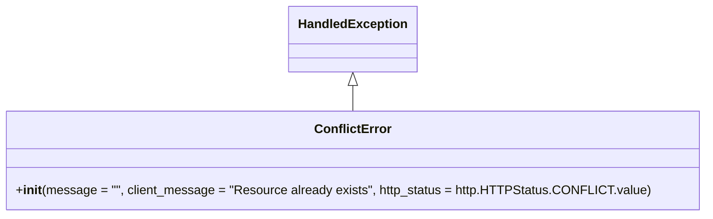

# Diagram: partview_core/partview_service/partview_service/exception/ConflictError.py

> Auto-generated by Obscura crawlers

## Mermaid

### SVG

<svg id="container" width="872.046875" xmlns="http://www.w3.org/2000/svg" class="classDiagram" height="276" viewBox="0 0 872.046875 276" role="graphics-document document" aria-roledescription="class"><g><defs><marker id="container_class-aggregationStart" class="marker aggregation class" refX="18" refY="7" markerWidth="190" markerHeight="240" orient="auto"><path d="M 18,7 L9,13 L1,7 L9,1 Z"></path></marker></defs><defs><marker id="container_class-aggregationEnd" class="marker aggregation class" refX="1" refY="7" markerWidth="20" markerHeight="28" orient="auto"><path d="M 18,7 L9,13 L1,7 L9,1 Z"></path></marker></defs><defs><marker id="container_class-extensionStart" class="marker extension class" refX="18" refY="7" markerWidth="190" markerHeight="240" orient="auto"><path d="M 1,7 L18,13 V 1 Z"></path></marker></defs><defs><marker id="container_class-extensionEnd" class="marker extension class" refX="1" refY="7" markerWidth="20" markerHeight="28" orient="auto"><path d="M 1,1 V 13 L18,7 Z"></path></marker></defs><defs><marker id="container_class-compositionStart" class="marker composition class" refX="18" refY="7" markerWidth="190" markerHeight="240" orient="auto"><path d="M 18,7 L9,13 L1,7 L9,1 Z"></path></marker></defs><defs><marker id="container_class-compositionEnd" class="marker composition class" refX="1" refY="7" markerWidth="20" markerHeight="28" orient="auto"><path d="M 18,7 L9,13 L1,7 L9,1 Z"></path></marker></defs><defs><marker id="container_class-dependencyStart" class="marker dependency class" refX="6" refY="7" markerWidth="190" markerHeight="240" orient="auto"><path d="M 5,7 L9,13 L1,7 L9,1 Z"></path></marker></defs><defs><marker id="container_class-dependencyEnd" class="marker dependency class" refX="13" refY="7" markerWidth="20" markerHeight="28" orient="auto"><path d="M 18,7 L9,13 L14,7 L9,1 Z"></path></marker></defs><defs><marker id="container_class-lollipopStart" class="marker lollipop class" refX="13" refY="7" markerWidth="190" markerHeight="240" orient="auto"><circle stroke="black" fill="transparent" cx="7" cy="7" r="6"></circle></marker></defs><defs><marker id="container_class-lollipopEnd" class="marker lollipop class" refX="1" refY="7" markerWidth="190" markerHeight="240" orient="auto"><circle stroke="black" fill="transparent" cx="7" cy="7" r="6"></circle></marker></defs><g class="root"><g class="clusters"></g><g class="edgePaths"><path d="M436.023,109.25L436.023,110.542C436.023,111.833,436.023,114.417,436.023,119.875C436.023,125.333,436.023,133.667,436.023,137.833L436.023,142" id="id_HandledException_ConflictError_1" class="edge-thickness-normal edge-pattern-solid relation" style=";;;" data-edge="true" data-et="edge" data-id="id_HandledException_ConflictError_1" data-points="W3sieCI6NDM2LjAyMzQzNzUsInkiOjkyfSx7IngiOjQzNi4wMjM0Mzc1LCJ5IjoxMTd9LHsieCI6NDM2LjAyMzQzNzUsInkiOjE0Mn1d" marker-start="url(#container_class-extensionStart)"></path></g><g class="edgeLabels"><g class="edgeLabel"><g class="label" data-id="id_HandledException_ConflictError_1" transform="translate(0, 0)"><foreignObject width="0" height="0">

</foreignObject></g></g></g><g class="nodes"><g class="node default" id="classId-HandledException-0" transform="translate(436.0234375, 50)"><g class="basic label-container"><path d="M-78.3828125 -42 L78.3828125 -42 L78.3828125 42 L-78.3828125 42" stroke="none" stroke-width="0" fill="#ECECFF" style=""></path><path d="M-78.3828125 -42 C-40.22563497253495 -42, -2.068457445069896 -42, 78.3828125 -42 M-78.3828125 -42 C-43.27843151427285 -42, -8.174050528545706 -42, 78.3828125 -42 M78.3828125 -42 C78.3828125 -12.02134121752933, 78.3828125 17.95731756494134, 78.3828125 42 M78.3828125 -42 C78.3828125 -18.621957394292355, 78.3828125 4.756085211415289, 78.3828125 42 M78.3828125 42 C37.147148204844584 42, -4.088516090310833 42, -78.3828125 42 M78.3828125 42 C31.25345366236059 42, -15.875905175278817 42, -78.3828125 42 M-78.3828125 42 C-78.3828125 11.97182997026157, -78.3828125 -18.05634005947686, -78.3828125 -42 M-78.3828125 42 C-78.3828125 14.550963865633367, -78.3828125 -12.898072268733266, -78.3828125 -42" stroke="#9370DB" stroke-width="1.3" fill="none" stroke-dasharray="0 0" style=""></path></g><g class="annotation-group text" transform="translate(0, -18)"></g><g class="label-group text" transform="translate(-66.3828125, -18)"><g class="label" style="font-weight: bolder" transform="translate(0,-12)"><foreignObject width="132.765625" height="24">

HandledException

</foreignObject></g></g><g class="members-group text" transform="translate(-66.3828125, 30)"></g><g class="methods-group text" transform="translate(-66.3828125, 60)"></g><g class="divider" style=""><path d="M-78.3828125 6 C-45.015696987455215 6, -11.64858147491043 6, 78.3828125 6 M-78.3828125 6 C-47.00676931845584 6, -15.630726136911683 6, 78.3828125 6" stroke="#9370DB" stroke-width="1.3" fill="none" stroke-dasharray="0 0" style=""></path></g><g class="divider" style=""><path d="M-78.3828125 24 C-42.58702141386852 24, -6.79123032773704 24, 78.3828125 24 M-78.3828125 24 C-25.31863211667372 24, 27.745548266652563 24, 78.3828125 24" stroke="#9370DB" stroke-width="1.3" fill="none" stroke-dasharray="0 0" style=""></path></g></g><g class="node default" id="classId-ConflictError-1" transform="translate(436.0234375, 205)"><g class="basic label-container"><path d="M-428.0234375 -63 L428.0234375 -63 L428.0234375 63 L-428.0234375 63" stroke="none" stroke-width="0" fill="#ECECFF" style=""></path><path d="M-428.0234375 -63 C-241.5134679056669 -63, -55.00349831133377 -63, 428.0234375 -63 M-428.0234375 -63 C-245.98340001877438 -63, -63.94336253754875 -63, 428.0234375 -63 M428.0234375 -63 C428.0234375 -31.650643272537064, 428.0234375 -0.30128654507412733, 428.0234375 63 M428.0234375 -63 C428.0234375 -31.695640628035484, 428.0234375 -0.3912812560709682, 428.0234375 63 M428.0234375 63 C164.78768035100438 63, -98.44807679799123 63, -428.0234375 63 M428.0234375 63 C223.7869313938168 63, 19.550425287633573 63, -428.0234375 63 M-428.0234375 63 C-428.0234375 26.580276830721346, -428.0234375 -9.839446338557309, -428.0234375 -63 M-428.0234375 63 C-428.0234375 22.7074270902322, -428.0234375 -17.585145819535597, -428.0234375 -63" stroke="#9370DB" stroke-width="1.3" fill="none" stroke-dasharray="0 0" style=""></path></g><g class="annotation-group text" transform="translate(0, -39)"></g><g class="label-group text" transform="translate(-46.140625, -39)"><g class="label" style="font-weight: bolder" transform="translate(0,-12)"><foreignObject width="92.28125" height="24">

ConflictError

</foreignObject></g></g><g class="members-group text" transform="translate(-416.0234375, 9)"></g><g class="methods-group text" transform="translate(-416.0234375, 39)"><g class="label" style="" transform="translate(0,-12)"><foreignObject width="785.90625" height="24">

+<strong>init</strong>(message = "", client_message = "Resource already exists", http_status = http.HTTPStatus.CONFLICT.value)

</foreignObject></g></g><g class="divider" style=""><path d="M-428.0234375 -15 C-233.96907870193849 -15, -39.91471990387697 -15, 428.0234375 -15 M-428.0234375 -15 C-104.09147724983234 -15, 219.84048300033533 -15, 428.0234375 -15" stroke="#9370DB" stroke-width="1.3" fill="none" stroke-dasharray="0 0" style=""></path></g><g class="divider" style=""><path d="M-428.0234375 9 C-143.0268334479523 9, 141.9697706040954 9, 428.0234375 9 M-428.0234375 9 C-87.26214340621982 9, 253.49915068756036 9, 428.0234375 9" stroke="#9370DB" stroke-width="1.3" fill="none" stroke-dasharray="0 0" style=""></path></g></g></g></g></g></svg>
