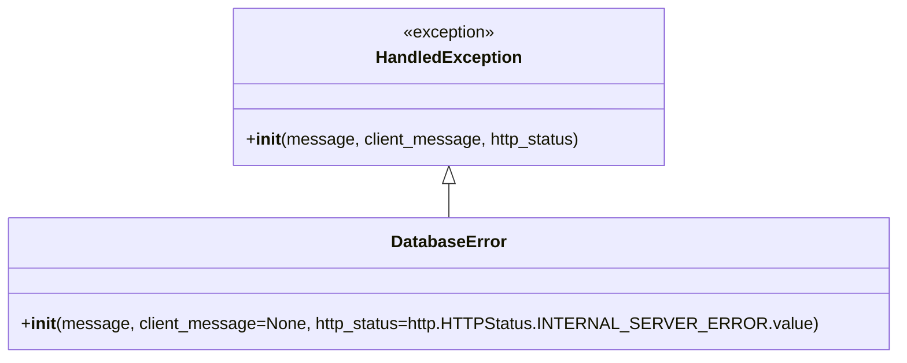

# Diagram: partview_core/partview_service/partview_service/exception/DatabaseError.py

> Auto-generated by Obscura crawlers

## Mermaid

### SVG

<svg id="container" width="813.140625" xmlns="http://www.w3.org/2000/svg" class="classDiagram" height="342" viewBox="0 0 813.140625 342" role="graphics-document document" aria-roledescription="class"><g><defs><marker id="container_class-aggregationStart" class="marker aggregation class" refX="18" refY="7" markerWidth="190" markerHeight="240" orient="auto"><path d="M 18,7 L9,13 L1,7 L9,1 Z"></path></marker></defs><defs><marker id="container_class-aggregationEnd" class="marker aggregation class" refX="1" refY="7" markerWidth="20" markerHeight="28" orient="auto"><path d="M 18,7 L9,13 L1,7 L9,1 Z"></path></marker></defs><defs><marker id="container_class-extensionStart" class="marker extension class" refX="18" refY="7" markerWidth="190" markerHeight="240" orient="auto"><path d="M 1,7 L18,13 V 1 Z"></path></marker></defs><defs><marker id="container_class-extensionEnd" class="marker extension class" refX="1" refY="7" markerWidth="20" markerHeight="28" orient="auto"><path d="M 1,1 V 13 L18,7 Z"></path></marker></defs><defs><marker id="container_class-compositionStart" class="marker composition class" refX="18" refY="7" markerWidth="190" markerHeight="240" orient="auto"><path d="M 18,7 L9,13 L1,7 L9,1 Z"></path></marker></defs><defs><marker id="container_class-compositionEnd" class="marker composition class" refX="1" refY="7" markerWidth="20" markerHeight="28" orient="auto"><path d="M 18,7 L9,13 L1,7 L9,1 Z"></path></marker></defs><defs><marker id="container_class-dependencyStart" class="marker dependency class" refX="6" refY="7" markerWidth="190" markerHeight="240" orient="auto"><path d="M 5,7 L9,13 L1,7 L9,1 Z"></path></marker></defs><defs><marker id="container_class-dependencyEnd" class="marker dependency class" refX="13" refY="7" markerWidth="20" markerHeight="28" orient="auto"><path d="M 18,7 L9,13 L14,7 L9,1 Z"></path></marker></defs><defs><marker id="container_class-lollipopStart" class="marker lollipop class" refX="13" refY="7" markerWidth="190" markerHeight="240" orient="auto"><circle stroke="black" fill="transparent" cx="7" cy="7" r="6"></circle></marker></defs><defs><marker id="container_class-lollipopEnd" class="marker lollipop class" refX="1" refY="7" markerWidth="190" markerHeight="240" orient="auto"><circle stroke="black" fill="transparent" cx="7" cy="7" r="6"></circle></marker></defs><g class="root"><g class="clusters"></g><g class="edgePaths"><path d="M406.57,175.25L406.57,176.542C406.57,177.833,406.57,180.417,406.57,185.875C406.57,191.333,406.57,199.667,406.57,203.833L406.57,208" id="id_HandledException_DatabaseError_1" class="edge-thickness-normal edge-pattern-solid relation" style=";;;" data-edge="true" data-et="edge" data-id="id_HandledException_DatabaseError_1" data-points="W3sieCI6NDA2LjU3MDMxMjUsInkiOjE1OH0seyJ4Ijo0MDYuNTcwMzEyNSwieSI6MTgzfSx7IngiOjQwNi41NzAzMTI1LCJ5IjoyMDh9XQ==" marker-start="url(#container_class-extensionStart)"></path></g><g class="edgeLabels"><g class="edgeLabel"><g class="label" data-id="id_HandledException_DatabaseError_1" transform="translate(0, 0)"><foreignObject width="0" height="0">

</foreignObject></g></g></g><g class="nodes"><g class="node default" id="classId-HandledException-0" transform="translate(406.5703125, 83)"><g class="basic label-container"><path d="M-202.83203125 -75 L202.83203125 -75 L202.83203125 75 L-202.83203125 75" stroke="none" stroke-width="0" fill="#ECECFF" style=""></path><path d="M-202.83203125 -75 C-117.66864385438197 -75, -32.50525645876394 -75, 202.83203125 -75 M-202.83203125 -75 C-67.05366570268046 -75, 68.72469984463908 -75, 202.83203125 -75 M202.83203125 -75 C202.83203125 -33.119056851176296, 202.83203125 8.761886297647408, 202.83203125 75 M202.83203125 -75 C202.83203125 -26.360716884295876, 202.83203125 22.27856623140825, 202.83203125 75 M202.83203125 75 C46.26967785780084 75, -110.29267553439831 75, -202.83203125 75 M202.83203125 75 C50.62643034089999 75, -101.57917056820003 75, -202.83203125 75 M-202.83203125 75 C-202.83203125 23.6405081504184, -202.83203125 -27.718983699163203, -202.83203125 -75 M-202.83203125 75 C-202.83203125 41.24762078904652, -202.83203125 7.495241578093044, -202.83203125 -75" stroke="#9370DB" stroke-width="1.3" fill="none" stroke-dasharray="0 0" style=""></path></g><g class="annotation-group text" transform="translate(-44.3515625, -51)"><g class="label" style="" transform="translate(0,-12)"><foreignObject width="88.703125" height="24">

«exception»

</foreignObject></g></g><g class="label-group text" transform="translate(-66.3828125, -27)"><g class="label" style="font-weight: bolder" transform="translate(0,-12)"><foreignObject width="132.765625" height="24">

HandledException

</foreignObject></g></g><g class="members-group text" transform="translate(-190.83203125, 21)"></g><g class="methods-group text" transform="translate(-190.83203125, 51)"><g class="label" style="" transform="translate(0,-12)"><foreignObject width="315.28125" height="24">

+<strong>init</strong>(message, client_message, http_status)

</foreignObject></g></g><g class="divider" style=""><path d="M-202.83203125 -3 C-57.55979899880805 -3, 87.7124332523839 -3, 202.83203125 -3 M-202.83203125 -3 C-52.617952445687905 -3, 97.59612635862419 -3, 202.83203125 -3" stroke="#9370DB" stroke-width="1.3" fill="none" stroke-dasharray="0 0" style=""></path></g><g class="divider" style=""><path d="M-202.83203125 21 C-50.3523500005835 21, 102.127331248833 21, 202.83203125 21 M-202.83203125 21 C-120.35048301300775 21, -37.86893477601549 21, 202.83203125 21" stroke="#9370DB" stroke-width="1.3" fill="none" stroke-dasharray="0 0" style=""></path></g></g><g class="node default" id="classId-DatabaseError-1" transform="translate(406.5703125, 271)"><g class="basic label-container"><path d="M-398.5703125 -63 L398.5703125 -63 L398.5703125 63 L-398.5703125 63" stroke="none" stroke-width="0" fill="#ECECFF" style=""></path><path d="M-398.5703125 -63 C-159.81352032428717 -63, 78.94327185142566 -63, 398.5703125 -63 M-398.5703125 -63 C-228.99922776665855 -63, -59.4281430333171 -63, 398.5703125 -63 M398.5703125 -63 C398.5703125 -33.51823338989831, 398.5703125 -4.036466779796626, 398.5703125 63 M398.5703125 -63 C398.5703125 -14.034969159361665, 398.5703125 34.93006168127667, 398.5703125 63 M398.5703125 63 C224.00963263964522 63, 49.44895277929044 63, -398.5703125 63 M398.5703125 63 C202.96379064832493 63, 7.357268796649862 63, -398.5703125 63 M-398.5703125 63 C-398.5703125 12.752750375520264, -398.5703125 -37.49449924895947, -398.5703125 -63 M-398.5703125 63 C-398.5703125 22.282380395505648, -398.5703125 -18.435239208988705, -398.5703125 -63" stroke="#9370DB" stroke-width="1.3" fill="none" stroke-dasharray="0 0" style=""></path></g><g class="annotation-group text" transform="translate(0, -39)"></g><g class="label-group text" transform="translate(-52.359375, -39)"><g class="label" style="font-weight: bolder" transform="translate(0,-12)"><foreignObject width="104.71875" height="24">

DatabaseError

</foreignObject></g></g><g class="members-group text" transform="translate(-386.5703125, 9)"></g><g class="methods-group text" transform="translate(-386.5703125, 39)"><g class="label" style="" transform="translate(0,-12)"><foreignObject width="720.78125" height="24">

+<strong>init</strong>(message, client_message=None, http_status=http.HTTPStatus.INTERNAL_SERVER_ERROR.value)

</foreignObject></g></g><g class="divider" style=""><path d="M-398.5703125 -15 C-147.29246067861456 -15, 103.98539114277088 -15, 398.5703125 -15 M-398.5703125 -15 C-207.1465268901256 -15, -15.722741280251228 -15, 398.5703125 -15" stroke="#9370DB" stroke-width="1.3" fill="none" stroke-dasharray="0 0" style=""></path></g><g class="divider" style=""><path d="M-398.5703125 9 C-127.54399054827462 9, 143.48233140345076 9, 398.5703125 9 M-398.5703125 9 C-120.24392496294638 9, 158.08246257410724 9, 398.5703125 9" stroke="#9370DB" stroke-width="1.3" fill="none" stroke-dasharray="0 0" style=""></path></g></g></g></g></g></svg>
