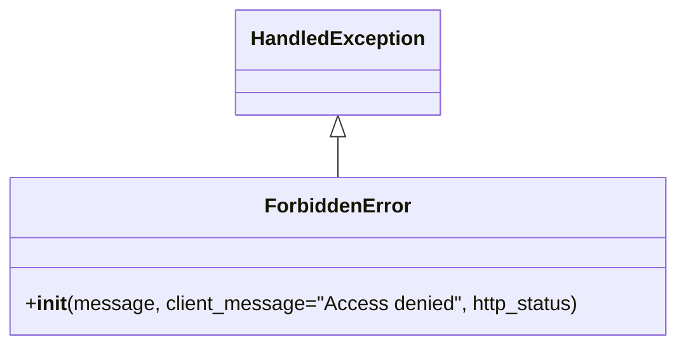

# Diagram: partview_core/partview_service/partview_service/exception/ForbiddenError.py

> Auto-generated by Obscura crawlers

## Mermaid

### SVG

<svg id="container" width="531.5078125" xmlns="http://www.w3.org/2000/svg" class="classDiagram" height="276" viewBox="0 0 531.5078125 276" role="graphics-document document" aria-roledescription="class"><g><defs><marker id="container_class-aggregationStart" class="marker aggregation class" refX="18" refY="7" markerWidth="190" markerHeight="240" orient="auto"><path d="M 18,7 L9,13 L1,7 L9,1 Z"></path></marker></defs><defs><marker id="container_class-aggregationEnd" class="marker aggregation class" refX="1" refY="7" markerWidth="20" markerHeight="28" orient="auto"><path d="M 18,7 L9,13 L1,7 L9,1 Z"></path></marker></defs><defs><marker id="container_class-extensionStart" class="marker extension class" refX="18" refY="7" markerWidth="190" markerHeight="240" orient="auto"><path d="M 1,7 L18,13 V 1 Z"></path></marker></defs><defs><marker id="container_class-extensionEnd" class="marker extension class" refX="1" refY="7" markerWidth="20" markerHeight="28" orient="auto"><path d="M 1,1 V 13 L18,7 Z"></path></marker></defs><defs><marker id="container_class-compositionStart" class="marker composition class" refX="18" refY="7" markerWidth="190" markerHeight="240" orient="auto"><path d="M 18,7 L9,13 L1,7 L9,1 Z"></path></marker></defs><defs><marker id="container_class-compositionEnd" class="marker composition class" refX="1" refY="7" markerWidth="20" markerHeight="28" orient="auto"><path d="M 18,7 L9,13 L1,7 L9,1 Z"></path></marker></defs><defs><marker id="container_class-dependencyStart" class="marker dependency class" refX="6" refY="7" markerWidth="190" markerHeight="240" orient="auto"><path d="M 5,7 L9,13 L1,7 L9,1 Z"></path></marker></defs><defs><marker id="container_class-dependencyEnd" class="marker dependency class" refX="13" refY="7" markerWidth="20" markerHeight="28" orient="auto"><path d="M 18,7 L9,13 L14,7 L9,1 Z"></path></marker></defs><defs><marker id="container_class-lollipopStart" class="marker lollipop class" refX="13" refY="7" markerWidth="190" markerHeight="240" orient="auto"><circle stroke="black" fill="transparent" cx="7" cy="7" r="6"></circle></marker></defs><defs><marker id="container_class-lollipopEnd" class="marker lollipop class" refX="1" refY="7" markerWidth="190" markerHeight="240" orient="auto"><circle stroke="black" fill="transparent" cx="7" cy="7" r="6"></circle></marker></defs><g class="root"><g class="clusters"></g><g class="edgePaths"><path d="M265.754,109.25L265.754,110.542C265.754,111.833,265.754,114.417,265.754,119.875C265.754,125.333,265.754,133.667,265.754,137.833L265.754,142" id="id_HandledException_ForbiddenError_1" class="edge-thickness-normal edge-pattern-solid relation" style=";;;" data-edge="true" data-et="edge" data-id="id_HandledException_ForbiddenError_1" data-points="W3sieCI6MjY1Ljc1MzkwNjI1LCJ5Ijo5Mn0seyJ4IjoyNjUuNzUzOTA2MjUsInkiOjExN30seyJ4IjoyNjUuNzUzOTA2MjUsInkiOjE0Mn1d" marker-start="url(#container_class-extensionStart)"></path></g><g class="edgeLabels"><g class="edgeLabel"><g class="label" data-id="id_HandledException_ForbiddenError_1" transform="translate(0, 0)"><foreignObject width="0" height="0">

</foreignObject></g></g></g><g class="nodes"><g class="node default" id="classId-HandledException-0" transform="translate(265.75390625, 50)"><g class="basic label-container"><path d="M-78.3828125 -42 L78.3828125 -42 L78.3828125 42 L-78.3828125 42" stroke="none" stroke-width="0" fill="#ECECFF" style=""></path><path d="M-78.3828125 -42 C-33.47198946754125 -42, 11.438833564917502 -42, 78.3828125 -42 M-78.3828125 -42 C-28.155094988075128 -42, 22.072622523849745 -42, 78.3828125 -42 M78.3828125 -42 C78.3828125 -14.466903842232114, 78.3828125 13.066192315535773, 78.3828125 42 M78.3828125 -42 C78.3828125 -15.396530418930013, 78.3828125 11.206939162139975, 78.3828125 42 M78.3828125 42 C19.10179081499753 42, -40.17923087000494 42, -78.3828125 42 M78.3828125 42 C38.37282572547628 42, -1.6371610490474353 42, -78.3828125 42 M-78.3828125 42 C-78.3828125 10.91526697352029, -78.3828125 -20.16946605295942, -78.3828125 -42 M-78.3828125 42 C-78.3828125 8.485915332006648, -78.3828125 -25.028169335986703, -78.3828125 -42" stroke="#9370DB" stroke-width="1.3" fill="none" stroke-dasharray="0 0" style=""></path></g><g class="annotation-group text" transform="translate(0, -18)"></g><g class="label-group text" transform="translate(-66.3828125, -18)"><g class="label" style="font-weight: bolder" transform="translate(0,-12)"><foreignObject width="132.765625" height="24">

HandledException

</foreignObject></g></g><g class="members-group text" transform="translate(-66.3828125, 30)"></g><g class="methods-group text" transform="translate(-66.3828125, 60)"></g><g class="divider" style=""><path d="M-78.3828125 6 C-22.081673609675356 6, 34.21946528064929 6, 78.3828125 6 M-78.3828125 6 C-17.086706091528043 6, 44.20940031694391 6, 78.3828125 6" stroke="#9370DB" stroke-width="1.3" fill="none" stroke-dasharray="0 0" style=""></path></g><g class="divider" style=""><path d="M-78.3828125 24 C-42.17035351388968 24, -5.957894527779359 24, 78.3828125 24 M-78.3828125 24 C-33.013482304908656 24, 12.355847890182687 24, 78.3828125 24" stroke="#9370DB" stroke-width="1.3" fill="none" stroke-dasharray="0 0" style=""></path></g></g><g class="node default" id="classId-ForbiddenError-1" transform="translate(265.75390625, 205)"><g class="basic label-container"><path d="M-257.75390625 -63 L257.75390625 -63 L257.75390625 63 L-257.75390625 63" stroke="none" stroke-width="0" fill="#ECECFF" style=""></path><path d="M-257.75390625 -63 C-117.58774233964584 -63, 22.578421570708315 -63, 257.75390625 -63 M-257.75390625 -63 C-105.30943656627107 -63, 47.13503311745785 -63, 257.75390625 -63 M257.75390625 -63 C257.75390625 -35.79555884079723, 257.75390625 -8.591117681594461, 257.75390625 63 M257.75390625 -63 C257.75390625 -30.493597447851194, 257.75390625 2.0128051042976125, 257.75390625 63 M257.75390625 63 C87.88681360952631 63, -81.98027903094737 63, -257.75390625 63 M257.75390625 63 C147.40730149957818 63, 37.06069674915639 63, -257.75390625 63 M-257.75390625 63 C-257.75390625 22.87137301540926, -257.75390625 -17.257253969181477, -257.75390625 -63 M-257.75390625 63 C-257.75390625 36.82989131994846, -257.75390625 10.659782639896918, -257.75390625 -63" stroke="#9370DB" stroke-width="1.3" fill="none" stroke-dasharray="0 0" style=""></path></g><g class="annotation-group text" transform="translate(0, -39)"></g><g class="label-group text" transform="translate(-55.3515625, -39)"><g class="label" style="font-weight: bolder" transform="translate(0,-12)"><foreignObject width="110.703125" height="24">

ForbiddenError

</foreignObject></g></g><g class="members-group text" transform="translate(-245.75390625, 9)"></g><g class="methods-group text" transform="translate(-245.75390625, 39)"><g class="label" style="" transform="translate(0,-12)"><foreignObject width="436.15625" height="24">

+<strong>init</strong>(message, client_message="Access denied", http_status)

</foreignObject></g></g><g class="divider" style=""><path d="M-257.75390625 -15 C-58.133426402113116 -15, 141.48705344577377 -15, 257.75390625 -15 M-257.75390625 -15 C-109.66945031711111 -15, 38.41500561577777 -15, 257.75390625 -15" stroke="#9370DB" stroke-width="1.3" fill="none" stroke-dasharray="0 0" style=""></path></g><g class="divider" style=""><path d="M-257.75390625 9 C-62.0629903284032 9, 133.6279255931936 9, 257.75390625 9 M-257.75390625 9 C-113.22684969724273 9, 31.300206855514546 9, 257.75390625 9" stroke="#9370DB" stroke-width="1.3" fill="none" stroke-dasharray="0 0" style=""></path></g></g></g></g></g></svg>
