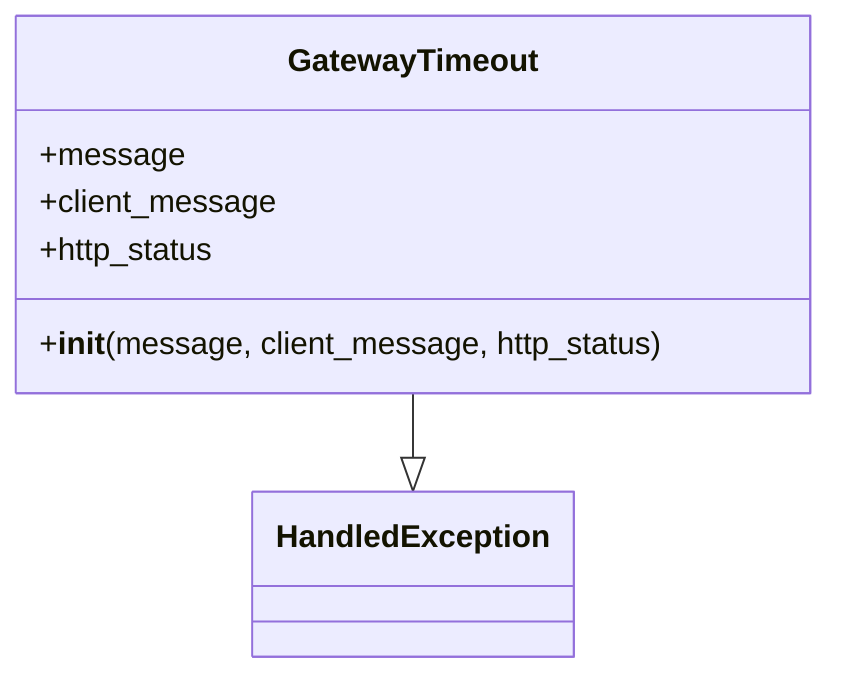

# Diagram: partview_core/partview_service/partview_service/exception/GatewayTimeout.py

> Auto-generated by Obscura crawlers

## Mermaid

### SVG

<svg id="container" width="416.5625" xmlns="http://www.w3.org/2000/svg" class="classDiagram" height="342" viewBox="0 0 416.5625 342" role="graphics-document document" aria-roledescription="class"><g><defs><marker id="container_class-aggregationStart" class="marker aggregation class" refX="18" refY="7" markerWidth="190" markerHeight="240" orient="auto"><path d="M 18,7 L9,13 L1,7 L9,1 Z"></path></marker></defs><defs><marker id="container_class-aggregationEnd" class="marker aggregation class" refX="1" refY="7" markerWidth="20" markerHeight="28" orient="auto"><path d="M 18,7 L9,13 L1,7 L9,1 Z"></path></marker></defs><defs><marker id="container_class-extensionStart" class="marker extension class" refX="18" refY="7" markerWidth="190" markerHeight="240" orient="auto"><path d="M 1,7 L18,13 V 1 Z"></path></marker></defs><defs><marker id="container_class-extensionEnd" class="marker extension class" refX="1" refY="7" markerWidth="20" markerHeight="28" orient="auto"><path d="M 1,1 V 13 L18,7 Z"></path></marker></defs><defs><marker id="container_class-compositionStart" class="marker composition class" refX="18" refY="7" markerWidth="190" markerHeight="240" orient="auto"><path d="M 18,7 L9,13 L1,7 L9,1 Z"></path></marker></defs><defs><marker id="container_class-compositionEnd" class="marker composition class" refX="1" refY="7" markerWidth="20" markerHeight="28" orient="auto"><path d="M 18,7 L9,13 L1,7 L9,1 Z"></path></marker></defs><defs><marker id="container_class-dependencyStart" class="marker dependency class" refX="6" refY="7" markerWidth="190" markerHeight="240" orient="auto"><path d="M 5,7 L9,13 L1,7 L9,1 Z"></path></marker></defs><defs><marker id="container_class-dependencyEnd" class="marker dependency class" refX="13" refY="7" markerWidth="20" markerHeight="28" orient="auto"><path d="M 18,7 L9,13 L14,7 L9,1 Z"></path></marker></defs><defs><marker id="container_class-lollipopStart" class="marker lollipop class" refX="13" refY="7" markerWidth="190" markerHeight="240" orient="auto"><circle stroke="black" fill="transparent" cx="7" cy="7" r="6"></circle></marker></defs><defs><marker id="container_class-lollipopEnd" class="marker lollipop class" refX="1" refY="7" markerWidth="190" markerHeight="240" orient="auto"><circle stroke="black" fill="transparent" cx="7" cy="7" r="6"></circle></marker></defs><g class="root"><g class="clusters"></g><g class="edgePaths"><path d="M208.281,200L208.281,204.167C208.281,208.333,208.281,216.667,208.281,222.125C208.281,227.583,208.281,230.167,208.281,231.458L208.281,232.75" id="id_GatewayTimeout_HandledException_1" class="edge-thickness-normal edge-pattern-solid relation" style=";;;" data-edge="true" data-et="edge" data-id="id_GatewayTimeout_HandledException_1" data-points="W3sieCI6MjA4LjI4MTI1LCJ5IjoyMDB9LHsieCI6MjA4LjI4MTI1LCJ5IjoyMjV9LHsieCI6MjA4LjI4MTI1LCJ5IjoyNTB9XQ==" marker-end="url(#container_class-extensionEnd)"></path></g><g class="edgeLabels"><g class="edgeLabel"><g class="label" data-id="id_GatewayTimeout_HandledException_1" transform="translate(0, 0)"><foreignObject width="0" height="0">

</foreignObject></g></g></g><g class="nodes"><g class="node default" id="classId-HandledException-0" transform="translate(208.28125, 292)"><g class="basic label-container"><path d="M-78.3828125 -42 L78.3828125 -42 L78.3828125 42 L-78.3828125 42" stroke="none" stroke-width="0" fill="#ECECFF" style=""></path><path d="M-78.3828125 -42 C-33.82444858313537 -42, 10.733915333729257 -42, 78.3828125 -42 M-78.3828125 -42 C-17.238919469988012 -42, 43.904973560023976 -42, 78.3828125 -42 M78.3828125 -42 C78.3828125 -22.909568492729008, 78.3828125 -3.819136985458016, 78.3828125 42 M78.3828125 -42 C78.3828125 -23.210000846449102, 78.3828125 -4.420001692898204, 78.3828125 42 M78.3828125 42 C16.062596208612668 42, -46.257620082774665 42, -78.3828125 42 M78.3828125 42 C27.508096459174013 42, -23.366619581651975 42, -78.3828125 42 M-78.3828125 42 C-78.3828125 21.792473471135608, -78.3828125 1.5849469422712161, -78.3828125 -42 M-78.3828125 42 C-78.3828125 20.434337333825223, -78.3828125 -1.1313253323495545, -78.3828125 -42" stroke="#9370DB" stroke-width="1.3" fill="none" stroke-dasharray="0 0" style=""></path></g><g class="annotation-group text" transform="translate(0, -18)"></g><g class="label-group text" transform="translate(-66.3828125, -18)"><g class="label" style="font-weight: bolder" transform="translate(0,-12)"><foreignObject width="132.765625" height="24">

HandledException

</foreignObject></g></g><g class="members-group text" transform="translate(-66.3828125, 30)"></g><g class="methods-group text" transform="translate(-66.3828125, 60)"></g><g class="divider" style=""><path d="M-78.3828125 6 C-19.761996516034515 6, 38.85881946793097 6, 78.3828125 6 M-78.3828125 6 C-21.843126209013718 6, 34.696560081972564 6, 78.3828125 6" stroke="#9370DB" stroke-width="1.3" fill="none" stroke-dasharray="0 0" style=""></path></g><g class="divider" style=""><path d="M-78.3828125 24 C-33.9232707824705 24, 10.536270935058994 24, 78.3828125 24 M-78.3828125 24 C-21.624970159168555 24, 35.13287218166289 24, 78.3828125 24" stroke="#9370DB" stroke-width="1.3" fill="none" stroke-dasharray="0 0" style=""></path></g></g><g class="node default" id="classId-GatewayTimeout-1" transform="translate(208.28125, 104)"><g class="basic label-container"><path d="M-200.28125 -96 L200.28125 -96 L200.28125 96 L-200.28125 96" stroke="none" stroke-width="0" fill="#ECECFF" style=""></path><path d="M-200.28125 -96 C-100.78016404379258 -96, -1.2790780875851624 -96, 200.28125 -96 M-200.28125 -96 C-96.23691309551356 -96, 7.807423808972885 -96, 200.28125 -96 M200.28125 -96 C200.28125 -49.18334873039805, 200.28125 -2.3666974607961038, 200.28125 96 M200.28125 -96 C200.28125 -51.00951132113142, 200.28125 -6.01902264226284, 200.28125 96 M200.28125 96 C74.00301729589098 96, -52.27521540821803 96, -200.28125 96 M200.28125 96 C70.20728100297865 96, -59.86668799404271 96, -200.28125 96 M-200.28125 96 C-200.28125 52.795890854590226, -200.28125 9.591781709180452, -200.28125 -96 M-200.28125 96 C-200.28125 48.15416964218268, -200.28125 0.30833928436535984, -200.28125 -96" stroke="#9370DB" stroke-width="1.3" fill="none" stroke-dasharray="0 0" style=""></path></g><g class="annotation-group text" transform="translate(0, -72)"></g><g class="label-group text" transform="translate(-61.28125, -72)"><g class="label" style="font-weight: bolder" transform="translate(0,-12)"><foreignObject width="122.5625" height="24">

GatewayTimeout

</foreignObject></g></g><g class="members-group text" transform="translate(-188.28125, -24)"><g class="label" style="" transform="translate(0,-12)"><foreignObject width="70.375" height="24">

+message

</foreignObject></g><g class="label" style="" transform="translate(0,12)"><foreignObject width="119.421875" height="24">

+client_message

</foreignObject></g><g class="label" style="" transform="translate(0,36)"><foreignObject width="90.828125" height="24">

+http_status

</foreignObject></g></g><g class="methods-group text" transform="translate(-188.28125, 72)"><g class="label" style="" transform="translate(0,-12)"><foreignObject width="315.28125" height="24">

+<strong>init</strong>(message, client_message, http_status)

</foreignObject></g></g><g class="divider" style=""><path d="M-200.28125 -48 C-43.61239079902455 -48, 113.0564684019509 -48, 200.28125 -48 M-200.28125 -48 C-114.61069839499228 -48, -28.940146789984567 -48, 200.28125 -48" stroke="#9370DB" stroke-width="1.3" fill="none" stroke-dasharray="0 0" style=""></path></g><g class="divider" style=""><path d="M-200.28125 48 C-68.25057262256107 48, 63.78010475487787 48, 200.28125 48 M-200.28125 48 C-106.46795997663087 48, -12.654669953261731 48, 200.28125 48" stroke="#9370DB" stroke-width="1.3" fill="none" stroke-dasharray="0 0" style=""></path></g></g></g></g></g></svg>
