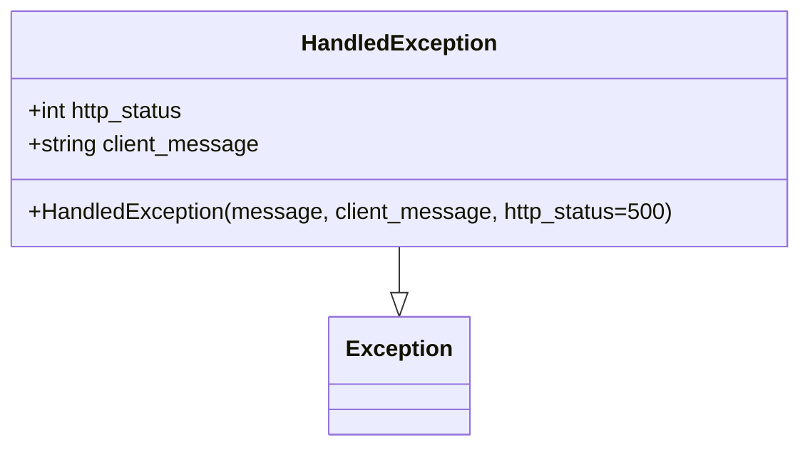

# Diagram: partview_core/partview_service/partview_service/exception/HandledException.py

> Auto-generated by Obscura crawlers

## Mermaid

### SVG

<svg id="container" width="563.2578125" xmlns="http://www.w3.org/2000/svg" class="classDiagram" height="318" viewBox="0 0 563.2578125 318" role="graphics-document document" aria-roledescription="class"><g><defs><marker id="container_class-aggregationStart" class="marker aggregation class" refX="18" refY="7" markerWidth="190" markerHeight="240" orient="auto"><path d="M 18,7 L9,13 L1,7 L9,1 Z"></path></marker></defs><defs><marker id="container_class-aggregationEnd" class="marker aggregation class" refX="1" refY="7" markerWidth="20" markerHeight="28" orient="auto"><path d="M 18,7 L9,13 L1,7 L9,1 Z"></path></marker></defs><defs><marker id="container_class-extensionStart" class="marker extension class" refX="18" refY="7" markerWidth="190" markerHeight="240" orient="auto"><path d="M 1,7 L18,13 V 1 Z"></path></marker></defs><defs><marker id="container_class-extensionEnd" class="marker extension class" refX="1" refY="7" markerWidth="20" markerHeight="28" orient="auto"><path d="M 1,1 V 13 L18,7 Z"></path></marker></defs><defs><marker id="container_class-compositionStart" class="marker composition class" refX="18" refY="7" markerWidth="190" markerHeight="240" orient="auto"><path d="M 18,7 L9,13 L1,7 L9,1 Z"></path></marker></defs><defs><marker id="container_class-compositionEnd" class="marker composition class" refX="1" refY="7" markerWidth="20" markerHeight="28" orient="auto"><path d="M 18,7 L9,13 L1,7 L9,1 Z"></path></marker></defs><defs><marker id="container_class-dependencyStart" class="marker dependency class" refX="6" refY="7" markerWidth="190" markerHeight="240" orient="auto"><path d="M 5,7 L9,13 L1,7 L9,1 Z"></path></marker></defs><defs><marker id="container_class-dependencyEnd" class="marker dependency class" refX="13" refY="7" markerWidth="20" markerHeight="28" orient="auto"><path d="M 18,7 L9,13 L14,7 L9,1 Z"></path></marker></defs><defs><marker id="container_class-lollipopStart" class="marker lollipop class" refX="13" refY="7" markerWidth="190" markerHeight="240" orient="auto"><circle stroke="black" fill="transparent" cx="7" cy="7" r="6"></circle></marker></defs><defs><marker id="container_class-lollipopEnd" class="marker lollipop class" refX="1" refY="7" markerWidth="190" markerHeight="240" orient="auto"><circle stroke="black" fill="transparent" cx="7" cy="7" r="6"></circle></marker></defs><g class="root"><g class="clusters"></g><g class="edgePaths"><path d="M281.629,176L281.629,180.167C281.629,184.333,281.629,192.667,281.629,198.125C281.629,203.583,281.629,206.167,281.629,207.458L281.629,208.75" id="id_HandledException_Exception_1" class="edge-thickness-normal edge-pattern-solid relation" style=";;;" data-edge="true" data-et="edge" data-id="id_HandledException_Exception_1" data-points="W3sieCI6MjgxLjYyODkwNjI1LCJ5IjoxNzZ9LHsieCI6MjgxLjYyODkwNjI1LCJ5IjoyMDF9LHsieCI6MjgxLjYyODkwNjI1LCJ5IjoyMjZ9XQ==" marker-end="url(#container_class-extensionEnd)"></path></g><g class="edgeLabels"><g class="edgeLabel"><g class="label" data-id="id_HandledException_Exception_1" transform="translate(0, 0)"><foreignObject width="0" height="0">

</foreignObject></g></g></g><g class="nodes"><g class="node default" id="classId-HandledException-0" transform="translate(281.62890625, 92)"><g class="basic label-container"><path d="M-273.62890625 -84 L273.62890625 -84 L273.62890625 84 L-273.62890625 84" stroke="none" stroke-width="0" fill="#ECECFF" style=""></path><path d="M-273.62890625 -84 C-60.57629671328036 -84, 152.4763128234393 -84, 273.62890625 -84 M-273.62890625 -84 C-106.84806722434715 -84, 59.932771801305705 -84, 273.62890625 -84 M273.62890625 -84 C273.62890625 -28.826861538202166, 273.62890625 26.346276923595667, 273.62890625 84 M273.62890625 -84 C273.62890625 -45.77575718566706, 273.62890625 -7.551514371334122, 273.62890625 84 M273.62890625 84 C136.22824094991057 84, -1.1724243501788578 84, -273.62890625 84 M273.62890625 84 C123.62450742882709 84, -26.379891392345826 84, -273.62890625 84 M-273.62890625 84 C-273.62890625 20.445161507979527, -273.62890625 -43.109676984040945, -273.62890625 -84 M-273.62890625 84 C-273.62890625 21.646110471285404, -273.62890625 -40.70777905742919, -273.62890625 -84" stroke="#9370DB" stroke-width="1.3" fill="none" stroke-dasharray="0 0" style=""></path></g><g class="annotation-group text" transform="translate(0, -60)"></g><g class="label-group text" transform="translate(-66.3828125, -60)"><g class="label" style="font-weight: bolder" transform="translate(0,-12)"><foreignObject width="132.765625" height="24">

HandledException

</foreignObject></g></g><g class="members-group text" transform="translate(-261.62890625, -12)"><g class="label" style="" transform="translate(0,-12)"><foreignObject width="114.734375" height="24">

+int http_status

</foreignObject></g><g class="label" style="" transform="translate(0,12)"><foreignObject width="165.28125" height="24">

+string client_message

</foreignObject></g></g><g class="methods-group text" transform="translate(-261.62890625, 60)"><g class="label" style="" transform="translate(0,-12)"><foreignObject width="456.875" height="24">

+HandledException(message, client_message, http_status=500)

</foreignObject></g></g><g class="divider" style=""><path d="M-273.62890625 -36 C-122.34781646847719 -36, 28.933273313045618 -36, 273.62890625 -36 M-273.62890625 -36 C-63.80271206817133 -36, 146.02348211365734 -36, 273.62890625 -36" stroke="#9370DB" stroke-width="1.3" fill="none" stroke-dasharray="0 0" style=""></path></g><g class="divider" style=""><path d="M-273.62890625 36 C-131.0446653997601 36, 11.539575450479788 36, 273.62890625 36 M-273.62890625 36 C-96.60819730908176 36, 80.41251163183648 36, 273.62890625 36" stroke="#9370DB" stroke-width="1.3" fill="none" stroke-dasharray="0 0" style=""></path></g></g><g class="node default" id="classId-Exception-1" transform="translate(281.62890625, 268)"><g class="basic label-container"><path d="M-47.703125 -42 L47.703125 -42 L47.703125 42 L-47.703125 42" stroke="none" stroke-width="0" fill="#ECECFF" style=""></path><path d="M-47.703125 -42 C-22.334988447970968 -42, 3.033148104058064 -42, 47.703125 -42 M-47.703125 -42 C-15.3616576034808 -42, 16.9798097930384 -42, 47.703125 -42 M47.703125 -42 C47.703125 -24.450043539585373, 47.703125 -6.900087079170746, 47.703125 42 M47.703125 -42 C47.703125 -11.491789999727779, 47.703125 19.016420000544443, 47.703125 42 M47.703125 42 C13.122435991610892 42, -21.458253016778215 42, -47.703125 42 M47.703125 42 C26.123399650539515 42, 4.5436743010790295 42, -47.703125 42 M-47.703125 42 C-47.703125 14.2348437517701, -47.703125 -13.5303124964598, -47.703125 -42 M-47.703125 42 C-47.703125 9.860565227397899, -47.703125 -22.278869545204202, -47.703125 -42" stroke="#9370DB" stroke-width="1.3" fill="none" stroke-dasharray="0 0" style=""></path></g><g class="annotation-group text" transform="translate(0, -18)"></g><g class="label-group text" transform="translate(-35.703125, -18)"><g class="label" style="font-weight: bolder" transform="translate(0,-12)"><foreignObject width="71.40625" height="24">

Exception

</foreignObject></g></g><g class="members-group text" transform="translate(-35.703125, 30)"></g><g class="methods-group text" transform="translate(-35.703125, 60)"></g><g class="divider" style=""><path d="M-47.703125 6 C-27.190822000751115 6, -6.678519001502231 6, 47.703125 6 M-47.703125 6 C-13.42484823893318 6, 20.85342852213364 6, 47.703125 6" stroke="#9370DB" stroke-width="1.3" fill="none" stroke-dasharray="0 0" style=""></path></g><g class="divider" style=""><path d="M-47.703125 24 C-16.417285558018353 24, 14.868553883963294 24, 47.703125 24 M-47.703125 24 C-14.222607140710466 24, 19.25791071857907 24, 47.703125 24" stroke="#9370DB" stroke-width="1.3" fill="none" stroke-dasharray="0 0" style=""></path></g></g></g></g></g></svg>
