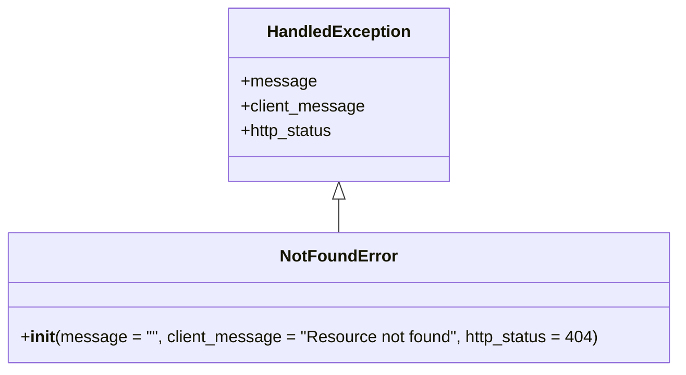

# Diagram: partview_core/partview_service/partview_service/exception/NotFoundError.py

> Auto-generated by Obscura crawlers

## Mermaid

### SVG

<svg id="container" width="648.671875" xmlns="http://www.w3.org/2000/svg" class="classDiagram" height="360" viewBox="0 0 648.671875 360" role="graphics-document document" aria-roledescription="class"><g><defs><marker id="container_class-aggregationStart" class="marker aggregation class" refX="18" refY="7" markerWidth="190" markerHeight="240" orient="auto"><path d="M 18,7 L9,13 L1,7 L9,1 Z"></path></marker></defs><defs><marker id="container_class-aggregationEnd" class="marker aggregation class" refX="1" refY="7" markerWidth="20" markerHeight="28" orient="auto"><path d="M 18,7 L9,13 L1,7 L9,1 Z"></path></marker></defs><defs><marker id="container_class-extensionStart" class="marker extension class" refX="18" refY="7" markerWidth="190" markerHeight="240" orient="auto"><path d="M 1,7 L18,13 V 1 Z"></path></marker></defs><defs><marker id="container_class-extensionEnd" class="marker extension class" refX="1" refY="7" markerWidth="20" markerHeight="28" orient="auto"><path d="M 1,1 V 13 L18,7 Z"></path></marker></defs><defs><marker id="container_class-compositionStart" class="marker composition class" refX="18" refY="7" markerWidth="190" markerHeight="240" orient="auto"><path d="M 18,7 L9,13 L1,7 L9,1 Z"></path></marker></defs><defs><marker id="container_class-compositionEnd" class="marker composition class" refX="1" refY="7" markerWidth="20" markerHeight="28" orient="auto"><path d="M 18,7 L9,13 L1,7 L9,1 Z"></path></marker></defs><defs><marker id="container_class-dependencyStart" class="marker dependency class" refX="6" refY="7" markerWidth="190" markerHeight="240" orient="auto"><path d="M 5,7 L9,13 L1,7 L9,1 Z"></path></marker></defs><defs><marker id="container_class-dependencyEnd" class="marker dependency class" refX="13" refY="7" markerWidth="20" markerHeight="28" orient="auto"><path d="M 18,7 L9,13 L14,7 L9,1 Z"></path></marker></defs><defs><marker id="container_class-lollipopStart" class="marker lollipop class" refX="13" refY="7" markerWidth="190" markerHeight="240" orient="auto"><circle stroke="black" fill="transparent" cx="7" cy="7" r="6"></circle></marker></defs><defs><marker id="container_class-lollipopEnd" class="marker lollipop class" refX="1" refY="7" markerWidth="190" markerHeight="240" orient="auto"><circle stroke="black" fill="transparent" cx="7" cy="7" r="6"></circle></marker></defs><g class="root"><g class="clusters"></g><g class="edgePaths"><path d="M324.336,193.25L324.336,194.542C324.336,195.833,324.336,198.417,324.336,203.875C324.336,209.333,324.336,217.667,324.336,221.833L324.336,226" id="id_HandledException_NotFoundError_1" class="edge-thickness-normal edge-pattern-solid relation" style=";;;" data-edge="true" data-et="edge" data-id="id_HandledException_NotFoundError_1" data-points="W3sieCI6MzI0LjMzNTkzNzUsInkiOjE3Nn0seyJ4IjozMjQuMzM1OTM3NSwieSI6MjAxfSx7IngiOjMyNC4zMzU5Mzc1LCJ5IjoyMjZ9XQ==" marker-start="url(#container_class-extensionStart)"></path></g><g class="edgeLabels"><g class="edgeLabel"><g class="label" data-id="id_HandledException_NotFoundError_1" transform="translate(0, 0)"><foreignObject width="0" height="0">

</foreignObject></g></g></g><g class="nodes"><g class="node default" id="classId-HandledException-0" transform="translate(324.3359375, 92)"><g class="basic label-container"><path d="M-104.90234375 -84 L104.90234375 -84 L104.90234375 84 L-104.90234375 84" stroke="none" stroke-width="0" fill="#ECECFF" style=""></path><path d="M-104.90234375 -84 C-43.75618327358088 -84, 17.38997720283824 -84, 104.90234375 -84 M-104.90234375 -84 C-25.259969946015673 -84, 54.382403857968654 -84, 104.90234375 -84 M104.90234375 -84 C104.90234375 -18.33090883426813, 104.90234375 47.33818233146374, 104.90234375 84 M104.90234375 -84 C104.90234375 -24.663458834056172, 104.90234375 34.673082331887656, 104.90234375 84 M104.90234375 84 C40.11453216067419 84, -24.673279428651625 84, -104.90234375 84 M104.90234375 84 C42.61817662997976 84, -19.665990490040485 84, -104.90234375 84 M-104.90234375 84 C-104.90234375 22.00930755347519, -104.90234375 -39.98138489304962, -104.90234375 -84 M-104.90234375 84 C-104.90234375 49.61212579790692, -104.90234375 15.22425159581384, -104.90234375 -84" stroke="#9370DB" stroke-width="1.3" fill="none" stroke-dasharray="0 0" style=""></path></g><g class="annotation-group text" transform="translate(0, -60)"></g><g class="label-group text" transform="translate(-66.3828125, -60)"><g class="label" style="font-weight: bolder" transform="translate(0,-12)"><foreignObject width="132.765625" height="24">

HandledException

</foreignObject></g></g><g class="members-group text" transform="translate(-92.90234375, -12)"><g class="label" style="" transform="translate(0,-12)"><foreignObject width="70.375" height="24">

+message

</foreignObject></g><g class="label" style="" transform="translate(0,12)"><foreignObject width="119.421875" height="24">

+client_message

</foreignObject></g><g class="label" style="" transform="translate(0,36)"><foreignObject width="90.828125" height="24">

+http_status

</foreignObject></g></g><g class="methods-group text" transform="translate(-92.90234375, 84)"></g><g class="divider" style=""><path d="M-104.90234375 -36 C-49.58117171857766 -36, 5.7400003128446855 -36, 104.90234375 -36 M-104.90234375 -36 C-35.086809395642106 -36, 34.72872495871579 -36, 104.90234375 -36" stroke="#9370DB" stroke-width="1.3" fill="none" stroke-dasharray="0 0" style=""></path></g><g class="divider" style=""><path d="M-104.90234375 60 C-59.494574843445726 60, -14.086805936891452 60, 104.90234375 60 M-104.90234375 60 C-56.53144815518876 60, -8.160552560377525 60, 104.90234375 60" stroke="#9370DB" stroke-width="1.3" fill="none" stroke-dasharray="0 0" style=""></path></g></g><g class="node default" id="classId-NotFoundError-1" transform="translate(324.3359375, 289)"><g class="basic label-container"><path d="M-316.3359375 -63 L316.3359375 -63 L316.3359375 63 L-316.3359375 63" stroke="none" stroke-width="0" fill="#ECECFF" style=""></path><path d="M-316.3359375 -63 C-127.93519066125211 -63, 60.465556177495785 -63, 316.3359375 -63 M-316.3359375 -63 C-148.9846987605599 -63, 18.366539978880212 -63, 316.3359375 -63 M316.3359375 -63 C316.3359375 -17.88477320449138, 316.3359375 27.230453591017238, 316.3359375 63 M316.3359375 -63 C316.3359375 -25.63644717150771, 316.3359375 11.727105656984577, 316.3359375 63 M316.3359375 63 C128.33639589108373 63, -59.66314571783255 63, -316.3359375 63 M316.3359375 63 C103.86986322752364 63, -108.59621104495272 63, -316.3359375 63 M-316.3359375 63 C-316.3359375 22.897549159985722, -316.3359375 -17.204901680028556, -316.3359375 -63 M-316.3359375 63 C-316.3359375 21.033713070086755, -316.3359375 -20.93257385982649, -316.3359375 -63" stroke="#9370DB" stroke-width="1.3" fill="none" stroke-dasharray="0 0" style=""></path></g><g class="annotation-group text" transform="translate(0, -39)"></g><g class="label-group text" transform="translate(-53.53125, -39)"><g class="label" style="font-weight: bolder" transform="translate(0,-12)"><foreignObject width="107.0625" height="24">

NotFoundError

</foreignObject></g></g><g class="members-group text" transform="translate(-304.3359375, 9)"></g><g class="methods-group text" transform="translate(-304.3359375, 39)"><g class="label" style="" transform="translate(0,-12)"><foreignObject width="555.140625" height="24">

+<strong>init</strong>(message = "", client_message = "Resource not found", http_status = 404)

</foreignObject></g></g><g class="divider" style=""><path d="M-316.3359375 -15 C-98.1436466494994 -15, 120.0486442010012 -15, 316.3359375 -15 M-316.3359375 -15 C-72.32993203161882 -15, 171.67607343676235 -15, 316.3359375 -15" stroke="#9370DB" stroke-width="1.3" fill="none" stroke-dasharray="0 0" style=""></path></g><g class="divider" style=""><path d="M-316.3359375 9 C-154.79705635543556 9, 6.741824789128884 9, 316.3359375 9 M-316.3359375 9 C-86.54562048340074 9, 143.24469653319852 9, 316.3359375 9" stroke="#9370DB" stroke-width="1.3" fill="none" stroke-dasharray="0 0" style=""></path></g></g></g></g></g></svg>
