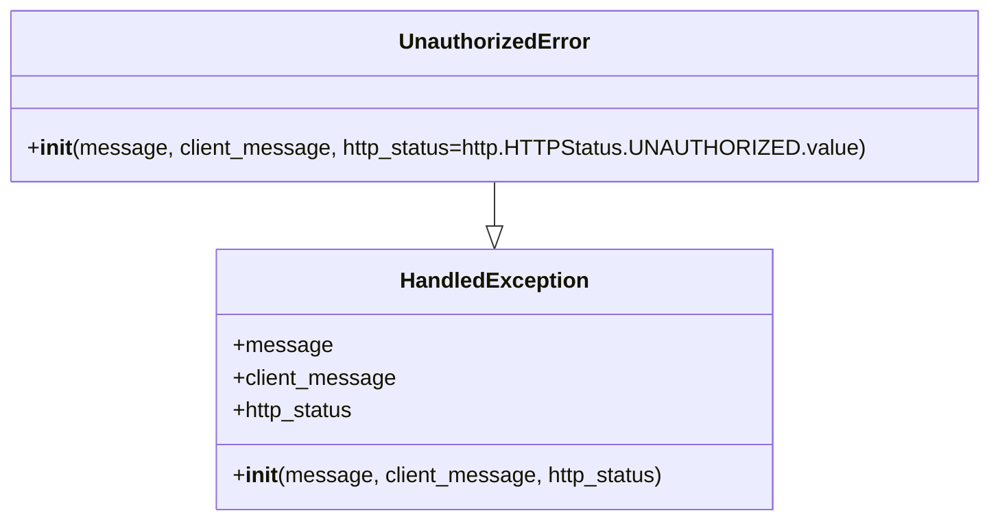

# Diagram: partview_core/partview_service/partview_service/exception/UnauthorizedError.py

> Auto-generated by Obscura crawlers

## Mermaid

### SVG

<svg id="container" width="705.46875" xmlns="http://www.w3.org/2000/svg" class="classDiagram" height="384" viewBox="0 0 705.46875 384" role="graphics-document document" aria-roledescription="class"><g><defs><marker id="container_class-aggregationStart" class="marker aggregation class" refX="18" refY="7" markerWidth="190" markerHeight="240" orient="auto"><path d="M 18,7 L9,13 L1,7 L9,1 Z"></path></marker></defs><defs><marker id="container_class-aggregationEnd" class="marker aggregation class" refX="1" refY="7" markerWidth="20" markerHeight="28" orient="auto"><path d="M 18,7 L9,13 L1,7 L9,1 Z"></path></marker></defs><defs><marker id="container_class-extensionStart" class="marker extension class" refX="18" refY="7" markerWidth="190" markerHeight="240" orient="auto"><path d="M 1,7 L18,13 V 1 Z"></path></marker></defs><defs><marker id="container_class-extensionEnd" class="marker extension class" refX="1" refY="7" markerWidth="20" markerHeight="28" orient="auto"><path d="M 1,1 V 13 L18,7 Z"></path></marker></defs><defs><marker id="container_class-compositionStart" class="marker composition class" refX="18" refY="7" markerWidth="190" markerHeight="240" orient="auto"><path d="M 18,7 L9,13 L1,7 L9,1 Z"></path></marker></defs><defs><marker id="container_class-compositionEnd" class="marker composition class" refX="1" refY="7" markerWidth="20" markerHeight="28" orient="auto"><path d="M 18,7 L9,13 L1,7 L9,1 Z"></path></marker></defs><defs><marker id="container_class-dependencyStart" class="marker dependency class" refX="6" refY="7" markerWidth="190" markerHeight="240" orient="auto"><path d="M 5,7 L9,13 L1,7 L9,1 Z"></path></marker></defs><defs><marker id="container_class-dependencyEnd" class="marker dependency class" refX="13" refY="7" markerWidth="20" markerHeight="28" orient="auto"><path d="M 18,7 L9,13 L14,7 L9,1 Z"></path></marker></defs><defs><marker id="container_class-lollipopStart" class="marker lollipop class" refX="13" refY="7" markerWidth="190" markerHeight="240" orient="auto"><circle stroke="black" fill="transparent" cx="7" cy="7" r="6"></circle></marker></defs><defs><marker id="container_class-lollipopEnd" class="marker lollipop class" refX="1" refY="7" markerWidth="190" markerHeight="240" orient="auto"><circle stroke="black" fill="transparent" cx="7" cy="7" r="6"></circle></marker></defs><g class="root"><g class="clusters"></g><g class="edgePaths"><path d="M352.734,134L352.734,138.167C352.734,142.333,352.734,150.667,352.734,156.125C352.734,161.583,352.734,164.167,352.734,165.458L352.734,166.75" id="id_UnauthorizedError_HandledException_1" class="edge-thickness-normal edge-pattern-solid relation" style=";;;" data-edge="true" data-et="edge" data-id="id_UnauthorizedError_HandledException_1" data-points="W3sieCI6MzUyLjczNDM3NSwieSI6MTM0fSx7IngiOjM1Mi43MzQzNzUsInkiOjE1OX0seyJ4IjozNTIuNzM0Mzc1LCJ5IjoxODR9XQ==" marker-end="url(#container_class-extensionEnd)"></path></g><g class="edgeLabels"><g class="edgeLabel"><g class="label" data-id="id_UnauthorizedError_HandledException_1" transform="translate(0, 0)"><foreignObject width="0" height="0">

</foreignObject></g></g></g><g class="nodes"><g class="node default" id="classId-HandledException-0" transform="translate(352.734375, 280)"><g class="basic label-container"><path d="M-202.83203125 -96 L202.83203125 -96 L202.83203125 96 L-202.83203125 96" stroke="none" stroke-width="0" fill="#ECECFF" style=""></path><path d="M-202.83203125 -96 C-102.76683122954061 -96, -2.701631209081228 -96, 202.83203125 -96 M-202.83203125 -96 C-111.13141070895828 -96, -19.43079016791657 -96, 202.83203125 -96 M202.83203125 -96 C202.83203125 -46.10348685380644, 202.83203125 3.7930262923871254, 202.83203125 96 M202.83203125 -96 C202.83203125 -21.057572531056508, 202.83203125 53.884854937886985, 202.83203125 96 M202.83203125 96 C76.30985250331187 96, -50.21232624337625 96, -202.83203125 96 M202.83203125 96 C88.87752961781595 96, -25.076972014368096 96, -202.83203125 96 M-202.83203125 96 C-202.83203125 21.976716878378426, -202.83203125 -52.04656624324315, -202.83203125 -96 M-202.83203125 96 C-202.83203125 52.751752968327985, -202.83203125 9.50350593665597, -202.83203125 -96" stroke="#9370DB" stroke-width="1.3" fill="none" stroke-dasharray="0 0" style=""></path></g><g class="annotation-group text" transform="translate(0, -72)"></g><g class="label-group text" transform="translate(-66.3828125, -72)"><g class="label" style="font-weight: bolder" transform="translate(0,-12)"><foreignObject width="132.765625" height="24">

HandledException

</foreignObject></g></g><g class="members-group text" transform="translate(-190.83203125, -24)"><g class="label" style="" transform="translate(0,-12)"><foreignObject width="70.375" height="24">

+message

</foreignObject></g><g class="label" style="" transform="translate(0,12)"><foreignObject width="119.421875" height="24">

+client_message

</foreignObject></g><g class="label" style="" transform="translate(0,36)"><foreignObject width="90.828125" height="24">

+http_status

</foreignObject></g></g><g class="methods-group text" transform="translate(-190.83203125, 72)"><g class="label" style="" transform="translate(0,-12)"><foreignObject width="315.28125" height="24">

+<strong>init</strong>(message, client_message, http_status)

</foreignObject></g></g><g class="divider" style=""><path d="M-202.83203125 -48 C-45.79412229955341 -48, 111.24378665089318 -48, 202.83203125 -48 M-202.83203125 -48 C-101.17069358858771 -48, 0.4906440728245798 -48, 202.83203125 -48" stroke="#9370DB" stroke-width="1.3" fill="none" stroke-dasharray="0 0" style=""></path></g><g class="divider" style=""><path d="M-202.83203125 48 C-57.18698853324875 48, 88.4580541835025 48, 202.83203125 48 M-202.83203125 48 C-94.74190295294984 48, 13.348225344100314 48, 202.83203125 48" stroke="#9370DB" stroke-width="1.3" fill="none" stroke-dasharray="0 0" style=""></path></g></g><g class="node default" id="classId-UnauthorizedError-1" transform="translate(352.734375, 71)"><g class="basic label-container"><path d="M-344.734375 -63 L344.734375 -63 L344.734375 63 L-344.734375 63" stroke="none" stroke-width="0" fill="#ECECFF" style=""></path><path d="M-344.734375 -63 C-150.76585400630833 -63, 43.20266698738334 -63, 344.734375 -63 M-344.734375 -63 C-157.73932692307955 -63, 29.25572115384091 -63, 344.734375 -63 M344.734375 -63 C344.734375 -15.35447296083759, 344.734375 32.29105407832482, 344.734375 63 M344.734375 -63 C344.734375 -25.51067332781075, 344.734375 11.9786533443785, 344.734375 63 M344.734375 63 C123.43547889734481 63, -97.86341720531038 63, -344.734375 63 M344.734375 63 C161.3931969928143 63, -21.947981014371408 63, -344.734375 63 M-344.734375 63 C-344.734375 37.314167308612085, -344.734375 11.628334617224162, -344.734375 -63 M-344.734375 63 C-344.734375 29.76447939675628, -344.734375 -3.471041206487442, -344.734375 -63" stroke="#9370DB" stroke-width="1.3" fill="none" stroke-dasharray="0 0" style=""></path></g><g class="annotation-group text" transform="translate(0, -39)"></g><g class="label-group text" transform="translate(-67.625, -39)"><g class="label" style="font-weight: bolder" transform="translate(0,-12)"><foreignObject width="135.25" height="24">

UnauthorizedError

</foreignObject></g></g><g class="members-group text" transform="translate(-332.734375, 9)"></g><g class="methods-group text" transform="translate(-332.734375, 39)"><g class="label" style="" transform="translate(0,-12)"><foreignObject width="597.84375" height="24">

+<strong>init</strong>(message, client_message, http_status=http.HTTPStatus.UNAUTHORIZED.value)

</foreignObject></g></g><g class="divider" style=""><path d="M-344.734375 -15 C-180.03907287315644 -15, -15.343770746312885 -15, 344.734375 -15 M-344.734375 -15 C-87.34076968423614 -15, 170.05283563152773 -15, 344.734375 -15" stroke="#9370DB" stroke-width="1.3" fill="none" stroke-dasharray="0 0" style=""></path></g><g class="divider" style=""><path d="M-344.734375 9 C-159.89188723808465 9, 24.9506005238307 9, 344.734375 9 M-344.734375 9 C-150.0067152506849 9, 44.72094449863022 9, 344.734375 9" stroke="#9370DB" stroke-width="1.3" fill="none" stroke-dasharray="0 0" style=""></path></g></g></g></g></g></svg>
