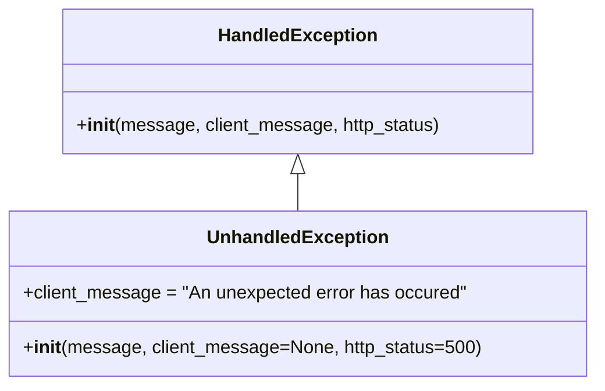

# Diagram: partview_core/partview_service/partview_service/exception/UnhandledException.py

> Auto-generated by Obscura crawlers

## Mermaid

### SVG

<svg id="container" width="511.0078125" xmlns="http://www.w3.org/2000/svg" class="classDiagram" height="336" viewBox="0 0 511.0078125 336" role="graphics-document document" aria-roledescription="class"><g><defs><marker id="container_class-aggregationStart" class="marker aggregation class" refX="18" refY="7" markerWidth="190" markerHeight="240" orient="auto"><path d="M 18,7 L9,13 L1,7 L9,1 Z"></path></marker></defs><defs><marker id="container_class-aggregationEnd" class="marker aggregation class" refX="1" refY="7" markerWidth="20" markerHeight="28" orient="auto"><path d="M 18,7 L9,13 L1,7 L9,1 Z"></path></marker></defs><defs><marker id="container_class-extensionStart" class="marker extension class" refX="18" refY="7" markerWidth="190" markerHeight="240" orient="auto"><path d="M 1,7 L18,13 V 1 Z"></path></marker></defs><defs><marker id="container_class-extensionEnd" class="marker extension class" refX="1" refY="7" markerWidth="20" markerHeight="28" orient="auto"><path d="M 1,1 V 13 L18,7 Z"></path></marker></defs><defs><marker id="container_class-compositionStart" class="marker composition class" refX="18" refY="7" markerWidth="190" markerHeight="240" orient="auto"><path d="M 18,7 L9,13 L1,7 L9,1 Z"></path></marker></defs><defs><marker id="container_class-compositionEnd" class="marker composition class" refX="1" refY="7" markerWidth="20" markerHeight="28" orient="auto"><path d="M 18,7 L9,13 L1,7 L9,1 Z"></path></marker></defs><defs><marker id="container_class-dependencyStart" class="marker dependency class" refX="6" refY="7" markerWidth="190" markerHeight="240" orient="auto"><path d="M 5,7 L9,13 L1,7 L9,1 Z"></path></marker></defs><defs><marker id="container_class-dependencyEnd" class="marker dependency class" refX="13" refY="7" markerWidth="20" markerHeight="28" orient="auto"><path d="M 18,7 L9,13 L14,7 L9,1 Z"></path></marker></defs><defs><marker id="container_class-lollipopStart" class="marker lollipop class" refX="13" refY="7" markerWidth="190" markerHeight="240" orient="auto"><circle stroke="black" fill="transparent" cx="7" cy="7" r="6"></circle></marker></defs><defs><marker id="container_class-lollipopEnd" class="marker lollipop class" refX="1" refY="7" markerWidth="190" markerHeight="240" orient="auto"><circle stroke="black" fill="transparent" cx="7" cy="7" r="6"></circle></marker></defs><g class="root"><g class="clusters"></g><g class="edgePaths"><path d="M255.504,151.25L255.504,152.542C255.504,153.833,255.504,156.417,255.504,161.875C255.504,167.333,255.504,175.667,255.504,179.833L255.504,184" id="id_HandledException_UnhandledException_1" class="edge-thickness-normal edge-pattern-solid relation" style=";;;" data-edge="true" data-et="edge" data-id="id_HandledException_UnhandledException_1" data-points="W3sieCI6MjU1LjUwMzkwNjI1LCJ5IjoxMzR9LHsieCI6MjU1LjUwMzkwNjI1LCJ5IjoxNTl9LHsieCI6MjU1LjUwMzkwNjI1LCJ5IjoxODR9XQ==" marker-start="url(#container_class-extensionStart)"></path></g><g class="edgeLabels"><g class="edgeLabel"><g class="label" data-id="id_HandledException_UnhandledException_1" transform="translate(0, 0)"><foreignObject width="0" height="0">

</foreignObject></g></g></g><g class="nodes"><g class="node default" id="classId-HandledException-0" transform="translate(255.50390625, 71)"><g class="basic label-container"><path d="M-202.83203125 -63 L202.83203125 -63 L202.83203125 63 L-202.83203125 63" stroke="none" stroke-width="0" fill="#ECECFF" style=""></path><path d="M-202.83203125 -63 C-51.385066798154554 -63, 100.06189765369089 -63, 202.83203125 -63 M-202.83203125 -63 C-112.8217966523281 -63, -22.811562054656207 -63, 202.83203125 -63 M202.83203125 -63 C202.83203125 -12.886032855789708, 202.83203125 37.227934288420585, 202.83203125 63 M202.83203125 -63 C202.83203125 -31.04198944051931, 202.83203125 0.9160211189613818, 202.83203125 63 M202.83203125 63 C107.0125677669494 63, 11.193104283898805 63, -202.83203125 63 M202.83203125 63 C42.248214848504205 63, -118.33560155299159 63, -202.83203125 63 M-202.83203125 63 C-202.83203125 35.08580473862925, -202.83203125 7.1716094772584995, -202.83203125 -63 M-202.83203125 63 C-202.83203125 37.25245120579224, -202.83203125 11.504902411584489, -202.83203125 -63" stroke="#9370DB" stroke-width="1.3" fill="none" stroke-dasharray="0 0" style=""></path></g><g class="annotation-group text" transform="translate(0, -39)"></g><g class="label-group text" transform="translate(-66.3828125, -39)"><g class="label" style="font-weight: bolder" transform="translate(0,-12)"><foreignObject width="132.765625" height="24">

HandledException

</foreignObject></g></g><g class="members-group text" transform="translate(-190.83203125, 9)"></g><g class="methods-group text" transform="translate(-190.83203125, 39)"><g class="label" style="" transform="translate(0,-12)"><foreignObject width="315.28125" height="24">

+<strong>init</strong>(message, client_message, http_status)

</foreignObject></g></g><g class="divider" style=""><path d="M-202.83203125 -15 C-56.04042485773539 -15, 90.75118153452922 -15, 202.83203125 -15 M-202.83203125 -15 C-41.10485847413946 -15, 120.62231430172108 -15, 202.83203125 -15" stroke="#9370DB" stroke-width="1.3" fill="none" stroke-dasharray="0 0" style=""></path></g><g class="divider" style=""><path d="M-202.83203125 9 C-58.444795300274336 9, 85.94244064945133 9, 202.83203125 9 M-202.83203125 9 C-66.82047400114473 9, 69.19108324771054 9, 202.83203125 9" stroke="#9370DB" stroke-width="1.3" fill="none" stroke-dasharray="0 0" style=""></path></g></g><g class="node default" id="classId-UnhandledException-1" transform="translate(255.50390625, 256)"><g class="basic label-container"><path d="M-247.50390625 -72 L247.50390625 -72 L247.50390625 72 L-247.50390625 72" stroke="none" stroke-width="0" fill="#ECECFF" style=""></path><path d="M-247.50390625 -72 C-78.8873105746018 -72, 89.7292851007964 -72, 247.50390625 -72 M-247.50390625 -72 C-72.67788539938405 -72, 102.1481354512319 -72, 247.50390625 -72 M247.50390625 -72 C247.50390625 -40.51218088548325, 247.50390625 -9.024361770966493, 247.50390625 72 M247.50390625 -72 C247.50390625 -40.57276772018669, 247.50390625 -9.14553544037338, 247.50390625 72 M247.50390625 72 C65.24391249325072 72, -117.01608126349856 72, -247.50390625 72 M247.50390625 72 C146.33425133459792 72, 45.164596419195874 72, -247.50390625 72 M-247.50390625 72 C-247.50390625 39.827461864243816, -247.50390625 7.654923728487631, -247.50390625 -72 M-247.50390625 72 C-247.50390625 31.612141821083668, -247.50390625 -8.775716357832664, -247.50390625 -72" stroke="#9370DB" stroke-width="1.3" fill="none" stroke-dasharray="0 0" style=""></path></g><g class="annotation-group text" transform="translate(0, -48)"></g><g class="label-group text" transform="translate(-75.4921875, -48)"><g class="label" style="font-weight: bolder" transform="translate(0,-12)"><foreignObject width="150.984375" height="24">

UnhandledException

</foreignObject></g></g><g class="members-group text" transform="translate(-235.50390625, 0)"><g class="label" style="" transform="translate(0,-12)"><foreignObject width="387.375" height="24">

+client_message = "An unexpected error has occured"

</foreignObject></g></g><g class="methods-group text" transform="translate(-235.50390625, 48)"><g class="label" style="" transform="translate(0,-12)"><foreignObject width="395.515625" height="24">

+<strong>init</strong>(message, client_message=None, http_status=500)

</foreignObject></g></g><g class="divider" style=""><path d="M-247.50390625 -24 C-147.2943458953808 -24, -47.084785540761544 -24, 247.50390625 -24 M-247.50390625 -24 C-135.7715184036462 -24, -24.039130557292452 -24, 247.50390625 -24" stroke="#9370DB" stroke-width="1.3" fill="none" stroke-dasharray="0 0" style=""></path></g><g class="divider" style=""><path d="M-247.50390625 24 C-111.48586592689304 24, 24.532174396213918 24, 247.50390625 24 M-247.50390625 24 C-74.90098491471008 24, 97.70193642057984 24, 247.50390625 24" stroke="#9370DB" stroke-width="1.3" fill="none" stroke-dasharray="0 0" style=""></path></g></g></g></g></g></svg>
