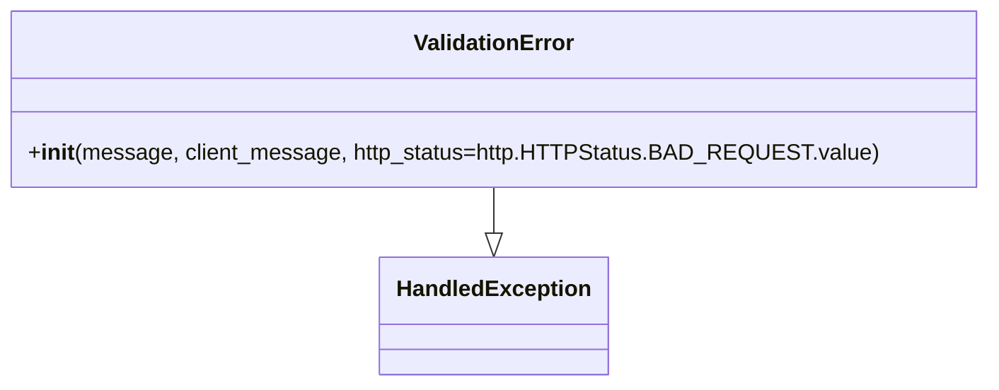

# Diagram: partview_core/partview_service/partview_service/exception/ValidationError.py

> Auto-generated by Obscura crawlers

## Mermaid

### SVG

<svg id="container" width="681.1171875" xmlns="http://www.w3.org/2000/svg" class="classDiagram" height="276" viewBox="0 0 681.1171875 276" role="graphics-document document" aria-roledescription="class"><g><defs><marker id="container_class-aggregationStart" class="marker aggregation class" refX="18" refY="7" markerWidth="190" markerHeight="240" orient="auto"><path d="M 18,7 L9,13 L1,7 L9,1 Z"></path></marker></defs><defs><marker id="container_class-aggregationEnd" class="marker aggregation class" refX="1" refY="7" markerWidth="20" markerHeight="28" orient="auto"><path d="M 18,7 L9,13 L1,7 L9,1 Z"></path></marker></defs><defs><marker id="container_class-extensionStart" class="marker extension class" refX="18" refY="7" markerWidth="190" markerHeight="240" orient="auto"><path d="M 1,7 L18,13 V 1 Z"></path></marker></defs><defs><marker id="container_class-extensionEnd" class="marker extension class" refX="1" refY="7" markerWidth="20" markerHeight="28" orient="auto"><path d="M 1,1 V 13 L18,7 Z"></path></marker></defs><defs><marker id="container_class-compositionStart" class="marker composition class" refX="18" refY="7" markerWidth="190" markerHeight="240" orient="auto"><path d="M 18,7 L9,13 L1,7 L9,1 Z"></path></marker></defs><defs><marker id="container_class-compositionEnd" class="marker composition class" refX="1" refY="7" markerWidth="20" markerHeight="28" orient="auto"><path d="M 18,7 L9,13 L1,7 L9,1 Z"></path></marker></defs><defs><marker id="container_class-dependencyStart" class="marker dependency class" refX="6" refY="7" markerWidth="190" markerHeight="240" orient="auto"><path d="M 5,7 L9,13 L1,7 L9,1 Z"></path></marker></defs><defs><marker id="container_class-dependencyEnd" class="marker dependency class" refX="13" refY="7" markerWidth="20" markerHeight="28" orient="auto"><path d="M 18,7 L9,13 L14,7 L9,1 Z"></path></marker></defs><defs><marker id="container_class-lollipopStart" class="marker lollipop class" refX="13" refY="7" markerWidth="190" markerHeight="240" orient="auto"><circle stroke="black" fill="transparent" cx="7" cy="7" r="6"></circle></marker></defs><defs><marker id="container_class-lollipopEnd" class="marker lollipop class" refX="1" refY="7" markerWidth="190" markerHeight="240" orient="auto"><circle stroke="black" fill="transparent" cx="7" cy="7" r="6"></circle></marker></defs><g class="root"><g class="clusters"></g><g class="edgePaths"><path d="M340.559,134L340.559,138.167C340.559,142.333,340.559,150.667,340.559,156.125C340.559,161.583,340.559,164.167,340.559,165.458L340.559,166.75" id="id_ValidationError_HandledException_1" class="edge-thickness-normal edge-pattern-solid relation" style=";;;" data-edge="true" data-et="edge" data-id="id_ValidationError_HandledException_1" data-points="W3sieCI6MzQwLjU1ODU5Mzc1LCJ5IjoxMzR9LHsieCI6MzQwLjU1ODU5Mzc1LCJ5IjoxNTl9LHsieCI6MzQwLjU1ODU5Mzc1LCJ5IjoxODR9XQ==" marker-end="url(#container_class-extensionEnd)"></path></g><g class="edgeLabels"><g class="edgeLabel"><g class="label" data-id="id_ValidationError_HandledException_1" transform="translate(0, 0)"><foreignObject width="0" height="0">

</foreignObject></g></g></g><g class="nodes"><g class="node default" id="classId-HandledException-0" transform="translate(340.55859375, 226)"><g class="basic label-container"><path d="M-78.3828125 -42 L78.3828125 -42 L78.3828125 42 L-78.3828125 42" stroke="none" stroke-width="0" fill="#ECECFF" style=""></path><path d="M-78.3828125 -42 C-29.884589159135494 -42, 18.61363418172901 -42, 78.3828125 -42 M-78.3828125 -42 C-31.178422464051664 -42, 16.025967571896672 -42, 78.3828125 -42 M78.3828125 -42 C78.3828125 -14.233276799893119, 78.3828125 13.533446400213762, 78.3828125 42 M78.3828125 -42 C78.3828125 -13.191218877516235, 78.3828125 15.61756224496753, 78.3828125 42 M78.3828125 42 C34.520463974291594 42, -9.341884551416811 42, -78.3828125 42 M78.3828125 42 C21.842219443342074 42, -34.69837361331585 42, -78.3828125 42 M-78.3828125 42 C-78.3828125 17.2598585863949, -78.3828125 -7.480282827210203, -78.3828125 -42 M-78.3828125 42 C-78.3828125 11.820106865144854, -78.3828125 -18.35978626971029, -78.3828125 -42" stroke="#9370DB" stroke-width="1.3" fill="none" stroke-dasharray="0 0" style=""></path></g><g class="annotation-group text" transform="translate(0, -18)"></g><g class="label-group text" transform="translate(-66.3828125, -18)"><g class="label" style="font-weight: bolder" transform="translate(0,-12)"><foreignObject width="132.765625" height="24">

HandledException

</foreignObject></g></g><g class="members-group text" transform="translate(-66.3828125, 30)"></g><g class="methods-group text" transform="translate(-66.3828125, 60)"></g><g class="divider" style=""><path d="M-78.3828125 6 C-18.04246940962846 6, 42.29787368074308 6, 78.3828125 6 M-78.3828125 6 C-29.682244368414338 6, 19.018323763171324 6, 78.3828125 6" stroke="#9370DB" stroke-width="1.3" fill="none" stroke-dasharray="0 0" style=""></path></g><g class="divider" style=""><path d="M-78.3828125 24 C-22.535311013119788 24, 33.312190473760424 24, 78.3828125 24 M-78.3828125 24 C-31.359988894776336 24, 15.662834710447328 24, 78.3828125 24" stroke="#9370DB" stroke-width="1.3" fill="none" stroke-dasharray="0 0" style=""></path></g></g><g class="node default" id="classId-ValidationError-1" transform="translate(340.55859375, 71)"><g class="basic label-container"><path d="M-332.55859375 -63 L332.55859375 -63 L332.55859375 63 L-332.55859375 63" stroke="none" stroke-width="0" fill="#ECECFF" style=""></path><path d="M-332.55859375 -63 C-77.27420775575061 -63, 178.01017823849878 -63, 332.55859375 -63 M-332.55859375 -63 C-113.60938983813367 -63, 105.33981407373267 -63, 332.55859375 -63 M332.55859375 -63 C332.55859375 -16.20655654258524, 332.55859375 30.58688691482952, 332.55859375 63 M332.55859375 -63 C332.55859375 -18.804191376028648, 332.55859375 25.391617247942705, 332.55859375 63 M332.55859375 63 C66.98688220433684 63, -198.58482934132633 63, -332.55859375 63 M332.55859375 63 C69.11255914057284 63, -194.33347546885432 63, -332.55859375 63 M-332.55859375 63 C-332.55859375 15.508381844467976, -332.55859375 -31.983236311064047, -332.55859375 -63 M-332.55859375 63 C-332.55859375 21.818121006490124, -332.55859375 -19.363757987019753, -332.55859375 -63" stroke="#9370DB" stroke-width="1.3" fill="none" stroke-dasharray="0 0" style=""></path></g><g class="annotation-group text" transform="translate(0, -39)"></g><g class="label-group text" transform="translate(-55.1796875, -39)"><g class="label" style="font-weight: bolder" transform="translate(0,-12)"><foreignObject width="110.359375" height="24">

ValidationError

</foreignObject></g></g><g class="members-group text" transform="translate(-320.55859375, 9)"></g><g class="methods-group text" transform="translate(-320.55859375, 39)"><g class="label" style="" transform="translate(0,-12)"><foreignObject width="585.9375" height="24">

+<strong>init</strong>(message, client_message, http_status=http.HTTPStatus.BAD_REQUEST.value)

</foreignObject></g></g><g class="divider" style=""><path d="M-332.55859375 -15 C-74.95756783641247 -15, 182.64345807717507 -15, 332.55859375 -15 M-332.55859375 -15 C-114.99330352884459 -15, 102.57198669231082 -15, 332.55859375 -15" stroke="#9370DB" stroke-width="1.3" fill="none" stroke-dasharray="0 0" style=""></path></g><g class="divider" style=""><path d="M-332.55859375 9 C-176.61477880984256 9, -20.670963869685124 9, 332.55859375 9 M-332.55859375 9 C-136.8415757792286 9, 58.87544219154279 9, 332.55859375 9" stroke="#9370DB" stroke-width="1.3" fill="none" stroke-dasharray="0 0" style=""></path></g></g></g></g></g></svg>
