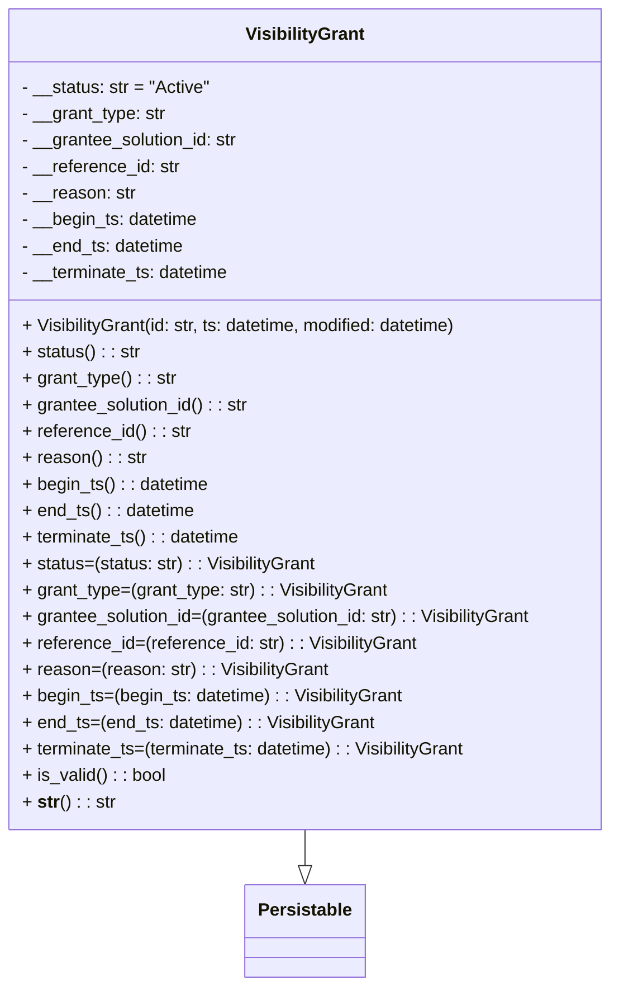

# Diagram: partview_core/partview_service/partview_service/framework/datamodel/VisibilityGrant.py

> Auto-generated by Obscura crawlers

## Mermaid

### SVG

<svg id="container" width="562.65625" xmlns="http://www.w3.org/2000/svg" class="classDiagram" height="894" viewBox="0 0 562.65625 894" role="graphics-document document" aria-roledescription="class"><g><defs><marker id="container_class-aggregationStart" class="marker aggregation class" refX="18" refY="7" markerWidth="190" markerHeight="240" orient="auto"><path d="M 18,7 L9,13 L1,7 L9,1 Z"></path></marker></defs><defs><marker id="container_class-aggregationEnd" class="marker aggregation class" refX="1" refY="7" markerWidth="20" markerHeight="28" orient="auto"><path d="M 18,7 L9,13 L1,7 L9,1 Z"></path></marker></defs><defs><marker id="container_class-extensionStart" class="marker extension class" refX="18" refY="7" markerWidth="190" markerHeight="240" orient="auto"><path d="M 1,7 L18,13 V 1 Z"></path></marker></defs><defs><marker id="container_class-extensionEnd" class="marker extension class" refX="1" refY="7" markerWidth="20" markerHeight="28" orient="auto"><path d="M 1,1 V 13 L18,7 Z"></path></marker></defs><defs><marker id="container_class-compositionStart" class="marker composition class" refX="18" refY="7" markerWidth="190" markerHeight="240" orient="auto"><path d="M 18,7 L9,13 L1,7 L9,1 Z"></path></marker></defs><defs><marker id="container_class-compositionEnd" class="marker composition class" refX="1" refY="7" markerWidth="20" markerHeight="28" orient="auto"><path d="M 18,7 L9,13 L1,7 L9,1 Z"></path></marker></defs><defs><marker id="container_class-dependencyStart" class="marker dependency class" refX="6" refY="7" markerWidth="190" markerHeight="240" orient="auto"><path d="M 5,7 L9,13 L1,7 L9,1 Z"></path></marker></defs><defs><marker id="container_class-dependencyEnd" class="marker dependency class" refX="13" refY="7" markerWidth="20" markerHeight="28" orient="auto"><path d="M 18,7 L9,13 L14,7 L9,1 Z"></path></marker></defs><defs><marker id="container_class-lollipopStart" class="marker lollipop class" refX="13" refY="7" markerWidth="190" markerHeight="240" orient="auto"><circle stroke="black" fill="transparent" cx="7" cy="7" r="6"></circle></marker></defs><defs><marker id="container_class-lollipopEnd" class="marker lollipop class" refX="1" refY="7" markerWidth="190" markerHeight="240" orient="auto"><circle stroke="black" fill="transparent" cx="7" cy="7" r="6"></circle></marker></defs><g class="root"><g class="clusters"></g><g class="edgePaths"><path d="M281.328,752L281.328,756.167C281.328,760.333,281.328,768.667,281.328,774.125C281.328,779.583,281.328,782.167,281.328,783.458L281.328,784.75" id="id_VisibilityGrant_Persistable_1" class="edge-thickness-normal edge-pattern-solid relation" style=";;;" data-edge="true" data-et="edge" data-id="id_VisibilityGrant_Persistable_1" data-points="W3sieCI6MjgxLjMyODEyNSwieSI6NzUyfSx7IngiOjI4MS4zMjgxMjUsInkiOjc3N30seyJ4IjoyODEuMzI4MTI1LCJ5Ijo4MDJ9XQ==" marker-end="url(#container_class-extensionEnd)"></path></g><g class="edgeLabels"><g class="edgeLabel"><g class="label" data-id="id_VisibilityGrant_Persistable_1" transform="translate(0, 0)"><foreignObject width="0" height="0">

</foreignObject></g></g></g><g class="nodes"><g class="node default" id="classId-Persistable-0" transform="translate(281.328125, 844)"><g class="basic label-container"><path d="M-52.9765625 -42 L52.9765625 -42 L52.9765625 42 L-52.9765625 42" stroke="none" stroke-width="0" fill="#ECECFF" style=""></path><path d="M-52.9765625 -42 C-21.290046487563803 -42, 10.396469524872394 -42, 52.9765625 -42 M-52.9765625 -42 C-23.16001360933232 -42, 6.656535281335358 -42, 52.9765625 -42 M52.9765625 -42 C52.9765625 -20.153647613924605, 52.9765625 1.6927047721507904, 52.9765625 42 M52.9765625 -42 C52.9765625 -8.476976598383587, 52.9765625 25.046046803232827, 52.9765625 42 M52.9765625 42 C18.017251482311487 42, -16.942059535377027 42, -52.9765625 42 M52.9765625 42 C23.378764714808682 42, -6.219033070382636 42, -52.9765625 42 M-52.9765625 42 C-52.9765625 10.669355401898756, -52.9765625 -20.66128919620249, -52.9765625 -42 M-52.9765625 42 C-52.9765625 11.759547859860927, -52.9765625 -18.480904280278146, -52.9765625 -42" stroke="#9370DB" stroke-width="1.3" fill="none" stroke-dasharray="0 0" style=""></path></g><g class="annotation-group text" transform="translate(0, -18)"></g><g class="label-group text" transform="translate(-40.9765625, -18)"><g class="label" style="font-weight: bolder" transform="translate(0,-12)"><foreignObject width="81.953125" height="24">

Persistable

</foreignObject></g></g><g class="members-group text" transform="translate(-40.9765625, 30)"></g><g class="methods-group text" transform="translate(-40.9765625, 60)"></g><g class="divider" style=""><path d="M-52.9765625 6 C-22.068243174945092 6, 8.840076150109816 6, 52.9765625 6 M-52.9765625 6 C-23.07661753580204 6, 6.82332742839592 6, 52.9765625 6" stroke="#9370DB" stroke-width="1.3" fill="none" stroke-dasharray="0 0" style=""></path></g><g class="divider" style=""><path d="M-52.9765625 24 C-23.461634886825134 24, 6.053292726349731 24, 52.9765625 24 M-52.9765625 24 C-24.36583659932673 24, 4.244889301346539 24, 52.9765625 24" stroke="#9370DB" stroke-width="1.3" fill="none" stroke-dasharray="0 0" style=""></path></g></g><g class="node default" id="classId-VisibilityGrant-1" transform="translate(281.328125, 380)"><g class="basic label-container"><path d="M-273.328125 -372 L273.328125 -372 L273.328125 372 L-273.328125 372" stroke="none" stroke-width="0" fill="#ECECFF" style=""></path><path d="M-273.328125 -372 C-113.14330035413377 -372, 47.04152429173246 -372, 273.328125 -372 M-273.328125 -372 C-82.56691794911455 -372, 108.19428910177089 -372, 273.328125 -372 M273.328125 -372 C273.328125 -198.8930441920622, 273.328125 -25.78608838412441, 273.328125 372 M273.328125 -372 C273.328125 -162.26654834647923, 273.328125 47.46690330704155, 273.328125 372 M273.328125 372 C68.222910525538 372, -136.882303948924 372, -273.328125 372 M273.328125 372 C76.05214290516517 372, -121.22383918966966 372, -273.328125 372 M-273.328125 372 C-273.328125 94.43523463373674, -273.328125 -183.12953073252652, -273.328125 -372 M-273.328125 372 C-273.328125 133.89748233951823, -273.328125 -104.20503532096353, -273.328125 -372" stroke="#9370DB" stroke-width="1.3" fill="none" stroke-dasharray="0 0" style=""></path></g><g class="annotation-group text" transform="translate(0, -348)"></g><g class="label-group text" transform="translate(-51.96875, -348)"><g class="label" style="font-weight: bolder" transform="translate(0,-12)"><foreignObject width="103.9375" height="24">

VisibilityGrant

</foreignObject></g></g><g class="members-group text" transform="translate(-261.328125, -300)"><g class="label" style="" transform="translate(0,-12)"><foreignObject width="171.3125" height="24">

- __status: str = "Active"

</foreignObject></g><g class="label" style="" transform="translate(0,12)"><foreignObject width="132.40625" height="24">

- __grant_type: str

</foreignObject></g><g class="label" style="" transform="translate(0,36)"><foreignObject width="200.046875" height="24">

- __grantee_solution_id: str

</foreignObject></g><g class="label" style="" transform="translate(0,60)"><foreignObject width="144.9375" height="24">

- __reference_id: str

</foreignObject></g><g class="label" style="" transform="translate(0,84)"><foreignObject width="103.671875" height="24">

- __reason: str

</foreignObject></g><g class="label" style="" transform="translate(0,108)"><foreignObject width="162.1875" height="24">

- __begin_ts: datetime

</foreignObject></g><g class="label" style="" transform="translate(0,132)"><foreignObject width="149.09375" height="24">

- __end_ts: datetime

</foreignObject></g><g class="label" style="" transform="translate(0,156)"><foreignObject width="192.109375" height="24">

- __terminate_ts: datetime

</foreignObject></g></g><g class="methods-group text" transform="translate(-261.328125, -84)"><g class="label" style="" transform="translate(0,-12)"><foreignObject width="405.171875" height="24">

+ VisibilityGrant(id: str, ts: datetime, modified: datetime)

</foreignObject></g><g class="label" style="" transform="translate(0,12)"><foreignObject width="106.828125" height="24">

+ status() : : str

</foreignObject></g><g class="label" style="" transform="translate(0,36)"><foreignObject width="140.015625" height="24">

+ grant_type() : : str

</foreignObject></g><g class="label" style="" transform="translate(0,60)"><foreignObject width="207.640625" height="24">

+ grantee_solution_id() : : str

</foreignObject></g><g class="label" style="" transform="translate(0,84)"><foreignObject width="152.6875" height="24">

+ reference_id() : : str

</foreignObject></g><g class="label" style="" transform="translate(0,108)"><foreignObject width="111.421875" height="24">

+ reason() : : str

</foreignObject></g><g class="label" style="" transform="translate(0,132)"><foreignObject width="169.921875" height="24">

+ begin_ts() : : datetime

</foreignObject></g><g class="label" style="" transform="translate(0,156)"><foreignObject width="157.15625" height="24">

+ end_ts() : : datetime

</foreignObject></g><g class="label" style="" transform="translate(0,180)"><foreignObject width="200.171875" height="24">

+ terminate_ts() : : datetime

</foreignObject></g><g class="label" style="" transform="translate(0,204)"><foreignObject width="269.046875" height="24">

+ status=(status: str) : : VisibilityGrant

</foreignObject></g><g class="label" style="" transform="translate(0,228)"><foreignObject width="335.421875" height="24">

+ grant_type=(grant_type: str) : : VisibilityGrant

</foreignObject></g><g class="label" style="" transform="translate(0,252)"><foreignObject width="470.6875" height="24">

+ grantee_solution_id=(grantee_solution_id: str) : : VisibilityGrant

</foreignObject></g><g class="label" style="" transform="translate(0,276)"><foreignObject width="360.765625" height="24">

+ reference_id=(reference_id: str) : : VisibilityGrant

</foreignObject></g><g class="label" style="" transform="translate(0,300)"><foreignObject width="278.234375" height="24">

+ reason=(reason: str) : : VisibilityGrant

</foreignObject></g><g class="label" style="" transform="translate(0,324)"><foreignObject width="349.4375" height="24">

+ begin_ts=(begin_ts: datetime) : : VisibilityGrant

</foreignObject></g><g class="label" style="" transform="translate(0,348)"><foreignObject width="323.890625" height="24">

+ end_ts=(end_ts: datetime) : : VisibilityGrant

</foreignObject></g><g class="label" style="" transform="translate(0,372)"><foreignObject width="409.90625" height="24">

+ terminate_ts=(terminate_ts: datetime) : : VisibilityGrant

</foreignObject></g><g class="label" style="" transform="translate(0,396)"><foreignObject width="130.3125" height="24">

+ is_valid() : : bool

</foreignObject></g><g class="label" style="" transform="translate(0,420)"><foreignObject width="82.765625" height="24">

+ <strong>str</strong>() : : str

</foreignObject></g></g><g class="divider" style=""><path d="M-273.328125 -324 C-140.63220435091267 -324, -7.936283701825346 -324, 273.328125 -324 M-273.328125 -324 C-57.274446009622864 -324, 158.77923298075427 -324, 273.328125 -324" stroke="#9370DB" stroke-width="1.3" fill="none" stroke-dasharray="0 0" style=""></path></g><g class="divider" style=""><path d="M-273.328125 -108 C-156.44479710998974 -108, -39.56146921997944 -108, 273.328125 -108 M-273.328125 -108 C-149.67463516835153 -108, -26.02114533670303 -108, 273.328125 -108" stroke="#9370DB" stroke-width="1.3" fill="none" stroke-dasharray="0 0" style=""></path></g></g></g></g></g></svg>
