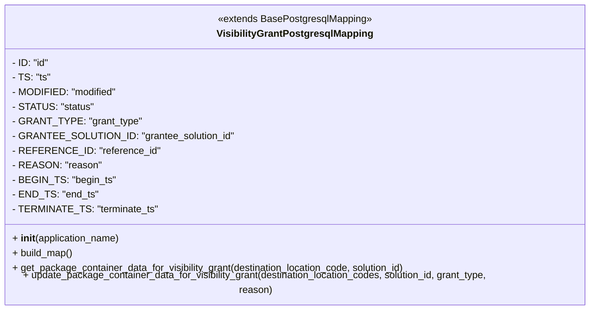

# Diagram: partview_core/partview_service/partview_service/framework/persistence_adapter/postgresql/VisibilityGrantPostgresqlMapping.py


> Auto-generated by Obscura crawlers

## Diagram 1



### SVG

<svg id="container" width="998.953125" xmlns="http://www.w3.org/2000/svg" class="classDiagram" height="496" viewBox="0 0 998.953125 496" role="graphics-document document" aria-roledescription="class"><style>#container{font-family:"trebuchet ms",verdana,arial,sans-serif;font-size:16px;fill:#333;}@keyframes edge-animation-frame{from{stroke-dashoffset:0;}}@keyframes dash{to{stroke-dashoffset:0;}}#container .edge-animation-slow{stroke-dasharray:9,5!important;stroke-dashoffset:900;animation:dash 50s linear infinite;stroke-linecap:round;}#container .edge-animation-fast{stroke-dasharray:9,5!important;stroke-dashoffset:900;animation:dash 20s linear infinite;stroke-linecap:round;}#container .error-icon{fill:#552222;}#container .error-text{fill:#552222;stroke:#552222;}#container .edge-thickness-normal{stroke-width:1px;}#container .edge-thickness-thick{stroke-width:3.5px;}#container .edge-pattern-solid{stroke-dasharray:0;}#container .edge-thickness-invisible{stroke-width:0;fill:none;}#container .edge-pattern-dashed{stroke-dasharray:3;}#container .edge-pattern-dotted{stroke-dasharray:2;}#container .marker{fill:#333333;stroke:#333333;}#container .marker.cross{stroke:#333333;}#container svg{font-family:"trebuchet ms",verdana,arial,sans-serif;font-size:16px;}#container p{margin:0;}#container g.classGroup text{fill:#9370DB;stroke:none;font-family:"trebuchet ms",verdana,arial,sans-serif;font-size:10px;}#container g.classGroup text .title{font-weight:bolder;}#container .nodeLabel,#container .edgeLabel{color:#131300;}#container .edgeLabel .label rect{fill:#ECECFF;}#container .label text{fill:#131300;}#container .labelBkg{background:#ECECFF;}#container .edgeLabel .label span{background:#ECECFF;}#container .classTitle{font-weight:bolder;}#container .node rect,#container .node circle,#container .node ellipse,#container .node polygon,#container .node path{fill:#ECECFF;stroke:#9370DB;stroke-width:1px;}#container .divider{stroke:#9370DB;stroke-width:1;}#container g.clickable{cursor:pointer;}#container g.classGroup rect{fill:#ECECFF;stroke:#9370DB;}#container g.classGroup line{stroke:#9370DB;stroke-width:1;}#container .classLabel .box{stroke:none;stroke-width:0;fill:#ECECFF;opacity:0.5;}#container .classLabel .label{fill:#9370DB;font-size:10px;}#container .relation{stroke:#333333;stroke-width:1;fill:none;}#container .dashed-line{stroke-dasharray:3;}#container .dotted-line{stroke-dasharray:1 2;}#container #compositionStart,#container .composition{fill:#333333!important;stroke:#333333!important;stroke-width:1;}#container #compositionEnd,#container .composition{fill:#333333!important;stroke:#333333!important;stroke-width:1;}#container #dependencyStart,#container .dependency{fill:#333333!important;stroke:#333333!important;stroke-width:1;}#container #dependencyStart,#container .dependency{fill:#333333!important;stroke:#333333!important;stroke-width:1;}#container #extensionStart,#container .extension{fill:transparent!important;stroke:#333333!important;stroke-width:1;}#container #extensionEnd,#container .extension{fill:transparent!important;stroke:#333333!important;stroke-width:1;}#container #aggregationStart,#container .aggregation{fill:transparent!important;stroke:#333333!important;stroke-width:1;}#container #aggregationEnd,#container .aggregation{fill:transparent!important;stroke:#333333!important;stroke-width:1;}#container #lollipopStart,#container .lollipop{fill:#ECECFF!important;stroke:#333333!important;stroke-width:1;}#container #lollipopEnd,#container .lollipop{fill:#ECECFF!important;stroke:#333333!important;stroke-width:1;}#container .edgeTerminals{font-size:11px;line-height:initial;}#container .classTitleText{text-anchor:middle;font-size:18px;fill:#333;}#container .label-icon{display:inline-block;height:1em;overflow:visible;vertical-align:-0.125em;}#container .node .label-icon path{fill:currentColor;stroke:revert;stroke-width:revert;}#container :root{--mermaid-font-family:"trebuchet ms",verdana,arial,sans-serif;}</style><g><defs><marker id="container_class-aggregationStart" class="marker aggregation class" refX="18" refY="7" markerWidth="190" markerHeight="240" orient="auto"><path d="M 18,7 L9,13 L1,7 L9,1 Z"></path></marker></defs><defs><marker id="container_class-aggregationEnd" class="marker aggregation class" refX="1" refY="7" markerWidth="20" markerHeight="28" orient="auto"><path d="M 18,7 L9,13 L1,7 L9,1 Z"></path></marker></defs><defs><marker id="container_class-extensionStart" class="marker extension class" refX="18" refY="7" markerWidth="190" markerHeight="240" orient="auto"><path d="M 1,7 L18,13 V 1 Z"></path></marker></defs><defs><marker id="container_class-extensionEnd" class="marker extension class" refX="1" refY="7" markerWidth="20" markerHeight="28" orient="auto"><path d="M 1,1 V 13 L18,7 Z"></path></marker></defs><defs><marker id="container_class-compositionStart" class="marker composition class" refX="18" refY="7" markerWidth="190" markerHeight="240" orient="auto"><path d="M 18,7 L9,13 L1,7 L9,1 Z"></path></marker></defs><defs><marker id="container_class-compositionEnd" class="marker composition class" refX="1" refY="7" markerWidth="20" markerHeight="28" orient="auto"><path d="M 18,7 L9,13 L1,7 L9,1 Z"></path></marker></defs><defs><marker id="container_class-dependencyStart" class="marker dependency class" refX="6" refY="7" markerWidth="190" markerHeight="240" orient="auto"><path d="M 5,7 L9,13 L1,7 L9,1 Z"></path></marker></defs><defs><marker id="container_class-dependencyEnd" class="marker dependency class" refX="13" refY="7" markerWidth="20" markerHeight="28" orient="auto"><path d="M 18,7 L9,13 L14,7 L9,1 Z"></path></marker></defs><defs><marker id="container_class-lollipopStart" class="marker lollipop class" refX="13" refY="7" markerWidth="190" markerHeight="240" orient="auto"><circle stroke="black" fill="transparent" cx="7" cy="7" r="6"></circle></marker></defs><defs><marker id="container_class-lollipopEnd" class="marker lollipop class" refX="1" refY="7" markerWidth="190" markerHeight="240" orient="auto"><circle stroke="black" fill="transparent" cx="7" cy="7" r="6"></circle></marker></defs><g class="root"><g class="clusters"></g><g class="edgePaths"></g><g class="edgeLabels"></g><g class="nodes"><g class="node default" id="classId-VisibilityGrantPostgresqlMapping-0" transform="translate(499.4765625, 248)"><g class="basic label-container"><path d="M-491.4765625 -240 L491.4765625 -240 L491.4765625 240 L-491.4765625 240" stroke="none" stroke-width="0" fill="#ECECFF" style=""></path><path d="M-491.4765625 -240 C-225.64911216428465 -240, 40.17833817143071 -240, 491.4765625 -240 M-491.4765625 -240 C-262.19880112237456 -240, -32.92103974474918 -240, 491.4765625 -240 M491.4765625 -240 C491.4765625 -54.03554741358107, 491.4765625 131.92890517283786, 491.4765625 240 M491.4765625 -240 C491.4765625 -139.17547770177185, 491.4765625 -38.35095540354368, 491.4765625 240 M491.4765625 240 C133.9787649608778 240, -223.51903257824438 240, -491.4765625 240 M491.4765625 240 C186.28157712456493 240, -118.91340825087013 240, -491.4765625 240 M-491.4765625 240 C-491.4765625 119.05330484074683, -491.4765625 -1.8933903185063343, -491.4765625 -240 M-491.4765625 240 C-491.4765625 49.29475789504286, -491.4765625 -141.41048420991427, -491.4765625 -240" stroke="#9370DB" stroke-width="1.3" fill="none" stroke-dasharray="0 0" style=""></path></g><g class="annotation-group text" transform="translate(-125.828125, -216)"><g class="label" style="" transform="translate(0,-12)"><foreignObject width="251.65625" height="24"><div xmlns="http://www.w3.org/1999/xhtml" style="display: table-cell; white-space: nowrap; line-height: 1.5; max-width: 302px; text-align: center;"><span class="nodeLabel markdown-node-label" style=""><p>«extends BasePostgresqlMapping»</p></span></div></foreignObject></g></g><g class="label-group text" transform="translate(-122.375, -192)"><g class="label" style="font-weight: bolder" transform="translate(0,-12)"><foreignObject width="244.75" height="24"><div xmlns="http://www.w3.org/1999/xhtml" style="display: table-cell; white-space: nowrap; line-height: 1.5; max-width: 290px; text-align: center;"><span class="nodeLabel markdown-node-label" style=""><p>VisibilityGrantPostgresqlMapping</p></span></div></foreignObject></g></g><g class="members-group text" transform="translate(-479.4765625, -144)"><g class="label" style="" transform="translate(0,-12)"><foreignObject width="60.640625" height="24"><div xmlns="http://www.w3.org/1999/xhtml" style="display: table-cell; white-space: nowrap; line-height: 1.5; max-width: 118px; text-align: center;"><span class="nodeLabel markdown-node-label" style=""><p>- ID: "id"</p></span></div></foreignObject></g><g class="label" style="" transform="translate(0,12)"><foreignObject width="61.390625" height="24"><div xmlns="http://www.w3.org/1999/xhtml" style="display: table-cell; white-space: nowrap; line-height: 1.5; max-width: 119px; text-align: center;"><span class="nodeLabel markdown-node-label" style=""><p>- TS: "ts"</p></span></div></foreignObject></g><g class="label" style="" transform="translate(0,36)"><foreignObject width="165.984375" height="24"><div xmlns="http://www.w3.org/1999/xhtml" style="display: table-cell; white-space: nowrap; line-height: 1.5; max-width: 223px; text-align: center;"><span class="nodeLabel markdown-node-label" style=""><p>- MODIFIED: "modified"</p></span></div></foreignObject></g><g class="label" style="" transform="translate(0,60)"><foreignObject width="127.21875" height="24"><div xmlns="http://www.w3.org/1999/xhtml" style="display: table-cell; white-space: nowrap; line-height: 1.5; max-width: 185px; text-align: center;"><span class="nodeLabel markdown-node-label" style=""><p>- STATUS: "status"</p></span></div></foreignObject></g><g class="label" style="" transform="translate(0,84)"><foreignObject width="198.765625" height="24"><div xmlns="http://www.w3.org/1999/xhtml" style="display: table-cell; white-space: nowrap; line-height: 1.5; max-width: 256px; text-align: center;"><span class="nodeLabel markdown-node-label" style=""><p>- GRANT_TYPE: "grant_type"</p></span></div></foreignObject></g><g class="label" style="" transform="translate(0,108)"><foreignObject width="346.3125" height="24"><div xmlns="http://www.w3.org/1999/xhtml" style="display: table-cell; white-space: nowrap; line-height: 1.5; max-width: 404px; text-align: center;"><span class="nodeLabel markdown-node-label" style=""><p>- GRANTEE_SOLUTION_ID: "grantee_solution_id"</p></span></div></foreignObject></g><g class="label" style="" transform="translate(0,132)"><foreignObject width="226.484375" height="24"><div xmlns="http://www.w3.org/1999/xhtml" style="display: table-cell; white-space: nowrap; line-height: 1.5; max-width: 284px; text-align: center;"><span class="nodeLabel markdown-node-label" style=""><p>- REFERENCE_ID: "reference_id"</p></span></div></foreignObject></g><g class="label" style="" transform="translate(0,156)"><foreignObject width="138.5" height="24"><div xmlns="http://www.w3.org/1999/xhtml" style="display: table-cell; white-space: nowrap; line-height: 1.5; max-width: 196px; text-align: center;"><span class="nodeLabel markdown-node-label" style=""><p>- REASON: "reason"</p></span></div></foreignObject></g><g class="label" style="" transform="translate(0,180)"><foreignObject width="161.015625" height="24"><div xmlns="http://www.w3.org/1999/xhtml" style="display: table-cell; white-space: nowrap; line-height: 1.5; max-width: 218px; text-align: center;"><span class="nodeLabel markdown-node-label" style=""><p>- BEGIN_TS: "begin_ts"</p></span></div></foreignObject></g><g class="label" style="" transform="translate(0,204)"><foreignObject width="133.40625" height="24"><div xmlns="http://www.w3.org/1999/xhtml" style="display: table-cell; white-space: nowrap; line-height: 1.5; max-width: 191px; text-align: center;"><span class="nodeLabel markdown-node-label" style=""><p>- END_TS: "end_ts"</p></span></div></foreignObject></g><g class="label" style="" transform="translate(0,228)"><foreignObject width="227.390625" height="24"><div xmlns="http://www.w3.org/1999/xhtml" style="display: table-cell; white-space: nowrap; line-height: 1.5; max-width: 285px; text-align: center;"><span class="nodeLabel markdown-node-label" style=""><p>- TERMINATE_TS: "terminate_ts"</p></span></div></foreignObject></g></g><g class="methods-group text" transform="translate(-479.4765625, 144)"><g class="label" style="" transform="translate(0,-12)"><foreignObject width="177.984375" height="24"><div xmlns="http://www.w3.org/1999/xhtml" style="display: table-cell; white-space: nowrap; line-height: 1.5; max-width: 268px; text-align: center;"><span class="nodeLabel markdown-node-label" style=""><p>+ <strong>init</strong>(application_name)</p></span></div></foreignObject></g><g class="label" style="" transform="translate(0,12)"><foreignObject width="100.34375" height="24"><div xmlns="http://www.w3.org/1999/xhtml" style="display: table-cell; white-space: nowrap; line-height: 1.5; max-width: 158px; text-align: center;"><span class="nodeLabel markdown-node-label" style=""><p>+ build_map()</p></span></div></foreignObject></g><g class="label" style="" transform="translate(0,36)"><foreignObject width="654.453125" height="24"><div xmlns="http://www.w3.org/1999/xhtml" style="display: table-cell; white-space: nowrap; line-height: 1.5; max-width: 712px; text-align: center;"><span class="nodeLabel markdown-node-label" style=""><p>+ get_package_container_data_for_visibility_grant(destination_location_code, solution_id)</p></span></div></foreignObject></g><g class="label" style="" transform="translate(0,60)"><foreignObject width="833.125" height="24"><div xmlns="http://www.w3.org/1999/xhtml" style="display: table-cell; white-space: nowrap; line-height: 1.5; max-width: 890px; text-align: center;"><span class="nodeLabel markdown-node-label" style=""><p>+ update_package_container_data_for_visibility_grant(destination_location_codes, solution_id, grant_type, reason)</p></span></div></foreignObject></g></g><g class="divider" style=""><path d="M-491.4765625 -168 C-237.71191641379278 -168, 16.052729672414443 -168, 491.4765625 -168 M-491.4765625 -168 C-204.71527477417874 -168, 82.04601295164252 -168, 491.4765625 -168" stroke="#9370DB" stroke-width="1.3" fill="none" stroke-dasharray="0 0" style=""></path></g><g class="divider" style=""><path d="M-491.4765625 120 C-188.47421339077465 120, 114.5281357184507 120, 491.4765625 120 M-491.4765625 120 C-266.83197752193945 120, -42.1873925438789 120, 491.4765625 120" stroke="#9370DB" stroke-width="1.3" fill="none" stroke-dasharray="0 0" style=""></path></g></g></g></g></g></svg>

## Diagram 2

```mermaid
flowchart TD
    A[get_package_container_data_for_visibility_grant(destination_location_code, solution_id)] --> B[build params dict]
    B --> C[compose SELECT query]
    C --> D[get_primary_database_connector().establish_connection().get_cursor()]
    D --> E[cursor.mogrify(query, params)]
    E --> F[cursor.execute(mogrified_query)]
    F --> G[cursor.fetchall()]
    G --> H{json_data ?}
    H -- True --> I[return json_data]
    H -- False --> J[return False]
```

> SVG rendering failed for this diagram.

## Diagram 3

```mermaid
flowchart TD
    K[update_package_container_data_for_visibility_grant(destination_location_codes,...)] --> L{destination_location_codes present?}
    L -- No --> M[return False]
    L -- Yes --> N[build params with tuple(destination_location_codes)]
    N --> O[compose INSERT ... SELECT ... ON CONFLICT DO NOTHING RETURNING *]
    O --> P[get_primary_database_connector().establish_connection().get_cursor()]
    P --> Q[cursor.mogrify(query, params)]
    Q --> R[cursor.execute(q)]
    R --> S[cursor.fetchall()]
    S --> T{json_data ?}
    T -- True --> U[return json_data]
    T -- False --> V[return False]
```

> SVG rendering failed for this diagram.
