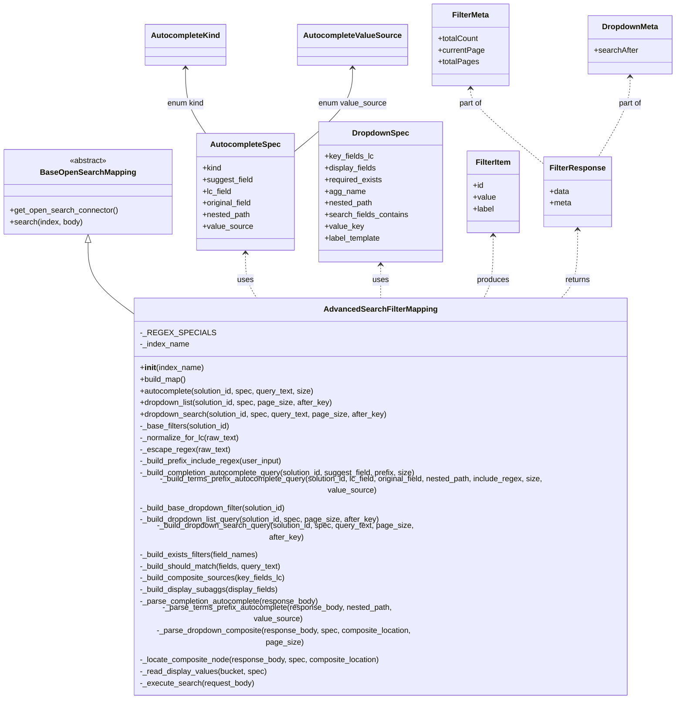

# Diagram: partview_core/partview_service/partview_service/persistence/open_search/AdvancedSearchFilterMapping.py


> Auto-generated by Obscura crawlers

## Diagram 1



### SVG

<svg id="container" width="1367.2109375" xmlns="http://www.w3.org/2000/svg" class="classDiagram" height="1340" viewBox="0 0 1367.2109375 1340" role="graphics-document document" aria-roledescription="class"><style>#container{font-family:"trebuchet ms",verdana,arial,sans-serif;font-size:16px;fill:#333;}@keyframes edge-animation-frame{from{stroke-dashoffset:0;}}@keyframes dash{to{stroke-dashoffset:0;}}#container .edge-animation-slow{stroke-dasharray:9,5!important;stroke-dashoffset:900;animation:dash 50s linear infinite;stroke-linecap:round;}#container .edge-animation-fast{stroke-dasharray:9,5!important;stroke-dashoffset:900;animation:dash 20s linear infinite;stroke-linecap:round;}#container .error-icon{fill:#552222;}#container .error-text{fill:#552222;stroke:#552222;}#container .edge-thickness-normal{stroke-width:1px;}#container .edge-thickness-thick{stroke-width:3.5px;}#container .edge-pattern-solid{stroke-dasharray:0;}#container .edge-thickness-invisible{stroke-width:0;fill:none;}#container .edge-pattern-dashed{stroke-dasharray:3;}#container .edge-pattern-dotted{stroke-dasharray:2;}#container .marker{fill:#333333;stroke:#333333;}#container .marker.cross{stroke:#333333;}#container svg{font-family:"trebuchet ms",verdana,arial,sans-serif;font-size:16px;}#container p{margin:0;}#container g.classGroup text{fill:#9370DB;stroke:none;font-family:"trebuchet ms",verdana,arial,sans-serif;font-size:10px;}#container g.classGroup text .title{font-weight:bolder;}#container .nodeLabel,#container .edgeLabel{color:#131300;}#container .edgeLabel .label rect{fill:#ECECFF;}#container .label text{fill:#131300;}#container .labelBkg{background:#ECECFF;}#container .edgeLabel .label span{background:#ECECFF;}#container .classTitle{font-weight:bolder;}#container .node rect,#container .node circle,#container .node ellipse,#container .node polygon,#container .node path{fill:#ECECFF;stroke:#9370DB;stroke-width:1px;}#container .divider{stroke:#9370DB;stroke-width:1;}#container g.clickable{cursor:pointer;}#container g.classGroup rect{fill:#ECECFF;stroke:#9370DB;}#container g.classGroup line{stroke:#9370DB;stroke-width:1;}#container .classLabel .box{stroke:none;stroke-width:0;fill:#ECECFF;opacity:0.5;}#container .classLabel .label{fill:#9370DB;font-size:10px;}#container .relation{stroke:#333333;stroke-width:1;fill:none;}#container .dashed-line{stroke-dasharray:3;}#container .dotted-line{stroke-dasharray:1 2;}#container #compositionStart,#container .composition{fill:#333333!important;stroke:#333333!important;stroke-width:1;}#container #compositionEnd,#container .composition{fill:#333333!important;stroke:#333333!important;stroke-width:1;}#container #dependencyStart,#container .dependency{fill:#333333!important;stroke:#333333!important;stroke-width:1;}#container #dependencyStart,#container .dependency{fill:#333333!important;stroke:#333333!important;stroke-width:1;}#container #extensionStart,#container .extension{fill:transparent!important;stroke:#333333!important;stroke-width:1;}#container #extensionEnd,#container .extension{fill:transparent!important;stroke:#333333!important;stroke-width:1;}#container #aggregationStart,#container .aggregation{fill:transparent!important;stroke:#333333!important;stroke-width:1;}#container #aggregationEnd,#container .aggregation{fill:transparent!important;stroke:#333333!important;stroke-width:1;}#container #lollipopStart,#container .lollipop{fill:#ECECFF!important;stroke:#333333!important;stroke-width:1;}#container #lollipopEnd,#container .lollipop{fill:#ECECFF!important;stroke:#333333!important;stroke-width:1;}#container .edgeTerminals{font-size:11px;line-height:initial;}#container .classTitleText{text-anchor:middle;font-size:18px;fill:#333;}#container .label-icon{display:inline-block;height:1em;overflow:visible;vertical-align:-0.125em;}#container .node .label-icon path{fill:currentColor;stroke:revert;stroke-width:revert;}#container :root{--mermaid-font-family:"trebuchet ms",verdana,arial,sans-serif;}</style><g><defs><marker id="container_class-aggregationStart" class="marker aggregation class" refX="18" refY="7" markerWidth="190" markerHeight="240" orient="auto"><path d="M 18,7 L9,13 L1,7 L9,1 Z"></path></marker></defs><defs><marker id="container_class-aggregationEnd" class="marker aggregation class" refX="1" refY="7" markerWidth="20" markerHeight="28" orient="auto"><path d="M 18,7 L9,13 L1,7 L9,1 Z"></path></marker></defs><defs><marker id="container_class-extensionStart" class="marker extension class" refX="18" refY="7" markerWidth="190" markerHeight="240" orient="auto"><path d="M 1,7 L18,13 V 1 Z"></path></marker></defs><defs><marker id="container_class-extensionEnd" class="marker extension class" refX="1" refY="7" markerWidth="20" markerHeight="28" orient="auto"><path d="M 1,1 V 13 L18,7 Z"></path></marker></defs><defs><marker id="container_class-compositionStart" class="marker composition class" refX="18" refY="7" markerWidth="190" markerHeight="240" orient="auto"><path d="M 18,7 L9,13 L1,7 L9,1 Z"></path></marker></defs><defs><marker id="container_class-compositionEnd" class="marker composition class" refX="1" refY="7" markerWidth="20" markerHeight="28" orient="auto"><path d="M 18,7 L9,13 L1,7 L9,1 Z"></path></marker></defs><defs><marker id="container_class-dependencyStart" class="marker dependency class" refX="6" refY="7" markerWidth="190" markerHeight="240" orient="auto"><path d="M 5,7 L9,13 L1,7 L9,1 Z"></path></marker></defs><defs><marker id="container_class-dependencyEnd" class="marker dependency class" refX="13" refY="7" markerWidth="20" markerHeight="28" orient="auto"><path d="M 18,7 L9,13 L14,7 L9,1 Z"></path></marker></defs><defs><marker id="container_class-lollipopStart" class="marker lollipop class" refX="13" refY="7" markerWidth="190" markerHeight="240" orient="auto"><circle stroke="black" fill="transparent" cx="7" cy="7" r="6"></circle></marker></defs><defs><marker id="container_class-lollipopEnd" class="marker lollipop class" refX="1" refY="7" markerWidth="190" markerHeight="240" orient="auto"><circle stroke="black" fill="transparent" cx="7" cy="7" r="6"></circle></marker></defs><g class="root"><g class="clusters"></g><g class="edgePaths"><path d="M177.781,498.25L177.781,511.042C177.781,523.833,177.781,549.417,189.37,569.984C200.96,590.55,224.138,606.101,235.727,613.876L247.316,621.651" id="id_BaseOpenSearchMapping_AdvancedSearchFilterMapping_1" class="edge-thickness-normal edge-pattern-solid relation" style=";;;" data-edge="true" data-et="edge" data-id="id_BaseOpenSearchMapping_AdvancedSearchFilterMapping_1" data-points="W3sieCI6MTc3Ljc4MTI1LCJ5Ijo0ODF9LHsieCI6MTc3Ljc4MTI1LCJ5Ijo1NzV9LHsieCI6MjQ3LjMxNjQwNjI1LCJ5Ijo2MjEuNjUxNDYzODQxMzA0M31d" marker-start="url(#container_class-extensionStart)"></path><path d="M495.598,520L495.598,529.167C495.598,538.333,495.598,556.667,499.853,572C504.107,587.333,512.617,599.667,516.872,605.833L521.127,612" id="id_AutocompleteSpec_AdvancedSearchFilterMapping_2" class="edge-thickness-normal edge-pattern-dashed relation" style=";;;" data-edge="true" data-et="edge" data-id="id_AutocompleteSpec_AdvancedSearchFilterMapping_2" data-points="W3sieCI6NDk1LjU5NzY1NjI1LCJ5Ijo1MTR9LHsieCI6NDk1LjU5NzY1NjI1LCJ5Ijo1NzV9LHsieCI6NTIxLjEyNjg5OTAwODE4NjUsInkiOjYxMn1d" marker-start="url(#container_class-dependencyStart)"></path><path d="M769.52,544L769.52,549.167C769.52,554.333,769.52,564.667,769.52,576C769.52,587.333,769.52,599.667,769.52,605.833L769.52,612" id="id_DropdownSpec_AdvancedSearchFilterMapping_3" class="edge-thickness-normal edge-pattern-dashed relation" style=";;;" data-edge="true" data-et="edge" data-id="id_DropdownSpec_AdvancedSearchFilterMapping_3" data-points="W3sieCI6NzY5LjUxOTUzMTI1LCJ5Ijo1Mzh9LHsieCI6NzY5LjUxOTUzMTI1LCJ5Ijo1NzV9LHsieCI6NzY5LjUxOTUzMTI1LCJ5Ijo2MTJ9XQ==" marker-start="url(#container_class-dependencyStart)"></path><path d="M998.43,484L998.43,499.167C998.43,514.333,998.43,544.667,994.874,566C991.318,587.333,984.207,599.667,980.651,605.833L977.095,612" id="id_FilterItem_AdvancedSearchFilterMapping_4" class="edge-thickness-normal edge-pattern-dashed relation" style=";;;" data-edge="true" data-et="edge" data-id="id_FilterItem_AdvancedSearchFilterMapping_4" data-points="W3sieCI6OTk4LjQyOTY4NzUsInkiOjQ3OH0seyJ4Ijo5OTguNDI5Njg3NSwieSI6NTc1fSx7IngiOjk3Ny4wOTU0OTE1Nzc0NTYsInkiOjYxMn1d" marker-start="url(#container_class-dependencyStart)"></path><path d="M1167.758,472L1167.758,489.167C1167.758,506.333,1167.758,540.667,1161.572,564C1155.386,587.333,1143.014,599.667,1136.828,605.833L1130.642,612" id="id_FilterResponse_AdvancedSearchFilterMapping_5" class="edge-thickness-normal edge-pattern-dashed relation" style=";;;" data-edge="true" data-et="edge" data-id="id_FilterResponse_AdvancedSearchFilterMapping_5" data-points="W3sieCI6MTE2Ny43NTc4MTI1LCJ5Ijo0NjZ9LHsieCI6MTE2Ny43NTc4MTI1LCJ5Ijo1NzV9LHsieCI6MTEzMC42NDI0MDU5MzUxMzg0LCJ5Ijo2MTJ9XQ==" marker-start="url(#container_class-dependencyStart)"></path><path d="M949.336,182L949.336,187.167C949.336,192.333,949.336,202.667,974.689,228.843C1000.042,255.018,1050.747,297.037,1076.1,318.046L1101.453,339.055" id="id_FilterMeta_FilterResponse_6" class="edge-thickness-normal edge-pattern-dashed relation" style=";;;" data-edge="true" data-et="edge" data-id="id_FilterMeta_FilterResponse_6" data-points="W3sieCI6OTQ5LjMzNTkzNzUsInkiOjE3Nn0seyJ4Ijo5NDkuMzM1OTM3NSwieSI6MjEzfSx7IngiOjExMDEuNDUzMTI1LCJ5IjozMzkuMDU1MTg5OTI3NzQ4NzZ9XQ==" marker-start="url(#container_class-dependencyStart)"></path><path d="M1274.113,158L1274.113,167.167C1274.113,176.333,1274.113,194.667,1263.439,222C1252.764,249.333,1231.414,285.667,1220.74,303.833L1210.065,322" id="id_DropdownMeta_FilterResponse_7" class="edge-thickness-normal edge-pattern-dashed relation" style=";;;" data-edge="true" data-et="edge" data-id="id_DropdownMeta_FilterResponse_7" data-points="W3sieCI6MTI3NC4xMTMyODEyNSwieSI6MTUyfSx7IngiOjEyNzQuMTEzMjgxMjUsInkiOjIxM30seyJ4IjoxMjEwLjA2NDk2MDI5MDA1NTMsInkiOjMyMn1d" marker-start="url(#container_class-dependencyStart)"></path><path d="M376.926,140L376.926,152.167C376.926,164.333,376.926,188.667,383.592,211C390.257,233.333,403.589,253.667,410.254,263.833L416.92,274" id="id_AutocompleteKind_AutocompleteSpec_8" class="edge-thickness-normal edge-pattern-solid relation" style=";;;" data-edge="true" data-et="edge" data-id="id_AutocompleteKind_AutocompleteSpec_8" data-points="W3sieCI6Mzc2LjkyNTc4MTI1LCJ5IjoxMzR9LHsieCI6Mzc2LjkyNTc4MTI1LCJ5IjoyMTN9LHsieCI6NDE2LjkyMDE3MDA2MjE1NDcsInkiOjI3NH1d" marker-start="url(#container_class-dependencyStart)"></path><path d="M714.02,140L714.02,152.167C714.02,164.333,714.02,188.667,693.955,217.46C673.891,246.254,633.762,279.507,613.697,296.134L593.633,312.761" id="id_AutocompleteValueSource_AutocompleteSpec_9" class="edge-thickness-normal edge-pattern-solid relation" style=";;;" data-edge="true" data-et="edge" data-id="id_AutocompleteValueSource_AutocompleteSpec_9" data-points="W3sieCI6NzE0LjAxOTUzMTI1LCJ5IjoxMzR9LHsieCI6NzE0LjAxOTUzMTI1LCJ5IjoyMTN9LHsieCI6NTkzLjYzMjgxMjUsInkiOjMxMi43NjEwNTIyOTI3MjQ4fV0=" marker-start="url(#container_class-dependencyStart)"></path></g><g class="edgeLabels"><g class="edgeLabel"><g class="label" data-id="id_BaseOpenSearchMapping_AdvancedSearchFilterMapping_1" transform="translate(0, 0)"><foreignObject width="0" height="0"><div xmlns="http://www.w3.org/1999/xhtml" class="labelBkg" style="display: table-cell; white-space: nowrap; line-height: 1.5; max-width: 200px; text-align: center;"><span class="edgeLabel"></span></div></foreignObject></g></g><g class="edgeLabel" transform="translate(495.59765625, 575)"><g class="label" data-id="id_AutocompleteSpec_AdvancedSearchFilterMapping_2" transform="translate(-16.4921875, -12)"><foreignObject width="32.984375" height="24"><div xmlns="http://www.w3.org/1999/xhtml" class="labelBkg" style="display: table-cell; white-space: nowrap; line-height: 1.5; max-width: 200px; text-align: center;"><span class="edgeLabel"><p>uses</p></span></div></foreignObject></g></g><g class="edgeLabel" transform="translate(769.51953125, 575)"><g class="label" data-id="id_DropdownSpec_AdvancedSearchFilterMapping_3" transform="translate(-16.4921875, -12)"><foreignObject width="32.984375" height="24"><div xmlns="http://www.w3.org/1999/xhtml" class="labelBkg" style="display: table-cell; white-space: nowrap; line-height: 1.5; max-width: 200px; text-align: center;"><span class="edgeLabel"><p>uses</p></span></div></foreignObject></g></g><g class="edgeLabel" transform="translate(998.4296875, 575)"><g class="label" data-id="id_FilterItem_AdvancedSearchFilterMapping_4" transform="translate(-33.4765625, -12)"><foreignObject width="66.953125" height="24"><div xmlns="http://www.w3.org/1999/xhtml" class="labelBkg" style="display: table-cell; white-space: nowrap; line-height: 1.5; max-width: 200px; text-align: center;"><span class="edgeLabel"><p>produces</p></span></div></foreignObject></g></g><g class="edgeLabel" transform="translate(1167.7578125, 575)"><g class="label" data-id="id_FilterResponse_AdvancedSearchFilterMapping_5" transform="translate(-26.265625, -12)"><foreignObject width="52.53125" height="24"><div xmlns="http://www.w3.org/1999/xhtml" class="labelBkg" style="display: table-cell; white-space: nowrap; line-height: 1.5; max-width: 200px; text-align: center;"><span class="edgeLabel"><p>returns</p></span></div></foreignObject></g></g><g class="edgeLabel" transform="translate(949.3359375, 213)"><g class="label" data-id="id_FilterMeta_FilterResponse_6" transform="translate(-24.4765625, -12)"><foreignObject width="48.953125" height="24"><div xmlns="http://www.w3.org/1999/xhtml" class="labelBkg" style="display: table-cell; white-space: nowrap; line-height: 1.5; max-width: 200px; text-align: center;"><span class="edgeLabel"><p>part of</p></span></div></foreignObject></g></g><g class="edgeLabel" transform="translate(1274.11328125, 213)"><g class="label" data-id="id_DropdownMeta_FilterResponse_7" transform="translate(-24.4765625, -12)"><foreignObject width="48.953125" height="24"><div xmlns="http://www.w3.org/1999/xhtml" class="labelBkg" style="display: table-cell; white-space: nowrap; line-height: 1.5; max-width: 200px; text-align: center;"><span class="edgeLabel"><p>part of</p></span></div></foreignObject></g></g><g class="edgeLabel" transform="translate(376.92578125, 213)"><g class="label" data-id="id_AutocompleteKind_AutocompleteSpec_8" transform="translate(-38.5078125, -12)"><foreignObject width="77.015625" height="24"><div xmlns="http://www.w3.org/1999/xhtml" class="labelBkg" style="display: table-cell; white-space: nowrap; line-height: 1.5; max-width: 200px; text-align: center;"><span class="edgeLabel"><p>enum kind</p></span></div></foreignObject></g></g><g class="edgeLabel" transform="translate(714.01953125, 213)"><g class="label" data-id="id_AutocompleteValueSource_AutocompleteSpec_9" transform="translate(-70.0625, -12)"><foreignObject width="140.125" height="24"><div xmlns="http://www.w3.org/1999/xhtml" class="labelBkg" style="display: table-cell; white-space: nowrap; line-height: 1.5; max-width: 200px; text-align: center;"><span class="edgeLabel"><p>enum value_source</p></span></div></foreignObject></g></g></g><g class="nodes"><g class="node default" id="classId-BaseOpenSearchMapping-0" transform="translate(177.78125, 394)"><g class="basic label-container"><path d="M-169.78125 -87 L169.78125 -87 L169.78125 87 L-169.78125 87" stroke="none" stroke-width="0" fill="#ECECFF" style=""></path><path d="M-169.78125 -87 C-65.43566607570766 -87, 38.90991784858468 -87, 169.78125 -87 M-169.78125 -87 C-44.68761791008609 -87, 80.40601417982782 -87, 169.78125 -87 M169.78125 -87 C169.78125 -40.01169347299515, 169.78125 6.976613054009704, 169.78125 87 M169.78125 -87 C169.78125 -42.077852098692034, 169.78125 2.8442958026159317, 169.78125 87 M169.78125 87 C73.19328715731984 87, -23.394675685360312 87, -169.78125 87 M169.78125 87 C95.16866102880518 87, 20.55607205761035 87, -169.78125 87 M-169.78125 87 C-169.78125 30.238857101681845, -169.78125 -26.52228579663631, -169.78125 -87 M-169.78125 87 C-169.78125 31.443479027495137, -169.78125 -24.113041945009726, -169.78125 -87" stroke="#9370DB" stroke-width="1.3" fill="none" stroke-dasharray="0 0" style=""></path></g><g class="annotation-group text" transform="translate(-38.609375, -63)"><g class="label" style="" transform="translate(0,-12)"><foreignObject width="77.21875" height="24"><div xmlns="http://www.w3.org/1999/xhtml" style="display: table-cell; white-space: nowrap; line-height: 1.5; max-width: 127px; text-align: center;"><span class="nodeLabel markdown-node-label" style=""><p>«abstract»</p></span></div></foreignObject></g></g><g class="label-group text" transform="translate(-93.078125, -39)"><g class="label" style="font-weight: bolder" transform="translate(0,-12)"><foreignObject width="186.15625" height="24"><div xmlns="http://www.w3.org/1999/xhtml" style="display: table-cell; white-space: nowrap; line-height: 1.5; max-width: 235px; text-align: center;"><span class="nodeLabel markdown-node-label" style=""><p>BaseOpenSearchMapping</p></span></div></foreignObject></g></g><g class="members-group text" transform="translate(-157.78125, 9)"></g><g class="methods-group text" transform="translate(-157.78125, 39)"><g class="label" style="" transform="translate(0,-12)"><foreignObject width="222.484375" height="24"><div xmlns="http://www.w3.org/1999/xhtml" style="display: table-cell; white-space: nowrap; line-height: 1.5; max-width: 280px; text-align: center;"><span class="nodeLabel markdown-node-label" style=""><p>+get_open_search_connector()</p></span></div></foreignObject></g><g class="label" style="" transform="translate(0,12)"><foreignObject width="150.046875" height="24"><div xmlns="http://www.w3.org/1999/xhtml" style="display: table-cell; white-space: nowrap; line-height: 1.5; max-width: 207px; text-align: center;"><span class="nodeLabel markdown-node-label" style=""><p>+search(index, body)</p></span></div></foreignObject></g></g><g class="divider" style=""><path d="M-169.78125 -15 C-94.09714877461444 -15, -18.413047549228878 -15, 169.78125 -15 M-169.78125 -15 C-96.15341448216034 -15, -22.525578964320687 -15, 169.78125 -15" stroke="#9370DB" stroke-width="1.3" fill="none" stroke-dasharray="0 0" style=""></path></g><g class="divider" style=""><path d="M-169.78125 9 C-58.100799535968505 9, 53.57965092806299 9, 169.78125 9 M-169.78125 9 C-75.69106075331214 9, 18.399128493375713 9, 169.78125 9" stroke="#9370DB" stroke-width="1.3" fill="none" stroke-dasharray="0 0" style=""></path></g></g><g class="node default" id="classId-AdvancedSearchFilterMapping-1" transform="translate(769.51953125, 972)"><g class="basic label-container"><path d="M-522.203125 -360 L522.203125 -360 L522.203125 360 L-522.203125 360" stroke="none" stroke-width="0" fill="#ECECFF" style=""></path><path d="M-522.203125 -360 C-127.39348478765817 -360, 267.41615542468367 -360, 522.203125 -360 M-522.203125 -360 C-147.1249693763603 -360, 227.9531862472794 -360, 522.203125 -360 M522.203125 -360 C522.203125 -152.32077761259347, 522.203125 55.35844477481305, 522.203125 360 M522.203125 -360 C522.203125 -183.89829950742265, 522.203125 -7.796599014845299, 522.203125 360 M522.203125 360 C308.13800244650037 360, 94.07287989300073 360, -522.203125 360 M522.203125 360 C176.5205521097701 360, -169.16202078045978 360, -522.203125 360 M-522.203125 360 C-522.203125 179.0647902359602, -522.203125 -1.8704195280795943, -522.203125 -360 M-522.203125 360 C-522.203125 85.88854217342094, -522.203125 -188.2229156531581, -522.203125 -360" stroke="#9370DB" stroke-width="1.3" fill="none" stroke-dasharray="0 0" style=""></path></g><g class="annotation-group text" transform="translate(0, -336)"></g><g class="label-group text" transform="translate(-110.421875, -336)"><g class="label" style="font-weight: bolder" transform="translate(0,-12)"><foreignObject width="220.84375" height="24"><div xmlns="http://www.w3.org/1999/xhtml" style="display: table-cell; white-space: nowrap; line-height: 1.5; max-width: 269px; text-align: center;"><span class="nodeLabel markdown-node-label" style=""><p>AdvancedSearchFilterMapping</p></span></div></foreignObject></g></g><g class="members-group text" transform="translate(-510.203125, -288)"><g class="label" style="" transform="translate(0,-12)"><foreignObject width="132.515625" height="24"><div xmlns="http://www.w3.org/1999/xhtml" style="display: table-cell; white-space: nowrap; line-height: 1.5; max-width: 190px; text-align: center;"><span class="nodeLabel markdown-node-label" style=""><p>-_REGEX_SPECIALS</p></span></div></foreignObject></g><g class="label" style="" transform="translate(0,12)"><foreignObject width="102.125" height="24"><div xmlns="http://www.w3.org/1999/xhtml" style="display: table-cell; white-space: nowrap; line-height: 1.5; max-width: 159px; text-align: center;"><span class="nodeLabel markdown-node-label" style=""><p>-_index_name</p></span></div></foreignObject></g></g><g class="methods-group text" transform="translate(-510.203125, -216)"><g class="label" style="" transform="translate(0,-12)"><foreignObject width="131.421875" height="24"><div xmlns="http://www.w3.org/1999/xhtml" style="display: table-cell; white-space: nowrap; line-height: 1.5; max-width: 220px; text-align: center;"><span class="nodeLabel markdown-node-label" style=""><p>+<strong>init</strong>(index_name)</p></span></div></foreignObject></g><g class="label" style="" transform="translate(0,12)"><foreignObject width="96.109375" height="24"><div xmlns="http://www.w3.org/1999/xhtml" style="display: table-cell; white-space: nowrap; line-height: 1.5; max-width: 153px; text-align: center;"><span class="nodeLabel markdown-node-label" style=""><p>+build_map()</p></span></div></foreignObject></g><g class="label" style="" transform="translate(0,36)"><foreignObject width="362.921875" height="24"><div xmlns="http://www.w3.org/1999/xhtml" style="display: table-cell; white-space: nowrap; line-height: 1.5; max-width: 420px; text-align: center;"><span class="nodeLabel markdown-node-label" style=""><p>+autocomplete(solution_id, spec, query_text, size)</p></span></div></foreignObject></g><g class="label" style="" transform="translate(0,60)"><foreignObject width="399.015625" height="24"><div xmlns="http://www.w3.org/1999/xhtml" style="display: table-cell; white-space: nowrap; line-height: 1.5; max-width: 456px; text-align: center;"><span class="nodeLabel markdown-node-label" style=""><p>+dropdown_list(solution_id, spec, page_size, after_key)</p></span></div></foreignObject></g><g class="label" style="" transform="translate(0,84)"><foreignObject width="509.140625" height="24"><div xmlns="http://www.w3.org/1999/xhtml" style="display: table-cell; white-space: nowrap; line-height: 1.5; max-width: 567px; text-align: center;"><span class="nodeLabel markdown-node-label" style=""><p>+dropdown_search(solution_id, spec, query_text, page_size, after_key)</p></span></div></foreignObject></g><g class="label" style="" transform="translate(0,108)"><foreignObject width="189.40625" height="24"><div xmlns="http://www.w3.org/1999/xhtml" style="display: table-cell; white-space: nowrap; line-height: 1.5; max-width: 247px; text-align: center;"><span class="nodeLabel markdown-node-label" style=""><p>-_base_filters(solution_id)</p></span></div></foreignObject></g><g class="label" style="" transform="translate(0,132)"><foreignObject width="204.390625" height="24"><div xmlns="http://www.w3.org/1999/xhtml" style="display: table-cell; white-space: nowrap; line-height: 1.5; max-width: 262px; text-align: center;"><span class="nodeLabel markdown-node-label" style=""><p>-_normalize_for_lc(raw_text)</p></span></div></foreignObject></g><g class="label" style="" transform="translate(0,156)"><foreignObject width="182.015625" height="24"><div xmlns="http://www.w3.org/1999/xhtml" style="display: table-cell; white-space: nowrap; line-height: 1.5; max-width: 239px; text-align: center;"><span class="nodeLabel markdown-node-label" style=""><p>-_escape_regex(raw_text)</p></span></div></foreignObject></g><g class="label" style="" transform="translate(0,180)"><foreignObject width="296.734375" height="24"><div xmlns="http://www.w3.org/1999/xhtml" style="display: table-cell; white-space: nowrap; line-height: 1.5; max-width: 354px; text-align: center;"><span class="nodeLabel markdown-node-label" style=""><p>-_build_prefix_include_regex(user_input)</p></span></div></foreignObject></g><g class="label" style="" transform="translate(0,204)"><foreignObject width="579.515625" height="24"><div xmlns="http://www.w3.org/1999/xhtml" style="display: table-cell; white-space: nowrap; line-height: 1.5; max-width: 637px; text-align: center;"><span class="nodeLabel markdown-node-label" style=""><p>-_build_completion_autocomplete_query(solution_id, suggest_field, prefix, size)</p></span></div></foreignObject></g><g class="label" style="" transform="translate(0,228)"><foreignObject width="909.984375" height="24"><div xmlns="http://www.w3.org/1999/xhtml" style="display: table-cell; white-space: nowrap; line-height: 1.5; max-width: 967px; text-align: center;"><span class="nodeLabel markdown-node-label" style=""><p>-_build_terms_prefix_autocomplete_query(solution_id, lc_field, original_field, nested_path, include_regex, size, value_source)</p></span></div></foreignObject></g><g class="label" style="" transform="translate(0,252)"><foreignObject width="309.859375" height="24"><div xmlns="http://www.w3.org/1999/xhtml" style="display: table-cell; white-space: nowrap; line-height: 1.5; max-width: 367px; text-align: center;"><span class="nodeLabel markdown-node-label" style=""><p>-_build_base_dropdown_filter(solution_id)</p></span></div></foreignObject></g><g class="label" style="" transform="translate(0,276)"><foreignObject width="499.671875" height="24"><div xmlns="http://www.w3.org/1999/xhtml" style="display: table-cell; white-space: nowrap; line-height: 1.5; max-width: 557px; text-align: center;"><span class="nodeLabel markdown-node-label" style=""><p>-_build_dropdown_list_query(solution_id, spec, page_size, after_key)</p></span></div></foreignObject></g><g class="label" style="" transform="translate(0,300)"><foreignObject width="609.796875" height="24"><div xmlns="http://www.w3.org/1999/xhtml" style="display: table-cell; white-space: nowrap; line-height: 1.5; max-width: 667px; text-align: center;"><span class="nodeLabel markdown-node-label" style=""><p>-_build_dropdown_search_query(solution_id, spec, query_text, page_size, after_key)</p></span></div></foreignObject></g><g class="label" style="" transform="translate(0,324)"><foreignObject width="248.5625" height="24"><div xmlns="http://www.w3.org/1999/xhtml" style="display: table-cell; white-space: nowrap; line-height: 1.5; max-width: 306px; text-align: center;"><span class="nodeLabel markdown-node-label" style=""><p>-_build_exists_filters(field_names)</p></span></div></foreignObject></g><g class="label" style="" transform="translate(0,348)"><foreignObject width="297.125" height="24"><div xmlns="http://www.w3.org/1999/xhtml" style="display: table-cell; white-space: nowrap; line-height: 1.5; max-width: 354px; text-align: center;"><span class="nodeLabel markdown-node-label" style=""><p>-_build_should_match(fields, query_text)</p></span></div></foreignObject></g><g class="label" style="" transform="translate(0,372)"><foreignObject width="299.9375" height="24"><div xmlns="http://www.w3.org/1999/xhtml" style="display: table-cell; white-space: nowrap; line-height: 1.5; max-width: 357px; text-align: center;"><span class="nodeLabel markdown-node-label" style=""><p>-_build_composite_sources(key_fields_lc)</p></span></div></foreignObject></g><g class="label" style="" transform="translate(0,396)"><foreignObject width="286.96875" height="24"><div xmlns="http://www.w3.org/1999/xhtml" style="display: table-cell; white-space: nowrap; line-height: 1.5; max-width: 344px; text-align: center;"><span class="nodeLabel markdown-node-label" style=""><p>-_build_display_subaggs(display_fields)</p></span></div></foreignObject></g><g class="label" style="" transform="translate(0,420)"><foreignObject width="372.90625" height="24"><div xmlns="http://www.w3.org/1999/xhtml" style="display: table-cell; white-space: nowrap; line-height: 1.5; max-width: 430px; text-align: center;"><span class="nodeLabel markdown-node-label" style=""><p>-_parse_completion_autocomplete(response_body)</p></span></div></foreignObject></g><g class="label" style="" transform="translate(0,444)"><foreignObject width="582.359375" height="24"><div xmlns="http://www.w3.org/1999/xhtml" style="display: table-cell; white-space: nowrap; line-height: 1.5; max-width: 640px; text-align: center;"><span class="nodeLabel markdown-node-label" style=""><p>-_parse_terms_prefix_autocomplete(response_body, nested_path, value_source)</p></span></div></foreignObject></g><g class="label" style="" transform="translate(0,468)"><foreignObject width="609.484375" height="24"><div xmlns="http://www.w3.org/1999/xhtml" style="display: table-cell; white-space: nowrap; line-height: 1.5; max-width: 667px; text-align: center;"><span class="nodeLabel markdown-node-label" style=""><p>-_parse_dropdown_composite(response_body, spec, composite_location, page_size)</p></span></div></foreignObject></g><g class="label" style="" transform="translate(0,492)"><foreignObject width="498.34375" height="24"><div xmlns="http://www.w3.org/1999/xhtml" style="display: table-cell; white-space: nowrap; line-height: 1.5; max-width: 556px; text-align: center;"><span class="nodeLabel markdown-node-label" style=""><p>-_locate_composite_node(response_body, spec, composite_location)</p></span></div></foreignObject></g><g class="label" style="" transform="translate(0,516)"><foreignObject width="260.59375" height="24"><div xmlns="http://www.w3.org/1999/xhtml" style="display: table-cell; white-space: nowrap; line-height: 1.5; max-width: 318px; text-align: center;"><span class="nodeLabel markdown-node-label" style=""><p>-_read_display_values(bucket, spec)</p></span></div></foreignObject></g><g class="label" style="" transform="translate(0,540)"><foreignObject width="234.84375" height="24"><div xmlns="http://www.w3.org/1999/xhtml" style="display: table-cell; white-space: nowrap; line-height: 1.5; max-width: 292px; text-align: center;"><span class="nodeLabel markdown-node-label" style=""><p>-_execute_search(request_body)</p></span></div></foreignObject></g></g><g class="divider" style=""><path d="M-522.203125 -312 C-143.7153353343109 -312, 234.77245433137819 -312, 522.203125 -312 M-522.203125 -312 C-166.04509958369454 -312, 190.11292583261093 -312, 522.203125 -312" stroke="#9370DB" stroke-width="1.3" fill="none" stroke-dasharray="0 0" style=""></path></g><g class="divider" style=""><path d="M-522.203125 -240 C-226.39425327176798 -240, 69.41461845646404 -240, 522.203125 -240 M-522.203125 -240 C-241.49345289776005 -240, 39.2162192044799 -240, 522.203125 -240" stroke="#9370DB" stroke-width="1.3" fill="none" stroke-dasharray="0 0" style=""></path></g></g><g class="node default" id="classId-AutocompleteSpec-2" transform="translate(495.59765625, 394)"><g class="basic label-container"><path d="M-98.03515625 -120 L98.03515625 -120 L98.03515625 120 L-98.03515625 120" stroke="none" stroke-width="0" fill="#ECECFF" style=""></path><path d="M-98.03515625 -120 C-22.935618227928785 -120, 52.16391979414243 -120, 98.03515625 -120 M-98.03515625 -120 C-36.881710945782025 -120, 24.27173435843595 -120, 98.03515625 -120 M98.03515625 -120 C98.03515625 -49.2301838766184, 98.03515625 21.539632246763205, 98.03515625 120 M98.03515625 -120 C98.03515625 -68.77664011979462, 98.03515625 -17.553280239589256, 98.03515625 120 M98.03515625 120 C35.69927677502064 120, -26.636602699958715 120, -98.03515625 120 M98.03515625 120 C20.13268586809025 120, -57.7697845138195 120, -98.03515625 120 M-98.03515625 120 C-98.03515625 71.97111321149312, -98.03515625 23.942226422986238, -98.03515625 -120 M-98.03515625 120 C-98.03515625 30.234685246421307, -98.03515625 -59.530629507157386, -98.03515625 -120" stroke="#9370DB" stroke-width="1.3" fill="none" stroke-dasharray="0 0" style=""></path></g><g class="annotation-group text" transform="translate(0, -96)"></g><g class="label-group text" transform="translate(-68.5078125, -96)"><g class="label" style="font-weight: bolder" transform="translate(0,-12)"><foreignObject width="137.015625" height="24"><div xmlns="http://www.w3.org/1999/xhtml" style="display: table-cell; white-space: nowrap; line-height: 1.5; max-width: 186px; text-align: center;"><span class="nodeLabel markdown-node-label" style=""><p>AutocompleteSpec</p></span></div></foreignObject></g></g><g class="members-group text" transform="translate(-86.03515625, -48)"><g class="label" style="" transform="translate(0,-12)"><foreignObject width="39.640625" height="24"><div xmlns="http://www.w3.org/1999/xhtml" style="display: table-cell; white-space: nowrap; line-height: 1.5; max-width: 97px; text-align: center;"><span class="nodeLabel markdown-node-label" style=""><p>+kind</p></span></div></foreignObject></g><g class="label" style="" transform="translate(0,12)"><foreignObject width="103.21875" height="24"><div xmlns="http://www.w3.org/1999/xhtml" style="display: table-cell; white-space: nowrap; line-height: 1.5; max-width: 161px; text-align: center;"><span class="nodeLabel markdown-node-label" style=""><p>+suggest_field</p></span></div></foreignObject></g><g class="label" style="" transform="translate(0,36)"><foreignObject width="60.34375" height="24"><div xmlns="http://www.w3.org/1999/xhtml" style="display: table-cell; white-space: nowrap; line-height: 1.5; max-width: 118px; text-align: center;"><span class="nodeLabel markdown-node-label" style=""><p>+lc_field</p></span></div></foreignObject></g><g class="label" style="" transform="translate(0,60)"><foreignObject width="103.5625" height="24"><div xmlns="http://www.w3.org/1999/xhtml" style="display: table-cell; white-space: nowrap; line-height: 1.5; max-width: 161px; text-align: center;"><span class="nodeLabel markdown-node-label" style=""><p>+original_field</p></span></div></foreignObject></g><g class="label" style="" transform="translate(0,84)"><foreignObject width="98.90625" height="24"><div xmlns="http://www.w3.org/1999/xhtml" style="display: table-cell; white-space: nowrap; line-height: 1.5; max-width: 156px; text-align: center;"><span class="nodeLabel markdown-node-label" style=""><p>+nested_path</p></span></div></foreignObject></g><g class="label" style="" transform="translate(0,108)"><foreignObject width="102.578125" height="24"><div xmlns="http://www.w3.org/1999/xhtml" style="display: table-cell; white-space: nowrap; line-height: 1.5; max-width: 160px; text-align: center;"><span class="nodeLabel markdown-node-label" style=""><p>+value_source</p></span></div></foreignObject></g></g><g class="methods-group text" transform="translate(-86.03515625, 120)"></g><g class="divider" style=""><path d="M-98.03515625 -72 C-56.904301114126845 -72, -15.77344597825369 -72, 98.03515625 -72 M-98.03515625 -72 C-19.758514640598293 -72, 58.518126968803415 -72, 98.03515625 -72" stroke="#9370DB" stroke-width="1.3" fill="none" stroke-dasharray="0 0" style=""></path></g><g class="divider" style=""><path d="M-98.03515625 96 C-24.651682067647286 96, 48.73179211470543 96, 98.03515625 96 M-98.03515625 96 C-21.949068269088443 96, 54.137019711823115 96, 98.03515625 96" stroke="#9370DB" stroke-width="1.3" fill="none" stroke-dasharray="0 0" style=""></path></g></g><g class="node default" id="classId-DropdownSpec-3" transform="translate(769.51953125, 394)"><g class="basic label-container"><path d="M-125.88671875 -144 L125.88671875 -144 L125.88671875 144 L-125.88671875 144" stroke="none" stroke-width="0" fill="#ECECFF" style=""></path><path d="M-125.88671875 -144 C-58.69168379096766 -144, 8.503351168064682 -144, 125.88671875 -144 M-125.88671875 -144 C-59.6980866616253 -144, 6.4905454267494065 -144, 125.88671875 -144 M125.88671875 -144 C125.88671875 -58.05115742101893, 125.88671875 27.897685157962144, 125.88671875 144 M125.88671875 -144 C125.88671875 -57.86487612729981, 125.88671875 28.270247745400383, 125.88671875 144 M125.88671875 144 C34.44098185603758 144, -57.00475503792484 144, -125.88671875 144 M125.88671875 144 C50.42025387784247 144, -25.04621099431506 144, -125.88671875 144 M-125.88671875 144 C-125.88671875 56.13987972359607, -125.88671875 -31.720240552807866, -125.88671875 -144 M-125.88671875 144 C-125.88671875 42.01940894299544, -125.88671875 -59.96118211400912, -125.88671875 -144" stroke="#9370DB" stroke-width="1.3" fill="none" stroke-dasharray="0 0" style=""></path></g><g class="annotation-group text" transform="translate(0, -120)"></g><g class="label-group text" transform="translate(-55.3046875, -120)"><g class="label" style="font-weight: bolder" transform="translate(0,-12)"><foreignObject width="110.609375" height="24"><div xmlns="http://www.w3.org/1999/xhtml" style="display: table-cell; white-space: nowrap; line-height: 1.5; max-width: 160px; text-align: center;"><span class="nodeLabel markdown-node-label" style=""><p>DropdownSpec</p></span></div></foreignObject></g></g><g class="members-group text" transform="translate(-113.88671875, -72)"><g class="label" style="" transform="translate(0,-12)"><foreignObject width="99.75" height="24"><div xmlns="http://www.w3.org/1999/xhtml" style="display: table-cell; white-space: nowrap; line-height: 1.5; max-width: 157px; text-align: center;"><span class="nodeLabel markdown-node-label" style=""><p>+key_fields_lc</p></span></div></foreignObject></g><g class="label" style="" transform="translate(0,12)"><foreignObject width="107.078125" height="24"><div xmlns="http://www.w3.org/1999/xhtml" style="display: table-cell; white-space: nowrap; line-height: 1.5; max-width: 164px; text-align: center;"><span class="nodeLabel markdown-node-label" style=""><p>+display_fields</p></span></div></foreignObject></g><g class="label" style="" transform="translate(0,36)"><foreignObject width="119.359375" height="24"><div xmlns="http://www.w3.org/1999/xhtml" style="display: table-cell; white-space: nowrap; line-height: 1.5; max-width: 177px; text-align: center;"><span class="nodeLabel markdown-node-label" style=""><p>+required_exists</p></span></div></foreignObject></g><g class="label" style="" transform="translate(0,60)"><foreignObject width="81.828125" height="24"><div xmlns="http://www.w3.org/1999/xhtml" style="display: table-cell; white-space: nowrap; line-height: 1.5; max-width: 139px; text-align: center;"><span class="nodeLabel markdown-node-label" style=""><p>+agg_name</p></span></div></foreignObject></g><g class="label" style="" transform="translate(0,84)"><foreignObject width="98.90625" height="24"><div xmlns="http://www.w3.org/1999/xhtml" style="display: table-cell; white-space: nowrap; line-height: 1.5; max-width: 156px; text-align: center;"><span class="nodeLabel markdown-node-label" style=""><p>+nested_path</p></span></div></foreignObject></g><g class="label" style="" transform="translate(0,108)"><foreignObject width="172.46875" height="24"><div xmlns="http://www.w3.org/1999/xhtml" style="display: table-cell; white-space: nowrap; line-height: 1.5; max-width: 230px; text-align: center;"><span class="nodeLabel markdown-node-label" style=""><p>+search_fields_contains</p></span></div></foreignObject></g><g class="label" style="" transform="translate(0,132)"><foreignObject width="79.28125" height="24"><div xmlns="http://www.w3.org/1999/xhtml" style="display: table-cell; white-space: nowrap; line-height: 1.5; max-width: 137px; text-align: center;"><span class="nodeLabel markdown-node-label" style=""><p>+value_key</p></span></div></foreignObject></g><g class="label" style="" transform="translate(0,156)"><foreignObject width="117.25" height="24"><div xmlns="http://www.w3.org/1999/xhtml" style="display: table-cell; white-space: nowrap; line-height: 1.5; max-width: 175px; text-align: center;"><span class="nodeLabel markdown-node-label" style=""><p>+label_template</p></span></div></foreignObject></g></g><g class="methods-group text" transform="translate(-113.88671875, 144)"></g><g class="divider" style=""><path d="M-125.88671875 -96 C-47.52882141547225 -96, 30.829075919055498 -96, 125.88671875 -96 M-125.88671875 -96 C-69.14306568885681 -96, -12.39941262771363 -96, 125.88671875 -96" stroke="#9370DB" stroke-width="1.3" fill="none" stroke-dasharray="0 0" style=""></path></g><g class="divider" style=""><path d="M-125.88671875 120 C-28.899325778124307 120, 68.08806719375139 120, 125.88671875 120 M-125.88671875 120 C-73.94592462349559 120, -22.00513049699117 120, 125.88671875 120" stroke="#9370DB" stroke-width="1.3" fill="none" stroke-dasharray="0 0" style=""></path></g></g><g class="node default" id="classId-FilterItem-4" transform="translate(998.4296875, 394)"><g class="basic label-container"><path d="M-53.0234375 -84 L53.0234375 -84 L53.0234375 84 L-53.0234375 84" stroke="none" stroke-width="0" fill="#ECECFF" style=""></path><path d="M-53.0234375 -84 C-21.619383810351028 -84, 9.784669879297944 -84, 53.0234375 -84 M-53.0234375 -84 C-29.79117730497689 -84, -6.558917109953782 -84, 53.0234375 -84 M53.0234375 -84 C53.0234375 -21.373988461699, 53.0234375 41.252023076602, 53.0234375 84 M53.0234375 -84 C53.0234375 -43.551254647905076, 53.0234375 -3.102509295810151, 53.0234375 84 M53.0234375 84 C13.088343071796068 84, -26.846751356407864 84, -53.0234375 84 M53.0234375 84 C11.924099093807037 84, -29.175239312385926 84, -53.0234375 84 M-53.0234375 84 C-53.0234375 19.07619881358893, -53.0234375 -45.84760237282214, -53.0234375 -84 M-53.0234375 84 C-53.0234375 22.296167338817767, -53.0234375 -39.407665322364466, -53.0234375 -84" stroke="#9370DB" stroke-width="1.3" fill="none" stroke-dasharray="0 0" style=""></path></g><g class="annotation-group text" transform="translate(0, -60)"></g><g class="label-group text" transform="translate(-35.328125, -60)"><g class="label" style="font-weight: bolder" transform="translate(0,-12)"><foreignObject width="70.65625" height="24"><div xmlns="http://www.w3.org/1999/xhtml" style="display: table-cell; white-space: nowrap; line-height: 1.5; max-width: 120px; text-align: center;"><span class="nodeLabel markdown-node-label" style=""><p>FilterItem</p></span></div></foreignObject></g></g><g class="members-group text" transform="translate(-41.0234375, -12)"><g class="label" style="" transform="translate(0,-12)"><foreignObject width="22.078125" height="24"><div xmlns="http://www.w3.org/1999/xhtml" style="display: table-cell; white-space: nowrap; line-height: 1.5; max-width: 79px; text-align: center;"><span class="nodeLabel markdown-node-label" style=""><p>+id</p></span></div></foreignObject></g><g class="label" style="" transform="translate(0,12)"><foreignObject width="46.71875" height="24"><div xmlns="http://www.w3.org/1999/xhtml" style="display: table-cell; white-space: nowrap; line-height: 1.5; max-width: 104px; text-align: center;"><span class="nodeLabel markdown-node-label" style=""><p>+value</p></span></div></foreignObject></g><g class="label" style="" transform="translate(0,36)"><foreignObject width="44.21875" height="24"><div xmlns="http://www.w3.org/1999/xhtml" style="display: table-cell; white-space: nowrap; line-height: 1.5; max-width: 102px; text-align: center;"><span class="nodeLabel markdown-node-label" style=""><p>+label</p></span></div></foreignObject></g></g><g class="methods-group text" transform="translate(-41.0234375, 84)"></g><g class="divider" style=""><path d="M-53.0234375 -36 C-25.735567705621 -36, 1.5523020887579975 -36, 53.0234375 -36 M-53.0234375 -36 C-13.364042237346972 -36, 26.295353025306056 -36, 53.0234375 -36" stroke="#9370DB" stroke-width="1.3" fill="none" stroke-dasharray="0 0" style=""></path></g><g class="divider" style=""><path d="M-53.0234375 60 C-10.718186133201485 60, 31.58706523359703 60, 53.0234375 60 M-53.0234375 60 C-18.74332168528524 60, 15.536794129429524 60, 53.0234375 60" stroke="#9370DB" stroke-width="1.3" fill="none" stroke-dasharray="0 0" style=""></path></g></g><g class="node default" id="classId-FilterResponse-5" transform="translate(1167.7578125, 394)"><g class="basic label-container"><path d="M-66.3046875 -72 L66.3046875 -72 L66.3046875 72 L-66.3046875 72" stroke="none" stroke-width="0" fill="#ECECFF" style=""></path><path d="M-66.3046875 -72 C-39.27362173798288 -72, -12.242555975965757 -72, 66.3046875 -72 M-66.3046875 -72 C-20.58726472867999 -72, 25.13015804264002 -72, 66.3046875 -72 M66.3046875 -72 C66.3046875 -26.797499387796904, 66.3046875 18.405001224406192, 66.3046875 72 M66.3046875 -72 C66.3046875 -35.74272484708784, 66.3046875 0.514550305824315, 66.3046875 72 M66.3046875 72 C22.36986975125179 72, -21.564947997496418 72, -66.3046875 72 M66.3046875 72 C23.017722831741835 72, -20.26924183651633 72, -66.3046875 72 M-66.3046875 72 C-66.3046875 42.768701667933954, -66.3046875 13.537403335867907, -66.3046875 -72 M-66.3046875 72 C-66.3046875 29.15074667058851, -66.3046875 -13.698506658822978, -66.3046875 -72" stroke="#9370DB" stroke-width="1.3" fill="none" stroke-dasharray="0 0" style=""></path></g><g class="annotation-group text" transform="translate(0, -48)"></g><g class="label-group text" transform="translate(-54.3046875, -48)"><g class="label" style="font-weight: bolder" transform="translate(0,-12)"><foreignObject width="108.609375" height="24"><div xmlns="http://www.w3.org/1999/xhtml" style="display: table-cell; white-space: nowrap; line-height: 1.5; max-width: 157px; text-align: center;"><span class="nodeLabel markdown-node-label" style=""><p>FilterResponse</p></span></div></foreignObject></g></g><g class="members-group text" transform="translate(-54.3046875, 0)"><g class="label" style="" transform="translate(0,-12)"><foreignObject width="40.625" height="24"><div xmlns="http://www.w3.org/1999/xhtml" style="display: table-cell; white-space: nowrap; line-height: 1.5; max-width: 98px; text-align: center;"><span class="nodeLabel markdown-node-label" style=""><p>+data</p></span></div></foreignObject></g><g class="label" style="" transform="translate(0,12)"><foreignObject width="44.796875" height="24"><div xmlns="http://www.w3.org/1999/xhtml" style="display: table-cell; white-space: nowrap; line-height: 1.5; max-width: 102px; text-align: center;"><span class="nodeLabel markdown-node-label" style=""><p>+meta</p></span></div></foreignObject></g></g><g class="methods-group text" transform="translate(-54.3046875, 72)"></g><g class="divider" style=""><path d="M-66.3046875 -24 C-20.068543909894082 -24, 26.167599680211836 -24, 66.3046875 -24 M-66.3046875 -24 C-23.810126760136356 -24, 18.684433979727288 -24, 66.3046875 -24" stroke="#9370DB" stroke-width="1.3" fill="none" stroke-dasharray="0 0" style=""></path></g><g class="divider" style=""><path d="M-66.3046875 48 C-19.640346163599382 48, 27.023995172801236 48, 66.3046875 48 M-66.3046875 48 C-19.77896764485517 48, 26.746752210289657 48, 66.3046875 48" stroke="#9370DB" stroke-width="1.3" fill="none" stroke-dasharray="0 0" style=""></path></g></g><g class="node default" id="classId-FilterMeta-6" transform="translate(949.3359375, 92)"><g class="basic label-container"><path d="M-77.61328125 -84 L77.61328125 -84 L77.61328125 84 L-77.61328125 84" stroke="none" stroke-width="0" fill="#ECECFF" style=""></path><path d="M-77.61328125 -84 C-32.080153550283285 -84, 13.45297414943343 -84, 77.61328125 -84 M-77.61328125 -84 C-39.88868521303611 -84, -2.164089176072224 -84, 77.61328125 -84 M77.61328125 -84 C77.61328125 -18.042478713455253, 77.61328125 47.915042573089494, 77.61328125 84 M77.61328125 -84 C77.61328125 -26.416779402956806, 77.61328125 31.16644119408639, 77.61328125 84 M77.61328125 84 C22.39716094933741 84, -32.81895935132518 84, -77.61328125 84 M77.61328125 84 C38.57849585220004 84, -0.4562895455999154 84, -77.61328125 84 M-77.61328125 84 C-77.61328125 34.069306634194035, -77.61328125 -15.86138673161193, -77.61328125 -84 M-77.61328125 84 C-77.61328125 34.826278162655974, -77.61328125 -14.347443674688051, -77.61328125 -84" stroke="#9370DB" stroke-width="1.3" fill="none" stroke-dasharray="0 0" style=""></path></g><g class="annotation-group text" transform="translate(0, -60)"></g><g class="label-group text" transform="translate(-36.9453125, -60)"><g class="label" style="font-weight: bolder" transform="translate(0,-12)"><foreignObject width="73.890625" height="24"><div xmlns="http://www.w3.org/1999/xhtml" style="display: table-cell; white-space: nowrap; line-height: 1.5; max-width: 122px; text-align: center;"><span class="nodeLabel markdown-node-label" style=""><p>FilterMeta</p></span></div></foreignObject></g></g><g class="members-group text" transform="translate(-65.61328125, -12)"><g class="label" style="" transform="translate(0,-12)"><foreignObject width="84.140625" height="24"><div xmlns="http://www.w3.org/1999/xhtml" style="display: table-cell; white-space: nowrap; line-height: 1.5; max-width: 142px; text-align: center;"><span class="nodeLabel markdown-node-label" style=""><p>+totalCount</p></span></div></foreignObject></g><g class="label" style="" transform="translate(0,12)"><foreignObject width="94.28125" height="24"><div xmlns="http://www.w3.org/1999/xhtml" style="display: table-cell; white-space: nowrap; line-height: 1.5; max-width: 152px; text-align: center;"><span class="nodeLabel markdown-node-label" style=""><p>+currentPage</p></span></div></foreignObject></g><g class="label" style="" transform="translate(0,36)"><foreignObject width="82.90625" height="24"><div xmlns="http://www.w3.org/1999/xhtml" style="display: table-cell; white-space: nowrap; line-height: 1.5; max-width: 140px; text-align: center;"><span class="nodeLabel markdown-node-label" style=""><p>+totalPages</p></span></div></foreignObject></g></g><g class="methods-group text" transform="translate(-65.61328125, 84)"></g><g class="divider" style=""><path d="M-77.61328125 -36 C-41.43426572044897 -36, -5.255250190897939 -36, 77.61328125 -36 M-77.61328125 -36 C-30.606605841649333 -36, 16.400069566701333 -36, 77.61328125 -36" stroke="#9370DB" stroke-width="1.3" fill="none" stroke-dasharray="0 0" style=""></path></g><g class="divider" style=""><path d="M-77.61328125 60 C-35.48468860564075 60, 6.643904038718503 60, 77.61328125 60 M-77.61328125 60 C-39.28973991059938 60, -0.9661985711987597 60, 77.61328125 60" stroke="#9370DB" stroke-width="1.3" fill="none" stroke-dasharray="0 0" style=""></path></g></g><g class="node default" id="classId-DropdownMeta-7" transform="translate(1274.11328125, 92)"><g class="basic label-container"><path d="M-85.09765625 -60 L85.09765625 -60 L85.09765625 60 L-85.09765625 60" stroke="none" stroke-width="0" fill="#ECECFF" style=""></path><path d="M-85.09765625 -60 C-23.74036991922226 -60, 37.61691641155548 -60, 85.09765625 -60 M-85.09765625 -60 C-35.91924056426688 -60, 13.259175121466242 -60, 85.09765625 -60 M85.09765625 -60 C85.09765625 -25.38613404675784, 85.09765625 9.227731906484323, 85.09765625 60 M85.09765625 -60 C85.09765625 -18.875051892311745, 85.09765625 22.24989621537651, 85.09765625 60 M85.09765625 60 C49.80792238541257 60, 14.518188520825134 60, -85.09765625 60 M85.09765625 60 C29.139705031076005 60, -26.81824618784799 60, -85.09765625 60 M-85.09765625 60 C-85.09765625 32.377732723002445, -85.09765625 4.755465446004891, -85.09765625 -60 M-85.09765625 60 C-85.09765625 29.96553104027083, -85.09765625 -0.06893791945834238, -85.09765625 -60" stroke="#9370DB" stroke-width="1.3" fill="none" stroke-dasharray="0 0" style=""></path></g><g class="annotation-group text" transform="translate(0, -36)"></g><g class="label-group text" transform="translate(-55.7890625, -36)"><g class="label" style="font-weight: bolder" transform="translate(0,-12)"><foreignObject width="111.578125" height="24"><div xmlns="http://www.w3.org/1999/xhtml" style="display: table-cell; white-space: nowrap; line-height: 1.5; max-width: 160px; text-align: center;"><span class="nodeLabel markdown-node-label" style=""><p>DropdownMeta</p></span></div></foreignObject></g></g><g class="members-group text" transform="translate(-73.09765625, 12)"><g class="label" style="" transform="translate(0,-12)"><foreignObject width="90.40625" height="24"><div xmlns="http://www.w3.org/1999/xhtml" style="display: table-cell; white-space: nowrap; line-height: 1.5; max-width: 149px; text-align: center;"><span class="nodeLabel markdown-node-label" style=""><p>+searchAfter</p></span></div></foreignObject></g></g><g class="methods-group text" transform="translate(-73.09765625, 60)"></g><g class="divider" style=""><path d="M-85.09765625 -12 C-21.059785728883583 -12, 42.978084792232835 -12, 85.09765625 -12 M-85.09765625 -12 C-36.23985692869492 -12, 12.61794239261016 -12, 85.09765625 -12" stroke="#9370DB" stroke-width="1.3" fill="none" stroke-dasharray="0 0" style=""></path></g><g class="divider" style=""><path d="M-85.09765625 36 C-36.33543857431833 36, 12.426779101363337 36, 85.09765625 36 M-85.09765625 36 C-41.90937606050291 36, 1.278904128994185 36, 85.09765625 36" stroke="#9370DB" stroke-width="1.3" fill="none" stroke-dasharray="0 0" style=""></path></g></g><g class="node default" id="classId-AutocompleteKind-8" transform="translate(376.92578125, 92)"><g class="basic label-container"><path d="M-79.640625 -42 L79.640625 -42 L79.640625 42 L-79.640625 42" stroke="none" stroke-width="0" fill="#ECECFF" style=""></path><path d="M-79.640625 -42 C-40.11678804156837 -42, -0.5929510831367395 -42, 79.640625 -42 M-79.640625 -42 C-45.00792062581468 -42, -10.375216251629354 -42, 79.640625 -42 M79.640625 -42 C79.640625 -14.661755994351793, 79.640625 12.676488011296414, 79.640625 42 M79.640625 -42 C79.640625 -17.167520574384866, 79.640625 7.664958851230267, 79.640625 42 M79.640625 42 C32.82453425887494 42, -13.991556482250118 42, -79.640625 42 M79.640625 42 C40.01732137541729 42, 0.39401775083457835 42, -79.640625 42 M-79.640625 42 C-79.640625 22.378617653869114, -79.640625 2.7572353077382274, -79.640625 -42 M-79.640625 42 C-79.640625 18.508958903436117, -79.640625 -4.982082193127766, -79.640625 -42" stroke="#9370DB" stroke-width="1.3" fill="none" stroke-dasharray="0 0" style=""></path></g><g class="annotation-group text" transform="translate(0, -18)"></g><g class="label-group text" transform="translate(-67.640625, -18)"><g class="label" style="font-weight: bolder" transform="translate(0,-12)"><foreignObject width="135.28125" height="24"><div xmlns="http://www.w3.org/1999/xhtml" style="display: table-cell; white-space: nowrap; line-height: 1.5; max-width: 184px; text-align: center;"><span class="nodeLabel markdown-node-label" style=""><p>AutocompleteKind</p></span></div></foreignObject></g></g><g class="members-group text" transform="translate(-67.640625, 30)"></g><g class="methods-group text" transform="translate(-67.640625, 60)"></g><g class="divider" style=""><path d="M-79.640625 6 C-27.167373561819133 6, 25.305877876361734 6, 79.640625 6 M-79.640625 6 C-37.46836833137783 6, 4.7038883372443365 6, 79.640625 6" stroke="#9370DB" stroke-width="1.3" fill="none" stroke-dasharray="0 0" style=""></path></g><g class="divider" style=""><path d="M-79.640625 24 C-16.492369720661863 24, 46.655885558676275 24, 79.640625 24 M-79.640625 24 C-17.899787969759203 24, 43.841049060481595 24, 79.640625 24" stroke="#9370DB" stroke-width="1.3" fill="none" stroke-dasharray="0 0" style=""></path></g></g><g class="node default" id="classId-AutocompleteValueSource-9" transform="translate(714.01953125, 92)"><g class="basic label-container"><path d="M-107.703125 -42 L107.703125 -42 L107.703125 42 L-107.703125 42" stroke="none" stroke-width="0" fill="#ECECFF" style=""></path><path d="M-107.703125 -42 C-29.578965690832717 -42, 48.545193618334565 -42, 107.703125 -42 M-107.703125 -42 C-59.32669508227921 -42, -10.950265164558417 -42, 107.703125 -42 M107.703125 -42 C107.703125 -19.51959157989559, 107.703125 2.960816840208821, 107.703125 42 M107.703125 -42 C107.703125 -17.408968397252657, 107.703125 7.182063205494686, 107.703125 42 M107.703125 42 C57.90542314607669 42, 8.107721292153386 42, -107.703125 42 M107.703125 42 C31.816803515346237 42, -44.069517969307526 42, -107.703125 42 M-107.703125 42 C-107.703125 24.065883774485467, -107.703125 6.1317675489709345, -107.703125 -42 M-107.703125 42 C-107.703125 12.679829681233045, -107.703125 -16.64034063753391, -107.703125 -42" stroke="#9370DB" stroke-width="1.3" fill="none" stroke-dasharray="0 0" style=""></path></g><g class="annotation-group text" transform="translate(0, -18)"></g><g class="label-group text" transform="translate(-95.703125, -18)"><g class="label" style="font-weight: bolder" transform="translate(0,-12)"><foreignObject width="191.40625" height="24"><div xmlns="http://www.w3.org/1999/xhtml" style="display: table-cell; white-space: nowrap; line-height: 1.5; max-width: 239px; text-align: center;"><span class="nodeLabel markdown-node-label" style=""><p>AutocompleteValueSource</p></span></div></foreignObject></g></g><g class="members-group text" transform="translate(-95.703125, 30)"></g><g class="methods-group text" transform="translate(-95.703125, 60)"></g><g class="divider" style=""><path d="M-107.703125 6 C-63.454917179284294 6, -19.206709358568588 6, 107.703125 6 M-107.703125 6 C-53.52974047936509 6, 0.6436440412698232 6, 107.703125 6" stroke="#9370DB" stroke-width="1.3" fill="none" stroke-dasharray="0 0" style=""></path></g><g class="divider" style=""><path d="M-107.703125 24 C-37.38628164694056 24, 32.93056170611888 24, 107.703125 24 M-107.703125 24 C-23.010924418272822 24, 61.681276163454356 24, 107.703125 24" stroke="#9370DB" stroke-width="1.3" fill="none" stroke-dasharray="0 0" style=""></path></g></g></g></g></g></svg>

## Diagram 2

```mermaid
flowchart TD
    A[Start Request] --> B{Operation type}
    B -->|autocomplete| C[Clean query text]
    C --> D{len < 3?}
    D -->|yes| E[Return empty FilterResponse]
    D -->|no| F{spec.kind == COMPLETION?}
    F -->|yes| G[Build completion suggest query]
    F -->|no| H[Build terms-prefix include regex]
    G --> I[Execute search]
    H --> J[Build terms-prefix aggregation query]
    J --> I
    I --> K[Parse response into items]
    K --> L[Truncate to size, build FilterMeta]
    L --> M[Return FilterResponse]
    B -->|dropdown_list| N[Build dropdown list composite query]
    N --> O[Execute search]
    O --> P[Parse composite buckets, read display values]
    P --> Q[Return Dropdown FilterResponse with DropdownMeta]
    B -->|dropdown_search| R[Validate query length]
    R -->|short| E
    R -->|ok| S[Build dropdown search query (composite or nested)]
    S --> O
    style E fill:#f9f,stroke:#333,stroke-width:1px
    style M fill:#bff,stroke:#333,stroke-width:1px
    style Q fill:#bff,stroke:#333,stroke-width:1px
```

> SVG rendering failed for this diagram.
